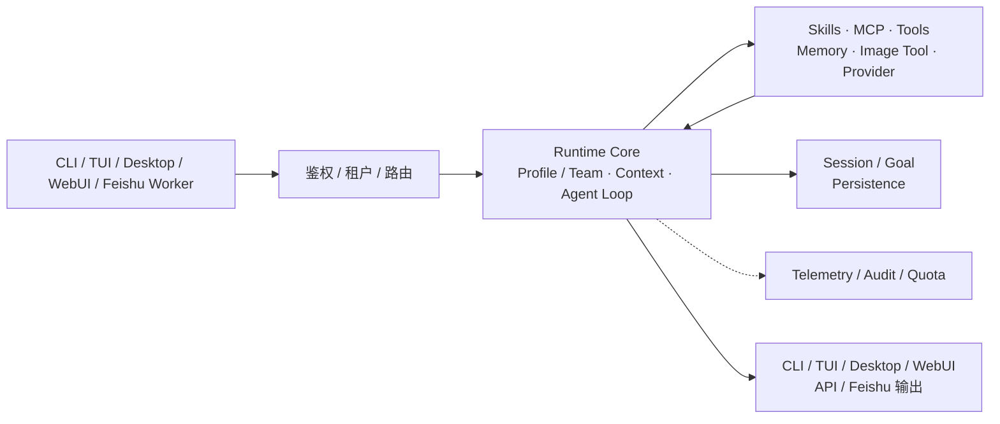

# go-e2e 技术与运维指南

go-e2e 是用 Go 实现的 Agent runtime，以可持续会话把需求、执行和验证连成端到端语义闭环。
产品概览、动态图与界面截图见 [README](README.md)；完整专题索引见 [docs/README.md](docs/README.md)。

## 产品架构

所有入口最终汇入同一套 Runtime Core。入口层负责接收请求，接入与治理层负责鉴权、
租户隔离和路由，Runtime Core 负责装配 Profile 和上下文，驱动 Agent Loop 调用
Provider、Skills、MCP、Tools、Memory 与 Image Tool，并通过权限、预算和完成检查决定
继续执行还是输出结果。Session、Goal、Transcript、Inbox、Outbox 等状态进入持久化，
Telemetry、Audit 和 Quota 记录运行过程与资源使用。



设置项的边界也按这条架构链划分：

| 对象 | 作用 |
| --- | --- |
| `Profile` | 定义一个智能体的身份、提示词、模型、工具、Skills、Memory、预算和权限 |
| `Team` | 定义多个 Profile 如何分工协作 |
| `Assignment` | 把租户、用户或入口映射到一个已发布的 Profile 版本 |
| `Feishu` | 管理外部飞书 Bot Account、群聊/私聊和消息适配 |
| `Worker` | 管理承载 Feishu 长连接的常驻进程，包括启停、健康和日志 |

因此，Profile 页面解决“智能体是什么”，Assignment 解决“谁使用它”，Feishu 解决“连接谁”，
Worker 解决“进程是否在线”。完整的分层图、小白解释和边界说明见
[产品架构总览](docs/architecture/agent_platform_architecture.md)；更细的渠道术语见
[Profile 与渠道术语](docs/architecture/agent_profile_channel_glossary.md)。

### Skills 管理边界

设置中心将 Skills 分成两层：本机 Skills 来自当前电脑、项目、插件、Marketplace
或 MCP 目录，提供发现和 `SKILL.md` 详情查看；租户 Skills 存在服务端租户数据中，
支持保存新版本、启用/停用、历史版本查看和回滚。本机目录可能属于用户项目或插件，
所以 WebUI 不提供任意文件删除；Marketplace/Plugin 的安装和卸载继续使用 CLI。

## 构建与安装

```bash
git clone https://github.com/konglong87/go-e2e.git
cd go-e2e
scripts/build.sh
bin/go-e2e --version
scripts/install.sh
```

Go 版本以 `go.mod` 为准。发布与本地构建共用 `scripts/build.sh` 注入版本信息。
主命令为 `go-e2e`；安装脚本保留 `golang-cc` 兼容副本供旧脚本过渡使用。
新增环境变量使用 `GO_E2E_*`，历史名称只作为兼容入口。

## 模型配置

唯一默认配置文件为 `~/.golang-cc/settings.json`，WebUI 2.0 与桌面端编辑同一文件。
目录暂不改名，避免破坏升级用户的配置。

```json
{
  "provider": "openai-compatible",
  "providerProtocol": "openai-chat-completions",
  "baseURL": "https://model.example.com/v1",
  "apiKey": "replace-me",
  "model": "model-id"
}
```

没有默认模型、默认服务地址或外部产品凭据回退。请使用你自己选择的服务。
完整字段、备用路由和 Responses 示例见 [全局配置指南](docs/examples/settings_quickstart.md)。
不要把真实密钥、提示词转储或私有会话提交到版本库。

显式 `--model`、`--provider`、`--settings` 可覆盖单次运行的选项；它们不修改全局文件。
默认不扫描项目配置，不自动读取其他产品的 API Key、OAuth Token 或模型设置。

## 运行入口

```bash
go-e2e                                  # 终端交互
go-e2e -p "检查 README 与实现是否一致"       # 单次任务
go-e2e --cwd /path/to/project -p "检查测试"
go-e2e -p "读取 go.mod" --output-format json
go-e2e -p "读取 go.mod" --output-format stream-json
go-e2e --bare -p "检查当前目录"             # 精简运行环境
go-e2e --help
go-e2e session --help
```

工作目录决定项目文件、指导文件、工具执行和上下文范围，模型配置仍来自全局文件。
`--bare` 禁用隐式上下文扩展并使用精简工具集，适用于受控评测。

## 连续会话评测

给三轮独立进程传递同一个 UUID：

```bash
go-e2e --session-id 11111111-1111-4111-8111-111111111111 -p "记住验收代号 BLUE-42"
go-e2e --session-id 11111111-1111-4111-8111-111111111111 -p "刚才的代号是什么？"
go-e2e --sessionId 11111111-1111-4111-8111-111111111111 -p "保留代号，再增加一个验收条件"
```

第一次创建会话，后续追加同一 transcript 并重放历史上下文，不是新建单轮对话。
`--sessionId` 是 `--session-id` 的别名。并发写同一 transcript 会被锁保护。
不应配合 `--no-session-persistence` 使用。

其他会话操作：

```bash
go-e2e --continue
go-e2e --resume <session-id>
go-e2e session list
go-e2e session inspect <session-id> --json
go-e2e session checkpoint <session-id> before-change
```

恢复、分叉、压缩和文件回退是不同操作，具体选项见对应命令的 `--help`。

## WebUI 与桌面端

```bash
scripts/webui-dev.sh
scripts/build-desktop-v2.sh
```

WebUI 2.0 的设置入口位于左侧导航底部、用户信息上方；二级设置中心复用同一视觉体系。
模型表单与 JSON 草稿同步，保存包含校验、冲突检测和读回确认。
设置覆盖模型、数据观测、Profile、背景、宠物、飞书与 Multi-Agent。

`desktop-v2` 是推荐的桌面实现，包含本地 sidecar、窗口状态管理和全屏菜单。
旧 `desktop` 仅保留历史兼容，不再扩展 UI 1.0。
构建与排障见 [desktop-v2/README.md](desktop-v2/README.md)。

宠物是 Blender 生成的 GLB，由 Three.js 渲染；无 WebGL 时显示同源渲染静态图。
可选形象包括 Go 伙伴与中国龙；宠物可在应用窗口内自由拖拽，点击可打开菜单关闭，
拖拽位置与关闭状态按设备保存在本地。
可复现资源脚本：

```bash
blender --background --python scripts/assets/build-companion.py
blender --background --python scripts/assets/build_chinese_dragon.py
blender --background --python scripts/assets/build-brand.py
```

品牌动画导出还需要 `ffmpeg`；中间帧自动清理。

## 服务与数据

```bash
go-e2e server --host 127.0.0.1 --port 8080
```

默认使用 SQLite，无需额外数据库服务。MySQL 是可选部署方案，由用户根据并发和运维需求选择。
桌面端不要求安装 MySQL。远程部署应配置认证并限制访问范围，不要把未认证的本地服务暴露到公网。

API、渠道 Worker、遥测与多租户说明见：

- [API 服务](docs/api_server.md)
- [Web Agent 启动与运维](docs/web_agent/web_agent_scripts.md)
- [脚本及验收分类](scripts/README.md)
- [渠道 Worker 运维](docs/architecture/channel_worker_screen_operations.md)

## 上下文与长期目标

`go-e2e.md` 是自有项目指导文件。运行时兼容外部项目指导文件格式，例如 `AGENTS.md`、
`CLAUDE.md` 和外部 memory 索引；这种兼容只涉及文件上下文，不涉及模型账号或配置。

```bash
go-e2e init
go-e2e memory lint --json
go-e2e goal start "修复测试并验证" --turn-budget 20 --token-budget 200000
go-e2e goal run <goal-id> --once
go-e2e goal status <goal-id>
```

`goal start` 只创建目标，执行需调用 `goal run`。持久化目标记录预算、检查点、事件和阻塞状态。
工具权限、沙箱、Skills、MCP、Hooks、Profile 与 Multi-Agent 都是可选能力；
以全局配置、具体命令帮助和 [专题文档索引](docs/README.md) 为准。

## 开发验证

```bash
go test ./...
go vet ./...
npm --prefix web run typecheck
npm --prefix web run test
npm --prefix web run build
npm --prefix web run test:e2e -- --project chromium-webui-v2-desktop
npm --prefix web run test:e2e -- --project chromium-webui-v2-mobile
```

真实模型、飞书与远程数据库测试需要用户配置的环境，不应把 mock 验收当成远程服务验收。
截图必须来自真实渲染的 UI；测试数据可用 fixture，但应与真实桌面截图分开标注。
协议适配层保留 Messages 与 OpenAI-compatible 协议实现，不把任何 SDK 厂商当作产品身份。

## 主要目录

| 路径 | 职责 |
| --- | --- |
| `cmd/go-e2e` | CLI 入口 |
| `internal/config` | 全局设置、配置校验 |
| `internal/query` | Agent 执行循环 |
| `internal/session` | 会话历史、恢复、锁 |
| `internal/server` | API 与设置服务 |
| `internal/anthropic` | 历史包名下的模型协议适配层 |
| `web/src/v2` | WebUI 2.0 |
| `desktop-v2` | 桌面宿主 |
| `scripts` | 构建、发布与验收 |
