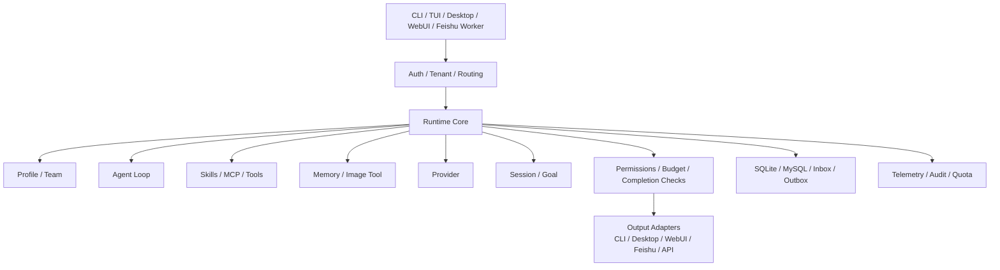

<p align="center">
  
</p>

<p align="center">
  <strong>go-e2e</strong>
</p>

<p align="center">
  Open-source desktop AI Agent for Desktop / TUI / CLI / WebUI
</p>

<p align="center">
  Local-first · Open to extension · One sentence to execution · End-to-end delivery
</p>

<p align="center">
  <a href="https://applink.feishu.cn/client/chat/chatter/add_by_link?link_token=55aq8d1d-7586-46cf-8635-a8c321ad284d">Join the Feishu community</a> ·
  <a href="docs/README.md">Documentation</a> ·
  <a href="https://github.com/konglong87/go-e2e/issues">Report an issue</a> ·
  English | <a href="README.md">简体中文</a>
</p>

<p align="center">
  <a href="https://github.com/konglong87/go-e2e/actions/workflows/ci.yml">
    
  </a>
  <a href="https://github.com/konglong87/go-e2e/actions/workflows/release.yml">
    
  </a>
  <a href="LICENSE">
    
  </a>
  
</p>

<p align="center">
  Desktop · TUI · CLI · WebUI · Feishu
</p>

<p align="center">
  
</p>

## Start Here

go-e2e is an open-source Agent workbench that can execute tasks, connect external tools,
preserve context, and deliver results continuously. Choose an entry point based on your
workflow:

| Entry point | Best for | Quick entry |
| --- | --- | --- |
| **Desktop** | Daily use, model configuration, sessions, and settings | `scripts/build-desktop-v2.sh` |
| **TUI / CLI** | Terminal interaction, scripts, and one-shot tasks | `go run ./cmd/go-e2e` |
| **WebUI** | Browser workspace, server deployments, and team usage | `scripts/webui-dev.sh` |
| **Feishu** | Feishu bots, channel sessions, and long-running workers | See the [Feishu channel documentation](docs/README.md) |

## Core Highlights

| Highlight | Capabilities | User value |
| --- | --- | --- |
| **Open-source desktop Agent with four surfaces** | Desktop / TUI / CLI / WebUI | Covers personal use, development, and team deployment |
| **Local-first with flexible deployment** | SQLite, local execution, private deployment, and MySQL | You control the data boundary and deployment environment |
| **Designed for extension** | Providers, tools, workflows, permissions, UI, and business logic | Customize the Agent for your own projects |
| **From one sentence to a delivered result** | Understand, plan, use tools, execute continuously, and verify | Supports complex tasks that need sustained execution |
| **Flexible providers and multiple models** | Custom providers, compatible APIs, multimodal and image extensions | Avoids lock-in to a single model vendor |
| **Go runtime with low deployment overhead** | Go runtime, local sidecar, and few external dependencies | Fast startup and straightforward deployment |

## In Short

go-e2e is a local-first, open-source desktop AI Agent covering Desktop, TUI, CLI, and WebUI.
It supports private deployment, executes tasks from natural-language requests, delivers verified
results, and connects to different model services through custom Providers.

## Product Loop

<p align="center">
  
</p>

<p align="center">
  From request input to tool execution, context continuity, and result delivery,
  go-e2e forms a continuous Agent work loop.
</p>

## Architecture Overview

All go-e2e entry points share the same runtime core. The runtime handles authentication,
tenant isolation, and entry routing, then composes Profiles, the Agent Loop, Skills, MCP,
Tools, Memory, Image Tools, and Providers. Results are adapted back to the terminal, desktop,
WebUI, API, or Feishu.



For a simple mental model: **Profile** defines how an Agent works, **Assignment** decides
which entry point uses which Profile, **Feishu** identifies the Feishu bot and conversation,
and **Worker** keeps that bot online. They are separate, reusable concepts. See the
[product architecture overview](docs/architecture/agent_platform_architecture.md) for the
complete diagram, layers, and configuration boundaries.

## Quick Start

### Toolchain

- The source code requires Go 1.25 or newer. Current `x/crypto`, `x/net`, and `x/sys` dependencies require Go 1.25.
- CI and release builds use Go 1.26.6 as the recommended toolchain with current security fixes; this does not raise the source minimum to Go 1.26.
- `.tool-versions` pins the reproducible build toolchain.

```bash
git clone https://github.com/konglong87/go-e2e.git
cd go-e2e
go run ./cmd/go-e2e --version
```

Configure the provider, API protocol, model, endpoint, and credentials in the settings page,
or edit:

```text
~/.golang-cc/settings.json
```

Minimal provider-neutral example:

```json
{
  "provider": "custom",
  "providerProtocol": "openai-chat-completions",
  "baseURL": "https://model.example.com/v1",
  "apiKey": "replace-me",
  "model": "model-id"
}
```

Start a task:

```bash
go run ./cmd/go-e2e -p "Inspect the current project structure"
```

Continue the same session:

```bash
go run ./cmd/go-e2e --session-id 11111111-1111-4111-8111-111111111111 -p "Remember the previous conclusion and continue checking tests"
go run ./cmd/go-e2e --sessionId 11111111-1111-4111-8111-111111111111 -p "Based on the previous result, suggest fixes"
```

## Desktop Downloads

Desktop installers are published through GitHub Releases. macOS provides Apple Silicon
(`arm64`) and Intel (`amd64`) DMGs, Windows provides an amd64 installer, and Linux desktop
packages and CLI archives are released alongside them. Verify downloaded files with the
`SHA256SUMS` file on the corresponding Release page.

If macOS says that the developer cannot be verified, the current build was not signed and
notarized with an Apple Developer ID. Move `go-e2e.app` to Applications, then open:

```text
System Settings -> Privacy & Security -> Security -> Open Anyway
```

After confirmation, launch the application again. Builds with Apple Developer secrets are
signed and notarized and normally do not require this step.

## Entry Points

| Scenario | Command |
| --- | --- |
| Interactive terminal | `go run ./cmd/go-e2e` |
| One-shot task | `go run ./cmd/go-e2e -p "..."` |
| Server | `go run ./cmd/go-e2e server` |
| Resume a session | `go run ./cmd/go-e2e --session-id <uuid> -p "..."` |
| WebUI 2.0 | `scripts/webui-dev.sh` |
| Desktop | `scripts/build-desktop-v2.sh` |

## Deployment and Models

| Topic | Supported approach | Suitable for |
| --- | --- | --- |
| Local database | SQLite, no additional service by default | Personal use, desktop, and local development |
| Service database | MySQL with optional multi-tenant, audit, and concurrency capabilities | Team deployment and server operation |
| Model integration | Custom Providers, compatible APIs, and Messages protocol adapters | Connecting different model services |
| Model configuration | Shared `~/.golang-cc/settings.json` for WebUI and Desktop | Managing providers, endpoints, models, and credentials in one place |

The desktop application does not require MySQL. For remote deployment, configure
authentication and restrict network access appropriately.

## Capability Map

go-e2e is more than a chat interface. It is an Agent workbench that executes tasks, connects
external tools, preserves context, and delivers results continuously.

| Area | Supported capabilities | User value |
| --- | --- | --- |
| Agent execution | Tool calls, file operations, command execution, code search, LSP, and Workflows | Operate on a project and complete real tasks |
| Skills | Project, user, plugin, Marketplace, and MCP Skills | Add specialized capabilities on demand |
| MCP | External tools, databases, knowledge bases, and enterprise services | Connect existing work systems |
| Project context | `go-e2e.md`; compatible with `AGENTS.md`, `CLAUDE.md`, and `.claude/` rules | Follow project conventions and workflows |
| Project Memory | `MEMORY.md` index, linked Markdown memories, and project-level recall | Keep useful project context across tasks |
| Memory governance | Long-term memory, automatic memory review, and team/managed scopes | Control memory sources and their effective scope |
| Session / Goal | Session resume, Checkpoints, Rewind, long-running Goals, and background execution | Keep long tasks running across processes |
| Tools | Bash, file I/O, search, browser, WebFetch, WebSearch, and image generation | Cover development, research, and automation |
| Profiles / Multi-Agent | Agent Profiles, Teams, sub-agents, and task orchestration | Divide complex work among specialized Agents |
| Providers | Custom Providers, multiple models, compatible APIs, and multimodal extensions | Avoid dependence on one model vendor |
| Permissions and security | Approval flows, Sandbox, path boundaries, network policy, and audit | Control what the Agent can do |
| Desktop experience | Companion selection, backgrounds, themes, window state, and settings center | Build a personalized desktop workspace |
| Deployment and observability | SQLite, MySQL, Trace, Telemetry, Usage, and logs | Support local, private, and team deployments |

> Some capabilities require a configured Provider, MCP Server, external credentials, or database.
> This table describes the supported surface, not the default enabled configuration.

## Module Capability Implementation Progress

The table below is a snapshot based on the current code, tests, and architecture documents. It distinguishes capabilities that already have a working foundation from those that still need validation in a real environment.

Snapshot: **2026-09-24** · Code baseline: `fdc3497`

| Module | Progress | Implemented today | Current boundary | Main code entry points |
| --- | --- | --- | --- | --- |
| Agent loop | ✅ Implemented | Multi-turn interaction, tool calls, result feedback, context compaction, cancellation, and budget controls | Long-running tasks still need continued real-world acceptance across entry points | `internal/query/`, `internal/agentruntime/` |
| Context management | ✅ Mature foundation | Project rules, runtime state, tool results, memory, summaries, and session history can be composed into model context | Long-task context quality still needs more regression cases | `internal/query/`, `internal/memory/`, `internal/compact/` |
| Tool system | ✅ Implemented | Common tool interface, registry, input validation, concurrency boundaries, result limits, and dynamic tool loading | Tool discovery and context cost need continued optimization as the catalog grows | `internal/tools/`, `internal/toolpolicy/` |
| Skills | ✅ Mature foundation | Project, user, plugin, Marketplace, MCP, and tenant Skills; on-demand loading, tool restrictions, isolated contexts, hooks, and path matching | More cross-surface acceptance is needed across CLI, TUI, WebUI, and tenant flows | `internal/skills/`, `internal/tools/skill/`, `internal/plugins/` |
| MCP | ✅ Mature foundation | stdio and Streamable HTTP; tool discovery and calls, resource reads, prompt loading, callbacks, and permission confirmation | Legacy HTTP+SSE is not supported; full E2E with external MCP Servers still needs more coverage | `internal/mcp/`, `internal/tools/mcpresources/` |
| Memory | ✅ Implemented | Project rules, user preferences, team memory, automatic memory, and project recall with scope and size limits | The current focus is document-based memory, not a complete vector knowledge base | `internal/memory/`, `internal/session/` |
| Planning / Goals | ✅ Implemented | Goals, steps, dependencies, risks, acceptance criteria, budgets, pause, resume, and blocked states | More complex cross-system plans need additional real-task coverage | `internal/goal/`, `internal/tools/planmode/`, `internal/tools/todowrite/` |
| Evidence | 🟡 Foundation implemented | Stores tool traces, tests, commands, Git, API, database, and artifact evidence; acceptance criteria can block unsupported completion | Tool success does not always prove business success; evidence trust levels and stronger independent verifiers are still needed | `internal/goal/evidence.go`, `internal/goal/evaluator.go` |
| Reflection and recovery | 🟡 Partially implemented | Result evaluation, retries, blocker detection, capability follow-ups, and recovery after compaction | Ordinary conversations do not yet run an independent check-repair-reverify loop on every turn | `internal/goal/evaluator.go`, `internal/repair/` |
| Multi-Agent / A2A | ✅ Mature foundation | Create, inspect, stop, and message sub-agents with task storage, events, cancellation, progress, and budget boundaries | Cross-organization A2A is not the current primary path | `internal/agentruntime/`, `internal/agenttasks/`, `internal/tools/agent/` |
| Human-in-the-loop | ✅ Implemented | User questions, permission confirmation, pause/wait, resume, and interaction results | High-risk actions still need real interactive acceptance for each entry point | `internal/tools/askuserquestion/`, `internal/permissions/`, `internal/pendinginput/` |
| Permissions and safety | ✅ Mature foundation | Tool approval, dangerous-command detection, directory and sensitive-path limits, network policy, sandboxing, and audit records | Security behavior still needs ongoing adversarial regression testing | `internal/permissions/`, `internal/sandbox/`, `internal/tools/guarded.go` |
| Evaluation and observability | 🟡 Foundation implemented | Tests, Goldens, runtime traces, Trace, Telemetry, behavior evaluation, and capability scorecard scripts | Stable task sets, independent verifiers, Pass@k / Pass^k, and first-error analysis still need to be added | `internal/agenteval/`, `internal/observability/`, `scripts/` |
| Computer Use | 🟡 Architecture and backend foundation implemented | Session state, screenshot observation, action receipts, permission gates, Fake Backend, macOS native helper, and Go adapter | Service composition, desktop entry-point wiring, real click/screenshot acceptance, and the full evidence loop still need E2E validation | `internal/computeruse/`, `internal/computerbackend/`, `internal/tools/computeruse/`, `native/macos/` |
| RAG / knowledge retrieval | 🟡 Partially implemented | File, web, and project-context retrieval can feed results back into the Agent | It is not yet a full vector-index, semantic-retrieval, reranking, and source-citation pipeline | `internal/memory/`, `internal/tools/websearch/`, `internal/tools/webfetch/` |
| Continual evolution | 🟡 Partially implemented | Project memory, runtime experience, Skills, and evaluation results can be retained | There is not yet a complete automatic loop that turns trajectories into knowledge, programs, or model updates | `internal/memory/`, `internal/skills/`, `internal/agenteval/` |

> “Implemented” means that the capability exists in the code and tests. It does not mean that every external Provider, MCP Server, database, or desktop permission is configured by default.

### Skills Management

The Desktop and WebUI `Settings -> Skills` view separates two types of Skills:

| Type | Settings support | Safety boundary |
| --- | --- | --- |
| **Local Skills** | View source, path, and `SKILL.md` details | Read-only; does not directly delete files from project, user, or plugin directories |
| **Tenant Skills** | Create/update, view, enable/disable, inspect history, and roll back | Only affects the current tenant and preserves version history |

In the settings view, “view” means inspecting the Skill there. Installing or updating a tenant
Skill saves a tenant-scoped version; uninstalling it means disabling it. Local Marketplace or
Plugin file installation/removal remains a CLI operation such as `skills install`, `plugins install`,
or `plugins remove`, which avoids accidental deletion of local user files. Local Skills are files
on the computer; tenant Skills are server-side runtime versions.

## Multi-Surface Experience

### WebUI 2.0

<p align="center">
  
</p>

<p align="center">
  Sessions, tools, permissions, models, Profiles, Memory, and runtime status are managed in one Web workspace.
</p>

<details>
<summary>Extension capabilities: Skills, MCP, Hooks, and Plugins</summary>

- **Skills**: Load project, user, plugin, Marketplace, and MCP Skills on demand to reduce default context cost.
- **MCP**: Connect external tools and services while using the Agent's permission and runtime boundaries.
- **Hooks**: Inject custom logic at Agent, Tool, and task lifecycle points.
- **Plugins**: Extend tools, Skills, Output Styles, models, and runtime behavior.
- **Profiles**: Combine prompts, context, models, tools, and permission policies for different tasks.
- **Multi-Agent**: Split subtasks and coordinate multiple Agents on complex work.

</details>

<details>
<summary>Memory and long-running tasks</summary>

- **Project guidance**: Reads `go-e2e.md` by default and supports `AGENTS.md`, `CLAUDE.md`, `.claude/CLAUDE.md`, and `.claude/rules/*.md`.
- **Project Memory**: Uses `MEMORY.md` as an index, recalls linked project memories, and enforces path, size, and recall limits.
- **Persistent Sessions**: Continue the same session across processes with messages, tool calls, and task context.
- **Memory**: Store project rules, long-term preferences, and reusable context with review and governance.
- **Goals**: Create, run, inspect, pause, resume, and record long-running goals.
- **Checkpoint / Rewind**: Save checkpoints at important points and recover, rewind, or branch sessions.
- **Context management**: Control long-task context size through compression, structured summaries, and evidence links.

</details>

<details>
<summary>Tools, permissions, and safety</summary>

- **Development tools**: File reading, editing, Glob, Grep, Bash, Workflow, and LSP.
- **Network tools**: WebFetch, WebSearch, browser automation, and external service calls.
- **Multimodal tools**: Image attachments, image generation, and visual task extensions.
- **Permission control**: Tool approval, permission sources, dangerous-operation detection, and audit records.
- **Sandbox**: Workspace, extra directories, sensitive paths, network, and command execution boundaries.
- **Observability**: Runtime logs, Trace, Usage, Telemetry, and task event replay.

</details>

<details>
<summary>Desktop workspace and personalization</summary>

- **Desktop**: Native `desktop-v2` workspace with a local sidecar and readiness checks.
- **Companions**: Go Companion, Chinese Dragon, and draggable desktop characters.
- **Backgrounds**: Background and visual theme configuration for different work environments.
- **Window state**: Persist window position, size, maximized state, and fullscreen state.
- **Settings center**: Manage models, Providers, Profiles, backgrounds, companions, observability, and Multi-Agent settings.
- **Local data**: SQLite by default, with optional MySQL for team capabilities.

</details>

### Channel Session Identification

The Desktop session list labels the message source next to the title, helping distinguish
regular desktop sessions from channel sessions. Feishu channel sessions are currently supported:

| Session source | List label | Tooltip |
| --- | --- | --- |
| Regular desktop session | No channel label | Source: desktop session |
| Feishu channel session | Feishu | Source: Feishu channel |

<p align="center">
  
</p>

The screenshot shows the Feishu channel label in the Desktop session list. Future channels can
reuse the same source-identification pattern.

For the complete product architecture, including channels, tenants, Runtime Core, Agent Loop,
capability plugins, persistence, telemetry, audit, and output adapters, see:

- [Product architecture overview](docs/architecture/agent_platform_architecture.md)
- [Mermaid architecture source](diagrams/agent-platform-architecture.mmd)

## Community and Feedback

- **Feishu community**: [Join the go-e2e Chinese community](https://applink.feishu.cn/client/chat/chatter/add_by_link?link_token=55aq8d1d-7586-46cf-8635-a8c321ad284d). Eligibility is subject to the access rules shown by Feishu.
- **Issues**: Use [GitHub Issues](https://github.com/konglong87/go-e2e/issues) for bugs and feature requests.
- **Security**: Read the [security policy](SECURITY.md). Do not post sensitive vulnerability details in public Issues.
- **Contributing**: Read the [contribution guide](CONTRIBUTING.md) before submitting code.

## Documentation

- [Detailed technical notes](README.detailed.md)
- [Documentation index](docs/README.md)
- [Desktop notes](desktop-v2/README.md)
- [Settings quick start](docs/examples/settings_quickstart.md)

## License

Apache-2.0
