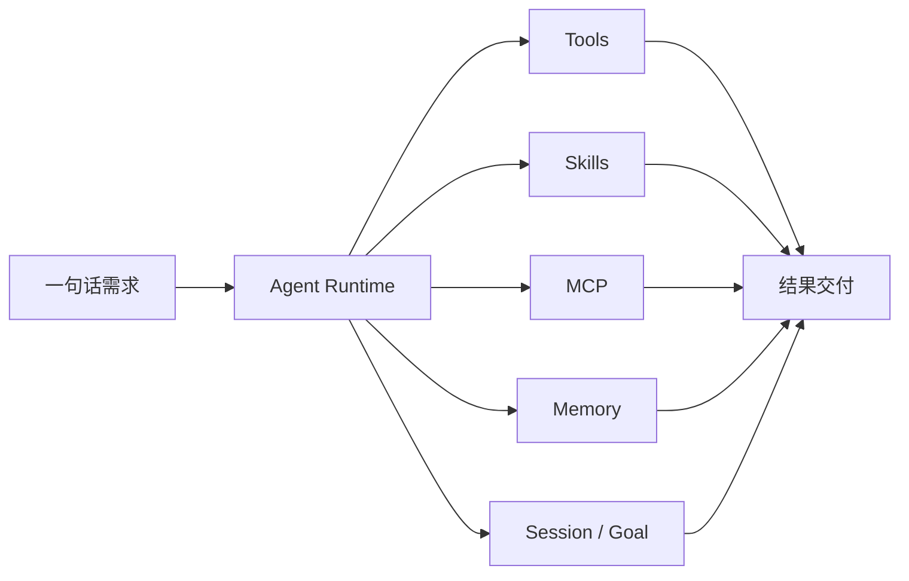

# go-e2e

面向全端的开源桌面级 Agent：覆盖桌面端、TUI、CLI 和 WebUI，
本地优先、支持私有化部署，从一句话需求出发持续执行并交付结果。

<p align="center">
  
</p>

<p align="center">
  
</p>

<p align="center">
  
</p>

## 六大核心亮点

**1. 开源桌面级 Agent，四端覆盖**

同时支持桌面端、TUI、CLI 和 WebUI，适合个人使用、开发调试和团队部署。

**2. 本地优先，部署方式自由**

默认支持本地运行和 SQLite，也支持私有化部署及 MySQL，数据边界和部署环境由用户掌控。

**3. 开放源码，方便二次开发**

模型、Provider、工具链、工作流、权限、界面和业务逻辑均可扩展。

**4. 从一句话到结果交付**

Agent 可以理解目标、拆解任务、调用工具、持续执行，并在同一会话中恢复上下文。

**5. Provider 自由接入，多模型扩展**

支持自定义 Provider 和兼容 API 的模型，也为多模态、画图等能力保留扩展空间。

**6. Go 内核，轻量高效**

使用 Go runtime 构建，启动和运行开销较低，适合本地长期运行与私有化部署。

## 一句话版

开源桌面级 Agent，覆盖桌面端、TUI、CLI 和 WebUI；本地优先、支持私有化部署，
能够从一句话需求出发完成任务执行与结果交付，并通过自定义 Provider 接入不同模型。

## 能力概览

- WebUI 2.0 与 `desktop-v2`：窄导航设置中心、模型、Profile、背景、3D 宠物、数据观测、飞书和 Multi-Agent。
- 会话标题支持三个点菜单和卡片右键修改，原位编辑并持久化；见[演示截图与验收记录](docs/webui/session-title-rename.md)。
- 连续评测：`--session-id` 可重复进入同一会话，追加对话并保留历史上下文；`--sessionId` 同样兼容。
- Provider-neutral 配置：模型、地址和凭据只从全局 `~/.golang-cc/settings.json` 读取，设置页面编辑的也是同一个文件。
- 数据库按部署场景选择：默认 SQLite，无需额外服务；需要多租户、审计和并发服务能力时可选 MySQL。
- 兼容外部项目指导文件格式：可读取 `go-e2e.md`、`AGENTS.md`、`CLAUDE.md` 等文件上下文，但不会读取外部模型配置或 API Key。

## 快速开始

### 工具链要求

- 源码最低要求 Go 1.25+。当前依赖图中 `x/crypto`、`x/net` 和 `x/sys` 等版本的最低要求是 Go 1.25。
- CI 与 release 默认使用 Go 1.26.6，作为包含最新安全修复的推荐构建工具链，不代表源码必须使用 Go 1.26。
- `.tool-versions` 中的 Go 版本是可复现构建 pin，不是源码最低版本。

```bash
git clone https://github.com/konglong87/go-e2e.git
cd go-e2e
go run ./cmd/go-e2e --version
```

在设置页面填写 provider、API 协议、模型、地址和凭据，或直接编辑：

```text
~/.golang-cc/settings.json
```

最小 provider-neutral 示例：

```json
{
  "provider": "custom",
  "providerProtocol": "openai-chat-completions",
  "baseURL": "https://model.example.com/v1",
  "apiKey": "replace-me",
  "model": "model-id"
}
```

开始一次任务：

```bash
go run ./cmd/go-e2e -p "检查当前项目结构"
```

继续同一会话：

```bash
go run ./cmd/go-e2e --session-id 11111111-1111-4111-8111-111111111111 -p "记住刚才的结论，并继续检查测试"
go run ./cmd/go-e2e --sessionId 11111111-1111-4111-8111-111111111111 -p "基于上一轮结果给出修复建议"
```

## 运行入口

| 场景 | 命令 |
| --- | --- |
| 终端交互 | `go run ./cmd/go-e2e` |
| 一次性任务 | `go run ./cmd/go-e2e -p "..."` |
| 服务端 | `go run ./cmd/go-e2e server` |
| 会话恢复 | `go run ./cmd/go-e2e --session-id <uuid> -p "..."` |
| WebUI 2.0 | `scripts/webui-dev.sh` |
| 桌面端 | `scripts/build-desktop-v2.sh` |

## 数据库

默认使用 SQLite，无需额外服务。需要多租户、审计、并发服务能力时，可选择 MySQL。数据库由用户根据部署场景自行选择，桌面端不会强制安装 MySQL。

## Provider 边界

运行时保留 Messages 协议和对应 SDK 适配层，作为独立的兼容 provider；产品默认配置、推荐文案和示例均保持 provider-neutral，不绑定任何单一模型厂商。

## 能力全景

go-e2e 不只是一个聊天界面，而是一套可以执行任务、连接外部工具、保留上下文并持续交付结果的 Agent 工作台。

| 能力领域 | 支持内容 | 用户收益 |
| --- | --- | --- |
| Agent 执行 | 工具调用、文件操作、命令执行、代码搜索、LSP、Workflow | 真正操作项目并完成任务 |
| Skills | 项目 Skills、用户 Skills、插件 Skills、Marketplace Skills | 按需扩展 Agent 的专业能力 |
| MCP | 外部工具、数据库、知识库和企业服务接入 | 连接已有工作系统 |
| Memory | 项目规则、长期记忆、自动记忆审核和上下文管理 | 让 Agent 更懂项目与用户偏好 |
| Session / Goal | 会话恢复、Checkpoint、Rewind、长期 Goal 和后台运行 | 支持跨进程和长任务持续执行 |
| Tools | Bash、文件读写、搜索、浏览器、WebFetch、WebSearch、图片生成 | 覆盖开发、研究和自动化场景 |
| Profile / Multi-Agent | Agent Profile、Teams、子 Agent 和任务编排 | 针对不同任务进行分工协作 |
| Provider | 自定义 Provider、多模型、兼容 API 和多模态扩展 | 不绑定单一模型厂商 |
| 权限与安全 | 权限审批、Sandbox、路径边界、网络策略和审计 | 控制 Agent 可以做什么 |
| 桌面体验 | 宠物选择、桌面背景、主题、窗口状态和设置中心 | 打造个性化桌面工作台 |
| 部署与观测 | SQLite、MySQL、Trace、Telemetry、Usage 和日志 | 适合本地、私有化和团队部署 |

> 部分能力需要用户配置 Provider、MCP Server、外部凭据或数据库；这里列出的是系统支持范围，不代表所有扩展默认启用。

<details>
<summary>展开查看扩展能力：Skills、MCP、Hooks 与 Plugins</summary>

- **Skills**：按需加载项目、用户、插件、Marketplace 和 MCP 来源的技能，减少默认上下文开销。
- **MCP**：连接外部工具和服务，并沿用 Agent 的权限审批与运行边界。
- **Hooks**：在 Agent、Tool 和任务生命周期节点注入自定义逻辑。
- **Plugins**：扩展工具、Skills、Output Style、模型和运行行为。
- **Profile**：为不同任务组合提示词、上下文、模型、工具和权限策略。
- **Multi-Agent**：拆分子任务，由多个 Agent 协同完成复杂工作。

</details>

<details>
<summary>展开查看记忆与长任务能力</summary>

- **持久化 Session**：跨进程继续同一会话，保留消息、工具调用和任务上下文。
- **Memory**：保存项目规则、长期偏好和可复用上下文，并支持审核与治理。
- **Goal**：创建目标、持续运行、查看状态、暂停、恢复和记录事件。
- **Checkpoint / Rewind**：在关键节点保存检查点，支持会话恢复、回退和分叉。
- **Context 管理**：通过压缩、结构化摘要和证据关联控制长任务上下文规模。

</details>

<details>
<summary>展开查看工具、权限与安全能力</summary>

- **开发工具**：文件读取、文件编辑、Glob、Grep、Bash、Workflow 和 LSP。
- **网络工具**：WebFetch、WebSearch、浏览器自动化和外部服务调用。
- **多模态工具**：图片附件、图片生成和视觉任务扩展。
- **权限控制**：工具审批、权限来源、危险操作识别和审计记录。
- **Sandbox**：工作目录、额外目录、敏感路径、网络和命令执行边界。
- **可观测性**：运行日志、Trace、Usage、Telemetry 和任务事件回放。

</details>

<details>
<summary>展开查看桌面工作台与个性化能力</summary>

- **桌面端**：基于 `desktop-v2` 的原生桌面工作台，支持本地 sidecar 和就绪检查。
- **宠物选择**：支持 Go 伙伴、中国龙等桌面形象，并可在窗口内拖拽。
- **桌面背景**：支持背景和视觉主题配置，适配不同工作环境。
- **窗口状态**：保存窗口位置、尺寸、最大化和全屏状态。
- **设置中心**：集中管理模型、Provider、Profile、背景、宠物、观测和 Multi-Agent。
- **本地数据**：默认 SQLite，无需额外服务；需要团队能力时可选 MySQL。

</details>



## 文档

- [详细技术说明](README.detailed.md)
- [文档索引](docs/README.md)
- [桌面端说明](desktop-v2/README.md)
- [全局设置示例](docs/examples/settings_quickstart.md)

## License

Apache-2.0
