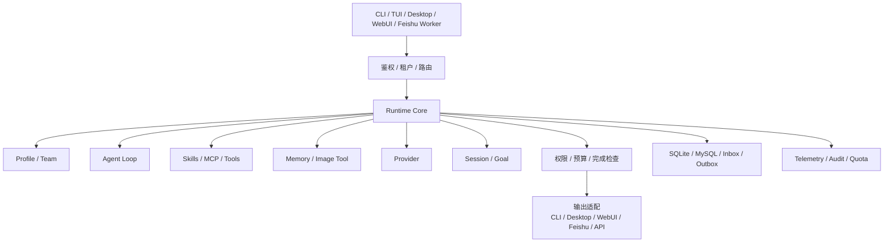
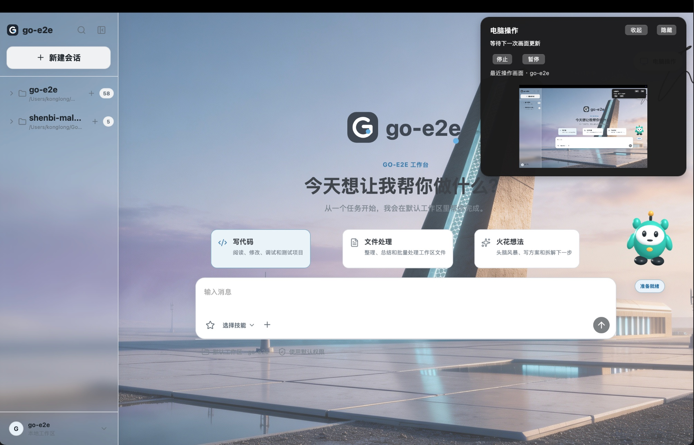
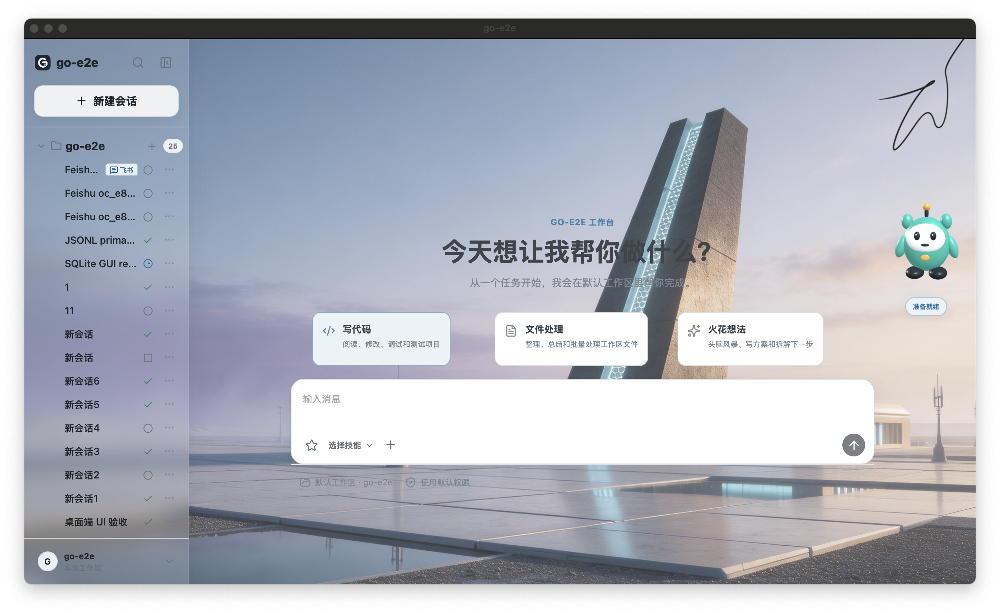

<p align="center">
  
</p>

<p align="center">
  <strong>go-e2e</strong>
</p>

<p align="center">
  go-e2e 是基于 Go 开发的开源全功能 Coding Agent，覆盖桌面Desktop、TUI、CLI 和网页端WebUI，集成代码编辑、命令执行、任务规划、记忆与多智能体协作。支持 Skills、MCP 和多模型接入，本地优先、灵活扩展，可连接飞书渠道，always on，适合日常开发，也适合学习和实践 Agent 开发。
</p>

<p align="center">
  本地部署 · 开放扩展 · 自主可控 · 端到端交付
</p>

<p align="center">
  <a href="https://applink.feishu.cn/client/chat/chatter/add_by_link?link_token=55aq8d1d-7586-46cf-8635-a8c321ad284d">加入飞书社群</a> ·
  <a href="docs/README.md">文档</a> ·
  <a href="https://github.com/konglong87/go-e2e/issues">问题反馈</a> ·
  <a href="README.en.md">English</a>
</p>

<p align="center">
  <a href="https://github.com/konglong87/go-e2e/actions/workflows/ci.yml">
    
  </a>
  <a href="https://github.com/konglong87/go-e2e/actions/workflows/release.yml">
    
  </a>
  <a href="LICENSE">
    
  </a>
  
</p>

<p align="center">
  Desktop · TUI · CLI · WebUI · Feishu
</p>

<p align="center">
  
</p>

## 六大核心

- **四端覆盖**：Desktop / TUI / CLI / WebUI / 飞书，个人、开发与团队部署都能覆盖
- **本地优先，部署自由**：SQLite 默认、本地运行，也支持私有化部署和 MySQL
- **开放源码，便于二开**：Provider、工具链、工作流、权限、界面和业务逻辑均可扩展
- **从一句话到结果交付**：理解需求、拆解任务、调用工具、持续执行、结果验证
- **Provider 自由接入**：自定义 Provider、兼容 API、多模态扩展，不绑定单一模型厂商
- **Go 内核，轻量高效**：启动快、依赖少，适合长期运行

## 快速开始

源码最低要求 Go 1.25+（CI/release 默认使用 Go 1.26.6，`.tool-versions` 是可复现构建 pin，不是源码最低版本）。

```bash
git clone https://github.com/konglong87/go-e2e.git
cd go-e2e
go run ./cmd/go-e2e --version
```

在设置页面填写 provider、API 协议、模型、地址和凭据，或直接编辑 `~/.golang-cc/settings.json`：

```json
{
  "provider": "custom",
  "providerProtocol": "openai-chat-completions",
  "baseURL": "https://model.example.com/v1",
  "apiKey": "replace-me",
  "model": "model-id"
}
```

开始一次任务：

```bash
go run ./cmd/go-e2e -p "检查当前项目结构"
```

继续同一会话：

```bash
go run ./cmd/go-e2e --session-id 11111111-1111-4111-8111-111111111111 -p "记住刚才的结论，并继续检查测试"
```

> 其他运行入口见[运行入口](#运行入口)；飞书 Worker 见[飞书渠道文档](docs/README.md)。

## 下载桌面端

前往 GitHub [Releases 页面](https://github.com/konglong87/go-e2e/releases/latest) 下载最新桌面端安装包。

| 平台 | 安装包 | 说明 |
| --- | --- | --- |
| macOS Apple Silicon | `go-e2e-<版本>-macos-arm64.dmg` | 适用于 Apple Silicon（M1/M2/M3/M4）|
| macOS Intel | `go-e2e-<版本>-macos-amd64.dmg` | 适用于 Intel Mac |
| Windows | `go-e2e-setup.exe` | Windows 安装程序 |
| Linux x86_64 | `go-e2e-desktop_<版本>_linux_amd64.tar.gz` | Linux 桌面端压缩包 |

下载后可使用同一页面中的 `SHA256SUMS` 校验文件完整性。macOS 首次打开如果提示无法验证开发者，表示当前版本未使用 Apple Developer ID 签名和 notarization。请先将 `go-e2e.app` 拖入“应用程序”，然后打开：

```text
系统设置 → 隐私与安全性 → 安全性 → 仍要打开
```

确认后重新打开应用即可。配置了 Apple Developer Secrets 的版本会自动签名并完成 notarization，通常不需要这一步。

## 产品闭环

<p align="center">
  
</p>

<p align="center">
  从需求输入到工具执行、上下文延续和结果交付，形成可持续的 Agent 工作闭环。
</p>

## 架构总览

go-e2e 的不同入口共享同一套运行时核心：先完成鉴权、租户隔离和入口路由，
再由 Runtime Core 组合 Profile、Agent Loop、Skills、MCP、Tools、Memory、Image Tool
和 Provider，最后把结果适配回终端、桌面、WebUI、API 或飞书。



小白可以这样理解：**Profile** 定义“智能体怎么工作”，**Assignment** 决定“哪个入口使用
哪个 Profile”，**Feishu** 表示连接哪个飞书机器人，**Worker** 则是让这个机器人持续在线的进程。
它们不是重复设置。完整图例、分层说明和设置项边界见
[产品架构总览](docs/architecture/agent_platform_architecture.md)。

## 运行入口

| 场景 | 命令 |
| --- | --- |
| 终端交互 | `go run ./cmd/go-e2e` |
| 一次性任务 | `go run ./cmd/go-e2e -p "..."` |
| 服务端 | `go run ./cmd/go-e2e server` |
| 会话恢复 | `go run ./cmd/go-e2e --session-id <uuid> -p "..."` |
| WebUI 2.0 | `scripts/webui-dev.sh` |
| 桌面端 | `scripts/build-desktop-v2.sh` |
| 飞书 Worker | 见[飞书渠道文档](docs/README.md) |

## 部署与模型

| 主题 | 支持方式 | 适用场景 |
| --- | --- | --- |
| 本地数据库 | SQLite，默认无需额外服务 | 个人使用、桌面端和本地开发 |
| 服务化数据库 | MySQL，可选多租户、审计和并发能力 | 团队部署和服务端运行 |
| 模型接入 | 自定义 Provider、兼容 API、Messages 协议适配 | 接入不同模型服务 |
| 模型配置 | 全局 `~/.golang-cc/settings.json`，WebUI 与桌面端共用 | 统一管理 Provider、地址、模型和凭据 |

桌面端不会强制安装 MySQL；远程部署时应配置认证并限制访问范围。

## 能力全景

go-e2e 不只是一个聊天界面，而是一套可以执行任务、连接外部工具、保留上下文并持续交付结果的 Agent 工作台。

| 能力领域 | 支持内容 | 用户收益 |
| --- | --- | --- |
| Agent 执行 | 工具调用、文件操作、命令执行、代码搜索、LSP、Workflow | 真正操作项目并完成任务 |
| Skills | 项目 Skills、用户 Skills、插件 Skills、Marketplace Skills | 按需扩展 Agent 的专业能力 |
| MCP | 外部工具、数据库、知识库和企业服务接入 | 连接已有工作系统 |
| 项目上下文 | 默认 `go-e2e.md`；兼容 `AGENTS.md`、`CLAUDE.md`、`.claude/` 规则 | 遵循项目约定和工作流程 |
| 项目级 Memory | `MEMORY.md` 索引、关联 Markdown 记忆文件、项目级召回 | 持续理解项目规则和历史经验 |
| Memory 治理 | 长期记忆、自动记忆审核、团队/托管范围记忆 | 控制记忆来源和有效范围 |
| Session / Goal | 会话恢复、Checkpoint、Rewind、长期 Goal 和后台运行 | 支持跨进程和长任务持续执行 |
| Tools | Bash、文件读写、搜索、浏览器、WebFetch、WebSearch、图片生成 | 覆盖开发、研究和自动化场景 |
| Profile / Multi-Agent | Agent Profile、Teams、子 Agent 和任务编排 | 针对不同任务进行分工协作 |
| Provider | 自定义 Provider、多模型、兼容 API 和多模态扩展 | 不绑定单一模型厂商 |
| 权限与安全 | 权限审批、Sandbox、路径边界、网络策略和审计 | 控制 Agent 可以做什么 |
| 桌面体验 | 宠物选择、桌面背景、主题、窗口状态和设置中心 | 打造个性化桌面工作台 |
| 部署与观测 | SQLite、MySQL、Trace、Telemetry、Usage 和日志 | 适合本地、私有化和团队部署 |

> 部分能力需要用户配置 Provider、MCP Server、外部凭据或数据库；这里列出的是系统支持范围，不代表所有扩展默认启用。

## 模块能力实现进度

下面的表格是基于当前代码、测试和架构文档整理的能力快照，帮助读者区分“已经具备的基础能力”和“仍需要真实环境验收的部分”。

审查快照：**2026-09-24** · 代码基线：`fdc3497`

| 模块 | 进度 | 已经实现 | 当前边界 | 主要代码入口 |
| --- | --- | --- | --- | --- |
| Agent 主循环 | ✅ 已实现 | 多轮对话、工具调用、结果回灌、上下文压缩、取消和预算控制 | 不同入口下的长任务仍需要持续做真实验收 | `internal/query/`、`internal/agentruntime/` |
| 上下文管理 | ✅ 较完整 | 项目规则、运行状态、工具结果、记忆、摘要和历史会话可以组合进模型上下文 | 超长任务的上下文质量仍需要更多回归样本 | `internal/query/`、`internal/memory/`、`internal/compact/` |
| Tool 工具体系 | ✅ 已实现 | 统一工具接口、工具注册、参数校验、并发边界、结果大小限制和动态工具接入 | 工具数量增加后，还需要继续优化发现和上下文成本 | `internal/tools/`、`internal/toolpolicy/` |
| Skill 技能 | ✅ 较完整 | 支持项目、用户、插件、Marketplace、MCP 和租户 Skill；支持按需加载、工具限制、独立上下文、Hooks 和路径匹配 | 需要继续补充跨 CLI、TUI、WebUI 和租户场景的真实验收 | `internal/skills/`、`internal/tools/skill/`、`internal/plugins/` |
| MCP 外部工具协议 | ✅ 较完整 | 支持 stdio 和 Streamable HTTP，可发现并调用工具、读取资源、加载提示模板，也支持回调和权限确认 | 旧版 HTTP+SSE 尚未支持；外部真实 MCP Server 的完整 E2E 仍需补充 | `internal/mcp/`、`internal/tools/mcpresources/` |
| Memory 记忆 | ✅ 已实现 | 项目规则、用户偏好、团队记忆、自动记忆和项目记忆召回，并带有范围和大小限制 | 当前重点是文档型记忆，不等同于完整的向量知识库 | `internal/memory/`、`internal/session/` |
| Planning / Goal 任务规划 | ✅ 已实现 | 目标、步骤、依赖、风险、验收条件、预算、暂停、恢复和阻塞状态 | 更复杂的跨系统计划仍需要更多真实任务样本 | `internal/goal/`、`internal/tools/planmode/`、`internal/tools/todowrite/` |
| Evidence 结果证据 | 🟡 基础能力已实现 | 保存工具轨迹、测试、命令、Git、API、数据库和产物证据，并用验收条件阻止无证据完成 | 工具成功不一定代表业务目标成功；还需要证据可信等级和更强的独立验证器 | `internal/goal/evidence.go`、`internal/goal/evaluator.go` |
| Reflection 复盘与纠错 | 🟡 部分实现 | 有结果评估、失败重试、阻塞判断、能力跟进和压缩后恢复 | 普通对话并不是每一轮都经过独立的“检查—修复—再验证”循环 | `internal/goal/evaluator.go`、`internal/repair/` |
| Multi-Agent / A2A 多智能体协作 | ✅ 较完整 | 支持创建、查询、停止和互相发消息，具备任务存储、事件、取消、进度和预算边界 | 跨组织 A2A 协议仍不是当前主路径 | `internal/agentruntime/`、`internal/agenttasks/`、`internal/tools/agent/` |
| 人机协作 | ✅ 已实现 | 用户提问、权限确认、暂停等待、恢复和交互结果回传 | 高风险动作仍需要结合具体入口做真实交互验收 | `internal/tools/askuserquestion/`、`internal/permissions/`、`internal/pendinginput/` |
| 权限与安全边界 | ✅ 较完整 | 工具审批、危险命令识别、目录和敏感路径限制、网络策略、沙箱和审计 | 安全能力的最终效果还需要持续做攻击性回归测试 | `internal/permissions/`、`internal/sandbox/`、`internal/tools/guarded.go` |
| 评测与运行观测 | 🟡 基础能力已实现 | 有测试、Golden、运行轨迹、Trace、Telemetry、行为评测和能力评分脚本 | 还需要稳定的任务集、独立验证器、Pass@k / Pass^k 和失败首因分析 | `internal/agenteval/`、`internal/observability/`、`scripts/` |
| Computer Use 电脑操作 | 🟡 macOS 桌面能力已接入，持续验收中 | 原生悬浮控制面板、展开／收起／隐藏、最近操作画面预览，以及会话、权限和动作回执。<br><a href="docs/web_agent/images/computer-use-native-overlay.jpg"></a><br><sub>桌面运行截图 · 点击查看大图</sub> | 部分原生点击与预览已验证；跨全屏空间、完整控制及自主模型闭环仍需继续验收，第二物理屏幕与正式签名分发暂缓 | `desktop-v2/computer_overlay.go`、`internal/computeruse/`、`internal/computerbackend/`、`native/macos/` |
| RAG / 知识检索 | 🟡 部分实现 | 支持文件、网页和项目上下文检索，并能把结果带回 Agent | 目前还不是完整的“向量索引—语义检索—重排—来源引用”体系 | `internal/memory/`、`internal/tools/websearch/`、`internal/tools/webfetch/` |
| 持续进化 | 🟡 部分实现 | 可以沉淀项目记忆、运行经验、Skills 和评测结果 | 尚未形成自动从轨迹生成知识、程序或模型更新的完整闭环 | `internal/memory/`、`internal/skills/`、`internal/agenteval/` |

Computer Use 行更新：**2026-09-30**；其余模块仍以以上审查快照为准。

> 表中的“已实现”表示代码和测试中已经具备对应能力，不代表所有外部 Provider、MCP Server、数据库或桌面权限默认已经配置完成。

### Skills 设置怎么用

桌面端和 WebUI 的 `设置 → Skills 管理` 会把两类 Skill 分开显示：

| 类型 | 设置页支持 | 安全边界 |
| --- | --- | --- |
| **本机 Skills** | 查看来源、路径和 `SKILL.md` 详情 | 只读，不直接删除项目、用户或插件目录中的文件 |
| **租户 Skills** | 新建/更新、查看内容、启用/停用、查看历史版本和回滚 | 只影响当前租户，历史版本保留 |

因此，“查看”在设置页内完成；租户 Skill 的“安装/更新”就是保存一份租户版本，
“卸载”对应停用。Marketplace Skill 或 Plugin 的本机文件安装/卸载仍使用 CLI，
例如 `skills install`、`plugins install` 和 `plugins remove`，避免桌面端误删用户文件。
这不是两个重复的 Skills 目录：**本机 Skill 是电脑上的文件，租户 Skill 是服务端运行时使用的版本**。

## 多端体验

### WebUI 2.0

<p align="center">
  
</p>

<p align="center">
  会话、工具、权限、模型、Profile、Memory 和运行状态在同一个 Web 工作台中管理。
</p>

<details>
<summary>展开查看扩展能力：Skills、MCP、Hooks 与 Plugins</summary>

- **Skills**：按需加载项目、用户、插件、Marketplace 和 MCP 来源的技能，减少默认上下文开销。
- **MCP**：连接外部工具和服务，并沿用 Agent 的权限审批与运行边界。
- **Hooks**：在 Agent、Tool 和任务生命周期节点注入自定义逻辑。
- **Plugins**：扩展工具、Skills、Output Style、模型和运行行为。
- **Profile**：为不同任务组合提示词、上下文、模型、工具和权限策略。
- **Multi-Agent**：拆分子任务，由多个 Agent 协同完成复杂工作。

</details>

<details>
<summary>展开查看记忆与长任务能力</summary>

- **项目指导文件**：默认读取 `go-e2e.md`，并兼容 `AGENTS.md`、`CLAUDE.md`、`.claude/CLAUDE.md` 和 `.claude/rules/*.md`。
- **项目级 Memory**：以 `MEMORY.md` 作为索引，按关联文件召回项目级记忆，并对路径、大小和召回数量设有边界。
- **持久化 Session**：跨进程继续同一会话，保留消息、工具调用和任务上下文。
- **Memory**：保存项目规则、长期偏好和可复用上下文，并支持审核与治理。
- **Goal**：创建目标、持续运行、查看状态、暂停、恢复和记录事件。
- **Checkpoint / Rewind**：在关键节点保存检查点，支持会话恢复、回退和分叉。
- **Context 管理**：通过压缩、结构化摘要和证据关联控制长任务上下文规模。

</details>

<details>
<summary>展开查看工具、权限与安全能力</summary>

- **开发工具**：文件读取、文件编辑、Glob、Grep、Bash、Workflow 和 LSP。
- **网络工具**：WebFetch、WebSearch、浏览器自动化和外部服务调用。
- **多模态工具**：图片附件、图片生成和视觉任务扩展。
- **权限控制**：工具审批、权限来源、危险操作识别和审计记录。
- **Sandbox**：工作目录、额外目录、敏感路径、网络和命令执行边界。
- **可观测性**：运行日志、Trace、Usage、Telemetry 和任务事件回放。

</details>

<details>
<summary>展开查看桌面工作台与个性化能力</summary>

- **桌面端**：基于 `desktop-v2` 的原生桌面工作台，支持本地 sidecar 和就绪检查。
- **宠物选择**：支持 Go 伙伴、中国龙等桌面形象，并可在窗口内拖拽。
- **桌面背景**：支持背景和视觉主题配置，适配不同工作环境。
- **窗口状态**：保存窗口位置、尺寸、最大化和全屏状态。
- **设置中心**：集中管理模型、Provider、Profile、背景、宠物、观测和 Multi-Agent。
- **本地数据**：默认 SQLite，无需额外服务；需要团队能力时可选 MySQL。

</details>

### 渠道会话识别

桌面端会话列表会在标题旁标识消息来源，帮助区分普通桌面会话与渠道消息会话。
当前已支持飞书渠道会话：

| 会话来源 | 列表标识 | 悬浮信息 |
| --- | --- | --- |
| 普通桌面会话 | 无渠道标签 | 来源：桌面会话 |
| 飞书渠道会话 | 飞书 | 来源：飞书渠道 |

<p align="center">
  
</p>

截图展示了桌面端会话列表中的飞书渠道标签；后续新增渠道可以沿用同一来源标识方式。

完整的产品级架构图（含渠道、租户、Runtime Core、Agent Loop、能力插件、持久化、
遥测审计和输出适配）见：

- [产品架构总览](docs/architecture/agent_platform_architecture.md)
- [Mermaid 架构图源文件](diagrams/agent-platform-architecture.mmd)

## 社区与反馈

- **飞书社群**：[点击加入 go-e2e 中文社区](https://applink.feishu.cn/client/chat/chatter/add_by_link?link_token=55aq8d1d-7586-46cf-8635-a8c321ad284d)，具体加入资格以飞书页面提示为准。
- **问题反馈**：通过 [GitHub Issues](https://github.com/konglong87/go-e2e/issues) 提交 Bug 和功能建议。
- **安全问题**：请阅读 [安全策略](SECURITY.md)，不要在公开 Issue 中提交敏感细节。
- **贡献代码**：请先阅读 [贡献指南](CONTRIBUTING.md)。

## 文档

- [详细技术说明](README.detailed.md)
- [文档索引](docs/README.md)
- [桌面端说明](desktop-v2/README.md)
- [全局设置示例](docs/examples/settings_quickstart.md)

## License

Apache-2.0
