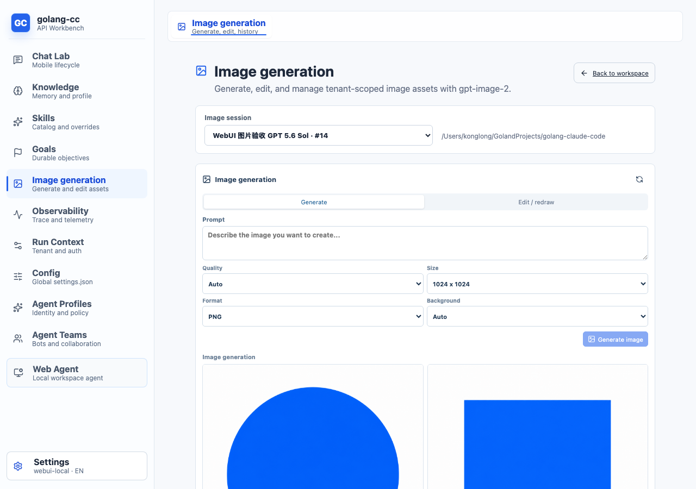
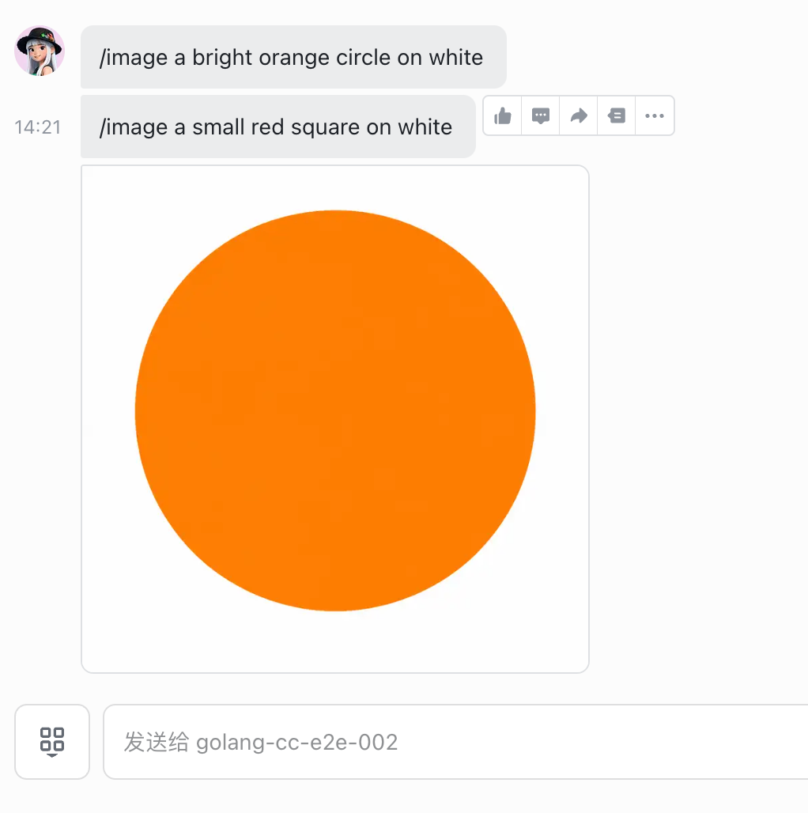

<div align="center">
  <h1>golang-cc</h1>
  <p><strong>用 Go 构建的通用 Agent runtime</strong></p>
  <p>从本地 Coding Agent 到 Chat Agent、API Server 和多 Agent 编排底座</p>
  <p>
    <a href="https://github.com/konglong87/go-e2e/actions/workflows/ci.yml"></a>
    
    <a href="LICENSE"></a>
    
  </p>
</div>

<p align="center">
  <a href="#快速开始">快速开始</a> ·
  <a href="#选择运行模式">运行模式</a> ·
  <a href="#api-server">API Server</a> ·
  <a href="#飞书接入">飞书接入</a> ·
  <a href="#文档导航">文档</a>
</p>

golang-cc 提供工具调用、多轮对话、会话恢复、权限与沙箱、Skills/Plugins、OpenAI-compatible API、多租户持久化和运行时观测能力。

> 当前是项目默认首页。需要完整技术参考、历史安装说明和详细工程信息，请查看 [`README.detailed.md`](README.detailed.md)。
> 完整设计文档入口见 [`docs/`](docs/README.md)。

## 你可以用它做什么

| 场景 | 推荐入口 |
| --- | --- |
| 在终端里读代码、改代码、运行命令 | TUI：`go run ./cmd/golang-cc` |
| 在脚本或 CI 中执行一次任务 | Headless：`-p, --print` |
| 用最小工具集运行受控任务 | Bare profile：`--bare` |
| 给 Web、App 或后台系统提供模型能力 | API Server：`server` |
| 兼容 OpenAI SDK 和 Chat UI | `POST /v1/chat/completions` |
| 构建移动端 ChatGPT 类体验 | `/mobile/chat/...` |
| 运行长任务并支持恢复 | Goal / Background / `/loop` |
| 让多个 Agent 协作完成任务 | `Task` / sub-agent runtime |

## 核心能力

- **Coding Agent**：文件读写、编辑、搜索、Shell、MCP、Web 工具和权限审批。
- **多轮 Agent loop**：支持流式响应、工具调用、thinking、prompt cache 和上下文自动压缩。
- **可靠的会话管理**：transcript、resume、checkpoint、fork、rewind/redo、branches 和 recap。
- **可扩展运行时**：Skills、Plugins、MCP、Task sub-agent、Goal 和 Background 任务。
- **服务化能力**：Gin API Server、OpenAI-compatible JSON/SSE、Mobile API 和 Swagger。
- **企业级基础设施**：MySQL 多租户、审计、配额、限流、Telemetry、Trace Viewer。

## 运行概览

一次请求会经过入口、上下文装配、模型、工具、证据、完成校验和输出等阶段。Web Agent 则提供浏览器中的任务、文件、权限和进度视图。

| 运行时拓扑 | Web Agent 界面 |
| --- | --- |
|  |  |

## 效果预览

WebUI 主界面提供独立的“图片生成”工作台，可在会话之间切换，生成、编辑、查看历史并下载图片：

<p align="center">
  
</p>

同一套 WebUI 支持桌面和移动端布局：

<p align="center">
  
  
</p>

飞书渠道可以通过 `/image <提示词>` 生成并发送真实图片，也支持基于已有 asset 编辑/重绘：

<p align="center">
  
</p>

## 快速开始

### 环境要求

- Go **1.26.5 或更高**。项目的 `go.mod` 是编译下界，推荐与 [`.tool-versions`](.tool-versions) 保持一致。
- Node.js 仅在使用 WebUI 或前端测试时需要，版本以 [`web/.nvmrc`](web/.nvmrc) 为准。

### 1. 获取源码

```bash
git clone https://github.com/konglong87/go-e2e.git
cd go-e2e
```

### 2. 配置模型访问

使用 Anthropic 官方 API 时，只需要 API Key：

```bash
export ANTHROPIC_API_KEY="sk-your-api-key"
```

使用代理或 Anthropic-compatible 网关时，再设置 Base URL：

```bash
export ANTHROPIC_BASE_URL="https://ai-gateway.example.com/v1"
export ANTHROPIC_API_KEY="your-gateway-api-key"
```

`ANTHROPIC_BASE_URL` 是可选的。密钥也可以写入全局或项目 settings，配置方式见[配置说明](docs/examples/settings_quickstart.md)。不要把真实密钥提交到 Git 仓库。

### 3. 第一次运行

```bash
# 查看版本和构建身份
go run ./cmd/golang-cc --version

# 检查本地运行环境
go run ./cmd/golang-cc doctor

# 让 Agent 查看当前项目
go run ./cmd/golang-cc -p "查看当前目录有哪些文件"
```

### 4. 常用用法

```bash
# TUI 交互模式
go run ./cmd/golang-cc

# 普通文本输出
go run ./cmd/golang-cc -p "帮我总结 README.md"

# JSON 最终结果
go run ./cmd/golang-cc -p "列出项目结构" --output-format json

# 流式 JSON 事件
go run ./cmd/golang-cc -p "读取 go.mod" --output-format stream-json

# 指定目标项目目录
go run ./cmd/golang-cc --cwd /path/to/project -p "读取项目规则"

# 使用最小代码 runtime
go run ./cmd/golang-cc --bare -p "读取 go.mod 并说明模块信息"
```

运行任意命令时都可以查看帮助：

```bash
go run ./cmd/golang-cc --help
go run ./cmd/golang-cc session --help
```

## 安装

### 从源码安装到 PATH

```bash
scripts/install.sh
~/.local/bin/golang-cc --version
```

默认安装到 `~/.local/bin`。需要其他目录时可以设置 `PREFIX` 或 `BIN_DIR`：

```bash
PREFIX=/usr/local scripts/install.sh
```

### 只构建二进制

```bash
scripts/build.sh
bin/golang-cc --version
```

### 使用 `go install`

从当前源码目录安装：

```bash
go install ./cmd/golang-cc
"$(go env GOPATH)/bin/golang-cc" --version
```

如果 `$(go env GOPATH)/bin` 不在 `PATH` 中，请将它加入 PATH，或直接使用上面的完整路径。

从公开模块版本安装的标准形式是：

```bash
go install github.com/konglong87/go-e2e/cmd/golang-cc@latest
```

> 当前仓库仍包含 `github.com/muesli/termenv => ./third_party/termenv` 的本地 `replace`，远程 `go install ...@version` 不会应用这个 replace，因此这条远程安装路径暂时不可用。正式发布前需要先消化该依赖；源码目录内的 `go install ./cmd/golang-cc` 不受此限制。

### 预编译版本

发布产物由 GitHub Actions 生成，支持 darwin、linux 和 windows。发布流程和校验方式见 [`scripts/release.sh`](scripts/release.sh)。

## 诊断日志

CLI 和 TUI 默认保持安静，排查问题时可以显式打开结构化日志：

```bash
GOLANG_CC_LOG_LEVEL=debug go run ./cmd/golang-cc -p "检查当前项目"
```

可用级别包括 `debug`、`info`、`warn`、`error` 和 `silent`。完整日志行为和服务端差异见 [`README.detailed.md#诊断日志`](README.detailed.md#诊断日志)。

## 选择运行模式

| 需求 | 入口 | 说明 |
| --- | --- | --- |
| 本地交互开发 | `go run ./cmd/golang-cc` | 流式 TUI、权限审批、slash commands |
| 一次性自动化 | `go run ./cmd/golang-cc -p "..."` | 适合脚本和 CI |
| 机器消费结果 | `--output-format json` | 输出结构化最终结果 |
| 机器消费事件 | `--output-format stream-json` | 输出流式事件 |
| API 集成 | `go run ./cmd/golang-cc server` | 提供 HTTP、SSE 和 Swagger |
| 后台任务 | `--bg`、`/loop`、`goal` | 支持观察、停止和恢复 |
| MCP 集成 | `mcp serve` | 暴露给 MCP client |

更完整的 TUI、CLI 和 Web Agent 场景说明见 [`docs/usage/README.md`](docs/usage/README.md)。

## 配置

golang-cc 支持环境变量、全局 settings、项目 settings 和 YAML 配置。最小配置可以只依赖环境变量：

```bash
export ANTHROPIC_API_KEY="sk-your-api-key"
```

需要指定模型、provider、fallback 或权限时，可以创建 `~/.golang-cc/settings.json`：

```json
{
  "model": "gpt-5.5",
  "provider": "custom",
  "effort": "high",
  "env": {
    "ANTHROPIC_BASE_URL": "https://ai-gateway.example.com/v1",
    "ANTHROPIC_API_KEY": "${ANTHROPIC_API_KEY}"
  }
}
```

默认仅加载这一份全局文件；`GOLANG_CC_CONFIG_DIR` 可显式重定位，`--settings` 可显式加载额外文件或 JSON。旧全局、项目 JSON/local 和 `config/config*.yaml` 不再自动读取。

完整示例、字段说明和配置优先级见 [`docs/examples/settings_quickstart.md`](docs/examples/settings_quickstart.md)。

## API Server

启动本地 API Server：

```bash
go run ./cmd/golang-cc server \
  --host 127.0.0.1 \
  --port 8080 \
  --auth-token test-token
```

检查健康状态：

```bash
curl -sS http://127.0.0.1:8080/health \
  -H 'Authorization: Bearer test-token'
```

调用 OpenAI-compatible 接口：

```bash
curl -sS http://127.0.0.1:8080/v1/chat/completions \
  -H 'Authorization: Bearer test-token' \
  -H 'Content-Type: application/json' \
  -d '{"model":"gpt-5.5","messages":[{"role":"user","content":"hi"}]}'
```

Swagger UI 默认地址：<http://127.0.0.1:8080/swagger/index.html>。

完整的 API、鉴权、SSE、Mobile API 和 MySQL 持久化说明见 [`docs/api_server.md`](docs/api_server.md)。

## 飞书接入

项目提供 Feishu Bot channel worker，支持私聊、群聊（需 @Bot）、会话恢复、权限确认、交互卡片、流式卡片、reaction 和图片消息等能力。接入需要飞书应用、MySQL、模型 provider 和一个持久化的 payload key。

推荐先阅读 [`docs/usage/feishu.md`](docs/usage/feishu.md)，其中包含：

- 飞书应用创建、权限和事件配置；
- `channels onboard feishu` 与 `channels run` 的使用方式；
- MySQL、tenant/user/account 身份配置；
- 使用 `screen` 启停常驻 worker；
- 日志、状态检查和常见故障排查。

长连接 worker 不建议使用 `go run ... &` 常驻。最小的运维入口是：

```bash
scripts/channel-worker-screen.sh start
scripts/channel-worker-screen.sh status
scripts/channel-worker-screen.sh restart
scripts/channel-worker-screen.sh stop
```

真实凭据应保存在本机受保护文件或 settings/secret store 中，不要写入 README、命令历史、日志或 Git。

## 任务、会话与扩展

### Goal 和后台任务

```bash
go run ./cmd/golang-cc goal start "检查项目测试并修复失败项" --turn-budget 20
# 复制上一步返回的 goal id；start 只创建目标，不会开始执行
go run ./cmd/golang-cc goal run <goal-id> --background
go run ./cmd/golang-cc goal status <goal-id>
go run ./cmd/golang-cc goal logs <goal-id>

# 暂停；resume 只恢复为可运行状态，需要再次 run
go run ./cmd/golang-cc goal stop <goal-id>
go run ./cmd/golang-cc goal resume <goal-id>
go run ./cmd/golang-cc goal run <goal-id> --background
```

`active` 表示 Goal 可以运行，不表示已有前台或后台 worker 正在执行。Goal 事件使用
`goal logs <goal-id>` 查看；后台进程输出使用 `logs <background-id>` 查看。CLI/TUI
输入 `goal help` 或 `/goal help` 可查看中文新手指引；命令名、参数和可复制示例仍保持英文，便于 CLI/TUI 使用同一套语法。

Goal、Background 和 `/loop` 的状态、预算、恢复和事件说明见 [`docs/goal_mode/goal_mode_design.md`](docs/goal_mode/goal_mode_design.md)。

### Session

```bash
# 继续最近一次会话
go run ./cmd/golang-cc --continue

# 恢复指定会话
go run ./cmd/golang-cc --resume <session-id>
```

会话存储、checkpoint、rewind/redo、branches 和 inspect 见 [`docs/session_quickstart.md`](docs/session_quickstart.md)。

### Skills、Plugins 和 MCP

运行时支持渐进式 Skills、Plugins、MCP server 和 Task sub-agent。使用边界和加载规则见 [`docs/skills/skills_progressive_loading.md`](docs/skills/skills_progressive_loading.md) 与 [`docs/usage/bare.md`](docs/usage/bare.md)。

## 文档导航

| 主题 | 文档 |
| --- | --- |
| 文档总览 | [`docs/README.md`](docs/README.md) |
| CLI / TUI / Web Agent 使用 | [`docs/usage/README.md`](docs/usage/README.md) |
| Feishu Bot 接入与 worker 运维 | [`docs/usage/feishu.md`](docs/usage/feishu.md) |
| 完整配置示例 | [`docs/examples/settings_quickstart.md`](docs/examples/settings_quickstart.md) |
| API Server / OpenAI-compatible / Mobile API | [`docs/api_server.md`](docs/api_server.md) |
| 多租户 MySQL | [`docs/tenant/multi_tenant_mysql.md`](docs/tenant/multi_tenant_mysql.md) |
| 运行时架构 | [`docs/architecture/runtime_modes.md`](docs/architecture/runtime_modes.md) |
| Session 与 transcript | [`docs/session_quickstart.md`](docs/session_quickstart.md) |
| Goal 与定时任务 | [`docs/goal_mode/goal_mode_design.md`](docs/goal_mode/goal_mode_design.md) |
| Trace Viewer | [`docs/observability/trace_viewer.md`](docs/observability/trace_viewer.md) |
| 兼容性与能力边界 | [`docs/compatibility_matrix.md`](docs/compatibility_matrix.md) |
| 参与贡献 | [`CONTRIBUTING.md`](CONTRIBUTING.md) |
| 安全漏洞报告 | [`SECURITY.md`](SECURITY.md) |
| 开源发布检查清单 | [`docs/deployment/open_source_release_checklist.md`](docs/deployment/open_source_release_checklist.md) |

## 开发与验证

克隆仓库后运行：

```bash
go test ./... -count=1
git diff --check
```

完整 CI 还包括 build、vet、gofmt、Swagger、WebUI、离线验收和 runtime topology 检查。开发约定见 [`DEVELOPMENT.md`](DEVELOPMENT.md)，脚本入口见 [`scripts/README.md`](scripts/README.md)。

## 当前边界

项目正在持续演进。当前主链路已经覆盖 CLI、query loop、工具、权限、沙箱、会话、Skills/Plugins、API Server、多租户和 telemetry；部分平台沙箱、真实 Linux runner 验证和外部兼容语义仍有边界。

详细能力矩阵见 [`docs/architecture/go_claude_agent_capability_boundaries.md`](docs/architecture/go_claude_agent_capability_boundaries.md)，待办事项见 [`docs/todo.md`](docs/todo.md)。

## License

本项目基于 [Apache License 2.0](LICENSE) 开源。提交贡献即表示你同意按相同许可证授权被项目接收的内容，详情见[贡献指南](CONTRIBUTING.md)。

发现安全问题时，请不要公开披露漏洞细节，按照[安全策略](SECURITY.md)通过私密渠道报告。
