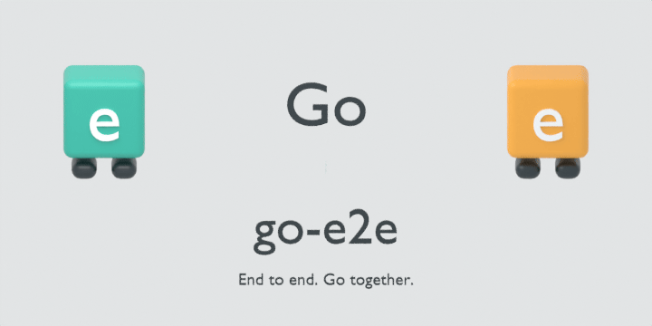
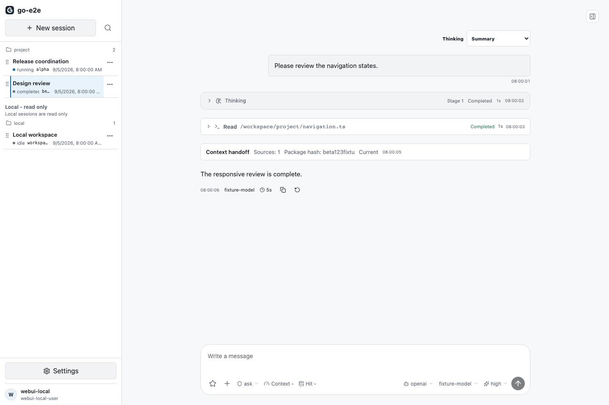

# go-e2e

用 Go 完成端到端语义闭环的 Agent runtime。两个端点向中间走，在同一个可持续会话里汇合，这就是 `go-e2e` 的产品象征。

<p align="center">
  
</p>

<p align="center">
  
</p>

<p align="center">
  
</p>

## 重点能力

- WebUI 2.0 与 `desktop-v2`：窄导航设置中心、模型、Profile、背景、3D 宠物、数据观测、飞书和 Multi-Agent。
- 连续评测：`--session-id` 可重复进入同一会话，追加对话并保留历史上下文；`--sessionId` 同样兼容。
- Provider-neutral 配置：模型、地址和凭据只从全局 `~/.golang-cc/settings.json` 读取，设置页面编辑的也是同一个文件。
- 数据库按部署场景选择：默认 SQLite，无需额外服务；需要多租户、审计和并发服务能力时可选 MySQL。
- 兼容外部项目指导文件格式：可读取 `go-e2e.md`、`AGENTS.md`、`CLAUDE.md` 等文件上下文，但不会读取外部模型配置或 API Key。

## 快速开始

```bash
git clone https://github.com/konglong87/go-e2e.git
cd go-e2e
go run ./cmd/go-e2e --version
```

在设置页面填写 provider、API 协议、模型、地址和凭据，或直接编辑：

```text
~/.golang-cc/settings.json
```

最小 provider-neutral 示例：

```json
{
  "provider": "custom",
  "providerProtocol": "openai-chat-completions",
  "baseURL": "https://model.example.com/v1",
  "apiKey": "replace-me",
  "model": "model-id"
}
```

开始一次任务：

```bash
go run ./cmd/go-e2e -p "检查当前项目结构"
```

继续同一会话：

```bash
go run ./cmd/go-e2e --session-id 11111111-1111-4111-8111-111111111111 -p "记住刚才的结论，并继续检查测试"
go run ./cmd/go-e2e --sessionId 11111111-1111-4111-8111-111111111111 -p "基于上一轮结果给出修复建议"
```

## 运行入口

| 场景 | 命令 |
| --- | --- |
| 终端交互 | `go run ./cmd/go-e2e` |
| 一次性任务 | `go run ./cmd/go-e2e -p "..."` |
| 服务端 | `go run ./cmd/go-e2e server` |
| 会话恢复 | `go run ./cmd/go-e2e --session-id <uuid> -p "..."` |
| WebUI 2.0 | `scripts/webui-dev.sh` |
| 桌面端 | `scripts/build-desktop-v2.sh` |

## 数据库

默认使用 SQLite，无需额外服务。需要多租户、审计、并发服务能力时，可选择 MySQL。数据库由用户根据部署场景自行选择，桌面端不会强制安装 MySQL。

## Provider 边界

运行时保留 Messages 协议和对应 SDK 适配层，作为独立的兼容 provider；产品默认配置、推荐文案和示例均保持 provider-neutral，不绑定任何单一模型厂商。

## 文档

- [详细技术说明](README.detailed.md)
- [文档索引](docs/README.md)
- [桌面端说明](desktop-v2/README.md)
- [全局设置示例](docs/examples/settings_quickstart.md)

## License

Apache-2.0
