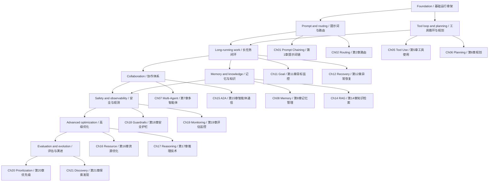
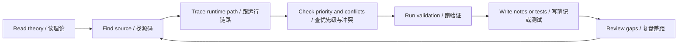

# Agentic Design Patterns Learning

这个目录把《智能体设计模式（双语版）》中的模式，和 Go Claude 的真实工程实现做对照。目标不是复述书本，而是帮助读者从源码里看到：一个编码智能体如何把 prompt、工具、记忆、路由、权限、目标、观测和恢复机制组合成可运行系统。

## 学习方法

每章按同一条主线阅读：

1. 先理解书中的模式解决什么问题。
2. 再看 Go Claude 中的源码落点。
3. 明确加载顺序、优先级和冲突裁决规则。
4. 跟一遍运行链路：入口、上下文、模型请求、工具或子任务、持久化、观测。
5. 用测试、命令或文档证据验证理解，不只停留在概念。

章节文档只总结理论要点，不复制书中大段原文。源码路径和验证命令以当前仓库为准。

后续章节的写作和审查标准见 [对照学习写作方法论](writing-methodology.md)。这份方法论规定每章必须包含源码映射、运行链路、优先级、冲突处理、异常兜底、最佳实践、验证任务和图示。

配套索引：

- [学习练习索引](exercises.md)：把 21 章拆成分阶段练习，适合边读边动手。
- [源码反查索引](source-map.md)：从 Go Claude 源码模块反查对应章节，适合读代码时定位设计模式。

## 章节对照表

| 书籍章节 | 模式 | Go Claude 工程实践入口 |
| --- | --- | --- |
| [第 1 章：提示词链](chapter-01-prompt-chaining.md) | Prompt Chaining | `internal/query/query.go` 的 turn loop、prompt context、tool result 回灌、auto compact |
| [第 2 章：路由](chapter-02-routing.md) | Routing | `promptmode`、code/chat prompt profile、tenant skill routing、structured fast path |
| [第 3 章：并行化](chapter-03-parallelization.md) | Parallelization | `Task` sub-agent、`internal/agentruntime`、background job、scheduler |
| [第 4 章：反思](chapter-04-reflection.md) | Reflection | Goal evaluator、recap、compact summary、review/fix loop、trace evidence |
| [第 5 章：工具使用](chapter-05-tool-use.md) | Tool Use | `internal/tools` registry、guarded tools、MCP adapter、permission prompt、tool trace |
| [第 6 章：规划](chapter-06-planning.md) | Planning | `internal/goal/plan.go`、Goal steps/criteria/dependencies/risks、Todo tool |
| [第 7 章：多智能体协作](chapter-07-multi-agent-collaboration.md) | Multi-Agent Collaboration | `Task`、agent task store、subagent events、agent messages、hooks |
| [第 8 章：记忆管理](chapter-08-memory-management.md) | Memory Management | `internal/memory`、tenant memory、AutoMem、compact summary、prompt context manifest |
| [第 9 章：学习和适应](chapter-09-learning-and-adaptation.md) | Learning and Adaptation | memory review、agent eval harness、telemetry-driven improvement docs |
| [第 10 章：MCP](chapter-10-mcp.md) | Model Context Protocol | `internal/mcp` client/RPC/tool adapter、MCP callback permission |
| [第 11 章：目标设定与监控](chapter-11-goal-setting-monitoring.md) | Goal Setting and Monitoring | `internal/goal`、Goal events、plan/evidence、CLI/API runner |
| [第 12 章：异常处理和恢复](chapter-12-exception-handling-recovery.md) | Exception Handling and Recovery | max turns、tool error result、checkpoint/rewind/fork、background logs |
| [第 13 章：人机协同](chapter-13-human-in-the-loop.md) | Human-in-the-Loop | permission prompts、AskUserQuestion、PlanMode、approval policy |
| [第 14 章：知识检索](chapter-14-knowledge-retrieval-rag.md) | Knowledge Retrieval / RAG | tenant knowledge search、context manifest、future external memory connector |
| [第 15 章：智能体间通信](chapter-15-inter-agent-communication-a2a.md) | Inter-Agent Communication / A2A | agent task messages、nested progress events、task event replay |
| [第 16 章：资源感知优化](chapter-16-resource-aware-optimization.md) | Resource-Aware Optimization | prompt cache、usage ledger、auto compact、structured fast path |
| [第 17 章：推理技术](chapter-17-reasoning-techniques.md) | Reasoning Techniques | thinking stream、PlanMode、Goal evaluator、structured output |
| [第 18 章：安全护栏](chapter-18-guardrails-safety.md) | Guardrails / Safety | `internal/permissions`、sandbox、tenant isolation、安全日志策略 |
| [第 19 章：评估和监控](chapter-19-evaluation-monitoring.md) | Evaluation and Monitoring | telemetry、Trace Viewer、agent eval harness、golden tests |
| [第 20 章：优先级排序](chapter-20-prioritization.md) | Prioritization | Goal plan priority、task scheduling、TODO/progress docs |
| [第 21 章：探索和发现](chapter-21-exploration-discovery.md) | Exploration and Discovery | WebSearch/WebFetch、ripgrep/read-first workflow、tool-driven investigation |

## 全局学习地图

这张图不是章节编号顺序，而是工程理解顺序。读者可以按编号通读，也可以按能力模块学习。

## 推荐阅读顺序

第一轮读“单 agent 如何跑起来”：

1. [第 1 章：提示词链](chapter-01-prompt-chaining.md)：理解 system prompt、memory、tool result、compact 如何串成 turn loop。
2. [第 2 章：路由](chapter-02-routing.md)：理解 code/chat prompt profile、structured fast path、tenant skill routing 的边界。
3. [第 5 章：工具使用](chapter-05-tool-use.md)：理解模型 `tool_use` 到真实工具执行、权限、trace 的完整链路。
4. [第 6 章：规划](chapter-06-planning.md)：理解计划、Todo、Goal plan 如何把任务拆成可验证步骤。

第二轮读“长任务如何闭环”：

1. [第 4 章：反思](chapter-04-reflection.md)：理解 evaluator、recap、compact、checkpoint 如何构成反馈循环。
2. [第 11 章：目标设定与监控](chapter-11-goal-setting-monitoring.md)：理解 Goal 状态机和 evidence-first 完成门禁。
3. [第 12 章：异常处理和恢复](chapter-12-exception-handling-recovery.md)：理解 max turns、resume repair、rewind/fork 和后台恢复。
4. [第 16 章：资源感知优化](chapter-16-resource-aware-optimization.md)：理解 prompt cache、usage ledger、auto compact 和预算收口。

第三轮读“多 agent、记忆和知识”：

1. [第 3 章：并行化](chapter-03-parallelization.md)：理解并行任务、后台任务和 scheduler 的工程边界。
2. [第 7 章：多智能体协作](chapter-07-multi-agent-collaboration.md)：理解 sub-agent 配置、工具隔离、事件回放。
3. [第 15 章：智能体间通信](chapter-15-inter-agent-communication-a2a.md)：理解 agent task message、nested progress、取消和回放。
4. [第 8 章：记忆管理](chapter-08-memory-management.md)：理解长期记忆、短期摘要、prompt context manifest。
5. [第 14 章：知识检索](chapter-14-knowledge-retrieval-rag.md)：理解 tenant knowledge search 和 prompt 注入边界。
6. [第 9 章：学习和适应](chapter-09-learning-and-adaptation.md)：理解 memory review、skill feedback、eval harness 如何把经验固化。

第四轮读“安全、观测和高级工程”：

1. [第 10 章：MCP](chapter-10-mcp.md)：理解外部工具协议、callback permission、agent-local MCP 隔离。
2. [第 13 章：人机协同](chapter-13-human-in-the-loop.md)：理解 AskUserQuestion、PlanMode、permission prompt 何时介入。
3. [第 17 章：推理技术](chapter-17-reasoning-techniques.md)：理解 thinking stream、PlanMode、structured output 和 evaluator 的关系。
4. [第 18 章：安全护栏](chapter-18-guardrails-safety.md)：理解权限策略、路径沙箱、网络沙箱、hook 和审计。
5. [第 19 章：评估和监控](chapter-19-evaluation-monitoring.md)：理解 agent eval、telemetry、Trace Viewer 和 golden tests。
6. [第 20 章：优先级排序](chapter-20-prioritization.md)：理解 Goal、Todo、Task batch、background、roadmap 的多层优先级。
7. [第 21 章：探索和发现](chapter-21-exploration-discovery.md)：理解 read-first、evidence-first、bounded exploration 的调查方法。

## 读者实践闭环

每章的推荐学习产物是：

- 一张机制图：用自己的话画出该模式在 Go Claude 中的入口、状态和输出。
- 一条源码阅读路线：从入口文件读到测试文件，不跳过冲突和兜底逻辑。
- 一个验证命令：至少用 `go test`、`rg`、`git diff --check` 或已有 eval 文档验证理解。
- 一个改进问题：指出 Go Claude 当前差距，思考如果要继续增强，应该改哪里、怎么测。

## 编写规则

- 每章必须引用真实源码或已有文档路径。
- 每章必须回答“顺序是什么、谁优先、冲突时怎么办”。
- 每章至少 3 张图，覆盖架构、链路、冲突/兜底；优先用 GitHub 原生 Mermaid，复杂信息图或教学卡片可生成图片文件并放入 `assets/`。
- 不把书中示例框架直接搬进 Go Claude；只抽取设计模式，再对照本项目已有架构。
- 如果 Go Claude 的实现和书中模式不完全一致，要说明工程取舍和当前差距。
- 文档示例优先使用本仓库已有测试和命令验证。
