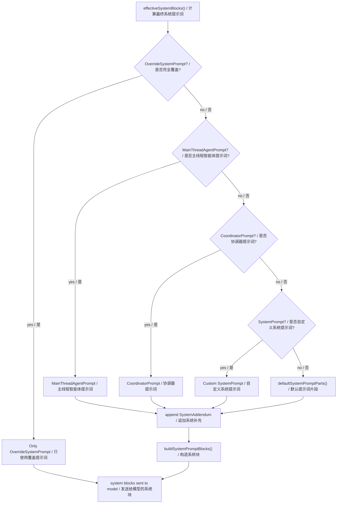
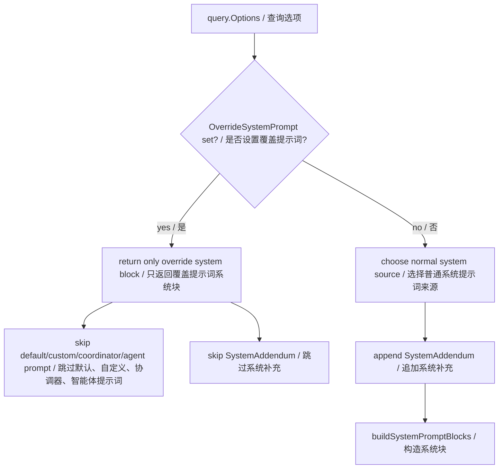
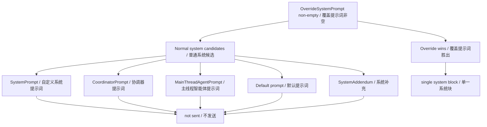
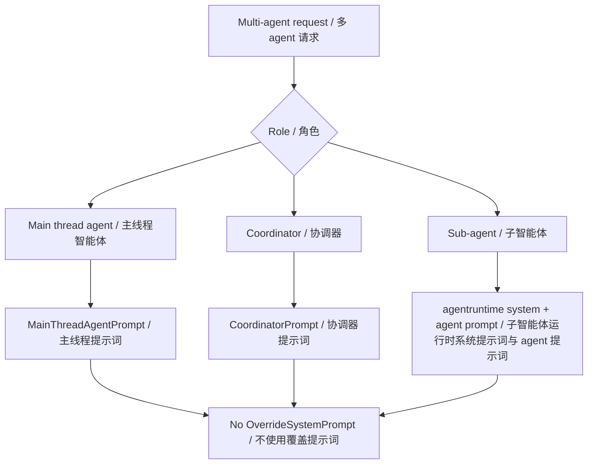
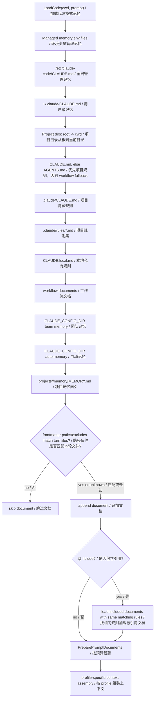
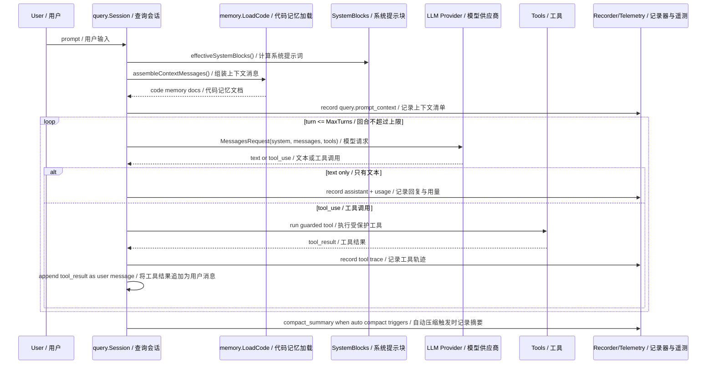
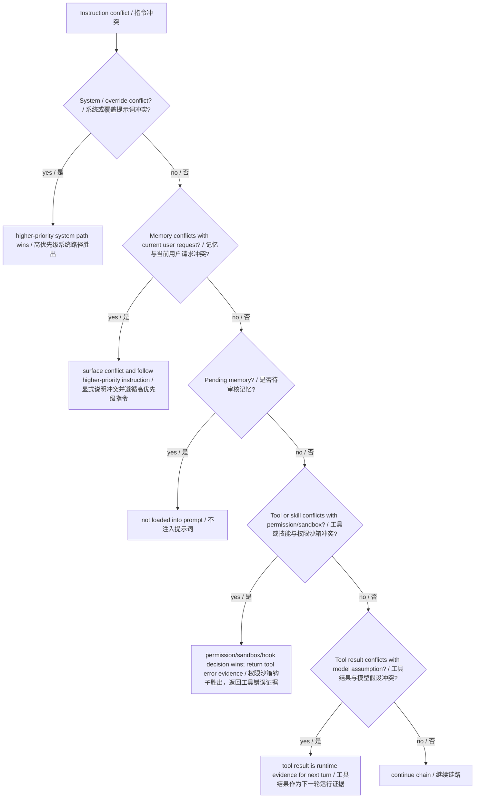
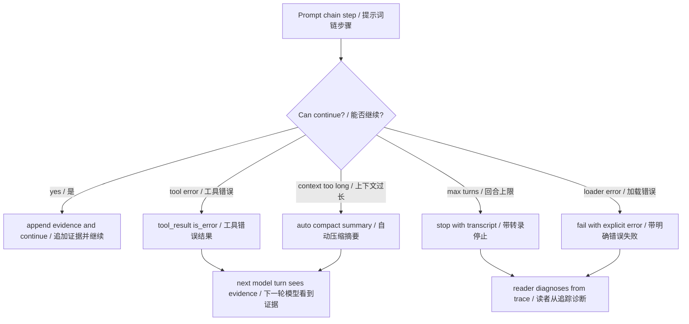
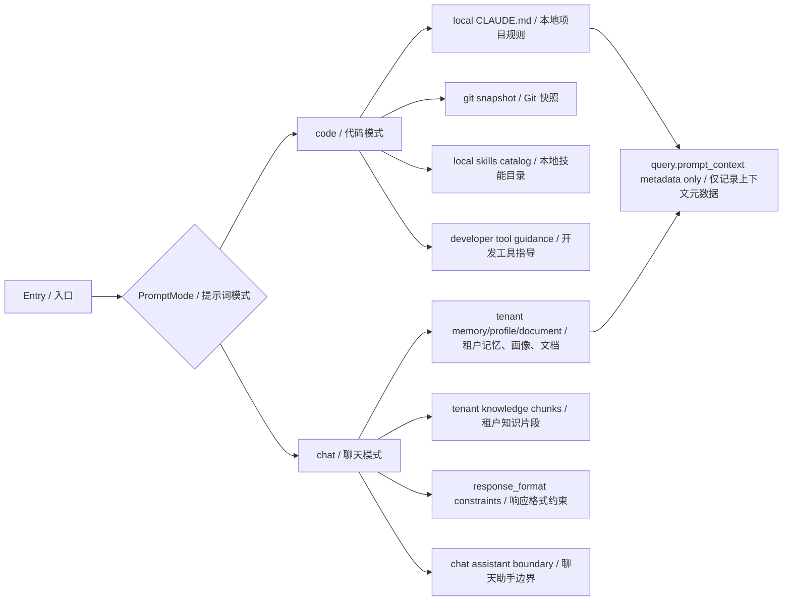

# 第 1 章：提示词链 Prompt Chaining

## 书中理论要点

提示词链不是“多写几个 prompt”这么简单。它的核心是把复杂任务拆成一组有顺序、有边界、有校验的上下文变换：前一步的输出成为后一步的输入，中间可以插入工具执行、格式约束、记忆加载、摘要压缩、权限审批和失败恢复。

在真实编码智能体里，提示词链首先要解决两个工程问题：

- 加载顺序：哪些 system prompt、memory、项目规则、tenant context、tool result 会进入模型？顺序是什么？
- 冲突裁决：当上层 system prompt、项目 `CLAUDE.md`、用户输入、skill 指令、tenant memory 内容互相矛盾时，谁优先？

如果只讲“prompt 怎么写”，不讲加载优先级和冲突处理，读者看源码时会误以为所有上下文是平级拼接。这是智能体工程里非常危险的误解。

## Go Claude 的工程落点

Go Claude 的提示词链主线在 `internal/query/query.go`：

- `Options` 定义一次 query 可以携带的 `PromptMode`、`SystemPrompt`、`OverrideSystemPrompt`、`SystemAddendum`、tenant context、response format、tool 开关和 auto compact 配置。
- `effectiveSystemBlocks` 决定 system prompt 优先级。
- `assembleContextMessages` 在 code mode 下加载本地 code memory，执行路径作用域判断和 prompt 预算裁剪，再按默认或 Claude-compatible profile 组装 user-context 与 auto-memory system block。
- `Session.run` 按 `MaxTurns` 运行模型/tool loop。
- 模型返回 `tool_use` 后，runtime 执行工具，把 `tool_result` 作为新的 user message 追加，再进入下一轮。
- `recordContextManifest`、`recordAssistant`、`recordTool`、`recordCompact` 把链路写入 transcript 和 telemetry。

相关文档入口：

- `docs/prompt_logic/prompt_loading.md`
- `docs/prompt_logic/session_prompt_logic_2026-06-22.md`
- `docs/prompt_logic/code_and_chat_prompt_modes.md`
- `docs/auto_memory_plan/auto_memory_plan.md`

## 源码映射表

| 层级 | Go Claude 文件 | 学习重点 |
| --- | --- | --- |
| query options | `internal/query/query.go:Options` | 一次请求能携带哪些 system、prompt mode、tenant context、tool、response format 和 compact 配置。 |
| system priority | `internal/query/query.go:effectiveSystemBlocks` | `OverrideSystemPrompt`、main-thread agent、coordinator、custom system、default prompt、`SystemAddendum` 的裁决顺序。 |
| prompt manifest | `internal/query/query.go:recordContextManifest`、`codeContextManifest` | 记录 prompt 来源、system 来源、memory 数量、tenant runtime metadata，但不记录正文。 |
| code memory | `internal/memory/memory.go:LoadCodeWithOptions`、`PreparePromptDocuments` | managed/user/project/local/workflow/team/auto/project memory 的加载顺序、路径作用域、include、去重和 prompt 字节预算。 |
| tool loop | `internal/query/query.go:Session.run`、`runTool` | 模型 `tool_use` 如何变成工具执行，工具结果如何作为 `tool_result` 回灌下一轮。 |
| compact | `internal/compact/compactor.go`、`internal/query/query.go:recordCompact` | 长上下文超过阈值时如何压缩，并把摘要作为恢复边界记录。 |
| tests | `internal/query/query_test.go`、`internal/memory/memory_test.go` | prompt 优先级、prompt mode、memory 加载、context manifest 的回归保护。 |
| docs | `docs/prompt_logic/*`、`docs/prompt_logic/code_and_chat_prompt_modes.md` | 设计意图、code/chat 隔离、加载顺序和当前差距。 |

## System Prompt 优先级

`internal/query/query.go:effectiveSystemBlocks` 是 system prompt 优先级的核心。当前顺序如下：



| 优先级 | 来源 | 行为 |
| --- | --- | --- |
| 1 | `OverrideSystemPrompt` | 最高优先级，完全替换 system prompt；不会追加默认 prompt，也不会追加 `SystemAddendum`。 |
| 2 | `MainThreadAgentPrompt` | main-thread agent 专用 prompt；存在时压过 coordinator/custom/default。 |
| 3 | `CoordinatorPrompt` | coordinator 模式 prompt；只有 `MainThreadAgentPrompt` 为空时生效。 |
| 4 | `SystemPrompt` | CLI/API 显式传入的自定义 system prompt。 |
| 5 | `defaultSystemPromptParts` | 默认 Go Claude code/chat prompt profile。 |
| 追加 | `SystemAddendum` | 在非 override 路径尾部追加，例如 tenant context、JSON schema 约束、API 附加上下文。 |

对应测试是 `internal/query/query_test.go:TestPromptModePriorityMatchesUpstreamOrder`。这个测试锁住了几个容易犯错的点：

- main-thread agent prompt 优先于 coordinator prompt。
- coordinator prompt 优先于普通 custom system prompt。
- override system prompt 是替换，不是追加。

## OverrideSystemPrompt 专门说明

`OverrideSystemPrompt` 是 `internal/query/query.go:Options` 里的一个高优先级 system prompt 字段。它的含义不是“在默认 system prompt 后面追加一段更强的提示词”，而是“完全替换本次请求的 system prompt 组装结果”。

当前源码里它的唯一执行入口在 `effectiveSystemBlocks()`：

```go
if text := strings.TrimSpace(s.options.OverrideSystemPrompt); text != "" {
    return []anthropic.SystemBlock{{Type: "text", Text: text}}
}
```

这段代码说明了三件事：

1. 只要 `OverrideSystemPrompt` 非空，函数立即返回。
2. 默认 code/chat prompt、`SystemPrompt`、`CoordinatorPrompt`、`MainThreadAgentPrompt` 都不会继续参与组装。
3. `SystemAddendum` 也不会追加，因为追加逻辑在这个 `return` 后面。



### 它来自哪里

从代码层面看，`OverrideSystemPrompt` 来自创建 `query.Session` 时传入的 `query.Options.OverrideSystemPrompt`。也就是说，它不是 memory 文件、不是 `CLAUDE.md`、不是用户普通输入，也不是 tool result。

截至当前源码：

- CLI 常规路径 `internal/cli/cli.go:newQuerySession` 会设置 `SystemPrompt: opts.systemPrompt` 和 `SystemAddendum: systemAddendum`，没有直接设置 `OverrideSystemPrompt`。
- OpenAI-compatible / server 常规路径也主要设置 `SystemPrompt`、`SystemAddendum` 或 tenant context，而不是直接设置 `OverrideSystemPrompt`。
- 测试 `internal/query/query_test.go:TestPromptModePriorityMatchesUpstreamOrder` 直接构造 `query.Options{OverrideSystemPrompt:"override", SystemAddendum:"append"}`，验证最终 system 只有 `override`。
- `contextManifest` 会记录 `OverrideSystem: true`，`codeContextManifest` 会把这类 system 来源标为 `override`，方便 trace/telemetry 排查。

所以读者可以把它理解为“运行时内部的最高优先级 system prompt 覆盖开关”。如果未来某个 API、特殊执行器、评测器或兼容模式需要完全接管 system prompt，就应该通过这个字段表达，而不是把内容塞进 `SystemAddendum`。

### 什么时候会和其他 system/addendum 冲突

只要 `OverrideSystemPrompt` 非空，并且同一次 `query.Options` 里还存在下面任意字段，就发生冲突：

| 同时存在的字段 | 冲突点 | 结果 |
| --- | --- | --- |
| `SystemPrompt` | 两者都想定义主 system prompt | `OverrideSystemPrompt` 胜出，`SystemPrompt` 不进入模型请求。 |
| `CoordinatorPrompt` | coordinator 想接管主线程协调提示词 | `OverrideSystemPrompt` 胜出，coordinator prompt 不进入模型请求。 |
| `MainThreadAgentPrompt` | main-thread agent 想接管主提示词 | `OverrideSystemPrompt` 胜出，agent prompt 不进入模型请求。 |
| `defaultSystemPromptParts()` | 默认 code/chat prompt 想提供基础行为边界 | `OverrideSystemPrompt` 胜出，默认 prompt 不进入模型请求。 |
| `SystemAddendum` | addendum 想追加 JSON schema、append prompt 或 API 附加约束 | `OverrideSystemPrompt` 胜出，addendum 不追加。 |



一个典型冲突例子：

```go
query.Options{
    OverrideSystemPrompt: "You are a strict JSON generator.",
    SystemPrompt:         "You are Go Claude Code.",
    SystemAddendum:       "Respond with schema X.",
}
```

最终发给模型的 system 只有：

```text
You are a strict JSON generator.
```

`SystemPrompt` 和 `SystemAddendum` 都不会进入请求。这个行为很硬，适合“完全接管 system prompt”的场景，但不适合“在默认 Go Claude 行为上加一点约束”的场景。

### 什么时候不应该用 OverrideSystemPrompt

如果目标是保留 Go Claude 默认能力，只是增加附加约束，不应该用 `OverrideSystemPrompt`：

- 想让模型仍然遵守默认 code agent 工具使用规则，只追加输出格式要求：用 `SystemAddendum`。
- 想通过 CLI 传自定义主 system prompt：用 `SystemPrompt` / `--system-prompt`。
- 想追加 JSON schema 约束：走 `SystemAddendum` 路径。
- 想加载项目规则、用户记忆、tenant context：保持普通 prompt mode 和 context assembly。

### 多 agent 协作会用 OverrideSystemPrompt 吗

当前 Go Claude 的多 agent 协作主路径不会使用 `OverrideSystemPrompt`。

源码对应关系是：

| 多 agent 场景 | 当前使用的 prompt 机制 | 是否使用 `OverrideSystemPrompt` |
| --- | --- | --- |
| 主线程 agent | `MainThreadAgentPrompt` | 否 |
| coordinator / 协调器 | `CoordinatorPrompt` | 否 |
| `Task` sub-agent | `internal/agentruntime.Runtime` 自己拼 sub-agent system | 否 |
| `AgentCreate` background agent | 同样走 `agentruntime.Runtime` | 否 |
| agent skills / memory / MCP | 追加到 sub-agent runtime 的 system 文本中 | 否 |

主会话创建在 `internal/cli/cli.go:newQuerySession`，会传入 `SystemPrompt`、`MainThreadAgentPrompt`、`SystemAddendum`，没有传 `OverrideSystemPrompt`。子 agent 在 `internal/agentruntime/runtime.go` 里使用自己的基础 system：

```text
You are a focused go-claude sub-agent. Complete only the delegated task and return a concise result.
```

基础 prompt 还要求 sub-agent 使用 `Summary`、`Evidence`、`Assumptions`、`Unknowns`、`Verification`、`Risks`、`Next action` 固定标题返回 evidence-first 结果。runtime 随后再追加 agent prompt、critical reminder、skills、memory 和 MCP prompt。也就是说，多 agent 的正常协作边界是“coordinator / main-thread / sub-agent 各自有自己的 prompt 机制”，不是用 override 把所有 system prompt 覆盖掉。



`OverrideSystemPrompt` 在多 agent 相关场景里只适合少数特殊用途：

| 场景 | 为什么可能需要 override |
| --- | --- |
| 多 agent 协议兼容测试 | 外部协议要求 system prompt 必须完全等于指定文本，不能混入默认 code prompt 或 coordinator prompt。 |
| deterministic eval / 评测 | 想排除默认 prompt、agent prompt、addendum 干扰，只验证某个最小 agent 协议。 |
| prompt 污染排查 | 怀疑默认 system、coordinator、agent prompt、addendum 互相影响时，用 override 做最小化 A/B 对照。 |
| 强隔离实验 | 需要一个极简受控 agent，只让模型看到固定 system，不加载默认工具指导或项目规则。 |

不应该用 override 来做普通多 agent 分工：

- 想让 coordinator 更会分派任务：改 `CoordinatorPrompt`。
- 想定义某个 sub-agent 的角色：改 agent definition / agent prompt。
- 想给 sub-agent 增加专属知识：用 agent memory、skills 或 MCP 配置。
- 想给主线程 agent 加规则：用 `MainThreadAgentPrompt` 或 `SystemAddendum`。

一句话：`OverrideSystemPrompt` 是“完全替换 system prompt”的核按钮；多 agent 正常协作应该用 coordinator、main-thread、sub-agent 各自的 prompt 机制，只有要完全接管系统提示词时才考虑 override。

### 最佳实践

- `OverrideSystemPrompt` 应只用于少数“完全替换系统行为”的内部路径。
- 使用它时必须意识到：默认安全/行为提示词不会进入模型；工具权限、sandbox、hook 这些运行时硬边界仍然生效。
- 如果需要默认行为 + 额外规则，用 `SystemAddendum`，不要用 override。
- 如果发现 trace 里 `OverrideSystem=true` 且缺少预期 addendum，要先检查是不是 override 提前返回导致的。

## Code Memory 加载顺序

`internal/memory/memory.go:LoadCode` 负责 code mode 的本地记忆加载。当前顺序是：



| 顺序 | 来源 | 类型 |
| --- | --- | --- |
| 1 | `GOLANG_CLAUDE_CODE_MANAGED_MEMORY` 指定文件 | Managed |
| 2 | `CLAUDE_CODE_MANAGED_MEMORY` 指定文件 | Managed |
| 3 | `/etc/claude-code/CLAUDE.md` | Managed |
| 4 | `~/.claude/CLAUDE.md` | User |
| 5 | 从父目录到 cwd 依次查找的 `CLAUDE.md` | Project |
| 6 | 从父目录到 cwd 依次查找的 `.claude/CLAUDE.md` | Project |
| 7 | 从父目录到 cwd 依次查找的 `.claude/rules/*.md` | Project |
| 8 | 从父目录到 cwd 依次查找的 `CLAUDE.local.md` | Local |
| 9 | 从父目录到 cwd 依次查找的 `SKILL.md`、`WORKFLOW.md`、`CONTRACT.md`、部分 `references/docs` workflow 文件和 `.claude/workflows/*.md` | Workflow |
| 10 | `CLAUDE_CONFIG_DIR/team/CLAUDE.md`、`TEAM.md`、`memory/team.md` 等 | Team |
| 11 | `CLAUDE_CONFIG_DIR/memory/auto.md`、`AUTOMEM.md` 等 | Auto |
| 12 | `CLAUDE_CONFIG_DIR/projects/<project-slug>/memory/MEMORY.md` | ClaudeCodeProjectMemory |

加载过程中还支持：

- `@include`：memory 文件可以包含其他文件。
- frontmatter `paths`：与当前 prompt 中可识别的文件路径匹配，支持 `**` 跨目录；绝对路径还会生成 cwd-relative 候选。
- frontmatter `exclude` / `excludes`：本轮文件候选命中排除规则时不加载；如果 prompt 中无法识别任何文件，作用域视为未知，scoped 文档仍加载。
- 去重：同一文件不会重复进入上下文。
- prompt 预算：workflow 默认最多 4KB，单文档默认最多 16KB，全部文档默认最多 64KB；高优先级文档先消耗总预算，截断内容会保留可读提示和原文件路径。

memory 文档正文不是主 system prompt。默认 profile 把它包装成下面的 user-context message：

```text
<system-reminder>
As you answer the user's questions, you can use the following context...

# Memory
...
</system-reminder>
```

Claude-compatible profile 使用兼容格式的 `# claudeMd` user message，并额外注入 `# auto memory` system block 来描述持久记忆能力；`claude-compatible-strict` 还会禁用项目 `AGENTS.md` fallback。无论使用哪种 profile，文件内容仍属于持久 user/project guidance，不能覆盖真正的 system/developer/当前对话高优先级指令。

## Prompt 链路

Go Claude 的一次 code mode 请求可以理解成下面的链：



每一环都有结构化承载：

- system prompt 用 `anthropic.SystemBlock`。
- 用户和工具消息用 `anthropic.MessageParam` 与 `ContentBlock`。
- prompt 来源和数量用 `ContextManifest` 记录。
- 工具执行结果用 `ToolTrace` 记录。
- 长上下文压缩用 `compact_summary` 保留状态边界。

## 冲突处理原则

读源码时要特别注意：Go Claude 不是把所有 prompt 当同等权重文本。冲突处理应按下面原则理解。



| 冲突场景 | 处理原则 |
| --- | --- |
| `OverrideSystemPrompt` 与其他 system/addendum 冲突 | override 完全替换，其他 system prompt 不进入请求。 |
| main-thread agent、coordinator、custom system prompt 冲突 | main-thread agent > coordinator > custom system > default。 |
| system prompt 与 memory 冲突 | system prompt 优先；memory addendum 明确写了除非不冲突才作为 durable guidance。 |
| 当前用户明确要求与旧 memory 冲突 | 当前对话优先，但必须显式指出冲突并说明采用哪条规则，不能静默裁决。 |
| pending memory 与 active memory 冲突 | pending memory 不进入 prompt；只有 review approve 后才可能成为 active memory。 |
| chat mode 与本地 project memory 冲突 | chat mode 不加载本地 `CLAUDE.md`、git context、local skills catalog。 |
| tenant/user 隔离冲突 | tenant memory/profile/document 必须按 tenant/user 上下文注入，不能跨租户读取。 |
| skill 指令与工具权限冲突 | skill 可以建议工具和上下文，但最终工具执行仍受 registry、permission policy、sandbox、hooks 控制。 |
| tool result 与模型假设冲突 | tool result 是运行时证据，应作为后续 turn 的事实输入；模型不能忽略失败结果继续编造。 |

这套冲突原则就是提示词链工程化的核心。没有它，prompt chaining 很容易变成“谁的文本靠后谁赢”的不可靠拼接。

## 异常、兜底与恢复

提示词链的失败通常不是单点失败，而是上下文、工具、模型和持久化之间的链路断裂。Go Claude 的兜底原则是：能恢复的失败回灌为证据，不能恢复的失败带着 trace/transcript 边界显式退出。

| 异常场景 | 当前处理 | 读者应关注 |
| --- | --- | --- |
| `OverrideSystemPrompt` 误用导致默认 prompt 和 addendum 丢失 | `effectiveSystemBlocks` 按设计只返回 override；trace 可通过 `OverrideSystem=true` 发现。 | override 是完全替换，不是加强版追加。 |
| memory 文件不存在 | `LoadCode` 对不存在文件跳过，对读取错误返回 error。 | 不存在是正常兜底，权限/读取错误才是异常。 |
| memory 路径条件不匹配 | frontmatter `paths` / `exclude` / `excludes` 让文档不进入 prompt。 | 不要把“没加载”误判为 loader 失效，要检查路径条件。 |
| 模型请求工具失败 | 工具错误以 `tool_result is_error=true` 或 query result 中的 tool error 形式回灌。 | 下一轮模型必须基于真实错误继续，而不是假设成功。 |
| 工具 loop 达到 `MaxTurns` | runtime 返回 `max turns reached`，并保留已有 assistant/tool 轨迹。 | 这是防无限循环边界，不是普通模型失败。 |
| 上下文接近或超过限制 | 默认开启的 auto compact 会先外置大 tool result，再按阈值压缩；provider 返回 context overflow 时可强制压缩一次并重试。 | 成功压缩记录 `compact_summary`；compact 是恢复边界，不能当作随意丢弃历史。 |
| prompt context 观测需要排查 | `query.prompt_context` 不记录 memory 正文；远程 telemetry 会清空文档 `Path`/`Parent`，本地 transcript manifest 会保留路径用于诊断。 | 不要把 telemetry 脱敏边界误认为本地 transcript 也不含私有路径。 |



## Code Mode 与 Chat Mode 的边界

第一章讲提示词链时必须同时理解 prompt mode，因为它决定链路里有哪些上下文能进入模型。



| 模式 | 默认入口 | 加载内容 |
| --- | --- | --- |
| `code` | CLI、TUI、headless print、本地 `/query` | 本地 code memory、git snapshot、local skills catalog、开发工具 guidance。 |
| `chat` | `/v1/chat/completions`、`/mobile/chat/...` | 普通助手 system prompt、tenant memory/profile/document/knowledge、显式 response format。 |

`chat` 不加载服务端本地仓库的 `CLAUDE.md`、`.claude/rules`、git branch、git status 或 local skills catalog。这不是功能缺失，而是安全边界。

## 为什么这样设计

提示词链示例通常假设上下文很干净，但编码智能体的上下文来源复杂：用户、项目、组织、租户、技能、工具、历史摘要、API 格式约束都可能进入链路。

Go Claude 的设计目标是：

- 高优先级 prompt 可替换，低优先级 memory 只能补充。
- code/chat 隔离，避免普通租户聊天读取开发机代码上下文。
- pending memory 不进入 prompt，防止未经审核的记忆污染长期行为。
- tool result 作为显式消息回灌，保证模型下一轮能看到真实执行结果。
- `query.prompt_context` 不记录 memory 正文；telemetry 对文档路径脱敏，本地 transcript 保留完整 manifest，因此 transcript 仍应按敏感本地数据保护。
- auto compact 默认开启，先应用 tool-result budget，再压缩历史并保留 `compact_summary` 作为恢复边界；context overflow 还有一次强制压缩恢复机会。

这也是提示词链从“提示词技巧”变成“智能体基础架构”的地方。

## 最佳实践

- 写 prompt 相关代码时，先判断自己是在替换 system prompt，还是追加补充约束；替换用 `OverrideSystemPrompt`，追加用 `SystemAddendum`。
- 任何长期记忆都应该先经过加载边界和路径条件，不能把 pending/未审核内容直接塞进 prompt。
- code/chat prompt mode 必须先定边界，再讨论能力；普通 chat 不应读取服务端 cwd 的项目规则。
- 工具结果是运行证据，不是自然语言建议；如果工具失败，应让模型看到失败结果并调整策略。
- prompt context 只记录 metadata，不记录 memory 正文；新增字段时必须分别审查 telemetry 脱敏和本地 transcript 数据边界。
- 增加新 prompt 来源时，要同步补 `ContextManifest` 或 trace 字段，否则后续无法证明它是否真的进入请求。

## 源码阅读路线

1. 读 `internal/query/query.go` 的 `Options`，先看一次请求能携带哪些上下文。
2. 读 `effectiveSystemBlocks`，画出 system prompt 优先级。
3. 读 `internal/memory/memory.go:LoadCodeWithOptions`、`internal/memory/scope.go` 和 `PreparePromptDocuments`，画出加载、作用域和预算顺序。
4. 读 `assembleContextMessages`，比较默认、`claude-compatible`、`claude-compatible-strict` 三种 code profile 的 memory 组装差异。
5. 跟 `Session.run` 的 `for turn := 1; turn <= s.options.MaxTurns; turn++`。
6. 看 `collectToolUses`、`runTool` 和 tool result 追加逻辑。
7. 看 `recordContextManifest`，确认可观测性只记录 metadata。
8. 看 `recordCompact`，理解长链路如何压缩而不是丢失状态。

## 如何验证

推荐先跑 query 和 memory 相关测试：

```bash
go test ./internal/query ./internal/memory -run 'PromptMode|SystemPrompt|LoadCode|Manifest|Memory' -count=1
```

文档和源码排查命令：

```bash
rg -n "effectiveSystemBlocks|LoadCode|SystemAddendumFromDocuments|query.prompt_context|compact_summary|tool_result" internal docs
```

如果要观察真实 prompt context，可以启动本地 server 或 TUI 后查看 trace / transcript 中的 `prompt_context` entry。

## 学习任务

- 为什么 `OverrideSystemPrompt` 是替换，而不是在默认 prompt 后追加？
- 为什么 project memory 放在 `<system-reminder>` user-context，而不是 system prompt？
- 如果 `CLAUDE.md` 和用户本轮要求冲突，应该听谁？
- 为什么 pending memory 不能进入 prompt？
- `code` 和 `chat` prompt mode 如果边界混乱，会造成什么安全问题？
- `compact_summary` 对提示词链来说是普通摘要，还是状态恢复边界？

## 当前差距

Go Claude 已经具备稳定的 prompt chaining runtime 和 prompt 加载治理，但它不是 LangChain 式 `PromptChain` 对象。这里更重要的是 Claude Code 风格的消息循环、优先级、隔离边界、工具协议、transcript、权限和可观测性。学习时应优先理解这些工程约束，而不是寻找一个名为 `PromptChain` 的单一抽象。

## 本章自审

| 检查项 | 结果 |
| --- | --- |
| 引用真实源码 | 已覆盖 `internal/query/query.go`、`internal/memory/memory.go`、query/memory 测试和 prompt 文档。 |
| 至少 3 张图 | 已包含 system 优先级、override、override 冲突、多 agent、memory 加载、prompt 链路、冲突裁决、异常兜底、code/chat 边界。 |
| 写清楚顺序和优先级 | 已明确 system prompt 优先级、memory 加载顺序、code/chat prompt mode 边界。 |
| 写清楚冲突处理 | 已覆盖 override/system/addendum、memory/user、pending/active、chat/code、skill/permission、tool result 冲突。 |
| 写清楚异常和兜底 | 已补充 loader、tool error、max turns、auto compact、trace manifest 的兜底路径。 |
| 有验证命令 | 已给出 `go test` 和 `rg` 命令。 |
| 当前差距诚实 | 已说明 Go Claude 不是单一 `PromptChain` 抽象，而是 runtime 链路治理。 |
