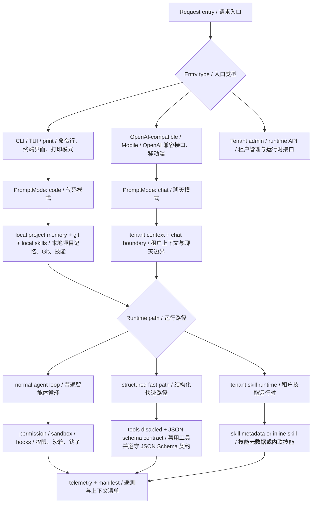
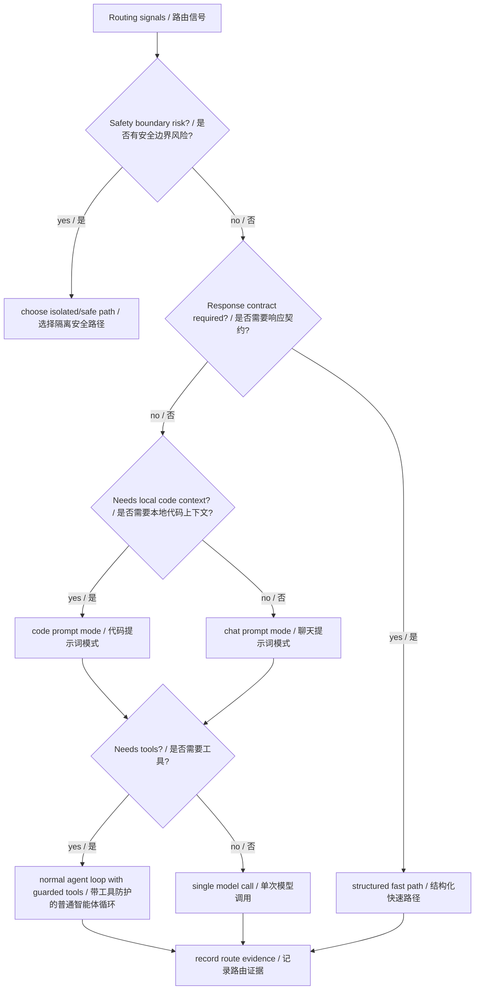
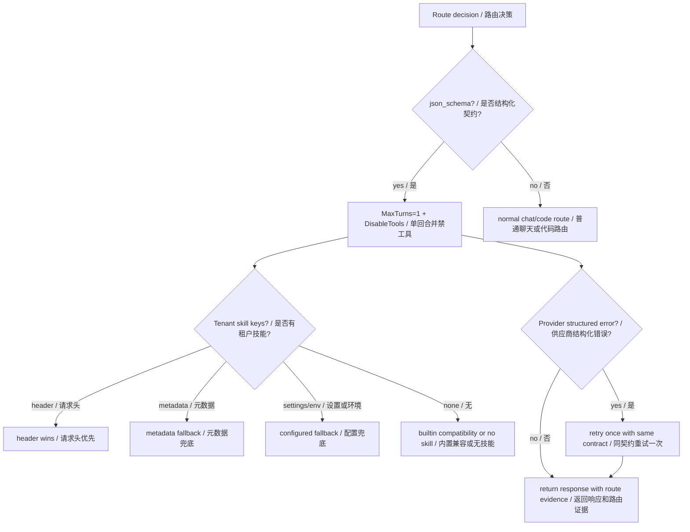
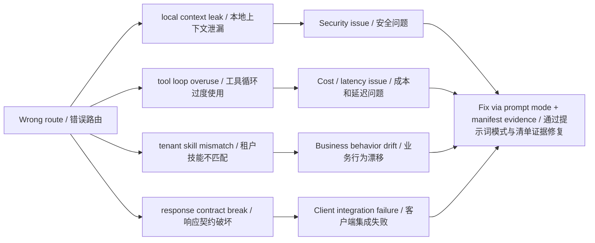
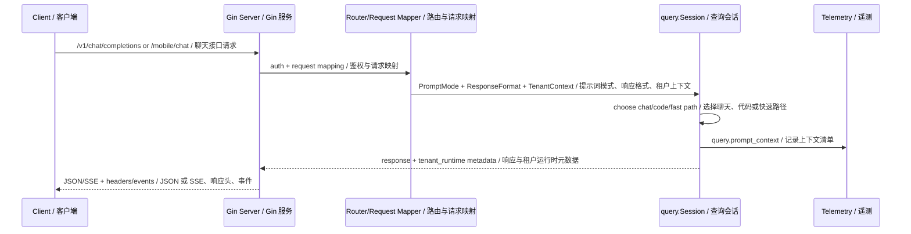

# 第 2 章：路由 Routing

## 书中理论要点

路由模式解决的是“不同请求应该进入不同处理路径”的问题。智能体系统里常见路由包括：选择模型、选择工具、选择专家 agent、选择 prompt 模板、选择是否进入结构化输出、选择是否需要检索或人工审批。

路由的难点不是写一个 `if`，而是把边界设计清楚：哪些信息可以进入某个路径，哪些路径必须禁用工具，哪些请求不能读取本地项目上下文，哪些租户技能可以注入，出错时如何观测。

## Go Claude 的工程落点

Go Claude 里最重要的路由不是模型名，而是 prompt profile 和 runtime 能力边界：

- `internal/promptmode/promptmode.go` 定义 `code` 和 `chat` 两类 prompt mode。
- `docs/prompt_logic/code_and_chat_prompt_modes.md` 说明 CLI/TUI 默认 code，OpenAI-compatible 和 Mobile 默认 chat。
- `internal/query/query.go` 根据 `PromptMode` 决定是否加载本地代码 memory、git context、skills catalog 等。
- `/v1/chat/completions` 支持 `response_format.type=json_schema`，结构化输出场景会进入 fast path：单模型调用、禁工具、保留 telemetry 和持久化。
- tenant skill runtime 通过 selector、skill keys 和 inline manifest 路由到当前租户可用技能。

相关文档入口：

- `docs/prompt_logic/code_and_chat_prompt_modes.md`
- `docs/api_server.md`
- `docs/tenant_runtime/structured_tenant_skill_routing_plan.md`
- `docs/tenant/ai_study_teach_engine_middle_layer.md`
- `docs/skills/skills_progressive_loading.md`

## 源码映射表

| 层级 | Go Claude 文件 | 学习重点 |
| --- | --- | --- |
| prompt mode | `internal/promptmode/promptmode.go` | `code` / `chat` 的模式归一化和默认值。 |
| query assembly | `internal/query/query.go` | 根据 `PromptMode` 决定本地 code memory、git/context manifest、tenant context 和工具能力。 |
| OpenAI route | `internal/server/server.go:openAIQueryRequest` | `/v1/chat/completions` 如何映射成 `QueryRequest`，并默认使用 chat mode。 |
| structured route | `internal/server/server.go:openAIStructuredOutput`、`openAIMaxTurns` | `response_format.type=json_schema` 如何进入单 turn、禁工具、跳过自动标题。 |
| tenant skill selector | `internal/server/server.go:selectStructuredTenantSkills` | header、metadata、tenant settings、env route、builtin fallback 的选择顺序。 |
| retry | `internal/server/server.go:runOpenAIQueryWithStructuredRetry` | structured provider 特定错误最多重试一次，不自动降级 response format。 |
| tests | `internal/server/server_test.go`、`internal/query/query_test.go` | prompt mode、structured fast path、inline tenant skill、工具禁用的回归保护。 |
| docs | `docs/api_server.md`、`docs/tenant_runtime/structured_tenant_skill_routing_plan.md` | API 行为、tenant runtime metadata、结构化技能路由边界。 |

## 机制拆解

Go Claude 的路由可以分成四层：



这个分层很重要。比如 `/mobile/chat/...` 和 CLI 最后都可以复用 query runtime，但它们不能默认共享 code prompt profile。否则普通聊天请求可能读到服务端进程所在仓库的 `CLAUDE.md`、git status 或本地 `.claude/rules`。

## 路由优先级与冲突处理

路由不是“能走哪个就走哪个”，而是要有明确裁决。



| 冲突场景 | Go Claude 的处理原则 |
| --- | --- |
| CLI/TUI 与 Mobile/OpenAI-compatible 都能调用 query runtime | runtime 可复用，但 prompt profile 不复用；CLI/TUI 默认 `code`，Mobile/OpenAI-compatible 默认 `chat`。 |
| 请求显式指定 `prompt_mode` 与入口默认值冲突 | 受控入口可以覆盖；Mobile 普通用户不能随意打开 code mode。 |
| `chat` 请求需要 tenant 知识，但本地仓库也有 `CLAUDE.md` | tenant context 可进入，服务端本地 project memory 不进入。 |
| `response_format.type=json_schema` 与工具循环冲突 | 默认进入 structured fast path，禁工具，避免一次结构化决策被放大成多轮 agent loop。 |
| tenant skill selector 与业务硬规则冲突 | selector 只负责选择和注入通用 skill；业务状态机和 validator 仍应在上层服务。 |
| skill 建议使用工具，但 permission/sandbox 拒绝 | permission/sandbox/hook 是更硬的运行边界，拒绝结果必须回灌为工具失败证据。 |
| 多个路由信号都存在 | 优先保证安全隔离和响应契约，再考虑能力增强和成本优化。 |

读这一章时要特别注意：路由的目的不是让系统“更聪明地猜”，而是减少错误路径。比如结构化 fast path 看起来能力更少，因为它禁工具；但对 JSON schema 业务决策来说，这反而是更稳定、更低成本的正确路径。

## 异常、兜底与恢复

路由失败的危险在于：请求可能仍然有响应，但进入了错误路径。Go Claude 因此把路由结果写进 manifest、headers、telemetry 或测试断言，让读者能证明“到底走了哪条路”。

| 异常场景 | 兜底方式 | 为什么 |
| --- | --- | --- |
| structured provider 返回特定 JSON schema 生成错误 | `runOpenAIQueryWithStructuredRetry` 用同一请求最多 retry 一次，并发出 `openai.structured_retry`。 | 保持契约稳定，不偷偷改成非 structured 请求。 |
| structured skill header/metadata/tenant settings/env 冲突 | `selectStructuredTenantSkills` 按 header > metadata > tenant settings > env > builtin fallback 选择。 | 调用方显式选择优先，部署默认值兜底。 |
| tenant settings 解析失败 | 记录 debug，跳过 tenant settings 路由，继续后续 env/builtin fallback。 | tenant 配置坏了不能让整个中台不可用，但必须可排查。 |
| `json_schema` 与工具调用冲突 | `DisableTools=true`、`MaxTurns=1`、`SkipAutoTitle=true`。 | 防止结构化业务决策变成多轮 agent loop。 |
| 普通 chat 被误导去读本地 code memory | 入口默认 `PromptMode=chat`，code memory 只在 code mode 加载。 | 服务端本地仓库不是 SaaS 用户上下文。 |
| 上层业务硬规则缺失 | 中台只注入 skill/context，不替上层业务做状态机校验。 | 路由不是业务 validator，防止责任边界混乱。 |



## 源码阅读路线

1. 读 `docs/prompt_logic/code_and_chat_prompt_modes.md`，先建立 code/chat 的边界。
2. 读 `internal/promptmode/promptmode.go`，看模式解析和默认值。
3. 在 `internal/query/query.go` 搜 `promptProfile`、`assembleContextMessages`、`codeContextManifest`。
4. 在 `docs/api_server.md` 搜 `response_format.type=json_schema`，看结构化 fast path 的行为约束。
5. 在 `docs/tenant_runtime/structured_tenant_skill_routing_plan.md` 看 tenant skill selector 如何保持通用，避免把 AI Study 这类上层业务硬编码进中台。

## 为什么这样设计

路由如果做得粗糙，会出现两个典型问题：

- 安全问题：普通 SaaS chat 请求误读本地代码仓库上下文。
- 成本问题：本来只需要一次 JSON schema 决策的请求，被放进完整 agent/tool loop，导致延迟和 token 成本放大。

Go Claude 的设计是让入口层决定调用意图，让 query runtime 执行统一链路，让 manifest 和 telemetry 记录实际进入了哪个路径。这样后续排障时可以回答：“这次请求到底是 chat 还是 code？有没有 inline tenant skill？工具是否被禁用？JSON schema 是否透传？”



## 最佳实践

- 先按入口确定默认 prompt mode：CLI/TUI 是本地工程助手，OpenAI-compatible/Mobile 是租户聊天边界。
- 当响应契约比工具能力更重要时，优先 structured fast path，禁工具、单回合、保留 telemetry。
- tenant skill selector 只能做通用路由，不要把 AI Study 或其他业务 app 的状态机硬编码进中台。
- 路由结果必须可观测：headers、SSE runtime event、`query.prompt_context`、tenant runtime metadata 至少要有一个证据面。
- provider structured 错误可以同契约重试，但不要自动移除 `response_format` 或切模型；否则调用方以为拿到的是硬约束 JSON。
- 排查路由问题时先看实际请求入口和 manifest，不要只看代码里“应该默认”的模式。

## 如何验证

Prompt mode 相关测试：

```bash
go test ./internal/cli ./internal/server -run 'PromptMode|Mobile' -count=1
```

结构化输出和 tenant routing 可以先从文档与测试搜索入手：

```bash
rg -n "response_format.type=json_schema|InlineTenantSkills|PromptMode: chat|tenant_skill_inline" docs internal
```

真实 API 验证应启动本地 server，用 curl 发送 `/v1/chat/completions` 请求，并检查响应 header、telemetry 或 trace 中的 tenant runtime manifest。涉及 MySQL tenant 数据时，需要配置隔离测试库。



## 学习任务

- 为什么 code mode 和 chat mode 不能合并？
- `response_format.type=json_schema` 为什么要默认禁工具？
- tenant skill routing 为什么要保持 selector 通用，而不是写死某个业务 app？
- 一个请求进入错误 prompt mode 时，应该从哪些 manifest 或 trace 字段定位？
- 当“能力更强的 agent loop”和“响应契约更稳定的 fast path”冲突时，应该优先哪一个？
- 路由错误导致的 bug，为什么经常表现为安全问题或成本问题？

## 当前差距

Go Claude 已经有明确的 prompt profile、structured fast path 和 tenant skill routing，但路由策略仍在演进。比如更复杂的模型选择、成本感知 provider 切换、多租户技能冲突处理、业务级状态机校验，并不应该全部塞进 query runtime。中台负责通用路由、隔离边界和证据，上层业务仍要负责自己的硬规则。

## 本章自审

| 检查项 | 结果 |
| --- | --- |
| 引用真实源码 | 已覆盖 `promptmode`、`query`、`server.go` structured 路径、server/query 测试和 API/tenant runtime 文档。 |
| 至少 3 张图 | 已包含路由架构、路由裁决、错误路由影响、异常兜底、API 验证时序。 |
| 写清楚顺序和优先级 | 已明确安全边界、response contract、prompt mode、tool loop 的裁决顺序，以及 tenant skill 选择顺序。 |
| 写清楚冲突处理 | 已覆盖 code/chat、prompt_mode、json_schema/tool loop、tenant skill/业务规则、skill/permission 等冲突。 |
| 写清楚异常和兜底 | 已补充 structured retry、tenant settings parse skip、builtin fallback、禁工具、业务 validator 边界。 |
| 有验证命令 | 已给出 prompt mode 测试、结构化/tenant routing 搜索和真实 API 验证方向。 |
| 当前差距诚实 | 已说明复杂模型选择、成本感知 provider、多租户冲突和业务状态机仍属演进或上层责任。 |
