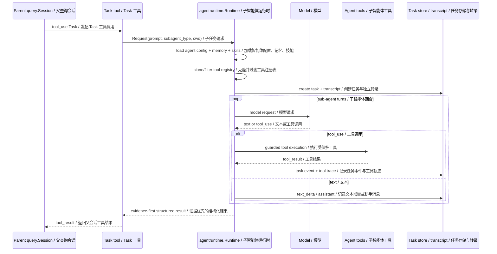
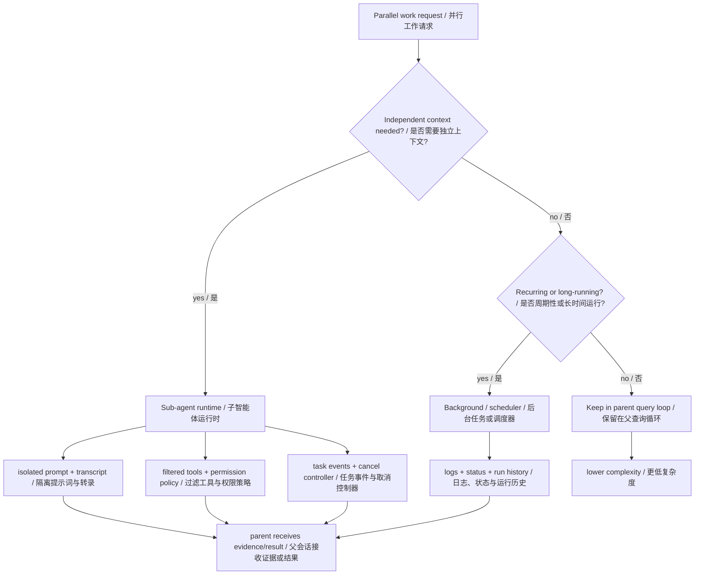
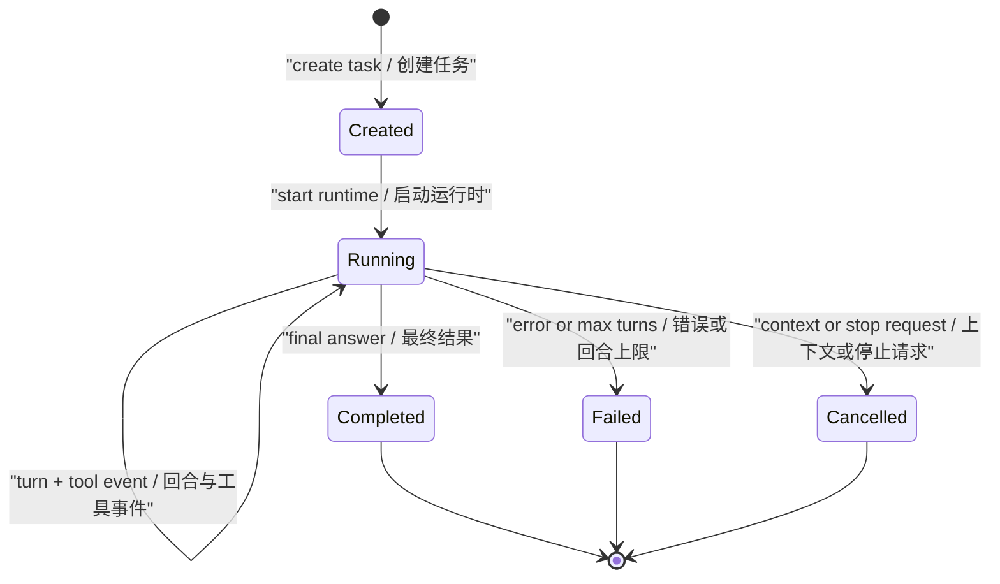
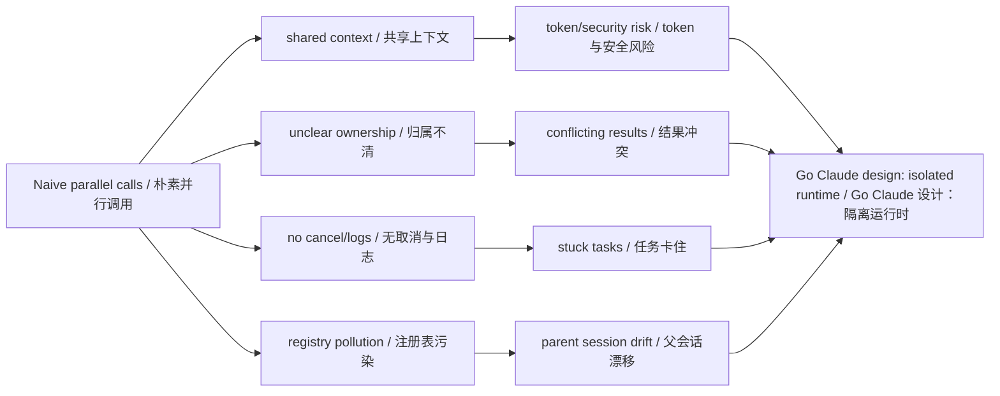
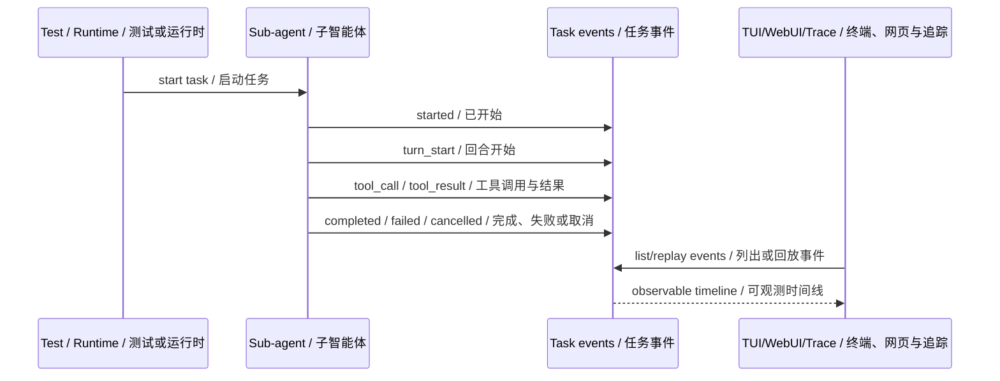

# 第 3 章：并行化 Parallelization

## 书中理论要点

并行化模式用来缩短总耗时、隔离复杂子任务，或让多个专家路径同时工作。它常见于多文档分析、多工具查询、多候选方案评估、批量测试和多 agent 协作。

但智能体并行不是简单地多开 goroutine。工程系统必须回答：子任务是否有独立上下文？工具权限怎么继承？结果怎么汇总？取消和超时怎么处理？失败是否影响主任务？事件和日志如何回放？

## Go Claude 的工程落点

Go Claude 的并行化主要通过三类机制实现：

- `Task` / sub-agent runtime：把一个子任务交给独立 agent 执行。
- background job：让 Goal、Loop 或长任务脱离当前 TUI 生命周期继续运行。
- scheduler：把 recurring loop 从简单 sleep 升级成可管理的本地调度。

核心源码和文档：

- `internal/agentruntime/runtime.go`
- `internal/agentruntime/limits.go`
- `internal/agentbudget/budget.go`
- `internal/tools/task/task.go`
- `internal/tools` 中的 tool context 和 task progress 能力
- `internal/background/background.go`
- `internal/scheduler/scheduler.go`
- `docs/subagent_multiagent/agent_authoring_guide.md`
- `docs/architecture/loop_scheduler_design.md`
- `docs/testing/agent_eval_harness.md`

## 源码映射表

| 层级 | Go Claude 文件 | 学习重点 |
| --- | --- | --- |
| sub-agent runtime | `internal/agentruntime/runtime.go` | `Request`、`Result`、`Run`、`RunBackground`、turn loop、task event、cancel/status。 |
| task tool | `internal/tools/task/task.go` | 父会话如何通过 `Task` 启动 sub-agent，并接收 running handle 或最终 result。 |
| fan-out limits | `internal/agentruntime/limits.go`、`internal/agentbudget/budget.go` | 递归深度、后台 agent 数量、共享累计 token/cost budget。 |
| batch limit | `internal/tools/task/task.go:maxBatchConcurrency` | batch `max_concurrency` 的默认值、硬上限、环境变量覆盖和可观测 clamp。 |
| agent tool | `internal/tools/agent/agent.go` | `AgentCreate` 等后台 agent 管理入口。 |
| registry isolation | `internal/tools/tool.go:Registry.Clone`、`FilterPolicy` | agent-local MCP 和 allowed/denied tools 如何避免污染 parent registry。 |
| permission guard | `internal/tools/guarded.go` | active skill、agent policy、permission prompt、sandbox/hook 的执行层拦截。 |
| background store | `internal/background/background.go` | 长任务日志、状态、停止和结果记录。 |
| scheduler | `internal/scheduler/scheduler.go` | recurring loop 的本地调度、run history 和状态边界。 |
| tests | `internal/agentruntime/runtime_test.go`、`internal/tools/tools_test.go` | registry clone、agent MCP、permission mode、background handle、event lifecycle 的回归保护。 |
| docs | `docs/subagent_multiagent/agent_authoring_guide.md` | agent schema、tools/disallowedTools、MCP、skills、memory、permissionMode 和公开语义。 |

## 机制拆解

Sub-agent 的运行链路大致是：



`internal/agentruntime.Runtime.Run` 和主 `query.Session.run` 很像，也有 turn loop、model request、tool use、tool result、max turns。但 sub-agent 有自己的隔离边界：

- 可以有独立 agent prompt。
- 可以有独立 model、max turns、effort、permission mode。
- 可以按 agent 配置过滤 allowed/denied tools。
- 可以加载 agent-scoped MCP tools，而不污染 parent registry。
- 可以写独立 transcript，并通过 task events 给 TUI/WebUI 展示进度。
- 基础 prompt 要求统一返回 `Summary`、`Evidence`、`Assumptions`、`Unknowns`、`Verification`、`Risks`、`Next action`，让同步、后台、Goal 和 compact 路径解释同一份结果时保持一致。

后台执行则是另一种并行化。`RunBackground` 使用独立 context 启动 sub-agent，并先返回 task metadata；Goal background 和 Loop scheduler 也通过 background/scheduler store 提供日志、状态和停止能力。

## 并行化的边界与冲突处理

并行化最容易遗漏的不是“怎么并发”，而是“并发结果怎么收敛”。



| 问题 | Go Claude 的处理原则 |
| --- | --- |
| 子 agent 能不能继承父 agent 全部上下文 | 不能默认全量继承；sub-agent 有独立 prompt、memory、tool policy、transcript。 |
| 子 agent 能不能修改 parent registry | 不能；agent-scoped MCP tools 通过 clone registry 加载，避免污染父会话。 |
| 子 agent 工具权限与父会话权限冲突 | 子 agent 可有自己的 permission mode，但最终仍走 guarded tool、permission prompt、sandbox 和 hooks。 |
| 多个子任务结果互相矛盾 | runtime 只返回证据和结果，父 agent 或上层 evaluator 负责综合；不能静默挑一个当事实。 |
| 后台任务跑太久或用户取消 | 必须有 task/controller、cancel、status、logs、run history。 |
| 并行执行提升速度但扩大成本 | 递归深度默认最多 2；batch 默认并发 4、硬上限 16；后台 agent 默认进程级上限 16；整个 sub-agent tree 共享累计 token/cost budget。 |
| nested progress 与隐私冲突 | event payload 只放安全摘要和 preview，避免把完整 prompt/工具输出泄漏到 UI/telemetry。 |

也就是说，Go Claude 的并行化不是“多开几个模型调用”，而是把每个并行单元做成可取消、可观测、可限权、可回放的子系统。

## 异常、兜底与恢复

并行化的异常处理要防止两类问题：子任务失败污染主会话，以及后台任务失控。Go Claude 的方向是让每个并行单元都有 task id、status、events、logs 和 tool result 边界。

| 异常场景 | 兜底方式 | 读者应关注 |
| --- | --- | --- |
| agent definition 不存在或 schema 错误 | `loadAgent` / doctor 类检查暴露错误，任务以 failed 结束。 | 不要让 parent session 静默假装任务完成。 |
| 子 agent 工具被禁止 | `FilterPolicy` 和 `guarded.go` 双层拦截，返回工具错误。 | `disallowedTools` 不能被 `tools` 重新放开。 |
| agent-local MCP 加载失败 | 子 agent registry clone 后局部加载；失败只影响本次 agent 能力。 | 不污染 parent registry 是第一边界。 |
| 子任务被取消 | runtime 检查 context / task store 状态，发 `cancelled` event 并 finish task。 | 用户需要能看到取消来源和已执行到哪一轮。 |
| 子 agent 达到 max turns | task failed，保留 turns、events 和 transcript。 | max turns 是防无限 loop 的硬边界。 |
| sub-agent 继续递归委派 | 超过默认深度 2 时，在创建 task/recorder/MCP 前拒绝。 | 深度限制阻断递归乘数，而不是静默移除 `Task`。 |
| batch 请求过高并发 | 将 `max_concurrency` clamp 到默认硬上限 16，并在 summary 返回 clamp note。 | 保留工作语义，同时让降速可观测。 |
| 后台 agent 达到进程上限 | 立即拒绝，不排队。 | 默认上限 16，避免把压力转成不可见内存队列。 |
| sub-agent tree 累计预算耗尽 | 下一次模型请求前返回 `agentbudget.ErrExhausted`。 | nested agents 共享同一个 budget 指针，不能每层重置额度。 |
| 多个子 agent 结果冲突 | runtime 不自动仲裁，只把结果和证据交给父会话或 evaluator。 | 裁决属于上层目标/评估，不属于并行运行时偷偷决定。 |
| 后台任务进程内执行失败 | background/scheduler 记录状态、日志、run history。 | 任务失败必须可回放，不能只返回“失败”。 |



## 为什么这样设计

并行化的收益是吞吐和隔离，但风险是失控：

- 如果子任务共享父 agent 的完整上下文，token 成本和泄露面都会扩大。
- 如果子任务没有 task/event store，用户只能看到“卡住了”，无法知道哪个子任务在跑。
- 如果后台任务没有 stop/cancel 和日志，出了问题只能杀进程。
- 如果 MCP tools 直接注册到 parent registry，临时工具会污染后续主对话。
- 如果递归、batch、后台数量和累计预算没有共同上限，四个维度会相乘形成失控 fan-out。

Go Claude 的做法是把 sub-agent 当成一个独立 runtime，而不是主 loop 里的临时函数调用。这样更重，但更容易观测、取消、限权和回放。



## 最佳实践

- 只有当子任务需要独立上下文、独立工具策略、后台生命周期或可观测事件时，才引入 sub-agent。
- 对并行任务先定义收敛方式：父 agent 综合、Goal evaluator 判断，还是人工 review；不要让 runtime 随机挑结果。
- agent-local MCP 必须 clone registry 后加载，临时工具不能污染 parent session。
- `tools` 和 `disallowedTools` 同时存在时，以 deny 为硬边界，并在执行层再次检查。
- 后台任务必须有 task id、status、logs、stop/cancel 和 run history；否则用户无法判断它是慢、卡住还是失败。
- 不要把单个 `maxTurns` 当作完整资源治理；同时检查递归深度、batch concurrency、后台 agent 数量和共享累计 budget。
- nested progress 只展示安全摘要，避免把完整 prompt、工具输出、密钥或私有路径泄漏到 UI/telemetry。

## 源码阅读路线

1. 读 `internal/agentruntime/runtime.go` 的 `Request` 和 `Result`，看 sub-agent 输入输出边界。
2. 看 `RunBackground`，理解后台 sub-agent 如何启动并返回 running metadata。
3. 跟 `Run` 中的 `loadAgent`、tool registry clone、MCP tools 加载、agent policy。
4. 看 `for turn := 1; turn <= maxTurns; turn++`，比较它和 `query.Session.run` 的相同点与不同点。
5. 看 `emitEvent`、`createTask`、`finishTask`，理解事件和持久化如何支撑 WebUI/TUI 观测。
6. 读 `internal/agentruntime/limits.go`、`internal/agentbudget/budget.go` 和 `internal/tools/task/task.go:maxBatchConcurrency`，理解四层 fan-out 边界。
7. 读 `docs/architecture/loop_scheduler_design.md`，看 recurring task 为什么需要 scheduler，而不是 sleep loop。

## 如何验证

Sub-agent runtime 测试：

```bash
go test ./internal/agentruntime -count=1
go test ./internal/agentbudget ./internal/tools/task -run 'Budget|Depth|Limit|Concurrency|Batch' -count=1
```

Background 和 scheduler 测试：

```bash
go test ./internal/background ./internal/scheduler -count=1
```

如果要确认并行任务在 trace/WebUI 可见，可以搜索 agent task 事件链：

```bash
rg -n "agent.run.started|agent.model.request|nested_agent_progress|AgentTask" internal docs
```



## 学习任务

- sub-agent 和普通工具调用的区别是什么？
- 为什么 sub-agent 需要独立 transcript？
- 为什么 agent-scoped MCP tools 要 clone registry，而不能直接改 parent registry？
- 后台任务为什么必须有日志、status、run history 和 stop？
- 并行化什么时候值得引入，什么时候只是增加复杂度？
- 多个 sub-agent 给出冲突结论时，为什么 runtime 不应该偷偷替用户裁决？
- 并行化为什么必须和资源预算、权限、取消机制一起设计？

## 当前差距

Go Claude 已经具备 sub-agent runtime、background task、scheduler、递归/batch/background 上限和共享累计 token/cost budget。仍可继续增强的是：更细的并发队列与预算可视化、按任务动态分配预算、跨 agent 结果裁决、跨进程公平队列、失败重试策略和多 agent 协议互操作。当前限制主要是进程内防失控与 session/sub-agent-tree 级 circuit breaker，不是完整的集群调度器。

## 本章自审

| 检查项 | 结果 |
| --- | --- |
| 引用真实源码 | 已覆盖 `agentruntime`、Task/Agent 工具、registry、guarded tools、background、scheduler、测试和 subagent 文档。 |
| 至少 3 张图 | 已包含 sub-agent 时序、并行边界、朴素并行风险、task 状态机、验证时序。 |
| 写清楚顺序和优先级 | 已说明是否拆 sub-agent、background/scheduler、parent loop 的选择顺序，以及 agent policy/permission 的边界。 |
| 写清楚冲突处理 | 已覆盖 parent/sub-agent context、registry、工具权限、冲突结果、后台取消、成本和隐私冲突。 |
| 写清楚异常和兜底 | 已补充 agent schema、MCP 加载、工具拒绝、取消、max turns、后台失败和结果冲突处理。 |
| 有验证命令 | 已给出 `agentruntime`、`background`、`scheduler` 测试和事件搜索命令。 |
| 当前差距诚实 | 已说明并发队列、跨 agent 裁决、资源分配、重试策略和协议互操作仍可演进。 |
