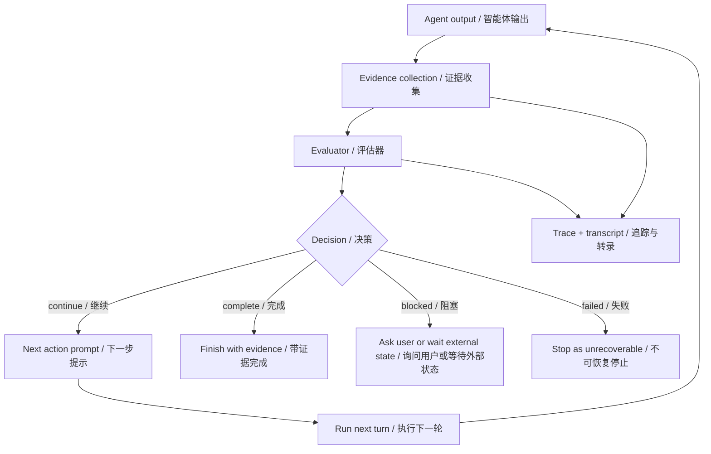
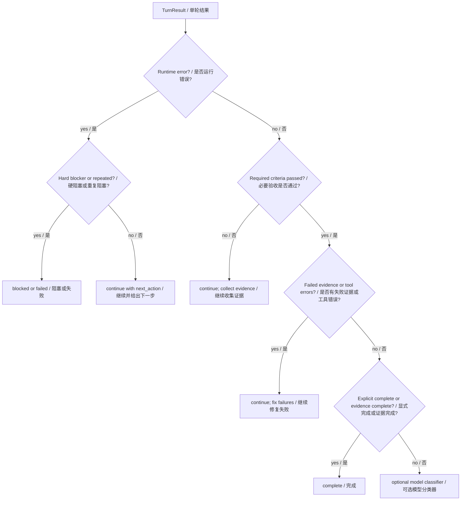
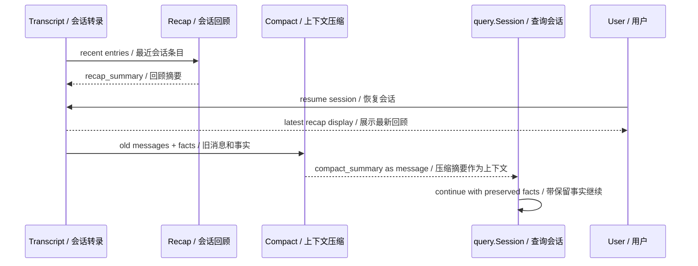
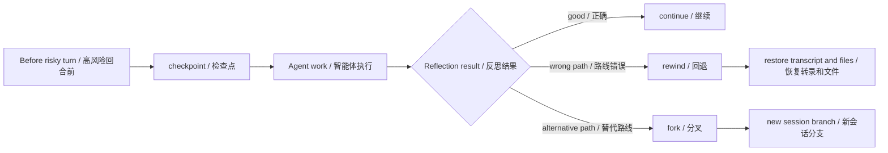
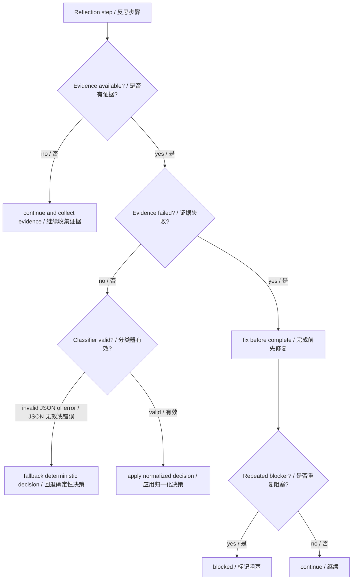

# 第 4 章：反思 Reflection

## 书中理论要点

反思模式是在生成结果之后加入反馈循环：检查输出、发现缺口、修正策略，再继续生成或重写。书中强调的关键点包括生成器/评审者分工、反复优化、根据目标和历史上下文评估结果，以及在达到质量标准或达到迭代上限后停止。

在工程智能体里，反思不能只靠一句“请检查你的答案”。真正有价值的反思必须回答：

- 用什么证据判断结果好坏？
- 谁来评审：模型、规则、测试、trace，还是用户？
- 发现问题后是重试、修复、回退、压缩上下文，还是停止等待人？
- 如何避免无限反思 loop 和“看起来完成”的假阳性？

## Go Claude 的工程落点

Go Claude 没有把 reflection 做成一个单独的 `ReflectionChain`。它把反思拆进多个运行时机制：

- Goal evaluator：根据目标、预算、错误、证据和验收条件判断 continue / complete / blocked / failed。
- Evidence-first completion：required criteria 没通过时，即使模型说完成，也不能完成。
- Recap：把最近会话总结为“目标、已完成、下一步”，帮助人和 agent 恢复上下文。
- Auto compact：长上下文压缩时保留硬事实、文件、命令、风险和未完成任务。
- Checkpoint / rewind / fork：发现方向错误时可以回退或分叉。
- Agent eval / trace：用测试和运行证据评估工具、权限、compact、sub-agent 等链路。

## 源码映射表

| 层级 | Go Claude 文件 | 学习重点 |
| --- | --- | --- |
| goal evaluator | `internal/goal/evaluator.go` | deterministic、model-classified、evidence-first 三层评估。 |
| goal tests | `internal/goal/evaluator_test.go` | required criteria、失败 evidence、显式协议线、预算、invalid JSON fallback。 |
| recap | `internal/recap/prompt.go`、`internal/recap/generator.go` | 生成会话 recap，但不把 recap 注入下一轮模型上下文。 |
| compact reflection | `internal/compact/compactor.go` | 压缩历史时要求保留目标、决策、文件、命令、风险和硬事实。 |
| session recovery | `internal/session/store.go` | checkpoint、rewind、fork、compact_summary、recap invalidation。 |
| agent eval | `internal/agenteval/agenteval.go` | 用规则型 eval 检查工具、权限、compact、trace、sub-agent 等证据。 |
| observability | `docs/observability/trace_viewer.md` | trace viewer 如何展示 checkpoint、compact、recap、error 和 event stream。 |
| docs | `docs/goal_mode/*`、`docs/session_recap/session_recap_plan.md` | 长任务反思、recap 边界、evidence-first 设计意图。 |

## 反思闭环架构



这里的核心是：反思不是模型内心活动，而是“输出 -> 证据 -> 评估 -> 决策 -> 下一步”的工程闭环。

## Goal Evaluator：反思的完成门禁

`internal/goal/evaluator.go` 体现了 Go Claude 对反思的保守态度。完成判断不是只看模型一句话，而是分层裁决：



关键规则：

| 判断点 | 谁优先 | 原因 |
| --- | --- | --- |
| 运行错误 vs 模型自报完成 | 运行错误优先 | 工具失败、权限失败、context cancel 是真实执行证据。 |
| required criteria vs `GOAL_STATUS: complete` | required criteria 优先 | 验收条件没过，模型不能靠一句完成绕过。 |
| failed evidence vs passed criteria | failed evidence 优先 | 最近证据失败时必须先修复失败。 |
| deterministic decision vs model classifier | deterministic 优先 | 模型分类器只处理模糊 continue，不覆盖硬规则。 |
| budget closing vs classifier | budget 优先 | 预算接近边界时不再额外消耗模型分类。 |

## Recap 与 Compact：反思的记忆载体

反思需要历史，但历史不能无限增长。Go Claude 用两种不同摘要解决不同问题：

| 机制 | 进入下一轮模型上下文 | 作用 |
| --- | --- | --- |
| `recap_summary` | 不进入 | 给用户/TUI/resume 看，帮助人快速理解会话状态。 |
| `compact_summary` | 进入 | 替换旧消息，保留继续执行所需事实和未完成任务。 |



`internal/recap/prompt.go` 明确要求 recap 不编造文件修改、测试结果、提交或外部状态，并对 API key、JWT、token 等敏感行脱敏。`docs/session_recap/session_recap_plan.md` 也明确：`MessagesFromTranscriptWithReport` 忽略 `recap_summary`，防止 UI 回顾污染下一轮模型上下文。

`internal/compact/compactor.go` 则要求 compact summary 包含固定标题，并用 `validateSummary` 检查关键硬事实，例如文件和命令不能丢。

## Checkpoint、Rewind 与 Fork

当反思发现路线错了，系统需要能恢复，而不是只说“我会改正”。Go Claude 的 session store 提供三类恢复点：



这让 reflection 具备工程可执行性：如果测试失败、证据矛盾、用户发现方向错，可以回到明确 checkpoint，而不是在同一条混乱上下文里继续补丁式修正。

## 优先级与冲突处理

| 冲突 | 谁优先 | 为什么 |
| --- | --- | --- |
| 模型自评“已完成” vs required criteria pending | criteria pending 优先 | 完成必须有验收证据。 |
| 模型分类 complete vs deterministic blocker | deterministic blocker 优先 | 权限、预算、硬错误是运行边界。 |
| recap 想帮助下一轮模型 vs 安全边界 | 安全边界优先 | recap 是 UI/人类辅助，不进入下一轮模型上下文。 |
| compact 摘要简洁 vs 硬事实完整 | 硬事实完整优先 | `validateSummary` 要求保留关键文件和命令。 |
| rewind 后旧 recap 仍看似有效 | rewind invalidation 优先 | files-only rewind 会写 invalidated recap marker。 |
| eval 报告 vs 单次人工感觉 | eval/trace 证据优先 | 反思需要可复现证据，而不是印象。 |
| 反思继续优化 vs 成本/loop 风险 | budget/max turns 优先 | 防止无限自我修正。 |

## 异常、兜底与恢复



关键兜底：

- classifier 输出 invalid JSON 时，回退 deterministic evaluator。
- context cancel 不把 goal 标成 failed，而是保持 active，等待恢复。
- repeated soft failure 到阈值后才 blocked，避免一次临时失败就中断长期目标。
- compact summary 缺少必要标题、文件或命令事实时视为 invalid，不使用坏摘要替换历史。
- recap 生成失败只记录状态，不阻塞主对话。
- rewind/fork 写入 transcript event，让后续 trace 能解释“为什么上下文变了”。

## 最佳实践

- 反思必须绑定验收标准、测试、工具结果、trace 或人工反馈，不能只让模型“再检查一遍”。
- required criteria 应该写成结构化状态，避免模型靠自然语言绕过完成门禁。
- recap 适合帮助人恢复上下文，不适合当作下一轮模型事实来源。
- compact 适合压缩模型上下文，但必须保留硬事实、未完成任务和风险。
- 每次高风险修正前建立 checkpoint，反思发现错误时才有回退点。
- eval harness 要覆盖关键链路：工具、权限、compact、trace、sub-agent，而不是只比最终文本。

## 源码阅读路线

1. 读 `internal/goal/evaluator.go`，理解 `DeterministicEvaluator`、`EvidenceEvaluator`、`ModelClassifiedEvaluator` 的分工。
2. 读 `internal/goal/evaluator_test.go`，看 required criteria、失败 evidence、invalid JSON fallback 如何被测试锁住。
3. 读 `internal/recap/prompt.go`，确认 recap 的脱敏、截断和“不编造”要求。
4. 读 `internal/compact/compactor.go`，看 summary prompt、facts extraction、summary validation。
5. 读 `internal/session/store.go` 的 checkpoint、rewind、fork、recap invalidation。
6. 读 `internal/agenteval/agenteval.go` 和 `docs/testing/agent_eval_harness.md`，理解如何把反思变成可重复评估。
7. 读 `docs/observability/trace_viewer.md`，看 trace 如何展示 recap、compact、checkpoint、错误和事件流。

## 如何验证

```bash
go test ./internal/goal -run Evaluator -count=1
go test ./internal/recap ./internal/compact -count=1
go test ./internal/session -run 'Rewind|Fork|Compact|Recap' -count=1
go test ./internal/agenteval -run 'DefaultSuite|LiveProfileSkips' -count=1
```

源码搜索：

```bash
rg -n "EvidenceEvaluator|BuildClassificationPrompt|recap_summary|compact_summary|validateSummary|rewind|fork" internal docs
```

运行时验证：

- 在 TUI 中完成一段会话后执行 `/recap`，确认 transcript 出现 `recap_summary`。
- 触发 auto compact 后检查 transcript 中 `compact_summary` 是否保留文件、命令和未完成任务。
- 对 Goal Mode 构造 required criteria pending 的场景，确认模型即使输出 `GOAL_STATUS: complete` 也不会直接完成。
- 打开 Trace Viewer，查看 checkpoint、rewind、compact、recap 和错误事件是否能解释一次修正过程。

## 学习任务

- 为什么反思不能只靠模型自评？
- required criteria 和 failed evidence 同时存在时，为什么不能 complete？
- recap 和 compact 都是摘要，为什么一个不进入模型上下文，一个会进入？
- 如果 classifier 输出 invalid JSON，为什么要回退 deterministic evaluator？
- 什么时候应该 rewind，什么时候应该继续修复？
- eval harness 为什么是 reflection 的一部分，而不是测试章节才需要？

## 当前差距

Go Claude 已经有 evidence-first evaluator、recap、compact、checkpoint/rewind/fork、trace 和 eval harness，但还没有一个统一的“反思编排器”。跨 agent 评审、模型裁判型 eval、自动生成修复方案、多候选路线比较、基于历史失败模式的长期学习仍在演进。当前更可靠的做法是先把反思拆成可测试的证据链和恢复机制。

## 本章自审

| 检查项 | 结果 |
| --- | --- |
| 引用真实源码 | 已覆盖 `internal/goal`、`internal/recap`、`internal/compact`、`internal/session`、`internal/agenteval` 和观测文档。 |
| 至少 3 张图 | 已包含反思闭环、Goal evaluator 决策、recap/compact 时序、checkpoint/rewind/fork、异常兜底。 |
| 写清楚顺序和优先级 | 已说明 evidence、criteria、deterministic evaluator、classifier、budget 的裁决顺序。 |
| 写清楚冲突处理 | 已覆盖模型自评、criteria、失败 evidence、recap 安全边界、compact 事实保留、rewind invalidation。 |
| 写清楚异常和兜底 | 已说明 invalid JSON fallback、context cancel、repeated blocker、compact invalid、recap failure、rewind/fork event。 |
| 有验证命令 | 已给出 goal、recap、compact、session、agenteval 的 focused 测试和搜索命令。 |
| 当前差距诚实 | 已说明当前是分散的证据链和恢复机制，不是统一 reflection orchestrator。 |
