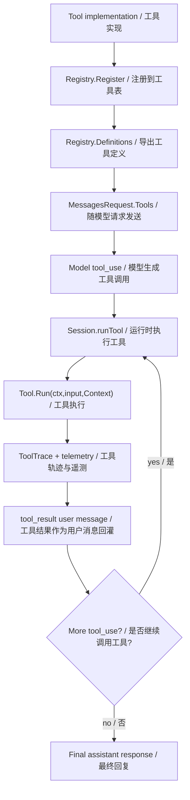
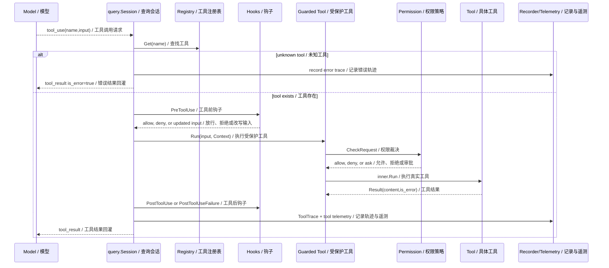
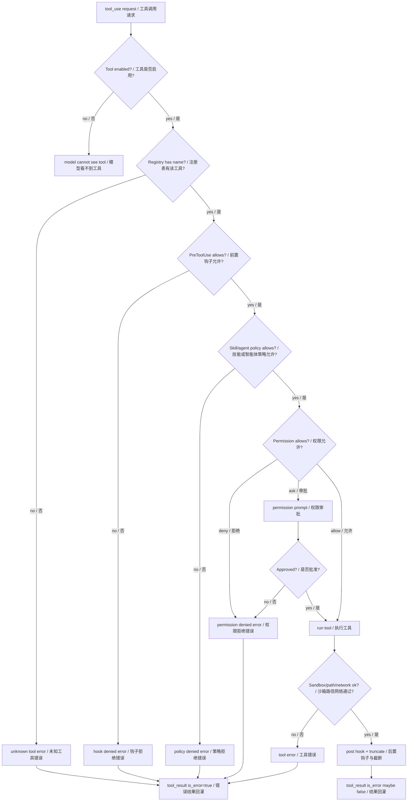
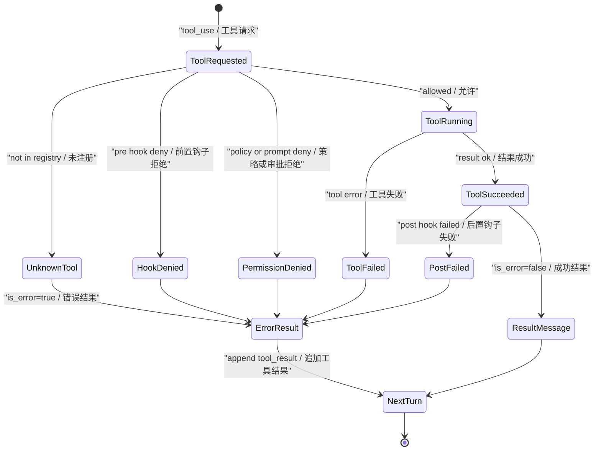

# 第 5 章：工具使用 Tool Use

## 书中理论要点

工具使用让智能体从“生成文本”变成“能观察和行动”的系统。书中把它描述为一条典型链路：定义工具、把工具 schema 暴露给模型、模型选择工具并生成结构化参数、运行时执行工具、工具结果回灌给模型，最后模型基于观察结果继续推理或给出答案。

放到 Go Claude 这种编码智能体里，工具使用的重点不是“会不会 function calling”，而是：

- 工具从哪里注册，怎样变成模型可见的 tool definition。
- 模型请求工具后，运行时怎样校验工具是否存在。
- 工具请求和 active skill、agent policy、permission policy、sandbox、hook 冲突时谁优先。
- 工具失败、权限拒绝、未知工具、输出过长时怎样回灌给下一轮模型。
- 工具执行如何被 transcript、trace、telemetry 和测试证明。

## Go Claude 的工程落点

Go Claude 的工具系统集中在 `internal/tools` 和 `internal/query/query.go`：

- `internal/tools/tool.go` 定义 `Tool` 接口、`Context`、`Result`、`Registry` 和 tool definition 导出。
- `internal/query/query.go:Session.run` 把 registry 的 `Definitions()` 放进 `anthropic.MessagesRequest.Tools`。
- `internal/query/query.go:collectToolUses` 从模型响应中取出 `tool_use` block。
- `internal/query/query.go:runTool` 负责 tool lookup、pre/post hook、工具执行、结果截断、trace 和 telemetry。
- `internal/tools/guarded.go` 把工具包上一层权限策略，处理 active skill、agent policy、session allow/deny、permission prompt。
- `internal/permissions/policy.go` 决定 allow、deny、ask、bypass、危险 shell 命令和 MCP 工具的审批边界。

## 源码映射表

| 层级 | Go Claude 文件 | 学习重点 |
| --- | --- | --- |
| 工具抽象 | `internal/tools/tool.go` | `Tool` 接口、`Context`、`Result`、`Registry`、`Definitions()` |
| 工具 loop | `internal/query/query.go` | `Session.run` 的 turn loop、`tool_use` 收集、`tool_result` 回灌 |
| 工具执行 | `internal/query/query.go:runTool` | lookup、hook、执行、截断、trace、telemetry |
| 权限包装 | `internal/tools/guarded.go` | active skill allowlist、agent policy、permission prompt、permission update |
| 权限裁决 | `internal/permissions/policy.go` | deny/ask/allow/default mode、风险分类、mutating tool |
| 典型工具 | `internal/tools/bash`、`internal/tools/filewrite`、`internal/tools/webfetch` | shell、文件写入、网络访问的安全边界 |
| 测试 | `internal/query/query_test.go`、`internal/tools/guarded_test.go`、`internal/permissions/policy_test.go` | 工具 loop、权限拒绝、审批更新、风险规则 |

## 工具生命周期架构



这张图对应 `Session.run` 的主循环：每轮请求模型时都带上当前 registry 的工具定义；模型如果返回 `tool_use`，runtime 执行工具并把 `tool_result` 作为新的 user message 追加到 `messages`，然后进入下一轮。工具结果不是隐藏在本地变量里，而是显式进入下一次模型上下文。

## 一次工具调用的时序



这个时序说明 Go Claude 不是直接执行模型要求的函数。模型只发出结构化请求，最终是否执行由 registry、hook、guarded tool、permission policy 和具体工具共同决定。

## 执行顺序和优先级

工具调用的优先级可以按下面理解：

| 顺序 | 裁决点 | 谁赢 |
| --- | --- | --- |
| 1 | `DisableTools` 或 registry 为空 | runtime 胜出，`effectiveRegistry()` 返回空 registry，模型看不到工具。 |
| 2 | coordinator mode allowlist | coordinator 工具白名单胜出，registry 被过滤。 |
| 3 | 工具名不存在 | registry 胜出，返回 `unknown tool` 错误。 |
| 4 | `PreToolUse` hook 返回错误或 deny | hook 胜出，工具不执行。 |
| 5 | active skill `AllowedTools` | skill 工具边界胜出，不在列表内直接错误。 |
| 6 | agent policy allowed/denied tools | agent policy 胜出，可进一步收窄工具集合。 |
| 7 | permission policy deny/alwaysAsk/allow/default | permission policy 胜出，必要时触发审批。 |
| 8 | sandbox、路径、网络等工具内部约束 | 具体工具安全边界胜出，例如写路径、网络域名、shell sandbox。 |
| 9 | `PostToolUse` / `PostToolUseFailure` hook | post hook 可把原本成功的结果变成错误。 |
| 10 | `ToolResultLimit` | runtime 胜出，结果过长会截断。 |



## 冲突处理原则

| 冲突 | 处理原则 |
| --- | --- |
| 模型请求了不存在的工具 | 不兜底猜测，不调用相似工具，返回 `unknown tool`。 |
| 模型请求工具，但 `DisableTools=true` | 工具定义不暴露，模型理论上不应产生该工具请求；如果历史消息里出现，也按当前 registry 执行。 |
| active skill 想用未授权工具 | active skill 的 `AllowedTools` 胜出，返回“not allowed by active skill”。 |
| agent policy allowlist 和 denylist 冲突 | denied tools 更硬，`guarded.go` 先检查 allowlist，再检查 denylist，命中 deny 直接拒绝。 |
| permission allow 命中宽泛 shell 规则，但请求高风险 | `permissions.Policy.CheckRequest` 会要求审批，宽泛 allow 不能自动放行危险 shell。 |
| `PreToolUse` hook 改写 input | 改写后的 input 成为实际执行输入，并写入 trace。 |
| 工具成功但 `PostToolUse` hook 失败 | 原成功结果会被转成错误，避免绕过后置治理。 |
| 工具输出过大 | `truncateToolResult` 截断后再回灌，避免单次工具结果撑爆上下文。 |
| 工具失败与模型预期冲突 | 失败是 `tool_result is_error=true` 的运行证据，下一轮模型必须基于错误继续处理。 |

## 异常、兜底与恢复

Go Claude 的工具失败不是直接中断整个会话。大多数工具级失败会以 `tool_result` 形式回灌给模型，让模型可以解释失败、换工具、请求用户授权，或收敛为最终回答。



关键恢复机制：

- 未知工具：返回错误，避免 runtime 猜测模型意图。
- 权限拒绝：返回错误，同时 `PermissionAudit` 和 telemetry 留证据。
- 权限审批：用户可选择 once/session/project/global 等 destination，`applyPermissionUpdate` 会更新对应规则。
- 工具内部错误：作为 `Result{IsError:true}` 回灌，不伪装成成功。
- 模型持续调用工具：受 `MaxTurns` 限制，超过后返回 `max turns reached`。
- 长上下文：`Session.run` 每轮可触发 auto compact，压缩后继续工具 loop。

## 最佳实践

- 工具能力必须先有 schema，再交给模型。读 `Tool.InputSchema()`，不要只看工具名猜能力。
- 工具权限比 prompt 指令更硬。skill、system prompt、用户要求都不能绕过 `guardedTool` 和 sandbox。
- 低风险工具和高风险工具要分开治理。`Read`、`Grep`、`Glob` 与 `Bash`、`Write`、`Edit`、MCP mutating tools 的风险级别不同。
- 工具失败要给模型看。隐藏失败会让模型继续编造，`tool_result is_error=true` 是更好的恢复输入。
- hook 应用于治理和审计，不能替代权限策略。`PreToolUse` 可拒绝或改写输入，`PostToolUse` 可校验输出，但默认安全边界仍在权限和 sandbox。
- 工具输出要限长。工具返回大文件、长日志、网页全文时，应通过截断、摘要或分段读取避免上下文失控。

## 源码阅读路线

1. 读 `internal/tools/tool.go`，理解 `Tool`、`Context`、`Registry`。
2. 读 `Registry.Definitions()`，确认工具如何变成模型请求里的 tool schema。
3. 读 `internal/query/query.go:Session.run`，找到 `registry.Definitions()`、`collectToolUses`、`tool_result` 追加。
4. 读 `internal/query/query.go:runTool`，按 lookup、pre hook、tool.Run、post hook、trace 的顺序走一遍。
5. 读 `internal/tools/guarded.go`，理解 active skill、agent policy、permission prompt 的优先级。
6. 读 `internal/permissions/policy.go`，重点看 `CheckRequest`、`IsMutatingTool`、`ClassifyRequestRisk`。
7. 读一个具体工具，例如 `internal/tools/filewrite/filewrite.go` 或 `internal/tools/bash/bash.go`，确认工具内部如何使用 `tools.Context`。

## 如何验证

静态阅读：

```bash
rg -n "type Tool interface|func \\(r \\*Registry\\) Definitions|func \\(s \\*Session\\) runTool|collectToolUses|effectiveRegistry" internal/tools internal/query
rg -n "AllowedTools|AgentPolicy|PermissionPrompt|CheckRequest|ClassifyRequestRisk" internal/tools internal/permissions
```

单元测试：

```bash
go test ./internal/tools ./internal/permissions -run 'Guard|Permission|Risk|Network|Writable' -count=1
go test ./internal/query -run 'Tool|Permission|Hook|MaxTurns' -count=1
```

智能体链路评测：

```bash
go run ./cmd/golang-cc eval agents --json
```

重点看报告里的 `tool`、`permission`、`trace` case，它们能证明工具调用、工具错误回灌和 telemetry evidence 都走了真实 `query.Session`。

## 学习任务

1. 找一个只读工具和一个写工具，比较它们的 `InputSchema()`、`Run()` 和权限边界。
2. 构造一个会触发 unknown tool 的 fake model 响应，观察 `ToolTrace.IsError`。
3. 把 permission default mode 改成 `ask`，验证 mutating tool 是否触发审批。
4. 写一个 `PreToolUse` hook 拒绝 `Bash`，确认工具不会执行且结果会回灌。
5. 调小 `ToolResultLimit`，验证大工具输出如何被截断。

## 当前差距

- 当前工具执行是清晰的 registry + runtime loop，但不同工具的风险等级还主要靠 permission policy、具体工具和测试约束，没有形成独立的统一风险清单文档。
- 工具输出截断保护了上下文，但读者要注意：截断后的结果可能不足以完成任务，模型需要继续分段读取或请求更精确的工具输入。
- MCP 工具通过 adapter 接入同一套工具系统，但远程 server 的真实副作用只能通过权限、callback、sandbox 和 server 端契约共同治理，不能只看本地 `Tool` 接口。

## 本章自审

| 检查项 | 结果 |
| --- | --- |
| 引用了真实源码路径 | 已覆盖 `internal/tools`、`internal/query`、`internal/permissions`。 |
| 至少 3 张图 | 已包含生命周期架构图、调用时序图、裁决流程图、失败状态图。 |
| 写清楚顺序和优先级 | 已列出 10 个执行裁决点。 |
| 写清楚冲突处理 | 已覆盖未知工具、skill/agent/permission/hook/sandbox/post hook 冲突。 |
| 写清楚异常和兜底 | 已说明错误回灌、审批更新、max turns、auto compact。 |
| 有验证命令 | 已提供 `rg`、`go test`、`eval agents`。 |
