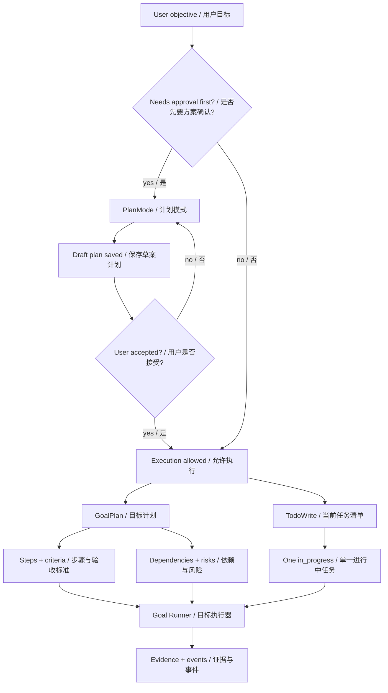
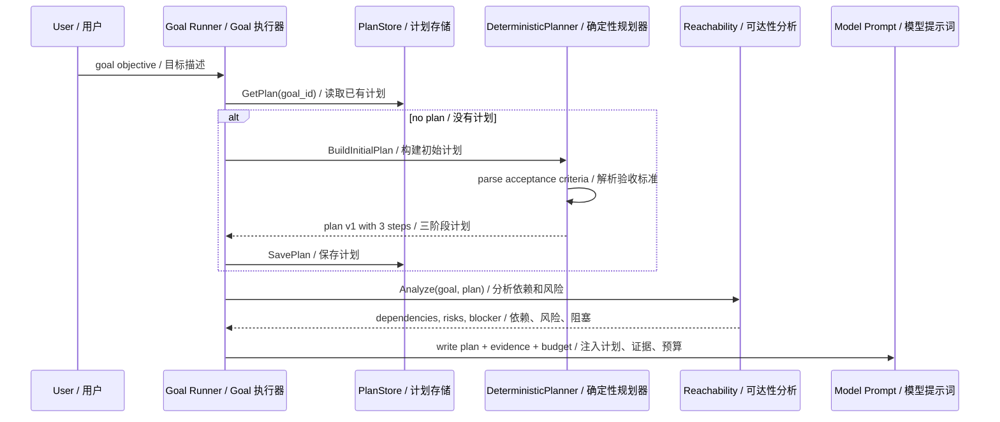
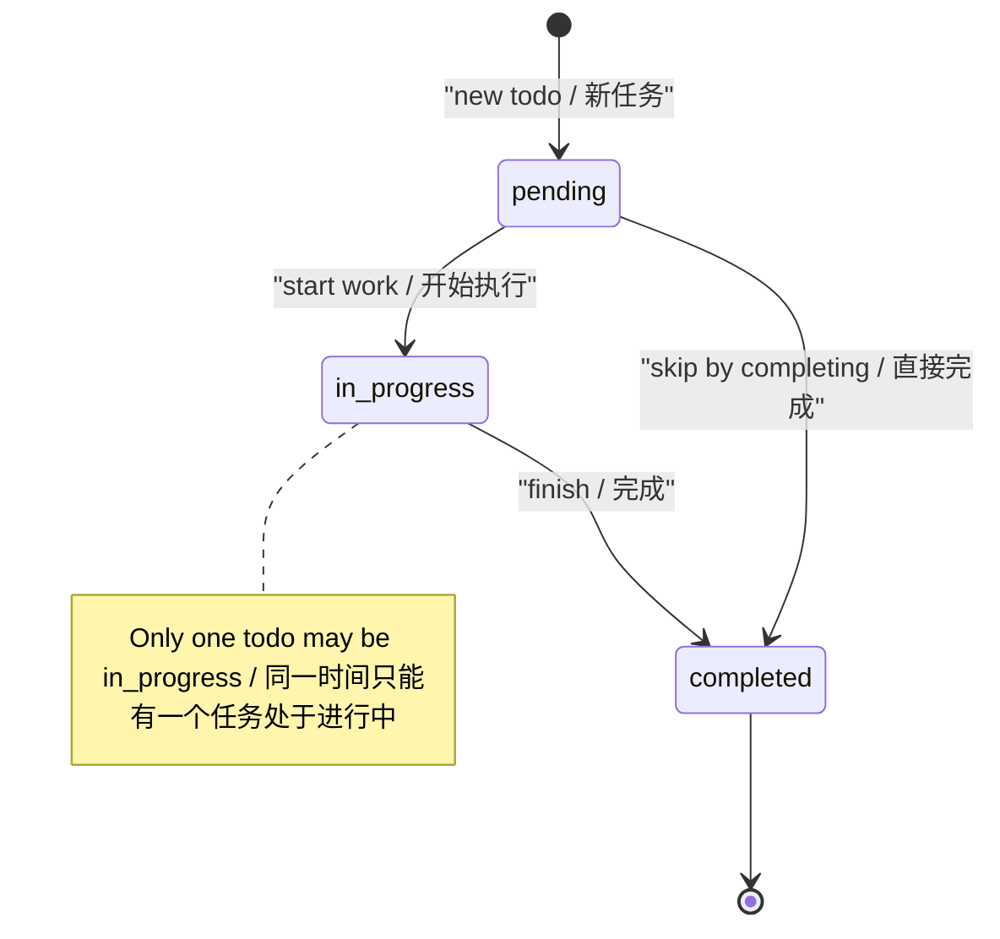
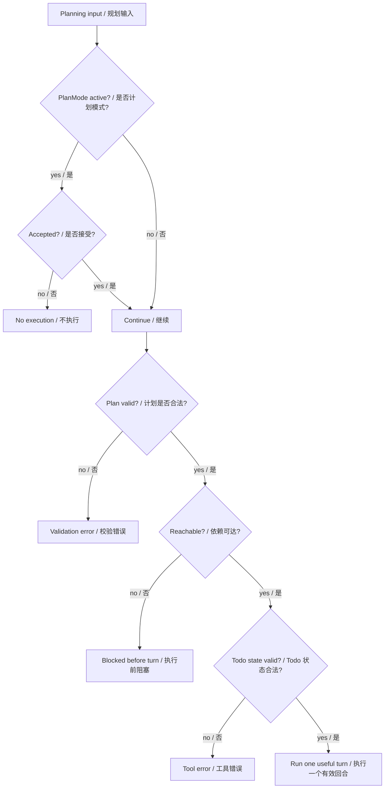
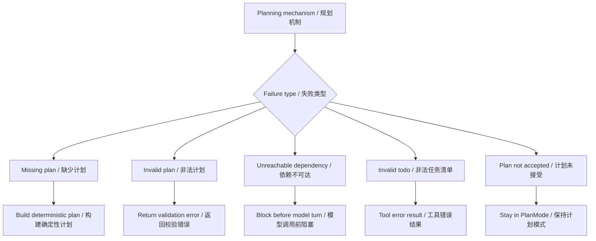

# 第 6 章：规划 Planning

## 书中理论要点

规划模式解决的问题是：智能体不能只靠下一句话即时反应，而要先把目标拆成可执行步骤、验收标准、依赖和风险，再逐步推进。书中的规划通常强调“先计划，再行动”，但在真实工程智能体里，规划必须进一步落到状态、约束和证据。

Go Claude 的实践重点不是让模型写一段漂亮计划，而是把规划拆成三层：

- `GoalPlan`：长期目标的结构化计划，包含 steps、criteria、dependencies、risks。
- `TodoWrite`：当前会话的轻量执行清单，约束同一时间只能有一个 `in_progress`。
- `PlanMode`：用户要求“先别改，先说方案”时的保护模式，计划未被接受前不进入执行。

这三层分别服务不同粒度：Goal 负责长期任务，Todo 负责当前工作节奏，PlanMode 负责人类确认边界。

## Go Claude 的工程落点

核心源码：

- `internal/goal/plan.go` 定义 `GoalPlan`、`GoalStep`、`GoalCriterion`、`GoalDependency`、`GoalRisk`、`GoalEvidence`。
- `internal/goal/planner.go` 的 `DeterministicPlanner.BuildInitialPlan` 从 objective 提取验收标准并生成默认三步计划。
- `internal/goal/runner.go` 的 `ensurePlan`、`writePlanPromptContext`、`writeEvidencePromptContext` 把计划和证据写进每个 Goal turn prompt。
- `internal/goal/reachability.go` 在执行前检查工作目录、凭证、外部依赖、破坏性操作等风险。
- `internal/tools/todowrite/todowrite.go` 实现会话级 todo 读写和“最多一个 in_progress”约束。
- `internal/tools/planmode/planmode.go` 实现进入和退出 PlanMode 的持久化状态。
- `docs/goal_mode/goal_mode_design.md` 和 `docs/goal_mode/goal_mode_optimization_todo.md` 记录 Goal Mode 的设计和优化完成状态。

## 源码映射表

| 层级 | Go Claude 文件 | 学习重点 |
| --- | --- | --- |
| 计划模型 | `internal/goal/plan.go` | steps、criteria、dependencies、risks、evidence schema |
| 初始规划 | `internal/goal/planner.go` | objective 解析、验收标准提取、默认三阶段计划 |
| Goal 执行 | `internal/goal/runner.go` | ensure plan、turn prompt context、plan/evidence/budget 注入 |
| 可达性检查 | `internal/goal/reachability.go` | workspace、凭证、外部依赖、破坏性动作、预算风险 |
| 会话任务清单 | `internal/tools/todowrite/todowrite.go` | todo schema、状态校验、单一 in_progress、sandbox 写入 |
| 方案确认 | `internal/tools/planmode/planmode.go` | EnterPlanMode、ExitPlanMode、accepted gate |
| 设计文档 | `docs/goal_mode/goal_mode_design.md` | Goal 是持久化目标状态机，不是简单 prompt loop |

## 规划分层架构



这张图说明：计划不是单一对象。`PlanMode` 管“能不能开始改”，`GoalPlan` 管“长期目标怎么收敛”，`TodoWrite` 管“当前回合先做什么”。

## 初始计划生成链路



`DeterministicPlanner` 不依赖模型生成初始计划。它从 objective 中识别 `Acceptance Criteria`、`验收标准`、`完成条件` 等标题，提取条目作为 required criteria。如果 objective 里没有明确验收标准，就生成一个兜底标准：目标被满足。

默认三步是：

| Step | 英文标题 | 中文含义 |
| --- | --- | --- |
| `step_plan` | Clarify objective and constraints | 澄清目标和约束 |
| `step_execute` | Execute the next useful change | 执行下一步有效改动 |
| `step_verify` | Verify acceptance criteria | 验证验收标准 |

这比“模型自由规划”更稳定，因为计划 schema 和默认步骤由代码控制。

## TodoWrite 状态约束



`TodoWrite` 是覆盖式写入 `.claude/todos.json` 的工具。它校验：

- `content` 必填。
- `status` 只能是 `pending`、`in_progress`、`completed`。
- `priority` 只能是空、`low`、`medium`、`high`。
- 空 ID 会自动补成 `todo-1`、`todo-2`。
- `in_progress` 数量大于 1 时直接返回错误。
- 写入路径必须通过 `EnsureWritablePathWithSandbox`。

这让 todo 不是模型口头承诺，而是会话内可读、可验证、受 sandbox 保护的状态。

## 优先级与冲突处理

| 冲突 | 谁优先 | 为什么 |
| --- | --- | --- |
| 用户明确说“先不改，先说方案” vs agent 想直接执行 | PlanMode / 用户确认优先 | `EnterPlanMode` 保存草案，`ExitPlanMode` 必须 `accepted=true` 才退出。 |
| objective 没写验收标准 vs Goal 需要 criteria | `DeterministicPlanner` 兜底 | 自动创建 `crit_objective_satisfied`，避免没有完成门槛。 |
| 模型说完成 vs required criteria 仍 pending | evidence gate 优先 | 第 11 章会展开，`EvidenceEvaluator` 会阻止过早 complete。 |
| 当前工作目录不可写 vs 计划可执行 | reachability 优先 | `dep_cwd_writable` 是 required dependency，missing/blocked 会在执行前阻塞。 |
| objective 提到密钥、凭证、破坏性命令 | risk 优先 | 高风险或 critical risk 会进入 blocked，不能靠 prompt 继续冲过去。 |
| TodoWrite 写了多个 `in_progress` | tool validation 优先 | 工具直接返回错误，不保存非法状态。 |
| TodoWrite 写入 `.claude/todos.json` 但 sandbox 不允许 | sandbox 优先 | `EnsureWritablePathWithSandbox` 是硬边界。 |
| GoalPlan 的 `CurrentStepID` 不存在 | plan validation 优先 | `GoalPlan.Validate` 直接报错，避免 runner 使用悬空步骤。 |



## 异常、兜底与恢复

规划失败通常不是系统崩溃，而是进入更明确的状态：

- 计划缺失：`ensurePlan` 尝试用 `DeterministicPlanner` 自动创建。
- objective 为空：`BuildInitialPlan` 返回 `goal objective is required`。
- criteria 缺失：自动创建目标满足类 criteria。
- 依赖不可达：`applyReachability` 在真正模型 turn 前把 Goal 标记为 blocked。
- 高风险凭证或破坏性操作：`objectiveRisks` 生成 high/critical risk，阻止继续。
- Todo 状态非法：`TodoWrite` 返回 `IsError=true`，模型下一轮能看到错误。
- PlanMode 未接受：`ExitPlanMode` 返回错误并保持 plan mode。



这种设计的关键是“失败有落点”：不是让模型继续猜，而是通过 validation、blocked state、tool error、PlanMode gate 把坏情况显式化。

## 最佳实践

- 复杂任务先写验收标准。`DeterministicPlanner` 能解析 `Acceptance Criteria` / `验收标准`，验收标准越清楚，后续 evidence gate 越可靠。
- 不要把 GoalPlan、TodoWrite、PlanMode 混成一个概念。长期目标、当前执行清单、人类确认边界应分层。
- 一个回合只推进一个关键任务。`TodoWrite` 的单一 `in_progress` 是为了减少模型在多个任务间来回跳。
- 计划要带依赖和风险。凭证、外部服务、破坏性动作、低预算都应先暴露为风险，而不是等失败后再解释。
- 计划不能替代验证。`step_verify` 和 acceptance criteria 必须最终靠 evidence、测试、命令或文档证据闭环。
- 当用户要求“先不改”时，PlanMode 或聊天层计划优先，不能把计划文档当成执行授权。

## 源码阅读路线

1. 读 `internal/goal/plan.go`，理解每个状态枚举和 `Validate()` 的硬约束。
2. 读 `internal/goal/planner.go`，看 objective 如何提取验收标准。
3. 读 `internal/goal/runner.go:ensurePlan`，确认计划何时创建、何时保存。
4. 读 `internal/goal/runner.go:writePlanPromptContext`，看当前 step 和 pending criteria 如何进入模型上下文。
5. 读 `internal/goal/reachability.go`，理解执行前如何发现 workspace、凭证、外部依赖和破坏性风险。
6. 读 `internal/tools/todowrite/todowrite.go`，确认 todo validation 和 sandbox 写入路径。
7. 读 `internal/tools/planmode/planmode.go`，确认 accepted gate。

## 如何验证

静态阅读：

```bash
rg -n "type GoalPlan|GoalStep|GoalCriterion|GoalDependency|GoalRisk|GoalEvidence|func \\(p GoalPlan\\) Validate" internal/goal
rg -n "BuildInitialPlan|parseObjectiveCriteria|Acceptance Criteria|验收标准|完成条件" internal/goal
rg -n "TodoWrite|only one todo can be in_progress|EnterPlanMode|ExitPlanMode" internal/tools
```

单元测试：

```bash
go test ./internal/goal -run 'Planner|Reachability|Plan' -count=1
go test ./internal/tools/todowrite ./internal/tools/planmode -count=1
```

Goal 设计文档阅读：

```bash
rg -n "Goal mode|Runner Loop|Evaluator|plan|evidence|budget" docs/goal_mode
```

## 学习任务

1. 写一个带 `验收标准` 的 objective，预测 `parseObjectiveCriteria` 会生成几个 criteria。
2. 构造一个没有验收标准的 objective，解释为什么系统仍然会生成 `crit_objective_satisfied`。
3. 找出 `GoalPlan.Validate` 会拒绝哪些非法状态。
4. 用 `TodoWrite` 的 schema 解释为什么两个 `in_progress` 不是“模型风格问题”，而是工具级错误。
5. 解释 PlanMode 为什么必须有 `accepted=true` 才能退出。

## 当前差距

- 初始 `DeterministicPlanner` 是保守规划器，只做 objective 解析和默认三阶段计划，不会像高级项目经理一样自动生成复杂依赖图。
- `GoalPlan` 有 evidence IDs 字段，但计划 step/criteria 的自动状态更新仍依赖后续 runner/evaluator/store 组合，不应把它理解成完整项目管理系统。
- `TodoWrite` 是会话级 `.claude/todos.json`，不是跨租户或跨设备任务系统。
- PlanMode 工具保存状态，但“计划模式期间哪些工具能调用”的最终体验还取决于上层 agent 指令和客户端流程。

## 本章自审

| 检查项 | 结果 |
| --- | --- |
| 引用了真实源码路径 | 已覆盖 `internal/goal`、`internal/tools/todowrite`、`internal/tools/planmode`、`docs/goal_mode`。 |
| 至少 3 张图 | 已包含规划分层架构、初始计划时序、Todo 状态机、冲突裁决、失败兜底。 |
| 写清楚顺序和优先级 | 已说明 PlanMode、GoalPlan、Reachability、Todo validation 的裁决顺序。 |
| 写清楚冲突处理 | 已覆盖未接受计划、缺少 criteria、不可写 cwd、高风险 objective、多个 in_progress。 |
| 写清楚异常和兜底 | 已说明 ensurePlan、默认 criteria、blocked before turn、tool error、PlanMode 保持。 |
| 有验证命令 | 已提供 `rg`、`go test`、Goal 文档阅读命令。 |
