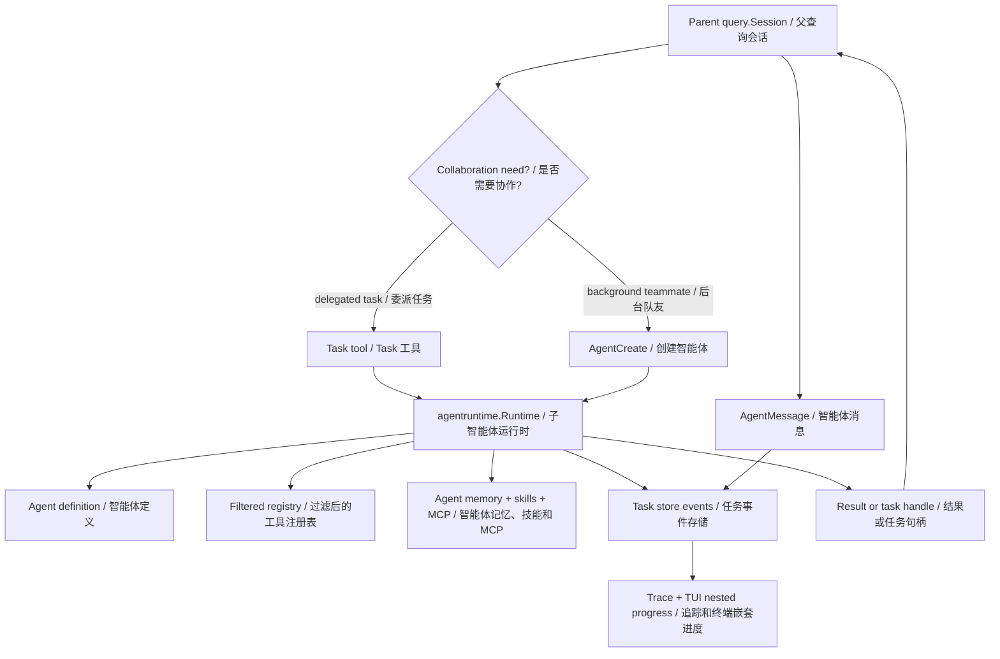
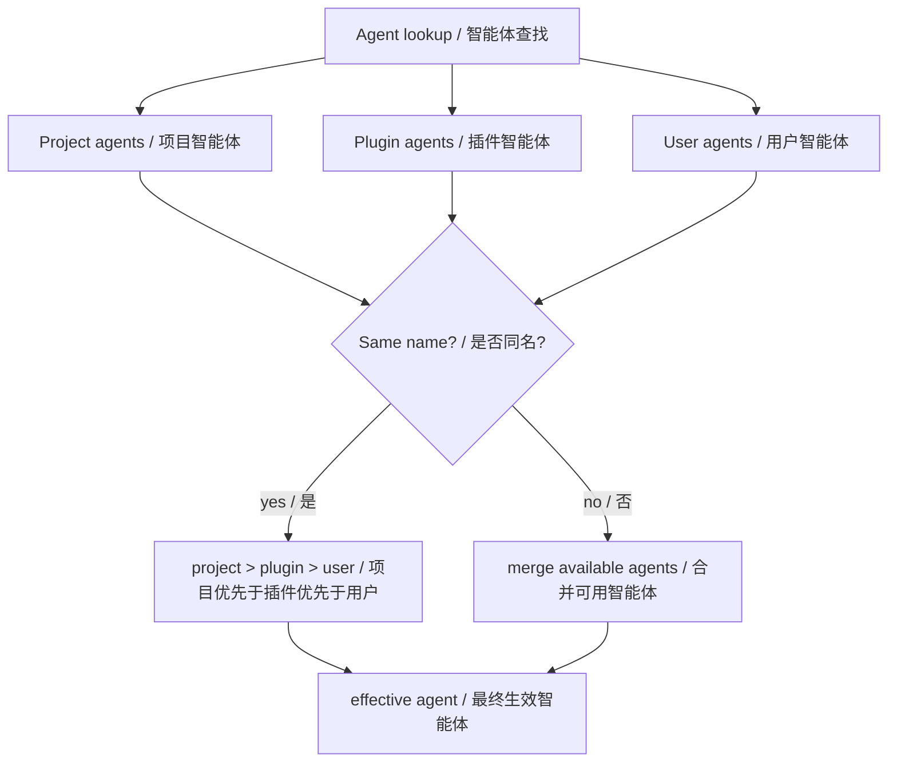
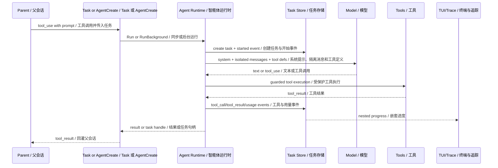
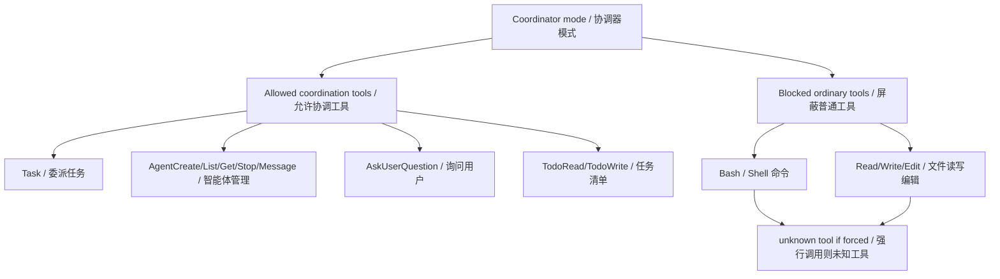
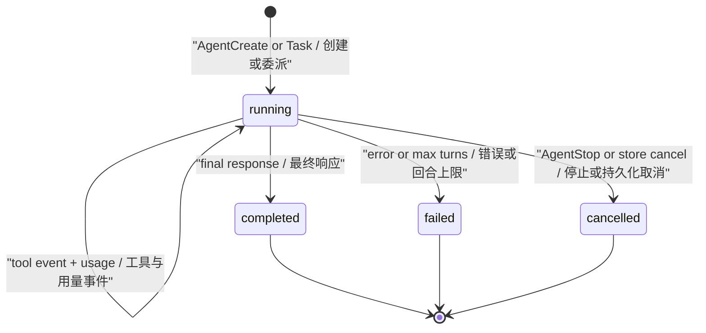
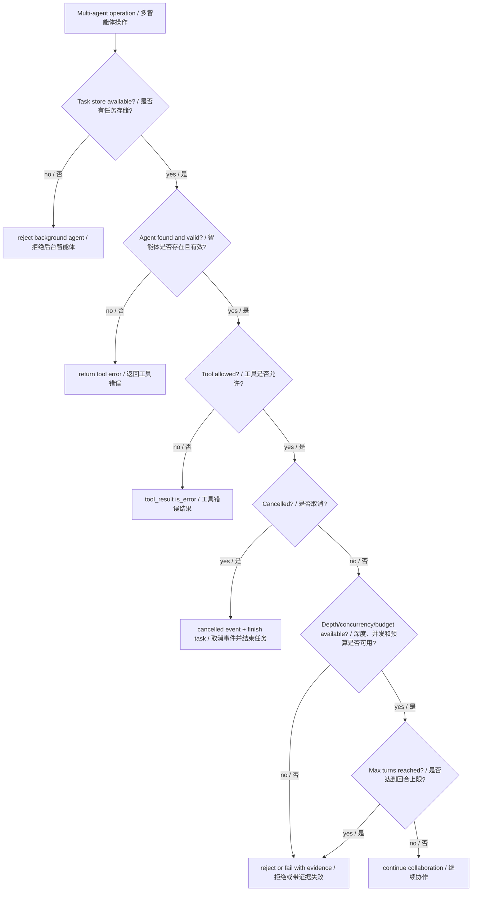

# 第 7 章：多智能体协作 Multi-Agent Collaboration

## 书中理论要点

多智能体协作模式把一个复杂任务拆给多个角色：协调者、研究者、执行者、评审者、工具专家、后台观察者等。它的价值不是“多几个 agent 更热闹”，而是用角色分工、隔离上下文、并行执行和显式通信降低复杂度。

真正落地时，多 agent 必须解决这些工程问题：

- 每个 agent 的身份、prompt、工具、记忆、模型和权限从哪里来？
- 子 agent 能不能继承父会话上下文？
- 多个 agent 如何通信、取消、回放和汇总？
- 工具权限、MCP、skills、hooks 和 telemetry 如何隔离？
- 协作结果冲突时，谁负责裁决？

## Go Claude 的工程落点

Go Claude 的多智能体协作主要由四层组成：

- Agent authoring：`.claude/agents/*.md`、`~/.claude/agents/*.md`、plugin agents，定义 schema 和 prompt。
- Runtime：`internal/agentruntime.Runtime` 负责 sub-agent model/tool loop、独立 transcript、task events 和 hooks。
- Tools：`Task`、`AgentCreate`、`AgentList`、`AgentGet`、`AgentStop`、`AgentMessage` 负责启动、管理、通信和停止。
- Observability：agent task store、nested progress、telemetry、Trace Viewer、eval harness 负责证明协作链路真实发生。

## 源码映射表

| 层级 | Go Claude 文件 | 学习重点 |
| --- | --- | --- |
| agent schema | `internal/agents/agents.go`、`docs/subagent_multiagent/agent_authoring_guide.md` | agent 文件来源、frontmatter、优先级、tools/disallowedTools、MCP、skills、memory。 |
| sub-agent runtime | `internal/agentruntime/runtime.go`、`limits.go` | 独立 system、turn loop、统一输出契约、tool result、events、hooks、usage、cancel、agent-local MCP、递归和后台数量上限。 |
| task tool | `internal/tools/task/task.go` | `Task` 单任务、batch、background、priority、retry、timeout、并发 clamp 和结果回灌。 |
| cumulative budget | `internal/agentbudget/budget.go` | 一个 parent session 下的 nested sub-agent tree 如何共享累计 token/cost circuit breaker。 |
| agent tools | `internal/tools/agent/agent.go` | `AgentCreate/List/Get/Stop/Message` 后台任务管理和消息投递。 |
| task state | `internal/agenttasks/agenttasks.go`、`controller.go` | task/status/event schema、进程内 cancel controller、持久化取消检查。 |
| query integration | `internal/query/query.go`、`internal/query/query_test.go` | coordinator 工具 allowlist、pending agent messages、nested progress。 |
| API/server | `internal/server/server.go` | tenant agent task create/get/list/update/cancel/message/events API。 |
| eval | `internal/agenteval/agenteval.go`、`docs/testing/agent_eval_harness.md` | subagent parity、multiagent E2E、trace evidence。 |

## 协作架构图



这张图的重点是：父会话不是把完整上下文丢给子 agent，而是通过 tool 或 background task 创建一个受控运行时。

## Agent 加载与优先级

Agent 文件来自 user、project、plugin 三类来源。最终同名优先级是：



Agent schema 的关键字段包括：

| 字段 | 作用 | 冲突点 |
| --- | --- | --- |
| `tools` | 允许该 agent 使用的工具集合 | 不能覆盖 `disallowedTools`。 |
| `disallowedTools` | 禁止工具 | deny 永远更硬。 |
| `mcpServers` | agent-local MCP 或继承引用 | 对象配置只进入当前 agent registry。 |
| `skills` | 预加载 skill 内容到 agent system prompt | skill metadata 不污染 main thread。 |
| `memory` | agent-scoped memory | 只注入目标 agent。 |
| `model` / `maxTurns` / `effort` | 子 agent 模型、回合和 thinking 配置 | 用户显式 CLI 参数可覆盖 main-thread agent 配置。 |
| `permissionMode` | 子 agent 默认权限模式 | 不能越过父会话或 session deny。 |

## 一次协作时序



同步 `Task` 会把子 agent 最终内容作为 tool result 返回父会话。sub-agent 基础 prompt 统一要求 `Summary`、`Evidence`、`Assumptions`、`Unknowns`、`Verification`、`Risks`、`Next action`，使 query、Goal、compact 和 UI 对完成、失败、超时、partial 结果采用同一语义。后台 agent 会先返回 `task_id`、`session_id`、`agent_name`、`model`、`permission_mode` 等句柄，父会话可以继续用 `AgentGet`、`AgentMessage`、`AgentStop` 管理。

## Fan-out 与累计预算边界

多 agent 能力不能只依赖每个 agent 的 `maxTurns`。当前 runtime 同时限制四个相乘维度：

| 维度 | 默认边界 | 行为 |
| --- | --- | --- |
| nested recursion | 深度 2 | 超限时在创建 task、recorder、MCP server 之前拒绝，并要求当前 agent 直接完成剩余工作。 |
| Task batch | 默认并发 4，硬上限 16 | 过高的 `max_concurrency` 被 clamp，batch summary 显式返回 clamp note；可用 `GOLANG_CLAUDE_CODE_MAX_BATCH_CONCURRENCY` 调整上限。 |
| detached background agents | 进程级 16 | 达到上限立即拒绝而不是排队；可用 `GOLANG_CLAUDE_CODE_MAX_BACKGROUND_AGENTS` 调整。 |
| cumulative sub-agent usage | 20,000,000 tokens；cost 默认关闭 | 同一 sub-agent tree 共享 budget，在下一次请求前熔断；分别用 `GOLANG_CLAUDE_CODE_SUBAGENT_TOKEN_BUDGET`、`GOLANG_CLAUDE_CODE_SUBAGENT_COST_BUDGET_USD` 配置。 |

累计 token 是包含 cache read 的完整 prompt 工作量指标，不等同账单 token；cost 使用配置的 provider/model 分层价格。这个 budget 只约束 sub-agent fan-out，不计量 parent 主会话。

## Coordinator 与 Teammate

Go Claude 区分普通 sub-agent、coordinator 和 teammate：

| 模式 | 入口 | 主要用途 |
| --- | --- | --- |
| sub-agent | `Task` 或 `AgentCreate mode=subagent` | 一次委派任务或后台任务。 |
| teammate | `AgentCreate mode=teammate` | 同进程后台协作，支持 message、progress summary、stop。 |
| coordinator | `CoordinatorPrompt` | 主线程只暴露协调工具，负责分派、询问、汇总。 |

coordinator 模式的关键不是 prompt 变了，而是工具面收窄。测试 `TestCoordinatorModeRestrictsTools` 验证 coordinator 只暴露 `Task`、`TaskOutput`、`AgentCreate`、`AgentList`、`AgentGet`、`AgentStop`、`AgentMessage`、`AskUserQuestion`、`TodoRead`、`TodoWrite` 等协调工具；普通 `Bash` / `Read` 不进入工具定义，模型硬调也会变成 unknown tool。



## 通信、取消与回放

后台协作需要明确消息和取消语义：

- `AgentMessage` 把消息写为 `agenttasks.EventMessage`，目标 agent 每轮开始读取 pending messages 并作为 user message 注入。
- `AgentStop` 先尝试进程内 `Controller.Cancel(taskID)`，再通过 task store 持久化 cancel，跨进程时仍可让运行态轮询取消。
- `AgentGet` 可以汇总事件，展示 turns、messages、tool_calls、tool_results、latest_text 和 status。
- `SubagentStart` / `SubagentStop` hooks 带 task id、agent id、agent transcript path、last assistant message 和 status。



## 优先级与冲突处理

| 冲突 | 谁优先 | 为什么 |
| --- | --- | --- |
| project/user/plugin 同名 agent | project > plugin > user | 项目规则最贴近当前代码库，用户全局作为默认。 |
| `tools` allow 与 `disallowedTools` deny | deny 优先 | 禁止工具不能被 allow 重新打开。 |
| agent permissionMode 与父会话 deny | 父会话和 session deny 优先 | 子 agent 不能扩大父会话安全边界。 |
| agent-local MCP 与 parent registry | clone registry 优先 | agent 局部 MCP 不能污染父会话工具集合。 |
| background agent 与无 task store | 拒绝启动 | 没有 store 就无法 status、events、cancel 和回放。 |
| nested delegation 与递归上限 | 深度上限优先 | 默认最多深度 2，避免递归与 batch 并发相乘。 |
| batch 请求并发与进程容量 | concurrency ceiling 优先 | 超出上限时 clamp 并在 summary 说明，不静默接受 500 个并发。 |
| sub-agent 目标与累计预算 | budget circuit breaker 优先 | token/cost 耗尽后不再发下一次模型请求。 |
| coordinator prompt 与普通工具能力 | coordinator allowlist 优先 | 协调器负责分派和汇总，不直接执行普通工具。 |
| 多 agent 结论冲突 | 父会话/Goal evaluator/用户裁决 | runtime 只提供结果和证据，不偷偷挑一个事实。 |
| nested progress 与隐私 | 安全摘要优先 | event payload 只放 preview，不泄露完整 prompt 和工具输出。 |

## 异常、兜底与恢复



关键兜底：

- agent schema 错误或 agent not found，返回工具错误，不创建不可观测的半任务。
- background agent 没有 task store 时拒绝，因为无法提供句柄、事件和取消。
- MCP 加载只作用于 clone registry，加载失败不污染 parent registry。
- 子 agent 请求未暴露工具时返回 unknown tool 或 guarded error。
- 模型请求失败、context deadline、store cancel 都写 failed/cancelled event。
- 超过递归深度时不创建任何持久化残留；batch concurrency clamp 会进入 summary；后台容量满时立即返回可操作错误；累计 budget 耗尽使用可分类的 `agentbudget.ErrExhausted`。
- `SubagentStop` hook 在 `context.WithoutCancel` 下运行，避免取消后丢失收尾通知。

## 最佳实践

- 只有当任务需要独立角色、独立上下文、后台生命周期或可回放事件时，才拆 sub-agent。
- agent 文件必须写清楚 `description`、工具边界、是否后台、max turns 和权限模式。
- 给 agent 开 MCP 时优先用 agent-local 配置，避免工具泄露到父会话。
- 多 agent 输出必须由父会话、Goal evaluator 或用户汇总裁决，不能把冲突结果自动合并成事实。
- 对后台 agent 一定要能 `AgentGet`、`AgentStop`、查看 events，否则用户无法判断任务状态。
- 设计多 agent 流程时同时预算 depth、batch concurrency、background count 和 cumulative usage；只限制单 agent `maxTurns` 不能阻止 fan-out。
- nested progress 只展示安全 preview；完整 prompt、tool input/output、密钥和私有路径不要进入 UI/telemetry。

## 源码阅读路线

1. 读 `docs/subagent_multiagent/agent_authoring_guide.md`，先建立 agent schema 和公开语义。
2. 读 `internal/agents/agents.go`，确认 user/project/plugin agents 的加载和优先级。
3. 读 `internal/agentruntime/runtime.go` 和 `limits.go`，跟 `Run` 的 system 拼装、registry clone、turn loop、events、cancel、递归与后台限制。
4. 读 `internal/tools/task/task.go`，理解同步 Task、background Task、batch、timeout、retry。
5. 读 `internal/tools/agent/agent.go`，看 AgentCreate/List/Get/Stop/Message 的管理语义。
6. 读 `internal/query/query_test.go` 的 coordinator 和 pending message 测试。
7. 读 `internal/agentbudget/budget.go`，确认 nested sub-agent 如何共享累计 token/cost budget。
8. 读 `internal/agenteval/agenteval.go` 的 `subagent_parity` 和 `multiagent_e2e` case。

## 如何验证

```bash
go test ./internal/agents ./internal/agentruntime ./internal/agentbudget ./internal/tools/task ./internal/tools/agent -count=1
go test ./internal/query -run 'Coordinator|AgentMessage|Nested' -count=1
go test ./internal/agenteval -run 'DefaultSuite|LiveAgentAPIProfileSkips' -count=1
```

源码搜索：

```bash
rg -n "AgentCreate|AgentMessage|AgentStop|SubagentStart|SubagentStop|CoordinatorPrompt|nested_agent_progress" internal docs
```

运行时验证：

- 创建 `.claude/agents/reviewer.md`，执行 `golang-claude-code agents show reviewer --json`，确认来源、工具和 unknown fields。
- 用 `Task` 调用 reviewer，检查 task events 是否包含 started、turn_start、tool_call、tool_result、completed。
- 用 `AgentCreate` 创建后台 teammate，再用 `AgentMessage` 发送消息、`AgentGet` 查看 progress、`AgentStop` 取消。
- 打开 Trace Viewer 或 stream-json，确认 nested agent progress 不包含完整 prompt 或敏感输出。

## 学习任务

- sub-agent 和普通 tool call 的根本区别是什么？
- 为什么 agent-local MCP 必须 clone registry？
- `disallowedTools` 为什么必须硬于 `tools`？
- coordinator 为什么不能直接暴露 Bash/Read/Write？
- background agent 没有 task store 为什么应该拒绝启动？
- 多个 agent 给出冲突结论时，为什么 runtime 不应该自动裁决？
- 为什么递归深度、batch concurrency、后台数量和累计 budget 必须同时限制？

## 当前差距

Go Claude 已经实现 agent schema、sub-agent runtime、background task、message bus、coordinator allowlist、teammate mode、hooks、nested progress、task API、parity eval，以及递归/batch/background/cumulative-budget 四层 fan-out 保护。但和成熟多智能体平台相比，仍可继续增强：更细的队列和预算可视化、动态预算分配、跨 agent 结果裁决策略、长期共享黑板、模型裁判型协作评估、跨进程公平队列和更丰富的 swarm UI。

## 本章自审

| 检查项 | 结果 |
| --- | --- |
| 引用真实源码 | 已覆盖 `internal/agents`、`agentruntime`、`tools/task`、`tools/agent`、`agenttasks`、`query`、server/API 和 eval 文档。 |
| 至少 3 张图 | 已包含协作架构、agent 加载优先级、协作时序、coordinator 工具边界、task 状态机、异常兜底。 |
| 写清楚顺序和优先级 | 已说明 agent 来源优先级、工具 allow/deny、coordinator allowlist、message/cancel/status 流程。 |
| 写清楚冲突处理 | 已覆盖同名 agent、工具权限、父会话安全、agent-local MCP、task store、coordinator、结果冲突、隐私冲突。 |
| 写清楚异常和兜底 | 已说明 agent not found、无 task store、MCP clone、unknown tool、取消、max turns、SubagentStop hook。 |
| 有验证命令 | 已给出 agents/agentruntime/task/agent/query/agenteval focused 测试和运行时验证。 |
| 当前差距诚实 | 已说明高级队列、结果裁决、共享黑板、模型裁判和 swarm UI 仍可演进。 |
