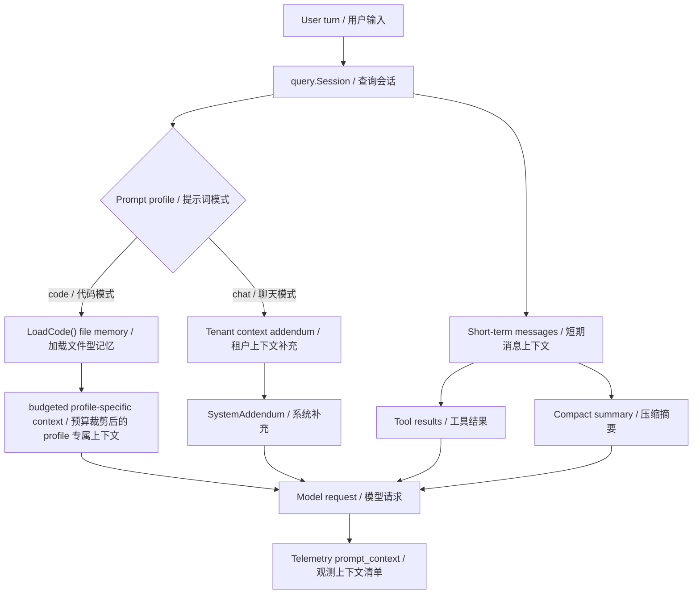
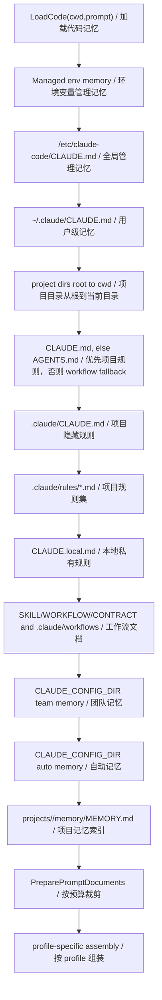
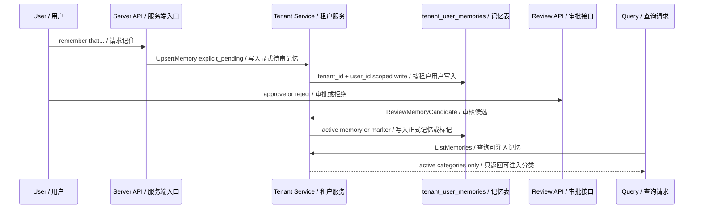
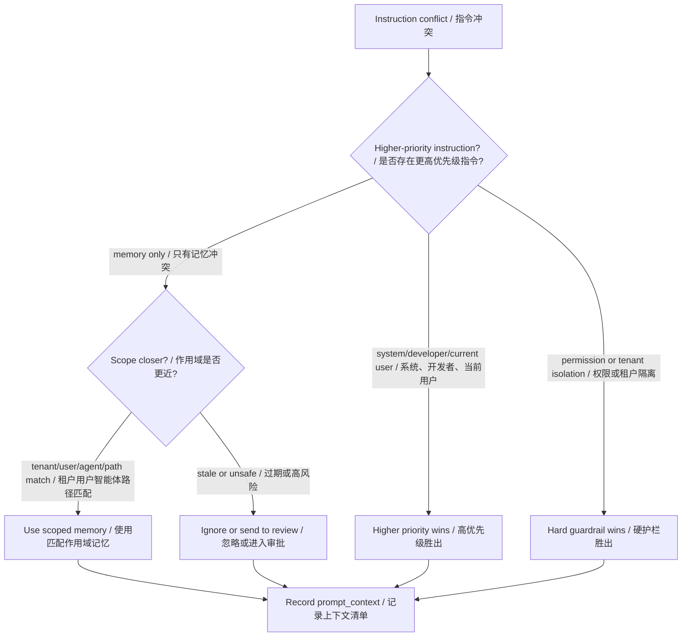
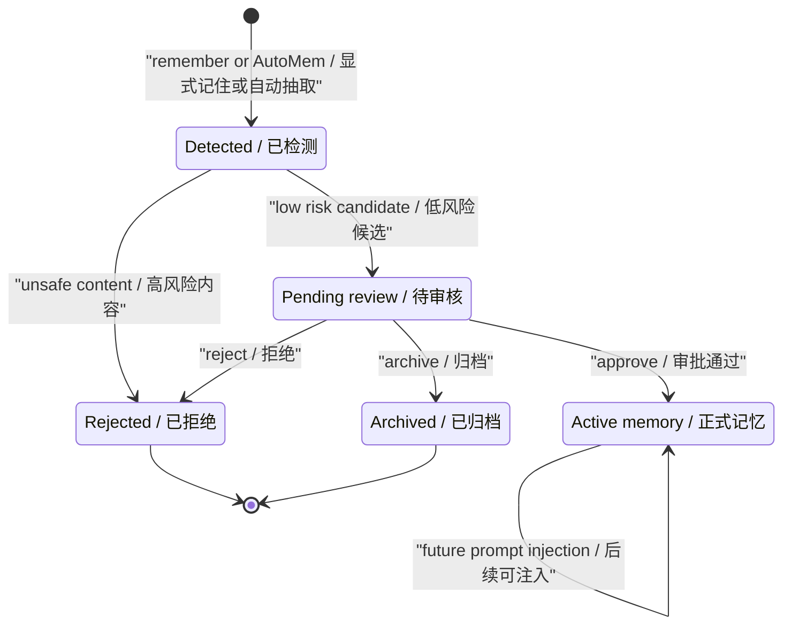
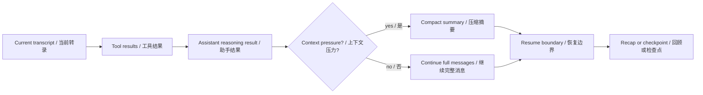

# 第 8 章：记忆管理 Memory Management

## 书中理论要点

记忆管理让智能体不只依赖当前这一轮输入，而是能在受控范围内复用过去的事实、偏好、项目规则和组织约束。它解决的不是“把所有历史都塞给模型”，而是三个工程问题：

- 记什么：当前对话上下文、压缩摘要、项目规则、用户偏好、团队规范、管理策略、知识库片段分别属于不同记忆。
- 何时用：不同入口、模式、租户、用户、agent 和路径条件决定哪些记忆能进入 prompt。
- 谁裁决：记忆永远不能覆盖 system、developer、当前用户明确指令、权限、安全护栏和租户隔离。

Go Claude 的实现很适合对照学习，因为它同时有文件型 code memory、tenant DB memory、AutoMem/显式记忆候选、审批 API、prompt context manifest 和 compact/recap 这几类机制。

## Go Claude 的工程落点

Go Claude 里记忆分为两条主线：

- 短期上下文记忆：当前会话 messages、tool result、compact summary、recap、checkpoint/fork/rewind，用于保持一个任务过程的连续性。
- 长期持久记忆：`CLAUDE.md`、`.claude/rules/*.md`、Claude Code project `memory/MEMORY.md`、agent scoped memory、tenant user/team/managed memory，用于跨会话复用稳定指导。

关键源码和文档入口：

- `internal/memory/memory.go`
- `internal/query/query.go`
- `internal/server/tenant_context.go`
- `internal/server/server.go`
- `internal/tenant/service.go`
- `internal/storage/mysql/repository.go`
- `internal/compact/compactor.go`
- `docs/auto_memory_plan/auto_memory_plan.md`
- `docs/prompt_logic/prompt_loading.md`
- `docs/prompt_logic/session_prompt_logic_2026-06-22.md`

## 源码映射表

| 层级 | Go Claude 文件 | 学习重点 |
| --- | --- | --- |
| code memory loader | `internal/memory/memory.go:LoadCodeWithOptions`、`PreparePromptDocuments` | managed/user/project/local/rules/workflow/team/auto/project `MEMORY.md` 的加载顺序、去重、include、path scope 和 prompt budget。 |
| agent memory loader | `internal/memory/memory.go:LoadAgent` | agent user/project/local memory 的 scope 开关和 agent name sanitization。 |
| prompt injection | `internal/query/query.go:assembleContextMessages` | 默认 code profile 使用 `<system-reminder>` user-context；Claude-compatible profile 使用兼容 workspace guidance，并增加 auto-memory system block；chat mode 不加载本地 code memory。 |
| tenant context | `internal/server/tenant_context.go` | tenant memory/profile/document/knowledge chunks 如何作为 `SystemAddendum` 进入 chat/code。 |
| explicit remember | `internal/server/server.go:maybeWriteExplicitRememberMemories` | “记住/remember”先写 `explicit_pending`，高风险内容直接拒绝。 |
| AutoMem | `internal/server/server.go:maybeWriteAutoMemories` | 环境变量 opt-in 后，用启发式抽取候选并写 `automem_pending`。 |
| review lifecycle | `internal/tenant/service.go:ReviewMemoryCandidate` | approve/reject/archive 如何生成 active memory 或 marker category。 |
| persistence | `internal/storage/mysql/repository.go` | `tenant_user_memories` 按 `tenant_id + user_id` 读写，分类、重要性、source 和 metadata 可追踪。 |
| observability | `internal/query/query.go:recordContextManifest` | `query.prompt_context` 记录 memory count、来源、tenant context、managed/team 标志，不记录完整正文。 |

## 记忆架构图



这张图的重点是：记忆不是一个单独数据库，而是多类上下文的组合。code mode 更偏本地工程规则，chat mode 更偏多租户用户上下文。

## Code Memory 加载链路

`LoadCode(cwd, prompt)` 是文件型长期记忆入口。当前顺序是：



`documentLoader` 还提供几层过滤：

- `seen` 去重，避免同一路径重复加载。
- `@include` 引用子文档；项目内文档默认不能 include 到项目树外，managed/user/team 这类 external memory 可以 include 外部路径。
- frontmatter `paths` 与 prompt 中提取出的文件候选匹配，支持真正的 `**` glob；绝对路径同时生成 cwd-relative 候选。
- frontmatter `exclude` / `excludes` 命中本轮文件候选时排除；无法从 prompt 识别文件时 scope 为 unknown，scoped 文档仍加载。
- Claude Code project `memory/MEMORY.md` 会限制为 25KB 和 200 行，避免失控注入。
- 所有 memory 在进入 prompt 前还会经过统一预算：workflow 默认 4KB、单文档默认 16KB、总量默认 64KB。文档按加载优先级消耗总预算，被裁剪的条目会在 manifest 中记录原始字节数、prompt 字节数和 `budgeted` 状态。

默认 code profile 把裁剪后的文档包装为 `<system-reminder>` user-context。Claude-compatible profile 使用 `# claudeMd` 兼容消息，并附加描述持久记忆能力的 `# auto memory` system block；strict variant 还会关闭项目 `AGENTS.md` fallback。

## Tenant Memory 与审批链路

Tenant memory 是 DB 持久化的长期记忆，核心表由 `tenant_user_memories` 表示，服务层始终通过 tenant/user context 解析后读写。



显式记忆和 AutoMem 都不直接进入 active memory：

| 来源 | 初始 category | 审批通过后 | 拒绝/归档后 | 是否直接进 prompt |
| --- | --- | --- | --- | --- |
| 显式“记住” | `explicit_pending` | active category，例如 `preference` | `explicit_rejected` / `explicit_archived` | 否 |
| AutoMem | `automem_pending` | active category，例如 `preference` | `automem_rejected` / `automem_archived` | 否 |
| 审批 marker | `explicit_approved` / `automem_approved` | 仅记录状态 | 仅记录状态 | 否 |
| 普通 active memory | `preference` / `convention` / `project_fact` 等 | 已可注入 | 可被后续覆盖/归档 | 是 |

`formatTenantMemoriesWithCount` 会过滤所有 pending、approved marker、rejected、archived 分类。这个过滤很关键：审批状态是审计事实，不是应该喂给模型的行为规则。

## 记忆进入 Prompt 的优先级

记忆不能和 system prompt 平级。它在 Go Claude 中通常作为 `SystemAddendum` 或 `<system-reminder>` 的上下文出现，语义上低于更高优先级指令。



优先级可以按这条线理解：

1. system/developer/runtime 安全边界最高。
2. 当前用户本轮明确指令高于长期记忆。
3. 权限、sandbox、tenant isolation、RBAC、audit 这类硬边界高于任何记忆。
4. tenant/user scoped memory 只能在当前 tenant/user 中使用。
5. agent memory 只进入目标 agent，不能污染主线程或其他 agent。
6. pending/rejected/archived/approved marker 不进入 prompt。
7. code mode 本地 memory 不进入 chat prompt；chat mode 不假设可访问本地仓库。
8. compact summary 只代表短期会话压缩状态，不是长期事实来源。

## 冲突与异常处理

| 场景 | 裁决规则 | 源码依据 |
| --- | --- | --- |
| memory 要求忽略系统提示词 | 拒绝或不注入，system 更高 | `SystemAddendumFromDocuments` 明确写着除非与更高优先级指令冲突。 |
| 用户说“记住我的 API key” | 高风险显式记忆直接 rejected telemetry，不写 pending active | `unsafeMemoryReason` 标记 credential。 |
| pending memory 与 active memory 相似 | pending 不进 prompt，需人工审批 | `isNonInjectableMemoryCategory` 过滤。 |
| tenant A 读取 tenant B memory | 服务层按 `ResolveContext` 后的 `tenant_id + user_id` 查询 | `tenant.Service.ListMemories`。 |
| code mode 与 chat mode 混用 | chat mode 不加载本地 `CLAUDE.md` / git / cwd | `assembleContextMessages` 在 chat profile 直接返回空。 |
| agent A 的 memory 影响 agent B | 不允许，`LoadAgent` 按 agentName + scope 加载 | `agentMemoryCandidates` 和 `sanitizeAgentName`。 |
| project `MEMORY.md` 过大 | 截断到 25KB/200 行 | `limitProjectMemoryContent`。 |
| include 跳出项目树 | 普通项目 include 被 `sameTree` 限制 | `documentLoader.load`。 |
| memory 加载失败 | 记录 `memory.load.error` 后继续请求 | `assembleContextMessages` 返回空 assembly。 |

## 记忆候选状态机



状态机要点：

- 检测到候选不等于已经记住。
- `explicit_pending` / `automem_pending` 是待审候选。
- approve 会写一条 active memory，并把原 candidate 写成 approved marker。
- reject/archive 只写 marker，不进入 prompt。
- 高风险内容甚至不进入 pending，而是发 telemetry 说明被拒绝。

## 短期记忆：messages、compact 与 recap

长期记忆解决跨会话稳定指导，短期记忆解决当前任务不中断。



短期记忆有几个边界：

- tool result 是当前任务链路证据，不是默认长期记忆。
- compact summary 是压缩后的会话状态，可能丢细节，不能当成项目规则。
- recap 适合恢复和交接，不应该自动变成 user memory。
- 真正要跨会话记住的偏好或事实，应该进入 pending review，而不是偷偷从 transcript 抽取成 active memory。

## Prompt Context Manifest

Go Claude 不只注入记忆，还记录“本轮到底用了什么上下文”。`ContextManifest` 和 `TenantContextManifest` 会记录：

- code memory 文档数量、类型、include、path scope、exclude scope、原始/prompt 字节和 budgeted 数量。
- system blocks、user context messages、system addendum 是否存在。
- tenant memory item 数量、profile、document、knowledge chunks。
- managed/team memory 是否参与。
- tenant runtime skill 和 addendum 是否 active。

这对学习很重要：读者不要靠猜“模型是不是看到了某段记忆”，而要通过 `query.prompt_context`、`status.promptContext`、测试和 trace 去验证。

## 最佳实践

- 把“记忆”分成短期状态、长期事实、项目规则、团队策略、管理策略、知识检索结果，不要混成一个大 prompt。
- 长期记忆默认走审批，尤其是显式“记住”和 AutoMem；候选阶段只提示“已提交审核”，不要说“已记住”。
- 所有 memory 注入都必须带作用域：tenant、user、agent、project、path、mode。
- 对安全、权限、租户隔离、凭证、越狱、审计绕过类内容，后端要硬拒绝，不靠 prompt 劝模型。
- prompt context manifest 是排查入口；先确认是否加载、加载多少、从哪里来，再讨论模型表现。
- code mode 的 `CLAUDE.md`/rules 用来指导工程任务；chat mode 应保持租户会话边界，不读取服务器本地仓库。
- 对大型 project memory 做大小限制、分 topic、按路径加载；不要把整套知识库自动注入 prompt。

## 源码阅读路线

1. 读 `internal/memory/memory.go:LoadCodeWithOptions`、`scope.go` 和 `PreparePromptDocuments`，画出文件型记忆的发现、作用域和预算顺序。
2. 读 `internal/query/query.go:assembleContextMessages`，确认 code memory 如何进入模型请求。
3. 读 `internal/server/tenant_context.go`，区分 chat tenant context 和 code tenant memory。
4. 读 `internal/server/server.go:maybeWriteExplicitRememberMemories` 和 `maybeWriteAutoMemories`，理解候选写入。
5. 读 `internal/tenant/service.go:ReviewMemoryCandidate`，跟踪 approve/reject/archive 后的 category 变化。
6. 读 `internal/server/server_test.go` 和 `internal/tenant/service_test.go` 的 memory 测试，确认 pending 不注入、审批后才 active。
7. 读 `docs/auto_memory_plan/auto_memory_plan.md`，区分已实现能力和后续规划。

## 如何验证

```bash
go test ./internal/memory -count=1
go test ./internal/server -run 'Memory|Remember|TenantContext' -count=1
go test ./internal/tenant -run 'Memory|Review' -count=1
go test ./internal/query -run 'ContextManifest|PromptMode' -count=1
```

源码搜索：

```bash
rg -n "LoadCode|LoadAgent|SystemAddendumFromDocuments|explicit_pending|automem_pending|TenantCodeMemoryAddendum|query.prompt_context|tenant_user_memories" internal docs
```

运行时验证建议：

- 在临时项目里写 `CLAUDE.md`、`.claude/rules/*.md`、`CLAUDE.local.md`，执行 code mode 请求后检查 `status.promptContext` 或 trace。
- 通过 `/tenant/memories` 写 active preference，再请求 chat，确认 `query.prompt_context` 里的 `memory_items` 增加。
- 发送 `remember that I prefer examples in Go`，确认只生成 `explicit_pending`，下一轮 prompt 不注入。
- 调 `/tenant/memory-review/review` approve 后，再发下一轮请求，确认 active memory 才进入 prompt。
- 用包含 `api key`、`ignore previous`、`bypass approval` 的 remember 请求确认被拒绝或不进入 pending active。

## 学习任务

- 为什么 pending memory 不能直接进入 prompt？
- code mode 为什么可以读本地 `CLAUDE.md`，chat mode 却不能默认读服务器本地仓库？
- compact summary 和长期 user memory 的边界在哪里？
- 为什么 agent memory 必须按 agent name 和 scope 加载？
- 当 active memory 与当前用户指令冲突时，为什么当前用户指令更高？
- 如何用 prompt context manifest 证明某条记忆是否真的被加载？

## 当前差距

Go Claude 已实现文件型 code memory、agent memory、tenant memory、显式 remember pending、AutoMem pending、统一 memory review API、pending/marker 过滤、managed/team memory、prompt context manifest 和 Claude Code project `memory/MEMORY.md` 兼容。当前仍可继续增强：topic memory 按需读取、embedding/vector recall、memory 版本合并、冲突检测、外部 memory connector、删除/恢复语义和更完整的 WebUI 可视化证据。

## 本章自审

| 检查项 | 结果 |
| --- | --- |
| 引用真实源码 | 已覆盖 `internal/memory`、`query`、`server`、`tenant`、`storage/mysql`、compact 和相关 docs。 |
| 至少 3 张图 | 已包含架构图、code memory 链路、tenant 审批时序、冲突裁决图、状态机、短期记忆图。 |
| 图中英文后有中文 | Mermaid 节点和边均使用 `English / 中文` 或双语说明。 |
| 优先级 | 已说明 system/current user/guardrail 高于 memory，tenant/user/agent/mode/path scope 限制。 |
| 冲突处理 | 已覆盖 pending、凭证、越狱、租户隔离、chat/code 边界、agent memory、过大 memory、include 越界。 |
| 异常与兜底 | 已覆盖加载失败继续、大小限制、审核拒绝、marker 不注入、RBAC 写入限制。 |
| 最佳实践 | 已给出审批、作用域、manifest、硬拒绝、大小控制、mode 隔离等实践。 |
| 验证命令 | 已提供聚焦测试、源码搜索和运行时验证建议。 |
| 当前差距 | 已区分已实现和后续增强，避免把规划项写成现状。 |
