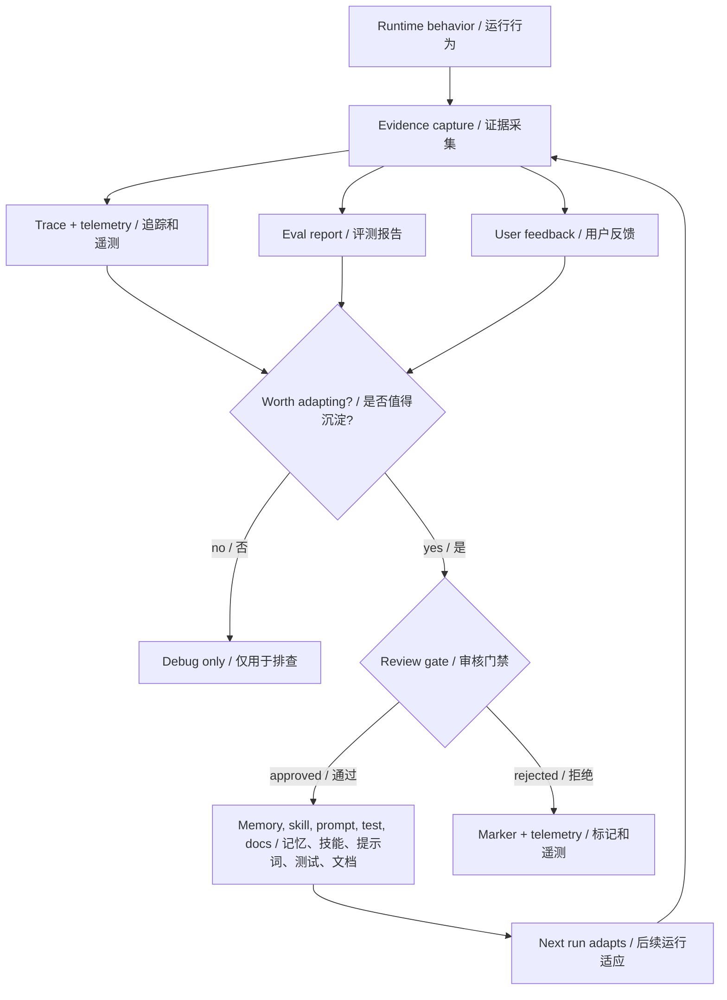
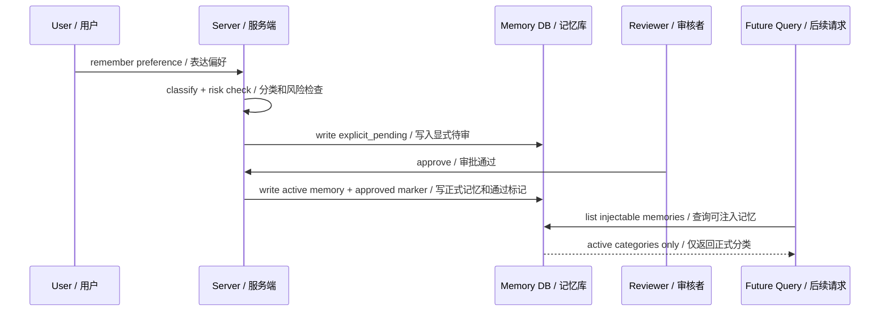
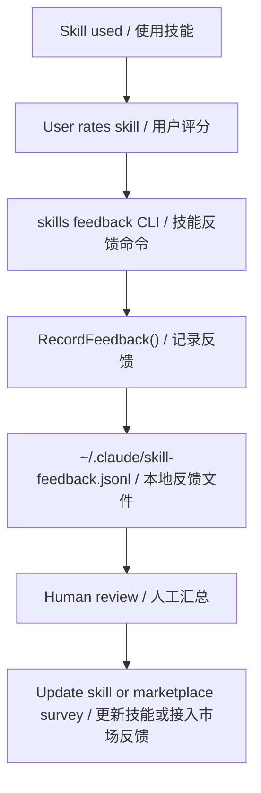
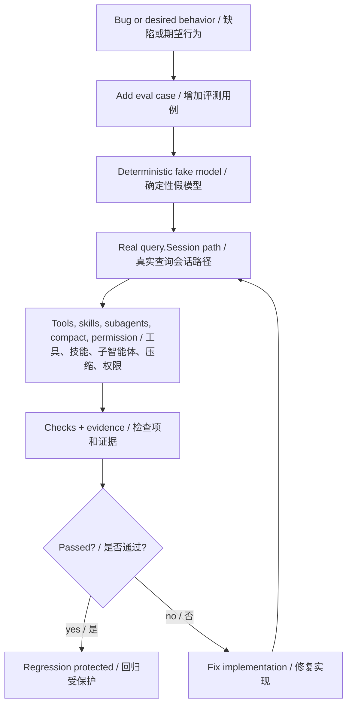
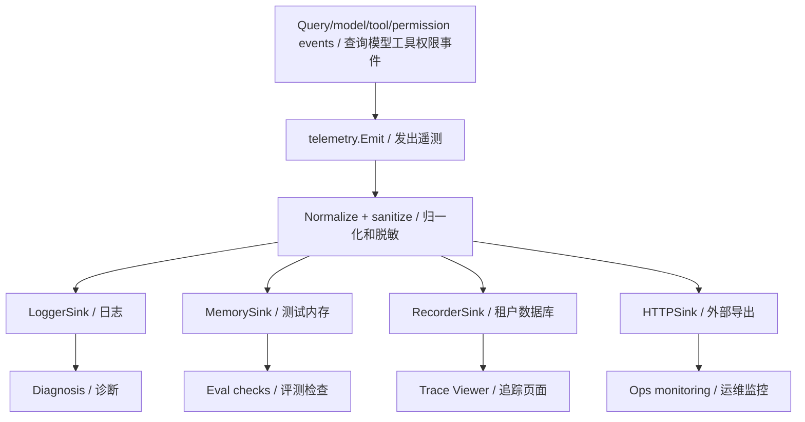
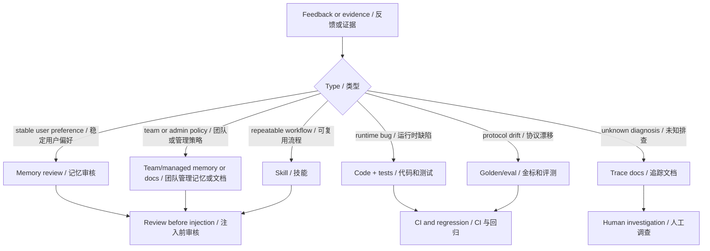
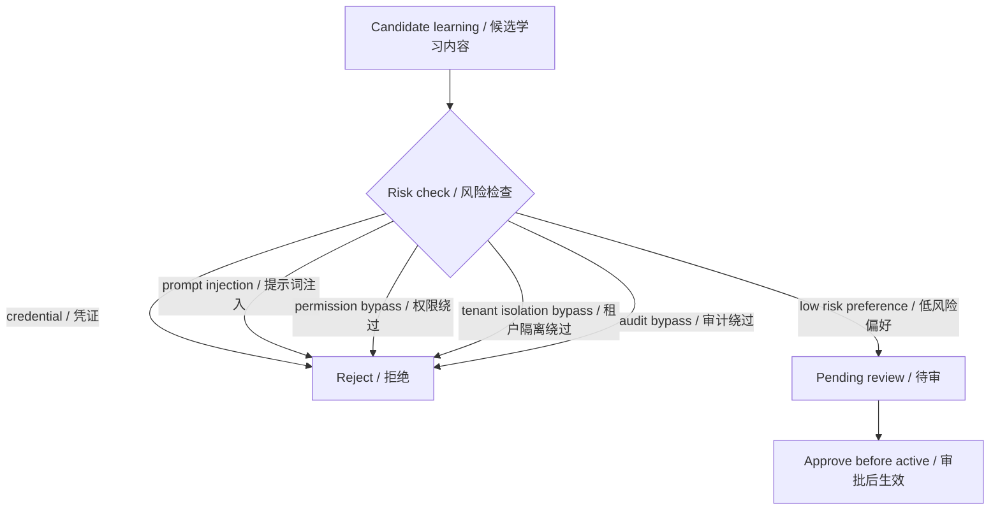

# 第 9 章：学习和适应 Learning and Adaptation

## 书中理论要点

学习和适应模式关注智能体如何根据历史经验、用户反馈、评测结果和运行证据改善后续行为。这里最容易误解的一点是：工程系统里的“学习”不等于模型权重在线更新，也不等于模型自己偷偷改规则。

在 Go Claude 这样的工程智能体里，学习更接近一条可审计的改进闭环：

- 运行时收集证据：trace、telemetry、tool result、usage、prompt context、eval report。
- 识别可沉淀信息：用户偏好、团队规范、项目事实、skill 反馈、失败模式。
- 经过人或硬规则审批：memory review、skill feedback、测试 review、文档 review。
- 沉淀到稳定载体：approved memory、skill、prompt profile、guardrail、测试、docs。
- 用评测和监控验证：deterministic eval、golden test、live profile、Trace Viewer。

如果没有审批、隔离和回归验证，“学习”很容易退化成 prompt 污染、错误记忆、跨租户泄漏或不可解释的行为漂移。

## Go Claude 的工程落点

Go Claude 目前没有自动改写模型参数，也没有让 agent 自主修改全局策略。它已经落地的是几类工程化适应机制：

- Memory review：显式“记住”和 AutoMem 先进入 pending，审批后才成为 active memory。
- Skill feedback：`skills feedback` 把本地 skill 改进反馈记录到 JSONL，供后续人工汇总或远端 survey。
- Eval harness：用 deterministic local suite 和 opt-in live profile 把行为改进固定成可重复测试。
- Telemetry/trace：把 query/model/tool/permission/context/agent 等运行事实变成可查询证据。
- Compatibility/progress docs：把差距、取舍、后续增强写进文档，避免靠聊天记录记忆项目状态。

这章重点不是重复第 19 章“评估和监控”的全部细节，而是说明这些证据怎样进入“学习 -> 适应 -> 验证 -> 沉淀”的闭环。

## 源码映射表

| 层级 | Go Claude 文件 | 学习重点 |
| --- | --- | --- |
| memory candidate | `internal/server/server.go:maybeWriteExplicitRememberMemories`、`maybeWriteAutoMemories` | 用户显式记忆和 AutoMem 如何生成待审候选。 |
| memory review | `internal/tenant/service.go:ReviewMemoryCandidate` | approve/reject/archive 如何把候选变成 active memory 或 marker。 |
| tenant context | `internal/server/tenant_context.go` | approved memory、profile、document、knowledge 如何进入下一轮 prompt。 |
| skill feedback | `internal/skills/feedback.go`、`internal/cli/cli.go:runSkillsCommand` | 本地 skill 评分和评论写入 `skill-feedback.jsonl`。 |
| eval harness | `internal/agenteval/agenteval.go` | 默认 suite、case runner、evidence、deterministic fake model、live profile。 |
| telemetry | `internal/telemetry/telemetry.go`、`sinks.go` | 事件归一化、脱敏、logger/memory/recorder/http sink。 |
| runtime evidence | `internal/query/query.go` | query/model/tool/permission/context/usage telemetry 和 transcript。 |
| docs | `docs/testing/agent_eval_harness.md`、`docs/skills/skills_progressive_loading.md`、`docs/compatibility_deep_review.md` | 已实现边界、反馈入口、评测命令和差距说明。 |

## 学习闭环架构



这张图表达 Go Claude 的核心取舍：学习不是直接改模型，而是把可复用信息写入明确载体，并继续用证据验证。

## Memory Review：从反馈到长期记忆

第 8 章已经讲了记忆管理，这里只看“学习闭环”的角度。用户说“记住我喜欢简洁中文回答”时，系统不会立即把它当成永久事实，而是进入候选区。



这条链路体现了三个学习原则：

- 低风险偏好可以学习，但必须经过 pending -> approve。
- 高风险内容，例如 credential、prompt injection、permission bypass、tenant isolation 绕过，直接拒绝。
- 只有 active category 才能影响后续 prompt，pending/rejected/archived/approved marker 不注入。

## Skill Feedback：从使用感受到改进线索

`skills feedback` 是另一类轻量学习入口。它不会自动修改 skill，而是把评分和评论写入本地 JSONL：



源码要点：

- `RecordFeedback` 要求 skill name 非空。
- rating 必须在 1 到 5 之间。
- 默认目标文件是 `~/.claude/skill-feedback.jsonl`。
- 每条记录包含 name、rating、comment、created_at、path。

这是一种保守但可审计的适应：反馈被记录下来，但不会让运行中的 agent 自动改写 skill 或绕过 review。

## Eval Harness：把经验固化成回归用例

当某次问题被定位和修复后，最可靠的“学习”方式是把它变成测试。Agent Eval Harness 的默认 suite 就是这种沉淀方式。



`DefaultSuite()` 当前覆盖：

| Case | 学到什么 |
| --- | --- |
| `chat_basic` | 基本 query loop 不能退化。 |
| `tool_read` | 工具调用和 `tool_result` 回灌必须保持可用。 |
| `skill_load` | skill 加载和激活路径不能断。 |
| `subagent_task` | Task sub-agent runtime 必须有结果和 task evidence。 |
| `auto_compact` | 长上下文压缩后仍能继续响应。 |
| `permission_boundary` | 权限拒绝必须作为错误 tool result 进入闭环。 |
| `trace_observability` | telemetry trace id 必须贯穿运行证据。 |
| `subagent_multiagent_parity` | agent schema、skills、memory、hooks、background、trace evidence。 |
| `multiagent_e2e` | AgentCreate/Message/Get/Stop 的协作链路。 |

## Telemetry：从运行事实到适应依据

Telemetry 不是学习本身，但它给学习提供证据。`telemetry.Normalize` 会补齐 trace、tenant、user、时间和脱敏属性；`LoggerSink`、`MemorySink`、`RecorderSink`、`HTTPSink` 把事件送到日志、测试捕获、MySQL 或外部系统。



学习闭环使用 telemetry 时要注意：

- telemetry 只记录 metadata，不记录完整 prompt、content、transcript、token、secret、private URL。
- 事件能说明发生了什么，但不能自动证明应该怎么改。
- 当 telemetry 指向高频失败、权限拒绝、工具错误或 prompt context 缺失时，应转化为测试、文档、memory review 或 skill 改进，而不是直接拼进 prompt。

## 适应载体与优先级

不是所有反馈都该进入同一个地方。Go Claude 的适应载体有明确优先级和边界：



| 反馈类型 | 应沉淀到哪里 | 不应该怎么做 |
| --- | --- | --- |
| 用户长期偏好 | pending memory -> approved active memory | 直接把整段聊天写进 prompt。 |
| 团队规范 | team/managed memory、项目 docs、`CLAUDE.md` | 让单个 user memory 覆盖团队策略。 |
| 可复用操作流程 | skill 或 agent definition | 每次靠用户重复说明。 |
| 工具/权限 bug | 代码修复 + 单元/eval/golden 测试 | 只在 prompt 里提醒“不要再错”。 |
| 评测失败 | 修复实现或更新有意变化的 golden | 机械更新 golden 掩盖回归。 |
| 运行异常 | trace/telemetry 分析 + 文档化已知限制 | 直接把异常日志当长期记忆。 |

## 冲突与异常处理

| 场景 | 裁决规则 | 原因 |
| --- | --- | --- |
| 新反馈和 system/安全规则冲突 | system/安全规则胜出 | 学习不能削弱硬护栏。 |
| 用户偏好和团队/managed memory 冲突 | 团队/managed memory 优先，必要时人工处理 | 组织级策略高于个人偏好。 |
| pending memory 和当前请求冲突 | 当前请求优先，pending 不注入 | 候选还没被批准。 |
| skill feedback 评分很低 | 只记录，不自动禁用 skill | 自动禁用可能破坏现有工作流。 |
| eval 失败但 telemetry 不完整 | 先补证据，再判断修复方向 | 没证据的改动容易误修。 |
| live profile skipped | 不能当作失败，也不能当作通过 | skipped 只说明环境未配置。 |
| telemetry 包含敏感字段 | `SanitizeProperties` 删除或截断 | 观测不能泄露密钥和正文。 |
| 模型输出建议更新记忆 | 仍需 review gate | 模型不能替代人或后端规则审批。 |

## 反学习：哪些东西不能学



Go Claude 通过 `unsafeMemoryReason` 对凭证、越狱、权限绕过、租户隔离绕过、审计绕过做硬拒绝。这个机制非常重要：安全类规则不能靠“以后模型记得不要这么做”，而要在后端候选阶段直接拦住。

## 最佳实践

- 把学习写成闭环：证据 -> 候选 -> 审核 -> 沉淀 -> 验证 -> 监控。
- 用户偏好先进入 pending memory，不要让一句“记住”立即改变后续所有会话。
- skill 反馈只作为改进线索，不自动修改 skill；真正改 skill 后要补测试或示例。
- 修复过的问题要尽量沉淀为 eval/golden/unit test，而不是只写在聊天记录里。
- telemetry/trace 只作为证据源，不能把敏感正文、密钥、私有 URL 或完整 transcript 写进 properties。
- 适应要有 scope：tenant、user、project、agent、mode、path。没有 scope 的“学习”很容易污染全局。
- live profile 的 skipped 要明确标注，不能当成通过；真实服务链路仍需按场景验证。

## 源码阅读路线

1. 读 `internal/server/server.go:maybeWriteExplicitRememberMemories`，理解显式反馈如何变成 pending memory。
2. 读 `internal/tenant/service.go:ReviewMemoryCandidate`，确认 approve/reject/archive 的真实写入。
3. 读 `internal/skills/feedback.go` 和 `internal/cli/cli.go` 的 `skills feedback` 分支。
4. 读 `internal/agenteval/agenteval.go:DefaultSuite` 和 `runCase`，理解行为如何固化成 eval。
5. 读 `internal/telemetry/telemetry.go:Normalize`、`SanitizeProperties`，确认观测证据的安全边界。
6. 读 `docs/testing/agent_eval_harness.md` 和 `docs/skills/skills_progressive_loading.md`，对照命令和当前边界。

## 如何验证

```bash
go test ./internal/tenant -run 'Memory|Review' -count=1
go test ./internal/server -run 'Memory|Remember|TenantContext' -count=1
go test ./internal/skills -run 'Feedback|Skill' -count=1
go test ./internal/agenteval -run 'DefaultSuite|LiveProfileSkips|LiveAgentAPIProfileSkips' -count=1
go test ./internal/telemetry -count=1
```

源码搜索：

```bash
rg -n "maybeWriteExplicitRememberMemories|maybeWriteAutoMemories|ReviewMemoryCandidate|RecordFeedback|DefaultSuite|SanitizeProperties|query.prompt_context" internal docs
```

运行时验证建议：

- 执行 `go run ./cmd/golang-cc skills feedback go-review --rating 5 --comment "useful"`，检查目标 JSONL。
- 运行 `go run ./cmd/golang-cc eval agents --json`，查看 evidence 中的 telemetry events、tool calls、agent tasks。
- 用 remember 请求生成 pending，再 approve，确认后续 `query.prompt_context` 的 memory count 变化。
- 构造包含 `api key` 或 `ignore previous` 的 remember 内容，确认被拒绝且不会进入 active memory。

## 学习任务

- 为什么 Go Claude 不让 AutoMem 直接写 active memory？
- skill feedback 为什么只记录 JSONL，而不是自动改写 skill？
- 一次线上 bug 应该沉淀成 memory、skill、test 还是 docs？如何判断？
- telemetry 里的哪些字段不能进入 properties？
- eval 通过和 live profile skipped 的含义有什么不同？
- 如果用户偏好和团队 managed memory 冲突，应该如何裁决？

## 当前差距

Go Claude 已具备 memory review、skill feedback JSONL、agent eval harness、telemetry/trace 和文档化改进闭环。但它还不是全自动学习系统：没有在线模型微调、没有自动合并冲突记忆、没有远端 skill survey 后台、没有模型裁判型 eval、没有基于 telemetry 的自动策略回滚。当前实现的重点是先保证学习可审计、可隔离、可验证，而不是追求不可控的自动适应。

## 本章自审

| 检查项 | 结果 |
| --- | --- |
| 引用真实源码 | 已覆盖 memory write/review、tenant context、skills feedback、agenteval、telemetry、query evidence 和相关 docs。 |
| 至少 3 张图 | 已包含学习闭环、memory review 时序、skill feedback、eval harness、telemetry、适应载体、反学习图。 |
| 图中英文后有中文 | Mermaid 节点和边均使用 `English / 中文`。 |
| 优先级 | 已说明 system/安全规则、团队 managed memory、当前请求、pending memory、skill feedback 的裁决顺序。 |
| 冲突处理 | 已覆盖安全冲突、团队与个人偏好冲突、pending 不注入、skill 反馈不自动禁用、live skipped。 |
| 异常与兜底 | 已覆盖高风险拒绝、telemetry 脱敏、eval 失败补证据、skipped 不等于通过。 |
| 最佳实践 | 已给出证据闭环、scope、review gate、测试沉淀、trace/telemetry 安全使用。 |
| 验证命令 | 已提供 tenant/server/skills/agenteval/telemetry 聚焦测试和运行时验证建议。 |
| 当前差距 | 已明确没有在线微调、自动冲突合并、远端 survey、模型裁判和自动回滚。 |
