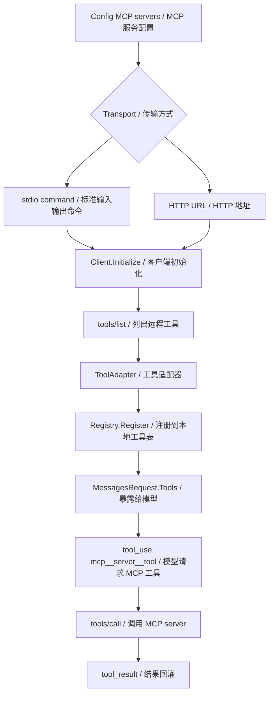
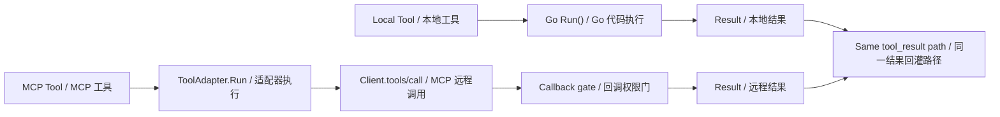
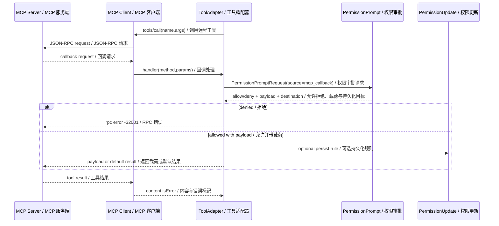
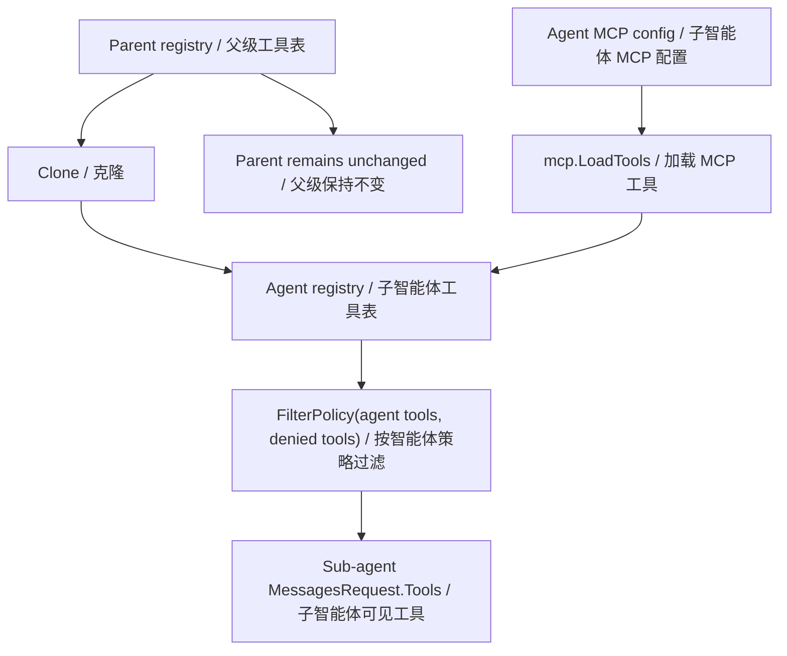
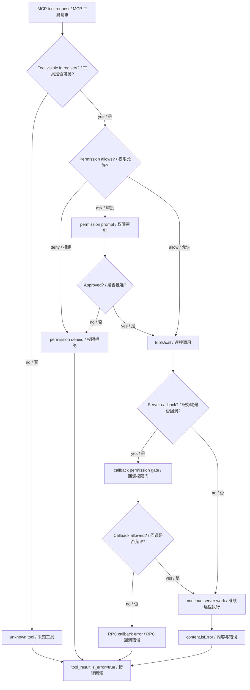

# 第 10 章：模型上下文协议 MCP

## 书中理论要点

MCP 的核心不是“多一种工具调用语法”，而是给智能体和外部系统之间建立一个标准协议边界。普通 function calling 通常由本地代码定义工具；MCP 则允许外部 server 以统一协议暴露 tools、resources、prompts 等能力，让不同客户端和不同工具生态可以复用同一套连接方式。

对 Go Claude 来说，MCP 的学习重点是：

- MCP server 如何启动、初始化和列出工具。
- 远程 MCP tool 如何被包装成本地 `tools.Tool`。
- MCP tool 名称如何进入统一 registry，避免和本地工具冲突。
- MCP server 发起 callback 时如何走 permission prompt，而不是默认信任远端。
- sub-agent 专属 MCP 工具如何隔离，避免污染 parent registry。

## Go Claude 的工程落点

Go Claude 的 MCP 主线在 `internal/mcp`：

- `internal/mcp/client.go` 根据 config 启动 stdio 或 HTTP MCP server，并执行 `initialize`、`tools/list`、`tools/call`、`resources/list`、`prompts/list`。
- `internal/mcp/rpc.go` 和 `internal/mcp/http_rpc.go` 封装 JSON-RPC 调用。
- `internal/mcp/tool.go` 用 `ToolAdapter` 把远端 MCP tool 包装成本地 `tools.Tool`。
- `internal/mcp/tool.go:LoadTools` 启动配置中的 MCP clients，列出工具，并返回 cleanup。
- `internal/agentruntime/runtime.go` 在 sub-agent 配置 MCP server 时 clone registry，加载 agent-local MCP tools，然后再按 agent tool policy 过滤。
- `internal/permissions/policy.go:IsMutatingTool` 把所有 `mcp__` 前缀工具视为 mutating tool，在 ask mode 下需要审批。

## 源码映射表

| 层级 | Go Claude 文件 | 学习重点 |
| --- | --- | --- |
| MCP client | `internal/mcp/client.go` | stdio/http 启动、initialize、tools/list、tools/call |
| RPC | `internal/mcp/rpc.go`、`internal/mcp/http_rpc.go` | JSON-RPC 请求、回调处理、HTTP transport |
| Tool adapter | `internal/mcp/tool.go` | `mcp__server__tool` 命名、schema 透传、`CallToolWithCallback` |
| Callback 权限 | `internal/mcp/tool.go:mcpServerCallbackHandler` | sampling、elicitation、permissions/request 走 permission prompt |
| Agent-local MCP | `internal/agentruntime/runtime.go` | registry clone、agent MCP prompt、cleanup、tool policy |
| 权限策略 | `internal/permissions/policy.go` | `mcp__` 工具按 mutating tool 处理 |
| 测试 | `internal/mcp/tool_test.go`、`internal/agentruntime/runtime_test.go` | adapter 命名、ask mode 审批、callback payload、父 registry 隔离 |

## MCP 接入架构



`ToolAdapter.Name()` 使用 `mcp__<server>__<tool>` 格式，并通过 `safeName` 把非字母数字下划线字符替换掉。这个命名约定很重要：它既让 MCP 工具进入普通 registry，又能保留来源，避免和 `Read`、`Bash` 等本地工具混淆。

## MCP 与普通工具调用的差异

| 对比项 | 普通本地 Tool | MCP Tool |
| --- | --- | --- |
| 定义来源 | Go 代码实现 `tools.Tool` | 远端 MCP server 的 `tools/list` |
| 执行位置 | 本进程或本机工具逻辑 | 外部 stdio/http server |
| 名称 | `Read`、`Bash`、`WebFetch` 等 | `mcp__server__tool` |
| schema | 工具代码返回 `InputSchema()` | MCP `ToolInfo.InputSchema` 透传 |
| 权限 | `guardedTool` + policy + sandbox | 同样经过 `guardedTool`，且 `mcp__` 在 ask mode 下视为 mutating |
| callback | 通常没有远端 callback | MCP server 可请求 elicitation、sampling、permission |
| 隔离 | registry 由 runtime 注入 | sub-agent MCP 会 clone registry，避免污染父级 |



工程上最重要的结论是：MCP tool 进入 Go Claude 后，仍然走同一套 tool loop、permission、trace、telemetry 和 `tool_result` 回灌机制。不同的是，真实副作用发生在远端 server，治理不能只靠本地函数实现。

## MCP callback 的权限链路

MCP server 在 `tools/call` 期间可能向 client 发起 callback，例如：

- `permissions/request`：请求客户端授予某种权限。
- `elicitation/create` 或 `elicitation/request`：请求向用户提问或收集信息。
- `sampling/createMessage`：请求客户端模型采样。

Go Claude 不默认信任这些 callback。`mcpServerCallbackHandler` 会把 callback 包成 `tools.PermissionPromptRequest`，`Source` 标记为 `mcp_callback`，然后交给 permission prompt。



## Agent-local MCP 隔离

sub-agent 可以声明自己的 MCP server。这里最容易出错的是把子智能体的远程工具注册到父 registry，导致父会话后续也看见这些工具。Go Claude 在 `internal/agentruntime/runtime.go` 里先 `registry.Clone()`，再把 agent MCP tools 注册到 clone 后的 registry。



这个隔离设计让 MCP 成为“某个 agent 的能力”，而不是全局污染。相关测试在 `internal/agentruntime/runtime_test.go` 中覆盖了 parent registry 不被子 agent MCP 注册污染的行为。

## 执行顺序和优先级

| 顺序 | 裁决点 | 谁优先 |
| --- | --- | --- |
| 1 | MCP server config 类型 | `StartConfigured` 只接受 `stdio`、`http`、`streamable-http`，未知类型直接错误。 |
| 2 | server initialize | initialize 失败则 client 关闭，该 server 的 tools 不进入 registry。 |
| 3 | `tools/list` | list 失败则该 server 已启动但不贡献工具；`LoadTools` 继续处理其他 server。 |
| 4 | ToolAdapter 命名 | `mcp__server__tool` 命名胜出，避免使用远端原始短名污染 registry。 |
| 5 | 本地 registry/filter | MCP tools 注册后仍受 `Registry.FilterPolicy` 和 coordinator/agent allowlist 限制。 |
| 6 | permission policy | `mcp__` 工具在 ask mode 下按 mutating tool 审批。 |
| 7 | MCP callback permission prompt | server callback 必须通过 permission prompt；deny 直接返回 RPC error。 |
| 8 | callback payload | 如果审批返回 `Payload`，优先使用该 payload；否则按 method 返回默认结果。 |
| 9 | cleanup | `LoadTools` 返回 cleanup，runtime 结束时关闭 MCP clients。 |

## 冲突处理原则

| 冲突 | 处理原则 |
| --- | --- |
| MCP server 配置错误 | 不把该 server 工具注册进 registry，避免暴露半初始化能力。 |
| MCP tool 与本地工具重名 | 通过 `mcp__server__tool` 命名隔离，不覆盖本地工具。 |
| 多个 MCP server 有同名 tool | server 名进入工具名，因此不同 server 下仍是不同工具。 |
| MCP server 请求 sampling | 默认必须走 callback permission；没有 prompt handler 时无 callback 处理器。 |
| MCP callback 返回非法 payload | 返回 RPC invalid params 错误，不把非法 JSON 发给 server。 |
| sub-agent MCP 与 parent registry 冲突 | 子 agent clone registry，父 registry 不应被修改。 |
| agent allowlist 未包含某 MCP tool | `FilterPolicy` 后该工具对子 agent 不可见。 |



## 异常、兜底与恢复

MCP 的失败分两类：

- 连接和加载阶段失败：server 启动失败、initialize 失败、tools/list 失败。结果是工具不进入 registry。
- 执行阶段失败：tools/call 失败、server 返回 `isError`、callback 被拒绝、callback payload 非法。结果是 `ToolAdapter.Run` 返回 `tools.Result{IsError:true}`，进入普通工具错误回灌。

恢复策略：

- 多个 MCP server 之间互不阻塞。一个 server 失败不应阻断其他 server 的 tools 加载。
- 对子 agent 的 MCP tools 使用 clone registry，任务结束后 cleanup，避免长期污染。
- 对 callback 默认保守。没有审批或审批拒绝时，宁可返回 RPC error，也不替用户或模型自动授权远端行为。
- 对远端返回只提取 text content。当前 `CallToolWithCallback` 会把 text content 合并为字符串，其他 content 类型不是本章重点，读源码时不要误以为完整 MCP 内容模型都已映射。

## 最佳实践

- MCP 配置要按 server 边界命名清楚。工具最终名会包含 server 名，server 名就是读 trace 时的重要线索。
- 把 MCP tool 当高风险远端能力看待。它可能读写外部系统，不应因为形式上是工具调用就默认安全。
- 子 agent 需要专属 MCP 时优先走 agent-local 配置，避免把临时能力放进全局 registry。
- callback 必须可审计。`Source=mcp_callback`、`Request=method`、`Rule=toolName:method` 这些字段能帮助定位是谁请求了额外权限。
- 测试要覆盖协议边界，不只测 happy path。至少覆盖 adapter 命名、ask mode 审批、callback payload、registry 不污染父级。

## 源码阅读路线

1. 读 `internal/mcp/client.go:StartConfigured`，确认 stdio/http 的启动分支。
2. 读 `Client.Initialize`、`ListTools`、`CallToolWithCallback`，理解 MCP 的基本 RPC。
3. 读 `internal/mcp/tool.go:ToolAdapter`，确认 MCP tool 如何变成普通 `tools.Tool`。
4. 读 `mcpServerCallbackHandler`，重点看 `PermissionPromptRequest.Source=mcp_callback`。
5. 读 `internal/agentruntime/runtime.go` 中加载 agent MCP 的逻辑，确认 `registry.Clone()` 和 cleanup。
6. 读 `internal/permissions/policy.go:IsMutatingTool`，确认 `mcp__` 工具的审批边界。
7. 读 `internal/mcp/tool_test.go` 和 `internal/agentruntime/runtime_test.go`，把上面的机制和测试对应起来。

## 如何验证

静态阅读：

```bash
rg -n "StartConfigured|Initialize|ListTools|CallToolWithCallback|ToolAdapter|LoadTools|mcpServerCallbackHandler" internal/mcp
rg -n "registry.Clone|agentMCP|FilterPolicy|mcp__" internal/agentruntime internal/permissions internal/tools
```

单元测试：

```bash
go test ./internal/mcp -count=1
go test ./internal/agentruntime -run 'MCP|Registry|Agent' -count=1
go test ./internal/permissions -run 'MCP|Mutating|Permission' -count=1
```

回归评测：

```bash
go run ./cmd/golang-cc eval agents --json
```

## 学习任务

1. 找一个 MCP tool 名称转换例子，解释为什么 `echo-tool` 会变成 `echo_tool`。
2. 写一个 fake MCP callback，观察 `PermissionPromptRequest` 里 `Source`、`Request`、`Rule` 的值。
3. 给 sub-agent 配置一个 MCP server，验证父 registry 没有新增该 MCP tool。
4. 在 ask mode 下调用 MCP tool，确认它会要求审批。
5. 比较 MCP tool error 和普通 tool error，确认最终都进入 `tool_result is_error=true`。

## 当前差距

- 当前 adapter 主要把 MCP text content 合并成字符串；如果后续要完整支持更多 MCP content 类型，需要扩展映射和测试。
- `LoadTools` 对单个 server 启动/list 失败采取跳过策略，这对可用性友好，但生产排查需要结合日志和 telemetry 看哪些 server 没加载成功。
- MCP 远端 server 的实际副作用不在本仓库进程内，Go Claude 能做的是 client 侧权限、callback gate、命名隔离、trace 留证，不能替代 server 端自己的权限模型。

## 本章自审

| 检查项 | 结果 |
| --- | --- |
| 引用了真实源码路径 | 已覆盖 `internal/mcp`、`internal/agentruntime`、`internal/permissions`。 |
| 至少 3 张图 | 已包含 MCP 接入架构、工具差异图、callback 时序、agent-local 隔离、MCP 裁决流程。 |
| 写清楚顺序和优先级 | 已列出 9 个 MCP 裁决点。 |
| 写清楚冲突处理 | 已覆盖重名、加载失败、callback、agent-local registry、allowlist。 |
| 写清楚异常和兜底 | 已区分加载阶段失败和执行阶段失败。 |
| 有验证命令 | 已提供 `rg`、`go test`、`eval agents`。 |
