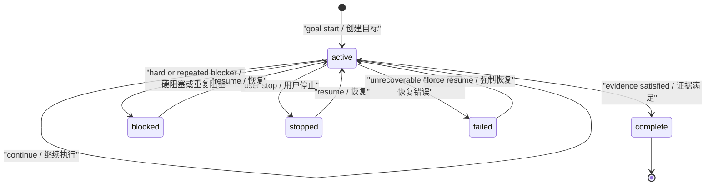
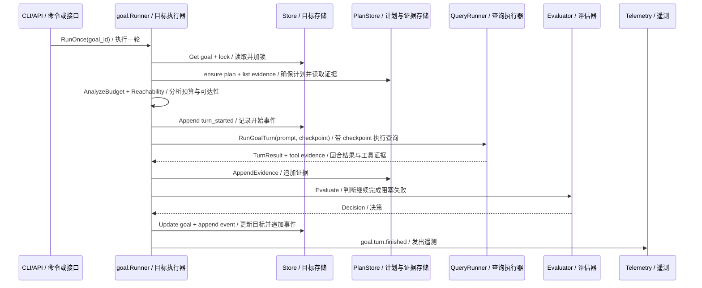
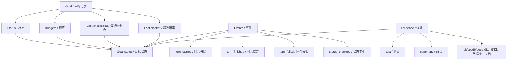
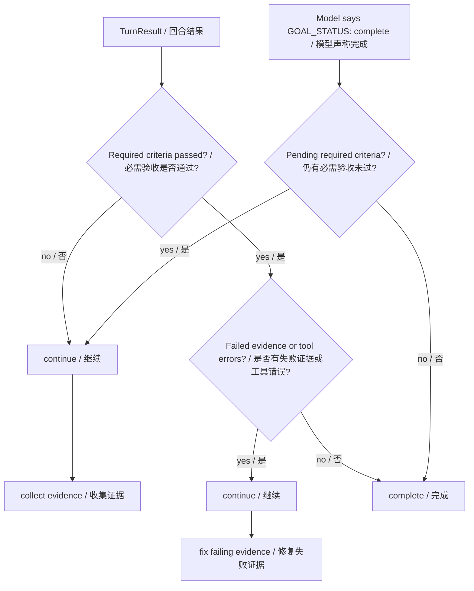
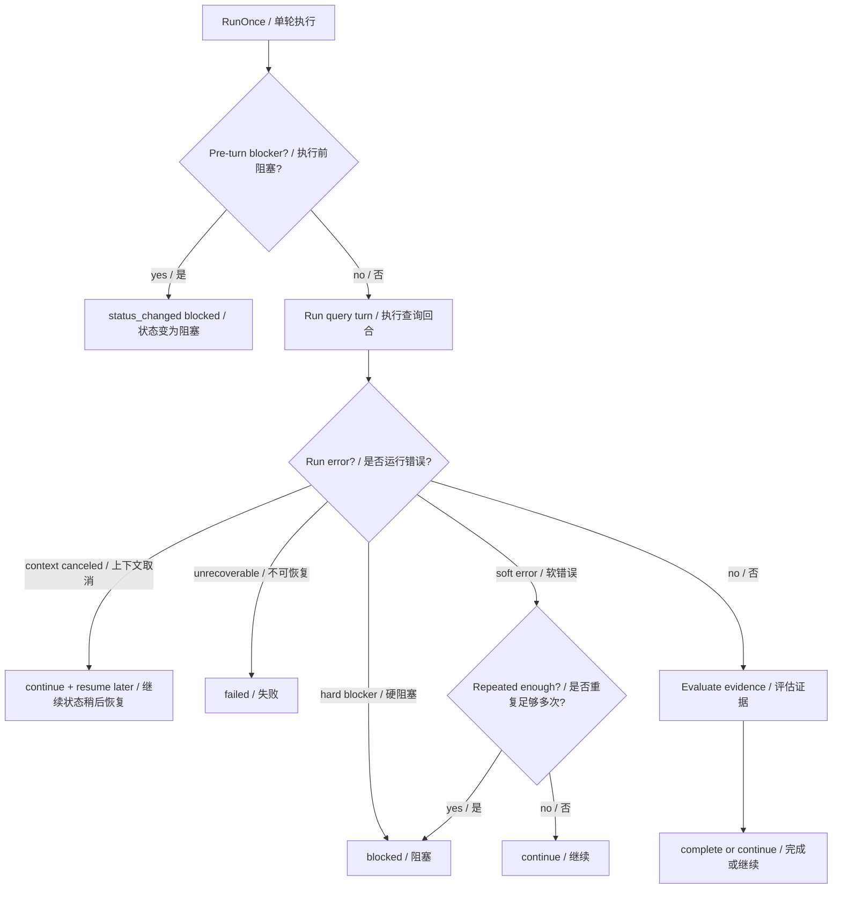

# 第 11 章：目标设定与监控 Goal Setting and Monitoring

## 书中理论要点

目标设定与监控模式解决的是长期任务控制问题。智能体不能只知道“用户让我做什么”，还要持续知道：目标是否仍然有效、当前状态是什么、还有多少预算、是否已经完成、是否被阻塞、有哪些证据能证明进度。

在 Go Claude 里，这个模式落成了 Goal Mode。它不是“让模型自动无限循环”，而是一个持久化目标状态机：

- 目标有状态：`active`、`complete`、`blocked`、`stopped`、`failed`。
- 目标有预算：turn budget 和 token budget。
- 目标有计划：steps、criteria、dependencies、risks。
- 目标有事件：start、turn started、turn finished、turn failed、status changed。
- 目标有证据：命令、测试、git、API、DB、文档、artifact、manual evidence。
- 目标有 evaluator：决定继续、完成、阻塞或失败。

## Go Claude 的工程落点

核心源码：

- `internal/goal/goal.go` 定义 Goal domain、默认预算、状态和校验。
- `internal/goal/events.go` 定义 Goal lifecycle event schema。
- `internal/goal/runner.go` 实现 `RunOnce`、`RunUntilStop`、checkpoint、event、telemetry、prompt context。
- `internal/goal/evaluator.go` 实现 deterministic、model-classified、evidence-first evaluator。
- `internal/goal/evidence.go` 把 query tool traces 转换成结构化 Goal evidence。
- `internal/goal/budget.go` 实现预算耗尽和 closing policy。
- `internal/cli/cli.go` 的 `goalQueryRunner` 负责 CLI Goal turn 的 session checkpoint 和 query 执行。
- `internal/server/server.go` 的 `tenantGoalQueryRunner` 负责 API Server Goal run 的 tenant query turn。
- `docs/goal_mode/goal_mode_design.md` 记录 Goal Mode 的基线设计。
- `docs/goal_mode/goal_mode_optimization_todo.md` 记录 plan/evidence/budget/evaluator 优化已经完成。

## 源码映射表

| 层级 | Go Claude 文件 | 学习重点 |
| --- | --- | --- |
| Goal domain | `internal/goal/goal.go` | 状态、预算、last checkpoint、last blocker、repeated blocker |
| Event schema | `internal/goal/events.go` | turn lifecycle、status changed、usage、checkpoint、error |
| Runner loop | `internal/goal/runner.go` | 单步执行、连续执行、锁、plan、reachability、event、telemetry |
| Evaluation | `internal/goal/evaluator.go` | deterministic fallback、model classifier、evidence gate、blocked threshold |
| Evidence | `internal/goal/evidence.go` | tool trace 到 command/test/git/API/DB/doc evidence |
| Budget | `internal/goal/budget.go` | exhausted、closing、next action、blocker key |
| CLI runner | `internal/cli/cli.go` | checkpoint、resume messages、query session、Goal turn result |
| API runner | `internal/server/server.go` | tenant goal query runner、checkpoint、stream/query function |
| 设计文档 | `docs/goal_mode/goal_mode_design.md` | Goal 是可恢复、可观测、受预算约束的目标状态机 |

## Goal 状态机



状态含义：

| 状态 | 含义 | 典型触发 |
| --- | --- | --- |
| `active` | 目标可继续运行 | 创建、恢复、一次 turn 后仍需继续 |
| `complete` | 目标完成且无必需工作剩余 | evidence 满足 required criteria |
| `blocked` | 继续推进需要用户或外部条件 | 权限、凭证、配额、外部依赖、重复 blocker |
| `stopped` | 用户主动暂停 | `goal stop` 或 API stop |
| `failed` | runner 内部不可恢复错误 | corrupt state、unrecoverable runner error |

## 一次 Goal turn 链路



`RunUntilStop` 只是不断调用 `RunOnce`，每一轮仍必须经过 store、plan、budget、query、evaluator、event。长期任务不是绕过治理的 while loop。

## 监控数据模型



监控不是只看最终回复。真正能判断长期任务健康度的是：

- `TurnsUsed` / `TurnBudget`。
- `InputTokens + OutputTokens` / `TokenBudget`。
- `LastCheckpoint`。
- `LastReason`、`LastNextAction`、`LastBlocker`、`RepeatedBlockerCount`。
- Goal events 中的 turn、usage、duration、error。
- Goal evidence 中的 passed、type、summary、command、exit code。

## Evidence-first 完成门禁



这是第 11 章最关键的机制：模型可以输出 `GOAL_STATUS: complete`，但 `EvidenceEvaluator` 会检查 required criteria。如果必需 criteria 仍 pending，就把 decision 改回 `continue`，原因是 `required acceptance criteria are not passed`。

如果 required criteria 都通过，但最近 evidence 有失败或 tool error，系统也不会完成，而是要求先修复失败证据。

## 优先级与冲突处理

| 冲突 | 谁优先 | 为什么 |
| --- | --- | --- |
| Goal status 不是 `active`，但用户请求 run | status gate 优先 | `RunOnce` 只运行 active goal，非 active 返回错误。 |
| 预算已耗尽，但还有工作没做 | budget policy 优先 | `AnalyzeBudget` exhausted 会在模型 turn 前 blocked。 |
| 预算接近耗尽，模型想扩展范围 | closing policy 优先 | prompt 要求用剩余预算验证、总结、完成或明确阻塞。 |
| 模型说 complete，但 required criteria pending | evidence evaluator 优先 | 不能靠模型自述完成。 |
| required criteria 通过，但 evidence 失败 | failure evidence 优先 | 失败测试或工具错误必须先处理。 |
| 普通错误出现一次 | continue 优先 | 可恢复错误不立即 blocked，允许下一轮检查或重试。 |
| permission/account/quota/external dependency 错误 | blocked 优先 | 这类 hard blocker 通常需要用户或外部系统介入。 |
| 同一 blocker 重复达到阈值 | blocked 优先 | `DefaultBlockedThreshold=3` 防止无限循环。 |
| context canceled | continue / resume 优先 | 取消不是失败，decision 是 goal remains active，可稍后 resume。 |
| classifier 输出非法 JSON | deterministic fallback 优先 | model classifier 只是辅助，解析失败不破坏主决策。 |

## 异常、兜底与恢复

Goal Mode 的异常处理分三层：

1. 执行前：预算耗尽、workspace 不可达、风险阻塞，直接 `blockBeforeTurn`。
2. 执行中：query turn 错误、context canceled、tool errors、checkpoint 创建结果进入 `TurnResult`。
3. 执行后：evaluator 把错误映射成 continue、blocked、failed，并写入 event。



关键兜底：

- `RunOnce` 默认用 `DeterministicEvaluator`，没有配置 evaluator 也可运行。
- `ModelClassifiedEvaluator` 只在 ambiguous continue 且预算不处于 closing 时调用 classifier。
- classifier 出错或 JSON 无效时回退 deterministic decision。
- Goal runner 每轮创建 checkpoint，失败后仍有恢复点。
- stop request 在 turn 后会被再次读取并保留 `stopped by user`。

## 最佳实践

- 长期任务必须有预算。没有 turn/token budget 的 Goal 容易变成无界循环。
- 完成必须依赖 evidence，不要只依赖模型说“完成了”。
- hard blocker 要尽早 blocked。权限、凭证、配额、外部依赖不是多跑几轮就能解决。
- 每轮都要有 checkpoint。长期任务失败时，恢复比解释更重要。
- events 要记录足够排查字段，但不要泄露敏感正文。
- model classifier 只能做辅助判断，不能替代 deterministic rules 和 evidence gate。
- API runner 和 CLI runner 要共享 Goal domain，但要承认差异：CLI 使用本地 transcript checkpoint，API runner 走 tenant query path。

## 源码阅读路线

1. 读 `internal/goal/goal.go`，理解 Goal 记录上的状态、预算、checkpoint、blocker 字段。
2. 读 `internal/goal/events.go`，理解事件记录能表达哪些运行事实。
3. 读 `internal/goal/runner.go:RunOnce`，按 load、plan、budget、checkpoint、query、evaluator、event 顺序走一遍。
4. 读 `internal/goal/evaluator.go:DeterministicEvaluator.Evaluate`，理解错误如何变成 continue/blocked/failed。
5. 读 `internal/goal/evaluator.go:EvidenceEvaluator.Evaluate`，理解 required criteria 和 failed evidence 的门禁。
6. 读 `internal/goal/evidence.go`，看工具轨迹如何映射为 evidence type。
7. 读 `internal/cli/cli.go:goalQueryRunner.RunGoalTurn` 和 `internal/server/server.go:tenantGoalQueryRunner.RunGoalTurn`，比较 CLI/API runner 差异。

## 如何验证

静态阅读：

```bash
rg -n "type Goal struct|DefaultTurnBudget|DefaultTokenBudget|DefaultBlockedThreshold|StatusActive|StatusBlocked" internal/goal
rg -n "func \\(r \\*Runner\\) RunOnce|RunUntilStop|BuildTurnPromptWithContext|AppendEvidence|Evaluate" internal/goal
rg -n "RunGoalTurn|CheckpointCreated|goal.turn.finished|goalQueryRunner|tenantGoalQueryRunner" internal/cli internal/server internal/goal
```

单元测试：

```bash
go test ./internal/goal -run 'Evaluator|Evidence|Budget|Runner|Reachability' -count=1
go test ./internal/cli -run 'GoalRun|Goal.*Checkpoint|BackgroundGoal' -count=1
go test ./internal/server -run 'TenantGoal|GoalRun|MobileWebSocket.*Goal' -count=1
```

设计文档：

```bash
rg -n "Goal mode|State Machine|Runner Loop|Evaluator|GOAL-OPT|EvidenceEvaluator|Budget" docs/goal_mode
```

## 学习任务

1. 解释为什么 `GOAL_STATUS: complete` 不是最终完成依据。
2. 找出哪些错误会立即 blocked，哪些错误会先 continue。
3. 画出一次 `RunOnce` 中 event 写入的顺序。
4. 比较 CLI `goalQueryRunner` 和 API `tenantGoalQueryRunner` 的 checkpoint 行为。
5. 用 `AnalyzeBudget` 解释 exhausted 和 closing 的区别。

## 当前差距

- Goal Mode 已有 plan/evidence/budget/evaluator，但它不是完整项目管理系统，复杂依赖调度仍较保守。
- Evidence 类型能从工具轨迹推断 command/test/git/API/DB/doc，但 criteria 与 evidence 的自动精确匹配仍有演进空间。
- API runner 支持 tenant Goal run，但不同部署环境下真实 provider、checkpoint、MySQL 和 WebSocket 证据需要按环境验证。
- model classifier 是可选辅助，不应当被当作强一致完成裁判。

## 本章自审

| 检查项 | 结果 |
| --- | --- |
| 引用了真实源码路径 | 已覆盖 `internal/goal`、`internal/cli`、`internal/server`、`docs/goal_mode`。 |
| 至少 3 张图 | 已包含状态机、Goal turn 时序、监控数据模型、evidence gate、异常决策图。 |
| 写清楚顺序和优先级 | 已说明 RunOnce 顺序、budget、status、evidence、classifier fallback。 |
| 写清楚冲突处理 | 已覆盖模型完成声明 vs criteria、失败证据、预算、非 active、hard blocker、context cancel。 |
| 写清楚异常和兜底 | 已说明 blockBeforeTurn、deterministic fallback、classifier fallback、checkpoint、stop request。 |
| 有验证命令 | 已提供 `rg`、`go test`、Goal 文档阅读命令。 |
