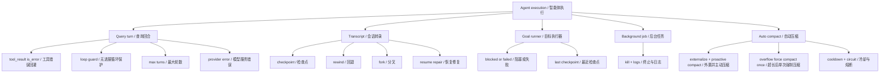
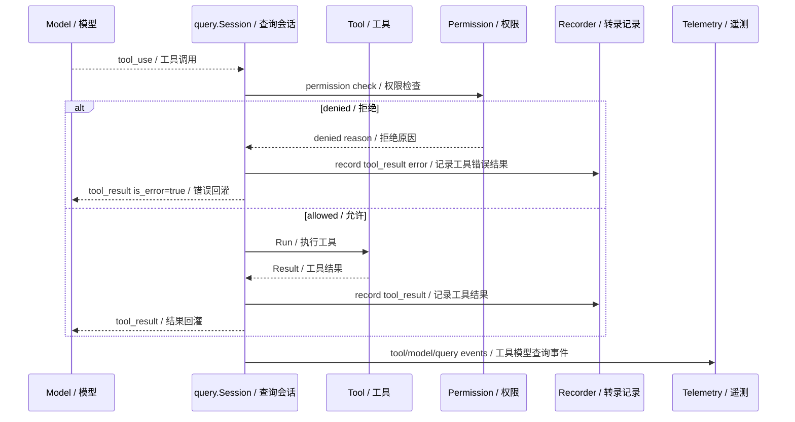
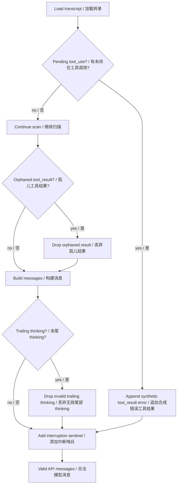
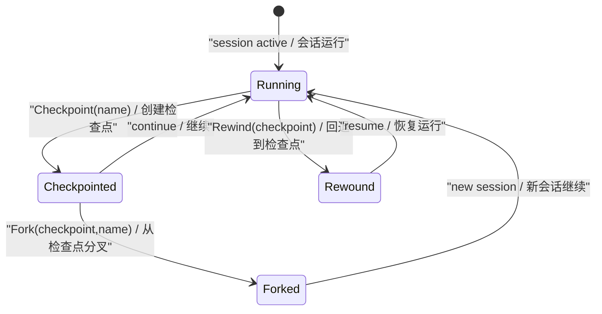
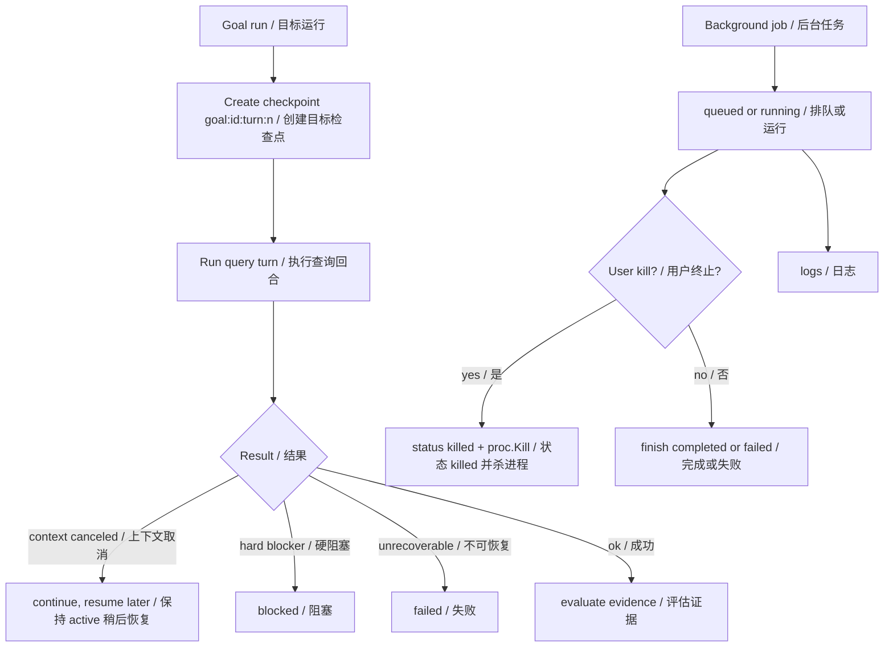

# 第 12 章：异常处理和恢复 Exception Handling and Recovery

## 书中理论要点

异常处理和恢复模式回答的问题是：智能体执行过程中必然会遇到工具失败、权限拒绝、网络错误、上下文超长、会话中断、用户暂停、后台任务失败。一个可用的智能体系统不能只在成功路径上工作，还要能把失败变成可观察、可恢复、可继续推进的状态。

Go Claude 的实践不是简单“try again”。它把异常分层处理：

- query turn 内：tool error 回灌、无进展 loop guard、max turns、provider error、permission denied。
- transcript 层：checkpoint、rewind、fork、resume repair。
- Goal 层：checkpoint、blocked/failed/continue decision、budget policy。
- background 层：job status、kill、logs、finish。
- compact 层：tool-result 外置、默认主动压缩、summary failed/circuit/cooldown、provider context overflow 后的单次强制压缩恢复。

## Go Claude 的工程落点

核心源码：

- `internal/query/query.go` 的 `Session.run` 处理 turn loop、tool result、max turns、auto compact、usage、telemetry。
- `internal/query/resume.go` 的 resume repair 逻辑修复中断 transcript：合成缺失 `tool_result`、丢弃孤儿 tool result、处理 trailing thinking。
- `internal/tools/guarded.go` 处理 active skill、agent policy、permission prompt、permission update 和权限拒绝。
- `internal/session/store.go` 实现 `Checkpoint`、`Rewind`、`RewindFiles`、`RewindToMessage`、`Fork`。
- `internal/goal/runner.go` 为每个 Goal turn 创建 checkpoint，并把错误交给 evaluator 决策。
- `internal/goal/evaluator.go` 把错误映射为 continue、blocked、failed。
- `internal/background/background.go` 记录 background job、kill 进程、读取 logs、finish 状态。
- `internal/compact/compactor.go` 处理 auto compact 的 recent-round 保留、失败计数、熔断和 cooldown；`internal/query/query.go:compactAfterOverflow` 处理 provider context overflow 的单次强制压缩重试。

## 源码映射表

| 层级 | Go Claude 文件 | 学习重点 |
| --- | --- | --- |
| query loop | `internal/query/query.go` | tool error 回灌、loop guard、max turns、model stream error、auto compact、overflow recovery |
| resume repair | `internal/query/resume.go` | synthetic tool result、orphaned result 清理、interruption sentinel、trailing thinking 清理 |
| 权限恢复 | `internal/tools/guarded.go` | permission prompt、session/project/global/local permission update |
| 会话恢复 | `internal/session/store.go` | checkpoint、rewind、files-only rewind、conversation rewind、fork |
| Goal 恢复 | `internal/goal/runner.go`、`internal/goal/evaluator.go` | checkpoint、context canceled、hard blocker、repeated blocker |
| 后台恢复 | `internal/background/background.go` | queued/running/completed/failed/killed、logs、kill |
| 压缩兜底 | `internal/compact/compactor.go`、`internal/compact/overflow.go`、`internal/query/query.go:compactAfterOverflow` | tool-result budget、summary_failed、summary_invalid、circuit_open、cooldown、overflow 强制压缩 |
| 测试证据 | `internal/session/store_test.go`、`internal/query/query_test.go`、`internal/cli/cli_test.go` | rewind、resume repair、max turns、Goal checkpoint |

## 异常处理分层架构



这张图的重点是：恢复不只发生在一个函数里。Go Claude 把不同失败落在不同层级，避免用单一重试掩盖真实问题。

## Query turn 失败链路



工具失败默认不会立刻杀死整个 query。它会变成 `tool_result is_error=true`，进入下一轮模型上下文。这样模型能基于真实错误调整做法，例如换工具、解释权限问题、请求用户授权，或停止。

query loop 有两级停止边界。近期窗口内重复工具、文本或 sub-agent 结果且没有新信息时，loop guard 会先发软提醒，达到硬阈值后以 `loop_guard_abort` 停止；没有触发无进展判断但持续调用工具时，`MaxTurns` 仍作为最终边界，返回 `max turns reached (N)` 并发出 `query.max_turns` 事件。

上下文恢复也分主动和被动两条路径：每轮模型请求前先按 message/history budget 外置过大的 tool result，再执行默认开启的 auto compact，并保留最近若干轮；如果本地 token 估算仍低估了图片、CJK 或 provider tokenizer，provider 返回 context overflow 后，runtime 最多强制 compact 一次并重试当前 turn，防止恢复本身形成循环。

## Resume repair 机制



resume repair 是一个很实用的工程点。模型 API 要求 `tool_use` 后必须有对应 `tool_result`。如果进程中断在工具调用之后、工具结果记录之前，直接 resume 会导致上游 API 报错。

`MessagesFromTranscriptWithReport` 的策略是：

- 未闭合 `tool_call`：合成 `"[Tool result missing due to internal error]"`，并标记 `IsError=true`。
- 孤儿 `tool_result`：丢弃，避免没有对应 tool use。
- trailing thinking：丢弃不完整 thinking block。
- 如果最后是 tool result：追加 `Continue from where you left off.`。
- 如果最后是用户普通消息：追加 `No response requested.`，避免重复回答已处理输入。

这让中断恢复变成可解释的 repair report，而不是“重新跑一次试试”。

## Checkpoint、Rewind、Fork



`internal/session/store.go` 提供几种恢复方式：

| 操作 | 行为 | 适用场景 |
| --- | --- | --- |
| `Checkpoint(sessionID,name)` | 在 transcript 追加 checkpoint entry | 手动创建恢复点 |
| `Recorder.Checkpoint(name,content)` | 带 entry ID 和 content 追加 checkpoint | query/Goal 自动检查点 |
| `Rewind(sessionID,checkpoint)` | 删除 checkpoint 之后的 entries，并恢复文件变更 | 回到某个明确检查点 |
| `RewindFiles(sessionID,messageID)` | 只恢复文件，保留 transcript | 文件改错了但希望保留对话证据 |
| `RewindToMessage(sessionID,messageID)` | 回退文件和 transcript 到消息附近 | 回到某次用户消息 |
| `RewindConversationToMessage` | 只改 conversation，不恢复文件 | 修复对话轨迹，不动文件 |
| `Fork(sessionID,checkpoint,name)` | 复制 checkpoint 之前 entries 到新 session | 尝试另一条路径 |

`restoreFileChanges` 会按 transcript 正序归并回退范围，对每个路径选择最早一次变更的完整 `before` 状态，因此同一文件连续修改多次仍能恢复到目标 checkpoint。内容或大文件 snapshot 恢复成功后会应用有效的 `before_mode`；`before_mode_known` 用于区分合法 `0000` 和未知 mode，旧 transcript 没有 mode 时跳过 chmod。详见 [Checkpoint/Snapshot 功能对齐说明](../architecture/checkpoint_snapshot_functional_parity.md) 和 [修复方案](../superpowers/plans/2026-07-15-checkpoint-rewind-correctness-fix-plan.md)。files-only rewind 还会把 recap 标记为 invalidated，防止旧 recap 描述已经被回退的文件状态。

## Goal 和后台任务恢复



Goal runner 每轮通过 `checkpoint := fmt.Sprintf("goal:%s:turn:%d", goal.ID, turn)` 创建恢复点。CLI runner 会创建本地 session checkpoint；API runner 在 `SessionID` 合法时也会创建 tenant goal checkpoint。

后台任务则通过 `background.Store` 维护状态：

- 创建时 `queued`。
- 启动后记录 PID、log path、`running`。
- `Finish` 根据 exit code 写 `completed` 或 `failed`。
- `Kill` 写 `killed`、`ExitCode=-1`，并调用 `proc.Kill()`。
- `Logs` 读取对应 log 文件。

这让长期任务不依赖 TUI 生命周期，失败后也能通过 job status 和 log 追踪。

## 优先级与冲突处理

| 冲突 | 谁优先 | 为什么 |
| --- | --- | --- |
| 工具失败 vs 模型想继续假装成功 | tool_result error 优先 | 错误进入下一轮上下文，并写入 transcript/trace。 |
| 权限拒绝 vs 用户任务目标 | permission policy 优先 | 安全边界比目标完成更硬。 |
| permission prompt 允许一次 vs 持久允许 | destination 优先 | `once` 不写规则，session/project/global/local 会更新对应设置。 |
| 工具 loop 持续不结束 | `MaxTurns` 优先 | 防止无限工具循环。 |
| 近期工具/文本/sub-agent 结果反复且无新信息 | loop guard 优先 | 在耗尽全部 `MaxTurns` 前软提醒并硬停止。 |
| transcript 有未闭合 tool_use | resume repair 优先 | 合成错误 tool result，保证 API 消息合法。 |
| rewind 要恢复文件，但同一文件多次变更 | 目标 checkpoint 的最早状态优先 | `restoreFileChanges` 按 transcript 正序选择同一路径最早的 `before`，每个路径只恢复一次。 |
| files-only rewind 后 recap 仍存在 | rewind invalidation 优先 | 写入 invalidated recap entry，避免旧总结误导。 |
| Goal context canceled vs failed | continue/resume 优先 | 用户取消或上下文取消不是不可恢复失败。 |
| background job 被 kill，但子进程后来退出 | killed 状态优先 | `Finish` 看到 killed 会直接返回，不覆盖状态。 |
| compact 连续失败 vs 继续压缩 | circuit open 优先 | 达到 `MaxFailures` 后跳过 compact，避免反复消耗。 |
| provider context overflow vs 直接失败 | 单次强制 compact 优先 | 只恢复一次；压缩无效或再次 overflow 时返回原错误，避免重试循环。 |

## 异常、兜底与恢复清单

| 异常 | 当前机制 | 读者应关注 |
| --- | --- | --- |
| unknown tool | 返回 tool error，不猜测替代工具 | registry 是硬边界 |
| permission denied | `Result{IsError:true}` + permission telemetry | 不要重试完全相同调用 |
| model stream error | `Session.run` 返回错误并 emit model error telemetry | provider 失败与工具失败不同 |
| repeated no-progress loop | soft awareness + `loop_guard_abort` | 同时覆盖重复工具、文本和 sub-agent loop |
| max turns reached | 返回错误并 emit `query.max_turns` | 防止无限 loop |
| interrupted tool turn | 合成错误 tool_result | resume 消息合法性 |
| orphaned tool result | 丢弃 | 保持 tool_use/tool_result 成对 |
| file edit wrong | checkpoint + rewind restore snapshot | 恢复点要提前创建 |
| want alternate path | fork session | 不污染原路径 |
| background stuck | kill + logs | 后台任务必须可终止可观察 |
| compact failure | failure count + cooldown + circuit | 压缩失败不应拖垮主请求 |
| context overflow | `ForceCompact` once + retry | 估算器漏判时仍有恢复机会，但不会无限重试 |

## 最佳实践

- 工具失败要回灌给模型，不要隐藏。隐藏失败会导致模型继续编造成功路径。
- 权限拒绝后不要原样重试。系统提示也明确要求：如果工具调用被拒绝，不要重试完全相同调用，要解释或调整。
- 长任务必须创建 checkpoint。没有 checkpoint 的恢复只能靠猜或人工 diff。
- rewind 前要理解三种模式：恢复文件、恢复对话、两者都恢复。不同模式影响完全不同。
- fork 适合探索另一条路径，不适合替代错误修复。
- resume repair 是兜底，不是正常流程。正常流程仍应保证 tool_call 后记录 tool_result。
- background job 必须看 status 和 logs，不要只看命令是否返回。
- compact 前优先外置大 tool result；这是无模型成本、可按路径取回的缩减手段，不应先为可外置内容支付摘要成本。
- compact 失败要可观测，但不能让 summary 失败破坏正常 query；provider 已明确拒绝 context overflow 时才走单次强制恢复。

## 源码阅读路线

1. 读 `internal/query/query.go:Session.run`，找到 `tool_result` 追加和 `max turns reached`。
2. 读 `internal/query/resume.go:MessagesFromTranscriptWithReport`，理解 resume repair。
3. 读 `internal/tools/guarded.go`，理解权限拒绝和 permission update。
4. 读 `internal/session/store.go:Checkpoint`、`Rewind`、`rewindFiles`、`Fork`。
5. 读 `internal/session/store.go:restoreFileChanges`，理解文件快照恢复。
6. 读 `internal/goal/runner.go` 和 `internal/goal/evaluator.go`，理解 Goal 错误如何变成状态。
7. 读 `internal/background/background.go`，理解后台任务生命周期。
8. 读 `internal/compact/compactor.go`、`overflow.go` 和 `query.Session.compactAfterOverflow`，理解主动压缩与被动 overflow 恢复。

## 如何验证

静态阅读：

```bash
rg -n "max turns reached|tool_result|MessagesFromTranscriptWithReport|SyntheticToolResults|DroppedOrphanedToolResults" internal/query
rg -n "func \\(s Store\\) Checkpoint|func \\(s Store\\) Rewind|RewindFiles|RewindToMessage|Fork|restoreFileChanges" internal/session
rg -n "func \\(s Store\\) Kill|func \\(s Store\\) Logs|Finish\\(" internal/background
```

单元测试：

```bash
go test ./internal/session -run 'Checkpoint|Rewind|Fork' -count=1
go test ./internal/query -run 'Resume|MaxTurns|LoopGuard|Permission|Tool|Overflow|Compact' -count=1
go test ./internal/background -count=1
go test ./internal/compact -run 'Compact|Summary|Circuit|Cooldown|Overflow|Resilience' -count=1
```

CLI 行为阅读：

```bash
rg -n "session checkpoint|session rewind|session fork|/rewind|background.*kill|background.*logs|goal run" internal/cli
```

## 学习任务

1. 解释为什么未闭合 `tool_use` 不能直接 resume。
2. 比较 `RewindFiles`、`RewindToMessage`、`RewindConversationToMessage` 的差异。
3. 说明为什么 permission denied 后不应该原样重试。
4. 找出 background `Kill` 为什么不会被后续 `Finish` 覆盖。
5. 解释 compact failure 为什么要有 `MaxFailures` 和 cooldown。
6. 解释为什么 tool-result externalization 必须发生在 auto compact 阈值判断之前。
7. 解释 context overflow 恢复为什么最多强制压缩一次。

## 当前差距

- query 层没有对所有 provider error 做统一业务重试；provider SDK/client 的 retry 与 query 层的 tool loop 是不同层次。
- rewind 依赖 transcript 中记录的 file_change snapshot；未被记录的外部文件变化无法自动恢复。
- background kill 使用进程级 kill，外部副作用是否完全停止还取决于子进程和外部系统。
- resume repair 能保证消息序列合法，但不能恢复工具中断时未记录的真实外部副作用。

## 本章自审

| 检查项 | 结果 |
| --- | --- |
| 引用了真实源码路径 | 已覆盖 `internal/query`、`internal/tools/guarded.go`、`internal/session`、`internal/goal`、`internal/background`、`internal/compact`。 |
| 至少 3 张图 | 已包含异常分层架构、query 失败时序、resume repair、checkpoint 状态机、Goal/background 恢复图。 |
| 写清楚顺序和优先级 | 已说明 query、resume repair、rewind、Goal、background、compact 的裁决顺序。 |
| 写清楚冲突处理 | 已覆盖工具失败、权限拒绝、max turns、未闭合 tool_use、rewind、kill、compact circuit。 |
| 写清楚异常和兜底 | 已说明 tool error 回灌、合成 tool_result、checkpoint/rewind/fork、Goal blocked/failed、background logs。 |
| 有验证命令 | 已提供 `rg`、`go test`、CLI 行为阅读命令。 |
