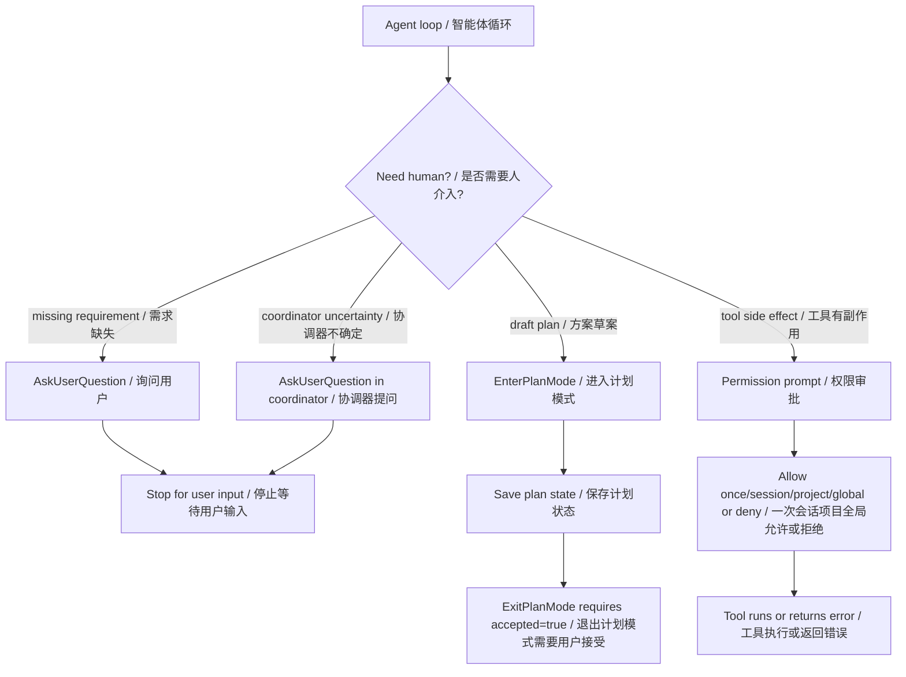
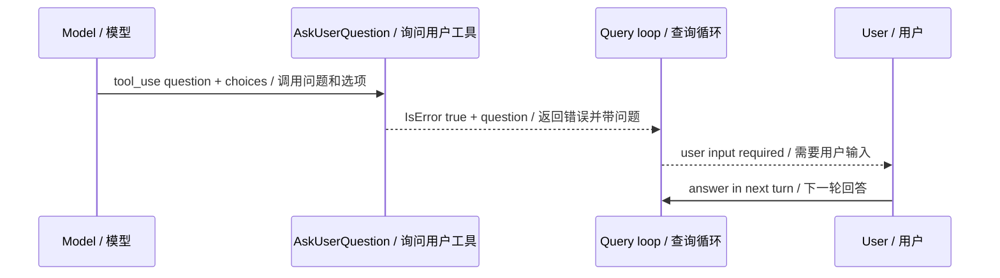
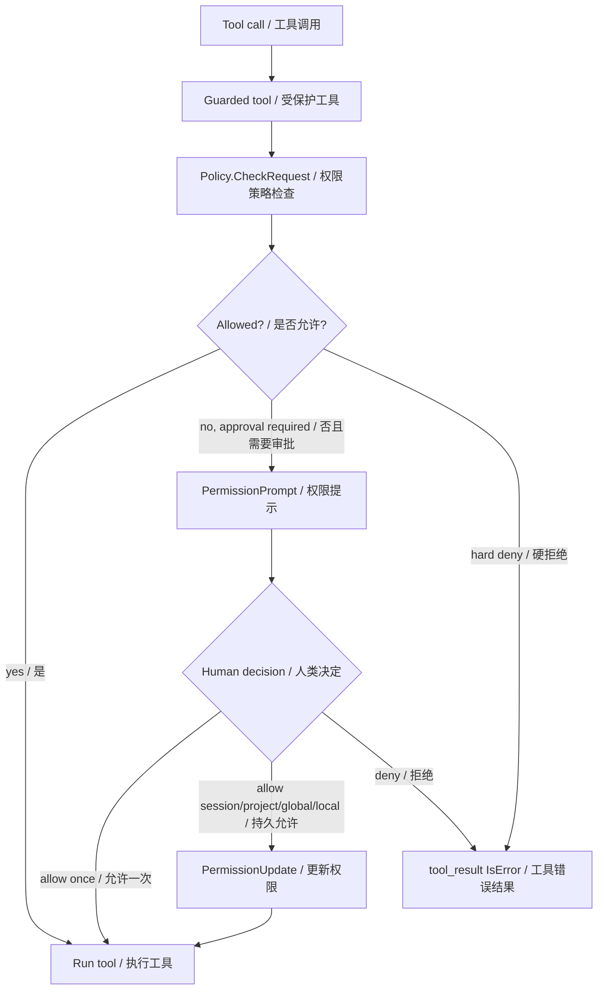
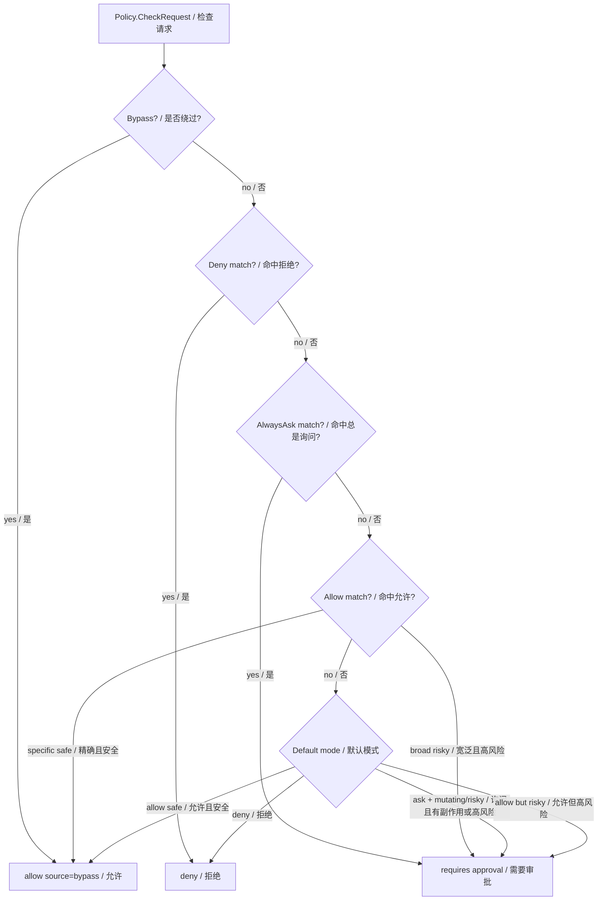
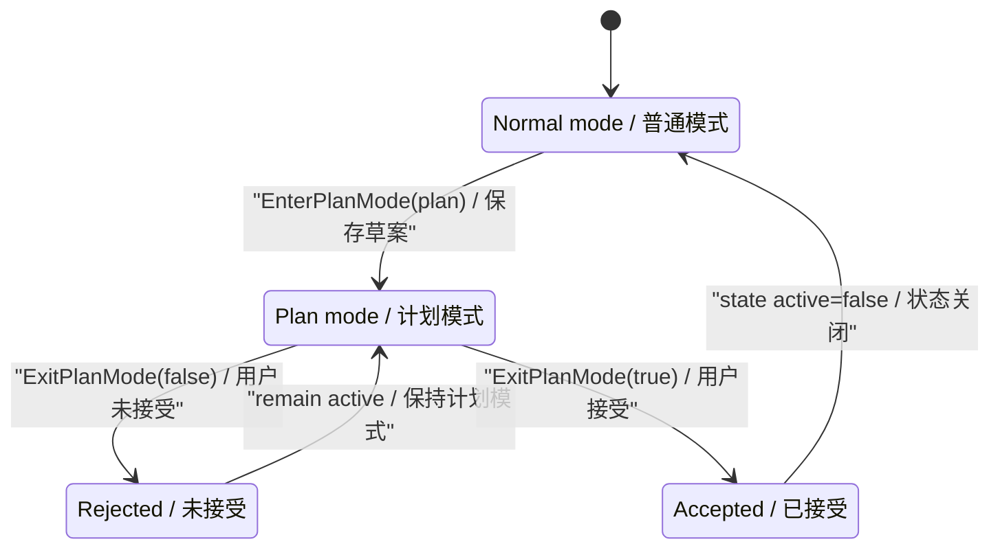
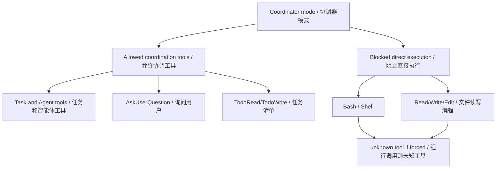
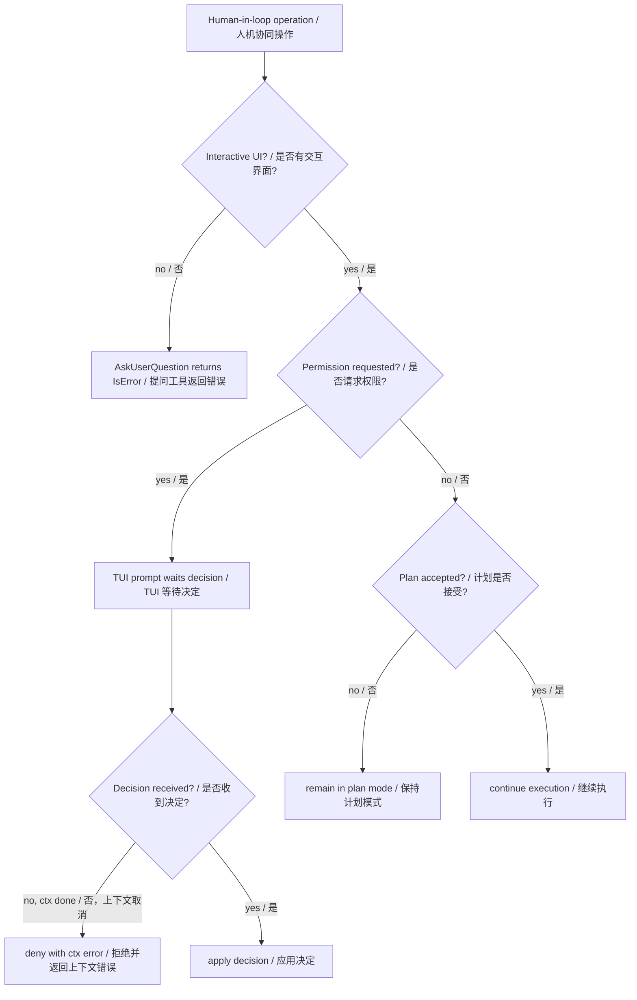

# 第 13 章：人机协同 Human-in-the-Loop

## 书中理论要点

人机协同不是“模型不会了就问人”这么简单。真正的 Human-in-the-Loop 要解决三个问题：

- 何时必须停下来问人：需求缺失、方案未确认、高风险工具、权限边界、外部状态不可见。
- 问人的结果如何进入系统：是一次性回答、权限审批、长期规则、计划状态，还是任务阻塞证据。
- 如何避免假协同：不能让模型绕过审批，也不能把用户沉默当成同意。

Go Claude 的实现把人类介入拆成几类明确机制：`AskUserQuestion` 用于缺少业务信息，permission prompt 用于工具副作用审批，PlanMode 用于先方案后执行，多 agent coordinator 只能用协调工具和提问工具，TUI 提供交互审批 UI。

## Go Claude 的工程落点

核心入口：

- `internal/tools/askuserquestion/askuserquestion.go`
- `internal/tools/planmode/planmode.go`
- `internal/tools/guarded.go`
- `internal/permissions/policy.go`
- `internal/cli/cli.go:tuiPermissionPrompt`
- `internal/tui/app.go:permissionPromptView`
- `internal/query/query.go:coordinatorToolAllowlist`
- `internal/query/query_test.go` 的 permission 和 coordinator 测试

## 源码映射表

| 层级 | Go Claude 文件 | 学习重点 |
| --- | --- | --- |
| 问用户 | `internal/tools/askuserquestion/askuserquestion.go` | 缺少信息时返回 `User input required`，并以 `IsError=true` 显式停住。 |
| 计划确认 | `internal/tools/planmode/planmode.go` | `EnterPlanMode` 写 `.claude/plan_mode.json`；`ExitPlanMode` 必须 `accepted=true`。 |
| 权限策略 | `internal/permissions/policy.go` | deny、alwaysAsk、allow、defaultMode、风险分类和 mode normalize。 |
| 工具审批 | `internal/tools/guarded.go` | guarded tool 在执行前检查 policy，必要时调用 `PermissionPrompt`。 |
| 审批持久化 | `internal/query/query.go:applyPermissionUpdate` | once/session/project/global/local 的权限更新语义。 |
| TUI 审批 | `internal/cli/cli.go:tuiPermissionPrompt`、`internal/tui/app.go` | 将 permission request 发给 TUI，用户选择 y/s/p/g/n。 |
| 工具注册 | `internal/cli/cli.go:coreRuntimeTools` | `AskUserQuestion`、`EnterPlanMode`、`ExitPlanMode` 是核心工具。 |
| coordinator | `internal/query/query.go:coordinatorToolAllowlist` | coordinator 只暴露协调/提问/任务工具，不暴露普通 Bash/Read。 |

## 人类介入架构图



这张图的重点是：Go Claude 没有把所有人类介入都做成同一个“问一下”。提问、审批、计划确认分别有不同的工具和状态。

## AskUserQuestion：缺信息时显式停住

`AskUserQuestion` 的 schema 很小：`question` 必填，`choices` 可选。它的实现直接返回：

```text
User input required: <question>
- <choice>
```

并且 `IsError=true`。这不是 bug，而是设计：在非交互或工具 loop 里，它要让当前回合明确停止，避免模型假装知道答案继续执行。



适用场景：

- 需求不明确，例如目标路径、优先级、业务规则无法从上下文推断。
- 多 agent coordinator 需要用户裁决方向。
- 继续执行会造成错误成本，而合理默认值风险较高。

不适用场景：

- 工具权限审批；应该走 permission prompt。
- 计划草案确认；应该走 PlanMode。
- 可以通过读文件、搜索、测试获得的信息；应该先用工具验证。

## Permission Prompt：副作用执行前审批

权限审批链路在 `tools.Guard` 中完成。它先把工具调用交给 `permissions.Policy.CheckRequest`，如果 policy 返回“requires permission approval”，才调用 `PermissionPrompt`。



### 权限策略优先级

`permissions.Policy.CheckRequest` 当前裁决顺序是：

1. `Bypass`：完全跳过权限 prompt，通常来自 `--dangerously-skip-permissions` 或 interactive allow bypass。
2. `Deny`：命中 deny 直接拒绝。
3. `AlwaysAsk`：命中 alwaysAsk 必须审批。
4. `Allow`：命中 allow 可放行，但 Bash/PowerShell 等危险命令即使命中 broad wildcard allow 仍可能要求审批。
5. `DefaultMode=deny`：不在 allow list 就拒绝。
6. `DefaultMode=ask`：mutating tool 或高风险请求要求审批。
7. 默认 allow：仍会对高风险请求要求审批。



### TUI 审批选项

TUI permission prompt 显示 tool、request、reason、source、input preview，并提供这些选项：

| 快捷键 | 结果 | 持久化范围 |
| --- | --- | --- |
| `y` | Allow once | 只本次工具调用。 |
| `s` | Allow for session | 写入当前 session allow/deny。 |
| `p` | Allow for project | 写入项目 `.claude/settings.json`。 |
| `g` | Allow globally | 写入全局 settings。 |
| `n` / `esc` | Deny | 拒绝本次调用。 |

如果原始 rule 太宽，例如 `Bash`，TUI 会用 request 收窄成 `Bash(<command>)`，避免用户点一次后过度放权。

## PlanMode：先方案，后执行

PlanMode 解决的是“用户要求先说方案，不要直接改”的人机协同问题。它不是权限系统的替代品，而是执行前的方案确认门禁。



源码行为：

- `EnterPlanMode` 要求传入 `plan`，写 `.claude/plan_mode.json`，内容包含 `active=true` 和 plan 文本。
- `ExitPlanMode` 要求 `accepted`。
- `accepted=false` 时返回错误：`Plan was not accepted; remaining in plan mode`。
- `accepted=true` 才把 `active=false` 写回。
- 写状态时仍受 sandbox/writable path 检查约束。

注意：CLI 的 `--permission-mode plan` 会 normalize 成 permission `ask`，这只影响权限默认模式，不等于自动进入 PlanMode。真正的计划状态由 `EnterPlanMode` / `ExitPlanMode` 工具写入。

## Coordinator 中的人机协同

coordinator 模式下，主线程不是直接执行普通工具，而是使用协调工具：`Task`、`AgentCreate/List/Get/Stop/Message`、`TaskOutput`、`AskUserQuestion`、`TodoRead/TodoWrite`。普通 `Bash` / `Read` 不进入 tool definitions，模型硬调也会得到 unknown tool。



这体现了人机协同和多 agent 协作的结合：协调器可以问人、分派、汇总，但不能绕过执行者和权限机制直接改文件。

## 优先级与冲突处理

| 冲突 | 谁优先 | 原因 |
| --- | --- | --- |
| 用户说先别改 vs agent 想执行 | 用户约束 / PlanMode 优先 | 未接受计划前不应修改项目文件。 |
| deny rule vs permission prompt approve | deny 优先 | hard deny 不进入审批放行路径。 |
| session deny vs agent `bypassPermissions` | session deny 优先 | 子 agent 不能扩大父会话安全边界。 |
| broad allow vs dangerous Bash | dangerous request 仍需审批 | 宽泛 allow 不能覆盖高风险请求。 |
| AskUserQuestion vs 可工具验证信息 | 先工具验证 | 不要把可验证事实外包给用户。 |
| `ExitPlanMode(false)` vs 继续执行 | 继续保持 plan mode | 用户未接受就是不允许进入执行态。 |
| TUI 上下文取消 vs 等待审批 | 拒绝并返回 ctx error | 不能把取消当成允许。 |
| permission destination=session/project/global | 用户选择范围优先，但 rule 要收窄 | 持久授权必须尽量具体。 |

## 异常、兜底与恢复



关键兜底：

- AskUserQuestion 没有 question 时返回错误。
- 非交互场景下 AskUserQuestion 的错误结果会让调用方看到“需要用户输入”。
- permission prompt 等待期间 context cancel 会返回拒绝。
- `PermissionUpdate` 持久化失败会返回工具错误，不继续执行工具。
- PlanMode 状态写入受 sandbox 和 writable roots 限制。
- TUI 只展示 input preview，并截断过长 input，避免 UI 泄露或卡死。

## 最佳实践

- 需求信息缺失时，用 `AskUserQuestion` 明确停住；不要让模型猜高风险默认值。
- 工具有副作用时走 permission prompt；不要用普通问题替代权限审批。
- 用户要求“先说方案、先不改”时，使用 PlanMode 思路：先保存草案，得到接受后再执行。
- 持久权限选择 project/global 时，rule 要尽量窄，优先使用具体 file path 或 command。
- 子 agent 的 permissionMode 不能覆盖父会话 deny；多 agent 协作要继承安全边界。
- coordinator 只能协调、提问、分派和汇总，不直接执行普通文件或 shell 工具。
- 对非交互 API/后台任务，要把需要人输入的状态显式返回，而不是无限等待。

## 源码阅读路线

1. 读 `internal/tools/askuserquestion/askuserquestion.go`，确认它为什么返回 `IsError=true`。
2. 读 `internal/tools/planmode/planmode.go`，跟 `.claude/plan_mode.json` 的 active/accepted 状态。
3. 读 `internal/permissions/policy.go:CheckRequest`，画出 deny/alwaysAsk/allow/defaultMode 顺序。
4. 读 `internal/tools/guarded.go`，看 permission prompt 如何放行、拒绝或持久化。
5. 读 `internal/cli/cli.go:tuiPermissionPrompt` 和 `internal/tui/app.go:permissionPromptView`，理解 TUI 选项。
6. 读 `internal/query/query.go:coordinatorToolAllowlist` 和相关测试，确认 coordinator 工具面。

## 如何验证

```bash
go test ./internal/tools/askuserquestion ./internal/tools/planmode -count=1
go test ./internal/permissions -count=1
go test ./internal/tools -run 'Guard|Permission|AgentPermission' -count=1
go test ./internal/query -run 'Permission|CoordinatorMode' -count=1
go test ./internal/tui -run 'PermissionPrompt' -count=1
go test ./internal/cli -run 'RuntimePermission|InteractivePermission' -count=1
```

源码搜索：

```bash
rg -n "AskUserQuestion|EnterPlanMode|ExitPlanMode|PermissionPrompt|PermissionUpdate|coordinatorToolAllowlist|NormalizeMode" internal docs
```

运行时验证建议：

- 在 TUI 中触发一个需要写文件或 Bash 的操作，选择 `s/p/g/n`，观察后续权限行为。
- 执行 `--permission-mode ask`，触发 mutating tool，确认审批 UI 出现。
- 执行 `--permission-mode plan`，确认权限 default mode 是 ask；再通过 `EnterPlanMode`/`ExitPlanMode` 验证计划状态。
- 让模型调用 `AskUserQuestion`，确认工具结果明确显示 `User input required`。

## 学习任务

- `AskUserQuestion` 为什么返回 `IsError=true`？
- permission prompt 和 AskUserQuestion 的边界是什么？
- `deny`、`alwaysAsk`、`allow`、`defaultMode=ask` 的优先级如何排列？
- 为什么 broad allow 遇到危险 Bash 仍要问用户？
- PlanMode 的 `accepted=false` 为什么必须保持 active？
- 为什么 coordinator 不应该直接暴露 Bash/Read？

## 当前差距

Go Claude 已具备 AskUserQuestion、permission prompt、TUI 审批、once/session/project/global/local 权限更新、PlanMode 状态、coordinator 工具收窄和相关测试。但当前 AskUserQuestion 仍是“显式停住等待下一轮输入”的工具，不是完整的实时双向表单交互；PlanMode 主要保存状态和 accepted gate，还没有完整的 UI 计划评审工作台；permission prompt 已有 TUI 和 headless 注入路径，但更复杂的团队审批流、异步审批和审计看板仍可继续增强。

## 本章自审

| 检查项 | 结果 |
| --- | --- |
| 引用真实源码 | 已覆盖 AskUserQuestion、PlanMode、permissions policy、guarded tools、TUI prompt、query coordinator、CLI 工具注册。 |
| 至少 3 张图 | 已包含人类介入架构、AskUserQuestion 时序、permission prompt、权限优先级、PlanMode 状态机、coordinator、兜底图。 |
| 图中英文后有中文 | Mermaid 节点和边均使用 `English / 中文`。 |
| 优先级 | 已说明 deny、alwaysAsk、allow、defaultMode、session deny、PlanMode、coordinator 工具面的优先级。 |
| 冲突处理 | 已覆盖用户先不改、hard deny、session deny、broad allow、AskUserQuestion 误用、计划未接受。 |
| 异常与兜底 | 已覆盖 context cancel、PermissionUpdate 失败、非交互提问、PlanMode 写入 sandbox、TUI 截断。 |
| 最佳实践 | 已给出提问、审批、计划确认、持久授权收窄、多 agent 安全边界实践。 |
| 验证命令 | 已提供 askuserquestion、planmode、permissions、tools、query、tui、cli 聚焦测试。 |
| 当前差距 | 已明确 AskUserQuestion、PlanMode 和审批工作流的当前边界。 |
