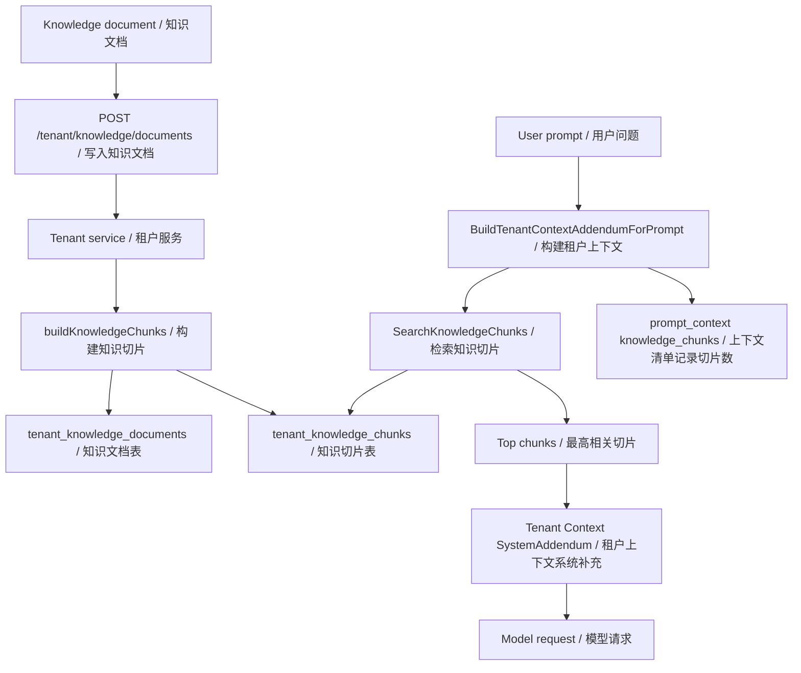
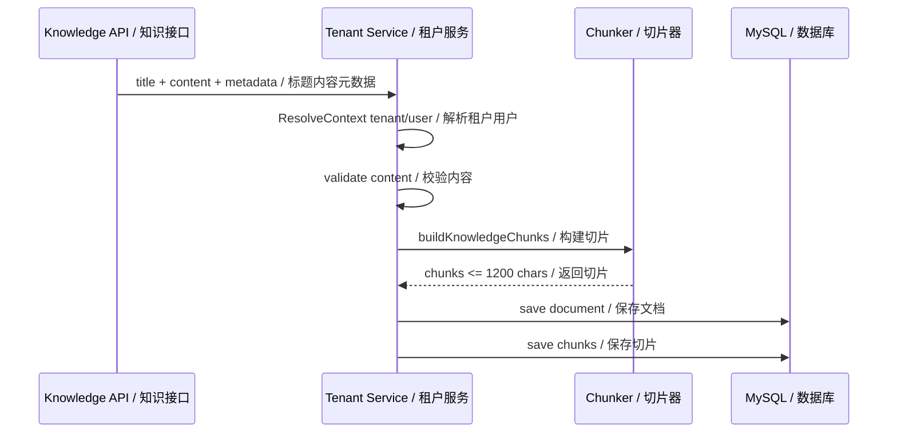
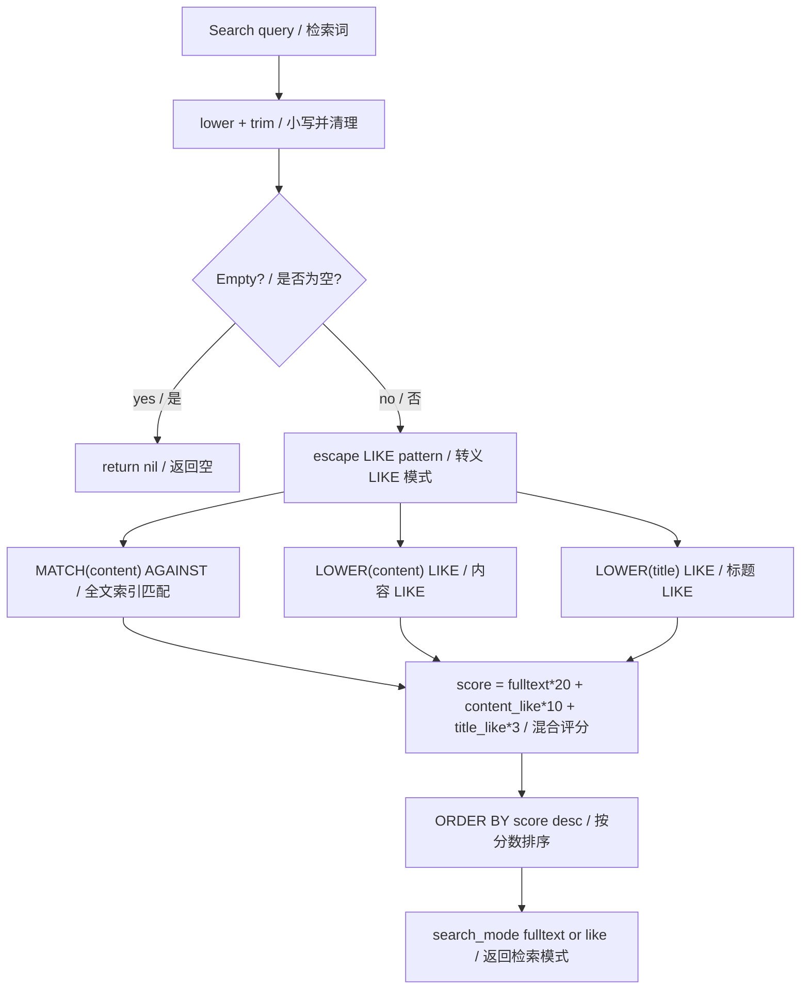
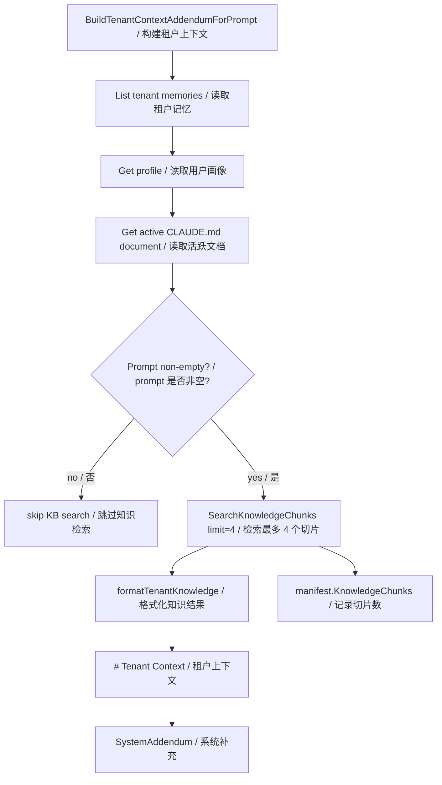
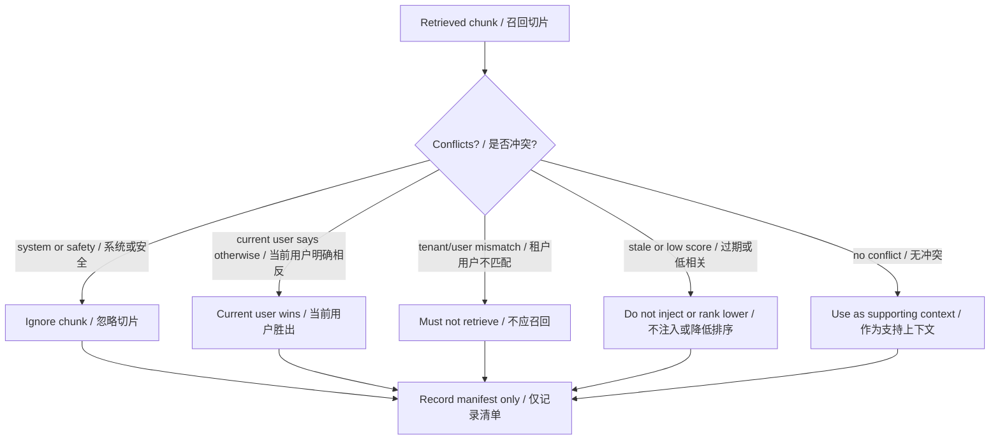
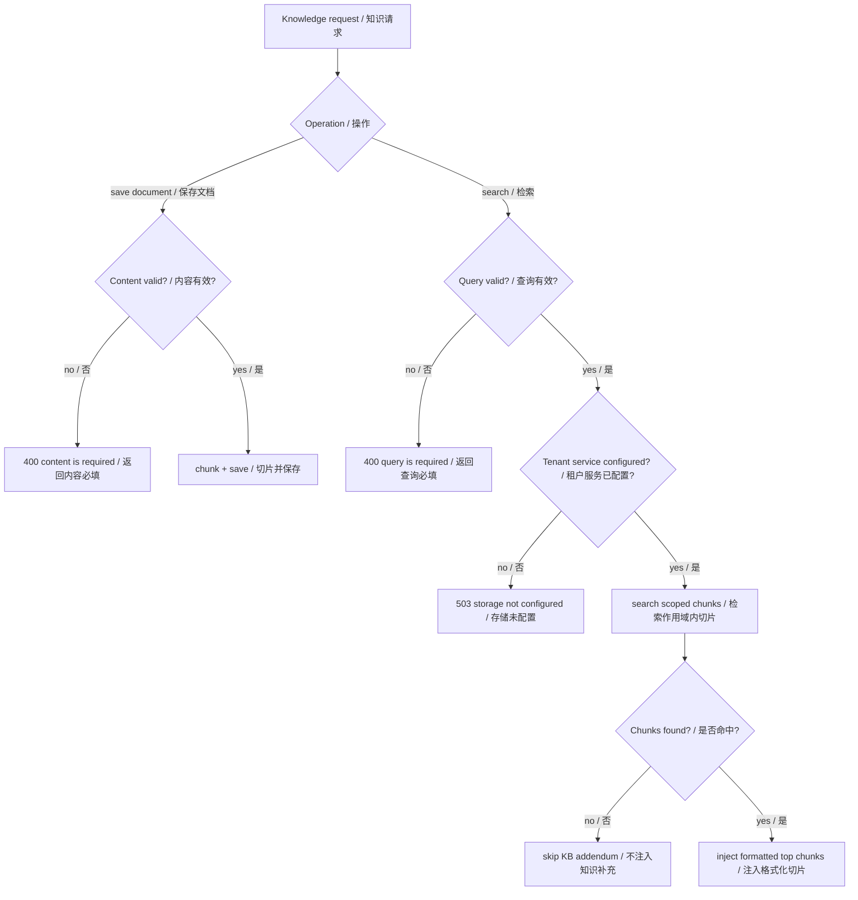

# 第 14 章：知识检索 Knowledge Retrieval / RAG

## 书中理论要点

知识检索/RAG 模式让智能体在回答前先从外部知识库取回相关材料，再把少量高相关内容注入上下文。它解决的是模型上下文有限、模型知识过期、企业私有知识不能进训练集的问题。

真实工程里，RAG 的关键不是“搜一下再回答”，而是：

- 知识怎么入库：文档、元数据、租户/用户作用域、切片策略。
- 怎么召回：关键词、全文索引、向量、混合检索、重排序。
- 怎么注入：只注入 top chunks，不把整个知识库塞进 prompt。
- 怎么观测：本轮到底搜了什么、命中多少 chunk、用的是哪种 search mode。
- 怎么隔离：tenant/user 边界必须硬于召回便利性。

Go Claude 当前实现的是 tenant knowledge base 的工程化 MVP/增强版：文档写入后切 chunk，MySQL FULLTEXT + LIKE hybrid scoring 检索，chat tenant context 按 prompt 注入 top chunks，并在 prompt context manifest 记录 `knowledge_chunks`。

## Go Claude 的工程落点

核心入口：

- `internal/tenant/service.go:SaveKnowledgeDocument`
- `internal/tenant/service.go:buildKnowledgeChunks`
- `internal/tenant/service.go:SearchKnowledgeChunks`
- `internal/storage/mysql/repository.go:SearchKnowledgeChunks`
- `internal/server/server.go:tenantKnowledgeDocumentsHandler`
- `internal/server/server.go:tenantKnowledgeSearchHandler`
- `internal/server/tenant_context.go:BuildTenantContextAddendumForPrompt`
- `internal/server/tenant_context.go:formatTenantKnowledge`
- `docs/api_server.md`
- `docs/manual_testing/prompt_context_webui.md`

## 源码映射表

| 层级 | Go Claude 文件 | 学习重点 |
| --- | --- | --- |
| API | `internal/server/server.go` | `/tenant/knowledge/documents` 写入/list，`/tenant/knowledge/search` 检索。 |
| service | `internal/tenant/service.go` | 解析 tenant/user、校验 title/content、构造文档 input 和 chunks。 |
| chunking | `internal/tenant/service.go:buildKnowledgeChunks` | 按空行段落和 1200 字符上限切 chunk。 |
| repository | `internal/storage/mysql/repository.go` | 文档/chunk 持久化，FULLTEXT + LIKE hybrid scoring，tenant/user 过滤。 |
| prompt injection | `internal/server/tenant_context.go` | chat tenant context 中按当前 prompt 检索 top chunks 并格式化注入。 |
| manifest | `internal/query/query.go:TenantContextManifest` | `knowledge_chunks` 记录本轮注入数量。 |
| tests | `internal/server/server_test.go`、`internal/tenant/service_test.go`、`internal/storage/mysql/repository_test.go` | API、切片、tenant/user scope、search_mode 和 prompt context。 |
| docs | `docs/api_server.md`、`docs/manual_testing/prompt_context_webui.md` | API 契约、WebUI KB Search 验证和 search_mode 观测。 |

## RAG 架构图



这张图说明：知识库不直接等于 prompt。文档必须先入库、切片、检索，最后只有 top chunks 进入本轮上下文。

## 知识入库与切片

`SaveKnowledgeDocument` 先解析当前 tenant/user，再保存文档和 chunks：



切片规则：

- title 为空时默认 `Untitled`。
- content 为空直接返回错误。
- source_type 为空默认 `manual`。
- status 为空默认 `active`。
- 以双换行分段，尽量按段落聚合。
- 单 chunk 目标上限是 1200 字符。
- 超长段落会按 1200 字符硬切。
- 如果切片为空但 content 非空，兜底生成一个 chunk。

## 检索链路与评分

当前 MySQL repository 使用 FULLTEXT + LIKE hybrid scoring：



仓储层查询同时加上这些约束：

- `c.tenant_id = tenantID`
- `d.tenant_id = tenantID`
- `(? = 0 OR d.user_id = userID)`
- `d.status = 'active'`
- document/chunk 都未删除

响应 chunk 带 `score` 和 `search_mode`，`search_mode` 用于区分本条命中来自 fulltext 还是 fallback like。

## Prompt 注入链路

知识检索只在有 prompt 时触发。`BuildTenantContextAddendumForPrompt(ctx, svc, prompt)` 会按顺序拼接 tenant memories、profile、active document，再用 prompt 检索 knowledge chunks。



`formatTenantKnowledge` 的输出类似：

```text
## Tenant Knowledge Search Results
- Billing FAQ#1: Refunds are handled within 7 days.
```

这里的知识结果是用户/租户上下文，不是 system 最高指令。它仍然必须服从 system、当前用户指令、权限、安全边界和租户隔离规则。

## 与 Memory 的区别

| 维度 | Knowledge Retrieval / 知识检索 | Memory / 记忆 |
| --- | --- | --- |
| 目标 | 回答当前问题时召回相关资料 | 跨会话保留稳定偏好、规范和事实 |
| 入口 | `/tenant/knowledge/documents`、`/tenant/knowledge/search` | `/tenant/memories`、memory review、文件 memory |
| 注入方式 | 按 prompt 检索 top chunks | 按 scope/category 加载 active memory |
| 更新方式 | 保存/替换知识文档后切片 | pending -> approve 或管理 API |
| 风险 | 召回错误、过期文档、信息过多 | 错误长期记忆、prompt 污染 |
| 当前实现 | FULLTEXT + LIKE hybrid | active category + pending marker 过滤 |

不要把所有 KB 文档当 memory 自动注入，也不要把用户偏好当知识库检索结果处理。两者都进入上下文，但生命周期、作用域和冲突处理不同。

## 优先级与冲突处理



| 冲突 | 裁决规则 | 原因 |
| --- | --- | --- |
| KB chunk 与 system/developer 规则冲突 | system/developer 胜出 | 检索内容不是最高优先级指令。 |
| KB chunk 与当前用户明确要求冲突 | 当前用户胜出 | 当前任务上下文优先。 |
| KB chunk 属于其他 tenant/user | 不允许召回 | 租户隔离硬边界。 |
| KB chunk 和 approved memory 冲突 | 视语义处理，必要时问用户或标注不确定 | memory 是长期指导，KB 是检索资料，两者都不是硬规则。 |
| search query 为空 | 不检索 | 避免无意义全库召回。 |
| 知识库服务错误 | 返回错误，不静默编造 | 不能假装检索成功。 |
| 文档过大 | 入库切 chunk，只注入 top chunks | 控制上下文和成本。 |

## 异常、兜底与恢复



关键兜底：

- API 未配置 tenant storage 时返回 `503`。
- 保存文档 content 为空返回 `400`。
- 搜索 query 为空返回 `400`。
- repository 搜索 query 为空时返回 nil，避免全库扫。
- prompt 为空时不触发 tenant KB search。
- prompt context manifest 记录 chunk 数量，不记录完整知识正文。

## 最佳实践

- KB 检索只注入 top chunks，不能把整篇文档或整个知识库塞进 prompt。
- 每次 RAG 相关排查都看 `search_mode`、`score`、`knowledge_chunks`，不要只看最终回答。
- tenant/user 过滤必须在 repository/service 层做，不能只靠 prompt 提醒模型。
- 文档状态要区分 active/deleted，搜索只取 active。
- 对高价值知识库继续演进 embedding/vector recall 和 rerank，但上线前要保留 FULLTEXT/LIKE fallback 和可观测 `search_mode`。
- 如果召回结果不足，优先改切片、索引、查询改写或文档治理，不要让模型编造未召回内容。

## 源码阅读路线

1. 读 `internal/tenant/service.go:SaveKnowledgeDocument`，确认 tenant/user scope 和 content 校验。
2. 读 `buildKnowledgeChunks`，理解 1200 字符切片和段落策略。
3. 读 `internal/storage/mysql/repository.go:SearchKnowledgeChunks` 和 `searchKnowledgeChunksSQL`，画出 FULLTEXT + LIKE scoring。
4. 读 `internal/server/tenant_context.go:BuildTenantContextAddendumForPrompt`，确认 chat prompt 注入 top chunks。
5. 读 `internal/query/query.go:TenantContextManifest`，确认 `knowledge_chunks` 如何进入 prompt context manifest。
6. 读 `docs/manual_testing/prompt_context_webui.md`，用 WebUI KB Search 验证 search_mode 和 score。

## 如何验证

```bash
go test ./internal/storage/mysql -run 'Knowledge' -count=1
go test ./internal/tenant -run 'Knowledge' -count=1
go test ./internal/server -run 'Knowledge|TenantContext' -count=1
go test ./internal/query -run 'ContextManifest' -count=1
```

源码搜索：

```bash
rg -n "SaveKnowledgeDocument|buildKnowledgeChunks|SearchKnowledgeChunks|formatTenantKnowledge|knowledge_chunks|search_mode" internal docs
```

API 验证：

```bash
curl -sS http://127.0.0.1:18080/tenant/knowledge/documents \
  -H 'Authorization: Bearer test-token' \
  -H 'X-Tenant-Key: webui-local' \
  -H 'X-User-Id: webui-local-user' \
  -H 'Content-Type: application/json' \
  -d '{"title":"Billing FAQ","content":"Refunds are handled within 7 days.","source_type":"manual"}'

curl -sS http://127.0.0.1:18080/tenant/knowledge/search \
  -H 'Authorization: Bearer test-token' \
  -H 'X-Tenant-Key: webui-local' \
  -H 'X-User-Id: webui-local-user' \
  -H 'Content-Type: application/json' \
  -d '{"query":"refund policy","limit":5}'
```

## 学习任务

- 为什么 KB 检索不能替代 memory review？
- `search_mode=fulltext` 和 `search_mode=like` 对排查有什么帮助？
- 为什么 prompt 为空时不应该触发知识检索？
- tenant/user 过滤为什么必须在 SQL/service 层完成？
- chunk 大小过大或过小分别会带来什么问题？
- 当前 FULLTEXT + LIKE hybrid 和 embedding/vector RAG 的差距在哪里？

## 当前差距

Go Claude 已实现 tenant knowledge documents/chunks、API 写入和检索、文档切片、MySQL FULLTEXT + LIKE hybrid scoring、`score`/`search_mode` 返回、chat prompt top chunks 注入、prompt context `knowledge_chunks` 观测和 WebUI KB Search 验证路径。当前还没有真正的 embedding/vector store、语义召回、cross-encoder rerank、知识版本治理、引用级回答和召回评测数据集；这些属于后续 RAG 增强方向。

## 本章自审

| 检查项 | 结果 |
| --- | --- |
| 引用真实源码 | 已覆盖 tenant service、MySQL repository、server API、tenant context、query manifest、tests 和 docs。 |
| 至少 3 张图 | 已包含 RAG 架构、入库时序、检索评分、prompt 注入、冲突裁决、异常兜底图。 |
| 图中英文后有中文 | Mermaid 节点和边均使用 `English / 中文`。 |
| 优先级 | 已说明 system/current user/tenant isolation 高于检索内容，KB 与 memory 生命周期不同。 |
| 冲突处理 | 已覆盖权限层级、跨租户召回、空 query、知识库错误、KB 与 memory 冲突。 |
| 异常与兜底 | 已覆盖 400/503、空 prompt 不检索、无命中不注入、manifest 不记录正文。 |
| 最佳实践 | 已给出 top chunks、search_mode/score 观测、repository scope、fallback、避免编造。 |
| 验证命令 | 已提供 storage/tenant/server/query 聚焦测试、源码搜索和 curl 验证。 |
| 当前差距 | 已明确没有 embedding/vector store、rerank、引用级回答和召回评测。 |
