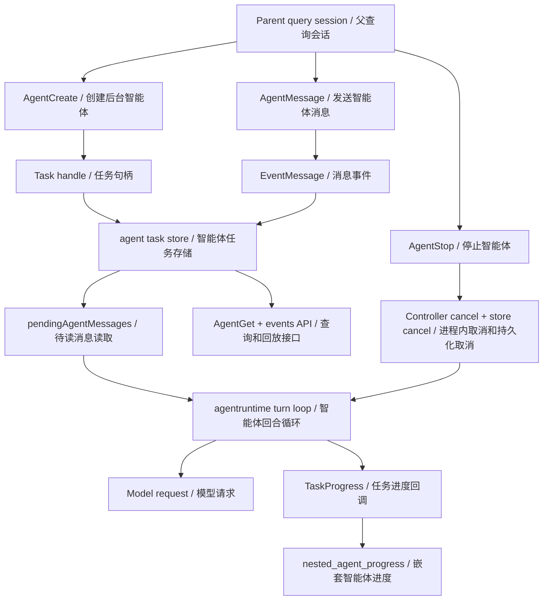
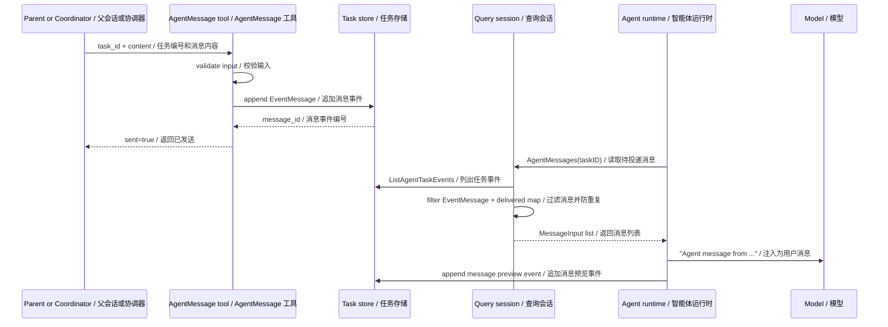
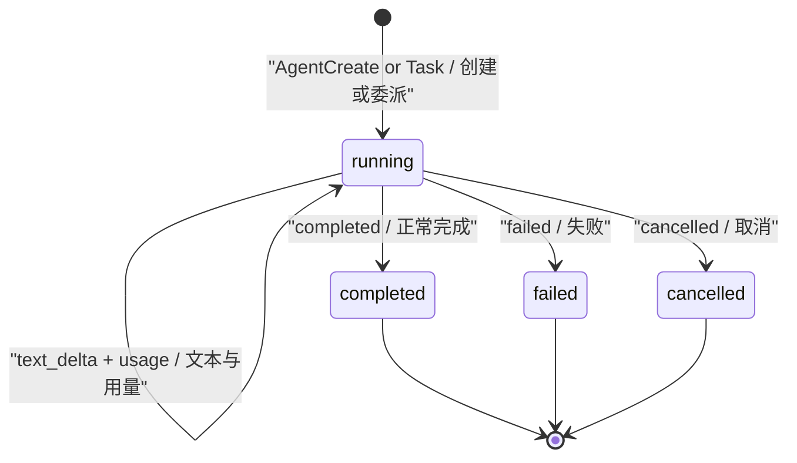
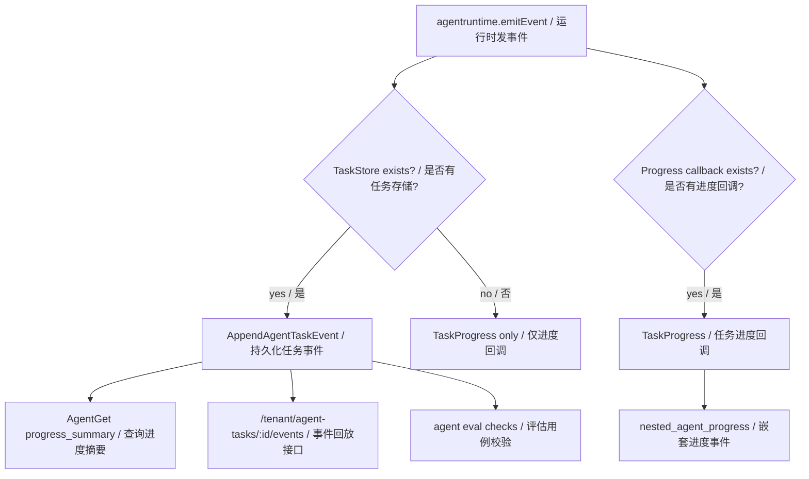
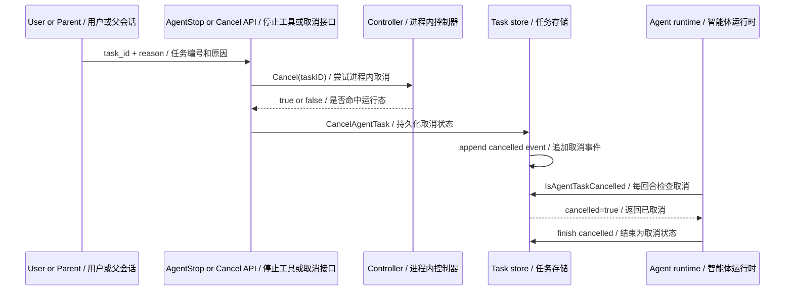
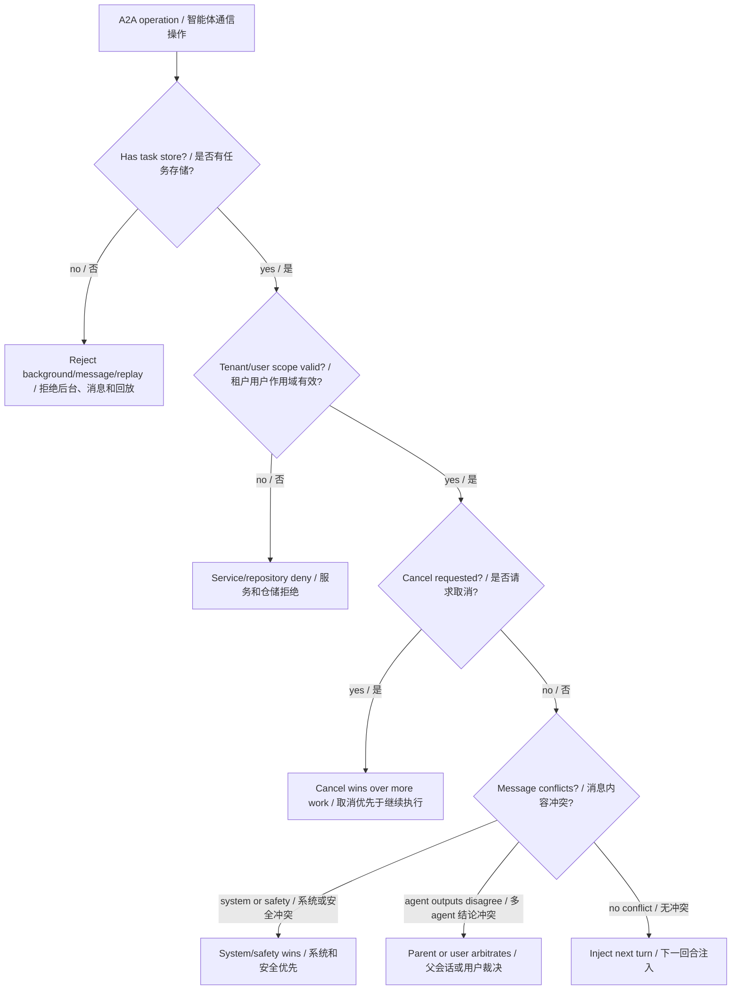
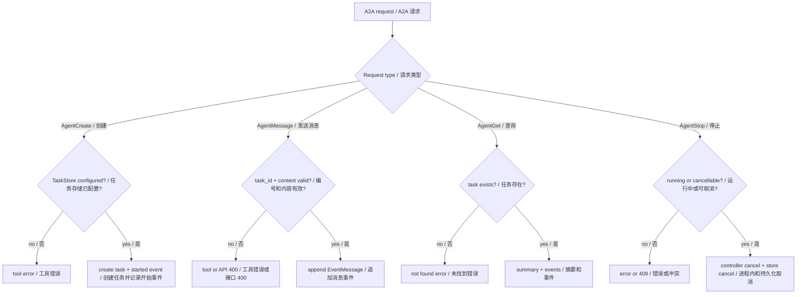

# 第 15 章：智能体间通信 Inter-Agent Communication / A2A

## 书中理论要点

智能体间通信模式关注的是：多个 agent 被创建以后，如何可靠地交换消息、同步状态、取消任务、回放过程和汇总证据。它和“多智能体协作”相邻，但重点不同：

- 多智能体协作回答“为什么拆、拆给谁、怎么分工”。
- 智能体间通信回答“拆开以后怎么传话、怎么记录、怎么防重复、怎么取消、怎么让父会话知道发生了什么”。

真实工程里，A2A 不应该只是让模型互相聊天。它至少要有任务句柄、消息 envelope、事件存储、状态机、进度流、取消机制、租户隔离、trace 关联和错误兜底。否则读者看到的是概念，系统运行时却无法诊断。

Go Claude 当前的 A2A 更接近“事件驱动的任务通信基座”：`AgentMessage` 把消息追加为 task event；sub-agent runtime 在每轮开始拉取 pending messages；query 层用 delivered map 防止同一会话重复投递；server/tenant/mysql 提供 API 和持久化边界；nested progress 把子 agent 进度推回父会话、TUI 或 stream-json。

## Go Claude 的工程落点

核心入口：

- `internal/agenttasks/agenttasks.go`
- `internal/agenttasks/controller.go`
- `internal/tools/agent/agent.go`
- `internal/agentruntime/runtime.go`
- `internal/query/query.go`
- `internal/server/server.go`
- `internal/tenant/service.go`
- `internal/storage/mysql/repository.go`
- `internal/agenteval/agenteval.go`
- `docs/testing/agent_eval_harness.md`

## 源码映射表

| 层级 | Go Claude 文件 | 学习重点 |
| --- | --- | --- |
| task schema | `internal/agenttasks/agenttasks.go` | task status、event type、`MessageInput`、`TaskInput`、`EventInput` 和 store 接口。 |
| in-process cancel | `internal/agenttasks/controller.go` | `Register`、`Cancel`、`Unregister` 管理同进程后台任务取消。 |
| agent tools | `internal/tools/agent/agent.go` | `AgentCreate/List/Get/Stop/Message` 暴露 A2A 管理和消息投递工具。 |
| runtime | `internal/agentruntime/runtime.go` | 每轮检查取消、读取 pending messages、写事件、发送 nested progress。 |
| query integration | `internal/query/query.go` | `ToolContext.AgentMessages`、`TaskProgress`、`pendingAgentMessages`、`coordinatorToolAllowlist`。 |
| API | `internal/server/server.go` | `/tenant/agent-tasks`、`/message`、`/cancel`、`/events`。 |
| tenant service | `internal/tenant/service.go` | tenant/user 解析、task lifecycle、cancel 追加 cancelled event。 |
| repository | `internal/storage/mysql/repository.go` | `tenant_agent_tasks`、`tenant_agent_task_events` 持久化和 scoped 查询。 |
| eval | `internal/agenteval/agenteval.go` | `multiagent_e2e` 验证 AgentCreate -> AgentMessage -> AgentGet -> AgentStop。 |

## A2A 通信架构图



这张图的重点是：A2A 消息不是直接插进另一个模型调用，而是先进入 task event store，再由目标 agent 的 runtime 在回合边界读取。

## 消息投递时序

`AgentMessage` 的语义是“追加一条消息事件”，不是“同步等待目标 agent 回复”。目标 agent 只有在下一次进入 turn loop、调用 `ToolContext.AgentMessages(taskID)` 时，才会把消息变成模型上下文里的 user message。



关键细节：

- `AgentMessage` 要求 `task_id` 和非空 `content`。
- 没有 `TaskStore` 时，`AgentMessage` 返回工具错误。
- 消息 payload 使用 `agenttasks.MessageInput`，包含 `TaskID`、`FromAgent`、`Content`、`TraceID`。
- `pendingAgentMessages` 会解析 `EventMessage` payload，trim 空内容，缺失 `TraceID` 时用 event trace。
- delivered map 按 `taskID + eventID` 标记，避免同一个 query session 重复投递。
- runtime 注入模型的文本格式是 `Agent message from <from_agent>:\n<content>`。

## 事件类型与状态机

`internal/agenttasks/agenttasks.go` 定义了 A2A 的基础事件语言：

| 类型 | 作用 |
| --- | --- |
| `started` | task 创建或运行开始。 |
| `turn_start` | 子 agent 开始新回合。 |
| `text_delta` | 子 agent 输出文本片段或摘要。 |
| `tool_call` | 子 agent 发起工具调用。 |
| `tool_result` | 子 agent 工具结果。 |
| `message` | 父会话或其他 agent 发送的消息事件。 |
| `cache_state` | prompt cache 状态。 |
| `usage` | token 和成本用量事件。 |
| `completed` | 正常完成。 |
| `failed` | 失败退出。 |
| `cancelled` | 被取消。 |



这个状态机说明：message 是运行中事件，不是 terminal status。它可以影响后续回合，但不会自己把 task 变成 completed 或 failed。

## Nested Progress 与回放

子 agent 的进度需要同时服务两类读者：

- 实时观察者：TUI、stream-json、Trace Viewer。
- 事后排查者：`AgentGet`、events API、数据库事件表、eval harness。



`AgentGet` 的 `summarizeEvents` 会统计 turns、messages、tool_calls、tool_results、latest_text 和 terminal status。它面向“当前进展摘要”，不替代完整事件回放。完整链路仍然看 task events、trace 和 telemetry。

## 取消链路

取消要同时考虑同进程任务和跨进程/持久化任务：



`AgentStop` 先调 `TaskController.Cancel(taskID)`，再尝试 `TaskStore.CancelAgentTask`。API 的 `/tenant/agent-tasks/:id/cancel` 会先确认 task 属于当前 tenant/user 且仍是 `running`，然后执行进程内取消和持久化取消，并返回 `in_process`。

## API 边界

server 层提供了对 A2A task 的管理接口：

| 接口 | 作用 |
| --- | --- |
| `GET /tenant/agent-tasks` | 列出近期任务。 |
| `POST /tenant/agent-tasks` | 创建任务记录；`running` 任务追加 `started` event，`ready` 任务用于空白会话。 |
| `GET /tenant/agent-tasks/:id` | 获取单个任务。 |
| `PATCH /tenant/agent-tasks/:id` | 更新 task status，terminal status 会追加对应 event。 |
| `GET /tenant/agent-tasks/:id/events` | 回放任务事件。 |
| `POST /tenant/agent-tasks/:id/message` | 给 task 追加 `message` event，并由 server query runner 异步写入 `text_delta` 和终态 event；终态 task 返回 409。 |
| `POST /tenant/agent-tasks/:id/cancel` | 取消 running task。 |

API 层不是绕过权限、tenant/user 或 event store 的“快捷聊天接口”。`message` 会复用 server query runner 执行一次 Web Agent turn；如果当前 server 没有配置 runner，接口返回 503 并把 task 标记为 failed。更复杂的多 agent 协同仍应通过明确的 task/session/run 生命周期表达。

## 优先级与冲突处理



| 冲突 | 谁优先 | 为什么 |
| --- | --- | --- |
| background/message/replay 与缺失 task store | task store 要求优先 | 没有 store 就没有句柄、状态、事件、取消和回放。 |
| 跨 tenant/user 访问 task | tenant/user scope 优先 | repository/service 层隔离比 prompt 约束更硬。 |
| `AgentMessage` 内容为空或 task_id 缺失 | 输入校验优先 | 空消息不能进入事件流。 |
| cancel 与继续执行 | cancel 优先 | 用户或父会话停止任务后，runtime 每回合检查并退出。 |
| message 与 system/developer/safety 冲突 | system/developer/safety 优先 | A2A 消息是普通上下文，不是最高优先级指令。 |
| 多 agent 结论互相矛盾 | 父会话、Goal evaluator 或用户裁决 | 通信层负责传递证据，不负责偷偷挑选事实。 |
| 重复读取同一消息事件 | delivered map 优先 | 同一 query session 内避免重复注入。 |
| 实时进度与隐私 | preview 优先 | event payload 用摘要或 preview，避免泄露完整 delegated prompt。 |

## 异常、兜底与恢复



关键兜底：

- `AgentCreate` 没有 task store 时直接返回 `AgentCreate requires task store`。
- `AgentMessage` 没有 task store 时直接返回 `AgentMessage requires task store`。
- `AgentMessage` 的 `task_id` 或 `content` 无效时返回错误，不写入事件表。
- API 发消息前会先 `GetAgentTask`，确认 task 存在于当前 tenant/user scope。
- API cancel 非 running task 返回 conflict，避免重复取消或篡改 terminal task。
- runtime 写事件使用 `context.WithoutCancel(ctx)`，尽量保证取消后仍能留下收尾证据。
- `pendingAgentMessages` 解析坏 payload 会记录错误并标记 delivered，避免坏事件导致无限重复解析。
- 取消检查失败会记录 observability error，但不会误杀任务。

## 最佳实践

- 把 `AgentMessage` 当成异步事件投递，不要假设它会立刻得到目标 agent 回复。
- 每个后台 agent 都必须能被 `AgentGet`、events API 或 trace 回放；否则不适合做长任务。
- A2A 消息内容要短、明确、可执行；大段上下文应通过文档、KB、文件路径或 task result 传递。
- 通信层只传消息和证据，最终汇总必须由父会话、Goal evaluator 或用户完成。
- 对多 agent 输出冲突，要保留来源、task_id、trace_id 和事件证据，不能静默合并成“看似一致”的结论。
- cancellation 要设计为双通道：同进程 cancel 提高响应速度，持久化 cancel 保证跨进程可见。
- 进度事件只放 preview 和结构化摘要，避免把完整 prompt、私有 URL、密钥或大段工具输出写进 telemetry/UI。
- coordinator 模式下只暴露协调工具，包括 `AgentMessage`，普通文件/命令工具不应该直接进入协调器工具面。

## 源码阅读路线

1. 读 `internal/agenttasks/agenttasks.go`，先理解 status、event type 和 `MessageInput`。
2. 读 `internal/tools/agent/agent.go:MessageTool.Run`，确认消息如何被写成 `EventMessage`。
3. 读 `internal/query/query.go:pendingAgentMessages`，理解 delivered map、payload 解析和防重复投递。
4. 读 `internal/agentruntime/runtime.go` 中 turn loop 的 pending message 注入逻辑。
5. 读 `internal/agentruntime/runtime.go:emitEvent`，理解事件如何同时进入 progress callback 和 task store。
6. 读 `internal/server/server.go:tenantAgentTaskMessageHandler` 和 `tenantAgentTaskCancelHandler`，理解 API 边界。
7. 读 `internal/agenteval/agenteval.go` 的 `multiagent_e2e`，看 live profile 如何验证消息与取消。

## 如何验证

```bash
go test ./internal/tools/agent ./internal/agenttasks -count=1
go test ./internal/query -run 'AgentMessage|Nested|CoordinatorMode' -count=1
go test ./internal/server -run 'AgentTask|Timeline|Trace' -count=1
go test ./internal/tenant -run 'AgentTask' -count=1
go test ./internal/storage/mysql -run 'AgentTask' -count=1
go test ./internal/agenteval -run 'DefaultSuite|LiveAgentAPIProfileSkips' -count=1
```

源码搜索：

```bash
rg -n "AgentMessage|pendingAgentMessages|nested_agent_progress|AppendAgentTaskEvent|CancelAgentTask|IsAgentTaskCancelled" internal docs
```

API 验证思路：

```bash
curl -sS http://127.0.0.1:18080/tenant/agent-tasks \
  -H 'Authorization: Bearer test-token' \
  -H 'X-Tenant-Key: webui-local' \
  -H 'X-User-Id: webui-local-user'

curl -sS http://127.0.0.1:18080/tenant/agent-tasks/41/message \
  -H 'Authorization: Bearer test-token' \
  -H 'X-Tenant-Key: webui-local' \
  -H 'X-User-Id: webui-local-user' \
  -H 'Content-Type: application/json' \
  -d '{"from_agent":"parent","content":"请汇报当前进度和阻塞点"}'

curl -sS http://127.0.0.1:18080/tenant/agent-tasks/41/events \
  -H 'Authorization: Bearer test-token' \
  -H 'X-Tenant-Key: webui-local' \
  -H 'X-User-Id: webui-local-user'
```

## 学习任务

- 为什么 `AgentMessage` 不能设计成“同步 RPC 等回复”？
- 为什么 background agent 必须依赖 task store？
- delivered map 为什么只解决当前 query session 内的重复投递？
- 如果两个 agent 对同一文件给出相反结论，通信层应该做什么，不应该做什么？
- cancel 为什么既要进程内 controller，又要持久化 task status？
- nested progress 为什么应该展示 preview，而不是完整 delegated prompt？

## 当前差距

Go Claude 已实现 task handle、message event、事件回放、nested progress、AgentGet 摘要、AgentStop 取消、tenant API、MySQL 持久化和 eval harness。当前仍不是完整的 A2A 协议平台：还没有跨进程队列 worker、强投递确认、消息 ack 表、广播/订阅拓扑、共享黑板、结构化协商协议、冲突自动仲裁器、agent-to-agent capability discovery 和独立 A2A 网络协议。这些属于后续平台化方向。

## 本章自审

| 检查项 | 结果 |
| --- | --- |
| 引用真实源码 | 已覆盖 `agenttasks`、`tools/agent`、`agentruntime`、`query`、server/API、tenant service、MySQL repository 和 eval。 |
| 至少 3 张图 | 已包含 A2A 架构、消息投递时序、事件状态机、nested progress、取消链路、冲突裁决、异常兜底图。 |
| 图中英文后有中文 | Mermaid 节点、参与者和关键边均使用 `English / 中文`。 |
| 优先级 | 已说明 task store、tenant/user scope、cancel、system/safety、delivered map 和 privacy preview 的优先级。 |
| 冲突处理 | 已覆盖 message 与高优先级指令冲突、多 agent 结论冲突、重复消息、跨租户访问和无效输入。 |
| 异常与兜底 | 已覆盖缺 task store、无效 task_id/content、API 400/409、坏 payload、防重复、取消检查失败和收尾事件。 |
| 最佳实践 | 已强调异步事件语义、可回放、短消息、父会话裁决、双通道取消和隐私摘要。 |
| 验证命令 | 已提供 tools/query/server/tenant/storage/agenteval 聚焦测试、源码搜索和 curl 验证思路。 |
| 当前差距 | 已明确没有完整 A2A 协议平台、队列 worker、ack 表、广播拓扑和自动仲裁器。 |
