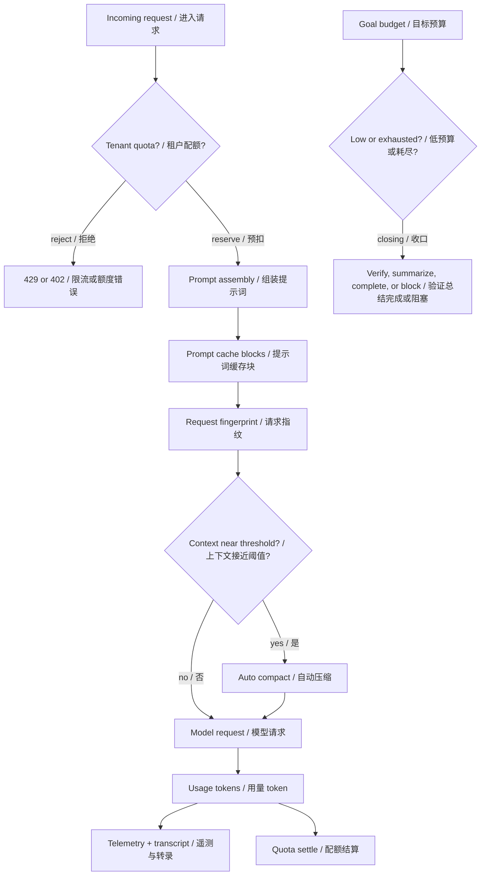
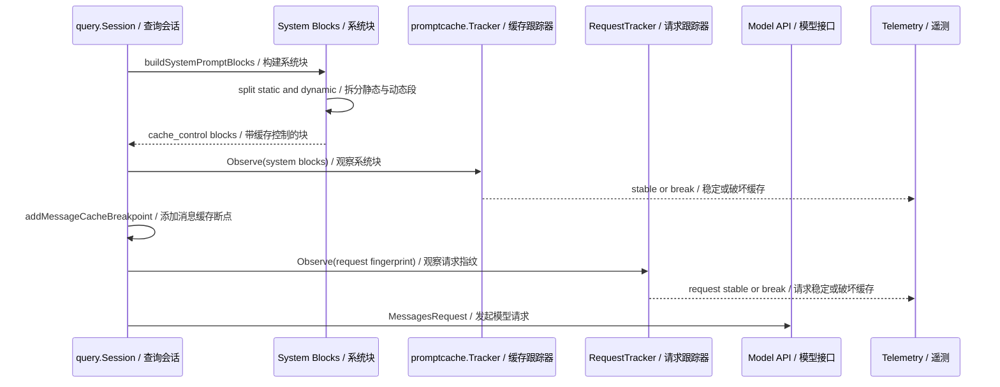
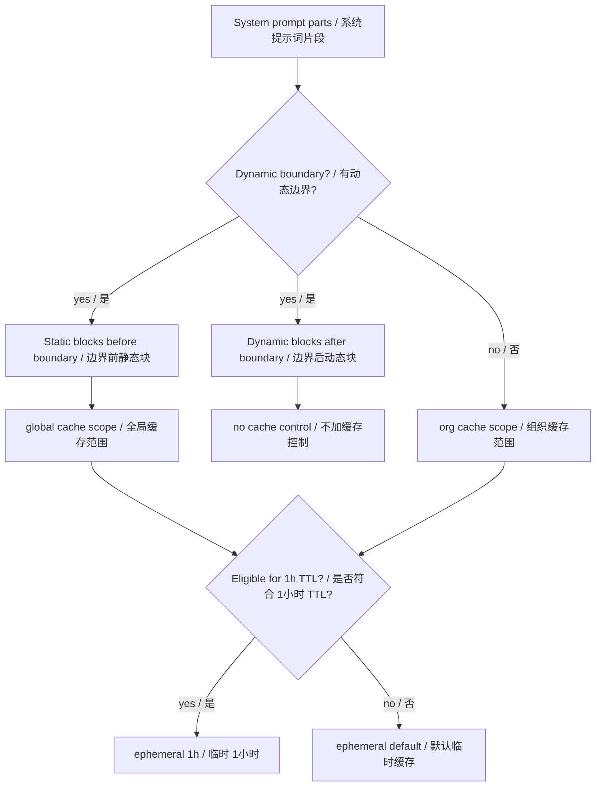
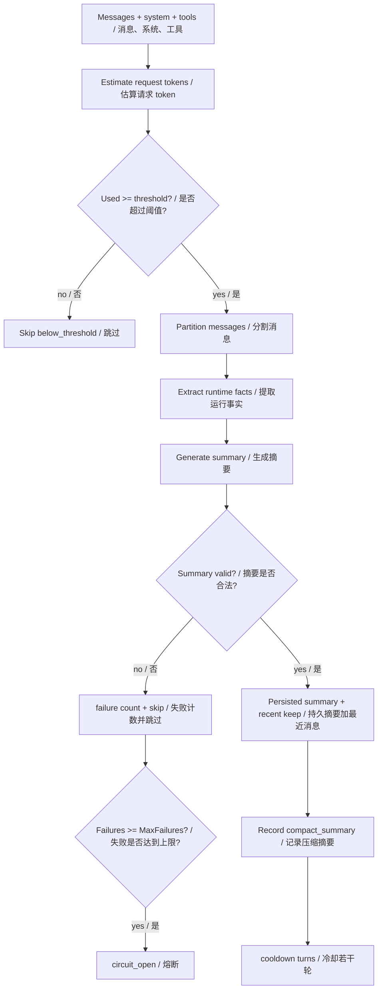
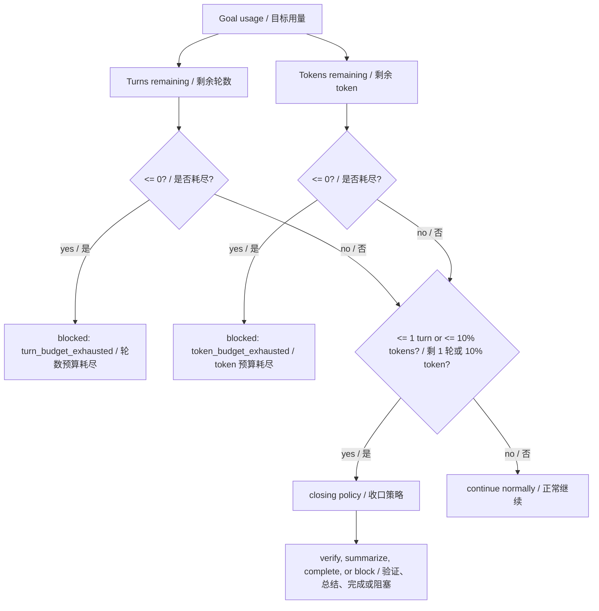
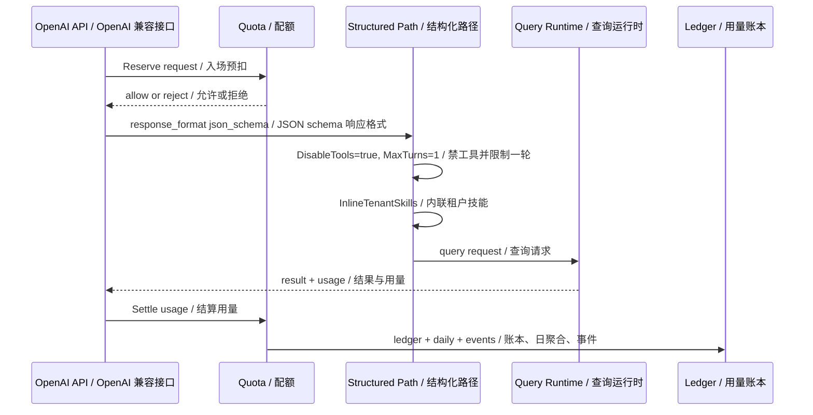

# 第 16 章：资源感知优化 Resource-Aware Optimization

## 书中理论要点

资源感知优化解决的是智能体系统的成本、延迟、上下文容量和配额问题。智能体不是只要“更聪明”就够了，还要知道什么时候缓存、什么时候压缩、什么时候停止扩展任务、什么时候拒绝请求、什么时候把用量记账。

Go Claude 的资源优化不是单点技巧，而是几条控制回路组合：

- prompt cache：稳定 system blocks 和消息 cache breakpoint，减少重复输入成本。
- auto compact：上下文接近阈值时压缩历史，同时保留最近回合和硬事实。
- usage telemetry：记录 input/output/cache tokens、service tier、inference geo、speed。
- Goal budget：长期目标受 turn/token budget 限制，预算低时进入 closing policy。
- structured fast path：JSON schema 场景禁工具、单轮执行、内联 tenant skills，减少不确定 loop。
- tenant quota：请求入场 reserve、完成 settle、ledger/daily/event 统一治理。

## Go Claude 的工程落点

核心源码和文档：

- `internal/promptcache/promptcache.go` 计算 system block 和 request fingerprint，检测 cache break。
- `internal/query/query.go` 的 `buildSystemPromptBlocks`、`splitSystemPromptPrefix`、`addMessageCacheBreakpoint`、`recordUsage`、`observePromptCache`、`observeRequestCache` 负责 prompt cache 和 usage 记录。
- `internal/compact/compactor.go` 实现 auto compact 的阈值、摘要、事实校验、cooldown、failure circuit。
- `internal/compact/config.go` 和 `internal/compact/settings.go` 处理 context length、threshold ratio、recent rounds、summary model 等配置。
- `internal/goal/budget.go` 实现 exhausted 和 closing budget policy。
- `internal/server/server.go` 的 OpenAI structured path 设置 `DisableTools=true`、`MaxTurns=1`、inline tenant skills，并接入 quota reserve/settle。
- `internal/quota/quota.go` 定义租户 quota config、reservation、usage、ledger、daily、event、memory store。
- `docs/tenant/tenant_quota_usage_technical_plan.md` 说明 quota/usage 当前实现状态和数据模型。

## 源码映射表

| 层级 | Go Claude 文件 | 学习重点 |
| --- | --- | --- |
| prompt cache tracker | `internal/promptcache/promptcache.go` | system hash、cache control hash、request fingerprint、cache break |
| system cache blocks | `internal/query/query.go` | static/dynamic boundary、global/org scope、1h TTL、cache control |
| message cache breakpoint | `internal/query/query.go:addMessageCacheBreakpoint` | 在最新消息上设置 cache control |
| usage recording | `internal/query/query.go:recordUsage` | input/output/cache creation/cache read、service tier |
| auto compact | `internal/compact/compactor.go` | threshold、summary、facts、validation、cooldown、circuit |
| compact config | `internal/compact/config.go`、`internal/compact/settings.go` | context tokens、threshold ratio、recent rounds、summary model |
| Goal budget | `internal/goal/budget.go` | exhausted、closing、next action、blocker key |
| structured fast path | `internal/server/server.go` | JSON schema 禁工具、单轮、structured retry |
| tenant quota | `internal/quota/quota.go`、`docs/tenant/tenant_quota_usage_technical_plan.md` | reserve、settle、ledger、daily、quota events |

## 资源控制总览



这张图说明资源优化不是只靠 cache。Go Claude 在请求前、请求中、请求后、长期目标四个位置都做资源控制。

## Prompt cache 稳定性链路



`promptcache.Tracker` 只关心 system blocks 的 text hash 和 cache control hash。`RequestTracker` 更严格，会把 model、system、cache control、tools、前两条 message、thinking config 都纳入 fingerprint。

这解释了两个层次的 cache break：

- system prompt text 或 cache control 变化：system cache break。
- model/tools/message prefix/thinking 变化：request cache-safe signature break。

## System block 分块和缓存范围



`splitSystemPromptPrefix` 会优先把静态段和动态段分开。静态段可以使用 global scope；动态段不加 cache control，避免频繁变化的内容破坏缓存。没有 dynamic boundary 时，默认使用 org scope。

1h TTL 不是默认无条件启用，受环境变量、用户资格和 allowlist 影响。模型级别也可以通过 `DISABLE_PROMPT_CACHING_*` 关闭。

## Auto compact 链路



`Compactor.MaybeCompact` 的关键不是“摘要一下历史”，而是：

- 用 `EstimateRequest` 比较 `ThresholdTokens(model)`。
- 保留最近 `PreserveRecentRounds`。
- 调整切分点，避免 tool_use/tool_result 被拆断。
- 提取 hard facts：文件、命令、工具等。
- 强制摘要包含 `## Current Goal`、`## Open Tasks`、`## Important Raw Facts`。
- 验证摘要必须包含前几个 file/command facts。
- 失败会增加 failure count；达到 `MaxFailures` 后 `circuit_open`。
- 成功后进入 cooldown，避免每轮都压缩。

## Goal budget 收口



`AnalyzeBudget` 把资源约束显式注入 Goal prompt。耗尽时在 turn 前阻塞；接近耗尽时进入 closing policy，要求不要扩展范围，把剩余预算用于验证、简洁总结、完成或明确 blocker。

## Structured fast path 和 quota



结构化 JSON schema 场景更重视响应契约稳定性。`openAIQueryRequest` 在 structured path 中设置：

- `DisableTools=true`：避免工具 loop 干扰结构化输出。
- `MaxTurns=1`：减少多轮不确定性。
- `SkipAutoTitle=true`：减少非必要额外工作。
- `InlineTenantSkills`：把所需租户技能内联进请求。

如果 provider 返回特定结构化 JSON 错误，`runOpenAIQueryWithStructuredRetry` / `runOpenAIStreamQueryWithStructuredRetry` 只允许一次 structured retry，并发出 `openai.structured_retry` telemetry。

Quota 则在 `/query`、`/v1/chat/completions`、mobile stream/regenerate 等入口做资源治理：

- reserve：估算 input、预留 output，检查 QPS、daily token/message、concurrent。
- reject：超限返回 429 或 402，并记录 quota event。
- settle：用真实 usage 修正预扣，写 ledger/daily，释放 concurrent。

## 优先级与冲突处理

| 冲突 | 谁优先 | 为什么 |
| --- | --- | --- |
| prompt cache 想缓存所有 system 内容，但内容频繁变化 | dynamic boundary 优先 | 动态段不加 cache control，避免污染稳定缓存。 |
| 全局缓存与禁用环境变量冲突 | disable env 优先 | `DISABLE_PROMPT_CACHING` 和模型级禁用开关直接关闭。 |
| 1h TTL 与用户资格/allowlist 冲突 | eligibility 优先 | 只有符合条件或 allowlist 命中时才启用 1h。 |
| 上下文超过 compact 阈值，但消息太少 | not_enough_messages 优先 | 太短的上下文不值得压缩。 |
| compact 摘要缺少关键 heading 或 facts | summary validation 优先 | 不接受会丢关键事实的摘要。 |
| compact 连续失败 vs 继续尝试 | circuit_open 优先 | 达到 `MaxFailures` 后跳过，避免重复浪费。 |
| Goal 预算耗尽 vs 继续执行 | budget exhausted 优先 | 在模型 turn 前 blocked。 |
| structured JSON schema vs 工具使用 | structured contract 优先 | 禁工具、单轮，保证响应格式稳定。 |
| quota_enabled=false vs usage 记录 | usage ledger 仍优先 | 不限额也要记录用量。 |
| quota 超限 vs API 请求 | quota reject 优先 | 资源策略比执行请求更硬。 |

## 异常、兜底与恢复

资源优化的失败也必须可控：

- prompt cache break：记录 `prompt.cache.break` 或 `prompt.cache.request_break`，不阻塞请求。
- auto compact disabled/missing streamer/below threshold：返回 skipped reason，不影响主请求。
- summary failed/invalid：增加 failure count，返回错误给 caller，query 层记录 hook/observability 后继续使用原 messages。
- compact circuit open：跳过压缩，避免反复消耗 summary tokens。
- quota reserve rejected：请求不进入模型，返回稳定 quota error。
- quota settle failed：记录 `quota.settle_error`，主响应不被事后结算错误覆盖。
- structured retry：仅针对特定 provider JSON schema 错误，且只重试一次；如果 streaming 已有 partial output，不重试。
- Goal budget closing：不是失败，而是强制收口策略。

## 最佳实践

- 稳定内容放 cache block，动态内容放 dynamic boundary 之后。
- 不要为了 cache 命中牺牲正确性。缓存错误内容比不缓存更糟。
- compact 摘要必须保留硬事实。文件、命令、测试结果比泛泛总结更重要。
- 预算低时不要扩展范围。Goal closing policy 的价值就是阻止最后一轮开新坑。
- structured fast path 适合强响应契约场景，不适合需要大量工具探索的工程任务。
- quota disabled 不等于不记账。只要是 tenant API，usage ledger 仍有审计价值。
- cache read/cache creation 要单独看。高 cache read 说明复用有效，高 cache creation 说明正在写缓存或频繁破坏缓存。
- 资源指标要进 trace 和 telemetry，不能只在终端临时打印。

## 源码阅读路线

1. 读 `internal/promptcache/promptcache.go`，理解 `Tracker` 与 `RequestTracker` 的 hash 维度。
2. 读 `internal/query/query.go:buildSystemPromptBlocks` 和 `splitSystemPromptPrefix`，理解 static/dynamic/cache scope。
3. 读 `internal/query/query.go:addMessageCacheBreakpoint`，看消息 cache control 如何挂到最新消息。
4. 读 `internal/query/query.go:recordUsage`，确认 cache creation/read token 如何写 transcript。
5. 读 `internal/compact/compactor.go:MaybeCompact`，按 skipped、threshold、partition、summary、validate、cooldown 走一遍。
6. 读 `internal/goal/budget.go`，理解 exhausted 和 closing。
7. 读 `internal/server/server.go:openAIQueryRequest`、`reserveQueryQuota`、`settleQueryQuota`。
8. 读 `internal/quota/quota.go` 和 `docs/tenant/tenant_quota_usage_technical_plan.md`。

## 如何验证

静态阅读：

```bash
rg -n "type Tracker|RequestFingerprint|HashBlocks|BreaksCache|RequestTracker" internal/promptcache
rg -n "buildSystemPromptBlocks|splitSystemPromptPrefix|addMessageCacheBreakpoint|recordUsage|observePromptCache|observeRequestCache" internal/query/query.go
rg -n "MaybeCompact|ThresholdTokens|PreserveRecentRounds|MaxFailures|cooldown|validateSummary" internal/compact
rg -n "AnalyzeBudget|closingTokenBudgetDivisor|BudgetPolicy" internal/goal
rg -n "reserveQueryQuota|settleQueryQuota|openAIQueryRequest|DisableTools|openAI.structured_retry" internal/server
```

单元测试：

```bash
go test ./internal/promptcache ./internal/compact -count=1
go test ./internal/query -run 'Cache|Compact|Usage|PromptCache' -count=1
go test ./internal/goal -run 'Budget' -count=1
go test ./internal/quota ./internal/server -run 'Quota|Structured' -count=1
```

文档和 trace：

```bash
rg -n "cache_creation|cache_read|quota|usage ledger|structured fast path|prompt cache" docs internal/server/trace.go
```

## 学习任务

1. 解释 `Tracker` 和 `RequestTracker` 的区别。
2. 找出哪些 system prompt section 应该稳定缓存，哪些应当放在 dynamic boundary 后。
3. 说明为什么 auto compact 要校验 summary 中的 file/command facts。
4. 用 `AnalyzeBudget` 判断一个只剩 1 turn 的 Goal 应该继续开发还是收口。
5. 解释 structured JSON schema 请求为什么要禁工具并限制 `MaxTurns=1`。
6. 比较 quota reserve 和 settle 的职责差异。

## 当前差距

- prompt cache 是 cache-control 和稳定性监控，不等于强制保证 provider 一定命中缓存；实际命中仍要看 provider usage 返回。
- auto compact 依赖 summary model 输出，虽然有 facts 校验，但摘要质量仍需要测试和 trace 观察。
- quota 当前覆盖主要 HTTP/API 入口；后续 goal/background/agent 统一接入还要继续按技术计划推进。
- tenant quota 的 Redis fail-open/fail-closed 策略仍在后续增强范围，当前未配置 Redis 时适合本地单实例开发。

## 本章自审

| 检查项 | 结果 |
| --- | --- |
| 引用了真实源码路径 | 已覆盖 `internal/promptcache`、`internal/query`、`internal/compact`、`internal/goal`、`internal/server`、`internal/quota`、`docs/tenant`。 |
| 至少 3 张图 | 已包含资源总览、prompt cache 时序、system block 分块、auto compact、Goal budget、structured/quota 时序。 |
| 写清楚顺序和优先级 | 已说明 cache、compact、budget、structured fast path、quota 的执行和裁决顺序。 |
| 写清楚冲突处理 | 已覆盖动态内容 vs cache、compact validation、budget exhausted、structured vs tools、quota reject。 |
| 写清楚异常和兜底 | 已说明 cache break、compact skipped/circuit、quota reject/settle error、structured retry、budget closing。 |
| 有验证命令 | 已提供 `rg`、`go test`、trace 文档检索命令。 |
