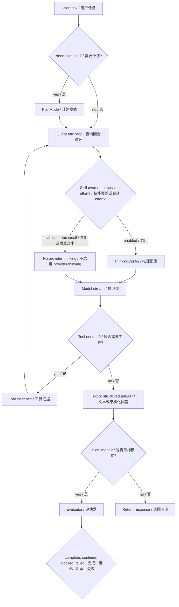
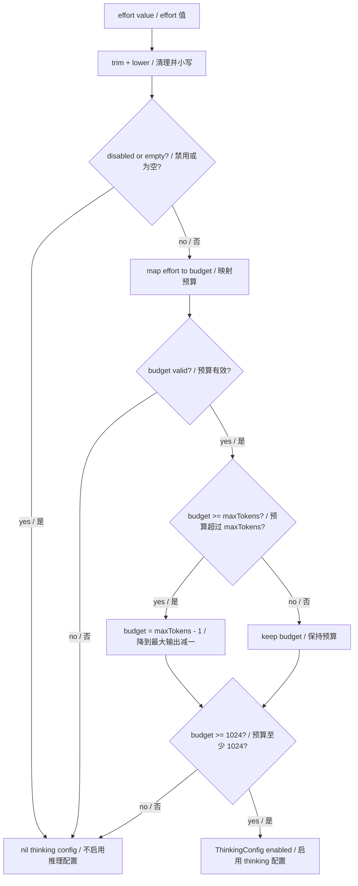
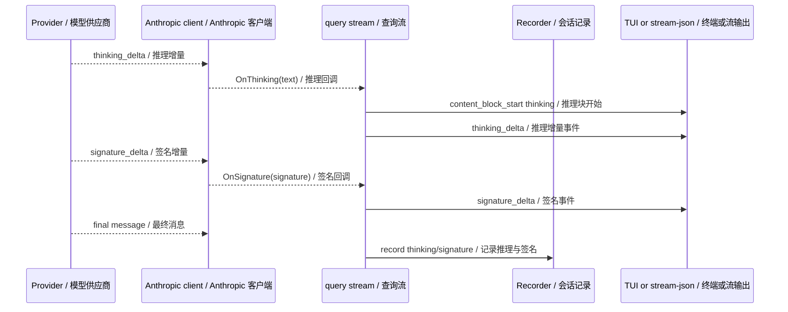
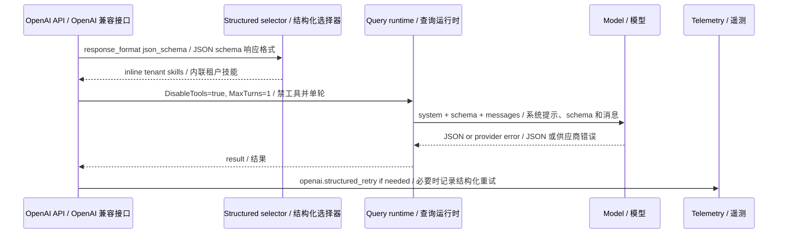
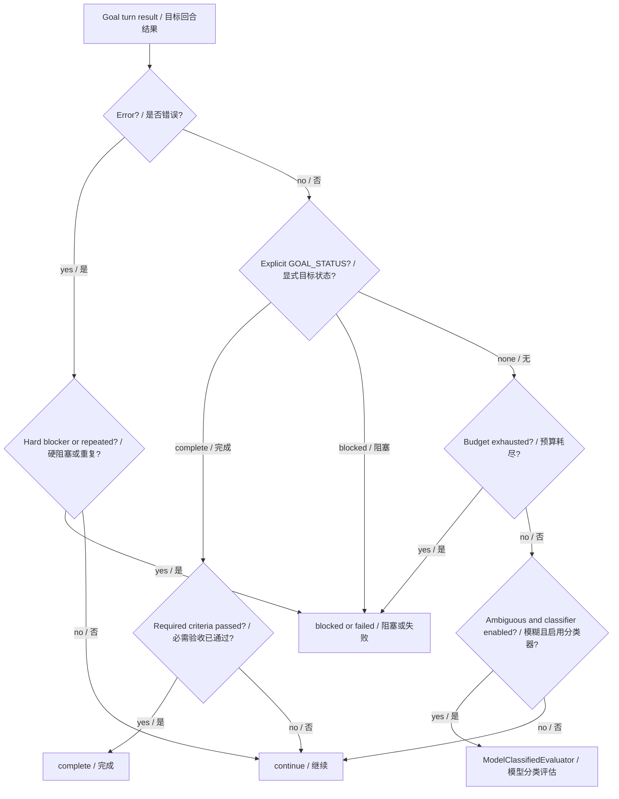
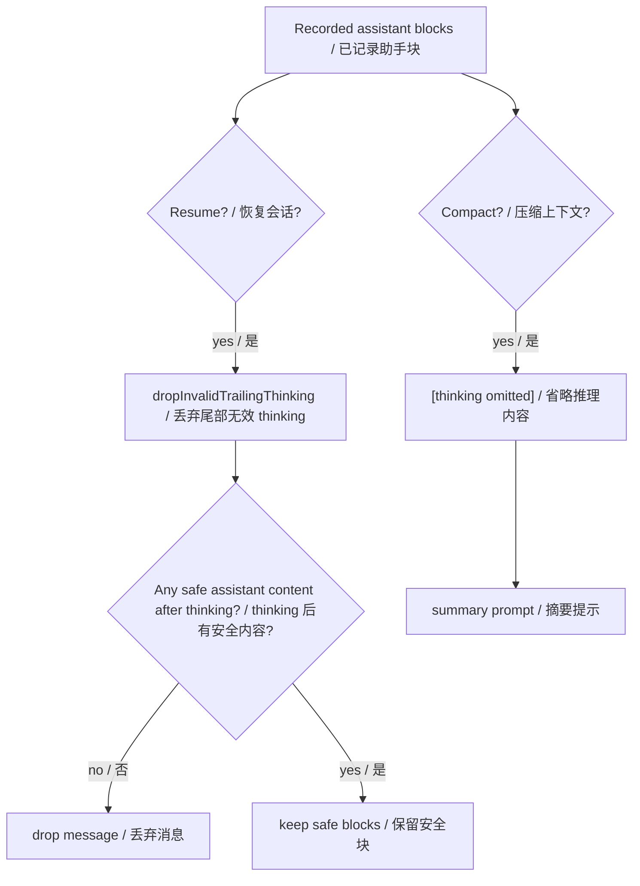
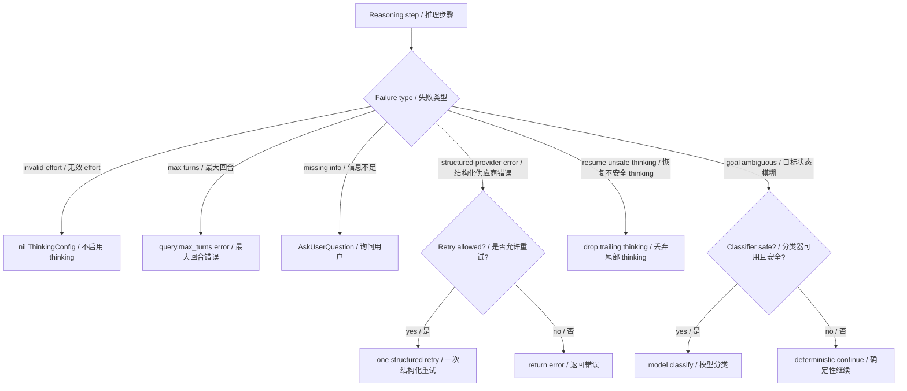

# 第 17 章：推理技术 Reasoning Techniques

## 书中理论要点

推理技术不是让模型“多想一会”这么简单。工程里的推理技术要解决的是：什么时候需要显式规划、什么时候需要隐藏或摘要化 thinking、什么时候用结构化输出约束结论、什么时候向用户提问、什么时候由 Goal evaluator 判定继续/完成/阻塞，以及推理结果和工具证据冲突时谁说了算。

常见推理技术包括：

- 分解：把复杂任务拆成步骤、子任务、验收标准。
- 显式计划：先形成 plan，再执行。
- 结构化推理：用 JSON schema 或协议行收敛输出。
- 反思与评估：用 evaluator 或证据判断任务是否真的完成。
- 不确定性处理：信息不足时问用户，不凭空猜。
- 资源约束推理：预算、max turns、上下文长度不允许无限循环。

Go Claude 的推理控制面由几类机制组合：session/skill/sub-agent effort、Anthropic thinking config、stream thinking/signature 事件、thinking 展示开关、PlanMode、AskUserQuestion、structured JSON fast path、Goal evaluator、coordinator allowlist、max turns、resume thinking 过滤和 compact thinking 省略。

## Go Claude 的工程落点

核心入口：

- `internal/anthropic/thinking.go`
- `internal/anthropic/client.go`
- `internal/query/query.go`
- `internal/agentruntime/runtime.go`
- `internal/tools/planmode/planmode.go`
- `internal/tools/askuserquestion/askuserquestion.go`
- `internal/goal/evaluator.go`
- `internal/goal/runner.go`
- `internal/server/server.go`
- `internal/compact/compactor.go`
- `docs/testing/agent_eval_harness.md`
- `docs/goal_mode/goal_mode_design.md`
- `docs/prompt_logic/code_and_chat_prompt_modes.md`

## 源码映射表

| 层级 | Go Claude 文件 | 学习重点 |
| --- | --- | --- |
| thinking config | `internal/anthropic/thinking.go` | `effort -> budget_tokens`，低于 1024 或 disabled 时不启用 thinking。 |
| provider stream | `internal/anthropic/client.go` | 解析 `thinking_delta`、`signature_delta`、content block。 |
| query stream | `internal/query/query.go` | 输出 thinking/signature stream-json，记录 assistant thinking，构建模型请求。 |
| session/skill effort | `internal/query/query.go:Options.Effort`、`currentThinkingConfig` | active skill 的显式 effort 优先；没有 skill override 时使用 session effort。 |
| sub-agent effort | `internal/agentruntime/runtime.go` | agent frontmatter `effort` 进入 sub-agent thinking config 和 metadata。 |
| PlanMode | `internal/tools/planmode/planmode.go` | 保存 `.claude/plan_mode.json`，先计划、用户接受后退出。 |
| AskUserQuestion | `internal/tools/askuserquestion/askuserquestion.go` | 交互模式通过 callback 返回用户答案；未回答或非交互模式用 `IsError=true` 停下来等待输入。 |
| structured output | `internal/server/server.go` | `response_format=json_schema` 时禁工具、单轮、追加 JSON schema prompt、最多重试一次。 |
| Goal evaluator | `internal/goal/evaluator.go`、`internal/goal/runner.go` | deterministic/model/evidence evaluator 判断 continue/complete/blocked/failed。 |
| resume safety | `internal/query/resume.go:dropInvalidTrailingThinking` | resume 时丢弃尾部孤儿 thinking，避免 provider API 约束错误。 |
| compact safety | `internal/compact/compactor.go` | compact prompt 中把 thinking/redacted_thinking 写成 `[thinking omitted]`。 |

## 推理控制总览



这张图说明：thinking 只是推理控制的一部分。真正可靠的推理系统还需要 plan、tool evidence、结构化输出、evaluator 和停止条件。

## Thinking Effort 映射

`ThinkingConfigFromEffort(effort, maxTokens)` 把 session、skill 或 agent 的 `effort` 映射为 provider thinking config：

| effort | budget_tokens |
| --- | --- |
| `low` | 1024 |
| `medium` / `normal` / `default` | 2048 |
| `high` | 4096 |
| `max` / `maximum` | 8192 |
| 数字字符串 | 该数字，低于 1024 时提升到 1024 |
| 空、`inherit`、`none`、`off`、`disabled` | 不启用 thinking |

如果 `budget_tokens >= maxTokens`，会降到 `maxTokens - 1`；如果最终低于 1024，则不启用 thinking。



关键点：

- main query 先看 active skill 的显式 `effort`；skill 为空或 `inherit` 时回退到 session `Options.Effort`，skill 显式 `off` 则覆盖并关闭 session thinking。
- CLI session effort 按 `GOLANG_CLAUDE_CODE_EFFORT`、`CLAUDE_CODE_EFFORT`、settings `effort` 的顺序解析。
- sub-agent 的 thinking config 来自 agent frontmatter `effort`。
- OpenAI-compatible structured path 不注入非标准 thinking 字段；thinking 映射主要面向 Anthropic provider。
- thinking config 会进入 request cache fingerprint，effort 变化可能导致 cache-safe signature 变化。

## Thinking Stream 与签名

provider 返回 thinking 时，Go Claude 会把它转换为 stream-json 事件，并处理 thinking block 的开始、delta、signature 和结束。



这里要区分三件事：

- thinking stream 是模型的内部推理输出或摘要，不等于最终答案。
- signature 是 provider 侧的长尾兼容字段，resume 时必须谨慎处理。
- `tui.showThinking` 和 `webAgentUI.showThinking` 只控制各自 UI 的渲染，不改变 provider thinking 请求，也不删除 transcript、Trace 或 SSE 数据；两者默认均为 `true`。
- usage transcript 会单独记录 provider 返回的 `reasoning_output_tokens`，用于成本和诊断；它不能反推出 thinking 正文。

## PlanMode 与 AskUserQuestion

推理不能只靠模型内部思考。需要显式计划时，`EnterPlanMode` 会把草案计划保存到 `.claude/plan_mode.json`，并要求“未被接受前不改项目文件”；`ExitPlanMode` 只有在 `accepted=true` 时才关闭计划模式。

信息不足时，`AskUserQuestion` 会优先调用 `tools.Context.UserQuestion`。交互模式中用户作答后，工具正常返回 `User answered: ...`，模型可以在同一 query 中继续；没有 callback、用户取消或答案为空时，才返回 `IsError=true` 和 `User input required: ...`，让非交互调用显式停下来。

```mermaid
flowchart TD
  A["Task ambiguity / 任务不明确"] --> B{"Can infer safely? / 能安全推断?"}
  B -- "yes / 是" --> C["Continue with stated assumption / 带假设继续"]
  B -- "no / 否" --> D["AskUserQuestion / 询问用户"]
  D --> E{"Interactive answer? / 是否获得交互回答?"}
  E -- "yes / 是" --> F["normal tool_result and continue / 正常工具结果并继续"]
  E -- "no / 否" --> M["tool_result is_error and wait / 错误结果并等待输入"]
  A --> G{"Large change? / 大改动?"}
  G -- "yes / 是" --> H["EnterPlanMode / 进入计划模式"]
  H --> I["Save plan_mode.json / 保存计划状态"]
  I --> J{"User accepted? / 用户接受?"}
  J -- "yes / 是" --> K["ExitPlanMode / 退出计划模式"]
  J -- "no / 否" --> L["Remain in plan mode / 留在计划模式"]
```



这部分体现一个重要原则：好的推理系统不是一直自动继续，而是在信息不足、风险高或需要用户确认时停下来。

## 结构化推理与 JSON Schema

OpenAI-compatible `/v1/chat/completions` 遇到 `response_format.type=json_schema` 时，Go Claude 会进入结构化 fast path：

- 追加 JSON schema 输出约束到 system prompt。
- `PromptMode=chat`，避免加载本地代码上下文。
- `DisableTools=true`，避免工具 loop 干扰结构化输出。
- `MaxTurns=1`，让响应契约稳定。
- `SkipAutoTitle=true`，减少无关工作。
- 选择并内联 tenant skills。
- provider 返回特定 structured JSON 错误时，只重试一次。
- streaming 已有 partial output 时，不做 structured retry。



结构化推理适合上层业务系统，例如 AI Study 这类需要稳定 JSON 决策的调用。它不适合需要大量工具探索、文件修改或多轮纠错的工程任务。

## Goal Evaluator 推理

Goal Mode 的推理不是靠模型自己说“我完成了”就结束。`internal/goal/evaluator.go` 提供三层判断：

- `DeterministicEvaluator`：优先处理 error、permission denied、预算耗尽、显式 `GOAL_STATUS`。
- `ModelClassifiedEvaluator`：只在 ambiguous continue、无错误、未进入 closing budget 时调用模型分类。
- `EvidenceEvaluator`：有结构化 plan/evidence 时，required acceptance criteria 没过就不能 complete。



这个设计把“模型推理”降级为可控的一环：先看硬证据、预算、验收标准，再在模糊场景才让模型分类。

## Resume 与 Compact 中的 Thinking 安全

thinking 内容在运行时有价值，但在恢复和压缩时必须谨慎：

- `recordAssistant` 会记录 `thinking` / `redacted_thinking` 及 signature。
- resume 重建消息时，`dropInvalidTrailingThinking` 会删除 assistant 消息末尾的孤儿 thinking block。
- 如果一个 assistant message 只剩 thinking，整个 message 会被丢弃。
- compact prompt 里，`thinking` / `redacted_thinking` 被格式化为 `[thinking omitted]`。



这是兼容性和安全边界：不能为了恢复上下文把不完整 thinking signature 重新塞给 provider，也不能把完整内部推理长期注入 compact prompt。

## 优先级与冲突处理

| 冲突 | 谁优先 | 为什么 |
| --- | --- | --- |
| thinking 与最终文本答案冲突 | 最终答案 + 工具证据优先 | thinking 是过程或摘要，不是用户可执行结论。 |
| thinking 与 tool result 冲突 | tool result 优先 | 文件、测试、API 返回等外部证据比模型内推理更硬。 |
| active skill effort 与 session effort | skill 的显式值优先 | skill `inherit`/空值回退 session effort；skill `off` 显式关闭。 |
| agent effort 与 sub-agent runtime | agent effort 生效 | sub-agent 有独立 runtime 和 metadata。 |
| JSON schema 结构化输出与工具使用 | JSON schema contract 优先 | structured fast path 禁工具、单轮，优先保证契约。 |
| 结构化重试与 streaming partial output | partial output 优先，不重试 | 已输出内容时重试会破坏流式契约。 |
| Goal complete 声明与 required criteria 未通过 | required criteria 优先 | 不能靠一句 complete 越过验收证据。 |
| 模型分类与 deterministic hard blocker | deterministic hard blocker 优先 | 权限、预算、上下文取消等硬信号不交给模型猜。 |
| resume 想保留 thinking 与 provider API 约束 | API-valid resume 优先 | 尾部孤儿 thinking 会被过滤。 |
| 用户明确要求先计划 | PlanMode 优先 | 未接受计划前不应直接改项目文件。 |

## 异常、兜底与恢复



关键兜底：

- effort 为空、disabled 或预算无效时，不启用 thinking，而不是构造错误 provider 请求。
- max turns 达到后返回 `max turns reached`，不无限循环。
- AskUserQuestion 在交互回答后正常继续；未回答时才用工具错误结果表达“需要用户输入”，避免模型继续猜。
- structured retry 只针对指定 provider JSON schema 错误，且只重试一次。
- streaming 已有 partial output 时不重试。
- ModelClassifiedEvaluator 解析失败或 classifier 错误时回退 deterministic evaluator。
- compact 时 thinking 被省略，不进入摘要 prompt。
- resume 时尾部孤儿 thinking 被过滤，避免 API 400。

## 最佳实践

- 不要把 thinking 当作最终答案。最终结论必须能被工具结果、测试、文档或用户确认支撑。
- 对强格式业务接口优先使用 JSON schema fast path，而不是要求模型“尽量输出 JSON”。
- 高风险工程改动先 PlanMode，再执行；信息不足用 AskUserQuestion。
- Goal completion 必须绑定 acceptance criteria 和 evidence，不能只看模型自报。
- effort 要克制使用。高 effort 增加推理预算，也可能改变 cache-safe signature 和成本。
- resume/compact 不应长期传播完整 thinking；保留可恢复、可验证的事实更重要。
- 推理失败要可观测：看 stream events、transcript、goal events、telemetry 和 eval，而不是只看最终文本。

## 源码阅读路线

1. 读 `internal/anthropic/thinking.go:ThinkingConfigFromEffort`，理解 effort 到 budget 的转换。
2. 读 `internal/query/query.go` 的 `onThinking`、`onSignature`，确认 stream-json 如何表达 thinking。
3. 读 `internal/query/query.go:Options.Effort`、`currentThinkingConfig` 和 `internal/agentruntime/runtime.go` 的 thinking config 构建。
4. 读 `internal/tools/planmode/planmode.go` 和 `internal/tools/askuserquestion/askuserquestion.go`。
5. 读 `internal/server/server.go:openAIQueryRequest`、`openAIResponseFormatPrompt`、`runOpenAIQueryWithStructuredRetry`。
6. 读 `internal/goal/evaluator.go` 和 `internal/goal/runner.go:evaluateTurn`。
7. 读 `internal/query/resume.go:dropInvalidTrailingThinking` 和 `internal/compact/compactor.go:formatBlockForPrompt`。

## 如何验证

```bash
go test ./internal/anthropic -run 'Thinking|Stream' -count=1
go test ./internal/query -run 'Thinking|Signature|Effort|CoordinatorMode|OverrideSystemPrompt' -count=1
go test ./internal/agentruntime -run 'Effort|Thinking|IsolatedToolLoop' -count=1
go test ./internal/tools/planmode ./internal/tools/askuserquestion -count=1
go test ./internal/goal -run 'Evaluator|Evidence|ModelClassified' -count=1
go test ./internal/server -run 'Structured|OpenAI|GoalRunEndpointSupportsModelEvaluator' -count=1
```

源码搜索：

```bash
rg -n "ThinkingConfigFromEffort|thinking_delta|signature_delta|currentThinkingConfig|dropInvalidTrailingThinking" internal
rg -n "EnterPlanMode|ExitPlanMode|AskUserQuestion|openAIResponseFormatPrompt|structured_retry|EvidenceEvaluator|ModelClassifiedEvaluator" internal docs
```

运行时观察：

- 分别用 settings/session `effort`、带 `effort: high` 的 skill 和 sub-agent，确认 session fallback 与 skill override。
- 用 `--include-stream-events` 或 stream-json，观察 `thinking_delta`、`signature_delta`。
- 用 `/v1/chat/completions` 的 `response_format.type=json_schema`，确认 `DisableTools=true`、`MaxTurns=1` 的测试覆盖。
- 在 Goal Mode 中设置 required criteria，确认 criteria 未通过时不会 complete。

## 学习任务

- 为什么 thinking 不能作为最终事实来源？
- 为什么 structured JSON schema 场景要禁工具和单轮？
- PlanMode 和普通“先想一想”的区别是什么？
- AskUserQuestion 为什么用 `IsError=true` 反而是正确语义？
- Goal evaluator 为什么先 deterministic，再 model-classified？
- resume 为什么要删除尾部孤儿 thinking？
- compact 为什么不应该把完整 thinking 放进摘要 prompt？

## 当前差距

Go Claude 已实现 session/skill/sub-agent effort 到 thinking config、thinking/signature stream、reasoning token usage、可配置 thinking 展示、PlanMode、交互式 AskUserQuestion、structured JSON fast path、Goal deterministic/model/evidence evaluator、resume thinking 过滤和 compact thinking 省略。当前差距是：没有公开复刻上游 proprietary thinking signature 的完整校验链路；OpenAI-compatible provider 不注入非标准 thinking 字段；没有通用多步 reasoning graph 可视化；没有独立的 chain-of-thought 质量评测集；模型分类 evaluator 只在受控 Goal 场景使用，不是所有任务的自动裁判。

## 本章自审

| 检查项 | 结果 |
| --- | --- |
| 引用真实源码 | 已覆盖 `anthropic`、`query`、`agentruntime`、`planmode`、`askuserquestion`、`goal`、`server`、`compact` 和相关 docs。 |
| 至少 3 张图 | 已包含推理控制总览、effort 映射、thinking stream、PlanMode/AskUserQuestion、structured fast path、Goal evaluator、resume/compact、异常兜底图。 |
| 图中英文后有中文 | Mermaid 节点、参与者和关键边均使用 `English / 中文`。 |
| 优先级 | 已说明 tool evidence、JSON schema、criteria、deterministic blocker、API-valid resume、PlanMode 的优先级。 |
| 冲突处理 | 已覆盖 thinking 与答案/工具冲突、structured 与工具冲突、Goal complete 与验收冲突、resume thinking 冲突。 |
| 异常与兜底 | 已覆盖 invalid effort、max turns、AskUserQuestion、structured retry、classifier fallback、compact/resume thinking 处理。 |
| 最佳实践 | 已给出 thinking 事实边界、schema fast path、PlanMode、Goal evidence、effort 成本和观测建议。 |
| 验证命令 | 已提供 anthropic/query/agentruntime/tools/goal/server 聚焦测试、源码搜索和运行时观察。 |
| 当前差距 | 已明确 thinking signature、OpenAI-compatible thinking、reasoning graph 和推理评测集差距。 |
