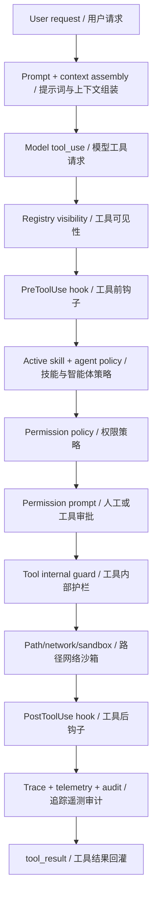
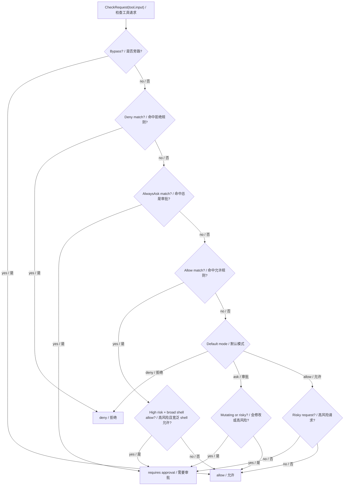
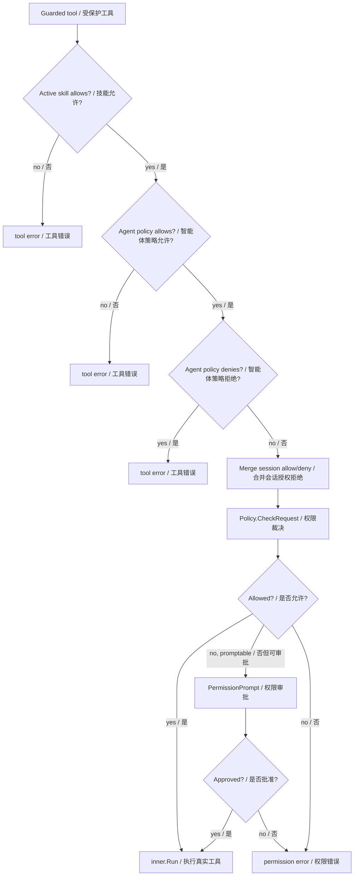
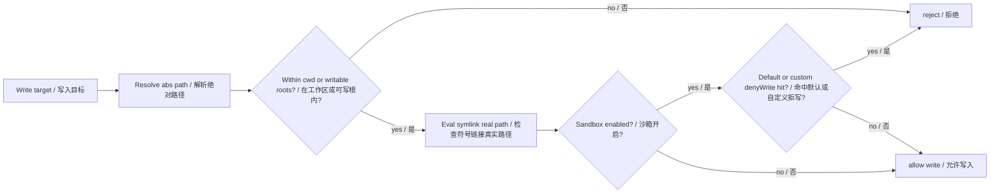
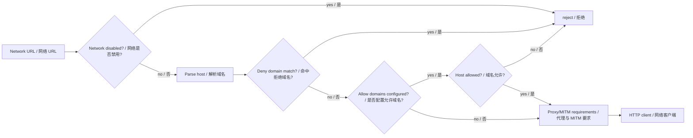
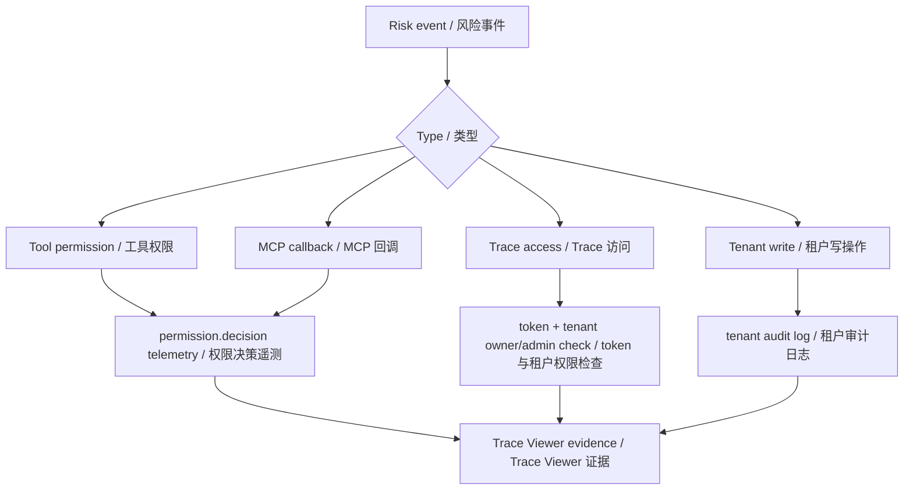
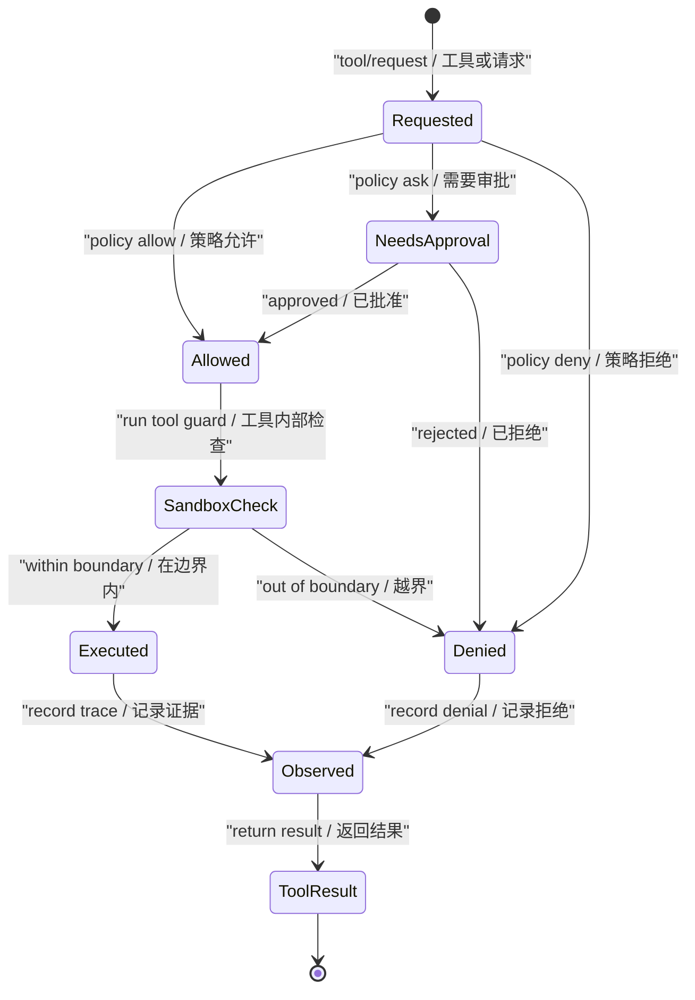

# 第 18 章：安全护栏 Guardrails / Safety

## 书中理论要点

安全护栏的目标不是让模型“尽量安全”，而是把高风险行为放进可执行、可审计、可恢复的边界里。智能体会调用工具、读写文件、访问网络、连接远端 MCP server、处理租户数据；如果只靠 prompt 提醒，任何一次模型误判、prompt injection 或工具输入污染都可能变成真实副作用。

在 Go Claude 里，护栏分成四类：

- 能力护栏：哪些工具能被看见、哪些工具能被调用。
- 权限护栏：某次工具请求是否允许、拒绝或需要审批。
- 环境护栏：写路径、网络访问、shell sandbox、敏感配置文件保护。
- 观测护栏：权限决策、工具执行、tenant trace、audit/telemetry 必须留证据且不泄露敏感正文。

## Go Claude 的工程落点

Go Claude 的安全机制不是一个单独 middleware，而是贯穿 tool loop、server、tenant、trace 的多层组合：

- `internal/permissions/policy.go` 定义 allow、deny、alwaysAsk、default mode、bypass、风险分类。
- `internal/tools/guarded.go` 在每个受保护工具执行前应用 active skill、agent policy、session allow/deny 和 permission prompt。
- `internal/tools/path.go` 限制写入路径，并在 sandbox 开启时默认拒绝写 `.claude/settings.json`、`.claude/skills`、`.git/hooks`、`.git/config` 等敏感位置。
- `internal/tools/network.go` 控制网络禁用、allow/deny domain、proxy、MITM CA。
- `internal/query/query.go:runTool` 在工具执行前后运行 hooks，并记录 tool trace、permission decision、telemetry。
- `internal/mcp/tool.go:mcpServerCallbackHandler` 把 MCP callback 也纳入 permission prompt。
- `docs/observability/trace_viewer.md` 说明 Trace Viewer 的鉴权、tenant owner/admin 权限和敏感信息脱敏边界。

## 源码映射表

| 层级 | Go Claude 文件 | 学习重点 |
| --- | --- | --- |
| 权限策略 | `internal/permissions/policy.go` | deny 优先、alwaysAsk、allow、default ask/deny/allow、风险分类 |
| 工具守卫 | `internal/tools/guarded.go` | active skill、agent policy、session permission、permission prompt |
| 路径沙箱 | `internal/tools/path.go` | workspace 写边界、symlink 真实路径检查、默认敏感路径 deny |
| 网络沙箱 | `internal/tools/network.go` | network disabled、allow/deny domains、proxy、MITM CA |
| 工具 hook | `internal/query/query.go:runTool` | `PreToolUse`、`PostToolUse`、`PostToolUseFailure` |
| MCP callback | `internal/mcp/tool.go` | 远端 callback 进入 permission prompt |
| 租户与 trace | `internal/server`、`docs/observability/trace_viewer.md` | tenant/user 隔离、trace token 鉴权、敏感字段脱敏 |
| 测试 | `internal/permissions/policy_test.go`、`internal/tools/*_test.go`、`internal/query/query_test.go` | 权限、路径、网络、审计、审批持久化 |

## 安全分层架构



这张图的重点是顺序：模型请求工具只是中间步骤，真正的执行要穿过多层硬边界。安全策略不应该写在 prompt 里等待模型自觉遵守，而应该落在运行时和工具边界里。

## 权限裁决顺序

`permissions.Policy.CheckRequest` 的核心顺序是：

1. `Bypass`：显式旁路时直接允许。
2. `Deny`：命中 deny 直接拒绝。
3. `AlwaysAsk`：命中 alwaysAsk 进入审批。
4. `Allow`：命中 allow 后仍要检查请求风险；高风险 shell + 宽泛 allow 仍要求审批。
5. `DefaultMode=deny`：未允许则拒绝。
6. `DefaultMode=ask`：mutating tool 或高风险请求要求审批。
7. 默认 allow：低风险允许，但高风险请求仍要求审批。



这个顺序回答了读者最容易漏掉的问题：allow 不是绝对通行证。宽泛 allow 命中危险 shell 命令时仍可能被升级为审批。

## 工具守卫与策略冲突

`guardedTool.Run` 在 permission policy 前还有两层收窄：

- active skill `AllowedTools`：当前激活 skill 只能调用它声明允许的工具。
- agent policy `AllowedTools` / `DeniedTools`：子智能体可进一步限制工具集合和 permission mode。

| 冲突 | 谁优先 | 为什么 |
| --- | --- | --- |
| skill prompt 要求使用未授权工具 | active skill allowlist | skill 的能力边界必须比文字指令更硬。 |
| agent allowlist 包含工具，但 denylist 也包含 | denylist | deny 是更保守的安全裁决。 |
| session allow 与 settings deny 冲突 | deny 先检查 | 防止一次会话授权覆盖长期拒绝规则。 |
| allow 命中但命令高风险 | risk classifier | 宽泛 allow 不能自动授权危险 shell。 |
| permission prompt 允许但 destination 为空或 once | 只本次有效 | 不持久化到 session/project/global/local。 |
| permission prompt 允许且 destination 为 session/project/global/local | 写入对应规则 | `applyPermissionUpdate` 持久化或更新会话规则。 |



## 路径和网络沙箱

文件写入和网络访问不能只靠“工具调用前审批”。即使用户批准了某个写工具，工具内部仍要检查目标路径是否在 workspace 或可写根目录内，是否命中 sandbox denyWrite。





路径沙箱和网络沙箱的价值在于：权限审批是“是否可以尝试”，工具内部护栏是“即使尝试也不能越界”。

## Hook、MCP 和观测护栏

Go Claude 还把治理放在 hook 和观测层：

- `PreToolUse` 可以在工具执行前拒绝或改写输入。
- `PostToolUse` 和 `PostToolUseFailure` 可以在执行后做校验，必要时把成功结果转为错误。
- MCP server callback 不直接执行，必须进入 `PermissionPromptRequest{Source:"mcp_callback"}`。
- `recordPermission` 记录 `permission.decision` telemetry，包含 allowed、reason、rule、request、source。
- Trace Viewer 需要 token 鉴权；tenant trace 仍按 tenant/user 权限读取；telemetry properties 不展示 API key、JWT、完整 prompt、附件私有 URL 等敏感字段。



## 异常、兜底与恢复

安全护栏的失败路径应该可解释：

- 工具被拒绝：返回 `Result{IsError:true}`，作为 `tool_result` 回灌给模型。
- 审批被拒绝：记录 permission decision，工具不执行。
- 审批持久化失败：返回错误，不静默放行。
- 写路径越界：工具返回错误，不写入。
- 网络被禁或域名不允许：网络工具返回错误，不请求。
- hook 失败或拒绝：工具不执行或结果转为错误。
- trace 访问未鉴权：Trace API 拒绝访问，不泄露本地或 tenant session。



## 最佳实践

- 安全规则要落在 runtime 和工具里，不要只写进 prompt。
- deny 优先于 allow，宽泛 allow 必须接受风险分类升级审批。
- mutating tool 默认按高风险看待，MCP tool 也一样。
- 写文件前同时检查逻辑路径和真实路径，避免 symlink 绕过。
- 网络访问要同时支持禁用、allowlist、denylist、proxy 和证书要求。
- trace 和 telemetry 只记录排查必需的 metadata，不记录密钥、JWT、完整正文、附件私有 URL。
- 对租户数据的读写要始终带 tenant/user 上下文，并在关键写操作上记录 audit。

## 源码阅读路线

1. 读 `internal/permissions/policy.go:CheckRequest`，画出 deny、alwaysAsk、allow、default mode 的顺序。
2. 读 `ClassifyRequestRisk` 和 `IsMutatingTool`，理解危险 shell、敏感路径、MCP 工具为什么要审批。
3. 读 `internal/tools/guarded.go`，确认 active skill、agent policy 和 permission prompt 的顺序。
4. 读 `internal/tools/path.go`，重点看 `EnsureWritablePathWithSandbox` 和默认 denyWrite。
5. 读 `internal/tools/network.go`，重点看 `CheckNetworkURL` 和 `NetworkHTTPTransport`。
6. 读 `internal/query/query.go:runTool` 和 `recordPermission`，确认 hook 和 telemetry 记录点。
7. 读 `docs/observability/trace_viewer.md` 的安全边界，理解 trace 访问和脱敏。

## 如何验证

静态阅读：

```bash
rg -n "CheckRequest|AlwaysAsk|ClassifyRequestRisk|IsMutatingTool|NormalizeMode" internal/permissions
rg -n "EnsureWritablePathWithSandbox|defaultSandboxDenyWritePaths|CheckNetworkURL|NetworkHTTPTransport" internal/tools
rg -n "PermissionAudit|recordPermission|PreToolUse|PostToolUse|mcp_callback" internal/query internal/mcp
```

单元测试：

```bash
go test ./internal/permissions -count=1
go test ./internal/tools -run 'Writable|Network|Guard|Permission|Sandbox' -count=1
go test ./internal/query -run 'Permission|Hook|Tool' -count=1
go test ./internal/mcp -run 'Permission|Callback' -count=1
```

安全观测：

```bash
go run ./cmd/golang-cc eval agents --json
```

重点看 `permission`、`tool`、`trace` case 的 evidence，确认拒绝结果、工具结果和 telemetry 事件都能被观察到。

## 学习任务

1. 写出 `Deny`、`AlwaysAsk`、`Allow` 同时存在时的裁决顺序。
2. 构造一个 `Bash:*` allow 规则，再用高风险命令验证是否仍需要审批。
3. 尝试写 `.git/config` 或 `.claude/settings.json`，确认 sandbox 开启时会被 denyWrite 拦截。
4. 配置 network deny domain，验证 `WebFetch` 不会发出请求。
5. 查看一次 permission denied 的 transcript 或 telemetry，确认 reason/rule/request/source 是否可查。

## 当前差距

- `docs/compatibility_deep_review.md` 里仍标注 sandbox 与原版 Claude Code 的完全等价还有差距，例如 Windows Job Object/AppContainer、WSL 特化和更多 OS 级阻断样例仍需继续补齐。
- 当前权限风险分类主要是本地规则和测试覆盖，不等于所有真实生产副作用都可自动识别；高风险外部 MCP server 仍需要 server 侧权限模型配合。
- Trace Viewer 已有鉴权和脱敏说明，但如果未来 telemetry 增加新字段，必须继续保证敏感正文和密钥不进入 properties。

## 本章自审

| 检查项 | 结果 |
| --- | --- |
| 引用了真实源码路径 | 已覆盖 permissions、guarded tools、path/network sandbox、query hooks、MCP callback、Trace Viewer。 |
| 至少 3 张图 | 已包含安全分层、权限裁决、工具守卫、路径沙箱、网络沙箱、观测护栏、状态机。 |
| 写清楚顺序和优先级 | 已明确 CheckRequest 顺序和工具守卫顺序。 |
| 写清楚冲突处理 | 已覆盖 deny/allow、skill/agent、session/settings、宽泛 allow/高风险冲突。 |
| 写清楚异常和兜底 | 已说明拒绝、审批失败、路径越界、网络拒绝、hook 失败、trace 未鉴权。 |
| 有验证命令 | 已提供 `rg`、`go test`、`eval agents`。 |
