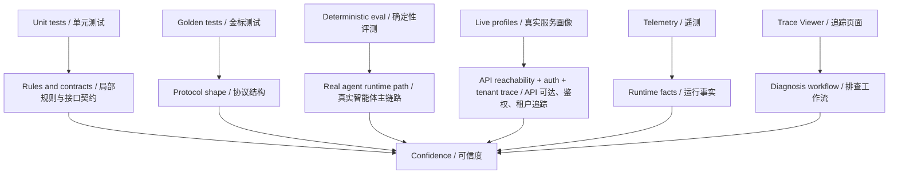
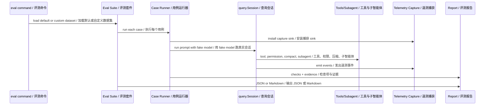
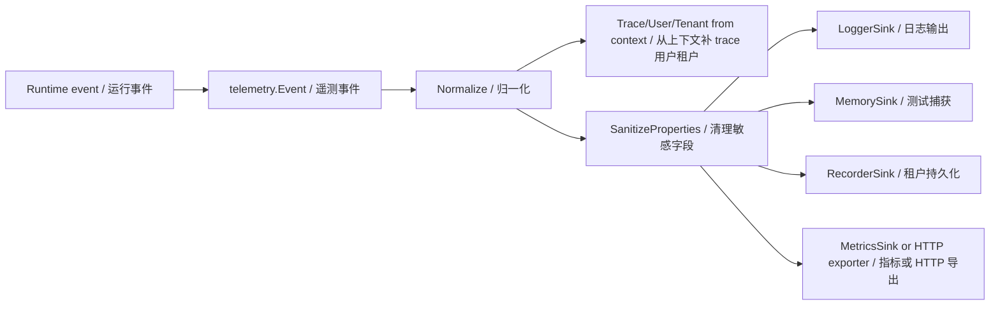
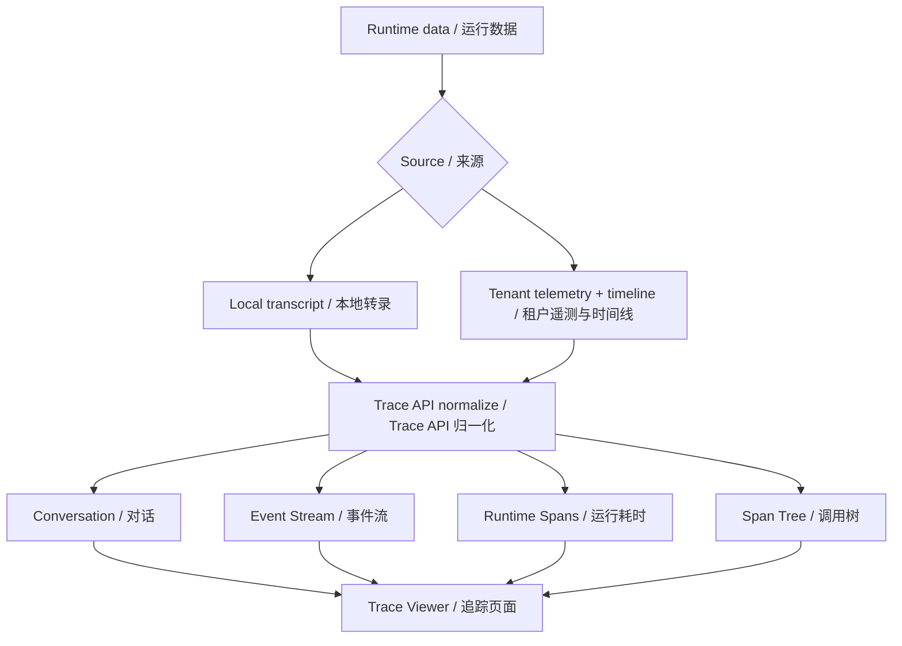
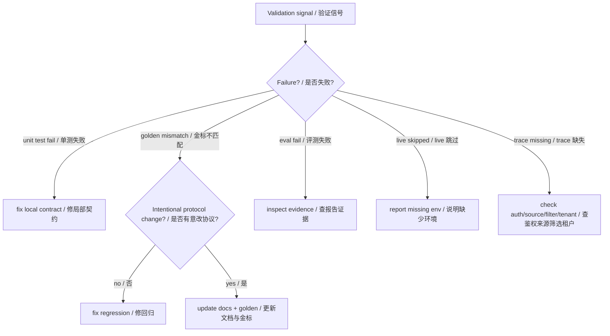
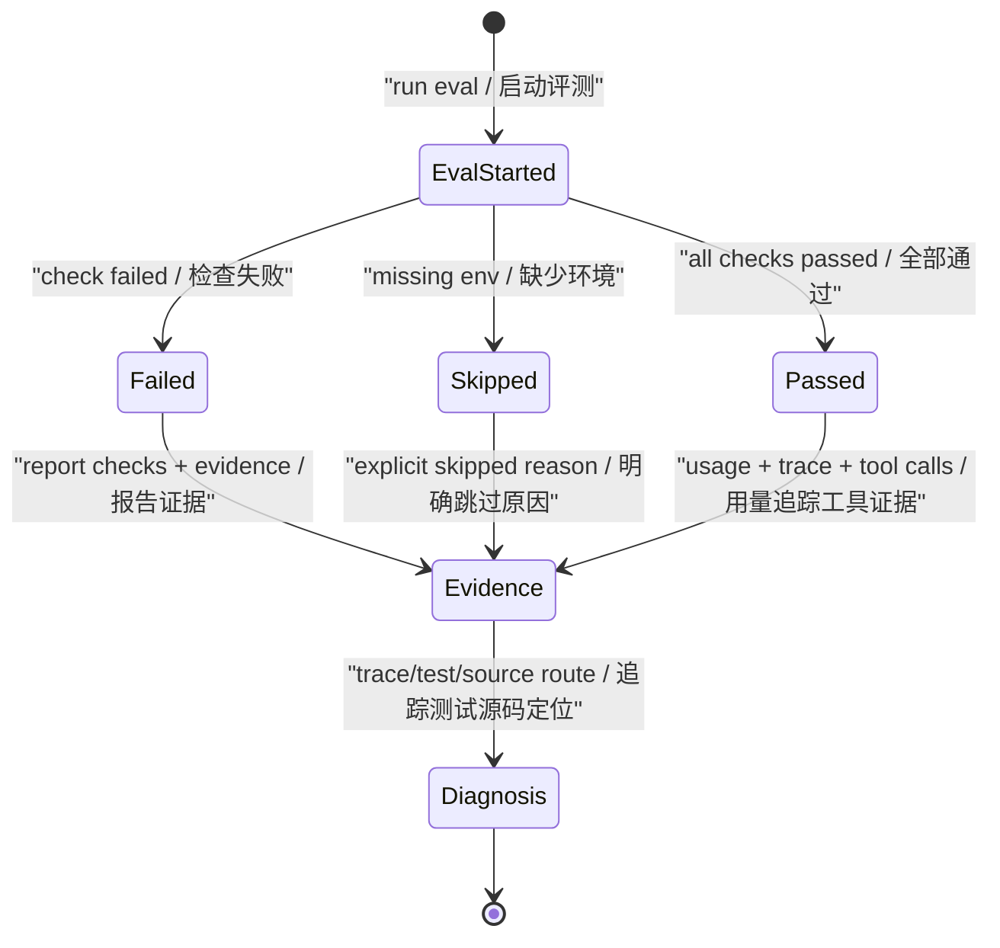

# 第 19 章：评估和监控 Evaluation and Monitoring

## 书中理论要点

智能体评估比传统函数测试更难，因为智能体的输出既包含最终答案，也包含过程：是否选对工具、是否遵守权限、是否处理失败、是否控制成本、是否在多轮 loop 中保持目标。监控则回答另一个问题：当系统在真实环境里变慢、失败、越权或输出异常时，工程师能不能定位证据。

Go Claude 的实践重点是把“感觉可用”变成“可验证”：

- 单元测试验证局部规则，例如权限、沙箱、tool registry、MCP adapter。
- golden tests 锁住协议输出和 transcript 结构。
- Agent Eval Harness 用 deterministic fake model 跑真实 `query.Session` 主链路。
- live profile 验证已经启动的 API Server endpoint、tenant/mobile/trace 链路。
- telemetry 和 Trace Viewer 把模型、工具、权限、子智能体、usage、prompt cache 变成可查询证据。

## Go Claude 的工程落点

核心入口：

- `docs/testing/agent_eval_harness.md` 说明 agent eval 的目标、case type、报告字段、live profile 和验证命令。
- `internal/agenteval/agenteval.go` 实现 deterministic eval、live profile、live-agent-api profile、anthropic-thinking profile。
- `internal/telemetry/telemetry.go` 定义 `Event`、`Emitter`、`Sink`、`Normalize` 和敏感字段清理。
- `internal/telemetry/sinks.go` 提供 logger、memory、recorder、HTTP exporter 等 sink。
- `internal/query/query.go` 在 query/model/tool/permission/context/compact 等关键点 emit telemetry。
- `internal/server/trace.go` 和 `docs/observability/trace_viewer.md` 把 local transcript 和 tenant telemetry 归一化成 Trace Viewer。
- `internal/query/golden_test.go`、`internal/server/golden_test.go` 用 golden 文件锁住协议和输出结构。

## 源码映射表

| 层级 | Go Claude 文件 | 学习重点 |
| --- | --- | --- |
| 评测入口 | `internal/agenteval/agenteval.go` | suite、case、report、deterministic fake model、live profile |
| 评测文档 | `docs/testing/agent_eval_harness.md` | case type、运行命令、报告字段、边界说明 |
| 遥测模型 | `internal/telemetry/telemetry.go` | Event 字段、category/status、Normalize、SanitizeProperties |
| 遥测输出 | `internal/telemetry/sinks.go` | LoggerSink、MemorySink、RecorderSink、HTTP exporter |
| 运行时埋点 | `internal/query/query.go` | query/model/tool/permission/usage/context/compact events |
| Trace Viewer | `internal/server/trace.go`、`docs/observability/trace_viewer.md` | session list/detail、event stream、runtime spans、span tree |
| Golden tests | `internal/query/golden_test.go`、`internal/server/golden_test.go` | transcript、stream、OpenAI-compatible 响应结构 |
| MySQL E2E | `docs/testing/mysql_e2e.md`、`internal/server/mysql_e2e_test.go` | tenant/session/message/telemetry 真实落库证据 |

## 评估与监控分层



这套分层的价值是避免把所有问题都塞给一种测试。单元测试快但看不到完整 agent loop；live profile 真实但依赖环境；Trace Viewer 不替代测试，但能解释失败发生在哪里。

## Agent Eval Harness 链路

`go run ./cmd/golang-cc eval agents --json` 默认运行 deterministic local suite。它使用 fake model，但走真实 `query.Session`、tool loop、skills、Task sub-agent runtime、auto compact、permission policy 和 telemetry。



默认 suite 覆盖：

| Case type | 验证重点 |
| --- | --- |
| `query` | 普通 query loop、模型响应、usage、telemetry。 |
| `tool` | `tool_use -> tool.Run -> tool_result -> 下一轮模型`。 |
| `skill` | 本地 skill 加载和激活。 |
| `subagent` | `Task` tool、sub-agent runtime、task store、nested lifecycle events。 |
| `subagent_parity` | agent schema、context sources、background Task、hooks、trace evidence。 |
| `multiagent_e2e` | AgentCreate/AgentMessage/AgentGet/AgentStop 全链路。 |
| `compact` | auto compact 触发和压缩后继续响应。 |
| `permission` | permission policy deny、工具错误回传、query 继续闭环。 |
| `trace` | request trace id、model/tool/query telemetry 和 report evidence。 |

## Telemetry 事件模型

`telemetry.Event` 是监控的基础结构。它把运行时事实拆成统一字段：

- identity：`TraceID`、`TenantKey`、`UserKey`、`TenantID`、`UserID`、`SessionID`。
- classification：`Name`、`Category`、`Source`、`Status`。
- resource：`ResourceType`、`ResourceID`、`Model`、`ToolName`。
- timing and usage：`DurationMS`、tokens、prompt cache tokens。
- diagnostics：`Error`、`Properties`。



`SanitizeProperties` 会移除包含 `api_key`、`authorization`、`bearer`、`password`、`secret`、`token`、`jwt`、`prompt`、`content`、`transcript`、`private_url` 等标记的 key，并截断错误和值。这解释了为什么 telemetry 应该记录“可排查 metadata”，而不是完整用户正文。

## Trace Viewer 排查链路

Trace Viewer 是监控证据的阅读界面。它能读：

- local transcript session。
- API Server / Mobile / OpenAI-compatible tenant session。
- message、tool call/result、usage、permission、file change、checkpoint、compact、recap、audit、telemetry、sub-agent task。
- runtime spans 和 span tree。



读者排查一个慢请求时，不应该只看最终响应。应该看：

1. `query.run.started/finished`：总耗时、turns、stop_reason、tool_calls。
2. `model.request.started/finished`：模型耗时、token、prompt cache、stop_reason。
3. `tool.execution.started/finished`：工具耗时、错误、active skill。
4. `permission.decision`：工具是否被拒绝、命中什么 rule。
5. `model.phase.*`：真实 provider 链路中 DNS/连接/TLS/首字节/首 delta/stream read 等阶段。

## 优先级与冲突处理

评估和监控也有优先级。不是所有证据都同等权重。

| 冲突 | 谁优先 | 为什么 |
| --- | --- | --- |
| 单元测试通过，但 deterministic eval 失败 | eval failure 优先 | 说明主链路组合出现问题，局部规则不够。 |
| deterministic eval 通过，但 live profile skipped | 不等于 live 通过 | skipped 只表示缺少 live 环境或配置。 |
| live profile 通过，但 MySQL verification skipped | HTTP 通过，落库未验证 | 未配置 DSN 时不能声称数据库链路已验证。 |
| Trace Viewer 看不到 event，但 eval report 有 telemetry evidence | 先查 source/filter/auth | 可能是 trace source、时间筛选或 tenant 权限问题。 |
| telemetry properties 想记录完整 prompt 方便排查 | 安全脱敏优先 | 不能为了排查泄露敏感正文、JWT、API key。 |
| golden mismatch 与代码变更意图一致 | 更新 golden 需要人工确认 | golden 是协议契约，不能机械覆盖。 |



## 异常、兜底与恢复

评估/监控系统也必须处理不完整环境：

- 没有真实 API Server：`--profile live` 返回 `skipped`，不把它伪装成 pass。
- 没有 MySQL DSN：`live-agent-api` 仍可跑 HTTP E2E，但 MySQL 直查标记 skipped。
- 没有 Anthropic auth：`anthropic-thinking` profile 返回 skipped。
- telemetry sink 失败：`Emitter.Emit` 记录 `telemetry.emit_error`，不让单个 sink 失败拖垮主请求。
- Trace Viewer 本地 transcript 缺少 request trace id：后端补稳定 `local:{session_id}` 方便归一化展示。
- trace span tree 当前由 telemetry 名称、trace id、时间范围和类型优先级推断；未来如果有原生 span id，可优先使用原生父子关系。



## 最佳实践

- 每个新增智能体能力都至少要有一个局部测试和一个主链路证据。
- 默认优先 deterministic eval，避免 CI 被真实模型、网络和 API key 阻塞。
- live profile 的 skipped 要如实报告，不能当成功。
- 涉及数据库、tenant、mobile、trace 时，要尽量补真实 API 或 MySQL E2E 证据。
- telemetry properties 只放 metadata，正文和密钥必须脱敏。
- Trace Viewer 用于排查，不替代测试；测试用于防回归，Trace 用于解释回归。
- golden tests 不要机械更新。先判断是协议有意变化还是行为回归。

## 源码阅读路线

1. 读 `docs/testing/agent_eval_harness.md`，先理解 eval 目标和 case type。
2. 读 `internal/agenteval/agenteval.go:DefaultSuite`，看默认 suite 覆盖哪些智能体能力。
3. 读 `runCase`、`runQueryCase`、`runPermissionCase`、`runCompactCase`，确认 fake model 但真实 runtime。
4. 读 `internal/telemetry/telemetry.go` 的 `Event`、`Normalize`、`SanitizeProperties`。
5. 读 `internal/query/query.go` 的 `telemetry.Emit` 调用点，按 query/model/tool/permission 分类。
6. 读 `docs/observability/trace_viewer.md`，理解 Trace Viewer 能展示哪些证据。
7. 读 `internal/query/golden_test.go` 和 `internal/server/golden_test.go`，理解 golden 如何锁协议结构。

## 如何验证

静态阅读：

```bash
rg -n "DefaultSuite|runCase|runQueryCase|runPermissionCase|runCompactCase|runLiveAgentAPICase" internal/agenteval
rg -n "type Event|func Normalize|SanitizeProperties|type MemorySink|RecorderSink|MetricsSink" internal/telemetry
rg -n "query.run.started|model.request.started|tool.execution.started|permission.decision|recordTool|recordUsage" internal/query internal/server
```

单元测试：

```bash
go test ./internal/agenteval -count=1
go test ./internal/telemetry -count=1
go test ./internal/server -run 'Trace|Golden|Telemetry' -count=1
go test ./internal/query -run 'Golden|Tool|Permission|Compact' -count=1
```

评测和 trace：

```bash
go run ./cmd/golang-cc eval agents --json
go run ./cmd/golang-cc eval agents --output reports/agent-eval.md --format markdown
```

有真实 API Server 时：

```bash
export GOLANG_CLAUDE_CODE_EVAL_LIVE_API_BASE=http://127.0.0.1:18080
export GOLANG_CLAUDE_CODE_EVAL_LIVE_AUTH_TOKEN=test-token
export GOLANG_CLAUDE_CODE_EVAL_LIVE_TENANT_KEY=yutang
export GOLANG_CLAUDE_CODE_EVAL_LIVE_USER_KEY=eval-user

go run ./cmd/golang-cc eval agents --profile live --json
```

Trace Viewer：

```bash
curl -sS 'http://127.0.0.1:8080/trace/api/sessions?source=local&limit=10' \
  -H 'Authorization: Bearer test-token'
```

## 学习任务

1. 运行默认 eval，找出 `tool_read`、`permission_boundary`、`trace_observability` 的 evidence。
2. 故意让一个 permission case 失败，观察 report 如何显示 checks 和 telemetry events。
3. 打开一个 local transcript 的 Trace Viewer，找到 tool call/result 和 usage event。
4. 读 `SanitizeProperties`，列出哪些 key 不允许进入 telemetry properties。
5. 比较 golden test 和 eval test：一个锁协议结构，一个锁智能体运行链路。

## 当前差距

- 当前默认 eval 是规则型评分，文档也明确模型裁判型评分后续可扩展。
- live profile 是 opt-in，不配置环境会 skipped；这保证本地/CI 稳定，但不能替代真实部署巡检。
- Trace span tree 当前主要由已有 telemetry 名称和时间关系推断；更强的原生 span id/parent span id 仍是后续演进方向。
- WebUI live E2E 和真实数据库链路需要按具体改动单独验证，不能因为 deterministic eval 通过就声称全部端到端完成。

## 本章自审

| 检查项 | 结果 |
| --- | --- |
| 引用了真实源码路径 | 已覆盖 `internal/agenteval`、`internal/telemetry`、`internal/query`、`internal/server/trace`、测试文档。 |
| 至少 3 张图 | 已包含评估分层、eval 时序、telemetry 流、Trace Viewer、验证冲突、eval 状态机。 |
| 写清楚顺序和优先级 | 已说明 unit/golden/eval/live/trace 的证据优先级。 |
| 写清楚冲突处理 | 已覆盖 eval 与 unit、live skipped、MySQL skipped、trace 缺失、golden mismatch。 |
| 写清楚异常和兜底 | 已说明 skipped、sink failure、本地 trace id fallback、span tree 推断边界。 |
| 有验证命令 | 已提供 `rg`、`go test`、`eval agents`、live profile、Trace API curl。 |
