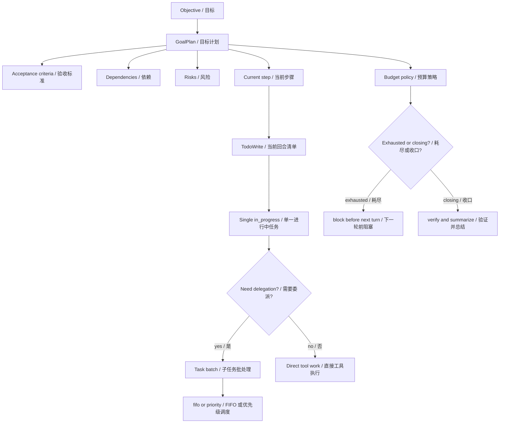
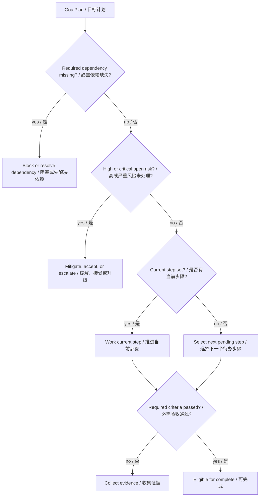
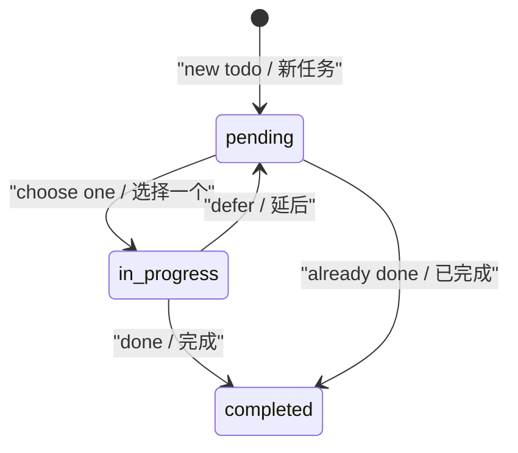
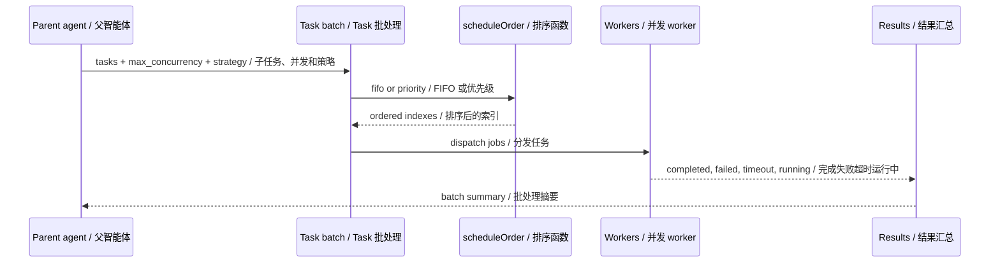
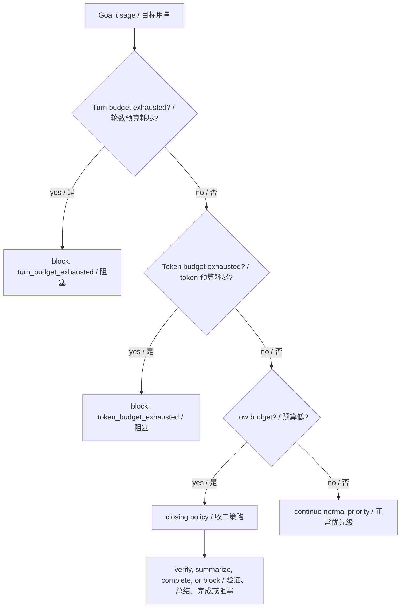
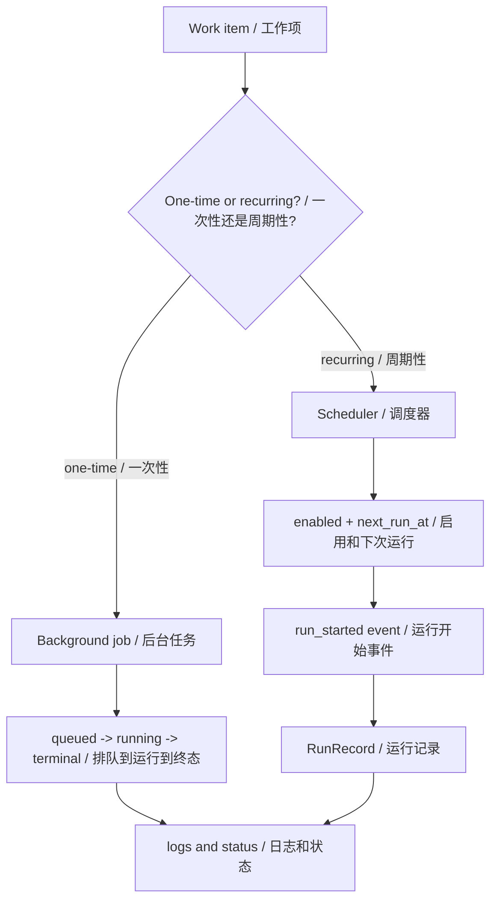
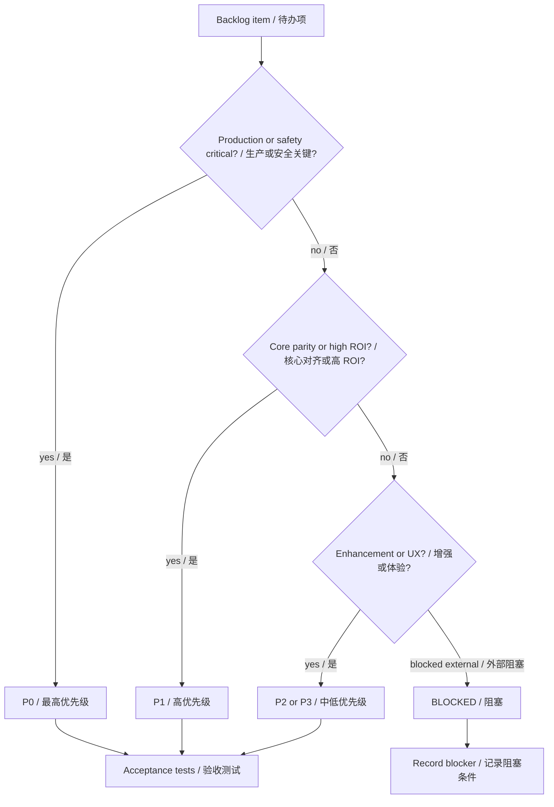
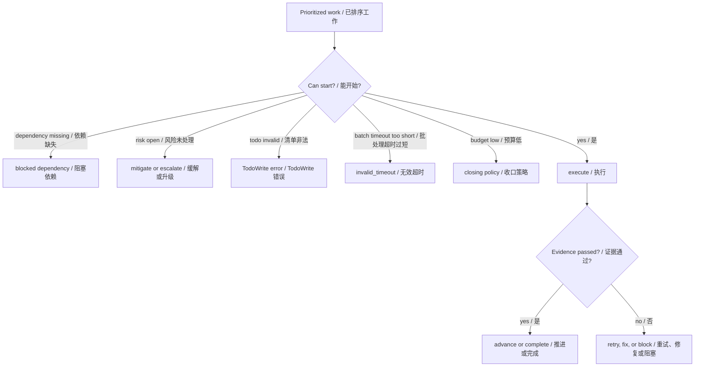

# 第 20 章：优先级排序 Prioritization

## 书中理论要点

优先级排序解决的是智能体“先做什么、后做什么、什么不能做”的问题。没有优先级的 agent 很容易陷入三类失败：

- 看到多个任务就并行乱跑，成本和风险失控。
- 只做最显眼的事情，忽略验收标准、依赖、权限和预算。
- 遇到高风险或阻塞仍继续执行，最后产出不可用结果。

真实工程里的优先级不是一个简单的 `priority=high` 字段，而是多层裁决：

- 目标层：Goal 的验收标准、依赖、风险、预算和 evidence。
- 当前回合层：TodoWrite 只允许一个 `in_progress`。
- 子任务层：Task batch 支持 FIFO 或 priority scheduling。
- 后台层：background/scheduler 记录 queued/running/completed/failed/killed 和 run history。
- 项目治理层：docs/todo.md 用 P0/P1/P2/P3 表达 roadmap 优先级和验收标准。

Go Claude 的实践重点是：把优先级落成可验证的状态、排序和拒绝规则，而不是只写进 prompt 让模型自己记住。

## Go Claude 的工程落点

核心入口：

- `internal/goal/plan.go`
- `internal/goal/budget.go`
- `internal/goal/evaluator.go`
- `internal/tools/todowrite/todowrite.go`
- `internal/tools/task/task.go`
- `internal/background/background.go`
- `internal/scheduler/scheduler.go`
- `docs/todo.md`
- `docs/goal_mode/goal_mode_optimization_todo.md`
- `docs/architecture/loop_scheduler_design.md`

## 源码映射表

| 层级 | Go Claude 文件 | 学习重点 |
| --- | --- | --- |
| Goal plan | `internal/goal/plan.go` | steps、acceptance criteria、dependencies、risks、current step 和 evidence schema。 |
| Goal budget | `internal/goal/budget.go` | turn/token exhausted、closing policy、next_action 和 blocker key。 |
| Goal evaluator | `internal/goal/evaluator.go` | required criteria、failed evidence、permission/budget/repeated blocker 的裁决顺序。 |
| 当前任务清单 | `internal/tools/todowrite/todowrite.go` | `pending/in_progress/completed`，同一时间最多一个 `in_progress`，priority 只允许 low/medium/high。 |
| 子任务排序 | `internal/tools/task/task.go` | batch `schedule_strategy=fifo|priority`、priority 高者先发给 worker、retry、timeout、max_concurrency。 |
| 后台任务 | `internal/background/background.go` | queued/running/completed/failed/killed，默认 max turns，日志路径和进程状态。 |
| scheduler | `internal/scheduler/scheduler.go` | enabled/disabled、cron/interval、run_count、last/next run、run records。 |
| roadmap docs | `docs/todo.md`、`docs/goal_mode/goal_mode_optimization_todo.md` | P0/P1/P2/P3、状态、验收标准、测试命令和实施顺序。 |

## 优先级分层架构



这张图说明：Go Claude 不是靠一个全局优先级队列，而是按层级收窄。先由 GoalPlan 和预算确定任务方向，再由 TodoWrite 控制当前回合，再由 Task batch 排序子任务。

## GoalPlan 的优先级语义

`GoalPlan` 没有直接叫 `priority` 的字段，但它用四组结构表达优先级：

- `AcceptanceCriteria`：什么必须满足，`Required=true` 的标准高于模型自报完成。
- `Dependencies`：哪些前置条件必须可用，required dependency missing/blocked 时应先处理或阻塞。
- `Risks`：高风险和 critical risk 必须先缓解、接受或升级。
- `CurrentStepID`：当前应该推进哪一步，避免模型在多个步骤间跳来跳去。



这和书中“prioritize tasks by value/urgency/risk”的理论对应，但 Go Claude 把它落成了可存储、可验证、可被 evaluator 使用的数据结构。

## TodoWrite 的当前回合排序

`TodoWrite` 是会话级的轻量任务清单，写入 `.claude/todos.json`。它的关键规则是：

- `status` 只能是 `pending`、`in_progress`、`completed`。
- `priority` 只能是空、`low`、`medium`、`high`。
- 同一时间最多一个 todo 是 `in_progress`。
- 写文件前走 `EnsureWritablePathWithSandbox`。



Todo 的 `priority` 用来帮助模型排序，但真正的硬约束是“只能一个 `in_progress`”。这让当前回合保持聚焦，避免同时宣称多个任务正在推进。

## Task Batch 的调度优先级

`Task` 工具支持 batch 子任务。它的排序规则由 `schedule_strategy` 控制：

- `fifo`：默认策略，按输入顺序发给 worker。
- `priority`：`priority` 数字越大越先发给 worker，同优先级保持原输入顺序。



优先级排序只是“开始顺序”，不是“结果可信度”。每个子任务仍受 retry、timeout、background task store、tool permission 和最终父会话裁决约束。

## 预算与收口优先级

Goal budget 会在资源紧张时改变优先级：

- turn budget 或 token budget 耗尽：下一轮前阻塞。
- 只剩 1 turn 或 token 剩余低于 10%：进入 closing policy。
- closing policy 的 next action 是验证、简洁总结、完成或明确 blocker，而不是扩展新范围。



这条规则是 ROI 优先级：预算快没了，不再开新坑，把剩余资源用于闭环。

## Background 与 Scheduler 的优先级边界

background 和 scheduler 不是“更高优先级”，而是不同生命周期：

- background job 初始状态是 `queued`，启动后是 `running`，结束后记录 terminal status。
- scheduler schedule 有 `enabled`、`run_count`、`last_run_at`、`next_run_at`、`last_error`。
- scheduler list 按 `CreatedAt` 倒序展示，run history 用 `RunRecord` 保存。
- recurring loop 的触发由 cron/interval 决定，不应该抢占当前交互回合的安全边界。



这里的优先级不是“谁更重要”，而是“谁有权在什么时间执行”。后台和定时任务必须有日志、状态、取消/禁用路径，不能隐形运行。

## Roadmap P0/P1/P2 的产品优先级

`docs/todo.md` 和 `docs/goal_mode/goal_mode_optimization_todo.md` 是工程治理层的优先级系统：

- P0：基础闭环或安全/隔离/生产必须项。
- P0.5：接近 P0，但可分阶段落地的关键增强。
- P1：高价值能力或 parity 主线。
- P2/P3：增强、体验或低优先级事项。
- BLOCKED：依赖外部系统、平台或上游私有信息，不能伪装完成。



文档优先级的价值是避免“做了很多但不知道为什么做”。每个 TODO 都要绑定验收标准和测试命令。

## 优先级与冲突处理

| 冲突 | 谁优先 | 为什么 |
| --- | --- | --- |
| required dependency missing vs 继续执行 | dependency 优先 | 前置条件不可达时继续执行只会浪费 turn。 |
| high/critical open risk vs 自动执行 | risk 优先 | 高风险需要缓解、接受或升级。 |
| required criteria 未通过 vs Goal complete | criteria/evidence 优先 | 不能靠模型自报绕过验收。 |
| budget exhausted vs 下一轮任务 | budget exhausted 优先 | runner 在下一轮前 blocked。 |
| budget closing vs 扩展新范围 | closing policy 优先 | 剩余资源用于验证和收口。 |
| 多个 `in_progress` todo | TodoWrite validation 优先 | 工具直接拒绝非法状态。 |
| Task batch priority vs max_concurrency | max_concurrency 仍限制并发 | priority 只影响发车顺序，不突破并发上限。 |
| Task priority vs timeout/cancel | timeout/cancel 优先 | 高优先级任务也不能无限跑。 |
| scheduler trigger vs permission/sandbox | permission/sandbox 优先 | 定时执行不能绕过安全边界。 |
| P1 feature vs P0 security/data isolation | P0 优先 | 安全、隔离和生产闭环优先于增强功能。 |

## 异常、兜底与恢复



关键兜底：

- `GoalPlan.Validate` 会拒绝无 goal id、无效 step/status、重复 step id、current step 不存在等非法计划。
- `TodoWrite` 拒绝空 content、非法 status、非法 priority 和多个 `in_progress`。
- `Task` batch 会 clamp retry、timeout、max_concurrency；多任务短 timeout 会返回 `invalid_timeout`。
- Task batch 某个任务失败时，batch result `IsError=true`，父会话必须看到失败摘要。
- scheduler 可以 disable，run records 保留错误和日志字节数。
- TODO 文档中 BLOCKED 项必须记录外部阻塞，不能标 DONE。

## 最佳实践

- 先处理 required dependency 和 high/critical risk，再执行普通步骤。
- 当前回合只允许一个真正的 `in_progress`，减少上下文切换。
- Task batch 的 `priority` 只用于启动顺序，不要把它当成事实可信度。
- 预算低时优先验证和总结，不要扩展新需求。
- Roadmap 优先级必须绑定验收标准和测试命令，否则 P0/P1 只是标签。
- BLOCKED 要诚实记录外部条件；不要用 prompt 或文档话术假装闭环。
- 定时任务和后台任务必须有状态、日志、run history 和停止/禁用路径。

## 源码阅读路线

1. 读 `internal/goal/plan.go`，理解 criteria、dependencies、risks 如何表达优先级。
2. 读 `internal/goal/budget.go`，确认 exhausted 和 closing policy。
3. 读 `internal/goal/evaluator.go`，看 evidence-first 如何压过模型自报。
4. 读 `internal/tools/todowrite/todowrite.go`，确认单一 `in_progress` 和 priority 校验。
5. 读 `internal/tools/task/task.go:scheduleOrder`，理解 FIFO 和 priority batch 排序。
6. 读 `internal/background/background.go` 和 `internal/scheduler/scheduler.go`，理解后台生命周期和 run history。
7. 读 `docs/todo.md` 和 `docs/goal_mode/goal_mode_optimization_todo.md`，看项目级 P0/P1/P2 与验收标准。

## 如何验证

```bash
go test ./internal/goal -run 'Plan|Budget|Evaluator|Evidence|Reachability' -count=1
go test ./internal/tools/todowrite -count=1
go test ./internal/tools/task -run 'Batch|Priority|Timeout|Retry' -count=1
go test ./internal/background ./internal/scheduler -count=1
```

源码搜索：

```bash
rg -n "GoalPlan|GoalStep|GoalCriterion|GoalDependency|GoalRisk|AnalyzeBudget|EvidenceEvaluator" internal/goal
rg -n "only one todo can be in_progress|schedule_strategy|scheduleOrder|priority|invalid_timeout" internal/tools
rg -n "P0|P1|P2|BLOCKED|验收标准|推荐实施顺序" docs/todo.md docs/goal_mode
```

## 学习任务

- 为什么 Go Claude 没有一个全局 `priority` 字段，却仍然能表达优先级？
- `required acceptance criteria` 和 `priority=high` 哪个更硬？
- 为什么 TodoWrite 要禁止多个 `in_progress`？
- Task batch 的 `priority` 为什么只影响启动顺序，不代表结果更可信？
- budget closing policy 为什么是 ROI 优先级？
- 文档里的 P0/P1 如果没有验收标准，会带来什么工程风险？

## 当前差距

Go Claude 已实现 GoalPlan 结构化优先级、evidence-first evaluator、budget closing、TodoWrite 当前回合约束、Task batch priority scheduling、background/scheduler 状态记录和 P0/P1/P2 文档治理。当前还没有全局跨 goal 队列、跨 tenant 工作负载调度器、基于价值/成本/风险的自动评分器、可视化优先级矩阵、自动 WIP limit 管理和跨 agent 资源分配器。当前策略是先把每一层的裁决规则做硬、做可观测，再逐步平台化。

## 本章自审

| 检查项 | 结果 |
| --- | --- |
| 引用真实源码 | 已覆盖 `goal/plan`、`goal/budget`、`goal/evaluator`、`todowrite`、`task`、`background`、`scheduler` 和 TODO 文档。 |
| 至少 3 张图 | 已包含优先级分层、GoalPlan 裁决、Todo 状态机、Task batch 时序、预算收口、后台调度、roadmap 优先级、异常兜底图。 |
| 图中英文后有中文 | Mermaid 节点、参与者和关键边均使用 `English / 中文`。 |
| 优先级 | 已说明 dependency、risk、criteria、budget、Todo validation、Task timeout/cancel、P0 安全的优先级。 |
| 冲突处理 | 已覆盖验收与完成、多个 in_progress、Task priority 与并发/超时、scheduler 与权限、P1 与 P0 冲突。 |
| 异常与兜底 | 已覆盖 plan validation、TodoWrite validation、Task invalid_timeout、batch failure、scheduler disable 和 BLOCKED 文档。 |
| 最佳实践 | 已给出 dependency/risk 先行、单一 in_progress、预算收口、验收标准、BLOCKED 诚实记录。 |
| 验证命令 | 已提供 goal、todowrite、task、background/scheduler 聚焦测试和源码搜索。 |
| 当前差距 | 已明确没有全局队列、自动评分器、可视化矩阵和跨 tenant 调度器。 |
