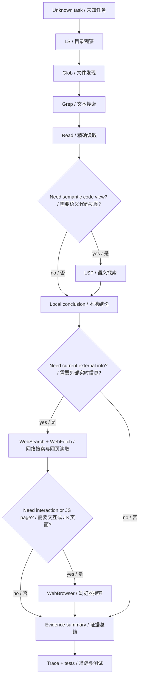
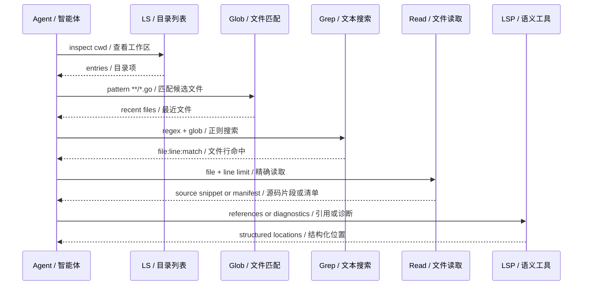
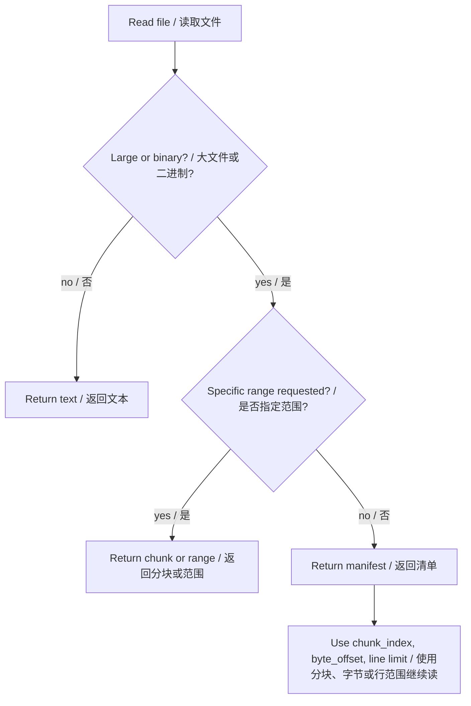
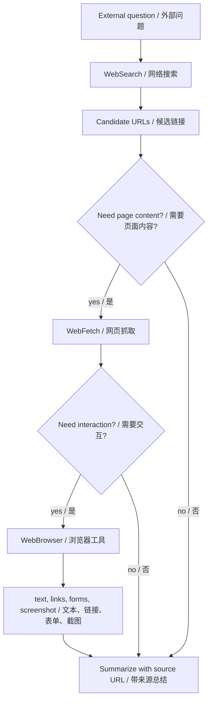
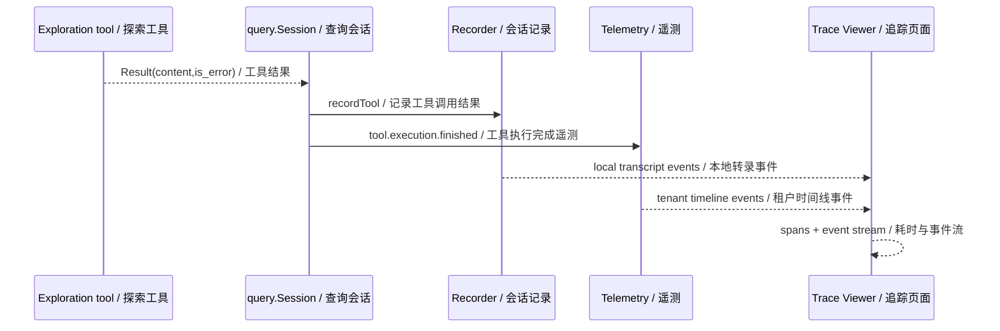
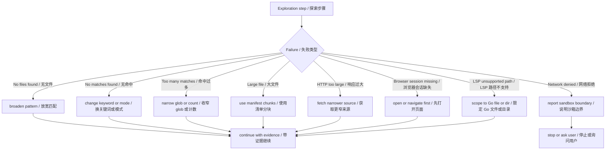

# 第 21 章：探索和发现 Exploration and Discovery

## 书中理论要点

探索和发现模式解决的是：智能体面对未知代码库、未知问题、未知网页或未知运行状态时，如何先找证据，再形成判断。它不是“随便搜一下”，而是一套逐步缩小不确定性的工作流：

- 从便宜、低风险、局部的观察开始。
- 用结构化搜索找到候选位置。
- 读取最相关的证据，而不是把全部内容塞进上下文。
- 当本地证据不足时，再访问网络、浏览器或外部系统。
- 每一步都留下可复查的 trace、tool result 或测试证据。

Go Claude 的探索实践是一组工具和约束的组合：`LS`、`Glob`、`Grep`、`Read`、`LSP`、`WebSearch`、`WebFetch`、`WebBrowser`、Trace Viewer、agent eval 和 telemetry。核心思想是 read-first、evidence-first、bounded exploration。

## Go Claude 的工程落点

核心入口：

- `internal/tools/ls/ls.go`
- `internal/tools/glob/glob.go`
- `internal/tools/grep/grep.go`
- `internal/tools/fileread/fileread.go`
- `internal/tools/lsp/lsp.go`
- `internal/tools/websearch/websearch.go`
- `internal/tools/webfetch/webfetch.go`
- `internal/tools/webbrowser/webbrowser.go`
- `internal/tools/network.go`
- `internal/query/query.go`
- `internal/server/trace.go`
- `internal/agenteval/agenteval.go`
- `docs/observability/trace_viewer.md`
- `docs/testing/agent_eval_harness.md`

## 源码映射表

| 层级 | Go Claude 文件 | 学习重点 |
| --- | --- | --- |
| 目录观察 | `internal/tools/ls/ls.go` | 列目录、ignore pattern、最多 1000 项、目录带 `/`。 |
| 文件发现 | `internal/tools/glob/glob.go` | `*`、`?`、`**`，跳过 `.git/node_modules/vendor/.idea/.cache*`，按修改时间排序。 |
| 文本搜索 | `internal/tools/grep/grep.go` | regex、glob filter、context lines、content/files/count 模式、最多 1000 结果。 |
| 精确读取 | `internal/tools/fileread/fileread.go` | line/byte/chunk 读取，大文件/二进制返回 manifest。 |
| 语义代码探索 | `internal/tools/lsp/lsp.go` | Go symbols、definition、references、diagnostics。 |
| 网络搜索 | `internal/tools/websearch/websearch.go` | search endpoint、allowed/blocked domains、sandbox 网络策略、2MB body limit。 |
| 网页读取 | `internal/tools/webfetch/webfetch.go` | HTTP/HTTPS、HTML 转文本、sandbox 网络策略、2MB body limit。 |
| 浏览器探索 | `internal/tools/webbrowser/webbrowser.go` | open/text/links/forms/click/input/submit/screenshot，浏览器 session 和网络策略。 |
| 证据记录 | `internal/query/query.go` | ToolTrace、tool_result、telemetry、file_change、trace id。 |
| 复盘观察 | `internal/server/trace.go`、`docs/observability/trace_viewer.md` | Conversation、Event Stream、Runtime Spans、Span Tree。 |

## 探索分层架构



这张图体现探索顺序：先本地低成本工具，再语义工具，再网络工具。不要一开始就大范围 Web 搜索，也不要不读源码就直接推断。

## 本地 Read-First 工作流

本地探索通常按这条链路走：

1. `LS` 看目录结构。
2. `Glob` 找可能相关文件。
3. `Grep` 找符号、错误文案、配置键或 API path。
4. `Read` 只读命中的文件片段。
5. `LSP` 在 Go 代码里查 symbol、definition、references、diagnostics。



这里的关键不是工具名字，而是“先缩小，再读取”。`Grep` 返回 `file:line:match`，`Read` 支持 line offset/limit，能避免把无关文件全部放进上下文。

## 大文件和二进制探索

`Read` 工具通过 `internal/files` 对大文件和二进制做边界保护：

- 大文件或二进制在未指定 offset/limit/chunk 时返回 manifest。
- manifest 包含 chunk、byte range、line range 等信息，指导后续分段读取。
- 二进制/媒体不直接内联原始 payload。



这是一种探索兜底：读者不应该被“大文件不能读”阻断，而应该用 manifest 指导下一步更精确的读取。

## 网络与浏览器探索

外部探索分三层：

- `WebSearch`：找候选 URL 和标题。
- `WebFetch`：抓取一个 URL 的可读文本。
- `WebBrowser`：页面需要链接、表单、点击、输入、截图或 JS-like 交互时使用。



网络工具都有硬边界：

- URL 必须是 HTTP/HTTPS。
- `CheckNetworkURL` 会应用 network disabled、allow/deny domain、proxy、MITM 等 sandbox 策略。
- `WebSearch`、`WebFetch`、`WebBrowser` 都限制响应体大小，避免无限抓取。
- `WebSearch` 同时支持请求级 allowed/blocked domains 和 sandbox allow/deny domains。

## 探索证据如何进入 Trace

每次工具探索都会进入 `ToolTrace`，并被 `recordTool` 写入 transcript；query 还会发出 `tool.execution.started/finished` telemetry。Trace Viewer 可以把这些事件归一化为 Event Stream 和 Runtime Spans。



这让探索不是“脑内过程”。读者可以在 transcript、trace、telemetry 或 eval report 中看到具体查了什么、读了什么、哪个工具失败了。

## 探索顺序与冲突处理

| 冲突 | 谁优先 | 为什么 |
| --- | --- | --- |
| 直接猜测 vs 本地源码搜索 | 本地源码搜索优先 | 当前仓库事实比模型记忆可靠。 |
| 全仓读取 vs Glob/Grep 缩小范围 | Glob/Grep 优先 | 控制上下文、成本和误读风险。 |
| `Grep` 命中过多 vs 继续读所有文件 | count/files_with_matches/更窄 glob 优先 | 先缩小候选集再读。 |
| 大文件直接读取 vs manifest | manifest 优先 | 防止上下文爆炸和二进制污染。 |
| LSP 语义结果 vs 文本搜索 | 两者互证 | LSP 适合 Go 符号，Grep 适合字符串、配置和跨语言。 |
| 网络搜索 vs 本地实现 | 本地实现优先 | 项目当前行为由源码决定；网络只补外部事实或最新信息。 |
| WebSearch 结果与 WebFetch 内容冲突 | WebFetch 内容优先 | 搜索结果只是索引摘要，页面内容更接近来源。 |
| WebFetch 与安全沙箱冲突 | sandbox/network policy 优先 | 探索不能绕过网络安全边界。 |
| 工具探索结果与最终回答冲突 | 工具证据优先 | 最终回答必须解释或修正工具证据。 |
| Trace 缺失 vs 口头判断 | 先补可复现验证 | 没有证据时不能声称“已经验证”。 |

## 异常、兜底与恢复



关键兜底：

- `Glob` 没有匹配时返回 `No files found`，不是空白。
- `Grep` 正则非法直接返回错误；无命中返回 `No matches found`。
- `Grep`、`Glob`、`LS` 都有结果上限。
- `Read` 大文件/二进制返回 manifest，引导分段探索。
- `WebFetch` 非 HTTP/HTTPS 直接拒绝。
- 网络 sandbox 拒绝时返回工具错误，不偷偷绕过。
- `WebBrowser` 非 open/navigate 操作需要已有 session。
- `LSP` 只支持 Go 文件或目录；其他路径返回明确错误。

## 最佳实践

- 先搜当前仓库，再搜互联网。代码事实优先于模型记忆和搜索摘要。
- 搜索时先用 `Grep output_mode=count` 或 `files_with_matches` 缩小范围，再读具体片段。
- 读文件时优先带 line limit，必要时使用 line number。
- 大文件按 manifest 分块，不要要求工具一次性返回全文。
- 外部信息必须带 URL 来源；搜索结果不足时用 `WebFetch` 验证页面正文。
- 网络和浏览器探索必须尊重 sandbox、allow/deny domains、proxy 和 body limit。
- 探索过程要能复盘：保留 tool result、trace id、测试命令或 eval report。
- 结论里区分“源码证据”“运行证据”“外部网页证据”“推断”。

## 源码阅读路线

1. 读 `internal/tools/glob/glob.go`、`grep.go`、`ls.go`，理解本地发现工具的 limit 和跳过目录。
2. 读 `internal/tools/fileread/fileread.go` 和 `internal/files`，理解大文件 manifest。
3. 读 `internal/tools/lsp/lsp.go`，看 Go AST 如何产生 symbols、definition、references、diagnostics。
4. 读 `internal/tools/websearch/websearch.go` 和 `webfetch.go`，确认网络 sandbox、domain filter 和 body limit。
5. 读 `internal/tools/webbrowser/webbrowser.go`，理解 session、forms、click/input/submit/screenshot。
6. 读 `internal/query/query.go:runTool`、`recordTool`、`recordFileChange`，看探索证据如何记录。
7. 读 `docs/observability/trace_viewer.md`，用 Trace Viewer 复盘探索链路。

## 如何验证

```bash
go test ./internal/tools/ls ./internal/tools/glob ./internal/tools/grep ./internal/tools/fileread -count=1
go test ./internal/tools/lsp -count=1
go test ./internal/tools/websearch ./internal/tools/webfetch ./internal/tools/webbrowser -count=1
go test ./internal/query -run 'Tool|Trace|FileChange|Golden' -count=1
go test ./internal/server -run 'Trace' -count=1
go test ./internal/agenteval -run 'DefaultSuite|LiveProfileSkips' -count=1
```

源码搜索：

```bash
rg -n "No matches found|No files found|maxMatches|maxResults|FormatManifest|CheckNetworkURL|WebBrowser|ToolTrace|recordTool" internal
```

运行时验证：

```bash
go run ./cmd/golang-cc eval agents --json
```

有 API Server 时，可打开 Trace Viewer：

```bash
go run ./cmd/golang-cc server --host 127.0.0.1 --port 18080 --auth-token test-token
open "http://127.0.0.1:18080/trace?token=test-token"
```

## 学习任务

- 为什么探索未知代码库时应该先 `Glob/Grep`，再 `Read`？
- `Grep output_mode=count` 和 `files_with_matches` 分别适合什么场景？
- 大文件 manifest 如何帮助你继续读取，而不是放弃？
- 什么时候应该用 `LSP` 而不是文本搜索？
- 为什么 WebSearch 结果不能直接当最终事实？
- Trace Viewer 如何证明一次探索真的读过某个文件或调用过某个工具？

## 当前差距

Go Claude 已具备本地文件发现、文本搜索、精确读取、大文件 manifest、Go 语义探索、网络搜索、网页抓取、浏览器式交互、tool trace、Trace Viewer 和 eval harness。当前仍没有跨语言完整 LSP server、语义索引数据库、向量化代码搜索、网页引用级回答、浏览器 DOM 精细断言 DSL、长期探索知识图谱和自动研究报告生成器。当前策略是先保证探索有边界、有证据、可复盘，再逐步增强语义和自动化能力。

## 本章自审

| 检查项 | 结果 |
| --- | --- |
| 引用真实源码 | 已覆盖 `ls`、`glob`、`grep`、`fileread`、`lsp`、`websearch`、`webfetch`、`webbrowser`、`query`、`trace` 和 eval。 |
| 至少 3 张图 | 已包含探索分层、本地 read-first 时序、大文件 manifest、网络浏览器探索、trace 证据、异常兜底图。 |
| 图中英文后有中文 | Mermaid 节点、参与者和关键边均使用 `English / 中文`。 |
| 优先级 | 已说明本地源码优先、缩小范围优先、manifest 优先、sandbox 优先、工具证据优先。 |
| 冲突处理 | 已覆盖猜测与源码、搜索摘要与网页正文、网络与沙箱、LSP 与 Grep、trace 缺失等冲突。 |
| 异常与兜底 | 已覆盖无文件、无命中、命中过多、大文件、网络拒绝、响应过大、浏览器 session 缺失、LSP 路径错误。 |
| 最佳实践 | 已给出 read-first、分层搜索、分块读取、外部来源、sandbox、证据分类和复盘建议。 |
| 验证命令 | 已提供本地工具、LSP、网络/浏览器、query/server trace、agenteval 测试和运行时验证。 |
| 当前差距 | 已明确没有跨语言 LSP、语义索引、向量代码搜索、引用级回答和长期探索知识图谱。 |
