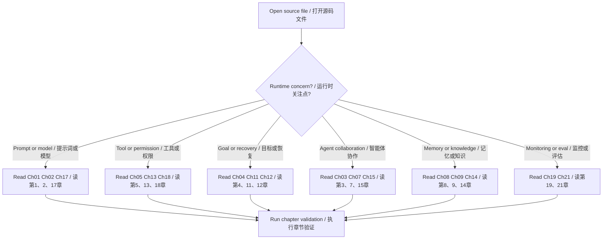

# Agentic Patterns 源码反查索引

这个索引用来从 Go Claude 源码模块反查学习章节。读者读代码时如果不知道某段机制对应哪种智能体设计模式，可以先看这里。

## 主链路和 Prompt

| 源码或文档 | 相关章节 | 学习重点 |
| --- | --- | --- |
| `internal/query/query.go` | [第 1 章](chapter-01-prompt-chaining.md)、[第 2 章](chapter-02-routing.md)、[第 5 章](chapter-05-tool-use.md)、[第 16 章](chapter-16-resource-aware-optimization.md)、[第 17 章](chapter-17-reasoning-techniques.md) | turn loop、system prompt 优先级、tool result 回灌、context manifest、compact、thinking stream。 |
| `internal/promptmode/promptmode.go` | [第 2 章](chapter-02-routing.md) | code/chat prompt profile 的归一化与默认值。 |
| `docs/prompt_logic/*` | [第 1 章](chapter-01-prompt-chaining.md) | prompt 加载逻辑、system/addendum、memory 注入和已知差距。 |
| `docs/prompt_logic/code_and_chat_prompt_modes.md` | [第 2 章](chapter-02-routing.md) | CLI/TUI、OpenAI-compatible、Mobile 的 prompt mode 边界。 |

## 工具、权限和外部协议

| 源码或文档 | 相关章节 | 学习重点 |
| --- | --- | --- |
| `internal/tools` | [第 5 章](chapter-05-tool-use.md)、[第 18 章](chapter-18-guardrails-safety.md)、[第 21 章](chapter-21-exploration-discovery.md) | tool registry、guarded tools、文件/网络/浏览器探索工具、tool trace。 |
| `internal/tools/guarded.go` | [第 5 章](chapter-05-tool-use.md)、[第 18 章](chapter-18-guardrails-safety.md) | active skill、agent policy、session permission、approval prompt 的执行前拦截。 |
| `internal/permissions/policy.go` | [第 13 章](chapter-13-human-in-the-loop.md)、[第 18 章](chapter-18-guardrails-safety.md) | `Bypass`、`Deny`、`AlwaysAsk`、`Allow`、default mode 的裁决顺序。 |
| `internal/tools/path.go`、`internal/tools/network.go` | [第 18 章](chapter-18-guardrails-safety.md) | 路径沙箱、敏感路径保护、网络 allow/deny、proxy 和 CA。 |
| `internal/mcp` | [第 10 章](chapter-10-mcp.md)、[第 18 章](chapter-18-guardrails-safety.md) | MCP client、RPC、tool adapter、callback permission、agent-local MCP 隔离。 |

## Goal、计划和恢复

| 源码或文档 | 相关章节 | 学习重点 |
| --- | --- | --- |
| `internal/goal/plan.go` | [第 6 章](chapter-06-planning.md)、[第 11 章](chapter-11-goal-setting-monitoring.md)、[第 20 章](chapter-20-prioritization.md) | Goal steps、acceptance criteria、dependencies、risks 和 current step。 |
| `internal/goal/evaluator.go` | [第 4 章](chapter-04-reflection.md)、[第 11 章](chapter-11-goal-setting-monitoring.md)、[第 17 章](chapter-17-reasoning-techniques.md) | evidence-first completion、continue/complete/blocked/failed 的完成门禁。 |
| `internal/goal/budget.go` | [第 11 章](chapter-11-goal-setting-monitoring.md)、[第 16 章](chapter-16-resource-aware-optimization.md)、[第 20 章](chapter-20-prioritization.md) | turn/token budget、closing policy、blocker key。 |
| `internal/tools/todowrite/todowrite.go` | [第 6 章](chapter-06-planning.md)、[第 20 章](chapter-20-prioritization.md) | Todo 状态约束、单一 `in_progress`、priority 字段边界。 |
| `internal/session/store.go` | [第 4 章](chapter-04-reflection.md)、[第 12 章](chapter-12-exception-handling-recovery.md) | checkpoint、rewind、fork、compact summary、recap invalidation。 |
| `internal/compact/compactor.go` | [第 1 章](chapter-01-prompt-chaining.md)、[第 4 章](chapter-04-reflection.md)、[第 12 章](chapter-12-exception-handling-recovery.md)、[第 16 章](chapter-16-resource-aware-optimization.md) | 长上下文压缩、硬事实保留、thinking 安全处理。 |

## 多 Agent、并行和后台任务

| 源码或文档 | 相关章节 | 学习重点 |
| --- | --- | --- |
| `internal/agentruntime/runtime.go` | [第 3 章](chapter-03-parallelization.md)、[第 7 章](chapter-07-multi-agent-collaboration.md)、[第 15 章](chapter-15-inter-agent-communication-a2a.md) | sub-agent turn loop、agent config、独立 transcript、task events、cancel。 |
| `internal/tools/task/task.go` | [第 3 章](chapter-03-parallelization.md)、[第 7 章](chapter-07-multi-agent-collaboration.md)、[第 15 章](chapter-15-inter-agent-communication-a2a.md)、[第 20 章](chapter-20-prioritization.md) | Task 工具、batch、priority scheduling、nested progress、result 汇总。 |
| `internal/tools/agent/agent.go` | [第 3 章](chapter-03-parallelization.md)、[第 7 章](chapter-07-multi-agent-collaboration.md) | AgentCreate 等后台 agent 管理入口。 |
| `internal/background/background.go` | [第 3 章](chapter-03-parallelization.md)、[第 12 章](chapter-12-exception-handling-recovery.md)、[第 20 章](chapter-20-prioritization.md) | queued/running/completed/failed/killed 状态、日志和停止边界。 |
| `internal/scheduler/scheduler.go` | [第 3 章](chapter-03-parallelization.md)、[第 20 章](chapter-20-prioritization.md) | recurring loop、interval/cron、run history 和启停状态。 |
| `docs/subagent_multiagent/agent_authoring_guide.md` | [第 7 章](chapter-07-multi-agent-collaboration.md)、[第 15 章](chapter-15-inter-agent-communication-a2a.md) | agent schema、tools、disallowedTools、MCP、skills、memory、permissionMode。 |

## Memory、Knowledge 和 Learning

| 源码或文档 | 相关章节 | 学习重点 |
| --- | --- | --- |
| `internal/memory/memory.go` | [第 1 章](chapter-01-prompt-chaining.md)、[第 8 章](chapter-08-memory-management.md) | code memory 加载顺序、路径条件、include、去重和 prompt context manifest。 |
| `docs/auto_memory_plan/auto_memory_plan.md` | [第 8 章](chapter-08-memory-management.md)、[第 9 章](chapter-09-learning-and-adaptation.md) | 自动记忆候选、审批、写入与回滚。 |
| `internal/server` tenant skill / knowledge 相关路径 | [第 2 章](chapter-02-routing.md)、[第 9 章](chapter-09-learning-and-adaptation.md)、[第 14 章](chapter-14-knowledge-retrieval-rag.md) | tenant context、structured skill routing、knowledge search、runtime metadata。 |
| `docs/tenant_runtime/structured_tenant_skill_routing_plan.md` | [第 2 章](chapter-02-routing.md)、[第 9 章](chapter-09-learning-and-adaptation.md) | tenant skill selector、inline manifest、structured fast path。 |

## 推理、评估和观测

| 源码或文档 | 相关章节 | 学习重点 |
| --- | --- | --- |
| `internal/telemetry/telemetry.go`、`internal/telemetry/sinks.go` | [第 19 章](chapter-19-evaluation-monitoring.md)、[第 18 章](chapter-18-guardrails-safety.md) | Event 模型、sink、Normalize、敏感字段清理。 |
| `internal/server/trace.go` | [第 12 章](chapter-12-exception-handling-recovery.md)、[第 19 章](chapter-19-evaluation-monitoring.md)、[第 21 章](chapter-21-exploration-discovery.md) | Trace Viewer 的 session、event stream、runtime spans、span tree。 |
| `internal/agenteval/agenteval.go` | [第 9 章](chapter-09-learning-and-adaptation.md)、[第 19 章](chapter-19-evaluation-monitoring.md) | deterministic eval、live profile、报告字段、真实 runtime path。 |
| `internal/query/golden_test.go`、`internal/server/golden_test.go` | [第 19 章](chapter-19-evaluation-monitoring.md) | transcript、stream、OpenAI-compatible 响应结构的 golden 回归。 |
| `docs/testing/agent_eval_harness.md` | [第 9 章](chapter-09-learning-and-adaptation.md)、[第 19 章](chapter-19-evaluation-monitoring.md) | eval case type、运行命令、live profile、报告结构。 |

## 探索工具入口

| 源码或文档 | 相关章节 | 学习重点 |
| --- | --- | --- |
| `internal/tools/ls/ls.go` | [第 21 章](chapter-21-exploration-discovery.md) | 目录观察、ignore、结果上限。 |
| `internal/tools/glob/glob.go` | [第 21 章](chapter-21-exploration-discovery.md) | 文件发现、glob pattern、排序和忽略规则。 |
| `internal/tools/grep/grep.go` | [第 21 章](chapter-21-exploration-discovery.md) | regex、glob filter、context lines、content/files/count 模式。 |
| `internal/tools/fileread/fileread.go` | [第 21 章](chapter-21-exploration-discovery.md) | line/byte/chunk 读取、大文件和二进制 manifest。 |
| `internal/tools/lsp/lsp.go` | [第 21 章](chapter-21-exploration-discovery.md) | Go symbols、definition、references、diagnostics。 |
| `internal/tools/websearch/websearch.go`、`internal/tools/webfetch/webfetch.go`、`internal/tools/webbrowser/webbrowser.go` | [第 21 章](chapter-21-exploration-discovery.md)、[第 18 章](chapter-18-guardrails-safety.md) | 网络搜索、网页读取、浏览器交互和网络沙箱。 |

## 反查建议

