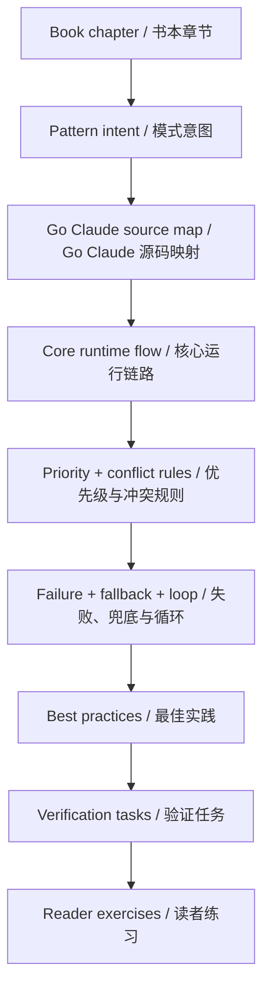
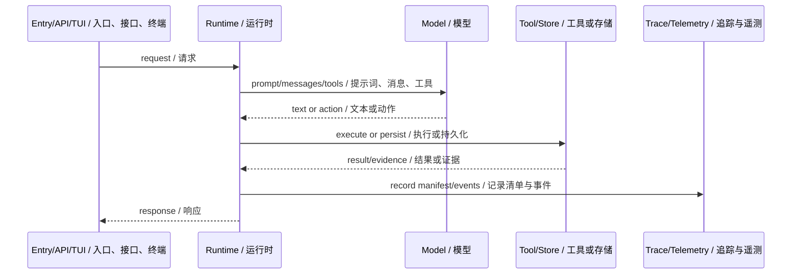
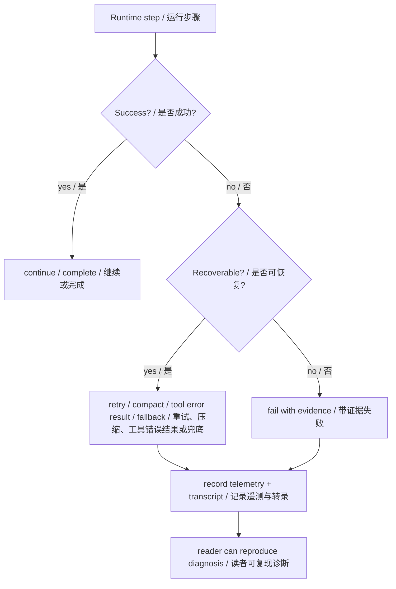
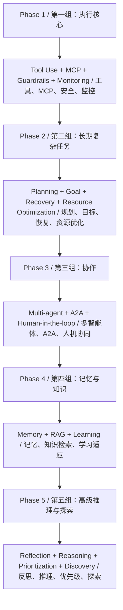

# 对照学习写作方法论

这份方法论用于后续继续编写《智能体设计模式（双语版）》与 Go Claude 的对照学习材料。目标是让读者获得“理论 + 源码 + 机制 + 图解 + 验证 + 最佳实践”的完整学习闭环，而不是停留在概念复述。

## 核心原则

每章都必须回答 6 个问题：

1. 这个模式在书里解决什么问题？
2. Go Claude 哪些源码真实实现了相同或相近的问题？
3. 运行链路是什么？数据从哪里来，往哪里去？
4. 顺序是什么，谁优先，冲突时怎么办？
5. 异常、失败、兜底、loop、权限、安全、观测怎么处理？
6. 读者如何验证？应该跑什么测试、查什么 trace、读什么文件？



## 标准写作流程

### 1. 先抽象书本模式

不要复制书本大段文字，只提炼：

- 模式名称。
- 它解决的问题。
- 典型输入和输出。
- 适用场景。
- 容易失败的地方。

产出应该是一段短理论，而不是书摘。

### 2. 建源码映射表

先用 `rg` 找真实代码，再写文档。每章至少列出：

- 核心 package / 文件。
- 关键函数或类型。
- 相关测试。
- 相关 docs。
- 当前未实现或仍在演进的部分。

推荐格式：

| 层级 | Go Claude 文件 | 学习重点 |
| --- | --- | --- |
| runtime | `internal/query/query.go` | 主 loop、tools、prompt context |
| state | `internal/session/store.go` | transcript、checkpoint、compact |
| safety | `internal/permissions` | 工具权限和审批 |
| docs | `docs/...` | 设计意图和验收边界 |

### 3. 写核心链路

用流程图或时序图说明数据怎么跑。读者必须能沿着图去读源码。



### 4. 写优先级和冲突裁决

这是对照学习最重要的部分。每章都必须有一张表回答：

| 冲突 | 谁优先 | 为什么 |
| --- | --- | --- |
| system vs memory | system | memory 是 durable guidance，不能覆盖高优先级指令 |
| tool request vs permission | permission | 安全边界比能力更硬 |
| fast path vs full agent loop | fast path | 当响应契约更重要时，禁工具更稳定 |

如果源码里没有明确实现，不能编造。要写成“当前差距”或“后续演进”。

### 5. 写异常、兜底和 loop

读者真正需要学习的是系统遇到不完美情况时怎么办：

- max turns reached。
- tool error result。
- permission denied。
- provider failure。
- structured output retry。
- auto compact。
- checkpoint / rewind / fork。
- background cancel / logs / run history。
- tenant/user isolation。
- telemetry 和 trace 排查路径。



### 6. 写最佳实践

最佳实践不要写空话，要来自 Go Claude 的工程取舍：

- 不把所有上下文塞进 system prompt。
- pending memory 不进入 prompt。
- code/chat prompt mode 必须隔离。
- 工具权限、sandbox、hook 比 skill 建议更硬。
- sub-agent 必须有独立 transcript 和事件。
- API 行为变化必须同步 Swagger/API docs。
- 观测字段不能泄露正文、密钥、私有 URL。

### 7. 写验证任务

每章至少给三类验证：

- 静态阅读：`rg` 或源码路径。
- 单元测试：具体 `go test` 命令。
- 运行时证据：curl、trace、telemetry、transcript、WebUI、DB 查询。

示例：

```bash
rg -n "effectiveSystemBlocks|LoadCode|query.prompt_context" internal docs
go test ./internal/query ./internal/memory -run 'PromptMode|LoadCode' -count=1
```

### 8. 设计读者练习

读者练习要逼近真实工程问题，而不是背概念：

- “如果 `CLAUDE.md` 和用户本轮要求冲突，应该听谁？”
- “为什么 structured fast path 要禁工具？”
- “sub-agent 为什么不能污染 parent registry？”
- “怎么证明某次请求进入了 chat 而不是 code？”

## 每章推荐结构

```text
# 第 N 章：模式名

## 书中理论要点
## Go Claude 的工程落点
## 源码映射表
## 架构图
## 运行链路
## 优先级与冲突处理
## 异常、兜底与恢复
## 最佳实践
## 源码阅读路线
## 如何验证
## 学习任务
## 当前差距
```

## 图示要求

每章至少 3 张图。图可以使用 GitHub README 原生支持的 Mermaid，也可以生成图片文件后引用；按场景选择，不为了形式统一牺牲表达效果。

| 图类型 | 用途 |
| --- | --- |
| 架构图 | 展示模块关系和边界。 |
| 时序图 | 展示一次请求或一次任务如何流转。 |
| 冲突/兜底图 | 展示失败、优先级、异常恢复怎么裁决。 |
| 信息图 | 展示学习路线、优先级矩阵、能力地图、最佳实践卡片。 |

复杂章节可以增加状态机图，例如 Goal、memory review、scheduler、permission approval。

选型规则：

| 场景 | 推荐形式 | 原因 |
| --- | --- | --- |
| 架构关系、流程、时序、状态机、决策树 | Mermaid | 文本可维护、GitHub 原生渲染、方便 review diff。 |
| 学习路线图、复杂信息图、视觉层级强的总结卡片 | 生成图片文件 | Mermaid 难以表达版式和视觉层级时，用图片提升读者理解。 |
| 需要长期跟随源码变动的图 | Mermaid | 修改成本低，不容易和源码脱节。 |
| 稳定的教学海报、章节总览、对外传播图 | 图片文件 | 视觉效果更好，适合读者收藏和分享。 |

图片文件建议放在当前目录下的 `assets/` 子目录，并在文档中使用相对路径引用。图片必须有可读文件名，例如 `assets/chapter-05-tool-use-lifecycle.png`，不要使用无语义截图名。

## 质量检查清单

提交前逐项检查：

- 是否引用了真实源码路径？
- 是否说明了顺序和优先级？
- 是否说明了冲突时谁赢？
- 是否有异常、失败、兜底、恢复路径？
- 是否至少 3 张图，并且 Mermaid/图片选择符合表达场景？
- 是否有具体测试或验证命令？
- 是否说明当前差距，而不是假装完成？
- 是否避免复制书中大段原文？
- 是否避免把上层业务规则硬编码成 Go Claude 中台规则？

## 后续章节建议重点

后续不要机械按第 4 章到第 21 章平铺推进。更合理的方式是按 Go Claude 的工程学习价值分组：先写执行核心，再写长期任务，再写协作、记忆和高级推理。这样读者能先掌握智能体系统的骨架，再逐步补齐高级能力。



### 第一组：智能体执行核心

优先写：

- 第 5 章：工具使用。
- 第 10 章：MCP。
- 第 18 章：安全护栏。
- 第 19 章：评估和监控。

这一组是 Go Claude 的骨架。重点不是“模型会调用函数”，而是要讲清楚 tool registry、tool schema、permission policy、sandbox、hook、tool result、trace、telemetry、eval harness 怎么组成一个可控的工具执行系统。

必须讲清楚：

- 工具如何注册、暴露给模型、执行和回灌。
- MCP tool 与普通 tool function calling 的边界。
- 工具请求和权限、沙箱、hook 冲突时谁优先。
- 工具失败如何变成 `tool_result`，而不是被 runtime 隐藏。
- telemetry、trace、golden tests 如何证明链路真实存在。

### 第二组：长期复杂任务

优先写：

- 第 6 章：规划。
- 第 11 章：目标设定与监控。
- 第 12 章：异常处理和恢复。
- 第 16 章：资源感知优化。

这一组讲 Go Claude 如何从“一问一答”走向“长期任务”。重点是 Goal、plan、evidence、budget、checkpoint、compact、background、scheduler、usage、prompt cache。

必须讲清楚：

- Goal plan 如何拆解 objective、steps、criteria、dependencies、risks。
- evaluator 如何判断 active、complete、blocked、failed。
- checkpoint、rewind、fork 如何支持恢复。
- auto compact 如何处理长上下文，而不是简单丢历史。
- background 和 scheduler 如何让任务脱离 TUI 生命周期继续运行。
- usage、quota、prompt cache 如何影响成本和性能。

### 第三组：多智能体和协作

优先写：

- 第 7 章：多智能体协作。
- 第 15 章：智能体间通信 A2A。
- 第 13 章：人机协同。

这一组讲协作边界。重点是 Task、sub-agent runtime、AgentCreate、agent messages、event stream、AskUserQuestion、permission prompt、PlanMode。

必须讲清楚：

- sub-agent 与普通工具调用的区别。
- 子智能体为什么要有独立 prompt、transcript、tool policy。
- agent message 和 event stream 如何支撑 A2A。
- 人类审批、权限提示和 PlanMode 何时介入。
- 多个 agent 结果冲突时 runtime 为什么不能静默裁决。

### 第四组：记忆、知识和学习

优先写：

- 第 8 章：记忆管理。
- 第 14 章：知识检索 RAG。
- 第 9 章：学习和适应。

这一组讲“长期上下文”如何安全进入智能体。重点是 pending/approved memory、tenant isolation、memory review、knowledge search、prompt context manifest、eval-driven improvement。

必须讲清楚：

- 显式 remember 和 AutoMem 为什么先进 pending，不直接 active。
- approved memory 如何进入 prompt context。
- tenant/user 隔离如何防止跨租户污染。
- RAG 与 memory 的区别：检索知识不是长期偏好。
- prompt context manifest 为什么只记录 metadata，不记录正文。
- 学习和适应必须经过 review、eval、telemetry，而不是模型自说自话。

### 第五组：高级推理和产品化

优先写：

- 第 4 章：反思。
- 第 17 章：推理技术。
- 第 20 章：优先级排序。
- 第 21 章：探索和发现。

这一组可以放后面写，因为它依赖前面工具、目标、记忆、观测等基础。重点是 evaluator、recap、review/fix loop、reasoning、WebSearch/WebFetch、调查式工作流、任务排序。

必须讲清楚：

- 反思不是模型自夸，而是带 evidence 的 review/fix loop。
- 推理技术要落到 prompt、thinking stream、structured output、goal evaluator。
- 优先级排序要结合 budget、risk、dependencies、user intent。
- 探索发现要靠工具和证据，不靠猜。

### 每章完成标准

后续每章写完后，读者应该能做到：

- 说出这个模式为什么需要。
- 指出 Go Claude 哪些源码实现了这个模式。
- 画出正常路径和失败路径。
- 解释优先级、冲突、异常和兜底。
- 跑一个测试或命令验证它真的存在。
- 总结一条能迁移到自己智能体系统的最佳实践。

如果一章只能让读者“知道概念”，但不能让读者读源码、跑验证、理解坏情况，就不算合格。

## 后续章节机制索引

| 章节 | 必须重点写清楚的机制 |
| --- | --- |
| 反思 | evaluator、recap、review/fix loop、证据门禁。 |
| 工具使用 | registry、schema、permission、sandbox、hook、tool result。 |
| 规划 | Goal plan、steps、criteria、evidence、budget。 |
| 多智能体协作 | Task、AgentCreate、agent messages、event stream。 |
| 记忆管理 | pending/approved、tenant isolation、review、prompt context manifest。 |
| MCP | tool adapter、RPC、callback permission、资源边界。 |
| 目标设定与监控 | Goal status machine、checkpoint、blocked/complete evidence。 |
| 异常处理和恢复 | max turns、rewind/fork、provider retry、background logs。 |
| 人机协同 | AskUserQuestion、permission prompt、PlanMode。 |
| 安全护栏 | permission classifier、sandbox、sensitive data redaction。 |
| 评估和监控 | telemetry、trace viewer、eval harness、golden tests。 |

## 总结

对照学习不是“书本概念 + 项目截图”。真正有价值的写法是：从模式问题出发，落到 Go Claude 的源码和运行机制，再把优先级、冲突、异常、兜底、最佳实践和验证证据讲清楚。读者读完一章，应该能回答“这个模式为什么需要、系统怎么实现、坏情况怎么处理、我如何验证它真的存在”。
