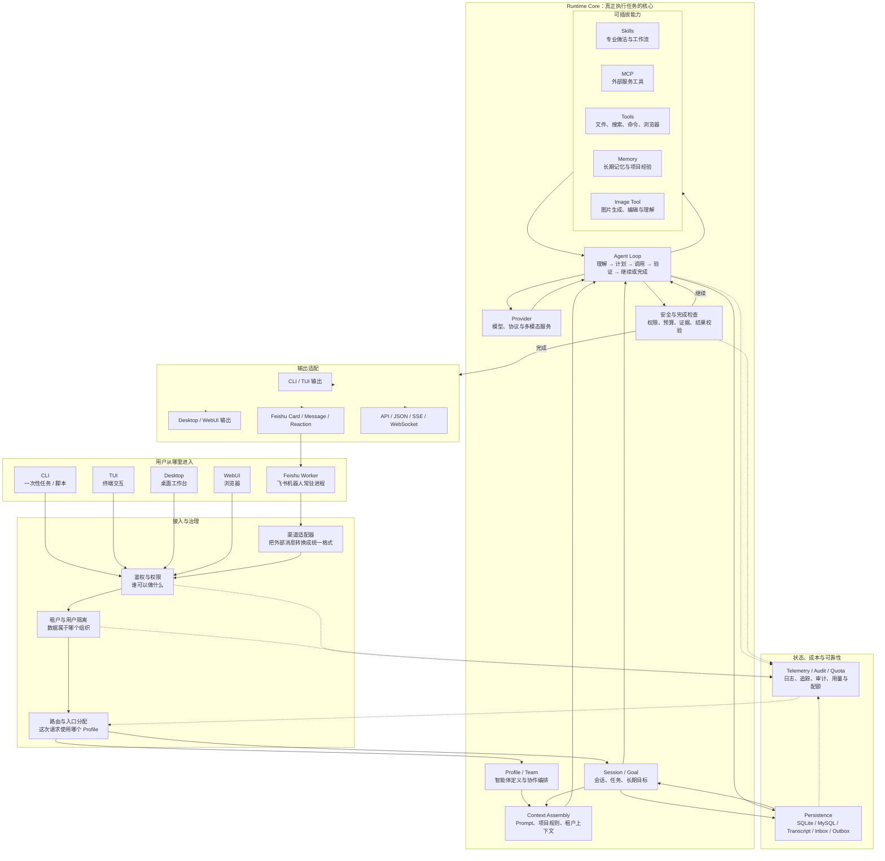

# go-e2e 产品架构总览

这是一张面向用户、贡献者和运维人员的产品级架构图。它回答一个简单问题：

> 用户从 CLI、桌面、WebUI 或飞书发来一句话后，系统怎样把它变成可验证的结果？

图中的 `Runtime Core` 是概念上的运行时边界，不表示仓库中一定存在一个名为
`runtime-core` 的目录。它代表一组共同协作的能力：会话装配、Agent Loop、工具、
模型、权限、持久化和输出适配。

## 总览图

GitHub 会直接渲染下面的 Mermaid 图；也可以打开独立的 Mermaid 源文件：
[agent-platform-architecture.mmd](../../diagrams/agent-platform-architecture.mmd)。



## 小白版：每一层在做什么

可以把系统想成一个“会执行任务的工作台”：

1. **入口**：CLI、TUI、桌面、WebUI 和飞书，都是用户递交任务的不同窗口。
2. **接入与治理**：先确认用户是谁、属于哪个租户、是否有权限，再决定这次请求走哪个入口配置。
3. **Runtime Core**：系统真正理解任务、拆步骤、调用能力、检查结果并决定是否继续的地方。
4. **能力插件**：Skills 提供专业工作方法，MCP 连接外部服务，Tools 操作文件和命令，
   Memory 提供长期经验，Image Tool 处理图片。
5. **Provider**：真正提供语言或视觉模型能力的服务。它可以是不同厂商、不同协议或不同模型。
6. **状态与可靠性**：保存会话、任务、消息、重试和外发记录，并记录日志、审计、用量和配额。
7. **输出适配**：把结果变成终端文本、桌面/WebUI 消息、飞书卡片，或 API 的 JSON/SSE/WebSocket。

最重要的闭环是：

```text
输入
-> 鉴权与租户隔离
-> 选择 Profile
-> Agent Loop 调用模型和能力
-> 权限与完成检查
-> 保存过程和结果
-> 输出到原来的渠道
```

## 设置项怎么理解

设置中心里的对象分别位于不同层次。它们有关联，但不是同一个东西：

| 设置项 | 一句话理解 | 负责什么 | 不负责什么 |
| --- | --- | --- | --- |
| **Profile** | “这个智能体是什么样、怎么工作” | 身份、提示词、模型、工具、Skills、Memory、预算和权限策略 | 不负责决定哪个入口使用它，也不负责启动飞书进程 |
| **Team** | “多个智能体怎样分工” | 成员、角色、协作顺序、协调者和最终输出 | 不复制成员 Profile 的详细能力配置 |
| **Assignment** | “哪个入口使用哪个已发布 Profile” | 把租户、用户或入口映射到某个 Profile 版本 | 不修改 Profile 内容，也不连接飞书账号 |
| **Feishu** | “连接哪一个飞书机器人和会话” | App、Bot Account、群聊/私聊、消息适配和外部回传 | 不定义智能体的工作方式，也不等于一个运行进程 |
| **Worker** | “让飞书机器人持续在线的进程” | 启动、停止、重启、健康检查、日志和消息消费 | 不替代 Profile、Assignment 或 Feishu 账号配置 |

可以用四个问题快速区分：

```text
Profile：智能体怎么工作？
Assignment：哪个入口用它？
Feishu：连接哪个飞书机器人和会话？
Worker：这个机器人现在有没有在运行？
```

### Profile、Assignment、Feishu、Worker 的关系

```text
Profile（定义能力）
    -> Publish（发布不可变版本）
Assignment（把入口映射到版本）
    -> Runtime Core（执行任务）
Feishu Bot Account（外部身份）
    -> Feishu Adapter
Worker（常驻进程）
    -> 接收消息并把请求交给 Runtime Core
```

一个 Feishu Worker 可以承载一个 Bot Account 的长连接；它不等于一个 Profile。
一个 Profile 可以被多个入口复用；它也不等于一个 Worker。Assignment 是中间的路由关系，
用来决定“这次请求应该使用哪个已发布版本”。

### Team 与飞书群不是一回事

- **飞书群**是外部聊天容器，里面有用户、机器人和消息。
- **Agent Team**是系统内部的协作配置，可以把多个 Profile 绑定成 coordinator、coder、
  reviewer 等角色。
- 一个飞书群可以绑定一个 Team，也可以只使用普通的单 Agent 路由。

## 与已有专题文档的关系

- [Profile、Team 与渠道术语](agent_profile_channel_glossary.md)
- [WebUI 2.0 设置中心](webui_v2_settings_center.md)
- [渠道 Worker 运维](channel_worker_screen_operations.md)
- [全局运行时拓扑 Mermaid 源文件](../../diagrams/global-runtime-topology.mmd)
- [架构图 Mermaid 源文件](../../diagrams/agent-platform-architecture.mmd)
