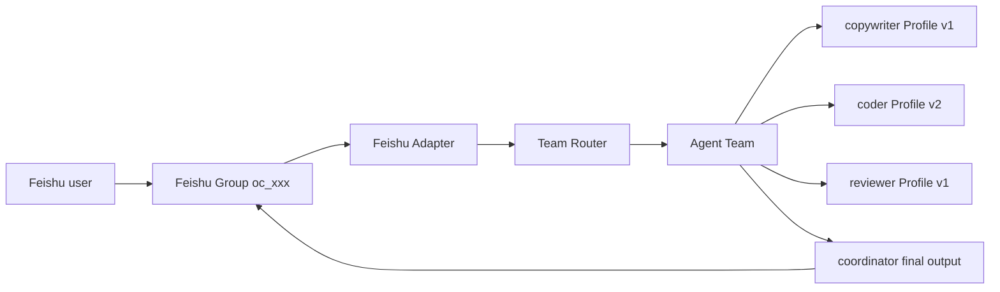

# Agent Profile 与渠道术语

本文统一定义 Agent Profile、Feishu 渠道、DM、Team 和 worker 运维相关术语，避免把产品对象、消息入口和运行进程混为一谈。

## 核心对象

## Profile 与 Team 的边界

它们不是重复对象，而是两个层次：

| 对象 | 负责什么 | 不负责什么 |
| --- | --- | --- |
| Agent Profile | 一个智能体的身份、提示词、模型/provider、工具、上下文、预算、权限和安全策略 | 不描述其他智能体如何协作，也不直接代表一个飞书群 |
| Agent Team | 协作关系和编排：成员、角色、固定 Profile 版本、协调模式、群绑定、mailbox、运行记录和最终输出策略 | 不复制或覆盖成员 Profile 的能力配置 |

可以把它理解为：`Profile = 一个人怎么工作`，`Team = 多个人如何分工协作`。一个 Profile 可以加入多个 Team；一个 Team 也可以固定多个 Profile 的不同版本。修改 Profile 不会自动修改已经发布的 Team，Team 必须重新校验和发布才能升级成员版本。

| 术语 | 定义 | 典型标识/例子 |
| --- | --- | --- |
| Agent | 能接收输入、调用模型和工具并返回结果的运行时智能体 | 文案助手、编码助手 |
| Agent Profile | Agent 的版本化执行配置，包含 persona、prompt mode、工具、上下文、模型、预算和安全策略 | `my-copywriter@v1` |
| Profile version | 已发布 Profile 的不可变版本；Team 成员固定引用版本，避免运行中配置漂移 | `profile_key=my-copywriter, version=1` |
| Profile scope | Profile 可见和可编辑范围 | `builtin`、`tenant_shared`、`user_private` |
| Profile assignment | 把某个 tenant/user/surface 映射到已发布 Profile version 的路由配置 | `web_chat -> my-copywriter@v1` |
| Surface | Profile assignment 的使用入口，不是消息平台 | `web_chat`、`mobile_chat`、`tenant_agent`、`channel_dm`、`channel_team` |
| Feishu Bot Account | 一个飞书应用机器人身份及其 channel account 记录 | `account_key=copywriter-feishu` |
| Worker | 持有一个 Feishu Bot Account 长连接、消费 Inbox 并运行 Agent 的常驻进程 | 独立 Go binary + `screen` |

## Feishu 消息入口

| 术语 | 定义 | 关键字段 |
| --- | --- | --- |
| Feishu Group | 飞书群会话，是消息发生的外部容器 | `external_conversation_id=oc_...`、`chat_type=group` |
| DM / Direct Message | 用户和 Bot 的一对一私聊，是一种消息入口类型，不是 Profile 或数据源 | `chat_type=p2p`、`external_user_id=ou_...` |
| Mention | 群消息中对 Bot 的 `@`，普通群路由通常要求 mention | `mentioned_bot=true`、`mentions[]` |
| Channel Provider | 外部消息平台适配器 | 当前主要是 `feishu` |
| Inbound Event | Provider 推送给 Adapter 的原始事件 | 飞书 `im.message.receive_v1` |
| Inbound Message | Adapter 归一化后的 provider-neutral 消息对象 | provider、account、message、chat、user、text、mentions、attachments |
| External Message ID | 外部平台消息 ID，用于幂等、回复、reaction 和 readback | `om_...` |

DM 和 Group 的关系：二者都是 Feishu 消息入口，区别在 `chat_type` 和会话参与者；DM 不代表一个独立数据源。运行时读取的输入统一来自 Adapter 归一化后的 `InboundMessage`。

## Team 与群组

**Team 不是 Feishu Group。**

- Feishu Group 是真实聊天容器，保存用户、Bot 和消息。
- Agent Team 是系统内部的协作编排配置，可以绑定一个 Feishu Group 和多个 Bot Account。
- 一个 Team 可以包含多个固定 Profile version，并指定 coordinator、coder、reviewer 等角色。
- 一个群可以没有 Team，也可以绑定一个 Team；一个 Team 可以在不同版本中重新绑定群组。



## 运行时持久化术语

| 术语 | 作用 |
| --- | --- |
| Inbox | 持久化入站事件，负责幂等、重试、租约和处理状态 |
| ChannelRun | 普通渠道执行的生命周期记录，关联 conversation、message、outbox 和 terminal status |
| TeamRun | 一次 Team 编排记录，关联 Team version、Inbox event、成员结果、预算、mailbox 和最终结果 |
| Team member | Team 中的一个角色实例，固定引用一个 Profile version，并可绑定一个 Bot Account |
| Mailbox | Team 内部成员之间的持久化协作消息，不直接发送到外部群组 |
| Outbox | 待发送到 Feishu 的可靠外发消息，负责 lease、retry、receipt 和幂等 |
| Reaction | 对外部消息的处理状态反馈，通常为 `Typing -> DONE/ERROR` |
| Streaming Card | Feishu 可更新的交互卡片；模型文本增量通过 PATCH 写入同一个外部消息 |
| Provider | 模型服务配置，包括 named provider、协议、endpoint 和 model |
| Payload key | Inbox/Interaction payload 的加密密钥；必须跨 worker restart 稳定复用，不能每次重启重新生成 |

## 三条典型路径

### 普通 DM

```text
Feishu DM
-> Adapter
-> InboundMessage(chat_type=p2p)
-> Inbox/ChannelRun
-> Profile 或默认 runtime
-> query/model
-> Channel Outbox 或 Streaming Card
```

### 普通群聊

```text
Feishu Group @Bot
-> Adapter
-> mention/policy check
-> Inbox/ChannelRun
-> 普通 channel runner
-> Card/Outbox
```

### Team 群聊

```text
Feishu Group @coordinator
-> Adapter
-> Team Router
-> 公共 Inbox/ChannelRun/reaction lifecycle
-> pinned Team Profile members
-> TeamRun + mailbox
-> coordinator streaming/final Card
-> Outbox/readback
```

Team 群聊和普通群聊共享公共渠道生命周期；差异只在执行策略是普通 runner 还是 Team orchestrator。

## 一键向导 V1 范围

V1 的目标是让用户在 WebUI 中完成一个 Profile/Feishu worker 的本机生命周期：

```text
Create Profile
-> Validate
-> Publish
-> 保存 Feishu App ID/Secret 到受保护凭据存储
-> 创建/绑定 channel account
-> 配置 provider/model/streaming/reaction
-> 复用稳定 payload key
-> 编译独立 worker binary
-> screen start/restart/stop/status/log
-> provider、WebSocket、reaction health check
```

V1 明确限定：

- 部署目标是当前机器。
- 常驻方式是独立 Go binary + `screen`。
- 外部平台是 Feishu。
- App Secret 不写入 Profile JSON、普通日志或命令行展示。
- payload key 由首次创建/导入时生成或录入，后续 restart 只复用。
- 所有 start/restart/stop/bind/publish 操作需要角色权限和审计记录。

V1 不实现 systemd、launchd、Docker、Kubernetes 等 supervisor，但控制面设计保留适配边界：

```text
WorkerSupervisor
├── ScreenSupervisor       (V1)
├── SystemdSupervisor      (future)
├── ContainerSupervisor    (future)
└── KubernetesSupervisor   (future)
```

这些 supervisor 共享 account identity、desired state、health、logs、restart 和 fencing contract，未来替换进程托管方式时不改变 Profile、Team、Inbox、Outbox 或 Feishu Adapter 协议。

## 当前实现边界

- WebUI 已支持 Agent Profiles Catalog/Editor/Validate/Publish/Versions/Assignment/Binding，以及 Agent Teams Builder/Binding/Run Monitor。
- Profile 文档当前使用严格 JSON，不支持直接加载 `profile.yaml`；`config/config.yaml` 不是 Profile 存储。
- WebUI/API 支持 `profile_id`、`profile_version`、`profile_surface` 请求字段。
- `channel_team` 已使用固定 Profile version；普通 Feishu `channel_dm` assignment 仍需要继续接入自动解析，不能把 Assignment 页面存在误认为 DM runtime 已自动切换。
- Feishu worker 是 account 级进程；Profile/Team 是控制面配置，二者不是一一对应的进程。
- Profile 来源分为 `builtin`、`database`、`file`、`generated`。当前 WebUI 对数据库 Profile 展示 `agent_profiles/{id}` 逻辑引用并明确标注“无本地文件”；只有真正的文件导入 Profile 才展示 `source_path`。
- Profile 页面“对话”工作台是只读聚合视图：DM/群聊摘要来自绑定 account 的 `channel_conversations`，完整正文复用 tenant session/message；Team 成员关系来自 `agent_team_members`，不复制或改写原始 transcript。
- WebUI 的「一键向导」入口位于 Agent Profiles -> Provisioning，V1 只负责本机 screen supervisor；systemd、Docker、Kubernetes 仍是后续适配器。
- 向导的 provider 下拉来自 `GET /v1/providers`，只展示 named provider/model；worker 状态来自 `/tenant/agent-provisionings`，不会在前端解析 settings.json。

## 相关文档

- [Agent Profile/Team WebUI 方案](agent_profile_webui_plan.md)
- [Feishu worker 运维说明](channel_worker_screen_operations.md)
- [WebUI 使用说明](../usage/webui.md)
- [API Server Profile/Team 接口](../api_server.md)
