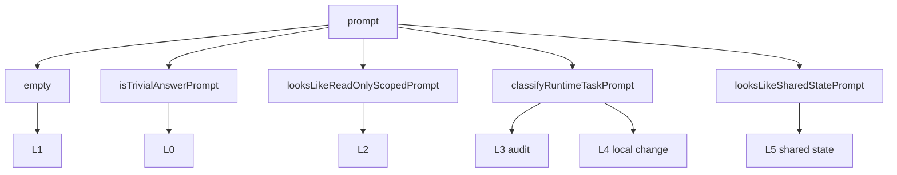
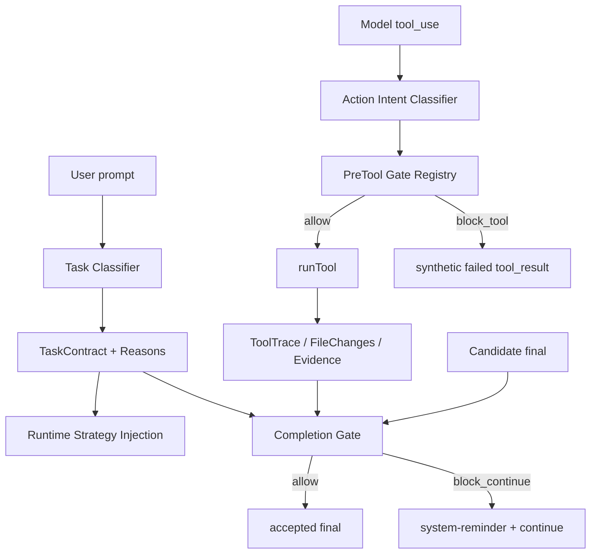

# Closure Gate Classifier 优化技术方案

更新时间：2026-07-10

本文档记录 `TaskContract` / closure level / gate classifier 的下一阶段优化方案。目标不是把所有规则都交给模型判断，而是把当前散落的硬编码关键词和 `if` 链路工程化：规则可解释、优先级显式、测试矩阵完整，同时保留 Go runtime 对工具执行和 final claim 的硬约束。

## 背景

当前闭环控制面已经具备基础硬约束：

- `buildTaskContract(prompt)` 根据用户 prompt 生成 `taskContract`。
- `completionGate(contract, calls, finalText)` 在 final 前阻断缺证据结论。
- `preToolClosureGate(contract, prompt, calls, toolName, input)` 在工具执行前阻断高风险 Bash 操作。
- `ToolTrace` / `FileChanges` / read evidence / post-action checks 是 gate 的主要事实来源。

当前核心代码路径：

| 模块 | 当前职责 |
| --- | --- |
| `internal/query/closure_gate.go` | closure level、`taskContract`、L0/L2/L5 prompt 判断、completion/pre-tool gate |
| `internal/query/query.go` | runtime task classifier、audit/repair strategy 注入、主 run loop 调度 gate |
| `internal/query/query_test.go` | runtime task classifier matrix、gate 行为回归测试 |
| `scripts/closure-gate-acceptance.sh` | 真实 CLI stub 链路验收 Read Scope Gate / Final Claim Gate |

## 当前问题

### 1. 规则散落

当前分类逻辑分布在多个文件：

- L0 / L2 / L5 的 prompt 判断在 `closure_gate.go`。
- L3 / L4 的 runtime task 判断在 `query.go`。
- audit strategy 和 repair strategy 也在 `query.go`。

这会导致读者必须跨文件追踪“为什么这个 prompt 被分到某个 level”。

### 2. 优先级隐式

`buildTaskContract` 是固定顺序：



这个顺序本身是策略，但现在没有结构化表达。新增关键词或新任务类型时，容易因为先后顺序产生误判。

### 3. 不可解释

当前 `taskContract` 只记录结果：

```go
type taskContract struct {
    ClosureLevel          closureLevel
    RequiredReadPath      []string
    SharedStateOperations []sharedStateOperation
}
```

它不记录：

- 命中了哪条规则。
- 哪些关键词或路径触发了规则。
- 哪些更高优先级规则被跳过。
- 分类置信度或 fallback 原因。

线上排查时只能读源码或复现 prompt。

### 4. 分类和安全边界容易混淆

`ClosureLevel` 是任务级风险标签，但真正安全边界应该来自实际动作：

- prompt 可能没有命中 L5，但模型仍可能调用 `git push`。
- prompt 命中 L5，也不代表所有 shared-state 操作都可执行。
- 是否允许执行工具，必须看 `toolName + input + prior ToolTrace evidence`。

当前 `preToolClosureGate` 已经按实际 Bash intent 做硬拦截，这是正确方向。优化时不能退回到“只靠 prompt 分类决定安全”。

### 5. 测试矩阵不够完整

当前已有 `TestRuntimeTaskClassifierMatrix`，但还缺少完整的 contract 级矩阵：

- prompt -> closure level
- prompt -> required read paths
- prompt -> shared state operations
- prompt -> classification reasons
- tool action + prior traces -> pre-tool gate allow/block
- final claim + traces -> completion gate allow/block

## 设计目标

| 目标 | 说明 |
| --- | --- |
| 可解释 | 每次分类都能记录 rule id、命中原因和关键 evidence |
| 可测试 | 分类和 gate 都有矩阵测试，新增规则必须补 case |
| 可扩展 | 新增 L3/L4/L5 子类型时，不继续堆散落 `if contains` |
| 保持硬约束 | 高风险工具动作仍由 Go gate 阻断，不依赖提示词或模型自觉 |
| 低风险迁移 | 先保持现有行为不变，再逐步重构为规则表 |
| 轻重分层 | L0/L1 继续轻量，不能被重型 audit prompt 拖慢 |

## 非目标

- 不把 L0-L5 分类交给 LLM 决定。
- 不在第一阶段引入 YAML/JSON 外部规则配置。
- 不把所有 gate 都强行绑定到 closure level。
- 不把当前 closure gate 改成复杂工作流引擎。
- 不扩大默认权限，不弱化 `git push` / `deploy` / `publish` 等高风险动作的硬约束。

## 目标架构

推荐拆成三层：



核心原则：

1. `TaskClassifier` 只负责理解用户任务意图。
2. `ActionIntentClassifier` 只负责理解模型即将执行的工具动作。
3. `CompletionGate` 只负责检查 final claim 是否被 evidence 支撑。
4. `PreToolGate` 只负责高风险工具动作是否允许执行。

## 数据结构设计

### TaskContract 增加解释字段

建议演进为：

```go
type taskContract struct {
    ClosureLevel          closureLevel
    RequiredReadPath      []string
    SharedStateOperations []sharedStateOperation
    Reasons               []classificationReason
    Confidence            classificationConfidence
}

type classificationReason struct {
    RuleID    string `json:"rule_id"`
    Matched   string `json:"matched,omitempty"`
    Detail    string `json:"detail,omitempty"`
    Priority  int    `json:"priority,omitempty"`
}

type classificationConfidence string

const (
    classificationHigh   classificationConfidence = "high"
    classificationMedium classificationConfidence = "medium"
    classificationLow    classificationConfidence = "low"
)
```

示例 transcript 事件：

```json
{
  "type": "task_contract",
  "closure_level": "L3_investigation_audit",
  "reasons": [
    {"rule_id":"repo_health_audit", "matched":"repo health", "priority":300},
    {"rule_id":"audit_intent", "matched":"audit", "priority":300}
  ],
  "confidence": "high"
}
```

### TaskRule 规则表

第一阶段仍保留 Go 代码规则，不引入外部配置：

```go
type taskClassifierRule struct {
    ID       string
    Priority int
    Match    func(taskClassifierInput) (taskClassifierMatch, bool)
}

type taskClassifierInput struct {
    Raw        string
    Normalized string
    Paths      []string
}

type taskClassifierMatch struct {
    Level                 closureLevel
    RequiredReadPath      []string
    SharedStateOperations []sharedStateOperation
    Reasons               []classificationReason
    Confidence            classificationConfidence
}
```

规则按 `Priority` 从高到低执行，命中后返回。这样优先级从隐式 `if` 链变成显式数据。

### ActionIntent 与 TaskLevel 分离

新增或整理工具动作意图：

```go
type actionIntent struct {
    ToolName string
    Kind     actionIntentKind
    Command  string
    ReadOnly bool
    Risk     actionRisk
}

type actionIntentKind string

const (
    actionIntentReadOnlyBash   actionIntentKind = "read_only_bash"
    actionIntentWorkspaceWrite actionIntentKind = "workspace_write"
    actionIntentGitCommit      actionIntentKind = "git_commit"
    actionIntentGitPush        actionIntentKind = "git_push"
    actionIntentGitTagMutate   actionIntentKind = "git_tag_mutate"
    actionIntentExternalWrite  actionIntentKind = "external_write"
)
```

当前 `classifyShellIntent(command)` 已经承担一部分职责。优化时应先包装而不是重写，降低行为漂移风险。

## 规则表设计

### TaskClassifier 规则建议

| Rule ID | Priority | 输出 | 触发条件 |
| --- | ---: | --- | --- |
| `empty_prompt` | 1000 | L1 | prompt normalize 后为空 |
| `trivial_arithmetic` | 950 | L0 | 简单数字四则运算正则 |
| `read_only_scoped` | 900 | L2 | 读/总结/解释/对比关键词 + 本地路径 |
| `release_readiness_audit` | 800 | L3 | release/publish/version/tag/install + audit/check/risk |
| `entrypoint_audit` | 790 | L3 | entrypoint/command/hook/cli + audit/check/risk |
| `repo_health_audit` | 780 | L3 | repo/project/codebase scope + audit/health/risk/gap |
| `release_repair` | 700 | L4 | fix/repair/create/push + release/version/tag/install |
| `entrypoint_repair` | 690 | L4 | fix/repair + entrypoint/command/hook/script 或 slash path |
| `metadata_repair` | 680 | L4 | fix/repair + package/readme/go.mod/metadata |
| `focused_code_change` | 650 | L4 | bug/panic/implement/refactor/修复/实现 |
| `shared_state_request` | 600 | L5 | commit/push/tag/deploy/publish/提交/推送 |
| `default_no_tool` | 0 | L1 | 其他 |

注意：当前实现中 repair 判断先于 audit 判断。是否调整优先级必须通过矩阵测试决定，不能直接改行为。

### PreToolGate 规则建议

| Rule ID | 触发 | 硬约束 |
| --- | --- | --- |
| `git_commit_requires_scope` | Bash intent 是 `git_commit` | 必须有 staged scope evidence |
| `destructive_git_requires_authorization` | force push / tag delete / tag move | prompt 必须明确授权 destructive operation |
| `git_push_requires_branch_object_remote` | Bash intent 是 `git_push` | 必须有 branch/object + remote/upstream evidence |
| `git_tag_requires_tag_state` | Bash intent 是 mutating tag | 必须有 branch/object + local/remote tag state evidence |
| `external_write_requires_authorization` | deploy/publish/send/release | prompt 必须明确授权外部副作用 |

这部分应该保持硬 gate，不变成软提示。

### CompletionGate 规则建议

| Rule ID | 触发 | 硬约束 |
| --- | --- | --- |
| `read_scope_requires_evidence` | L2 且 final 声称已读/总结 | 必须有匹配 `RequiredReadPath` 的 Read/Grep/Glob/LS/read-only Bash evidence |
| `delta_requires_post_checks` | 有 FileChanges/write-like delta 且 final 声称完成 | 最新 delta 后必须有 scope/metadata/semantic check |
| `searched_claim_requires_evidence` | final 声称 searched/inspected | 必须有 local read/search evidence |
| `full_repo_claim_requires_broad_evidence` | final 声称 whole repo/all files | 必须有 broad local search evidence |
| `tested_claim_requires_successful_check` | final 声称 tests/checks passed | 必须有成功 verification Bash |
| `commit_claim_requires_readback` | final 声称 committed | 必须有成功 git commit + post-commit verification |
| `push_claim_requires_readback` | final 声称 pushed | 必须有成功 git push + post-push verification |
| `external_claim_requires_action` | final 声称 deployed/published/sent | 必须有成功 external action evidence |

## 迁移方案

### 当前实施状态

| Phase | 状态 | 说明 |
| --- | --- | --- |
| Phase 1：解释字段 | DONE | `taskContract` 已增加 `Reasons` / `Confidence`，`task_contract` transcript event 会记录分类原因；已补 `TestTaskContractClassifierMatrix` 和 golden。 |
| Phase 2：TaskClassifier 规则表 | DONE | `buildTaskContract` 已改为遍历 `taskClassifierRules`，规则带 `ID` / `Priority` / `Match`，并用测试锁定优先级顺序和兼容边界。 |
| Phase 3：PreToolGate 规则表 | DONE | `preToolClosureGate` 已改为遍历 `preToolGateRules`，每条 Bash 风险 gate 有 `ID` / `Priority` / `Check`，被 block 的 `completion_gate` transcript event 会记录 `rule_id`。 |
| Phase 4：CompletionGate 规则表 | DONE | `completionGate` 已改为遍历 `completionGateRules`，final 前 block 会带 `rule_id` 和 `missing_evidence`。 |
| Phase 5：UI/Trace 展示 | DONE | 本地 trace API 已纳入 closure events，`task_contract` / `completion_gate` 会解析为 event properties；内置 trace viewer 增加 Closure filter，并展示 rule id、severity、missing evidence / reasons 摘要。 |

### Phase 1：只加解释字段，不改行为

目标：最小风险提升可观测性。

改动：

1. `taskContract` 增加 `Reasons` / `Confidence`。
2. 保持 `buildTaskContract` 当前判断顺序不变。
3. 每个分支补充固定 reason。
4. `task_contract` transcript event 记录 reasons。
5. 增加 `TestTaskContractClassifierMatrix`。

验收：

```bash
go test ./internal/query -run 'TestTaskContract|TestRuntimeTaskClassifierMatrix' -count=1
scripts/closure-gate-acceptance.sh --force
git diff --check
```

### Phase 2：抽出 TaskClassifier 规则表

目标：把隐式 if 链变成显式 priority rule registry。

改动：

1. 新增 `internal/query/task_classifier.go`。
2. 定义 `taskClassifierRule` 和 `classifyTaskContract(prompt)`。
3. 迁移 L0/L2/L3/L4/L5 规则，但保持行为与 Phase 1 一致。
4. 通过 matrix tests 锁住兼容性。

验收：

```bash
go test ./internal/query -run 'TestTaskContractClassifierMatrix|TestRuntimeTaskClassifierMatrix' -count=1
go test ./... -count=1
```

### Phase 3：PreToolGate 规则表化

目标：把 `preToolClosureGate` 的 Bash `if` 链变成命名 gate rules。

改动：

1. 新增 `preToolGateRule`。
2. 每条 rule 提供 `ID`、`Priority`、`Check`，并在命中时返回原有用户可见 `Reminder`。
3. `completion_gate` transcript event 记录 `rule_id`。
4. 补充 git commit/push/tag/external action matrix tests。

当前实现：

- `preToolClosureGate(contract, prompt, calls, toolName, input)` 对非 Bash 工具直接 allow。
- Bash 工具先解析 `command := bashCommandFromInput(input)`，再通过 `classifyShellIntent(command)` 得到 deterministic intent。
- `preToolGateRules` 按优先级顺序短路执行，当前顺序是：
  - `pre_commit_scope`：`git commit` 前必须有当前 session 的 scope/staged evidence。
  - `destructive_shared_state`：force push、远端 tag 删除/移动等破坏性共享状态操作必须被用户 prompt 明确授权。
  - `shared_state_git_push`：普通 push 或已授权的 destructive push 前必须有 branch/object/remote evidence。
  - `shared_state_git_tag`：tag mutation 前必须有 branch/object/tag-state evidence。
  - `external_action_authorization`：deploy/publish/release/send 等外部副作用必须被用户 prompt 明确授权。
- `completionGateResult` 增加 `RuleID` 字段。工具执行前被阻断时，`query.Session.run` 会把 `rule_id` 写入 `completion_gate` transcript event。

验收：

```bash
go test ./internal/query -run 'TestPreTool|TestPreCommit|TestSharedState|TestGitTag' -count=1
scripts/closure-gate-acceptance.sh --force
```

### Phase 4：CompletionGate 规则表化

目标：让 final 前 gate 的阻断原因可解释、可扩展。

改动：

1. 新增 `completionGateRule`。
2. 把原先的 read scope、post-action delta、final claim 检查拆成命名 rule。
3. 返回结构包含 `RuleID`、`MissingEvidence`、`Reminder`。
4. 保持用户可见 reminder 简洁，结构化细节写 transcript。

当前实现：

- `completionGate(contract, calls, finalText)` 对空 final 直接 allow。
- 非空 final 会按 `completionGateRules` 顺序短路：
  - `read_scope`：L2 read-only scoped final 缺少读证据，或只读片段却声称全文覆盖。
  - `post_action_delta`：本轮有文件/共享状态 delta，final 又声称 fixed/done/completed，但缺 scope / metadata / semantic check。
  - `final_claim`：final 声称 searched/tested/committed/pushed/tagged/deployed/no issues found，但本轮没有对应证据。
- `completionGateResult` 包含 `RuleID` 和 `MissingEvidence`。`query.Session.run` 写入 `completion_gate` transcript event 时，会同步写入 `rule_id` 和 `missing_evidence`。

验收：

```bash
go test ./internal/query -run 'TestCompletionGate|TestReadScope|TestFinalClaim|TestDelta' -count=1
scripts/closure-gate-acceptance.sh --force
go test ./... -count=1
```

### Phase 5：Trace 展示

目标：让闭环判定不只存在于 transcript raw JSON 中，而是进入本地 trace 的结构化事件流。

改动：

1. `internal/server/trace.go` 把 `task_contract`、`completion_gate`、`action_record`、`evidence_record`、`delta_record` 纳入 local trace events。
2. closure event 的 JSON content 会解析到 `traceEvent.properties`。
3. `completion_gate` 的 `severity=block_*` 会映射到 trace event `status`，并标记 `is_error=true`，便于错误/阻断过滤。
4. `internal/server/trace_viewer.html` 增加 `Closure only` 过滤，并在事件列表直接显示 `rule_id`、`severity`、`missing_evidence` 或 task contract `Reasons`。

后续仍可选但不属于本轮闭环完成项：

- 对含糊 prompt 生成更细的 `classificationConfidence=medium/low`。
- 评估是否需要外部 YAML 配置。只有当规则稳定且需要非开发人员维护时再考虑。

## 测试矩阵建议

### TaskContract 分类矩阵

| Case | Prompt | Expected |
| --- | --- | --- |
| trivial | `1+1=?` | L0 |
| normal answer | `解释一下 goroutine 是什么` | L1 |
| scoped read | `读取 README.md，总结项目做什么` | L2 + `README.md` |
| repo audit | `Run a repo health audit and find gaps.` | L3 |
| entrypoint audit | `Audit this repository for user entrypoint risks.` | L3 |
| focused repair | `Fix project issue #123: parser panics.` | L4 |
| release repair | `创建 v2.4.3 tag 并推送` | L4 或兼容当前分类 |
| shared push | `Push this branch to the remote.` | L5 |
| negative audit | `分析这个函数需要优化的地方，不要审计整个项目` | L1 或 unknown fallback |

### PreToolGate 矩阵

| Case | Prior ToolTrace | ToolUse | Expected |
| --- | --- | --- | --- |
| commit missing scope | none | `git commit -m x` | block_tool |
| commit with staged scope | `git status --short && git diff --cached --name-status` | `git commit -m x` | allow |
| push missing remote | branch/head only | `git push` | block_tool |
| push with remote | branch/head + upstream | `git push` | allow |
| tag missing tag state | branch/head only | `git tag v1.0.0` | block_tool |
| external write no auth | none | `npm publish` | block_tool |

### CompletionGate 矩阵

| Case | Prior ToolTrace | Final | Expected |
| --- | --- | --- | --- |
| L2 no read | none | `已总结 README.md` | block_continue |
| L2 read evidence | `Read README.md` | `已基于 README.md 总结` | allow |
| no search evidence | none | `I inspected the entire repository.` | block_continue |
| no test evidence | none | `Tests passed.` | block_continue |
| post edit no checks | `Edit file` | `Fixed.` | block_continue |
| push no readback | `git push` only | `Pushed.` | block_continue |

## 风险与取舍

### 为什么不完全去硬编码

任务分类必须确定、可重复、可测试。完全依赖 LLM 会带来：

- 同一 prompt 多次分类不一致。
- 失败时难以复现。
- 安全边界从硬约束退化为软判断。
- 单元测试只能 mock，真实行为不可控。

因此，第一阶段仍应使用 Go 规则，只是把规则工程化。

### 为什么不马上引入 YAML 配置

当前规则不只是关键词，还涉及：

- path extraction
- shell intent classification
- ToolTrace evidence
- Git precheck
- final claim parsing

这些规则需要代码级函数组合。过早配置化会让表达能力不足，或者把 YAML 变成另一种复杂 DSL。

### 为什么 TaskLevel 和 ActionIntent 必须分离

用户 prompt 只能表达意图，模型工具调用才是真实动作。安全 gate 应该按真实动作生效：

- prompt 没说 push，但模型调用 `git push`，仍然必须 gate。
- prompt 说 push，但缺 branch/upstream evidence，仍然不能执行。
- prompt 是 L1，但 final 声称 tests passed，仍然需要 evidence。

所以 `ClosureLevel` 只能影响策略和部分 final gate，不能成为唯一安全依据。

## 建议落地顺序

优先级建议：

1. Phase 1：`taskContract` 增加 reasons，补 classifier matrix。
2. Phase 2：抽 `TaskClassifier` 规则表，保持行为不变。
3. Phase 3：`preToolClosureGate` 规则表化，增强 rule id 可观测性。
4. Phase 4：`completionGate` 规则表化，结构化 missing evidence。
5. Phase 5：trace API / trace viewer 展示 reasons 和 rule id。

第一阶段 ROI 最高，因为它不改变 gate 行为，却能立刻解决“为什么这么分级”的排查问题。

## 验收标准

完整优化完成后，应满足：

1. 每个 `task_contract` transcript event 都包含 `closure_level`、`reasons`、`confidence`。
2. 每次 gate block 都包含 `rule_id` 和结构化 missing evidence。
3. L0/L1 不被重型 audit strategy 污染。
4. L2 read-only scoped 仍要求 read evidence。
5. L3 audit 无 evidence 的全仓库结论仍被 Final Claim Gate 阻断。
6. L4 local change 后缺 post-delta checks 仍被阻断。
7. L5 shared-state tool action 仍在工具执行前 gate。
8. `git push` 即使 prompt 未分类为 L5，只要真实 tool action 是 push，也必须按 shared-state gate 检查。
9. classifier matrix 覆盖正向、负向、边界和中英文 prompt。
10. `scripts/closure-gate-acceptance.sh --force` 持续通过。

## 结论

当前实现的问题不是“有硬编码”，而是硬编码没有被规则系统管理。优化方向应该是：

- prompt 分类规则表化；
- 分类结果可解释；
- task level 和 action intent 分离；
- gate 规则命名化；
- 测试矩阵系统化；
- 安全硬约束继续由 Go runtime 根据 ToolTrace 和工具意图执行。

这样可以在不牺牲确定性和安全性的前提下，提高可维护性、可观测性和后续扩展能力。
