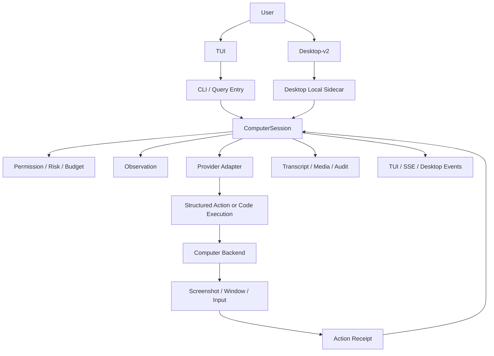

# go-e2e Computer Use 接入技术方案

更新时间：2026-09-24

文档状态：实施前架构基线，尚未进入代码实现。

## 0. 架构复核结论

本方案是当前项目最适合的接入方向，但有一处需要明确收敛：

- `ComputerUse` 必须是独立的 Surface、Session 和 Backend，不应作为
  `WebBrowser` 或 Query Loop 的平台输入扩展。
- `isolated_x11` 是第一阶段的主验收后端；其统一合同优先对接
  XTest/xdotool 或 Go/X11 helper。
- `PyAutoGUI` 只作为 isolated X11 的可选 adapter/fallback，以及后续
  isolated Code Execution 的脚本能力，不是 Go 项目的必选运行时依赖。
- `pynput` 不进入主 ComputerUse executor，只保留给测试辅助或明确的补充
  adapter。
- macOS/Windows Host Desktop 继续使用平台 native helper；不能用 Python
  库掩盖系统权限、窗口焦点和截图事实来源。

因此，当前文档可以作为实现基线；后续代码实现时仍需根据真实平台验收结果
调整 backend capability，而不是把某个 Python 库写成跨平台承诺。

## 1. 结论摘要

go-e2e 当前具备 `WebBrowser`、Bash、文件、MCP、TUI、WebUI 和
Desktop-v2，但还没有真正的 OS 级 Computer Use：

```text
截图观察 -> 视觉模型决定动作 -> 操作系统输入 -> 新截图 -> 验证状态
```

当前 `WebBrowser` 解决的是 HTML/浏览器会话交互，Desktop-v2 解决的是 Wails
宿主窗口，TUI 验收脚本中的 `osascript` 只负责测试窗口和截图。三者都不能作为
模型可调用的通用桌面控制能力。

本方案不把 Computer Use 做成 `WebBrowser` 的扩展，而是新增独立的
`ComputerSession` 与 `ComputerUse` 工具，同时复用现有 Query、Tool、Permission、
TUI、Desktop-v2、Transcript 和 Media 能力。

最终目标是：

```text
Code / Terminal
Browser
Computer Desktop
MCP / Connector
Isolated VM / Sandbox
```

成为可选择、可审计、可隔离的 Agent Surface。模型不能从 Browser 静默升级到
用户真实桌面。

## 2. 外部参考与适配结论

本方案吸收以下实现方向：

| 参考 | 可复用经验 | 对 go-e2e 的适配 |
| --- | --- | --- |
| [AI Agent Book Computer Use](https://github.com/bojieli/ai-agent-book/tree/main/chapter6/claude-computer-use-native) | 截图、结构化动作、真实环境执行、动作后再次截图 | 建立 provider-neutral `Observation -> Action -> Receipt` 协议 |
| [AI Agent Book Virtual Desktop](https://github.com/bojieli/ai-agent-book/blob/main/chapter4/execution-tools/extended_tools.py) | Xvfb、headful Chromium、xdotool、真实 framebuffer 截图 | 作为第一阶段 Linux/CI backend |
| [OpenAI Computer Use](https://developers.openai.com/api/docs/guides/tools-computer-use) | Structured Computer Tool 与 Code Execution 两种路径 | 同时支持结构化动作和隔离桌面代码执行 |
| [Codex App](https://openai.com/index/codex-for-almost-everything/) | Browser、Code、Desktop、Skills、Record/Replay 分层 | 保持 Browser 与 ComputerUse 分离，后续增加录制回放 |
| [Anthropic Computer Use](https://www.anthropic.com/news/developing-computer-use) | screenshot-only 视觉闭环和动作限制 | 支持无 DOM 的真实点击和键盘输入 |
| [Claude Cowork 隔离模型](https://www.anthropic.com/engineering/how-we-contain-claude) | 默认使用隔离 VM，仅挂载选定 workspace | `isolated` 默认模式，`host` 必须显式授权 |

适配原则：

1. 参考项目的工具协议不能直接复制成 Anthropic 专有协议。
2. Codex 的产品分层不能简化成一个万能 `computer` 函数。
3. Claude 的 VM 隔离和“不把宿主凭据交给模型”必须成为安全基线。
4. `WebBrowser` 继续用于高效网页语义操作，Computer Use 用于无法通过 DOM、
   API 或专用工具完成的真实桌面操作。

## 3. 当前实现基线

### 3.1 已有能力

- `internal/tools/webbrowser` 已注册为核心工具，支持 fallback HTML 解析和可选
  Playwright runner。
- fallback 模式明确不渲染页面，截图会报错，不伪造图片。
- `tools.Result.ContextMessages` 已支持把图片作为模型上下文传递。
- `tools.Context` 已有 `PermissionPrompt`、`PermissionAudit`、
  `PermissionUpdate`、`TaskProgress`、`Invocation` 等可复用能力。
- TUI 已有 Permission Prompt、运行时权限模式、PTY 和真实 Terminal 验收。
- Desktop-v2 已有 Wails 宿主、本地 sidecar、窗口状态、就绪检查和原生构建链。
- Transcript 和 Media 已有文本事件、图片资产和 JSONL/SQLite backend 约束。

### 3.2 明确缺口

- 没有统一的桌面观察协议。
- 没有真实鼠标、键盘、滚轮、拖拽输入 backend。
- 没有 display/window/session 生命周期。
- 没有 Computer Use 动作预算、焦点锁定和未知结果恢复。
- 没有 screenshot observation 到模型上下文的专用循环。
- 没有 TUI/Desktop 的 Computer Use 控制面。
- 没有 Host Desktop 与 Isolated Desktop 的权限分级。
- 没有 Computer Use transcript/evidence/record-replay 协议。

关键代码锚点：

- [WebBrowser 工具](../../internal/tools/webbrowser/webbrowser.go)
- [核心工具装配](../../internal/cli/interactive.go)
- [通用工具协议](../../internal/tools/tool.go)
- [Desktop-v2 说明](../../desktop-v2/README.md)
- [全局运行时拓扑](global_runtime_topology.md)
- [Runtime Modes](runtime_modes.md)

## 4. 目标与非目标

### 4.1 本方案目标

1. 建立 provider-neutral 的 Computer Use domain contract。
2. 支持真实 screenshot、mouse、keyboard、scroll、drag 和 wait。
3. 让 TUI 和 Desktop-v2 共享同一 ComputerSession。
4. 默认运行在隔离桌面，Host Desktop 只在显式模式下启用。
5. 复用现有权限、沙箱、审计、Transcript、Media 和取消机制。
6. 支持 Structured Action 和 Code Execution 两种模型接入路径。
7. 以真实像素截图和动作回执完成端到端验收。
8. 为后续 Record/Replay、Computer Skill 和多 Agent Surface 留出扩展位。

### 4.2 第一阶段非目标

- 不实现通用 OCR 或通用视觉定位模型。
- 不把 Computer Use 默认开放给所有 runtime profile。
- 不默认控制用户当前登录桌面。
- 不把密码、Token、Keychain 内容发送到模型。
- 不把所有浏览器动作迁移到 Computer Use。
- 不在第一阶段承诺 Windows、Wayland 和所有 Linux 桌面环境等价。
- 不把宿主 OS 输入 API 直接写进 Query Loop。

## 5. Surface 分层

### 5.1 Surface 类型

```go
type SurfaceKind string

const (
    SurfaceCode      SurfaceKind = "code"
    SurfaceBrowser   SurfaceKind = "browser"
    SurfaceComputer  SurfaceKind = "computer"
    SurfaceConnector SurfaceKind = "connector"
)
```

| Surface | 适用场景 | 主要执行方式 | 默认隔离 |
| --- | --- | --- | --- |
| `code` | 文件、测试、脚本、命令 | Bash/PowerShell/代码执行 | workspace/sandbox |
| `browser` | 网页文本、DOM、表单、浏览器会话 | WebBrowser/Playwright | 独立 browser profile |
| `computer` | 原生 App、无 DOM 页面、真实桌面 | screenshot + OS input | isolated desktop |
| `connector` | 日历、GitHub、业务系统 | MCP/API | tool capability |

### 5.2 Computer Use 模式

```go
type ComputerMode string

const (
    ComputerModeIsolated ComputerMode = "isolated"
    ComputerModeHost     ComputerMode = "host"
    ComputerModeBrowser  ComputerMode = "browser"
)
```

- `isolated`：默认模式，使用 Xvfb、容器、VM 或平台隔离桌面。
- `host`：操作当前 OS 桌面，必须显式启用，必须具备系统授权。
- `browser`：只允许操作专用浏览器窗口，不拥有完整桌面权限。

## 6. 总体架构



### 6.1 模块边界

建议新增：

```text
internal/computeruse/
  model.go          // Action、Observation、Receipt、Capabilities
  session.go        // observe/action/verify 生命周期
  policy.go         // 风险和动作授权
  recorder.go       // receipt、hash、轨迹和回放
  assets.go         // 临时截图和持久化媒体边界
  backend.go        // backend contract

internal/tools/computeruse/
  tool.go           // ComputerUse agent tool adapter

internal/computerbackend/
  virtual_x11/
  macos_host/
  windows_host/
  linux_x11/
  isolated_vm/
```

`internal/tools/computeruse` 只负责把模型 tool call 转为
`internal/computeruse` 请求，不直接调用 CGEvent、SendInput、xdotool 或
截图命令。平台代码必须留在 backend。

### 6.2 输入与截图依赖决策

`pyautogui` 和 `pynput` 都不能成为 Computer Use 的跨平台核心抽象。它们只能
作为 backend adapter，且不允许被 Query Loop、TUI 或 Desktop-v2 直接调用。

| 依赖 | 允许用途 | 不允许用途 |
| --- | --- | --- |
| `PyAutoGUI` | Phase 1 isolated X11 的可选鼠标/键盘 adapter 或 fallback；isolated Code Execution 中的受控输入 | Go 项目的必选运行时依赖；macOS/Windows Host 的统一核心；多显示器和窗口状态事实来源 |
| `pynput` | 可选测试辅助或平台补充输入 | 主 ComputerUse executor；截图、窗口管理、Host 权限抽象 |
| `xdotool`/XTest | isolated X11 的低层输入 fallback 或对照实现 | 跨平台抽象 |
| macOS native helper | CGEvent、Quartz/ScreenCapture、Accessibility readiness | 在 Go 主进程中直接散落 cgo/UI 平台逻辑 |
| Windows native helper | SendInput、Windows Capture、UI Automation readiness | 用 Python 库掩盖系统权限和窗口状态 |

第一阶段默认组合为：

```text
Go ComputerSession
  -> isolated_x11 helper
  -> XTest/xdotool 或 Go/X11 input adapter
  -> 独立 X11 screenshot adapter
  -> ActionReceipt
```

如果目标环境已有 Python 运行时，也可以把 `PyAutoGUI` 挂到同一个
`isolated_x11` contract 作为 fallback；该选择不能改变上层协议，也不能静默
切换到 Host Desktop。

截图、输入注入、窗口焦点和 session 状态必须是四个独立职责。即使
`PyAutoGUI` 自带截图能力，也不能把它作为截图事实来源；截图必须带宽高、
scale factor、display ID、时间和 hash。

Python helper 通过 stdio 或 Unix socket 与 Go 通信，必须满足：

- 进程级超时、取消和退出码可观测；
- 环境缺失时返回 capability unavailable，不静默切到 Host；
- 不接收模型原始 prompt，只接收已校验的 Action；
- 不持有模型 provider key、用户 Token 或系统凭据；
- 不把 Python 异常直接暴露为模型可执行指令；
- 运行结果统一转换为 `ActionReceipt`。

Host Desktop 的正式实现必须使用平台 native helper；`PyAutoGUI/pynput` 不能
作为 macOS、Windows 或 Wayland 的兼容性承诺。

## 7. Domain Contract

### 7.1 Backend 接口

```go
type Backend interface {
    Capabilities(ctx context.Context) (Capabilities, error)
    Observe(ctx context.Context, request ObserveRequest) (Observation, error)
    Execute(ctx context.Context, action Action) (ActionReceipt, error)
    Pause(ctx context.Context) error
    Resume(ctx context.Context) error
    Stop(ctx context.Context) error
    Close(ctx context.Context) error
}
```

### 7.2 Observation

```go
type Observation struct {
    SessionID       string
    DisplayID       string
    WindowID        string
    Width           int
    Height          int
    ScaleFactor     float64
    Screenshot      MediaRef
    ActiveWindow    WindowRef
    Cursor          Point
    Accessibility   *AccessibilitySnapshot
    Capabilities    Capabilities
    ObservedAt      time.Time
}
```

截图是模型的主要观察来源。Accessibility tree、窗口标题和 OCR 只能作为
辅助观察，不能替代真实像素和真实输入回执。

### 7.3 Action

```go
type Action struct {
    ID              string
    Kind            ActionKind
    DisplayID       string
    WindowID        string
    Point           *Point
    Button          MouseButton
    Text            string
    Key             string
    Keys            []string
    DeltaX          int
    DeltaY          int
    DurationMS      int
    Expected        *ExpectedState
}
```

第一阶段 `Point` 使用截图左上角为原点的像素坐标，并携带截图宽高和
`ScaleFactor`。backend 负责物理像素、逻辑像素和多显示器坐标转换，模型和
Query 不直接处理平台坐标。

### 7.4 ActionReceipt

```go
type ActionReceipt struct {
    ActionID          string
    Executed          bool
    Before            *MediaRef
    After             *MediaRef
    ActualPoint       *Point
    ActiveWindowAfter WindowRef
    Verification      VerificationStatus
    ErrorCode         string
    ErrorMessage      string
    DurationMS        int
    CompletedAt       time.Time
}
```

动作执行成功不等于任务成功。每个动作必须通过新的 observation 或
`ExpectedState` 验证；未知结果不能自动重试输入动作，必须先重新观察。

## 8. ComputerUse Agent Tool

工具名固定为 `ComputerUse`，不修改 `WebBrowser` 的既有 schema。

建议 schema：

```json
{
  "type": "object",
  "properties": {
    "session_id": {"type": "string"},
    "action": {
      "type": "string",
      "enum": [
        "start", "observe", "click", "double_click", "right_click",
        "move", "type", "key", "hotkey", "scroll", "drag",
        "wait", "pause", "resume", "stop"
      ]
    },
    "display_id": {"type": "string"},
    "window_id": {"type": "string"},
    "x": {"type": "integer"},
    "y": {"type": "integer"},
    "text": {"type": "string"},
    "key": {"type": "string"},
    "keys": {"type": "array", "items": {"type": "string"}},
    "delta_x": {"type": "integer"},
    "delta_y": {"type": "integer"},
    "duration_ms": {"type": "integer"}
  },
  "required": ["action"],
  "additionalProperties": false
}
```

工具必须限制：

- 单 Session 串行执行。
- `session_id` 不由模型任意跨用户复用。
- `display_id`、`window_id` 必须由 backend capability 返回或经过授权。
- `type`、`key`、`hotkey` 不在日志中保存原文，默认只记录长度和脱敏摘要。
- `pause`、`resume`、`stop` 可由用户发起，也可由模型调用但不能绕过 UI 停止。

## 9. 模型适配

### 9.1 Provider-neutral 核心

`ComputerSession` 不依赖 Anthropic、OpenAI 或某一个模型的 tool block。

模型适配层负责：

```text
Provider response
  -> normalize to ComputerActionRequest
ComputerActionResult
  -> provider-specific tool result + image context
```

### 9.2 Structured Action

模型返回 `ComputerUse` JSON，Go backend 执行真实动作，并把：

1. action receipt；
2. after screenshot；
3. verification result；

作为下一轮上下文返回。

### 9.3 Code Execution

模型在隔离桌面生成 Playwright、PyAutoGUI 或其他受控代码，由
`CodeExecutionBackend` 执行。代码执行必须复用现有 Bash/Workspace/Sandbox
边界，不能获得 Host Desktop 权限。

第一阶段只实现 Structured Action；Code Execution 作为第二阶段扩展，避免
把 Computer Use 和任意代码执行同时引入。

### 9.4 Prompt 成本控制

Computer Use tool definition 只在显式启用 Computer Profile 或 backend 可用时
注册。普通 code/chat/TUI profile 不增加 tool schema、system prompt 或模型成本。

## 10. 权限、安全与隔离

### 10.1 权限层级

| 动作 | isolated | browser | host |
| --- | --- | --- | --- |
| 截图 | allow | allow | ask |
| 移动鼠标 | allow | allow | ask |
| 普通点击 | allow | allow | ask |
| 普通输入 | allow | allow | ask |
| 登录、支付、发送 | ask | ask | ask |
| 删除、下载、外部写入 | ask | ask | ask |
| CAPTCHA / 人机验证 | deny-and-stop | deny-and-stop | deny-and-stop |
| 读取密码、Token、Keychain | deny | deny | deny |

`ComputerUse` 应接入现有 `tools.Guard`，但不能只依赖通用工具名判断风险。
需要新增 Computer Action Risk Classifier：

```text
observation
navigation
input
external_mutation
credential_sensitive
human_verification
```

### 10.2 默认安全策略

1. 默认 `isolated`，禁止直接操作用户当前桌面。
2. Host 模式必须有显式设置、运行时确认和 OS permission readiness。
3. 每个 session 绑定一个 display/window/environment，焦点变化后先暂停。
4. 动作总数、总时长、单动作时长和模型成本都有上限。
5. 外部写入动作按动作级别确认，不因之前批准过一次而永久放行。
6. Prompt Injection 视为不可信输入，截图、网页、文件内容不能改变权限策略。
7. Screenshot 默认临时保存，持久化采用 `none`、`failure`、`all` 三档。
8. 凭据由宿主或 browser profile 管理，禁止作为模型上下文传递。

## 11. ComputerSession 生命周期

```text
create
  -> capability_probe
  -> start_backend
  -> observe
  -> model_action
  -> permission_gate
  -> execute
  -> post_observe
  -> verify
  -> next_action / completed / paused / failed / cancelled
  -> close
```

### 11.1 状态

```text
created
starting
ready
running
waiting_permission
paused
completed
failed
cancelled
expired
```

### 11.2 未知结果

输入动作可能已经执行但进程返回失败。出现：

- backend crash；
- IPC timeout；
- screenshot timeout；
- input API unknown result；

时不得直接重放 `click`、`type` 或 `submit`。必须：

```text
mark outcome_unknown
-> capture fresh observation
-> ask model/user to re-evaluate
-> only then continue
```

### 11.3 Resume

- Host session 默认不能跨进程 resume。
- Isolated session 只有 environment fingerprint 一致时允许 resume。
- Transcript resume 只恢复任务摘要、最近 receipt 和最后截图引用，不假装恢复
  当前桌面状态。

## 12. TUI 适配

### 12.1 TUI 的职责

TUI 是 Computer Use 的监督控制面，不负责实现平台输入。

需要新增：

- Computer session 状态栏。
- Computer action timeline。
- Screenshot receipt 展示。
- Permission Prompt 的 Computer Action 变体。
- Pause、Resume、Stop 快捷键。
- backend、mode、display、action budget 展示。

建议事件：

```go
type ComputerEventKind string

const (
    ComputerEventSessionStarted  ComputerEventKind = "computer_session_started"
    ComputerEventObservation     ComputerEventKind = "computer_observation"
    ComputerEventActionRequested ComputerEventKind = "computer_action_requested"
    ComputerEventActionFinished  ComputerEventKind = "computer_action_finished"
    ComputerEventPermission      ComputerEventKind = "computer_permission"
    ComputerEventPaused          ComputerEventKind = "computer_paused"
    ComputerEventStopped         ComputerEventKind = "computer_stopped"
)
```

TUI 终端支持图片协议时可直接显示截图；不支持时只显示图片引用、尺寸、hash、
当前窗口和文字摘要。截图不能因为终端不支持而伪造为 SVG 或普通文字图片。

### 12.2 TUI 入口

第一阶段建议：

```text
/computer status
/computer start [isolated|host|browser]
/computer pause
/computer resume
/computer stop
```

模型侧通过 `ComputerUse` 工具工作，用户侧通过 slash command 和快捷键监督。

## 13. Desktop-v2 适配

### 13.1 Desktop 角色

Desktop-v2 增加 Computer Workspace：

```text
会话聊天
  + Computer Preview
  + Action Timeline
  + Permission Center
  + Surface / Backend Selector
  + Pause / Stop
```

Preview 默认展示隔离 desktop，而不是用户屏幕全量直播。

### 13.2 Wails Bridge

建议后续新增以下 bridge 方法，具体命名以现有 `app` binding 风格为准：

```text
GetComputerCapabilities()
StartComputerSession(input)
ObserveComputerSession(sessionID)
PauseComputerSession(sessionID)
ResumeComputerSession(sessionID)
StopComputerSession(sessionID)
GetComputerActionReceipt(sessionID, actionID)
```

Wails 只提供控制面和事件转发，不直接执行 OS 输入。backend 生命周期由本地
sidecar 或平台 helper 管理。

### 13.3 Desktop 权限体验

启动 Host backend 前必须展示：

- 当前模式：Isolated / Browser / Host。
- 当前 display/window。
- 需要的 macOS/Windows/Linux 系统权限。
- 是否允许操作当前用户桌面。
- 截图保留策略。
- 最大动作数和超时时间。

没有 readiness 的 Host backend 不得进入 `ready`，不能让模型先发动作再返回
权限错误。

## 14. Backend 分阶段设计

### Phase 0：协议和 Fake Backend

目标：

- 完成 domain contract。
- 完成 fake backend。
- 完成 tool schema、session state machine 和 permission classifier。
- 完成 TUI/desktop event contract。

验收：

- 单元测试可以完整模拟 observe/action/receipt/unknown outcome/cancel。
- 普通 runtime profile 的 tool definition 不增加。

### Phase 1：Virtual Desktop

目标：

- Linux Xvfb。
- Headful Chromium 或固定 GUI fixture。
- XTest/xdotool 或 Go/X11 input adapter；PyAutoGUI 作为可选 fallback。
- 独立 X11 screenshot adapter，可使用 Pillow/mss 或等价实现。
- 单 display、固定分辨率、固定 scale factor。
- 真实点击、输入、滚动、截图 hash、状态验证。

这是第一阶段真实 Computer Use 验收环境，也是 CI 的主要 backend。

Phase 1 不使用 `pynput` 作为主执行路径。`pynput` 如需保留，只能用于测试
辅助或显式的 Linux X11 补充 adapter，并且不能改变统一 backend contract。

### Phase 2：TUI + Desktop-v2 控制面

目标：

- TUI Computer timeline 和 permission prompt。
- Desktop-v2 Computer Preview。
- Wails bridge 和 sidecar 生命周期。
- 截图临时资产与 receipt readback。

### Phase 3：macOS Host Backend

目标：

- Screen Capture / Quartz 截图。
- CGEvent 鼠标键盘输入。
- Accessibility readiness 和应用 allowlist。
- Host 模式原生权限向导。

平台代码建议使用独立 Swift/Objective-C helper，通过 stdio 或 Unix socket
与 Go 通信，不把 cgo 和平台 UI 细节塞入 Query Loop。

本阶段不以 `PyAutoGUI` 或 `pynput` 作为 macOS Host 的正式输入实现。

### Phase 4：Code Execution

目标：

- 在 isolated desktop 中执行受限 Playwright/PyAutoGUI。
- 复用 workspace、sandbox、timeout、stdout/stderr 和 file tracking。
- 增加脚本动作 receipt 和失败后 fresh observation。

### Phase 5：Windows、Wayland、Record/Replay

目标：

- Windows Capture/SendInput/UI Automation。
- Wayland portal 或受支持 compositor backend。
- action trajectory 录制、脱敏、回放和 Computer Skill 生成。

Windows Host 不通过 `PyAutoGUI/pynput` 宣称跨平台兼容；Wayland 需要单独的
compositor/portal capability probe，不能把 X11 adapter 直接复用为兼容实现。

## 15. 持久化与证据

### 15.1 Transcript 事件

建议新增事件类型：

```text
computer_session
computer_observation
computer_action
computer_receipt
computer_permission
computer_terminal
```

事件只保存：

- session/action ID；
- mode/backend；
- display/window metadata；
- action kind；
- 参数脱敏摘要；
- screenshot/media reference；
- hash；
- verification；
- error code；
- duration；
- permission decision。

图片正文走现有 Media/Blob 机制，不直接塞进 JSONL transcript。

### 15.2 截图保留策略

| 策略 | 默认用途 |
| --- | --- |
| `none` | 普通隐私敏感任务，只保留 hash 和 receipt |
| `failure` | 默认验收和诊断，失败或未知结果保留 |
| `all` | 明确开启的调试/评测任务 |

真实桌面截图不得写入 Git。验收截图放到：

```text
desktop-v2/build/validation/YYYYMMDD/
```

### 15.3 Session Resume

Transcript resume 不能把历史 screenshot 当成当前事实。每次 resume 都必须重新
probe backend，再产生新的 observation。

## 16. 配置与 Profile

建议新增配置分组：

```yaml
computerUse:
  enabled: false
  defaultMode: isolated
  backend: auto
  maxActions: 30
  maxDurationMs: 300000
  actionTimeoutMs: 15000
  screenshotRetention: failure
  allowHostControl: false
  allowedApplications: []
  allowCodeExecution: false
```

配置规则：

1. `enabled=false` 时不注册 `ComputerUse` tool。
2. `allowHostControl=false` 时拒绝 Host backend。
3. `allowCodeExecution=false` 时拒绝 Code Execution backend。
4. profile、session 和一次性运行参数只能收紧权限，不能扩大宿主上限。
5. tenant/channel 默认不开放 Host Computer Use。
6. `--bare` 默认不包含 ComputerUse，必须显式开启。

## 17. 全局拓扑影响

实现时预计新增或扩展：

| 拓扑节点 | 影响 |
| --- | --- |
| `RT-WIRING` | backend、Computer Profile、权限和 budget 装配 |
| `RT-PRETOOL` | Computer Action Risk Classifier 和 action gate |
| `RT-TOOLS` | `ComputerUse` tool adapter |
| `RT-EVIDENCE` | observation、receipt、verification、unknown outcome |
| `RT-PERSIST` | transcript/media sidecar 和 retention |
| `RT-OUTPUT` | TUI、Desktop-v2、SSE、preview、permission event |
| `RT-OBSERVE` | action latency、failure、unknown outcome、backend readiness |

实现代码进入后必须同步更新：

- `docs/architecture/runtime_topology.yaml`
- `docs/architecture/global_runtime_topology.md`
- 对应 Mermaid 拓扑图
- `docs/compatibility_matrix.md`
- `docs/README.md`

普通 code/chat/TUI profile 在 ComputerUse 未显式启用时不应增加 prompt、tool
schema、model turn 或 token 成本。

## 18. 测试与验收矩阵

### 18.1 单元测试

- Action schema 校验。
- 坐标和 scale factor 转换。
- session 状态机。
- action budget 和 timeout。
- unknown outcome 禁止盲目重试。
- permission classifier。
- 输入脱敏。
- screenshot retention。
- transcript 兼容解析。

### 18.2 Contract Tests

Fake Backend、Virtual Desktop、macOS Host Backend 必须共享同一 backend contract
测试：

- observe；
- click；
- type；
- key/hotkey；
- scroll；
- drag；
- pause/resume；
- cancel；
- backend crash；
- screenshot failure；
- focus changed。

### 18.3 真实 Virtual Desktop E2E

固定本地 fixture：

1. 启动 isolated display。
2. 打开固定 HTML/GUI 页面。
3. 模型或测试 driver 读取截图。
4. 点击输入框。
5. 输入固定文本。
6. 点击提交。
7. 获取新截图。
8. 读取页面状态并验证结果。
9. 校验截图 PNG、尺寸和 hash。
10. 校验完整 action receipt。

### 18.4 TUI 验收

- 使用真实 PTY。
- 真实启动 TUI。
- 真实触发 Computer permission。
- 真实点击 approve/reject/pause/stop。
- 保存 Terminal screenshot。
- 校验 timeline 顺序无重叠、无底部遮挡。

### 18.5 Desktop-v2 验收

- 构建真实 Wails `.app`。
- 启动真实 Desktop-v2。
- 通过真实点击进入 Computer Workspace。
- 启动 isolated session。
- 观察实时 preview。
- 点击 Pause、Resume、Stop。
- 验证权限拒绝和失败 readback。
- 保存原生窗口截图。

### 18.6 安全负向测试

- Host mode 未授权时拒绝。
- 未准备 Screen Recording/Accessibility 权限时拒绝。
- CAPTCHA 动作被阻止。
- 密码和 Token 不进入 receipt/transcript。
- Prompt Injection 不得改变权限策略。
- backend timeout 后不得重复执行输入动作。
- 跨 session、跨 user、跨 tenant 的 session ID 必须拒绝。

## 19. 观测指标

至少记录：

```text
computer_sessions_started
computer_sessions_completed
computer_sessions_failed
computer_sessions_cancelled
computer_backend_ready_latency
computer_action_count
computer_action_latency
computer_action_unknown_count
computer_permission_denied_count
computer_screenshot_bytes
computer_model_turns
computer_model_input_tokens
computer_model_output_tokens
computer_verification_failure_count
```

关键成本指标：

- 每任务动作数；
- screenshot 字节数和 token 成本；
- 模型 turn 数；
- action p50/p95；
- unknown outcome 比例；
- permission reject 比例；
- isolated backend 启动耗时；
- Host backend readiness 失败率。

## 20. 回滚与降级

### 20.1 代码级回滚

Computer Use 必须由独立 feature flag 和独立 tool registration 控制。关闭后：

- 不注册 `ComputerUse`；
- 不启动 backend；
- 不增加 prompt；
- 不读取 Computer transcript；
- WebBrowser、Bash、TUI、Desktop-v2 原有行为保持不变。

### 20.2 运行时降级

| 故障 | 降级 |
| --- | --- |
| isolated backend 不可用 | 明确报错，不静默切到 Host |
| Host permission 不完整 | 回退到 isolated 或拒绝 |
| screenshot 失败 | 暂停，不继续动作 |
| action unknown | 重新观察，不重放输入 |
| provider 不支持图片 | ComputerUse 不注册或返回 capability unavailable |
| Desktop sidecar 崩溃 | session failed，保留 receipt，不恢复输入 |

## 21. 实施任务拆分

### Slice A：Domain Contract

- `internal/computeruse` domain types。
- backend interface。
- Fake Backend。
- session state machine。
- focused tests。

### Slice B：Tool and Runtime Wiring

- `internal/tools/computeruse`。
- `tools.Context` capability 注入。
- `coreRuntimeToolsWithOptions` 条件注册。
- Permission/AgentPolicy/allowedTools 集成。
- profile 和 config flag。

### Slice C：Virtual Desktop

- Linux Xvfb backend。
- screenshot、input、window readiness。
- local fixture。
- real E2E receipt。

### Slice D：TUI

- Computer events。
- timeline。
- permission prompt。
- pause/resume/stop。
- PTY screenshot acceptance。

### Slice E：Desktop-v2

- sidecar/backend lifecycle。
- Wails bindings。
- preview 和 action timeline。
- native screenshot acceptance。

### Slice F：macOS Host

- Swift/Objective-C helper。
- Screen Recording/Accessibility readiness。
- CGEvent input。
- Host permission flow。

### Slice G：Code Execution and Replay

- isolated PyAutoGUI/Playwright execution。
- trajectory recording。
- replay validation。
- Computer Skill generation。

## 22. 实施前必须确认的决策

1. 第一阶段确认以 Linux Virtual Desktop 作为 CI 和真实闭环基线。
2. macOS Host Backend 只允许 Desktop-v2 显式开启，TUI 默认只允许 isolated。
3. `ComputerUse` 只面向本地交互 session，暂不开放 Feishu/channel。
4. 截图默认采用 `failure` retention。
5. 第一版先走统一 JSON schema，provider-native adapter 后置。
6. isolated backend 先用 Xvfb 进程，不直接引入完整 VM。
7. Computer Profile 作为独立 runtime profile，不作为普通 code/chat 的隐式 tool。
8. Phase 1 以 XTest/xdotool 或 Go/X11 helper 为默认 isolated input adapter；
   PyAutoGUI 只作为可选 fallback，不使用 pynput 作为主执行器。
9. Host Desktop 使用平台 native helper，不以 Python 库承诺跨平台兼容。

推荐默认答案：

```text
Linux Xvfb first
Desktop-v2 host control only
TUI supports isolated only
Channel disabled
Screenshot retention=failure
Unified JSON schema first
Xvfb process first, VM later
Computer Profile isolated from ordinary code/chat
XTest/xdotool or Go/X11 first
PyAutoGUI optional behind isolated adapter
Pynput not in the primary executor path
Native helper for Host Desktop
```

## 23. 完成定义

Computer Use 第一阶段只有同时满足以下条件才算完成：

1. Virtual Desktop 中能真实点击、输入、滚动并获得新截图。
2. 模型上下文收到真实 PNG，而非合成图片或 DOM 文本冒充截图。
3. 每次动作都有 receipt、前后截图引用和 verification。
4. unknown outcome 不会盲目重放输入动作。
5. TUI 能真实批准、拒绝、暂停和停止。
6. Desktop-v2 能真实显示 isolated preview 并控制 session。
7. Host 权限未准备时不会误操作用户桌面。
8. 普通 code/chat/TUI profile 无新增 ComputerUse prompt/tool 成本。
9. transcript、media、audit、resume 和失败 readback 有测试覆盖。
10. 真实 PTY、真实 Wails 窗口和真实截图验收通过。

在这些条件满足之前，项目只能称为“具有浏览器自动化或截图能力”，不能称为
“具备 Computer Use”。
