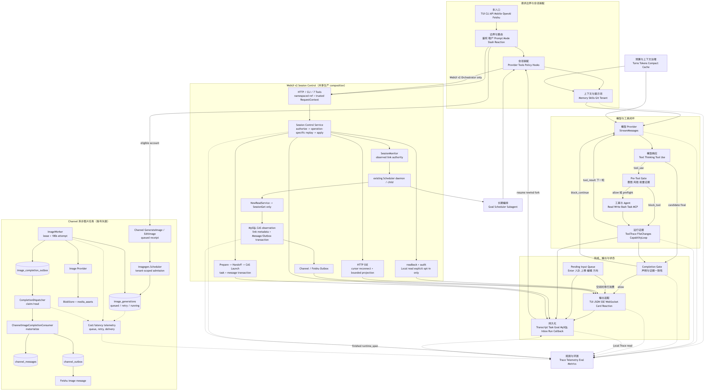
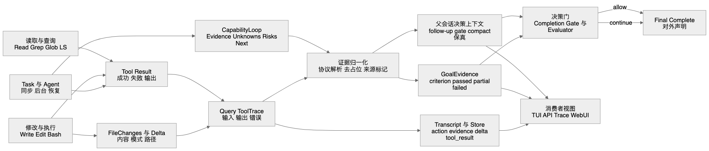
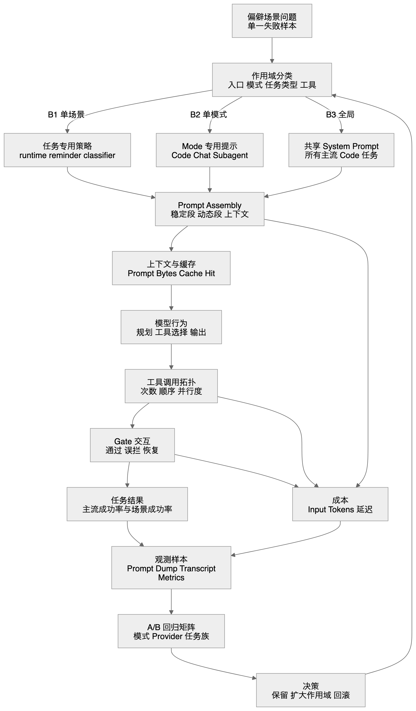
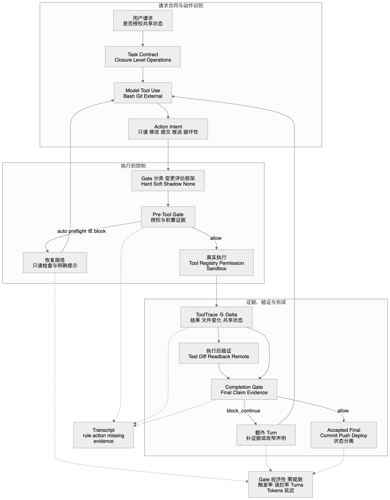

# golang-cc 全局运行时拓扑与变更影响堪舆图

更新时间：2026-09-05

2026-09-13 desktop-v2 startup hardening: Wails now creates a per-process local
auth token, injects it into the desktop frontend after DOM readiness, and gates
WebUI v2 queries/settings/subscriptions until `/health` and `/readyz` both pass.
Health probes are cancellable and bounded; SQLite desktop migrations inspect
columns before issuing `ALTER TABLE` to avoid expected duplicate-column log
noise. This remains a desktop-local `RT-ENTRY -> RT-BOUNDARY -> RT-PERSIST`
change with no new model turns or protocol consumers; the desktop fallback
screen exposes retry instead of allowing business actions during startup
failure.

本文是 golang-cc 的全局运行时拓扑基线，也是修改 runtime、prompt、工具、gate、finding/evidence、Goal、subagent、持久化或入口协议之前的影响评估手册。

2026-09-14 prompt templates: WebUI 2.0 与 desktop-v2 新增独立的 user-scoped
prompt-template catalog，链路为 `RT-BOUNDARY -> RT-PERSIST -> RT-OUTPUT`。
模板只进入 Composer 草稿，不进入 `RT-PROMPT` system prompt；当前爆炸半径为
`B4_PROTOCOL`，租户/用户隔离按 `B5_SHARED_STATE` 负向路径验证。SQLite 与
MySQL 复用同一 repository contract。2026-09-16 按用户追加要求，legacy WebUI 的
`/webui/agent` 在既有 RT-OUTPUT 中复用同一 Picker/API 作为显式
消费者（B1_SCENARIO），只写 Composer 草稿，不自动发送。desktop-v2 使用自己的
本地 SQLite；没有从已删除的旧桌面壳迁移或跨库读取提示词数据。legacy WebUI 的
页面 GET/HEAD 仍使用既有 WebUI 路由，API 与非页面请求仍走原 runtime proxy；
不依赖后端 cwd 查找前端产物。与 RT-OUTPUT 的 Picker 接入一起按 B1 场景回归验证。

它解决的不是“代码在哪里”，而是下面三个问题：

1. 一个变化会沿哪些因果关系传播。
2. 哪些入口、模式、任务类型、协议消费者和成本指标会受到影响。
3. 如何证明局部修复没有降低主流任务的全局成功率。

本文记录主运行时和跨模块契约。包 import 图、单个 handler 列表和全部函数调用不在总图中展开，否则高价值因果关系会被静态依赖噪音淹没。现有细节文档继续作为专题事实来源：

- [Runtime Message Flow and Closure Architecture](runtime_message_flow_and_closure.md)
- [Runtime Modes](runtime_modes.md)
- [Code and Chat Prompt Modes](../prompt_logic/code_and_chat_prompt_modes.md)
- [Closure Gate Classifier Optimization](closure_gate_classifier_optimization_plan.md)
- [Goal Mode Design](../goal_mode/goal_mode_design.md)
- [Loop Scheduler Design](loop_scheduler_design.md)

机器可读的节点、路径、下游、测试、图件和代码锚点登记在 [runtime_topology.yaml](runtime_topology.yaml)，它与本文和 Mermaid 源共同构成拓扑的维护基线。

2026-09-10 memory 读取边界更新沿既有 `RT-PROMPT -> RT-CACHE/RT-MODEL/RT-OBSERVE`：项目索引、摘要预览和召回正文共用已打开的目录根，最终读取不脱离 root；根内绝对 symlink 保留兼容。摘要复用 YAML 解析，正文先限量读取再进入原有内容预算。最高影响 `B2_MODE`，chat/bare 不新增隐式项目记忆；`RT-TOOLS -> RT-PERSIST` 的写入权限、格式与当前 prompt/gate 均不变。正收益为防止越界路径读取、修复摘要误解析和超长正文漏召回；代价为 YAML 解析与 rooted 文件 I/O，潜在误召回仍来自既有关键词策略。用 unit/race、相邻 query/cli、全仓测试与隔离真实模型验证，并记录 bytes、tokens/cache、turns、tools 和时长；回滚只回退独立 memory 提交、不删除已存记忆。现有节点和因果边不变，无需重绘图件。详见 [专项验收](../deployment/2026-09-10-dependencies-memory-acceptance.md)。

## 1. 使用原则

WebUI 2.0 设置中心沿 RT-OUTPUT 消费 RT-BOUNDARY 的 `/runtime/settings` 条件写、配置校验、来源检查与显式模型目录连接测试。路由校验复用 RT-WIRING，文件写入保留 RT-PERSIST 的原子写规则。大模型表单与 JSON 共享内存草稿，不新增持久化配置副本；Profile 定义/入口分配沿既有租户 API。文件解析结果、CLI 启动快照和会话/Run 配置分别展示，设置页不自动重启服务或改变活跃 Run。详见 [设置中心](webui_v2_settings_center.md)。

默认配置来源在 RT-WIRING 收敛为单个全局 settings.json（默认 `~/.golang-cc/settings.json`，保留 `GOLANG_CC_CONFIG_DIR` 重定位）。runtime、owned identity 与 WebUI 2.0 文件生效预览共用该入口；模型解析不再走项目 YAML 旁路。CLI 显式 `--settings` 与环境/会话/Run 覆盖仍保留。RT-BOUNDARY/RT-OUTPUT 的全局文件编辑和生效预览来源一致，RT-PERSIST 写入协议及启动快照边界不变。影响 B3_GLOBAL_RUNTIME；没有新增 prompt、模型 turn、工具调用、gate 或持久化。详见 [默认来源收敛设计](../superpowers/specs/2026-09-09-global-settings-default-only-design.md)。


设置环境选择沿 `RT-ENTRY(私有连接清单) -> RT-BOUNDARY(源身份白名单与管理员角色) -> RT-PERSIST(独立 tenant service/连接池) -> RT-OUTPUT(按环境挂载 Profile 编辑器)` 管理原数据库记录。目标 tenant/user 固定在服务端，环境资源仅暴露既有 Profile、绑定、分配和只读会话消息；不启动新 worker/reaper/runtime，不切换聊天 identity/SSE。跨环境写入保留目标审计并记录源操作人，失联不回退到当前库。共享 settings.json 继续共用原条件写锁，页面标明共同作用范围。最高影响 B5；新增成本是每库连接池和设置目录查询，无模型调用或新增 SSE。详见 [环境切换](webui_v2_settings_environments.md)。

### 1.1 一张总览，多张专题图

不存在一张既完整又可读的万能图。本堪舆图采用同一组因果语义，维护四个视图：

| 视图 | 回答的问题 | Mermaid 源 |
| --- | --- | --- |
| 全局运行时总览 | 一次请求如何穿过边界、prompt、模型、工具、gate、输出和持久化 | [global-runtime-topology.mmd](../../diagrams/global-runtime-topology.mmd) |
| Finding / Evidence | 工具与 subagent 事实如何成为 final/Goal 的可用证据 | [evidence-finding-topology.mmd](../../diagrams/evidence-finding-topology.mmd) |
| Prompt 爆炸半径 | 偏僻场景修复为何可能影响所有主流任务，以及如何控制作用域 | [prompt-blast-radius.mmd](../../diagrams/prompt-blast-radius.mmd) |
| Gate / 共享状态 | gate 如何影响安全、工具序列、恢复、turn、token 和时长 | [gate-shared-state-topology.mmd](../../diagrams/gate-shared-state-topology.mmd) |

### 1.2 因果关系语义

拓扑中的边只使用下面这些稳定语义。新增关系时优先复用，不创造近义词。

| 关系 | 含义 | 示例 |
| --- | --- | --- |
| `routes` | 选择入口、模式、provider 或执行路径 | Mobile 默认路由到 chat prompt mode |
| `injects` | 把 prompt、memory、tenant context 或 runtime reminder 加入请求 | `actionsSection` 注入 code system prompt |
| `calls` | 同步或异步执行另一个运行单元 | Goal runner 调用 query runner |
| `produces` | 产生结构化结果、delta 或事件 | Edit 产生 `FileChanges` |
| `normalizes` | 把多种来源转换成统一决策输入 | CapabilityLoop 转成 GoalEvidence |
| `gates` | 根据合同、授权或证据允许、阻断或继续 | completion gate 检查 final claim |
| `persists` | 写入 transcript、task store、Goal store 或 MySQL | ToolTrace 写入 transcript |
| `renders` | 转换成 TUI、JSON、SSE、WebSocket 或 WebUI 视图 | query sink 渲染流事件 |
| `charges` | 增加 token、turn、工具调用、延迟或外部成本 | block_continue 增加模型 turn |
| `invalidates` | 使之前的证据、缓存或状态失效 | 新内容 delta 使旧验证过期 |
| `verifies` | 用测试、readback、trace 或指标证明边成立 | push 后 remote/upstream 回查 |

### 1.3 事实、推断和目标必须分开

- **事实边**：代码、测试或 transcript 已证明，必须给出 source anchor。
- **推断边**：根据模型行为或少量样本推断，必须标记验证缺口。
- **目标边**：期望的未来行为，不能写成已经存在。

全局总览和 Finding / Evidence 图描述当前 runtime 的事实主干。Prompt 和 Gate 专题图在当前执行链之上叠加了变更决策框架；其中 `Hard / Soft / Shadow / None` 分类、A/B 回归矩阵和 Gate 经济性指标属于评估与演进机制，除非另有代码锚点和测试证明，不表示 runtime 已自动实现。本文提出的变更流程同样是后续改动应遵循的判断规则。

## 2. 全局运行时总览



总主线是：

```text
入口 -> 边界/路由 -> 会话装配 -> prompt/context -> provider
     -> model response -> pre-tool gate -> tools/agents -> evidence
     -> next turn 或 completion gate -> accepted output -> persistence
```

Goal、scheduler 和 subagent 是上层或嵌套编排器，不应复制 query loop。它们通过统一 query/tool/evidence 契约复用主干；预算、compact、cache、trace 和 telemetry 横切主干。

## 3. 核心拓扑节点登记表

| ID | 节点与职责 | 当前代码锚点 | 主要下游 |
| --- | --- | --- | --- |
| `RT-ENTRY` | CLI、TUI、headless、API、OpenAI、Mobile、scheduler、Goal、独立 channels worker 入口与构建身份展示；Managed Session CLI 与 Scheduler child 均接入共享 composition，screen 常驻 worker 的持久 env、独立 binary 启动、provider preflight、account 级单进程锁/orphan 清理、supervisor 发现和 TeamDispatch 装配 | `internal/buildinfo:Current`；`internal/cli/cmd_session_control.go:productionSessionControlRuntime`；`internal/cli/cli.go:runSessionMonitorChild`；`internal/server` handlers；`internal/goal/runner.go:Runner` | `RT-BOUNDARY`、`RT-WIRING` |
| `RT-BOUNDARY` | auth、tenant/user/session、prompt mode、request normalization、Web/TUI pending-input queue、Session Control HTTP write/`Idempotency-Key`/SSE readback，以及 provider-neutral 渠道事件、有序 timeline、Scope、slash 安全矩阵、ACK disposition、card/reaction capability、feature flag contracts、Feishu Adapter 与 onboarding | `internal/server/handlers_session_control.go`；`internal/server/session_control_stream.go:tenantSessionControlStreamHandler`；`internal/pendinginput`；`internal/channel` | `RT-WIRING`、`RT-SESSION-CONTROL`、`RT-PERSIST`、`RT-OUTPUT` |
| `RT-WIRING` | provider、runtime profile、Agent Profile、registry、permissions、hooks、sandbox、recorder、budget 装配；只有 `webui-v2-orchestrator` 注册七个 Session tools，普通 coding/chat/channel/TUI profile 无新增 tool/prompt 成本 | `internal/runtimeprofile`；`internal/agentprofile/builtin.go:builtinWebUIV2Orchestrator`；`internal/cli/cli.go:newQuerySession` | `RT-PROMPT`、`RT-TOOLS`、`RT-PERSIST` |
| `RT-PROMPT` | code/chat system sections、memory、索引限定且有预算的 project-memory recall、skills、git、tenant context、runtime status | `internal/query/query.go:defaultSystemPromptParts`；`assembleContextMessages`；`internal/memory/memory.go:loadClaudeCodeProjectMemory`；`internal/query/systemsections.go` | `RT-CACHE`、`RT-MODEL` |
| `RT-CACHE` | prompt cache 分界、tool-result externalization、auto compact、overflow retry | `internal/promptcache`；`internal/toolresult`；`internal/compact` | `RT-MODEL`、`RT-EVIDENCE` |
| `RT-MODEL` | provider request、stream callbacks、usage、provider fallback/error；OpenAI-compatible provider 对 reasoning 参数不兼容时的单次降级重试 | `internal/anthropic`；`internal/provider`；`query.Session.run` | `RT-PRETOOL`、`RT-COMPLETION` |
| `RT-PRETOOL` | tool action intent、授权和前置证据 gate | `internal/gitpolicy`；`internal/toolpolicy`；`internal/query/shell_intent.go`；`preToolClosureGate` | `RT-TOOLS`、`RT-EVIDENCE` |
| `RT-TOOLS` | 文件、搜索、Bash、MCP、Skill、Task、Agent 及 channel 图片工具执行；七个 narrow Session tools 仅从可信 `tools.Context` 派生身份并调用共享 service；channel 图片工具在灰度账号只持久化受理 receipt | `internal/tools/sessioncontrol/session_control.go:New`；`internal/cli/interactive.go:coreRuntimeTools`；`internal/tools` | `RT-SESSION-CONTROL`、`RT-EVIDENCE`、`RT-SUBAGENT`、`RT-PERSIST` |
| `RT-SUBAGENT` | 独立 agent loop、task store、worktree、provider-neutral client resolver、per-run provider/model/effort/max-token overrides、Agent Team orchestrator、CapabilityLoop；Team budget/timeout/error terminal gate，失败 TeamRun 必须写入 failed 与 finished_at；coordinator 可通过 provider-neutral text sink 进入渠道 streaming card | `internal/agentruntime`；`internal/agenttasks`；`internal/agentteam`；`internal/cli/channel_team.go`；`internal/tools/task`；`internal/tools/agent` | `RT-EVIDENCE`、`RT-PERSIST`、`RT-OUTPUT` |
| `RT-EVIDENCE` | ToolTrace、FileChanges、CapabilityLoop、GoalEvidence、closure records，以及 Session Control readback 的最小会话快照/关系标识 | `internal/query/query.go:ToolTrace`；`internal/capabilityloop`；`internal/goal/evidence.go`；`internal/sessioncontrol/service.go:mutate` | `RT-COMPLETION`、`RT-GOAL`、`RT-SESSION-CONTROL`、`RT-PERSIST` |
| `RT-COMPLETION` | read scope、failed audit、post-delta、final claim gate | `internal/query/closure_gate.go:completionGate` | `RT-MODEL` 或 `RT-OUTPUT` |
| `RT-GOAL` | plan、criteria、evidence-first evaluator、turn/token closing policy | `internal/goal` | `RT-WIRING`、`RT-PERSIST`、`RT-OUTPUT` |
| `RT-SCHEDULER` | recurring schedule、worker、child query、run history；`observed` link 是 SessionMonitor authority，scheduler 文件仅为可修复 projection，child 只走共享 `SessionGet` 并使用既有 Channel/Feishu Outbox | `internal/sessioncontrol/session_monitor.go:SessionMonitorChild`；`internal/cli/cli.go:runSessionMonitorChild`；`internal/scheduler`；`internal/background` | `RT-ENTRY`、`RT-SESSION-CONTROL`、`RT-PERSIST`、`RT-OUTPUT`、`RT-OBSERVE` |
| `RT-PERSIST` | local transcript、checkpoint/rewind/fork、agent task、pending-input FIFO/consumer lease、tenant MySQL、Session Control operation-specific replay/link/task idempotency，以及 SessionMonitor observed-link authority、CAS observation + Message/Outbox transaction 和 scheduler file projection | `internal/storage/mysql/session_control_repository.go`；`internal/storage/mysql/session_monitor_repository.go:CommitSessionMonitorObservation`；`internal/sessioncontrol`；`internal/channel/runtime` | `RT-SESSION-CONTROL`、resume、API/TUI/Trace consumers、独立 worker |
| `RT-SESSION-CONTROL` | HTTP、CLI、七个 tools 与 Scheduler child 共享的 Managed/Local 控制面；operation-specific replay、`prepare -> Handoff -> CAS launch`、task/message transaction、SSE readback、授权/幂等/审计协调 tenant-scoped 写操作；Local read 仅显式 opt-in 且保持只读 | `internal/sessioncontrol/runtimecompose/runtime.go:NewService`；`internal/sessioncontrol/service.go:Service.mutate`；`internal/server/session_control_runtime.go:NewSessionControlService`；`internal/server/session_control_stream.go:tenantSessionControlStreamHandler` | `RT-PERSIST`、`RT-EVIDENCE`、`RT-OUTPUT`、`RT-OBSERVE` |
| `RT-OUTPUT` | accepted final、TUI sink、CLI stdout、JSON、Session Control SSE、WebSocket，以及渠道单卡/多卡 timeline、Reaction、permission card | `internal/server/session_control_stream.go:writeSessionControlSSE`；`internal/query/sink.go`；`internal/tui`；`internal/channel/feishu` | 用户与客户端 |
| `RT-OBSERVE` | Build Identity、logs、`runtime-trace-v1` 原生 span与脱敏执行配置、Trace 归一化、telemetry、usage、eval、prompt dump，以及 Session Control 操作/replay/readback/audit 与 monitor schedule/outbox delivery 的边界指标 | `internal/observability`；`internal/sessioncontrol/service.go:Service.mutate`；`internal/sessioncontrol/session_monitor.go:SessionMonitorChild`；`internal/server/trace.go` | `RT-PERSIST` 的脱敏 finished span、Trace Viewer 单次诊断、APG 严格配置校验/变更决策与回归判断 |
| `RT-COST` | 图片队列等待、provider attempt、重试和 completion delivery 的成本与时延指标；控制 `outcome_unknown` 不盲目重试造成的重复计费 | `internal/cli/imagegen_runtime.go:imageWorkerObservability`；`internal/imagegen/retry.go`；`internal/imagegen/worker.go`；`internal/imagegen/completion_dispatcher.go` | `RT-OBSERVE`、`RT-PERSIST` |

Phase 1 新增的观测持久化链为 `query/model/tool/provider -> RT-OBSERVE -> RT-PERSIST(runtime_span) -> RT-OBSERVE(Local Trace)`。Phase 2-4 将 hook/permission/compact/gate/persist/renderer 纳入同一链，并新增 `Trace detail -> runtime-trace-v1 -> baseline/APG` consumer。Build Identity 链为 `linker/Go build info -> internal/buildinfo -> CLI/local trace/HTTP trace`，只关联产物身份，不进入 prompt、模型或工具决策。只读并行链为 `model tool_use order -> RT-PRETOOL policy/gate preflight -> RT-TOOLS bounded workers -> RT-EVIDENCE ordered commit -> RT-MODEL next turn`；任何未知工具、交互权限、hook 或 gate 都回退串行。两条运行链都不把 runtime metadata 注入模型上下文，旧 transcript 没有 `runtime_span` 时继续使用 tool 时间戳推断。

Session Control 的事实链现为 `HTTP/CLI/7 tools -> RT-SESSION-CONTROL(runtimecompose.NewService) -> authorize -> operation-key lock/global guard -> operation-specific replay -> apply -> readback -> audit -> RT-PERSIST/RT-EVIDENCE/RT-OUTPUT/RT-OBSERVE`。HTTP、CLI 与 tools 不互相调用，均经共享 production composition；Scheduler child 用 `NewReadService -> SessionGet`，不复制查询或进入模型/tool loop。生产 mutation 以 tenant/user/operation-scoped key hash 获取 MySQL advisory lock，并用独立 lock pool 避免耗尽业务连接；raw key 不落库、不入日志。每种写操作仍有自己的 replay anchor：Create、Send、Stop、Attach/Refresh 与 Monitor 不共享模糊 recovery。重复请求从 operation-specific authority 与 completed audit guard 恢复；同一 key 的不同 fingerprint 保持 idempotency conflict。

Send 的执行链为 `prepare -> Handoff -> CAS launch`：准备 task/event 与用户 message 的持久化是同一 transaction，随后 CAS 启动 detached run；失败可由 operation-specific recovery 做 readback，而不是重做写入。Attach/Handoff 保存固定 cursor/hash/package 标识和 estimate，不把完整 transcript 注入或记录。HTTP SSE 先以 `SessionGet` 完成归属 readback，之后按 event cursor 投影受限状态；断开只终止 stream，既不取消 detached run，也不降低下一次 readback/SSE reconnect 的权限检查。Local 仅可读，且只在明确 `GOLANG_CC_SESSION_CONTROL_LOCAL_READ` opt-in 后参与 composition；默认拒绝 Local read，任何 Local write 都拒绝。

`SessionMonitor` 的 authority 是 `relation_type=observed` link 的受限 metadata：controller target ref、observed source refs、频率、channel、configuration fingerprint、schedule ID 和最后 cursor/status。Schedule 文件只是可重新生成的 projection，不创建额外 `background.Job`：配置写在 MySQL target/link row lock 内合并最新 observation，投影写在 scheduler registry 跨进程锁内再次回读 authority，避免 controller/controller 与 controller/child 的旧配置覆盖。若 link 已落库但缺 schedule ID，重复相同操作修复 projection；不能解析、缺失或孤立的 projection 以 fail closed 处理，绝不推断 tenant、user 或监控目标。daemon/child 生命周期独立于浏览器、HTTP SSE 和 controller session；daemon 启动在任何 monitor 写入前完成 readiness preflight，并以环境摘要、可执行文件/进程创建身份和 Unix `flock` / Windows `LockFileEx` 防止错误复用或重复启动。child 从 schedule ID 反查受信 tenant context，仅以共享 `SessionGet` 得到摘要；状态变更或 24 小时 report window 到期时，`CommitSessionMonitorObservation` 在一个 MySQL transaction 内 CAS 更新 observed link，并物化 Channel Message 和 Feishu Outbox。CAS 冲突、非法/失效 channel、无归属 source 或无法提交 outbox 都不接受一个不可交付的 monitor，或作为可见 run/delivery failure 留待既有重试/readback。

该链的最高爆炸半径是 `B5_SHARED_STATE`：Managed create/send/stop/attach/monitor 会改变 tenant-scoped Session、Agent Task、link 或 Channel Outbox。保护的不变量是 tenant/user 隔离、可信 actor/context、Local 只读、同一写请求至多一次副作用、成功结果可 readback/audit，以及 monitor observation 与外发 outbox 原子一致。恢复路径不是放宽 gate：`applied` claim 用相同请求完成 readback/audit；越权、Local 写、fingerprint 冲突、orphan projection 和 CAS 竞争保持拒绝或失败关闭。

Orchestrator profile 边界属于 `B3_GLOBAL_RUNTIME` 的零成本隔离：只有 `webui-v2-orchestrator` 发现和注册七个 Session tools；coding/chat/channel/TUI profile 没有 Session tool schema、提示词 bytes、tool selection、turn、tool call、延迟或 cache 变化。观测应在该 profile 与普通 profile 分别记录 prompt bytes、tool count、turns、tool calls、latency/cache，而不能把一个 profile 的结果外推到全部运行时。

观测以 `trace_id`、tenant key、user/actor、session ref、operation、replay、operation/run/link/event/schedule ID、source count、Handoff hash/cursor 前缀、estimate、channel delivery status 和 duration 为边界字段，当前落在 audit metadata 与既有 telemetry/span；独立的 Session Control Prometheus 指标注册属于后续增强。不得记录消息内容、Handoff prose、JWT、API key、secret、附件私有 URL 或语音转写全文。正收益是四个 transport、Handoff 与 Scheduler 共享授权/replay/readback 合同，且 monitor 外发不丢失与状态游标的原子对应；负作用是每次 mutation 的 claim/readback/audit 往返、单节点 scheduler 文件 projection 的可用性，以及 orphan projection fail-closed 导致的显式修复。以操作时长、replay/拒绝码、CAS/delivery failure、scheduler repair 和普通 profile 的零成本基线观察这些代价。

回滚顺序：先停止 HTTP/CLI/tools 对 Session Control 的新入口注册、从 Orchestrator profile 移除七个 tools，并禁用 SessionMonitor schedules；保留 `tenant_session_links`、idempotency、observation/outbox 和 Agent Task 数据，使 in-flight `applied` claim 可 readback/audit。确认没有运行中的 monitor child、pending outbox 或需恢复的 claim 后，再回退应用；只有最后才执行 `000025_session_control_links.down.sql`。恢复时重新注册共享 composition 与 scheduler child；不得以删除 link 或手工修改 scheduler file 作为恢复手段。

渠道运行链已扩展为 `Feishu Adapter -> durable Inbox -> ChannelCommandRouter/scope controls -> query runtime -> ordered timeline -> paged Card streams -> per-page Message/Outbox convergence`，并行提示链为 `Inbox -> Reaction desired/current -> reconciler -> Feishu Reaction`；Team 事件先进入同一个 Service Inbox/ChannelRun 和 reaction 生命周期，再注入 `Team strategy -> pinned Profile members -> bounded Orchestrator -> mailbox/evidence`，最终仍由公共 Service 生成 coordinator-only Card/Outbox，同一 inbound event 只允许一个 TeamRun。真实 `channels run` 通过独立编译 binary + screen 常驻脚本启动，每个 account 隔离 worker/session/log/env；默认 worker 根目录为持久的 `~/.golang-cc/channel-workers`，`stop` 保留 0600 env，首次启动可从旧 `/tmp` env 原子迁移并清理旧 env，电脑重启后按 worker name 恢复。启动脚本在创建 screen 前显式传递 workspace、settings 和 named provider，等待 screen 与二进制子进程都就绪后才返回，`ScreenSupervisor` 从同一持久目录发现 worker，`cmd_channels.go` 先执行 provider preflight 并输出脱敏后的实际 provider/model/settings 来源，配置无效时不建立 WebSocket；restart 按 `(tenant_id, account_id)` 做原子锁和 orphan 清理，避免重复消费。`cmd_channels.go` 在启动时加载已发布 Team bindings 并装配 `TeamDispatch`。Feishu Adapter 从原始事件补回 SDK 丢失的 `id_type=app_id` mention，并将 normalized `open_id` 与当前 bot identity 比对，避免群门禁在 Inbox 前误忽略。Feishu Adapter 同时确认 SDK Reaction 事件，避免未注册 handler 噪音。Card 2.0 交互控件使用顶层 standalone callback button，不使用已被平台拒绝的 `tag:"action"` wrapper。channel runner 把模型文字、文字 amendment、工具开始/结果和状态提示写入有序 timeline；连续文字合并，工具结果按 `tool_id` 原位更新。Feishu renderer 按真实 JSON 字节、50 个顶层元素和每卡最多 6 个工具进行稳定分页，每个工具使用独立 `collapsible_panel`；第 7、13 个工具会实时打开新卡，旧页只在其工具状态变化或终态同步时 PATCH。每页使用 `run:<run_id>:timeline:page:<n>` 或 interaction page key 幂等物化；健康流式页记录 receipt，失败页通过 update/create Outbox 收敛。同一 run 的 `sequence_no > 1` Outbox 在投递前检查更小序号是否已经 `sent/dead`，避免 provider retry 导致时间线倒序；阻塞仅增加一次租户与 run 限定的 count 查询，并沿既有 retry/lease recovery 恢复。最终逻辑 assistant 消息仍只持久化一次，多张 channel message 仅代表外部展示页。`ask` 权限链为 `query PermissionPrompt -> permission card -> card callback -> one-shot callback consume -> tool decision`。`AskUserQuestion` 交互链为 `query pending interaction -> channel_interactions encrypted checkpoint -> Run waiting_input -> paged question card/text or callback -> CAS answer -> original Run queued -> exact tool_result resume`；问题和按钮只位于最新页，按钮 token 只保存哈希。DingTalk 仍只有协议枚举和扩展位；最终逐页 Outbox 是可靠基线，流式路径由 feature flag 控制。

异步图片链新增为 `channel image tool/command -> imagegen.Scheduler -> image_generations (queued)`，工具只返回 receipt，因而不会继承 channel run deadline。`ImageWorker` 按 tenant claim 并以独立 attempt context 调 provider registry，将 blob、`media_assets`、generation terminal state 和 `image_completion_outbox` 一并收尾；provider/model/resolution/ratio 在入队快照中固定，凭据只在 worker 解析当前配置时读取。Agnes 图生图走 `/images/generations` 的 `extra_body.image` Data URI，默认 Base64，URL 结果必须经 HTTPS、host allowlist、大小和图片解码校验后归档。`image_completion_outbox -> CompletionDispatcher -> ChannelImageCompletionConsumer/materializer -> channel_messages + channel_outbox -> Feishu image` 延迟投递每一张已完成图片。generation 与 delivery 是分离状态机，delivery retry 不会重新生成；同一 run 的多张图片允许部分成功。`asyncChannelEnabled` 默认关闭，开启且 account key 列表为空表示全量，非空列表只匹配精确账号。该路径最高爆炸半径为 `B5_SHARED_STATE`，所有租约和状态写回保持 tenant 约束，所有用户可见操作保持 tenant/user/session 约束。

Provisioning overview 额外提供一条控制面观测链：`screen worker env files -> ScreenSupervisor inventory -> tenant provisioning overview API -> WebUI statistics`。这条链与 provisioning 记录解耦，旧的 CLI/screen worker 即使没有 `agent_provisionings` 行，也能按 tenant/account、screen session 和子进程 PID 被实时统计；页面另行展示“向导管理 Profile”数量，避免把未纳入向导误报为不存在。Inventory 只返回 provider/model、PID、screen、log path 等安全观察字段，不读取或输出 credential/payload key。

Profile 对话工作台新增一条只读聚合链：`active Profile channel binding -> channel_conversations -> tenant session/messages + channel runs -> Profile conversation catalog API -> WebUI full-screen dialog`；Team 参与关系由 `agent_team_members` 通过同一租户和 Profile version 过滤后展示。该链复用既有 transcript、Chat Lab 和 Trace 数据，不复制消息、不改变 channel runtime；Chat Lab 跳转使用 tenant session id，Trace 跳转显式携带 `source=tenant&session_id` 并由 Trace viewer 自动定位。

等待输入链为 `WebUI/TUI Enter -> pending-input queue -> server/TUI coordinator -> existing query runner -> task/session persistence -> SSE/TUI renderer`。Web/API 模式只有服务端 coordinator 消费，浏览器只负责增删改查，因此关闭页面不会中断 FIFO。MySQL coordinator 在 `(tenant_id,user_id,session_id)` settings 行上持有可过期 consumer lease，并携带原请求的 tenant/user context；关闭 queue 会保留候选并阻止 claim，失败、取消、超时或过期接管会把候选收敛为可显式 retry 的 `failed`。task event 只输出候选 ID、状态、顺序、attempt、关联 task 和错误码，不输出正文、方向、client ID 或附件 metadata。

## 4. Finding / Evidence 因果链

WebUI 2.0 对话内容链新增为 `RT-PERSIST(Task events) -> RT-BOUNDARY(SessionGet ownership + conversation cursor read) -> RT-OUTPUT(多会话单连接 SSE) -> WebUI event reducer`。新接口以 Session key 定位，通过授权快照的数字 ID 查询主对话事件；与旧的受限状态 SSE 分离，沿用 tenant/user/session 隔离和 detached Run 生命周期。每会话独立游标、每页 200 个事件、每连接最多 32 个会话，空闲退避 250ms 到 2s。配置装配新增跨 Provider 清理专属协议状态，仓库路由示例不再覆盖用户默认路由。详见 [修复与验证计划](webui_v2_conversation_repair.md)。

WebUI 2.0 体验补齐沿已有 `RT-OUTPUT -> RT-BOUNDARY -> RT-PERSIST` 读取图片产物、slash commands 和当前会话 pending-input；队列编辑/重试仍受旧接口的授权与状态约束，重新生成经 Session Control 创建后续 Run。SSE 事实内容与打字机展示进度分离，历史加载不重复动画。拖入来源会话沿现有 Handoff 授权装配，带 source_refs 的排队写入继续拒绝，前端保留草稿并等待空闲。详见 [体验补齐计划](webui_v2_experience_parity.md)。

主对话配置迁移继续沿 `RT-OUTPUT -> RT-BOUNDARY -> RT-SESSION-CONTROL -> RT-WIRING/RT-PERSIST`：Create/Send 的 provider/model/permission_mode/effort/prompt_mode 统一预检，Session 默认值在启动 CAS 中更新，Run metadata 保持不可变；ready/running 或队列非空时拒绝配置变化。实际执行沿 QueryRequest 注入局部 runtime options，不更改全局权限或 system prompt。配置投影共用 SessionControl 查询；前端 Workspace/Inspector 共用生命周期 metadata 缓存，文字和时钟不增加 HTTP。新增 UI 消费既有思考、文件、子任务、权限、用量和图片事件，不新增 SSE 连接。正收益是显示值与实际下一 Run 一致；潜在负作用是预检成本及显式 busy 拒绝，以接口时延、错误码、CAS/幂等测试和真实 readback 验证，回滚应用时保留现有 metadata。详见 [主对话完整迁移](webui_v2_main_chat_completion.md)。

同一主对话链的输入图片复用 `RT-BOUNDARY -> RT-PERSIST(media_assets/BlobStore) -> RT-WIRING(QueryAttachment)`：先验证 Session 归属和图片格式/大小/hash，再以 tenant/user/session/content 派生资源 ID 归档；任务事件、队列和审计只存引用，执行前按相同身份读取并验证内容 hash。旁路会话复制图片到新 Session 的资源范围，只接管来源为 pending-input-side-chat 且未启动的 ready task；首次发送与接管在同一事务内提交，原候选仍可读回。潜在成本是图片归档 I/O、按会话复制空间，以及后续 Send 拒绝时留下未引用资源；同内容重试可复用，当前不新增清理策略。历史 runtime metadata 查询沿既有 `RT-BOUNDARY -> RT-PERSIST -> RT-OUTPUT`，先验证 Session，再按 tenant/user/session 过滤后应用 limit，避免全局新任务挤掉旧会话。最高影响仍为 B5，以越权拒绝、损坏图片不调用模型、接管幂等/回滚和数据库 readback 覆盖；现有节点与跨层边保持准确。

主 Web 会话的 Handoff 来源在 `RT-PERSIST -> RT-SESSION-CONTROL -> RT-EVIDENCE` 既有链上，从归属一致的主任务 message/completed 提取各不超过 512 bytes 的请求和完成回复，沿用预算与 reported 证据等级。新事件证据哈希覆盖所选正文全文；已有消息/完成事件的元数据哈希仍可 readback，保留旧保证，不扩展到工具 verified 证据。既有 package 不重写，不新增授权 gate 或数据库 schema。

Web 主会话用户问题沿 `RT-TOOLS(AskUserQuestion) -> RT-OUTPUT(Task event sink) -> RT-PERSIST(question request/answer events) -> RT-BOUNDARY(原 Task 授权回答) -> RT-WIRING(原工具回调)` 继续执行，旧版/新版 WebUI 共用已有 SSE/history，不增加连接。等待保留原 Run，界面派生 `waiting_input`；回答先落事件后唤醒，同一问题相同答案可重试，取消与过期收尾。执行栈与服务进程同寿命，不承诺跨重启续跑。Handoff 对传输片段过滤并按 canonical package 预算选择证据，准备失败沿 ready CAS 收尾，避免孤立排队任务。图片沿已有 `RT-TOOLS -> RT-PERSIST(media) -> RT-MODEL` 默认返回产物信息及未视觉检查说明；`imageGeneration.previewInContext=true` 才为视觉对话模型使用授权读取与完整性校验后的图片数据，浏览器媒体引用不直接成为外部模型下载地址。最高影响 B5，覆盖租户拒绝、幂等、失败 readback 和真实浏览器流程；成本为等待期间的现有 Run 槽位及显式预览时的图片读取/编码，回退应用保留事件和媒体。详见 [三项故障修复与验收](webui_v2_reported_bugs_repair.md)。



### 4.1 术语边界

不要把 finding、evidence、claim 和 verification 混为一个字段：

| 概念 | 定义 | 当前载体 |
| --- | --- | --- |
| observation | 工具原始输出或事件 | `tool_result`、agent task event |
| delta | 已发生或可能发生的状态变化 | `FileChanges`、Bash/shared-state intent |
| evidence | 可追溯、可用于判断的事实 | ToolTrace、closure evidence record、GoalEvidence |
| finding | agent 基于 evidence 得出的结论 | CapabilityLoop 的 evidence/unknowns/risks 组合及 final 内容 |
| verification | 对 delta 或 finding 的复查动作 | test、diff、readback、remote state check |
| claim | 对用户或外部客户端作出的最终声明 | candidate/accepted final、Goal complete |

### 4.2 当前真实传播链

1. Read/Grep/Glob/LS 产生只读观察；Write/Edit/Bash 同时可能产生 `FileChanges` 或其他 delta。
2. `query.Session.runTool` 把输入、输出、错误和文件变化收敛为 `query.ToolTrace`。
3. `recordClosureTrace` 将同一 trace 展开为 action/evidence/delta transcript events。
4. Task/Agent 的结构化 finding 通过 `CapabilityLoop` 携带 evidence、assumptions、unknowns、verification、risks 和 next_action。
5. `internal/capabilityloop` 负责协议解析、去占位、来源和 follow-up 语义；query 把结果注入父会话决策上下文，并在 compact 后恢复关键事实。
6. Goal 将 tool traces 和 AgentGet capability evidence 转成 `GoalEvidence`；`EvidenceEvaluator` 可因为失败证据、pending criterion 或 pending follow-up 阻止 complete。
7. TUI、API、WebUI、trace 和持久化层消费这些结果，因此协议字段变更不是 agentruntime 局部变更。

### 4.3 修改 CapabilityLoop / Evidence 时的强制回归面

| 消费面 | 至少检查 |
| --- | --- |
| producer | `internal/agentruntime`、cancel/failure/partial result 构造 |
| protocol | `internal/capabilityloop` 的 JSON、tag、persisted-summary parser |
| parent query | recent evidence、follow-up gate、resume、compact facts |
| Goal | evidence conversion、pending follow-up、criterion evaluator |
| persistence | local transcript、agent task result JSON、tenant/MySQL scan |
| presentation | TUI capability panel、server response/event、trace viewer |
| regression | divergence tests、Task/Agent acceptance scripts、Goal tests |

## 5. Prompt 爆炸半径与偏僻场景



### 5.1 爆炸半径等级

| 等级 | 作用域 | 典型修改 | 默认策略 |
| --- | --- | --- | --- |
| `B0_LOCAL` | 单测试、单 fixture、单错误文案 | testdata 或局部 parser 修复 | 聚焦测试即可 |
| `B1_SCENARIO` | 单任务类型、单 gate 恢复路径、单工具 | task-specific strategy、runtime reminder | 优先选择，补相邻场景回归 |
| `B2_MODE` | code/chat/subagent/Goal 或一类入口 | mode system section、tenant context | 做该模式全矩阵和隔离测试 |
| `B3_GLOBAL_RUNTIME` | 所有共享 query 或所有 code-mode 请求 | `actionsSection`、通用工具描述、全局输出规则 | 默认禁止由单一偏僻样本直接推动 |
| `B4_PROTOCOL` | transcript、API、SSE、DB、CapabilityLoop、ToolTrace schema | 字段、状态、事件 envelope 变更 | 兼容测试、迁移和全部消费者回归 |
| `B5_SHARED_STATE` | commit/push/tag/deploy、权限、沙箱、跨租户数据 | hard gate、auth、tenant isolation | 安全审查、负向测试、readback、审计 |

### 5.2 具体案例：偏僻 audit 场景失败

假设某个极少见的 repository health audit 没有先做全仓事实表，导致 finding 不完整。候选修复有三种：

| 方案 | 半径 | 正收益 | 负面风险 | 判断 |
| --- | --- | --- | --- | --- |
| 修改 `repoHealthAuditStrategySection` | `B1_SCENARIO` | 只影响被 classifier 命中的 audit | classifier 漏判时不生效 | 默认首选 |
| 修改 code-mode 某个动态 section | `B2_MODE` | 同类任务更一致 | 所有 code 请求增加 prompt/token | 需要模式矩阵证据 |
| 修改全局 `actionsSection` | `B3_GLOBAL_RUNTIME` | 所有任务都会看到规则 | 简单问答、定向修复、Git、subagent 都可能多读、多查、多 turn | 单一偏僻案例不足以支持 |

实际代码也提供了这种作用域分层：`repoHealthAuditStrategySection` 和 `repairSafetyStrategySection` 是按 task type 注入的策略；`actionsSection` 则由 `defaultSystemPromptParts` 加入所有普通 code-mode prompt。修复偏僻场景时，应先使用前者，不能因为局部测试转绿就把规则写进后者。

### 5.3 全局 prompt 修改的准入证据

`B3_GLOBAL_RUNTIME` 修改合并前必须同时具备：

1. **局部收益**：目标场景成功率或证据质量明确提升。
2. **主流不退化**：普通问答、定向读文件、局部代码修改、测试修复、Git commit/push、Task/Agent、Goal、chat mode 隔离等代表性任务不下降。
3. **行为拓扑不恶化**：无无意义的额外 Read/Grep/Bash、重复验证、误触 gate 或 agent 过度委派。
4. **成本可接受**：prompt bytes、input/output token、turns、tool calls、p50/p95 duration、cache read/creation 不出现不可解释增长。
5. **跨 provider 成立**：至少 deterministic fixture 加一个真实 provider 样本；不能把 scripted model 的完全遵从当成真实模型结论。
6. **可回滚**：feature flag、独立 section 或可删除规则，避免与多个提示段混成不可拆分文本。

## 6. Gate 与共享状态因果链



### 6.1 Gate 不是默认答案

| 类型 | 使用条件 | 失败成本 |
| --- | --- | --- |
| `HARD` | 不可逆外部操作、权限、租户隔离、破坏性 Git；不能依赖模型自觉 | 宁可阻断，也不能放过未授权动作 |
| `COMPLETION` | final/complete 声明必须由已有证据支撑 | 允许继续一轮补证据或收窄声明 |
| `SOFT` | 最佳实践、效率或可恢复质量问题 | 优先提示、自动 preflight，不应制造死循环 |
| `SHADOW` | 新规则价值尚未证明 | 只记录 would-block，不影响用户任务 |
| `NONE` | 低风险、局部问题、已有工具错误足以恢复 | 不增加运行时控制面 |

新增 gate 前必须回答：

- 它保护哪个不可破坏的不变量。
- 不加 gate 时是否存在真实失败或高可信攻击路径。
- 判定是否确定、是否能从结构化状态得出。
- 误拦后模型和用户能否用唯一、短路径恢复。
- 每次触发增加多少 turn、token、工具调用和时长。
- 是否可先 shadow 采集触发率、误拦率和恢复率。

### 6.2 Git 链路的全局视角

Git commit/push 不是三个孤立命令。完整链路包括：

```text
用户授权 -> task contract -> shell intent -> pre-tool gate
-> scope/upstream preflight -> commit/push -> ToolTrace
-> post-action readback -> completion gate -> final claim
```

把提示词中的 Git 操作机械拆成多步，可能提高单步准确性，也可能增加模型 turn、重复 diff、gate 误拦和任务时长。判断依据应是端到端 workflow completion、gate friction、readback 正确性和总成本，而不是“每个 commit 都更准确”这一项局部指标。

### 6.3 当前局部执行策略

- `internal/gitpolicy` 从当前用户消息生成 operation/target scope，并用 shell AST 检查实际执行的 commit、push、tag 和 force-add；显式 commit author/message 进入精确 scope。短确认只可恢复最新 assistant 明确授权询问中最近的 shell fenced block，并按 effect 在真实 dispatch 前一次性消费；授权传入 subagent，但 delegated prompt 不能扩大它。
- `internal/toolpolicy` 在主 query、subagent 和 hook 改写后的最终输入上复用同一决策；授权不匹配时报告最接近 scope 的 author/message/remote/ref 等差异，明确 placeholder 是字面量并要求重新精确授权，不引导手动绕过；编号目录冲突只在父目录已有至少两个编号 sibling 时生效。
- Git 授权 hard block 以 rule + normalized Git effects 计数，忽略 tool ID、description 和 sandbox 展示字段；第三次相同 block 以 `shared_state_gate_retry_abort` 终止并记录 effect hash，不修改通用 loop guard。危险模式下，非破坏性的 exact effect 先进入一次性 `PermissionPrompt`，批准后只授予当前 effect；破坏性、force-add 和参数漂移仍 hard block，普通模式继续走聊天授权。
- 非触发路径不增加 system prompt、模型 turn、token 或工具 schema。触发后只复用用户已经给出的确认 turn；未授权重复从历史样本的 15 次收敛为最多 3 次 hard block。
- 主要负作用是严格的“最新 assistant + 明确授权询问 + shell fence”可能产生假阴性，需要重新发起精确授权；刻意复用目录编号也可能被拦。通过 operation/remote/ref/tag/path/author/message 负向矩阵、golden Git workflow、`shared_state_gate_retry` 和 gate rule ID 观察触发与恢复；出现明显误拦时优先收窄 parser/rule，不扩大共享 prompt。
- 该策略约束 runtime 可静态识别的工具输入，不替代权限系统或 OS sandbox。回滚时可移除 `toolpolicy.Check` 的 query/subagent wiring，而不改变工具协议、持久化 schema 或 system prompt。
- 同类事故按 [Git 共享状态授权循环事故手册](shared_state_git_authorization_incident_playbook.md) 固定采证、分类、回归和登记；详细的 11 次复发证据与目标架构见 [根因分析与彻底修复方案](shared_state_git_authorization_loop_root_cause_and_fix_plan.md)。

## 7. 变更面到回归面的映射

| 变更面 | 必查下游 | 关键指标 | 推荐验证 |
| --- | --- | --- | --- |
| task classifier / runtime strategy | prompt section、required paths、gate contract | task type 命中率、误分类率、turns | classifier matrix、prompt dump |
| shared system prompt | 所有 code-mode、cache boundary、provider request | 主流成功率、prompt bytes、tokens、cache | prompt acceptance matrix、A/B eval |
| chat prompt / tenant context | OpenAI、Mobile、tenant agent、知识库/memory | 隔离、泄漏、chat 成功率 | server/mobile/tenant tests |
| tool description/schema | 模型选工具行为、permission、tool result | tool selection、schema errors、calls | tool unit + agent eval |
| Write/Edit/FileChanges | snapshots、delta gate、rewind、TUI file events | 丢变更、误 delta、恢复正确性 | tools/query/session/server tests |
| ToolTrace / CapabilityLoop | query、compact、Goal、task store、TUI/API | evidence 保真、pending follow-up | divergence + acceptance scripts |
| pre-tool/completion gate | tool sequence、retry、final、transcript | false block、trigger/recovery rate、turns/tokens | query gate tests + transcript stats |
| compact/tool-result externalization | provider request、resume、evidence | context size、fact loss、extra model calls | compact order/fidelity tests |
| provider serializer/stream | 所有入口输出、usage、retry | stream ordering、usage、error fidelity | provider/query/server stream tests |
| transcript/DB/API schema | resume、rewind、Goal、Mobile/WebUI | backward compatibility、tenant isolation | session/storage/server E2E |
| permission/sandbox/auth | 全部工具和外部入口 | unauthorized allow、false deny | negative security tests |

## 8. 统一评价函数

“全局最优”不是一个固定分数，而是在硬约束下比较 Pareto 结果：一个方案只有在无法继续提升某项收益而不损害另一项重要指标时，才接近可接受的全局解。

### 8.1 硬约束

- tenant/user/session 隔离不能下降。
- 未授权 destructive/shared-state 操作不能放行。
- accepted final 和 complete 状态不能绕过必需 evidence。
- transcript、API、SSE、DB 协议不能静默破坏已有消费者。

### 8.2 收益指标

- `task_success_rate`
- `evidence_completeness`
- `verification_success_rate`
- `recovery_success_rate`
- `safety_invariant_violations`，目标必须为 0

### 8.3 成本指标

- `input_tokens`、`output_tokens`、cache creation/read tokens
- `turns`、`tool_calls`、`gate_preflights`、`gate_blocks`
- p50/p95 end-to-end duration
- prompt bytes、system blocks、context messages
- 新增规则数、跨包消费者数、持久化兼容成本

任何优化结论都要同时展示收益和成本，不能只报告目标案例通过。

## 9. 分层验证矩阵

### 9.1 每次变更都要做

```bash
go test <直接受影响包> -count=1
go test ./... -count=1
git diff --check
```

### 9.2 Prompt / runtime strategy 变更

```bash
go test ./internal/query ./internal/promptdump ./internal/agenteval -count=1
scripts/prompt-acceptance-matrix.sh
```

根据改动补充对应的 `*-prompt-acceptance.sh`、side-by-side compare 或真实 provider A/B。全局 prompt 不能只跑目标场景脚本。

### 9.3 Finding / evidence / subagent 变更

```bash
go test ./internal/capabilityloop ./internal/agentruntime ./internal/agenttasks ./internal/query ./internal/goal ./internal/tui ./internal/server -count=1
scripts/task-capability-loop-acceptance.sh
scripts/agent-capability-loop-acceptance.sh
scripts/task-partial-evidence-acceptance.sh
```

### 9.4 Gate / Git 变更

```bash
go test ./internal/query -run 'Gate|PreCommit|Push|Tag|ShellIntent|Delta|FinalClaim' -count=1
scripts/closure-gate-acceptance.sh
scripts/gate-trigger-rate.py --since <after-window-start>
```

真实收益要观察 transcript/live provider。deterministic scripted workflow 只能证明“模型按预设步骤执行时，runtime 行为正确”。

## 10. 变更影响评估模板

以后修改高影响区域时，在设计文档或 PR 中填写：

```text
Change:
Topology nodes:
Causal chains:
Blast radius: B0_LOCAL | B1_SCENARIO | B2_MODE | B3_GLOBAL_RUNTIME | B4_PROTOCOL | B5_SHARED_STATE
Topology impact: updated | none
Topology reason:
Affected entries/modes/providers:
Protected invariants:
Expected positive effects:
Possible negative effects:
Token/turn/tool/latency hypothesis:
Persistence/API compatibility:
Targeted regression tests:
Mainstream regression matrix:
Observability and after-window:
Rollback path:
Decision: keep | narrow | shadow | expand | rollback
```

## 11. 闭环工作流

1. **定位节点**：先标出修改落在哪些 `RT-*` 节点。
2. **沿边传播**：向下游追踪 producer、consumer、gate、store、renderer 和 metric。
3. **选择最窄作用域**：优先 B0/B1；扩大到 B2/B3 必须有跨场景收益证据。
4. **声明双面假设**：同时写正收益和可能负作用，尤其是 token、turn、工具拓扑和时长。
5. **先建立 before**：保留目标场景和主流任务基线，避免只看修改后结果。
6. **分层实现**：优先 task-specific strategy、tool-local validation、shadow observation；最后才是全局 prompt 或 hard gate。
7. **跑回归矩阵**：直接包、消费者、端到端、真实 provider/trace 按半径递增。
8. **观察 after**：比较成功率、gate friction、成本和安全事件。
9. **做最终决策**：保留、收窄、shadow、扩大或回滚，并把结论写回设计文档。
10. **更新堪舆图**：新增跨模块因果边或消费者时，同步本文和对应 `.mmd`，重新生成图件。

## 12. 自动维护机制

“更新时间”不能证明地图是新的。当前维护机制使用结构事实、Git 变更和人工语义判断共同防止漂移。

### 12.1 机器可读 registry

`docs/architecture/runtime_topology.yaml` 是路径到 `RT-*` 节点的机器可读登记表：

- `coverage_roots` 定义必须纳入拓扑治理的 runtime 文件范围。
- `view_roots` 定义必须登记的拓扑源与渲染物目录，防止出现游离或遗留图件。
- `nodes[].paths` 将代码、配置、migration 和 WebUI 路径映射到节点。
- `nodes[].downstream` 和 `nodes[].tests` 记录主要下游与推荐回归入口。
- `views` 绑定 Mermaid 源和 SVG、PNG、Excalidraw 渲染物。
- `anchors` 验证关键文件与符号没有因重命名而静默失效。

新增 runtime 目录但没有映射到任何节点时，检查器直接失败。现有目录内新增功能虽然可以自动归入节点，但仍必须通过变更影响声明确认是否改变了因果关系。

### 12.2 本地与 CI 检查

静态检查：

```bash
go run ./scripts/runtime-topology-check
```

检查某个 Git 区间：

```bash
go run ./scripts/runtime-topology-check --base <base-ref>
```

提交前检查当前工作区时必须显式加入 `--working-tree`，并通过参数提供影响声明：

```bash
go run ./scripts/runtime-topology-check \
  --base HEAD \
  --working-tree \
  --impact none \
  --blast-radius B1_SCENARIO \
  --reason "现有节点和下游契约保持不变"
```

检查器阻断以下确定性漂移：

- runtime 文件没有映射到 `RT-*` 节点。
- registry 引用了不存在的路径、节点、下游或代码符号。
- Mermaid 源变更但 SVG、PNG、Excalidraw 没有全部重新生成。
- 只修改渲染物而没有修改其 Mermaid 源。
- runtime 发生变化但 PR/commit 缺少 `Topology impact`、`Blast radius` 或 `Topology reason`。
- 声明 `Topology impact: updated` 却没有修改 registry、本文或 Mermaid 源。

GitHub Actions 的 `runtime topology 最新性` job 在每次 push 做静态检查，在 PR 上额外检查 base 到 head 的影响声明。仓库应把这个 job 配置为 main 分支的 required check，并禁止绕过 PR 直接写入 main；否则任何仓库内 CI 都无法阻止管理员绕过。

### 12.3 PR 语义声明

异步图片任务变更声明：`Topology impact: updated`；`Blast radius: B5_SHARED_STATE`；`Topology reason: 新增 tenant-scoped durable image queue、独立 worker、completion outbox 和 Feishu 投递因果边，并保留同步消费者兼容性`。

WebUI v2 Session Control/Monitor 变更声明：`Topology impact: updated`；`Blast radius: B5_SHARED_STATE`；`Topology reason: HTTP、CLI、Orchestrator tools、SSE 与 Scheduler child 通过 shared composition 接入既有 durable state；Monitor 的 observed-link authority、CAS observation/outbox transaction 和可修复 scheduler projection 新增跨模块因果边。普通 profile 保持 B3 zero-cost isolation。`

PR 模板要求填写：

```text
Topology impact: updated | none
Blast radius: B0_LOCAL | B1_SCENARIO | B2_MODE | B3_GLOBAL_RUNTIME | B4_PROTOCOL | B5_SHARED_STATE
Topology reason: 为什么改变了拓扑，或者为什么现有拓扑仍然准确
```

机器只能证明结构没有明显漂移，不能推断新增逻辑是否形成了新的因果边。因此 `Topology reason` 必须由 agent 基于代码和测试填写，并由 reviewer 对照本文确认。脚本通过不是跳过架构评审的理由。

### 12.4 何时必须更新图

- 只改变现有节点内部实现且下游契约不变：可以声明 `none`，无需制造图件 churn。
- 新增或删除 `RT-*` 节点、跨模块因果边、协议消费者、持久化路径或控制面：必须声明 `updated`。
- 修改 Mermaid 时，`.mmd` 是真相源，必须重新生成同名 `.svg`、`.png` 和 `.excalidraw`。
- 删除功能时同时删除失效的 registry 路径、下游边、代码锚点和测试入口。

## 13. 当前边界与后续演进

当前版本已经覆盖所有主运行时控制面和高风险跨模块契约，但不声称枚举了 87 个 Go package 的每条 import 或全部 WebUI 组件状态。下面内容仍需后续基于真实变更逐步补齐：

- 从 `go list`/Go AST 自动生成静态 package/symbol 辅助图，并与人工因果图分开展示。
- 把 prompt A/B、gate trigger、turn/token/latency 汇总成统一影响报告。

当前 hard gate 只覆盖可以确定判断的结构漂移和影响声明缺失，不尝试自动裁决因果语义。这个边界用于避免地图本身成为全局摩擦源，同时保证新增 runtime 表面、失效锚点和未同步图件不能静默进入主分支。
