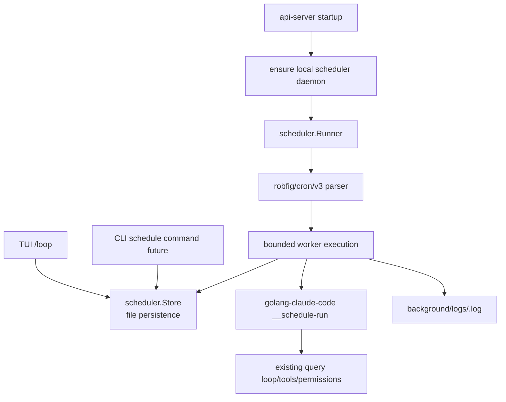

# /loop 与本地 Cron Scheduler 技术方案

## 背景

官方 Claude Code 源码支持 `/loop`，位置：

```text
$HOME/GolandProjects/claude_code_src_2026/src/skills/bundled/loop.ts
```

官方语义是：

- `/loop [interval] <prompt>`
- 未指定 interval 时默认 `10m`
- 支持前置 interval：`/loop 5m /babysit-prs`
- 支持尾部 every：`/loop check deploy every 20m`
- prompt 可以是普通自然语言，也可以是 slash command
- 创建 recurring schedule 后立即执行一次

当前 Go Claude 已支持 `/loop` 入口，但早期实现是“每个 loop 起一个后台进程并 sleep 循环”。它能跑，但不是合理的 cron scheduler 架构，也不利于 api-server 模式、排查、扩展和高可用。

## 现状结论

api-server 模式现在支持本地 cron scheduler daemon，并暴露 runtime 管理 API。

原因：

- `internal/server` 只有 HTTP handler、mobile API、tenant CRUD、OpenAI-compatible API、telemetry 等主链路。
- `internal/scheduler` 负责任务扫描、cron parser、worker pool 和执行记录。
- `/loop` 在 TUI slash command 中创建 background job 与 schedule，并由 scheduler daemon 周期执行。
- `internal/server/runtime.go` 暴露 `/runtime/background`、`/runtime/background/{id}`、`/runtime/background/{id}/run`、`/runtime/background/{id}/runs`、`/runtime/background/events`、`/runtime/background/{id}/logs`、`/runtime/background/{id}/stop`，供 WebUI 创建、编辑、手动运行、查看历史、查看日志和停止 loop。
- TUI tail `scheduler/events.jsonl`，同时保留日志增长兜底；后续 scheduler fire 会在当前 TUI 消息流中显示 `Loop` 消息和最新输出。

## 目标

本次目标不是堆一段 sleep 逻辑，而是建立可扩展的本地 scheduler 基座：

- TUI `/loop` 使用真实 scheduler 注册 recurring job。
- api-server 启动时确保本地 scheduler daemon 存活，使 server 模式具备本地定时任务执行能力。
- 保持 CLI/TUI/API 查询执行复用现有 query loop、权限、模型、工具、日志路径。
- 支持未来扩展到 HTTP schedule CRUD、MySQL store、分布式锁、多实例 HA、任务审计和监控。

## 架构



## 模块划分

### `internal/scheduler`

负责 schedule 的领域模型、持久化、调度和执行编排。

核心对象：

- `Schedule`：定时任务定义。
- `Store`：文件持久化 store，默认 schedule 位于 `CLAUDE_CONFIG_DIR/schedules.json`，事件位于 `CLAUDE_CONFIG_DIR/scheduler/events.jsonl`，运行历史位于 `CLAUDE_CONFIG_DIR/scheduler/runs.jsonl`。
- `Runner`：进程内 scheduler，使用 `robfig/cron/v3`。
- `Executor`：执行 schedule 的抽象，当前默认通过子进程调用 `__schedule-run <id>`。

### `internal/background`

继续作为后台任务日志和执行状态视图：

- `/ps` 仍能看到 loop/schedule 任务。
- `logs <id>` 仍读取同一路径日志。
- `kill <id>` 仍能杀掉正在运行的子进程，并停用 schedule。

### `internal/cli`

负责：

- `/loop` 解析参数。
- 创建 scheduler schedule。
- 确保本地 scheduler daemon 存活。
- `__schedule-daemon` 运行本地 scheduler。
- `__schedule-run <id>` 执行一次 schedule prompt。

### `internal/server`

api-server 启动时确保本地 scheduler daemon 存活：

- server 启动时会确保本地 scheduler daemon 存活，避免 TUI daemon 和 server 内置 runner 双重触发同一个任务。
- 暴露本地 runtime background API，用于列出、创建、编辑、手动运行、查看日志、查看运行历史、tail scheduler events 和停止 loop。
- 当前 API 是本地 runtime 管理面，不是多租户 schedule CRUD；未来仍可在此基础上增加 `/tenant/schedules` 或 `/schedules`。

### `web/`

WebUI 在 Observability 下提供 `Loops` tab：

- 列出当前本地 runtime 的 loop/background jobs。
- 展示 prompt、cwd、interval、run count、last/next run、PID、最新日志输出。
- 支持新建、编辑、立即运行和停止指定 loop；停止实现上同时 disable schedule 并 kill 对应 background job。
- 展示 `runs.jsonl` 中的运行历史，用于确认某个 scheduled fire 或手动 run 是否真正执行、是否失败以及对应日志大小。

### Scheduler Events 与 Run History

Scheduler 现在维护两类 append-only JSONL 文件：

- `scheduler/events.jsonl`：记录 `created`、`updated`、`disabled`、`run_started`、`run_finished`。读取接口按 byte offset 增量返回，并把 `next_offset` 返回给调用方。
- `scheduler/runs.jsonl`：记录每次自动或手动执行的 run record，包含 schedule/background id、prompt、cwd、status、error、started/finished time、log bytes。

TUI 的 watcher 会优先读取 events 文件：

- `run_started` 可让前台知道 scheduler 已经触发。
- `run_finished` 会刷新对应 background 日志，并把最新输出追加到 TUI 消息流。
- 老数据不会在 TUI 启动时一次性刷屏；首次轮询只建立 offset 与日志基线。

### Scheduler Reload

本地 scheduler daemon 不只在启动时读取一次 `schedules.json`，而是周期性 reconcile：

- 新增 schedule 自动注册到 cron。
- 禁用或删除 schedule 自动从 cron 移除。
- 已注册 schedule 不重复注册。

这保证了 TUI `/loop` 在 daemon 已经运行时新增任务也能被真实调度。

## 调度语义

本地 `/loop` 使用 `@every <duration>` 表达 recurring interval：

- `5m` -> `@every 5m`
- `20m` -> `@every 20m`
- `1h` -> `@every 1h`
- `1d` -> `@every 24h`
- `30s` 按官方规则向上取整到 `1m`

创建后：

1. 持久化 schedule。
2. 立即触发一次 run。
3. 后续由 scheduler 按 interval 执行。
4. `POST /runtime/background/{id}/run` 可手动立即执行一次，不改变 recurring 规则。
5. `kill <id>` 或 `POST /runtime/background/{id}/stop` 停止 schedule 后不再触发。

## 前台可见性

原版 Claude Code 的 scheduled task fire 会进入 REPL/TUI 消息流。Go 版现在补齐最小兼容行为：

- TUI 启动后每 5 秒读取 scheduler events，并轮询当前 cwd 的 loop/background 状态作为兜底。
- 第一次轮询只记录 event offset 和日志基线，避免把历史旧日志一次性刷到当前屏幕。
- 之后如果收到 `run_finished` 事件，或检测到 `run_count`、日志长度、状态发生变化，TUI 会追加一条 `Loop` 消息，包含触发时间、prompt/schedule id 和最新日志 tail。
- 完整日志仍通过 `logs <background_id>`、`attach <background_id>` 或 WebUI Loops 详情查看。

## 高可用与扩展设计

当前本地文件 store 适合单机开发和本地 TUI/API server。

未来高可用扩展点：

- Store 替换为 MySQL 表：`schedules`、`schedule_runs`。
- Runner 增加 lease/distributed lock，避免多实例重复执行。
- Worker 增加 concurrency、timeout、retry、backoff、dead-letter。
- API 增加多租户 CRUD、enable/disable、分布式 manual trigger。
- Telemetry 增加 `schedule.run.started/finished/failed`。
- Audit 增加创建、禁用、执行记录。

## 非目标

本次不一次性实现：

- 多租户 schedule API。
- MySQL 分布式锁。
- 多租户 schedule UI 管理页面。
- cron 秒级精准语义。

这些留给下一步基于稳定 scheduler 基座继续扩展。
