# Runtime Message Flow and Closure Architecture

更新时间：2026-07-10

本文说明 Go Claude 在用户发送一条消息后，runtime 如何组装上下文、调用模型、执行工具、处理工具失败、判断是否允许最终回复，以及 subagent / multi-agent 在什么时机触发。本文以当前实现为准，重点代码路径：

- `internal/cli/cli.go`: `newQuerySession`、`coreRuntimeTools`
- `internal/query/query.go`: `Session.run`、`runTool`、closure event 记录
- `internal/query/closure_gate.go`: `TaskContract`、`preToolClosureGate`、`completionGate`
- `internal/query/shell_intent.go`: Bash / Git / external action 分类
- `internal/tools/task/task.go`: 同步 Task subagent
- `internal/tools/agent/agent.go`: `AgentCreate`、`AgentGet`、`AgentMessage`
- `internal/agentruntime/runtime.go`: subagent 独立运行时

## 术语表

| 术语 | 含义 | 代码/观察位置 |
| --- | --- | --- |
| runtime | Go Claude 执行一轮用户请求的本地控制层，负责上下文、工具、权限、闭环和输出，不等同于模型本身。 | `internal/query/query.go` |
| entry | 用户请求进入系统的入口，当前主要是 TUI、CLI print/headless、API server。 | `internal/cli/cli.go`、`internal/server` |
| `query.Session` | 主对话运行时对象；同一条消息最终由它执行模型请求、工具循环和 final gate。 | `query.New`、`Session.run` |
| turn | 一次模型请求和响应。模型如果返回 tool_use，工具结果会进入下一 turn；没有 tool_use 时可能进入 final gate。 | `for turn := 1; turn <= MaxTurns` |
| `MaxTurns` | 单次用户请求允许的最大模型 turn 数。gate 阻断 final 后会消耗后续 turn。 | `query.Options.MaxTurns` |
| system blocks | 发给模型的系统提示块，包括基础身份、工作流规则、memory、skills、环境、tenant runtime 等。 | `effectiveSystemBlocks` |
| messages | 发给模型的对话消息数组，包含历史、用户 prompt、工具调用结果和 runtime reminder。 | `MessagesRequest.Messages` |
| tool registry | 当前 session 可用工具集合；core tools、MCP tools、Task/Agent tools 都注册到这里。 | `tools.Registry` |
| guarded tool | 被权限策略包裹后的工具。模型即使发起 tool_use，也要过 permission policy。 | `tools.GuardAll`、`tools.Guard` |
| hook | 用户配置的工具前后拦截或通知脚本。`PreToolUse` 可以 deny 或 rewrite input。 | `internal/hooks` |
| permission policy | 由配置生成的工具权限边界，决定工具是否允许执行、是否需要 ask。 | `permissions.FromSettings` |
| tool_use | 模型请求调用工具的结构化输出。runtime 收到后执行工具并把结果作为 `tool_result` 回传。 | `collectToolUses` |
| tool_result | 工具执行结果。成功和失败都会回传给模型，失败时 `IsError=true`。 | `anthropic.ContentBlock{Type:"tool_result"}` |
| `ToolTrace` | runtime 对一次工具调用的结构化记录，包含 name/input/output/is_error/file_changes。 | `query.ToolTrace` |
| `FileChanges` | 工具执行导致的文件变化，供 post-action delta gate 判断是否需要验证。 | `tools.FileChange` |
| `TaskContract` | runtime 从用户 prompt 推导出的任务闭环合同，包含 closure level、必读路径、共享状态操作。 | `buildTaskContract` |
| closure level | 任务闭环强度等级：L0 简单回答到 L5 共享状态变更。 | `closureLevel*` |
| evidence | 支撑 final claim 的证据，例如 Read/Grep/LS 结果、测试命令成功、git 状态验证。 | `evidence_record` |
| delta | 本轮产生的变更或潜在副作用，例如文件写入、Bash 写操作、commit/push/tag。 | `delta_record` |
| candidate final | 模型给出的“看起来要最终回复”的文本。它还没有通过 `CompletionGate`，不能直接视为已接受输出。 | `turnResponse` |
| accepted final | 通过 gate 后真正输出给用户并写入 accepted assistant transcript 的最终回复。 | `recordAssistant` |
| `CompletionGate` | final 前硬闸门，检查 read scope、post-action delta、final claim 是否有证据。 | `completionGate` |
| `preToolClosureGate` | 工具执行前硬闸门，当前主要保护 Bash 的 commit/push/tag/external write 等高风险动作。 | `preToolClosureGate` |
| `block_continue` | final 不被接受，但允许模型继续下一 turn 补证据或修正表述。 | `gateSeverityBlockContinue` |
| `block_tool` | 工具不执行，runtime 直接返回 failed tool_result，要求先补前置证据或授权。 | `gateSeverityBlockTool` |
| synthetic tool_result | runtime 生成的失败工具结果，不是工具真实执行结果；用于告诉模型“这次工具调用被 gate 拦截”。 | `blockedToolTrace` |
| `<system-reminder>` | runtime 插入给模型的系统提醒文本，用来说明 gate 为什么阻断以及下一步要补什么。 | gate reminder 文本 |
| readback verification | 对已执行动作做只读回查，例如 commit 后看 `git log -1`，push 后看 upstream/remote 状态。 | `post*VerificationObserved` |
| checkpoint | session transcript 中的回滚锚点。每条用户消息前会自动写入 `auto-<messageID>` checkpoint，用户也可以手动创建。 | `Recorder.Checkpoint`、`Store.Checkpoint` |
| rewind | 按 checkpoint 或 message id 回退会话/文件状态。可同时回退 transcript 和文件，也可只回退文件或只回退 conversation。 | `Store.Rewind`、`rewindFiles`、`/rewind` |
| fork | 从 checkpoint 截断复制一份新 session，用于从历史锚点开新分支继续。 | `Store.Fork`、`session fork` |
| subagent | 独立的子 agent conversation。它不自动继承父线程全文，必须由父 agent 给完整 brief。 | `internal/agentruntime` |
| `capability_loop` | subagent 或长工具结果给父 agent 的结构化决策上下文，包含 evidence、unknowns、verification、risks、next_action。 | `agentruntime.CapabilityLoop` |

## 总体架构

TUI、CLI print/headless、API server 最终都会进入同一个 `query.Session` 主循环；差异主要在入口、输出形态、权限审批 UI 和持久化方式。

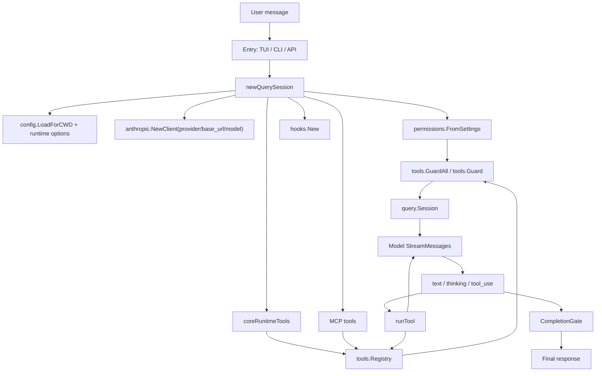
```mermaid
flowchart TD
  U["User message"] --> E["Entry: TUI / CLI / API"]
  E --> NQS["newQuerySession"]
  NQS --> CFG["config.LoadForCWD + runtime options"]
  NQS --> CLIENT["anthropic.NewClient(provider/base_url/model)"]
  NQS --> POLICY["permissions.FromSettings"]
  NQS --> HOOKS["hooks.New"]
  NQS --> CORE["coreRuntimeTools"]
  NQS --> MCP["MCP tools"]
  CORE --> REG["tools.Registry"]
  MCP --> REG
  POLICY --> GUARDED["tools.GuardAll / tools.Guard"]
  REG --> GUARDED
  GUARDED --> Q["query.Session"]
  Q --> MODEL["Model StreamMessages"]
  MODEL --> LOOP["text / thinking / tool_use"]
  LOOP --> TOOL["runTool"]
  TOOL --> REG
  TOOL --> MODEL
  LOOP --> GATE["CompletionGate"]
  GATE --> OUT["Final response"]
```

`coreRuntimeTools` 默认注册文件、搜索、Bash、Todo、Plan、Skill、MCP resources、TaskOutput、AskUserQuestion、WebFetch/WebSearch、Worktree、WebBrowser、agent 管理等工具。`Task`、`AgentCreate`、`AgentMessage` 在 `newQuerySession` 里额外注册，并使用同一个 registry / permission policy。

### 多路闭环主线

运行时不是一条线性“模型回答”流程，而是同一条用户消息同时进入几条控制链路。动态太阳系架构图见 `docs/architecture/go_claude_multi_loop_solar_runtime.html`。

| 链路 | 准确表述 | 关键说明 |
| --- | --- | --- |
| 交付闭环 | `request -> TaskContract -> plan/do -> ToolTrace evidence -> gate -> optional commit/readback -> done` | `commit/push/tag/deploy` 不是所有任务的必经步骤；只有用户请求共享状态动作，或 final 声称已 committed/pushed/tagged/deployed 时，才进入可选提交与 readback 硬约束链路。 |
| Level Gate | `read/edit/Bash -> closure level -> completionGate/preToolClosureGate -> block_continue/block_tool/pass` | Level 是任务风险标签；硬阻断由 Go gate 函数根据 `TaskContract`、ToolTrace 和 Bash intent 判断。 |
| Query Loop | `LLM tool_use -> runTool/preToolGate -> tool_result -> next turn -> final gate` | 只要模型返回 `tool_use`，runtime 就执行或阻断工具并把 `tool_result` 回灌给模型；没有 tool_use 时才尝试 final。 |
| Trace | `closure event -> transcript metadata -> trace UI -> resume sanitizer skip` | closure event 只用于可观测和回归排查；恢复上下文时会被 sanitizer 跳过，不作为模型语义上下文恢复。 |
| Checkpoint Loop | `auto checkpoint -> user message -> file_change snapshots -> rewind/fork -> restore/copy -> resume sanitizer skip metadata` | checkpoint/rewind/fork 是 session 级闭环：保证每轮用户消息前有可回退锚点，必要时可以恢复文件或分叉会话；这些 metadata 不作为模型上下文恢复。 |

因此，普通读文件、排查或本地改代码任务可以在 evidence 和 final gate 通过后闭环；只有 L5/shared-state 任务，或 final 文本自己声称已经提交、推送、打 tag、部署、发布，才需要对应的共享状态执行证据和 readback verification。

## 单条消息 Runtime 流程

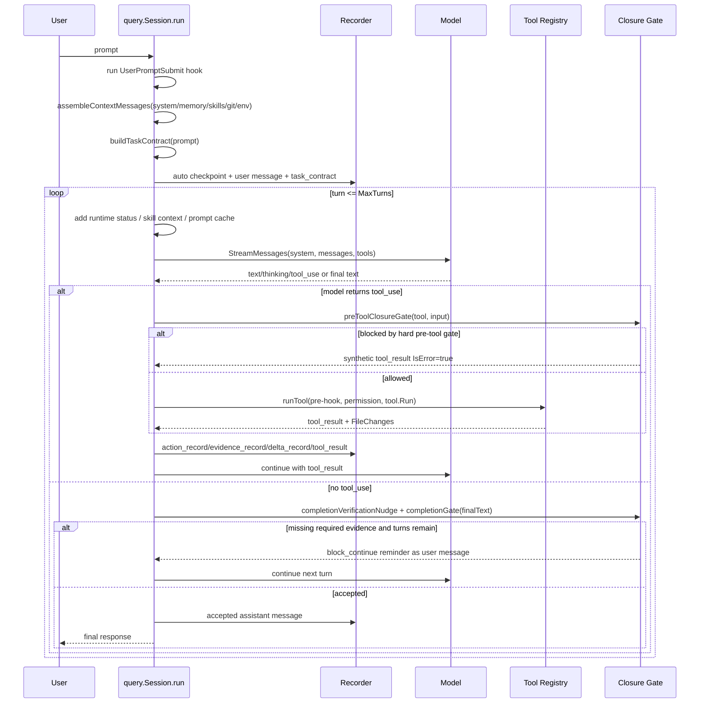
```mermaid
sequenceDiagram
  participant U as User
  participant Q as query.Session.run
  participant R as Recorder
  participant M as Model
  participant T as Tool Registry
  participant G as Closure Gate

  U->>Q: prompt
  Q->>Q: run UserPromptSubmit hook
  Q->>Q: assembleContextMessages(system/memory/skills/git/env)
  Q->>Q: buildTaskContract(prompt)
  Q->>R: auto checkpoint + user message + task_contract
  loop turn <= MaxTurns
    Q->>Q: add runtime status / skill context / prompt cache
    Q->>M: StreamMessages(system, messages, tools)
    M-->>Q: text/thinking/tool_use or final text
    alt model returns tool_use
      Q->>G: preToolClosureGate(tool, input)
      alt blocked by hard pre-tool gate
        G-->>Q: synthetic tool_result IsError=true
      else allowed
        Q->>T: runTool(pre-hook, permission, tool.Run)
        T-->>Q: tool_result + FileChanges
      end
      Q->>R: action_record/evidence_record/delta_record/tool_result
      Q->>M: continue with tool_result
    else no tool_use
      Q->>G: completionVerificationNudge + completionGate(finalText)
      alt missing required evidence and turns remain
        G-->>Q: block_continue reminder as user message
        Q->>M: continue next turn
      else accepted
        Q->>R: accepted assistant message
        Q-->>U: final response
      end
    end
  end
```

关键点：

- final 文本在没有工具调用的 turn 先进入 `completionGate`；通过后才 replay 给 UI/stdout，并写入 accepted assistant transcript。
- 如果 final 被 gate 拦截，runtime 会移除本轮 candidate final，插入 `<system-reminder>` 继续下一轮；被拦截的 premature final 不会作为已接受回复写入 transcript。
- 工具调用轮的 assistant 文本会先输出，因为这类文本是工具调用前的过程说明；真正最终结论仍要等无工具调用的 final turn 通过 gate。

## 工具调用与错误处理

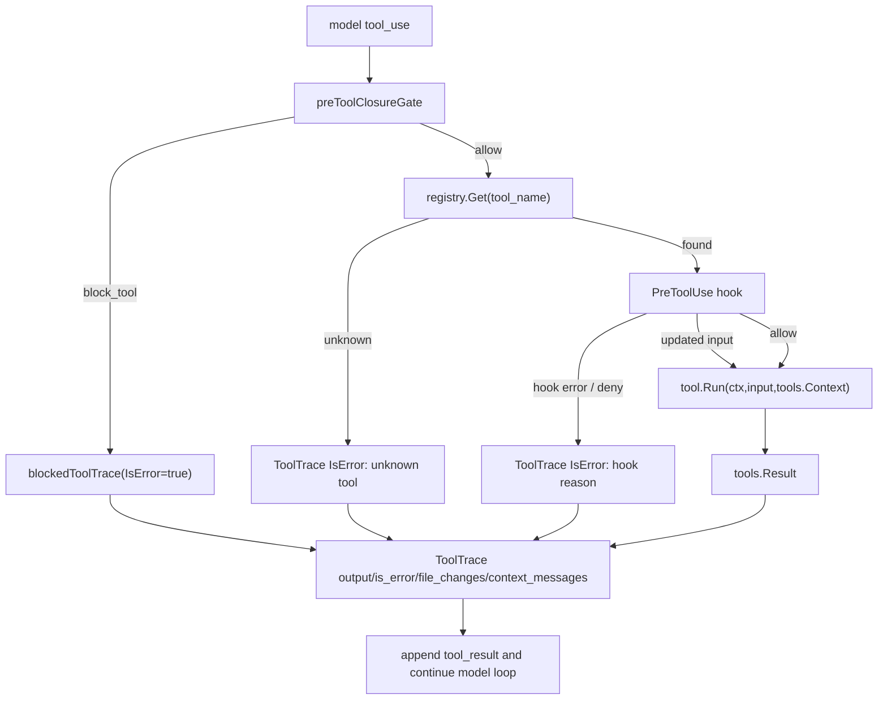
```mermaid
flowchart TD
  TU["model tool_use"] --> PRE["preToolClosureGate"]
  PRE -->|block_tool| SYN["blockedToolTrace(IsError=true)"]
  PRE -->|allow| LOOKUP["registry.Get(tool_name)"]
  LOOKUP -->|unknown| ERR1["ToolTrace IsError: unknown tool"]
  LOOKUP -->|found| HOOK["PreToolUse hook"]
  HOOK -->|hook error / deny| ERR2["ToolTrace IsError: hook reason"]
  HOOK -->|updated input| RUN["tool.Run(ctx,input,tools.Context)"]
  HOOK -->|allow| RUN
  RUN --> RES["tools.Result"]
  RES --> TRACE["ToolTrace output/is_error/file_changes/context_messages"]
  SYN --> TRACE
  ERR1 --> TRACE
  ERR2 --> TRACE
  TRACE --> NEXT["append tool_result and continue model loop"]
```

工具错误不会让 runtime 自动伪造成功结果。错误会以 `tool_result` 的 `IsError=true` 回传给模型，模型必须选择修正参数、换工具、解释失败边界，或在需要时请求用户确认。典型错误来源：

| 错误来源 | runtime 行为 | 模型后续应做什么 |
| --- | --- | --- |
| unknown tool | 返回 `unknown tool: <name>` | 改用 registry 中存在的工具 |
| PreToolUse hook error/deny | 返回 hook 错误或拒绝原因 | 根据 hook 反馈调整，不重复盲试 |
| permission deny | guarded tool 返回拒绝结果并记录 audit | 说明权限边界或请求授权 |
| tool.Run 返回 IsError | 原样作为 tool_result 进入下一轮 | 诊断错误、修正输入或披露失败 |
| `preToolClosureGate` block_tool | 生成 synthetic failed tool_result | 补齐前置证据或请求授权 |
| subagent 失败/超时 | Task/Agent 工具返回错误或 partial result | 父 agent 保留 partial evidence，不把它当完整结论 |

## 闭环处理的触发与强度

闭环不是所有任务都走重型流程，而是由 `buildTaskContract(prompt)` 给当前 turn 归类：

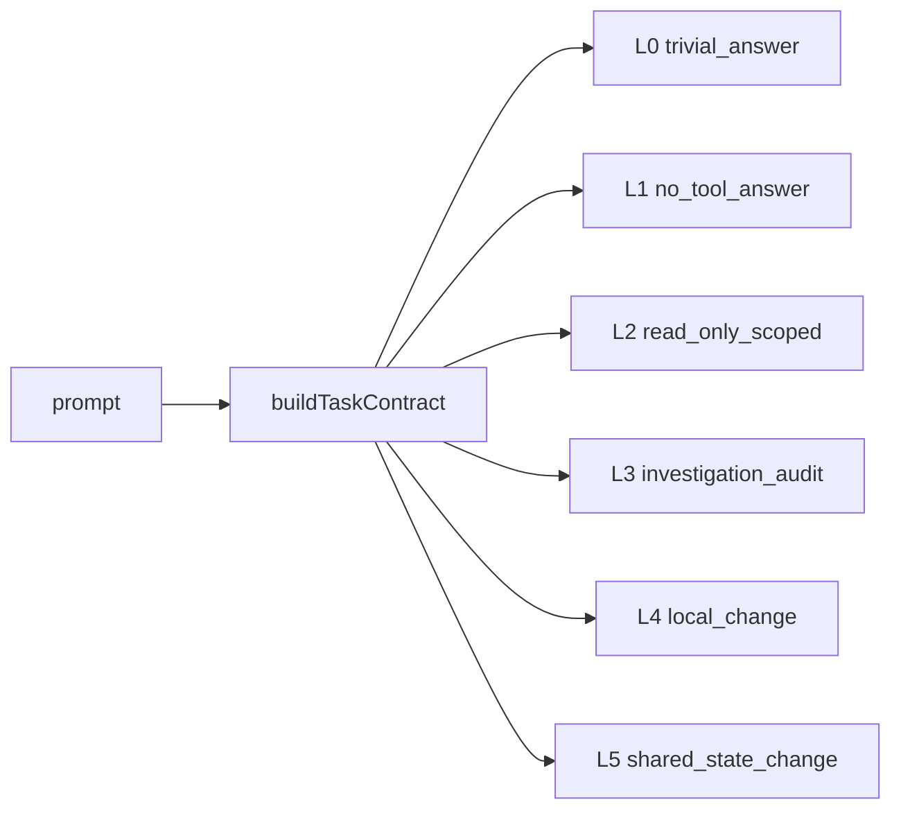
```mermaid
flowchart LR
  P["prompt"] --> C["buildTaskContract"]
  C --> L0["L0 trivial_answer"]
  C --> L1["L1 no_tool_answer"]
  C --> L2["L2 read_only_scoped"]
  C --> L3["L3 investigation_audit"]
  C --> L4["L4 local_change"]
  C --> L5["L5 shared_state_change"]
```

| Closure Level | 典型任务 | 闭环要求 |
| --- | --- | --- |
| L0 trivial | `1+1=?` | 直接回答；不要求工具、不注入重型检查 |
| L1 no-tool | 一般解释、无需本地事实 | 可以直接回答；不能声称已检查本地状态 |
| L2 read-only scoped | 读文件/目录并总结、解释、对比 | final 声称总结前必须有 Read/Grep/Glob/LS/read-only Bash evidence |
| L3 investigation/audit | 排查、审计、找风险 | 要有搜索/读取范围证据；不能无证据说“全仓库无问题” |
| L4 local change | 修改文件、修 bug、实现功能 | 修改后必须有 scope、metadata、semantic checks |
| L5 shared state | commit/push/tag/deploy/publish/send | 仅在用户请求或 final claim 涉及共享状态时触发；操作前有授权和状态 precheck，操作后有 readback verification |

### Closure Level 与 Go Gate 的关系

L0-L5 是 `TaskContract` 里的闭环强度标签，不是 6 个一一对应的 gate 函数。当前 Go 实现里，Level 的主要作用是让 runtime 知道任务的大致风险和必要证据；真正阻断由 `completionGate` 和 `preToolClosureGate` 根据更具体的条件触发。

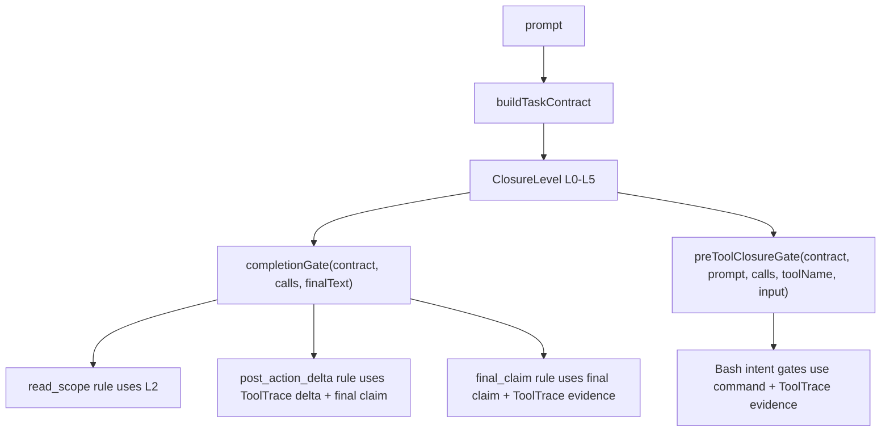
```mermaid
flowchart TD
  P["prompt"] --> BTC["buildTaskContract"]
  BTC --> LEVEL["ClosureLevel L0-L5"]
  LEVEL --> CG["completionGate(contract, calls, finalText)"]
  LEVEL --> PTG["preToolClosureGate(contract, prompt, calls, toolName, input)"]
  CG --> RSG["read_scope rule uses L2"]
  CG --> DAG["post_action_delta rule uses ToolTrace delta + final claim"]
  CG --> FCG["final_claim rule uses final claim + ToolTrace evidence"]
  PTG --> BASH["Bash intent gates use command + ToolTrace evidence"]
```

| Level | `buildTaskContract` 触发条件 | 直接关联的 Go check | 其他可能触发的 gate | 说明 |
| --- | --- | --- | --- | --- |
| L0 `trivial_answer` | `isTrivialAnswerPrompt(text)`，例如 `1+1=?` | 无专属 gate；`completionGate` 通常 allow | `final_claim` 仍可拦截无证据本地声明 | 轻闭环：不要求工具，不注入 repo/test/git 负担。 |
| L1 `no_tool_answer` | 空 prompt 或不匹配其他任务类型 | 无专属 gate；`completionGate` 通常 allow | `final_claim` 仍可拦截 searched/tested/committed 等无证据声明 | 一般知识/解释类回答；不能声称检查过本地状态。 |
| L2 `read_only_scoped` | `looksLikeReadOnlyScopedPrompt(text)` 且提取到 path | `read_scope` | `final_claim` 也会检查 searched/full repo/no issues 等声明 | 唯一直接使用 `contract.ClosureLevel` 的 completion gate。 |
| L3 `investigation_audit` | `classifyRuntimeTaskPrompt` 识别 repo/release/entrypoint audit | 无 L3 专属函数 | `final_claim` 拦截无搜索证据的 searched/full repo/no issues；复杂输出仍靠审计策略 prompt 引导 | 当前 L3 主要靠策略提示 + final claim gate，不是独立 audit gate。 |
| L4 `local_change` | `classifyRuntimeTaskPrompt` 识别 repair/code change | 无 L4 专属函数 | `post_action_delta` 在有 FileChanges 且 final 声称 done/fixed 时硬拦截 | Level 标记任务风险；真正硬 gate 看工具是否产生 delta。 |
| L5 `shared_state_change` | `looksLikeSharedStatePrompt(text)` 或含 commit/push/tag/deploy/publish | 无 L5 专属函数 | `preToolClosureGate` 拦截 Bash commit/push/tag/external write；`final_claim` 要求 post-action evidence | `contract.SharedStateOperations` 会记录意图，但当前 pre-tool gate 主要按 Bash intent 和 prompt 授权判断；L5 是共享状态路径，不是普通交付闭环的必经尾段。 |

因此，当前 Level 与 gate 的关系可以概括为：

- `L0/L1`：默认轻量；除非 final 自己声称了本地检查、测试、提交、推送等高置信事实，否则不会被重型 gate 拖慢。
- `L2`：有明确专属硬 gate，即 `Read Scope Gate`。
- `L3`：没有独立 `investigationGate`；靠审计类 prompt strategy 加 `Final Claim Gate` 防止无证据结论。
- `L4`：没有独立 `localChangeGate`；只要工具产生 `FileChanges`，`Post-Action Delta Gate` 就按 delta 事实触发。
- `L5`：没有独立 `sharedStateGate` 函数；shared-state 的执行前硬约束在 `preToolClosureGate`，执行后声明由 `Final Claim Gate` 检查。普通任务没有 commit/push/tag/deploy 请求或声明时，不会因为“交付闭环”而被强制提交。

### L0-L5 与 check func 速查

下面这张表可以直接回答“Level 和 Go check func gate 有什么区别”：

| Level 常量 | 是否有专属 check func | 会进入哪些硬 gate | 硬阻断时机 | 软约束/提示词部分 |
| --- | --- | --- | --- | --- |
| `L0_trivial_answer` | 否 | 通常只经过 `completionGate` 的空跑；若 final 声称本地事实，会触发 `final_claim` | final 前 | 不注入重型审计/验证策略，目标是直接回答 |
| `L1_no_tool_answer` | 否 | 同 L0；`final_claim` 防止无证据声称 searched/tested/committed/pushed | final 前 | 允许知识解释类直接答，但不能伪造本地检查 |
| `L2_read_only_scoped` | 是，`read_scope` | `read_scope`，之后继续走 `post_action_delta` 和 `final_claim` | final 前 | prompt 可提醒先读文件，但真正阻断看 `ToolTrace` read evidence |
| `L3_investigation_audit` | 否 | `final_claim`，必要时也会因工具 delta 进入 `post_action_delta` | final 前 | 审计策略主要来自 runtime prompt strategy；Go gate 只兜底高置信结论证据 |
| `L4_local_change` | 否 | 修改后由 `post_action_delta` 兜底；final 声称测试/完成再由 `final_claim` 兜底 | final 前 | post-edit reminder 是软引导，硬阻断看最新 delta 后是否补 scope/metadata/semantic checks |
| `L5_shared_state_change` | 否 | `preToolClosureGate` 拦 Bash 高风险动作；完成声明再走 `final_claim` | 工具前 + final 前 | prompt 授权是必要输入之一，但 commit/push/tag 等还必须有本轮只读证据；非共享状态任务不强制走这条链路 |

所以当前不是“Level -> 单独专属 gate 函数”的架构，而是：

```go
contract := buildTaskContract(prompt)
// final path
completionGate(contract, calls, finalText)
// tool path
preToolClosureGate(contract, prompt, calls, toolName, input)
```

`contract.ClosureLevel` 只被部分 gate 直接读取。当前最明确的一处是 `read_scope`：

```go
if contract.ClosureLevel != closureLevelReadOnlyScoped {
    return ""
}
```

`post_action_delta` 和 `final_claim` 更偏“事实驱动”：它们不要求 Level 必须等于 L4/L5，而是看本轮是否真的出现了 `FileChanges`、write-like Bash、测试声明、commit/push/tag/deploy 声明等证据条件。这能避免模型把任务误分级后绕过硬约束。

## CompletionGate 判定逻辑

当前 `completionGate` 是 final 前硬 gate，由 `completionGateRules` 规则表按优先级短路执行。规则表当前包含三个主要检查：

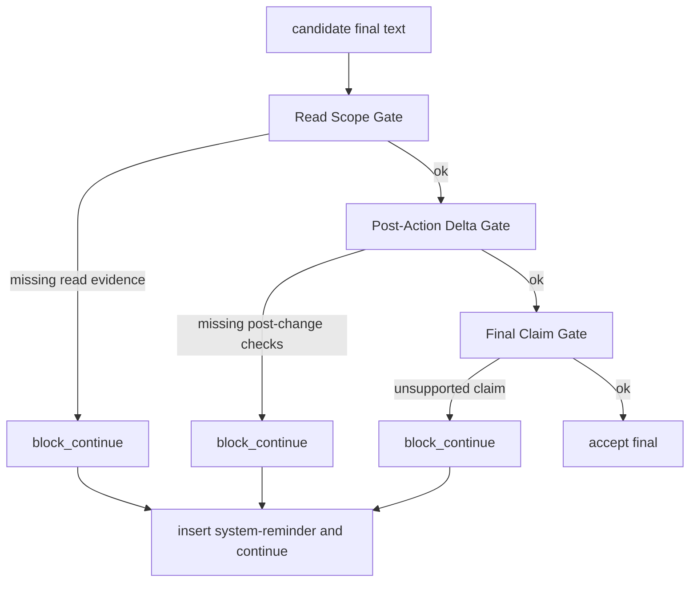
```mermaid
flowchart TD
  F["candidate final text"] --> RSG["Read Scope Gate"]
  RSG -->|missing read evidence| BLOCK1["block_continue"]
  RSG -->|ok| DAG["Post-Action Delta Gate"]
  DAG -->|missing post-change checks| BLOCK2["block_continue"]
  DAG -->|ok| FCG["Final Claim Gate"]
  FCG -->|unsupported claim| BLOCK3["block_continue"]
  FCG -->|ok| ACCEPT["accept final"]
  BLOCK1 --> REM["insert system-reminder and continue"]
  BLOCK2 --> REM
  BLOCK3 --> REM
```

### Read Scope Gate

适用于 L2 read-only scoped。用户要求读取本地文件/目录并总结、解释、对比时，如果 final 声称已经读过、总结过或覆盖完整范围，必须有本轮工具证据：

- `Read`
- `Grep`
- `Glob`
- `LS`
- read-only `Bash`

如果只读了片段，却声称全文覆盖，也会被拦截，要求继续读取或明确披露范围。

### Post-Action Delta Gate

当本轮出现文件改动或高风险 Bash/shared-state 迹象，并且 final 声称 done/fixed/completed 时，要求在最新 delta 之后出现最小验证：

- scope check: `git status --short` + `git diff --name-status`
- metadata check: `git diff --summary`
- semantic check: 聚焦测试或确定性只读命令，用来验证被修改的不变量

这保证“改了什么”和“改得对不对”不是只靠模型自述。

### Final Claim Gate

final 中出现高置信声明时，会检查相应证据：

| final 声明 | 必要证据 |
| --- | --- |
| searched / inspected | Grep/Glob/LS/Read 或 read-only Bash |
| full repo / all files | broad local search/list evidence |
| tests passed / checks passed | 成功 verification Bash |
| committed | 成功 `git commit` + post-commit `git status`/`git log`/`rev-parse` |
| pushed | 成功 `git push` + post-push remote/branch verification |
| tag created/updated | 成功 mutating `git tag` + post-tag object verification |
| deployed/published/sent | 成功 external action evidence |
| no issues found | 至少有本地 read/search evidence |

## PreTool 硬约束

`preToolClosureGate` 是工具执行前的硬 gate，目前主要保护 Bash 类高风险边界。它不是提示词建议；命中后工具不会执行，而是返回 `IsError=true` 的 synthetic tool result。

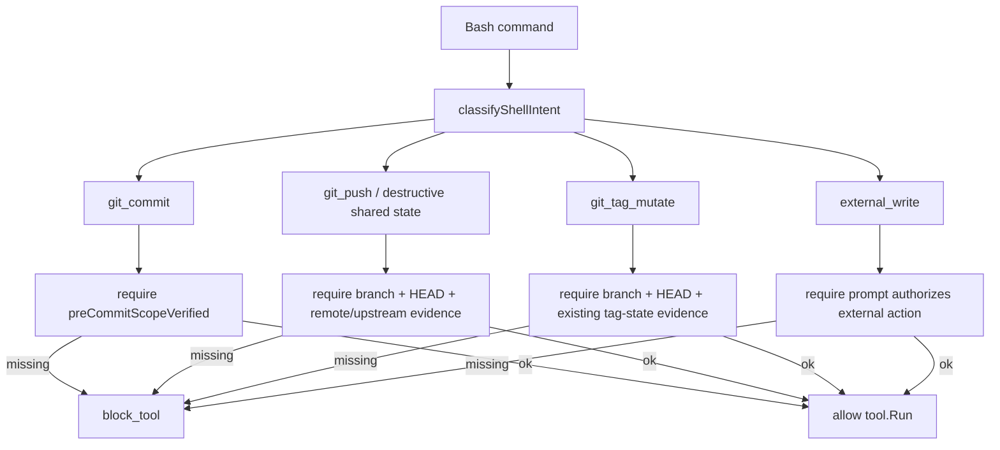
```mermaid
flowchart TD
  B["Bash command"] --> SI["classifyShellIntent"]
  SI --> COMMIT["git_commit"]
  SI --> PUSH["git_push / destructive shared state"]
  SI --> TAG["git_tag_mutate"]
  SI --> EXT["external_write"]
  COMMIT --> PC["require preCommitScopeVerified"]
  PUSH --> PP["require branch + HEAD + remote/upstream evidence"]
  TAG --> PT["require branch + HEAD + existing tag-state evidence"]
  EXT --> EA["require prompt authorizes external action"]
  PC -->|missing| BLOCK["block_tool"]
  PP -->|missing| BLOCK
  PT -->|missing| BLOCK
  EA -->|missing| BLOCK
  PC -->|ok| ALLOW["allow tool.Run"]
  PP -->|ok| ALLOW
  PT -->|ok| ALLOW
  EA -->|ok| ALLOW
```

当前硬拦截包括：

- `git commit`: 必须先看到当前会话的 scope verification，尤其是最新写入/暂存后的 `git status`、`git diff --name-status`、staged check。
- `git push`: 必须先有 branch、HEAD、remote/upstream 证据，例如 `git status --short --branch`、`git rev-parse HEAD`、`git rev-parse @{u}`、`git branch -vv`、`git ls-remote`。
- mutating `git tag`: 必须先有 branch/object 证据和现有 tag-state 证据。
- destructive shared-state: force push、远端 tag 删除、tag move 等需要用户明确授权。
- external write: deploy/publish/send/release 等外部副作用，当前用户请求没有明确授权时阻断；dry-run/preview/check/plan 类命令按只读预览处理。

## 硬约束 vs 提示词软约束

| 机制 | 类型 | 说明 |
| --- | --- | --- |
| System prompt / tool description | 软约束 | 引导模型选择正确流程，但模型仍可能忽略 |
| `tools.Guard` / permission policy | 硬约束 | 工具执行层拒绝未授权操作 |
| PreToolUse hooks | 硬约束 | hook 可 deny 或 rewrite input |
| `preToolClosureGate` | 硬约束 | 命中后工具不执行，返回 failed tool_result |
| `completionGate` | 硬约束 | final 不通过就不接受，插入 reminder 继续 |
| closure transcript events | 可观测证据 | 记录 task/action/evidence/delta/gate，便于 trace 和回归 |
| checkpoint / rewind / fork | session 硬机制 | checkpoint 写入 transcript；rewind/fork 由 Go 代码截断、复制 transcript，并可根据 file_change snapshot 恢复文件，不依赖模型自觉 |
| subagent evidence contract | 软约束 + 结构化结果 | 要求 subagent 输出 Evidence/Unknowns/Verification 等；父 agent 仍需综合判断 |

因此，Go Claude 当前闭环的关键边界已经不是纯 prompt。prompt 负责让模型少走错路；runtime gate 负责阻止无证据 final 和未满足前置条件的高风险工具动作。

## Checkpoint 闭环机制

Checkpoint 闭环解决的是“会话和文件状态能否回到一个已知锚点”，它和 `completionGate` / `preToolClosureGate` 不同：checkpoint 不决定 final 是否通过，也不决定工具是否执行；它是 session lifecycle 层的硬机制。

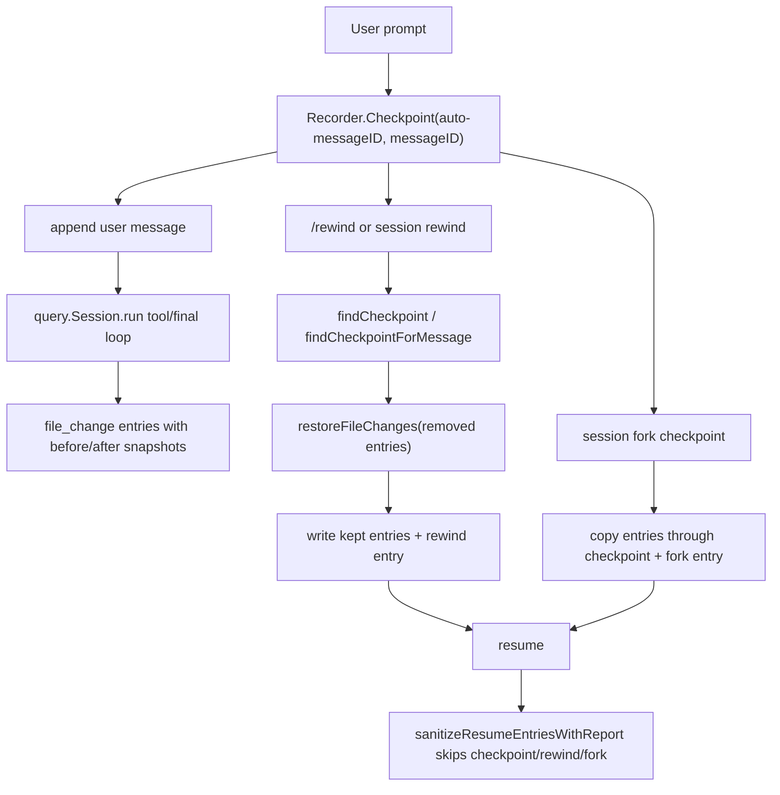
```mermaid
flowchart TD
  U["User prompt"] --> AUTO["Recorder.Checkpoint(auto-messageID, messageID)"]
  AUTO --> MSG["append user message"]
  MSG --> RUN["query.Session.run tool/final loop"]
  RUN --> FC["file_change entries with before/after snapshots"]
  AUTO --> REWIND["/rewind or session rewind"]
  REWIND --> FIND["findCheckpoint / findCheckpointForMessage"]
  FIND --> RESTORE["restoreFileChanges(removed entries)"]
  RESTORE --> WRITE["write kept entries + rewind entry"]
  AUTO --> FORK["session fork checkpoint"]
  FORK --> COPY["copy entries through checkpoint + fork entry"]
  WRITE --> RESUME["resume"]
  COPY --> RESUME
  RESUME --> SKIP["sanitizeResumeEntriesWithReport skips checkpoint/rewind/fork"]
```

关键 Go 逻辑：

| 步骤 | Go 实现 | 说明 |
| --- | --- | --- |
| 每轮用户消息前自动建锚点 | `internal/query/query.go: Recorder.Checkpoint("auto-"+messageID, messageID)` | checkpoint 先于 user message 写入 transcript，因此可以回到“这条用户消息之前”。 |
| 手动 checkpoint | `internal/session/store.go: Store.Checkpoint`、`Recorder.Checkpoint` | CLI/TUI 可以创建命名 checkpoint。 |
| rewind 到 checkpoint | `Store.Rewind(sessionID, checkpoint)` | 找到最近匹配 checkpoint，恢复被移除 entry 里的文件快照，然后重写 transcript。 |
| rewind 到 message | `findCheckpointForMessage` + `rewindFiles` | 优先用自动 checkpoint；没有 checkpoint 时按 message entry 回退。 |
| 文件恢复 | `restoreFileChanges(removed)` | 倒序读取 `file_change`，每个 path 只恢复一次；支持 inline before 内容和 large-file snapshot path。 |
| fork 新 session | `Store.Fork(sessionID, checkpoint, name)` | 复制 checkpoint 之前的 entries 到新 session，并追加 `fork` entry。 |
| resume 隔离 | `sanitizeResumeEntriesWithReport` | `checkpoint`、`rewind`、`fork` 属于 metadata，恢复模型上下文时跳过，避免污染语义上下文。 |

这个机制的闭环条件是：有 checkpoint 锚点、有可定位的 message/checkpoint、有 `file_change` 快照时可以恢复文件、rewind/fork 后 transcript 状态被重写或复制，并且 resume 时不会把 checkpoint metadata 发回模型。

## Go 实现细节：硬约束如何落地

闭环硬约束没有做成独立 HTTP middleware，也不是只写在 system prompt 里。当前实现直接嵌在 `query.Session.run` 的主循环里，有两个强制执行点：

- **工具执行前**：模型返回 `tool_use` 后，runtime 先跑 `preToolClosureGate`。如果返回 `block_tool`，真实工具不会执行。
- **最终回复前**：模型没有返回 `tool_use` 时，runtime 先跑 `completionGate`。如果返回 `block_continue`，candidate final 不会输出给用户。

### 核心数据结构

`internal/query/closure_gate.go` 定义了闭环最小控制面：

```go
type taskContract struct {
    ClosureLevel          closureLevel
    RequiredReadPath      []string
    SharedStateOperations []sharedStateOperation
}

type completionGateResult struct {
    Severity        gateSeverity
    Reminder        string
    RuleID          string
    MissingEvidence []string
}
```

`gateSeverity` 当前最关键的两个硬约束值是：

| severity | Go 行为 | 用户可见效果 |
| --- | --- | --- |
| `block_continue` | final 不接受，插入 reminder 并 `continue` 下一 turn | 用户看不到被拦截的 final |
| `block_tool` | 不调用真实 tool，生成 failed `ToolTrace` | 模型收到失败 tool_result，必须补证据或改方案 |

### Gate 调度形态：规则表 + 固定优先级

当前实现已经把 task classification、pre-tool gate、completion gate 都收敛成显式规则表。规则表不是外部 YAML 配置，而是 Go 代码里的固定 slice，优点是可测试、可 review、不会被 prompt 注入或运行时输入改写。

主入口仍是两个函数：

```go
func completionGate(contract taskContract, calls []ToolTrace, finalText string) completionGateResult
func preToolClosureGate(contract taskContract, prompt string, calls []ToolTrace, toolName, input string) completionGateResult
```

`completionGate` 内部遍历固定规则表：

```go
completionGateRules = []completionGateRule{
    {ID: "read_scope", Priority: 300, Check: ...},
    {ID: "post_action_delta", Priority: 200, Check: ...},
    {ID: "final_claim", Priority: 100, Check: ...},
}
```

`preToolClosureGate` 内部也遍历固定规则表：

```go
preToolGateRules = []preToolGateRule{
    {ID: "pre_commit_scope", Priority: 500, Check: ...},
    {ID: "destructive_shared_state", Priority: 400, Check: ...},
    {ID: "shared_state_git_push", Priority: 300, Check: ...},
    {ID: "shared_state_git_tag", Priority: 200, Check: ...},
    {ID: "external_action_authorization", Priority: 100, Check: ...},
}
```

每条规则命中后会返回 `completionGateResult`，runtime 会把 `rule_id` 和 `missing_evidence` 写入 `completion_gate` transcript event。优先级顺序由单元测试锁定，防止后续新增规则时无意改变 gate 顺序。

### Step 1：进入 run 后先构造 TaskContract

在 `Session.run` 开始阶段，runtime 会把用户 prompt 转成任务合同：

```go
contract := buildTaskContract(prompt)
```

`buildTaskContract` 的判断顺序是：

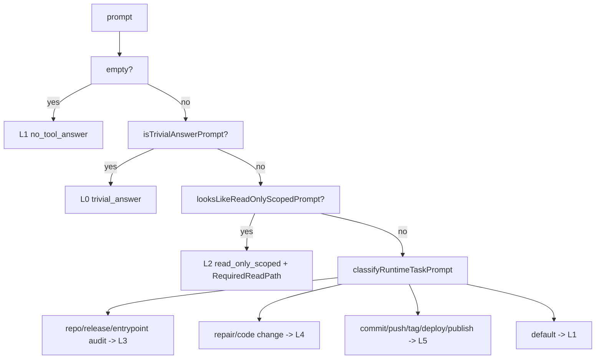
```mermaid
flowchart TD
  P["prompt"] --> EMPTY["empty?"]
  EMPTY -->|yes| L1["L1 no_tool_answer"]
  EMPTY -->|no| TRIVIAL["isTrivialAnswerPrompt?"]
  TRIVIAL -->|yes| L0["L0 trivial_answer"]
  TRIVIAL -->|no| READ["looksLikeReadOnlyScopedPrompt?"]
  READ -->|yes| L2["L2 read_only_scoped + RequiredReadPath"]
  READ -->|no| CLASSIFY["classifyRuntimeTaskPrompt"]
  CLASSIFY --> AUDIT["repo/release/entrypoint audit -> L3"]
  CLASSIFY --> REPAIR["repair/code change -> L4"]
  CLASSIFY --> SHARED["commit/push/tag/deploy/publish -> L5"]
  CLASSIFY --> DEFAULT["default -> L1"]
```

如果有 recorder，runtime 还会把合同写入 transcript：

```go
s.recordClosureEvent("task_contract", contract)
```

这一步不是阻断点，它的作用是让后续 gate 知道本轮任务属于轻闭环还是高风险闭环。

### Step 2：模型返回 final 时，先过 CompletionGate

模型每一 turn 结束后，runtime 会提取文本和工具调用：

```go
turnResponse := assistantText(stream.Message.Content)
toolUses := collectToolUses(stream.Message.Content)
```

如果没有工具调用，说明这轮可能是 final。此时不会立刻输出，而是先检查：

```go
nudge := completionVerificationNudge(requiredVerifications, result.ToolCalls, turnResponse)
if nudge == "" {
    if gate := completionGate(contract, result.ToolCalls, turnResponse); gate.Severity == gateSeverityBlockContinue {
        nudge = gate.Reminder
    }
}
```

命中 `block_continue` 时，Go 代码做三件事：

```go
result.Response = strings.TrimSuffix(result.Response, turnResponse)
s.recordClosureEvent("completion_gate", map[string]any{...})
messages = append(messages, anthropic.MessageParam{Role: "user", Content: reminder})
continue
```

这就是“final 不泄漏”的关键实现：

1. `turnResponse` 从 `result.Response` 中移除。
2. 本轮 candidate final 不 replay 给 UI/stdout。
3. runtime 把 gate reminder 作为新的 user message 塞回模型上下文。
4. `continue` 进入下一 turn，让模型补证据或改写 final。

只有没有 nudge 时，runtime 才会执行：

```go
streamEvents.Replay(cb, &stream.Message)
s.recordAssistant(stream.Message.Content)
return result, nil
```

因此 accepted final 是控制流结果，不是 prompt 约定。

### Step 3：CompletionGate 内部规则表检查

`completionGate` 是规则表短路逻辑：

```go
for _, rule := range completionGateRules {
    if result, blocked := rule.Check(input); blocked {
        result.RuleID = rule.ID
        return result
    }
}
return allow
```

三个检查各自负责不同硬边界：

| 检查 | 触发条件 | 主要数据来源 | 阻断原因 |
| --- | --- | --- | --- |
| `read_scope` | L2 read-only scoped 且 final 声称总结/读取 | `collectReadEvidence(calls)` | 未读指定文件/目录、只读片段却声称全文 |
| `post_action_delta` | 本轮有 delta 且 final 声称 done/fixed | `lastDeltaIndex`、`postDeltaChecksObserved` | 最新变更后缺 status/diff/summary/test |
| `final_claim` | final 出现高置信声明 | `ToolTrace` 列表 | 声称 searched/tested/committed/pushed/deployed 但无证据 |

被阻断时，`completion_gate` transcript event 会记录结构化字段：

```json
{
  "severity": "block_continue",
  "rule_id": "final_claim",
  "missing_evidence": ["tests/checks are claimed but no successful test or verification Bash command was observed"]
}
```

这里的 `calls []ToolTrace` 是本轮已经真实发生或被 gate 合成的工具轨迹。gate 不看模型“我做了”的自然语言自述，而是看 ToolTrace。

### Step 3.1：Read file tool 的硬约束怎么 check

Read 本身不是执行前硬拦截。模型可以调用 `Read`，工具按权限和路径规则执行。Read 相关硬约束发生在 final 前：如果用户要求读取/总结指定文件，模型没有读就想 final，`Read Scope Gate` 会 `block_continue`。

关键函数签名：

```go
func readScopeGateResult(contract taskContract, calls []ToolTrace, finalText string) (completionGateResult, bool)
func collectReadEvidence(calls []ToolTrace) []readEvidence
func matchingReadEvidence(reads []readEvidence, required string) (readEvidence, bool)
func readInputIsPartial(input string) bool
```

完整路径如下：

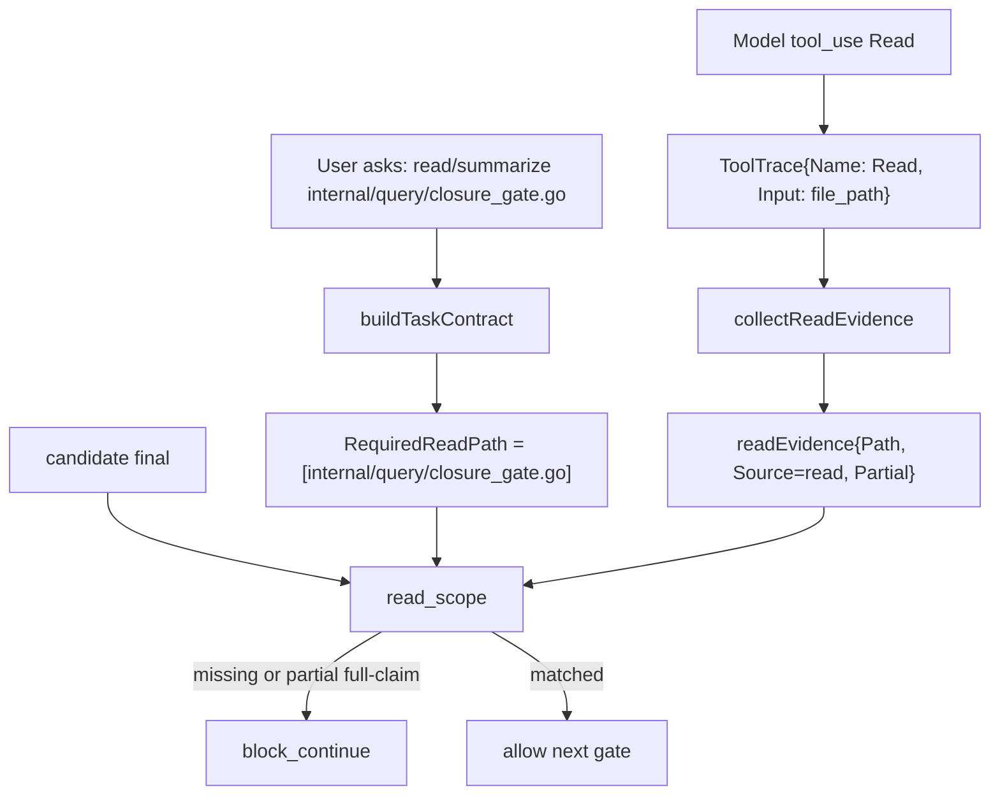
```mermaid
flowchart TD
  U["User asks: read/summarize internal/query/closure_gate.go"] --> BTC["buildTaskContract"]
  BTC --> RP["RequiredReadPath = [internal/query/closure_gate.go]"]
  M["Model tool_use Read"] --> RT["ToolTrace{Name: Read, Input: file_path}"]
  RT --> CRE["collectReadEvidence"]
  CRE --> RE["readEvidence{Path, Source=read, Partial}"]
  F["candidate final"] --> RSG["read_scope"]
  RP --> RSG
  RE --> RSG
  RSG -->|missing or partial full-claim| BLOCK["block_continue"]
  RSG -->|matched| ALLOW["allow next gate"]
```

`collectReadEvidence` 对不同工具的处理：

| 工具 | evidence 生成方式 |
| --- | --- |
| `Read` | 从 `ToolTrace.Input` JSON 里取 `file_path`，生成 `readEvidence{Source:"read"}` |
| `Grep` / `Glob` / `LS` | 从 `path`、`file_path`、`pattern` 中取一个路径，生成 `Source:"search"` |
| read-only `Bash` | `classifyShellIntent(command).ReadOnly == true` 时，提取命令里的 pathish 文本 |

Read 的核心判断不是看工具输出文本，而是看工具调用轨迹：

```go
case "read":
    if path := toolInputString(call.Input, "file_path"); path != "" {
        out = append(out, readEvidence{
            Path: path,
            Source: "read",
            Partial: readInputIsPartial(call.Input),
        })
    }
```

路径匹配逻辑在 `matchingReadEvidence`：

- 标准化 path：去空格、去引号、`filepath.Clean`、转 slash、去 `./`。
- 精确匹配允许通过。
- suffix 关系允许通过，例如绝对路径尾部匹配相对路径。
- 如果用户要求目录，`Grep` / `Glob` / `LS` / read-only Bash 的目录型 evidence 也能通过。

部分读取判断在 `readInputIsPartial`：

```go
offset / limit / byte_offset / byte_limit / chunk_index / pages
```

只要这些字段出现且不是空或 `0`，就认为是 partial read。此时如果 final 声称“全文、完整、all/full scope”，会被拦截，要求继续读取或披露读取范围。

所以 “Read file tool 触发的硬约束” 更准确地说是：

1. 用户 prompt 触发 L2 `read_only_scoped`，并提取 `RequiredReadPath`。
2. `Read` 工具成功后留下 `ToolTrace`。
3. final 前 `read_scope` rule 用 `ToolTrace.Input` 形成 read evidence。
4. required path 没匹配，或 partial evidence 支撑不了 full-scope claim，就返回 reminder。
5. `Session.run` 收到 reminder 后 `block_continue`，candidate final 不输出。

### Step 4：模型返回 tool_use 时，先过 PreTool gate

如果模型返回工具调用，`Session.run` 不会直接执行工具，而是先检查：

```go
if gate := preToolClosureGate(contract, prompt, result.ToolCalls, block.Name, string(block.Input)); gate.Severity == gateSeverityBlockTool {
    trace = blockedToolTrace(block, gate.Reminder)
} else {
    trace = s.runTool(ctx, registry, block, cb)
}
```

命中 `block_tool` 时，`s.runTool` 不会被调用，所以真实 Bash / Git / deploy 命令不会执行。runtime 会合成一个失败的 ToolTrace：

```go
ToolTrace{
    ID: block.ID,
    Name: block.Name,
    Input: string(block.Input),
    Output: reason,
    IsError: true,
}
```

随后这条失败结果仍会被放进模型上下文：

```go
toolResults = append(toolResults, anthropic.ContentBlock{
    Type:      "tool_result",
    ToolUseID: block.ID,
    Content:   trace.Output,
    IsError:   trace.IsError,
})
```

这保证模型知道“工具没执行，为什么没执行”，但不能越过 gate。

### Step 5：PreTool gate 只拦高风险 Bash 边界

`preToolClosureGate` 当前只对 `Bash` 做闭环硬拦截：

```go
if !strings.EqualFold(toolName, "Bash") {
    return allow
}
```

然后通过 `classifyShellIntent(command)` 把 Bash 命令分类：

| ShellIntent | 硬约束 |
| --- | --- |
| `git_commit` | 必须满足 `preCommitScopeVerified(calls)` |
| `git_push` / destructive shared state | 必须满足 `prePushGitVerified(calls)` |
| `git_tag_mutate` | 必须满足 `preTagGitVerified(calls)` |
| destructive git | 必须有用户明确授权 force/delete/move |
| `external_write` | 当前 prompt 必须明确授权 deploy/publish/send/release |

> `preCommitScopeVerified` 用 `lastContentDeltaIndex`（而非 `lastDeltaIndex`）定位“最近一次内容变更”：`git add` 只是暂存已改内容，不作废其之前已完成的三件套 scope 验证（否则「编辑→验证→git add→commit」这一自然顺序无法闭环）。缺证据被拦时，runtime 对单段命令或纯 git 流水线（`cd + add/commit/push/tag`）会经 `canAutoPreflightGitCommand` 自动帮跑只读 preflight——原命令不执行，模型检视 preflight 输出后重发一次即放行。详见 [../prompt_logic/pre_commit_scope_gate_recovery_plan.md](../prompt_logic/pre_commit_scope_gate_recovery_plan.md)。

例如 `git push` 的 gate 条件不是“模型说我确认了”，而是本轮 ToolTrace 中已经出现这些只读证据：

- branch evidence: `git status --short --branch`
- object evidence: `git rev-parse HEAD`
- remote/upstream evidence: `git rev-parse @{u}`、`git branch -vv` 或 `git ls-remote`

缺少这些证据时，Go 代码返回 `gateSeverityBlockTool`，真实 `git push` 不会执行。

### Step 6：真实工具执行还有权限、hook、文件变化记录

如果 pre-tool gate 允许，才进入 `runTool`。这里还有几层硬边界：

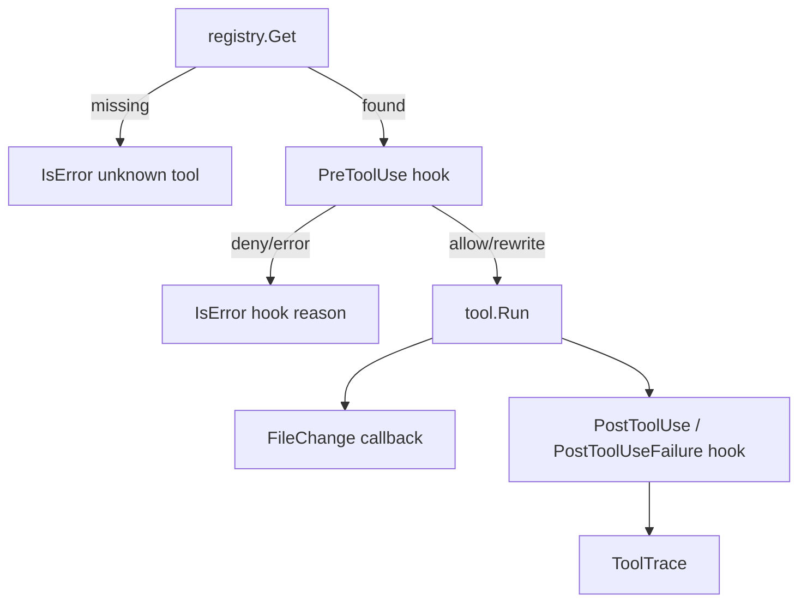
```mermaid
flowchart TD
  A["registry.Get"] -->|missing| E1["IsError unknown tool"]
  A -->|found| H["PreToolUse hook"]
  H -->|deny/error| E2["IsError hook reason"]
  H -->|allow/rewrite| T["tool.Run"]
  T --> FC["FileChange callback"]
  T --> POST["PostToolUse / PostToolUseFailure hook"]
  POST --> TR["ToolTrace"]
```

重要实现点：

- 工具已经被 `tools.Guard` / `tools.GuardAll` 包裹，permission policy 在工具执行层生效。
- `PreToolUse` hook 可以拒绝或改写 input。
- `tools.Context.FileChange` 回调会收集文件变化，写入 `ToolTrace.FileChanges`。
- tool result 会经过 `toolresult.Process` 做输出长度控制和持久化替换。
- 工具失败时会追加 verification failure recovery reminder；成功写文件时会追加 post-edit verification reminder。

所以闭环不是只靠 `closure_gate.go`，而是由 pre-tool gate、guarded tool、hook、FileChange、post-tool reminder 共同构成。

### Step 6.1：Edit / Write / MultiEdit 的硬约束怎么 check

Edit / Write / MultiEdit 也不是执行前被 closure gate 阻断。它们的执行前硬边界主要来自权限、sandbox、writable roots 和工具自己的输入校验；闭环硬约束发生在工具成功修改文件之后、final 之前。

关键函数签名：

```go
func (s *Session) runTool(ctx context.Context, registry *tools.Registry, block anthropic.ContentBlock, cb runCallbacks) ToolTrace
func appendPostEditVerificationReminder(toolName string, input json.RawMessage, output string, changes []tools.FileChange) string
func deltaClosureGateResult(contract taskContract, calls []ToolTrace, finalText string) (completionGateResult, bool)
func lastDeltaIndex(calls []ToolTrace) int
func traceCreatesDelta(call ToolTrace) bool
func postDeltaChecksObserved(calls []ToolTrace, after int) (scope bool, metadata bool, semantic bool)
```

完整路径如下：

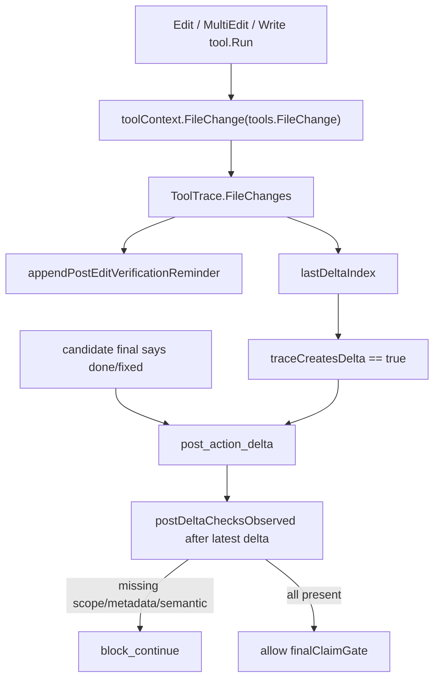
```mermaid
flowchart TD
  EDIT["Edit / MultiEdit / Write tool.Run"] --> FC["toolContext.FileChange(tools.FileChange)"]
  FC --> TRACE["ToolTrace.FileChanges"]
  TRACE --> REM["appendPostEditVerificationReminder"]
  TRACE --> LDI["lastDeltaIndex"]
  LDI --> TCD["traceCreatesDelta == true"]
  F["candidate final says done/fixed"] --> DCG["post_action_delta"]
  TCD --> DCG
  DCG --> PDC["postDeltaChecksObserved after latest delta"]
  PDC -->|missing scope/metadata/semantic| BLOCK["block_continue"]
  PDC -->|all present| NEXT["allow finalClaimGate"]
```

文件工具如何上报变化：

| 工具 | 上报位置 | 上报内容 |
| --- | --- | --- |
| `Edit` | `fileedit.Tool.Run` | `tools.FileChange{Path, Before, After, BeforeExists:true, AfterExists:true, BeforeMode, AfterMode, ModeChanged}` |
| `MultiEdit` | `fileedit.MultiTool.Run` | 同上，批量替换成功后一次性上报 |
| `Write` | `filewrite.Tool.Run` | `Before` 可能为空，`BeforeExists` 取决于文件是否已存在，`AfterExists:true` |

`runTool` 把这些变化收集进本轮 trace：

```go
var fileChanges []tools.FileChange
res := tool.Run(ctx, input, tools.Context{
    FileChange: func(change tools.FileChange) {
        fileChanges = append(fileChanges, change)
        s.recordFileChange(change)
    },
})
trace.FileChanges = append([]tools.FileChange(nil), fileChanges...)
```

工具成功后会立刻把 post-edit reminder 附加到 tool result：

```go
if res.IsError {
    res.Content = appendVerificationFailureRecoveryReminder(...)
} else {
    res.Content = appendPostEditVerificationReminder(block.Name, input, res.Content, fileChanges)
}
```

`shouldAppendPostEditVerificationReminder` 的触发条件：

```go
Edit / MultiEdit / Write / NotebookEdit -> true
Bash -> looksLikeWriteLikeBashCommand(input)
其他工具 -> len(changes) > 0
```

这一步是提示模型补验证的软引导，但真正 final 前的硬阻断在 `post_action_delta` rule。

`post_action_delta` 的触发条件：

1. final 文本声称 completed/fixed/done：

```go
if !finalTextClaimsCompletion(finalText) && !finalTextClaimsFixed(finalText) {
    return ""
}
```

2. 本轮工具轨迹中存在 delta：

```go
lastDelta := lastDeltaIndex(calls)
```

`lastDeltaIndex` 从后往前找最近一次 delta：

```go
traceCreatesDelta(calls[i]) || traceStagesChanges(calls[i])
```

`traceCreatesDelta` 对 Edit/Write/MultiEdit 的判断非常直接：

```go
if call.IsError {
    return false
}
if len(call.FileChanges) > 0 {
    return true
}
```

也就是说，只要文件工具成功上报了 `FileChanges`，就会被视为本轮产生了 delta。

3. 最新 delta 后必须有三类 Bash 验证：

```go
scope, metadata, semantic := postDeltaChecksObserved(calls, lastDelta)
```

`postDeltaChecksObserved` 只看 latest delta 之后的成功 Bash 调用：

| check | Go 判断 |
| --- | --- |
| scope | command 同时包含 `git status --short` 和 `git diff --name-status` |
| metadata | command 包含 `git diff --summary` |
| semantic | `isSemanticCheckCommand(command)` 为 true |

`isSemanticCheckCommand` 识别 `go test`、`npm test`、`pytest`、`cargo test`、`bash -n`、`test -x`、`rg`、`grep`、`node`、`python`、`go run` 等确定性验证命令。

缺任意一类时，返回 reminder：

```go
Completion is blocked by Post-Action Delta Gate:
files or shared state changed in this turn, but these post-change checks are still missing...
```

然后 `Session.run` 按 `block_continue` 处理，candidate final 不输出。

因此 Edit/Write/MultiEdit 的闭环硬约束可以总结为：

1. 工具执行成功后必须通过 `FileChange` callback 留下 delta。
2. delta 写入 `ToolTrace.FileChanges`。
3. final 声称完成/修复时，`post_action_delta` 查最近 delta。
4. 最近 delta 之后缺 `git status + git diff --name-status`、`git diff --summary`、语义验证任一项，就阻断 final。
5. 阻断不是拒绝文件修改本身，而是拒绝“未验证就宣称完成”。

### Step 7：Action / Evidence / Delta Ledger 怎么写入

每次工具调用后，runtime 都会执行：

```go
result.ToolCalls = append(result.ToolCalls, trace)
s.recordClosureTrace(trace)
s.recordTool(trace)
```

`recordClosureTrace` 会派生三类 transcript 事件：

```go
s.recordClosureEvent("action_record", closureActionRecord(trace))
s.recordClosureEvent("evidence_record", evidence)
s.recordClosureEvent("delta_record", delta)
```

三类事件的含义：

| 事件 | 生成逻辑 | 用途 |
| --- | --- | --- |
| `action_record` | 每个 ToolTrace 都生成，记录工具、动作类型、路径、成功与否 | trace/审计时看 agent 做了什么 |
| `evidence_record` | Read/Grep/Glob/LS/read-only Bash/test command 派生 | final claim gate 的证据来源 |
| `delta_record` | 文件变化或 write-like/shared-state Bash 派生 | post-action delta gate 判断是否需要补验证 |

这些事件不会代替 ToolTrace 做判断，但让闭环过程可观测、可回放、可写 acceptance。

### Step 8：为什么这是硬约束

判断一个机制是不是硬约束，看它是否改变 Go 控制流：

| 场景 | Go 控制流 | 结果 |
| --- | --- | --- |
| final 缺证据 | `completionGate -> block_continue -> continue` | final 不输出、不记录为 accepted assistant |
| git commit 缺 scope precheck | `preToolClosureGate -> block_tool` | `s.runTool` 不调用，真实 commit 不执行 |
| hook deny | `runTool -> IsError return` | 工具结果失败，模型必须处理 |
| permission deny | guarded tool 返回失败 | 工具副作用被权限层挡住 |
| 工具成功但改了文件 | `FileChanges -> delta_record` | final 前必须补 scope/metadata/semantic checks |

提示词只能影响模型倾向；上表这些路径是 Go runtime 的分支、返回值和 `continue`，所以属于硬约束。

## 如何保证闭环正确

当前实现通过四层约束保证闭环：

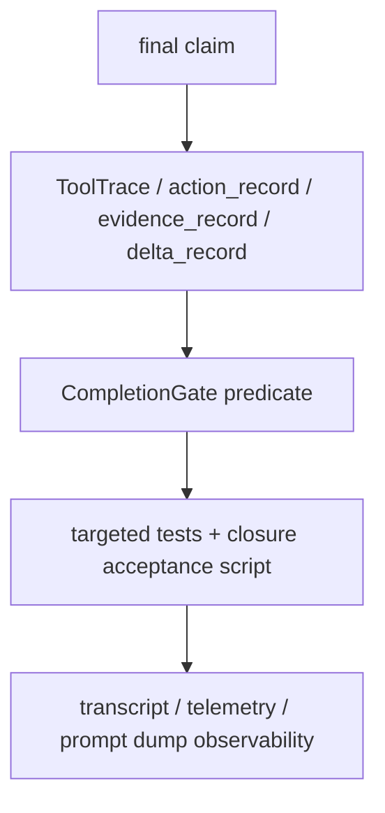
```mermaid
flowchart TD
  CLAIM["final claim"] --> LEDGER["ToolTrace / action_record / evidence_record / delta_record"]
  LEDGER --> GATE["CompletionGate predicate"]
  GATE --> TEST["targeted tests + closure acceptance script"]
  TEST --> OBS["transcript / telemetry / prompt dump observability"]
```

1. 工具执行生成 `ToolTrace`，包含 tool name、input、output、`IsError`、`FileChanges`。
2. runtime 从 ToolTrace 派生 action/evidence/delta records，写入 transcript。
3. gate 根据 final claim 匹配本轮 evidence，而不是相信模型自述。
4. `internal/query` 有针对 read scope、post-action delta、commit/push/tag/external claim、blocked final 不泄漏等测试；`scripts/closure-gate-acceptance.sh` 覆盖真实 CLI stub 链路。

当前边界也要明确：

- Bash 分类是 conservative best-effort，不解析完整 shell AST、变量展开、alias、subshell 或脚本内部副作用。
- gate 主要防“无证据声明完成”和“高风险动作缺前置条件”，不等价于形式化证明业务逻辑一定正确。
- 复杂发布/部署仍需要产品化 workflow；当前 External Action Gate 主要做授权和 dry-run/preview 边界。

## Demo 演练

本节用“用户输入 -> runtime 行为 -> 可观察证据 -> 正确 final”的形式说明闭环如何落地。demo 的目标不是要求人工逐字复现模型输出，而是帮助读者判断一条链路应该看哪些证据。

### Demo 1：简单问题不走重型闭环

用户输入：

```text
1+1=?
```

runtime 行为：

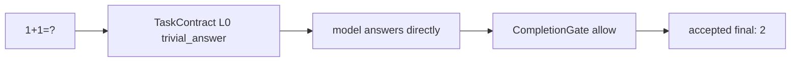
```mermaid
flowchart LR
  U["1+1=?"] --> C["TaskContract L0 trivial_answer"]
  C --> M["model answers directly"]
  M --> G["CompletionGate allow"]
  G --> A["accepted final: 2"]
```

可观察证据：

- `TaskContract.ClosureLevel` 是 `L0_trivial_answer`。
- 不需要 `Read`、`Bash`、`git status` 或测试命令。
- 如果模型声称“我检查了仓库”但没有工具证据，`Final Claim Gate` 会拦截这类本地事实声明。

正确 final：

```text
2
```

### Demo 2：读文件总结必须先有 read evidence

用户输入：

```text
帮我看 internal/query/closure_gate.go 的闭环逻辑并总结。
```

正常路径：

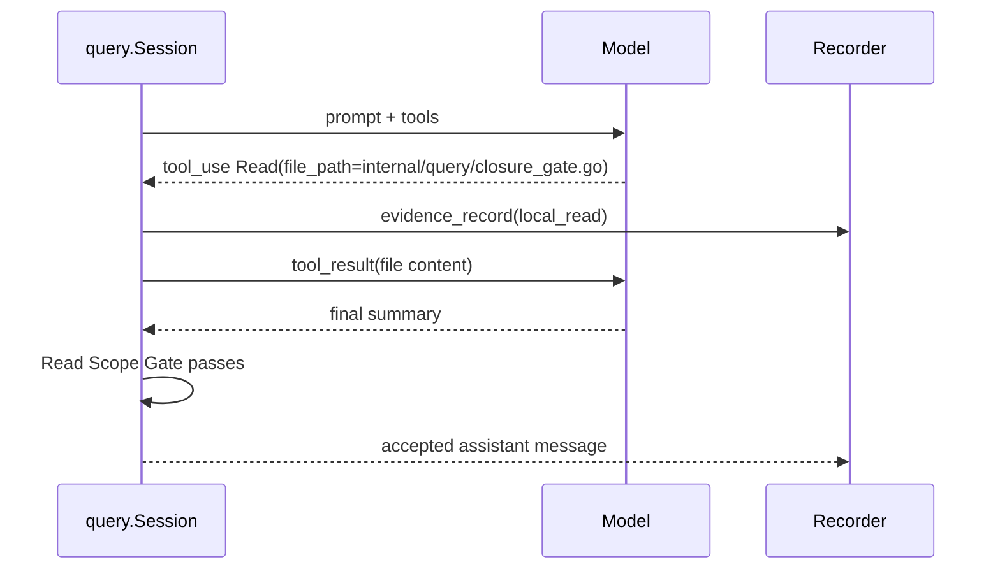
```mermaid
sequenceDiagram
  participant Q as query.Session
  participant M as Model
  participant R as Recorder

  Q->>M: prompt + tools
  M-->>Q: tool_use Read(file_path=internal/query/closure_gate.go)
  Q->>R: evidence_record(local_read)
  Q->>M: tool_result(file content)
  M-->>Q: final summary
  Q->>Q: Read Scope Gate passes
  Q-->>R: accepted assistant message
```

如果模型没读就总结，runtime 会插入类似提醒：

```text
<system-reminder>Completion is blocked by Read Scope Gate: missing required read evidence for: internal/query/closure_gate.go...</system-reminder>
```

可观察证据：

- transcript 中有 `task_contract`，closure level 为 `L2_read_only_scoped`。
- transcript 中有 `tool_result`，tool name 为 `Read`。
- transcript 中有 `evidence_record`，`source_kind=local_read`。
- 被拦截的 premature summary 不应作为 accepted assistant message 出现。

正确 final 应该只基于读到的文件内容总结；如果只读了部分内容，必须说明读取范围。

### Demo 3：修改文件后不能直接说完成

用户输入：

```text
修复 internal/query/closure_gate.go 里的一个闭环判断问题，跑相关测试。
```

runtime 期望路径：

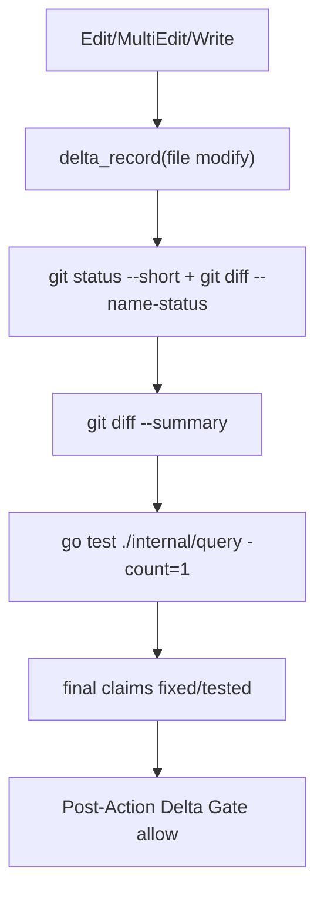
```mermaid
flowchart TD
  EDIT["Edit/MultiEdit/Write"] --> DELTA["delta_record(file modify)"]
  DELTA --> SCOPE["git status --short + git diff --name-status"]
  SCOPE --> META["git diff --summary"]
  META --> SEM["go test ./internal/query -count=1"]
  SEM --> FINAL["final claims fixed/tested"]
  FINAL --> GATE["Post-Action Delta Gate allow"]
```

如果模型在 Edit 后直接说“已修复并测试通过”，但没有测试或 diff 证据，`Post-Action Delta Gate` / `Final Claim Gate` 会阻断。

可观察证据：

- `ToolTrace.FileChanges` 非空。
- `delta_record` 记录变更路径。
- 最新 delta 后出现 scope check、metadata check、semantic check。
- 如果 final 声称测试通过，必须有成功 verification Bash，例如 `go test ./internal/query -count=1`。

正确 final 应拆开说明：

```text
已修改 internal/query/closure_gate.go。
验证：
- git status --short / git diff --name-status 确认变更范围
- git diff --summary 确认没有意外 metadata 变化
- go test ./internal/query -count=1 通过
```

### Demo 4：commit / push 是工具前硬拦截

用户输入：

```text
把这次改动提交并 push。
```

错误路径：

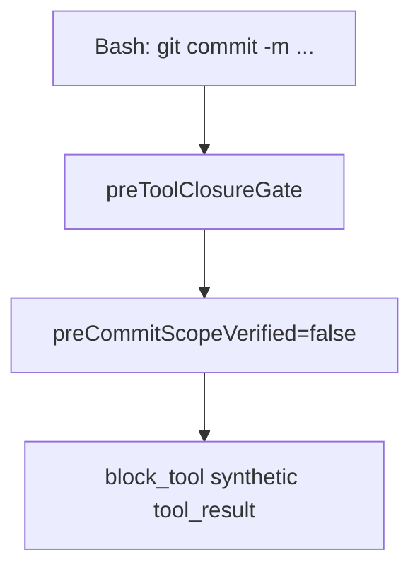
```mermaid
flowchart TD
  TRY["Bash: git commit -m ..."] --> PRE["preToolClosureGate"]
  PRE --> MISS["preCommitScopeVerified=false"]
  MISS --> BLOCK["block_tool synthetic tool_result"]
```

runtime 会阻断 `git commit`，因为提交前必须先确认当前 staged / unstaged scope。正确路径应该是：

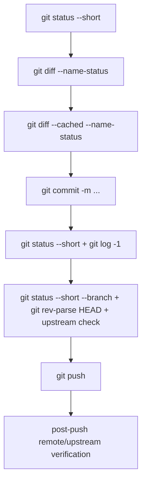
```mermaid
flowchart TD
  STATUS["git status --short"] --> DIFF["git diff --name-status"]
  DIFF --> CACHED["git diff --cached --name-status"]
  CACHED --> COMMIT["git commit -m ..."]
  COMMIT --> POST["git status --short + git log -1"]
  POST --> PUSH_PRE["git status --short --branch + git rev-parse HEAD + upstream check"]
  PUSH_PRE --> PUSH["git push"]
  PUSH --> READBACK["post-push remote/upstream verification"]
```

可观察证据：

- 如果缺少 precheck，`tool_result` 的 `IsError=true`，内容包含 `Tool blocked by Pre-Commit Scope Gate` 或 `Shared-State Git Gate`。
- commit 后 final 不能只说“已提交”，还要有 post-commit readback。
- push 后 final 不能只说“已推送”，还要有 post-push remote/branch verification。

### Demo 4A：实际 L3 prompt 如何触发硬约束

这个例子要特别注意：当前没有 `L3InvestigationGate` 这个专属函数。L3 的“硬约束”体现为任务先被归类成 `L3_investigation_audit`，runtime 注入 audit strategy；如果模型随后在没有本地 evidence 的情况下输出审计结论，`Final Claim Gate` 会在 final 前硬拦截。

用户输入：

```text
Run a repo health audit and find the highest ROI gaps.
```

Go 分类路径：

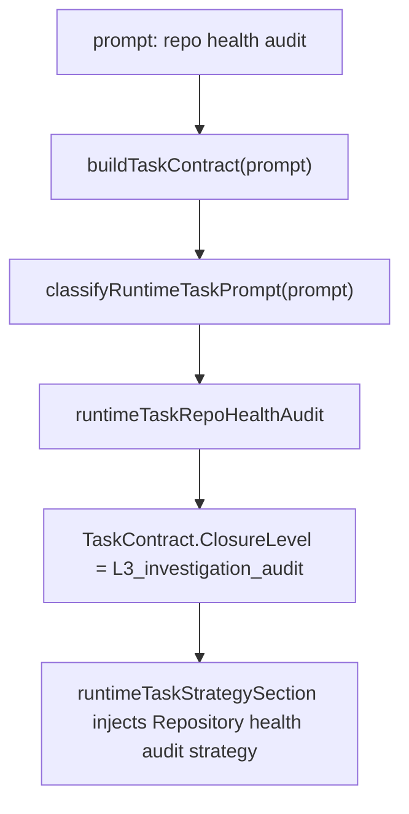
```mermaid
flowchart TD
  U["prompt: repo health audit"] --> BTC["buildTaskContract(prompt)"]
  BTC --> CRT["classifyRuntimeTaskPrompt(prompt)"]
  CRT --> TYPE["runtimeTaskRepoHealthAudit"]
  TYPE --> L3["TaskContract.ClosureLevel = L3_investigation_audit"]
  L3 --> STRATEGY["runtimeTaskStrategySection injects Repository health audit strategy"]
```

对应代码判断：

```go
switch classifyRuntimeTaskPrompt(prompt).Type {
case runtimeTaskRepoHealthAudit, runtimeTaskReleaseReadinessAudit, runtimeTaskEntrypointAudit:
    return taskContract{ClosureLevel: closureLevelInvestigation}
}
```

错误路径：模型没有调用任何 Read/Grep/Glob/LS/read-only Bash，就直接 final：

```text
I inspected the entire repository and no issues found.
```

final 前 gate 路径：

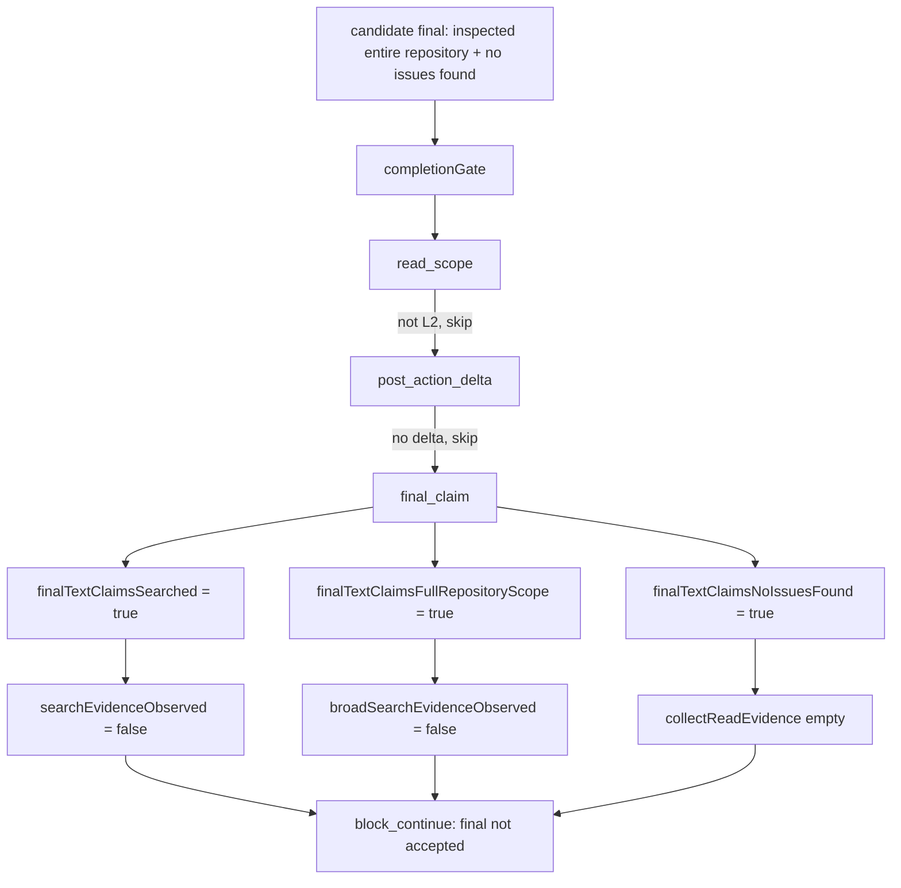
```mermaid
flowchart TD
  F["candidate final: inspected entire repository + no issues found"] --> CG["completionGate"]
  CG --> RSG["read_scope"]
  RSG -->|not L2, skip| DCG["post_action_delta"]
  DCG -->|no delta, skip| FCG["final_claim"]
  FCG --> S1["finalTextClaimsSearched = true"]
  FCG --> S2["finalTextClaimsFullRepositoryScope = true"]
  FCG --> S3["finalTextClaimsNoIssuesFound = true"]
  S1 --> E1["searchEvidenceObserved = false"]
  S2 --> E2["broadSearchEvidenceObserved = false"]
  S3 --> E3["collectReadEvidence empty"]
  E1 --> BLOCK["block_continue: final not accepted"]
  E2 --> BLOCK
  E3 --> BLOCK
```

硬约束触发点在 `final_claim` rule：

```go
if finalTextClaimsSearched(finalText) && !searchEvidenceObserved(calls) { ... }
if finalTextClaimsFullRepositoryScope(finalText) && !broadSearchEvidenceObserved(calls) { ... }
if finalTextClaimsNoIssuesFound(finalText) && len(collectReadEvidence(calls)) == 0 { ... }
```

runtime 行为：

1. `completionGate` 返回 `gateSeverityBlockContinue`。
2. `Session.run` 把 candidate final 从 `result.Response` 移除。
3. 被拦截 final 不 replay 给 UI/stdout，也不记录为 accepted assistant。
4. runtime 插入 `<system-reminder>Completion is blocked by Final Claim Gate...</system-reminder>`，让模型继续补证据。

正确路径至少要先产生本轮 evidence，例如：

```text
Bash: git status --short --branch && find . -maxdepth 2 -type f | wc -l
Bash: rg -n "TODO|FIXME|panic|deprecated" .
Read/Grep/Glob/LS: 对命中的关键文件继续核查
```

然后 final 只能基于观察到的 evidence 给出审计结论，不能把未覆盖范围说成“全仓库已确认无问题”。

### Demo 4B：实际 L5 prompt 如何触发硬约束

L5 的典型硬约束发生在工具执行前。模型只要尝试执行 `git push`、mutating tag、deploy/publish/send 等共享状态写操作，`preToolClosureGate` 会先于真实工具运行；缺少前置证据时真实命令不会执行。

用户输入：

```text
Push this branch to the remote.
```

Go 分类路径：

```mermaid
flowchart TD
  U["prompt: Push this branch to the remote"] --> BTC["buildTaskContract(prompt)"]
  BTC --> CRT["classifyRuntimeTaskPrompt(prompt)"]
  CRT --> UNKNOWN["no repo audit / no local repair type"]
  UNKNOWN --> SHARED["looksLikeSharedStatePrompt = true"]
  SHARED --> L5["TaskContract.ClosureLevel = L5_shared_state_change"]
  L5 --> OPS["SharedStateOperations includes push"]
```

对应代码判断：

```go
if looksLikeSharedStatePrompt(text) {
    return taskContract{
        ClosureLevel:          closureLevelSharedStateChange,
        SharedStateOperations: extractSharedStateOperations(text),
    }
}
```

错误路径：模型直接调用 Bash：

```json
{"command":"git push"}
```

工具前 gate 路径：

```mermaid
flowchart TD
  TU["tool_use Bash: git push"] --> PTG["preToolClosureGate(contract, prompt, calls, Bash, input)"]
  PTG --> INTENT["classifyShellIntent(command)"]
  INTENT --> KIND["intent.Kind = git_push"]
  KIND --> CHECK["prePushGitVerified(calls)"]
  CHECK --> BRANCH["gitBranchObjectPrecheckObserved?"]
  CHECK --> REMOTE["gitRemoteOrUpstreamPrecheckObserved?"]
  BRANCH -->|false| BLOCK["block_tool: s.runTool not called"]
  REMOTE -->|false| BLOCK
```

硬约束触发点在 `preToolClosureGate`：

```go
if (intent.Kind == shellIntentGitPush || intent.Kind == shellIntentGitDestructiveSharedState) && !prePushGitVerified(calls) {
    return completionGateResult{Severity: gateSeverityBlockTool, Reminder: "..."}
}
```

`prePushGitVerified(calls)` 要求本轮已有两类只读证据：

```go
func prePushGitVerified(calls []ToolTrace) bool {
    return gitBranchObjectPrecheckObserved(calls) && gitRemoteOrUpstreamPrecheckObserved(calls)
}
```

具体证据例子：

| 证据类型 | 可通过的 Bash evidence |
| --- | --- |
| branch/object | 同一条或后续只读命令中出现 `git status --short --branch`，并出现 `git rev-parse` 或 `git log` |
| remote/upstream | `git rev-parse @{u}`、`git branch -vv`、`git remote -v` 或 `git ls-remote` |

如果这些 evidence 不存在，runtime 生成 synthetic failed tool result：

```text
Tool blocked by Shared-State Git Gate: git push requires current branch, object-state, and remote/upstream evidence first...
```

此时真实 `git push` 没有执行。正确路径应该先补只读 precheck：

```text
Bash: git status --short --branch && git rev-parse HEAD
Bash: git rev-parse @{u} || git branch -vv
Bash: git push
Bash: git status --short --branch && git rev-parse @{u}
```

最后如果 final 声称 “pushed / 已推送”，还会继续被 `Final Claim Gate` 检查：

```go
if finalTextClaimsPushed(finalText) && !successfulBashCommandObserved(calls, git push matcher) { ... }
if finalTextClaimsPushed(finalText) && !postPushVerificationObserved(calls) { ... }
```

所以 L5 是两段式硬约束：

1. **工具前**：`preToolClosureGate` 防止缺证据的共享状态写操作真的执行。
2. **final 前**：`final_claim` 防止模型无证据声称已经 push/deploy/publish。

### Demo 5：subagent 不是自动分配，必须由工具触发

用户输入：

```text
并行检查 API 和 TUI 两块风险，最后你汇总。
```

合理路径：

```mermaid
flowchart TD
  P["parent model decides delegation is useful"] --> T["Task with tasks[] batch or AgentCreate"]
  T --> A1["subagent: API review"]
  T --> A2["subagent: TUI review"]
  A1 --> R1["Result: Summary/Evidence/Unknowns/Verification/Risks"]
  A2 --> R2["Result: Summary/Evidence/Unknowns/Verification/Risks"]
  R1 --> S["parent synthesizes"]
  R2 --> S
  S --> F["final answer to user"]
```

关键边界：

- runtime 不会因为任务复杂就自动启动 subagent；必须由模型调用 `Task` 或 `AgentCreate`。
- `Task` 适合同步等待结果；`AgentCreate` 适合后台长任务，返回 `task_id` 后必须用 `AgentGet` 查结果。
- subagent 结果不是直接 final；父 agent 要综合多个子结果，处理 unknowns 和 risks。

可观察证据：

- parent transcript 有 `tool_result`，tool name 为 `Task` 或 `AgentCreate`。
- background agent 有 task store event：started、turn_start、text_delta、tool_call、tool_result、completed/failed。
- `AgentGet` 结果里可能有 `capability_loop`；父 agent 应携带这些 evidence/unknowns/next_action 决策。

### Demo 6：用 acceptance 脚本验证 final 不泄漏

闭环 gate 的真实 CLI 验收入口：

```bash
scripts/closure-gate-acceptance.sh --force
```

这个脚本会启动本地 OpenAI-compatible stub provider 和隔离 fixture repo，模拟模型先输出 premature final，再补 `Read` 和 `git diff --check`。通过标准是：

- premature final marker 不出现在用户可见 accepted output。
- `Read README.md` evidence 出现后，read summary claim 才能通过。
- `git diff --check` evidence 出现后，checks passed claim 才能通过。

这条 demo 用来验证“gate 是 runtime 硬流程，不是提示词建议”。

## Subagent / Multi-Agent 触发时机

Go Claude 不会在 runtime 层“凭空自动分配 subagent”。subagent 触发来自模型显式调用工具，或 active skill 配置了默认 agent 后模型调用 `Task`。

```mermaid
flowchart TD
  NEED["Model decides work should be delegated"] --> CHOOSE{"Which tool?"}
  CHOOSE -->|sync focused work| TASK["Task"]
  CHOOSE -->|background / long-running / parallel| CREATE["AgentCreate"]
  CHOOSE -->|check background result| GET["AgentGet"]
  CHOOSE -->|send more context| MSG["AgentMessage"]
  TASK --> RT["agentruntime.Runtime.Run"]
  CREATE --> BG["agentruntime.Runtime.RunBackground"]
  BG --> STORE["agent task store + events"]
  GET --> STORE
  MSG --> STORE
```

### `Task`

`Task` 用于同步、聚焦的 subagent 工作。父 agent 会等待结果。输入可以是单个任务，也可以是 `tasks` 批量任务；批量任务会并发执行，默认最大并发 4，支持 priority scheduling 和 retry。简单文件搜索、计数、路径匹配应优先由父 agent 直接用 `Glob` / `Grep` / `LS`，不要为了并发而创建 subagent。

触发细节：

- `subagent_type` 指向 `.claude/agents`、plugin agent 或 user agent 中的真实 agent 名称。
- 如果 `subagent_type` 为空且当前 active skill 带 `Agent` 配置，`Task` 会使用该 skill agent。
- 如果目标 agent frontmatter 声明 `background: true`，`Task` 会转为后台任务并返回 task handle。
- 如果设置了自动后台阈值，并且有 task store，长时间 single Task 可返回后台 handle；父 agent 必须用 `AgentGet` 查结果，不能编造。

### `AgentCreate`

`AgentCreate` 用于后台 subagent。它立即返回 `task_id`、status、agent_name、model、session_id 等 handle；父 agent 后续必须用 `AgentGet` 查询完成状态。适合长任务、并行任务、需要独立推进但不阻塞主线程的工作。

### `AgentGet`

`AgentGet` 查询 task 状态、progress summary 和可安全回传的 final result。subagent 的完整 tool input/output 不直接塞回父上下文；只给进度摘要、结构化 result、capability loop 和 transcript/output file 指针，避免父上下文膨胀。

### `AgentMessage`

`AgentMessage` 给运行中的 subagent 追加上下文或指令。消息会作为 subagent conversation 中的 user message 进入后续 turn。如果 task 已完成/失败，当前实现会尝试 terminal resume；无法 resume 时返回错误，要求父 agent 用 `AgentGet` 查看终态或创建新 agent。

## Subagent Runtime 内部流程

```mermaid
sequenceDiagram
  participant P as Parent agent
  participant T as Task/AgentCreate tool
  participant AR as agentruntime.Runtime
  participant S as TaskStore
  participant M as Model
  participant R as Agent registry/tools

  P->>T: delegated prompt + optional subagent_type
  T->>AR: Run or RunBackground
  AR->>AR: load agent definition / skills / memory / MCP
  AR->>R: clone/filter registry by tools/disallowedTools
  AR->>S: create task and emit started event
  loop turn <= maxTurns
    AR->>M: StreamMessages(subagent system, messages, filtered tools)
    M-->>AR: text or tool_use
    alt tool_use
      AR->>R: guarded tool.Run with agent policy
      R-->>AR: tool_result
      AR->>S: progress tool_call/tool_result events
    else final
      AR->>S: finish task with resultJSON
      AR-->>T: Result / task handle
    end
  end
```

Subagent 与父线程的隔离边界：

- subagent 是新 conversation，不自动继承父对话全文或父工具结果。
- subagent 可以继承父 registry，但会按 agent `tools` / `disallowedTools` / permission policy 过滤。
- agent-local MCP、skills、memory 只注入目标 agent。
- background task 通过 task store/event store 管理，父 agent 只能通过 `AgentGet` / `AgentMessage` / `AgentStop` 交互。
- 父 agent 必须 synthesize subagent 结果；subagent 结果不是直接对用户 final。

## 端到端图解

用户说：“帮我看 `internal/query/closure_gate.go` 的闭环逻辑并总结。”

```mermaid
flowchart TD
  U["read and summarize closure_gate.go"] --> C["TaskContract L2 read_only_scoped"]
  C --> M1["model may call Read"]
  M1 --> EV["read evidence: file_path=internal/query/closure_gate.go"]
  EV --> F["candidate final summary"]
  F --> G["Read Scope Gate"]
  G -->|evidence present| A["accepted final"]
```

如果模型没读文件就总结，`Read Scope Gate` 会阻断 final，插入 reminder，要求先读取指定范围。

用户说：“修复 bug，跑测试，然后提交并 push。”

这是 L5/shared-state 的端到端例子，因为 prompt 明确要求 `commit` 和 `push`。如果用户只要求“修复 bug，跑测试”，闭环会停在本地变更、测试证据和 final gate，不会自动强制提交或推送。

```mermaid
flowchart TD
  U["fix + test + commit + push"] --> C["TaskContract L5 shared_state_change"]
  C --> E["Edit/Write/Bash changes"]
  E --> D["Post-Action Delta Gate requires status/diff/summary/test"]
  D --> COMMIT_PRE["preToolClosureGate before git commit"]
  COMMIT_PRE --> COMMIT["git commit"]
  COMMIT --> PCV["post-commit status/log verification"]
  PCV --> PUSH_PRE["preToolClosureGate before git push"]
  PUSH_PRE --> PUSH["git push"]
  PUSH --> PPV["post-push remote/branch verification"]
  PPV --> FINAL["final can claim committed and pushed"]
```

如果任一步缺证据，runtime 要么阻断工具动作，要么阻断 final claim。

## 读代码时的定位表

| 问题 | 优先看 |
| --- | --- |
| 一条消息怎么进入 runtime | `internal/query/query.go:Session.run` |
| system prompt / memory / skills 怎么拼装 | `assembleContextMessages`、`effectiveSystemBlocks`、`dynamicSkillCatalogMessage` |
| 工具列表从哪里来 | `internal/cli/cli.go:coreRuntimeTools`、`newQuerySession` |
| 工具权限和 hook 怎么执行 | `internal/query/query.go:runTool`、`internal/tools/guarded.go` |
| final 为什么被继续而不是输出 | `completionGate`、`completionVerificationNudge` |
| commit/push/tag 为什么被拦截 | `preToolClosureGate` + `classifyShellIntent` |
| 文件改动后为什么要求 status/diff/test | `post_action_delta` |
| subagent 为什么启动/失败/后台 | `internal/tools/task/task.go`、`internal/tools/agent/agent.go`、`internal/agentruntime/runtime.go` |
| subagent 结果如何回父线程 | `AgentGet`、`ResultWithCapabilityLoopDecisionContext` |
