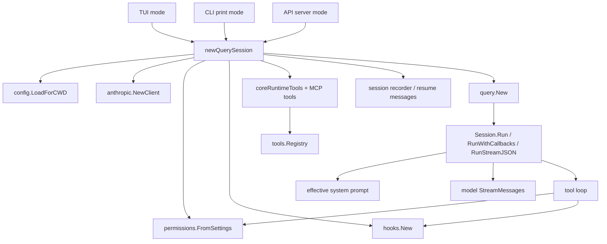
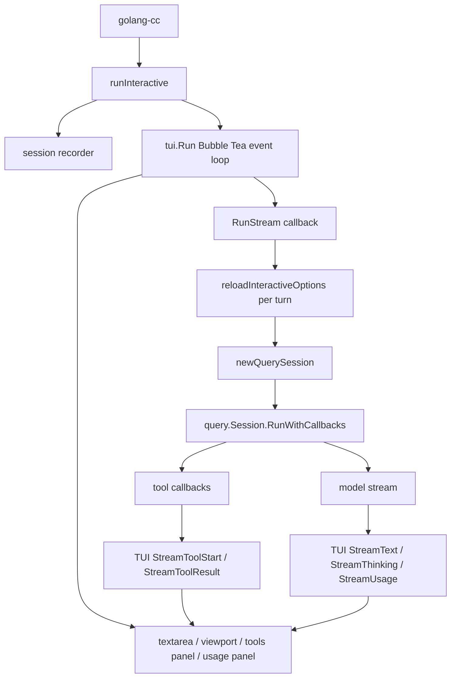
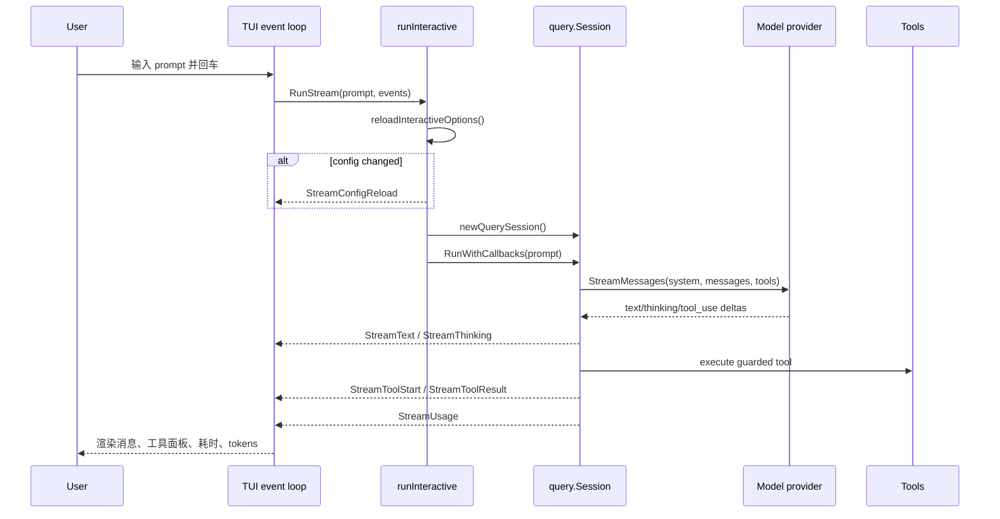
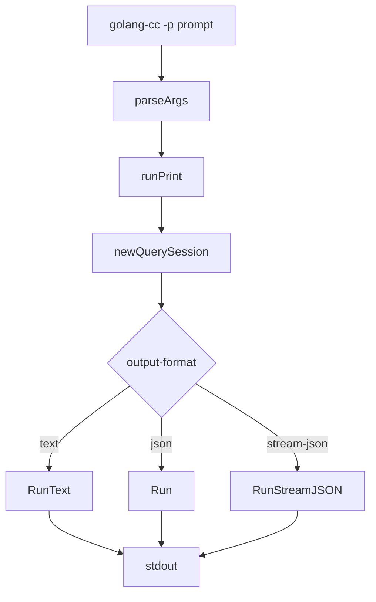
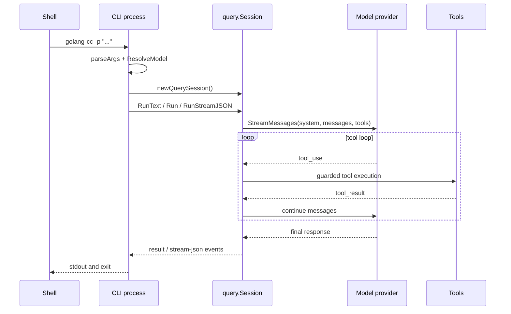
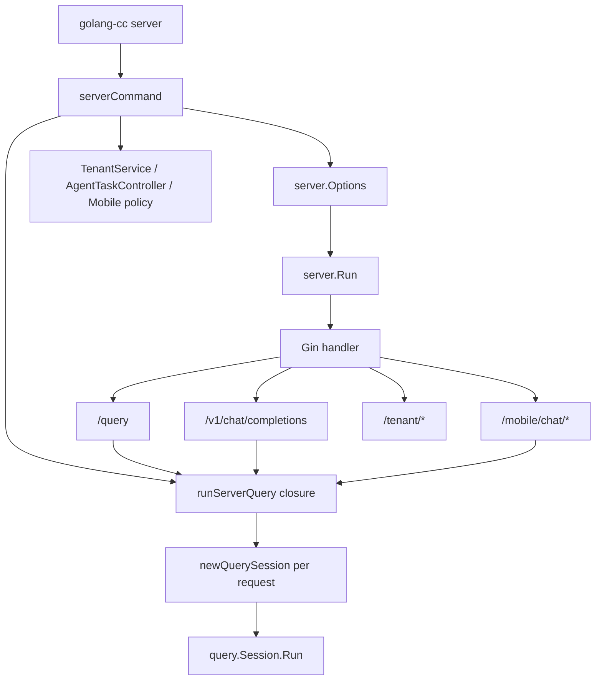
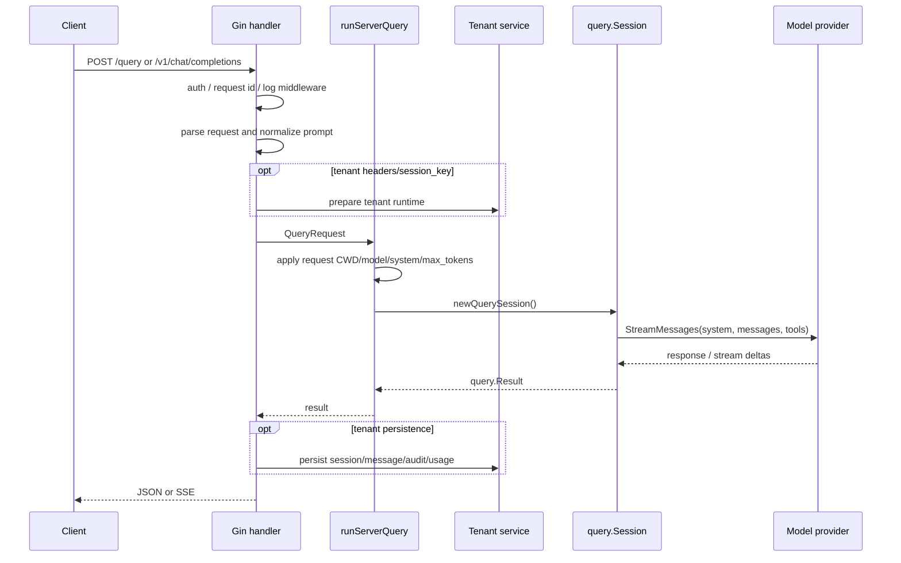

# Runtime Modes

本文梳理 golang-cc 当前三种主要运行模式：TUI、CLI print/headless、API server。三者最终都会进入同一个 `query.Session` 主循环，但生命周期、配置刷新和响应输出方式不同。

## 共享 Query Runtime

共享能力：

| 能力 | 说明 |
| --- | --- |
| 配置 | provider、base_url、fallback、permissions、sandbox、hooks、MCP、output style 等由 `config.LoadForCWD` 读取。 |
| 权限 | `permissions.FromSettings` 生成 policy，工具通过 `tools.GuardAll` 包装。 |
| 工具 | core tools、MCP tools、Task sub-agent、Skill tool 统一进 registry。 |
| 会话 | recorder 记录 transcript，支持 resume/checkpoint/rewind/fork。 |
| 提示词 | `query.Session` 统一构造 system blocks、memory、skills catalog、prompt cache。 |
| telemetry | query/model/tool/session 事件统一发到 telemetry/observability。 |

## TUI Mode

TUI 是前台交互进程，不是后台 daemon，也不监听 API 端口。它负责终端 UI、输入、流式渲染、权限审批、工具活动面板和 usage 展示。

TUI 时序：

TUI 特点：

| 项 | 行为 |
| --- | --- |
| 生命周期 | 单个前台进程常驻到 `/exit` 或退出终端。 |
| 模型热加载 | 未使用 `--model` 时，每轮发送前重新读取配置；使用 `--model` 时锁定命令行模型。 |
| 输出 | 主聊天历史写入 terminal natural scrollback；Bubble Tea live layer 负责底部输入、流式预览、thinking、权限审批、工具活动面板、usage panel 和 picker。 |
| 权限 | TUI ask-mode 可交互审批；`--dangerously-skip-permissions` 进入 bypass。 |
| 会话 | recorder 持久化 transcript，TUI resume 会显示恢复状态。 |

## CLI Print / Headless Mode

CLI print 是一次性进程。每次执行命令都会重新解析参数和配置，然后运行一轮或多轮 query loop，完成后退出。

CLI 时序：

CLI 特点：

| 项 | 行为 |
| --- | --- |
| 生命周期 | 一次性进程，命令结束即退出。 |
| 配置刷新 | 每次新命令都会重新读配置；运行中不需要 hot reload。 |
| 输出 | text、json、stream-json。 |
| 权限 | headless ask 可走 `--permission-prompt-tool`；也支持 bypass。 |
| 用途 | 脚本、CI、一次性任务、自动化集成。 |

## API Server Mode

API server 是长驻 HTTP 服务，基于 Gin handler，提供 `/query`、OpenAI-compatible `/v1/chat/completions`、mobile API、多租户 CRUD、audit、metrics、Swagger 等接口。

API server 时序：

API server 特点：

| 项 | 行为 |
| --- | --- |
| 生命周期 | 长驻 HTTP server，直到进程退出。 |
| 配置刷新 | 每个请求会重新 `newQuerySession`，provider/settings 会重新加载；默认模型来自启动时 `opts.model`，OpenAI `model` 或 `/query.model` 可覆盖本次请求。 |
| 输出 | JSON、OpenAI-compatible response、SSE、mobile SSE。 |
| 鉴权 | 可配置 server auth token；mobile API 使用 JWT。 |
| 多租户 | MySQL DSN 存在时启用 tenant/user/session/message/audit 持久化。 |
| 可观测 | Gin request log、audit、telemetry、Prometheus metrics、HTTP exporter。 |

## 三种模式差异

| 维度 | TUI | CLI print/headless | API server |
| --- | --- | --- | --- |
| 进程形态 | 前台交互常驻 | 一次性进程 | 后台/服务常驻 |
| 入口 | `runInteractive` | `runPrint` | `serverCommand` |
| Query session | 每轮消息新建 | 每次命令新建 | 每个请求新建 |
| 默认模型刷新 | per-turn reload，除非 `--model` 锁定 | 每次进程启动读取 | 启动时固定；请求 model 可覆盖 |
| UI/输出 | Terminal scrollback + Bubble Tea live layer | stdout | HTTP JSON/SSE |
| 权限审批 | TUI 交互审批 | headless prompt tool / bypass | 请求链路内权限策略 / bypass 配置 |
| 会话持久化 | local transcript recorder | local transcript recorder | tenant MySQL + local runtime recorder |
| 典型用途 | 本地交互开发 | 脚本/CI/自动化 | 前端、移动端、第三方 OpenAI client |

## 排查建议

| 现象 | 优先检查 |
| --- | --- |
| TUI 改配置后模型没变 | 是否用 `--model` 启动；下一条消息是否出现 `Config reloaded`。 |
| API server 模型没变 | 请求体是否带 `model`；server 是否需要重启；启动时 `opts.model` 是什么。 |
| CLI 模型没变 | 当前 shell 环境变量、config 搜索路径、`config.local.yaml` 是否覆盖。 |
| TUI 和 API 行为不同 | TUI 有 per-turn model reload；API server 默认模型启动固定。 |
| 工具列表不同 | MCP config、enabled/allowed/denied tools、tenant/mobile policy 是否不同。 |
