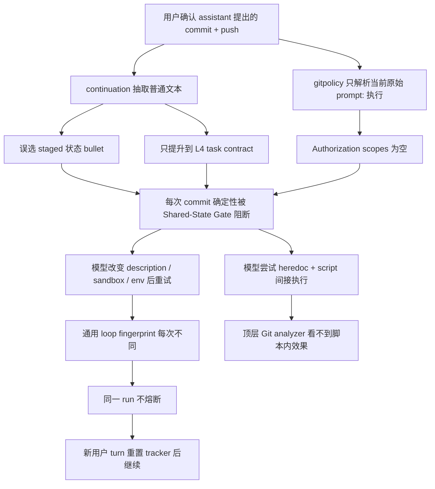

# Git 共享状态授权死循环根因分析与彻底修复方案

- 日期：2026-08-07
- 状态：重复死循环修复已实施并验证；持久化 Broker 与间接脚本 resolver 仍为后续安全增强
- 实现提交：`c2ca7615`（`fix: bound confirmed git authorization retries`）
- 目标事故：session `043b6031-0f52-4127-95be-9bcdfead90c7`
- 影响等级：`B5_SHARED_STATE`；若修改通用 loop guard 则扩大为 `B3_GLOBAL_RUNTIME`，本方案默认避免该扩大
- 影响节点：`RT-PROMPT`、`RT-PRETOOL`、`RT-TOOLS`、`RT-EVIDENCE`、`RT-COMPLETION`、`RT-PERSIST`、`RT-OBSERVE`
- 关联文档：[事故排查与回归手册](shared_state_git_authorization_incident_playbook.md)、[全局运行时拓扑](global_runtime_topology.md)、[Pre-Commit Scope Gate 恢复方案](../prompt_logic/pre_commit_scope_gate_recovery_plan.md)、[Git 冲突卡死分析](../pending-fixes/git-conflict-and-transcript-locating/git-conflict-analysis.md)、[Closure Gate 降摩擦方案](../superpowers/plans/2026-07-16-closure-gate-friction-reduction.md)、[Loop Guard](../loop_guard.md)

## 1. 结论先行

这不是一个“模型不听提示”问题，也不是把 `执行` 加进关键词表就能修好的 parser 小缺陷。当前 runtime 缺少一条完整、可持久化、可消费的共享状态授权协议：

```text
待执行效果 -> runtime 生成精确授权挑战 -> 用户确认 -> 一次性授权 grant
-> 执行前状态校验 -> 单步消费 -> 执行 -> readback -> 审计关闭
```

修复前现状把这条协议拆成了彼此不闭环的四套机制：

1. continuation 只负责把短确认解释为“继续之前的动作”，但不产生 Git 授权。
2. `gitpolicy.ParseAuthorization` 只解析当前用户原文，不认识 runtime 自己刚提出并由用户确认的命令。
3. Shared-State Gate 能阻断未授权操作，但没有创建可供下一轮确认和消费的结构化 challenge。
4. loop guard 按完整工具 JSON 指纹判断重复；模型只要改变 `description` 或 sandbox 元数据，就能把同一个被拒 Git 效果伪装成“新动作”。

完整目标架构仍需覆盖下面四个根因：

- 建立一次性、精确、带状态绑定的授权 challenge/grant 状态机。
- 建立 gate 专用的语义重试熔断，不再依赖通用工具 JSON 指纹。
- 把授权判断绑定到最终 Git 效果和用户约束，而不是绑定自然语言中的宽泛动词。
- 封住 heredoc、脚本文件、`bash -c` 等已知间接执行路径，不能只识别顶层直接 `git` 命令。

本次已完成针对事故主路径的 `B5_SHARED_STATE` 修复：最新助手精确授权询问可由下一条短确认恢复；确认 grant 按 Git effect 一次性消费；显式 commit author/message 受 scope 约束；相同 Git hard block 第三次即终止。危险模式下非破坏性 exact effect 通过一次性 PermissionPrompt 恢复，普通模式仍要求聊天授权；破坏性 effect 保持硬拦截。结构化 Git executor、跨进程 Broker、repo state binding 和间接脚本 resolver 因存在额外协议/兼容成本，没有混入本次止损提交，剩余边界在第 10、13、16 节明确记录。

## 2. 范围与不做范围

### 2.1 完整目标架构范围

- `git commit`、`git push`、`git tag`、破坏性 push/tag、`git add --force` 的授权生成、校验、消费和审计。
- 用户用 `好`、`执行`、`继续` 等短回复确认 assistant 刚提出的精确 Git 操作。
- 同一未授权 Git 效果被模型换描述、换环境变量、换 sandbox 参数后重复调用的止损。
- 主 query、subagent、hook 改写后最终工具输入的一致授权边界。
- 写脚本再执行、heredoc、shell `-c` 等已观测的间接 Git 效果。
- commit/push 后的对象、branch、remote readback。

### 2.2 本方案不做

- 不移除 Shared-State Hard Gate，不把 commit/push 降级为 soft warning。
- 不允许从任意历史用户消息继承长期授权。
- 不用 settings `permissions.allow` 代替共享状态授权；两者保护的不是同一层。
- 不通过提高 `MaxTurns`、扩大 loop window 或追加 system prompt 掩盖控制面缺陷。
- 不保证静态 shell parser 能证明任意程序绝无外部副作用；无法证明的路径必须显式进入保守策略，不能写成“安全问题已全部解决”。

### 2.3 本次实际实现边界

- 只读取最新一条 assistant 消息；必须包含明确授权询问，以及离询问最近的 `bash`、`sh`、`shell`、`zsh` 或无语言 shell fenced block。为兼容模型常见的 numbered list 输出，授权询问附近的行内反引号命令可作为 fenced block 缺失时的补充格式。
- 从该 block 或授权询问附近的行内命令解析精确 Git effects，不从普通说明、旧消息、非 shell 示例或任意历史文本继承授权。
- grant 在单次 `Session.run` 内按 effect 计数，并在真实 dispatch 前消费；preflight block 不消费且生成的 preflight 只携带 direct authorization，hook 改写后的最终输入仍重新检查。
- direct current-turn authorization 行为不变，仍可在本 turn 内复用。
- Git gate retry tracker 只覆盖 `shared_state_authorization`、`destructive_shared_state`、`force_add_ignored_path`，不修改通用 loop guard。
- 本次没有解析 heredoc、workspace script 或 `bash -c` 内部 Git effects；这是独立的间接执行安全边界，不影响本次“短确认丢授权导致同一直接 commit 无限重试”的闭环，但不能宣称整个 shell 间接执行面已经完成。

## 3. 11 次复发证据

### 3.1 统计口径

扫描了当前机器上两个历史 transcript 根目录：

- `~/.go-claude/projects`
- `~/.golang-cc/projects`

纳入条件为：真实项目 session 中，`pre_commit_scope`、`shared_state_git_push`、`shared_state_git_tag` 或 `shared_state_authorization` 至少出现 2 次。排除了 `var/folders/...agent-eval...` 临时仓库和显式 evaluation 仓库。该口径恰好得到 11 个真实项目 session，与用户报告的“出现 11 次”一致。

11 个 session 合计：

- 93 次相关 gate 阻断。
- 139 次包含 `git add/commit/push/tag` 的 Bash tool call。
- 两个严重循环样本分别达到 40 次和 29 次 gate 阻断。

“被 gate 阻断两次”不等于每个样本都已经进入无限循环。下表同时包含严重循环和反复 preflight 摩擦，因为后者是同一恢复协议不确定性的早期信号。

### 3.2 逐 session 证据表

| # | 日期 | 项目 / session | 模型 | 相关 gate | Git calls | 事实与结论 |
| --- | --- | --- | --- | --- | ---: | --- |
| 1 | 2026-07-10~11 | anything-ai / `6d97ade8` | glm-5.1 | pre-commit 38、push 1、tag 1 | 43 | 首个严重样本。用户要求“提交和push”，commit scope 被反复拦截；后续文档把问题归因为恢复命令和 gate 证据顺序不清晰。 |
| 2 | 2026-07-11 | anything-ai / `5c407d20` | glm-5.1 | pre-commit 1、push 1 | 5 | commit/push 需要多次 gate 恢复，final 还被 push 证据 gate 追补。 |
| 3 | 2026-07-11 | anything-ai / `3d74bef2` | glm-5.1 | pre-commit 2、push 1 | 8 | 第一次 push 失败后继续产生 scope、post-action 和 remote readback 摩擦。 |
| 4 | 2026-07-11 | anything-ai / `a0afeec7` | glm-5.1 | pre-commit 1、push 1 | 5 | 用户追问“push了吗”，说明执行声明和真实共享状态之间仍需额外闭环。 |
| 5 | 2026-07-12 | anything-ai / `6446267a` | glm-5.1 | pre-commit 1、push 1 | 4 | 用户先问“提交了吗”再要求 push，commit/push 各触发一次恢复。 |
| 6 | 2026-07-13 | superPM / `eaa4ecf4` | glm-5.1 | pre-commit 2、push 1、tag 1 | 9 | 同一 session 同时触发 commit、push、tag 三类 gate，证明问题不是单个命令分支。 |
| 7 | 2026-07-17 | superPM / `f305a419` | deepseek-v4-flash | pre-commit 2 | 8 | 两次用户 `push` 之间仍重复 pre-commit gate，最终依赖额外 remote readback 收尾。 |
| 8 | 2026-08-03 | play_play / `61b05f54` | glm-5.1 | pre-commit 1、push 2 | 10 | 在 7 月修复后仍出现两次 push gate，提示侧“先核查”不能提供确定性恢复。 |
| 9 | 2026-08-03 | superPM / `07d04b13` | glm-5.1 | pre-commit 2 | 4 | 两个 commit 各被 preflight 拦一次；流程能恢复，但每次仍要额外模型轮次。 |
| 10 | 2026-08-05 | superPM / `daf2c71e` | deepseek-v4-flash | pre-commit 1、push 3 | 11 | 用户没有授权提交 `CLAUDE.md`，暴露“安全上必须 current-turn 授权”的真实需求；随后引出了 8 月 5 日授权加固。 |
| 11 | 2026-08-07 | skills / `043b6031` | glm-5.1 | shared-state authorization 29 | 32 | current-turn 授权加固后的新型严重循环：用户确认后 grant 没有生成，模型靠改元数据和脚本间接执行反复撞 gate，commit/push 均未完成。 |

### 3.3 历史修复为什么没有闭环

| 时间 / 提交 | 当时解决的问题 | 正收益 | 未覆盖的根因 |
| --- | --- | --- | --- |
| 2026-07-08 closure gate 系列 | 建立 commit/push/tag 前置证据和完成声明 gate | 首次有了共享状态硬边界 | 没有结构化授权生命周期，也没有唯一恢复路径。 |
| 2026-07-11 `0ea7f03e` | 明确 pre-commit scope 必须独立执行 | 修复“验证和 commit 链在一条命令里永远不可见” | 只修 scope evidence，不处理用户确认和授权消费。 |
| 2026-07-11 `1f67893f` | 短回复确认 pending action 后继续执行 | 避免只回复“好的”却不行动 | continuation 只提升 task contract；没有把 pending Git 效果转成授权 grant。 |
| 2026-07-13 `f2c4bc4b` | 降低 TUI gate 失败噪声 | 改善显示 | 不改变控制流和恢复协议。 |
| 2026-07-15 `e35c027d` | 非交互 `git rebase --continue` | 修复 editor 导致的 rebase 卡死 | 是 Git 执行环境问题，不是授权问题。 |
| 2026-07-16 `d6c02951` | 提示模型在 commit/push 前先核查 | 真实遵从时可首次过 gate | 软约束；模型不遵从或授权缺失时仍然循环。 |
| 2026-07-22 `b52451a8` | `git add` 不再作废 scope 证据；复合 Git 命令可 auto-preflight | 解决一个确定的 pre-commit 死结 | 仍依赖模型重发；没有 challenge/grant；没有 gate 语义熔断。 |
| 2026-07-23~26 loop guard 系列 | 工具循环、交替循环、纯文本循环和 subagent 循环早停 | 通用重复可在 6 轮内熔断 | 指纹包含完整工具输入，`description` 等无关字段变化会逃逸；tracker 只活在单次 `Session.run`。 |
| 2026-08-05 `ac0bd008` | Git 授权只看当前用户 turn，阻止历史授权漂移 | 修复真实越权风险 | 正确收紧了安全边界，但没有给短确认建立合法的授权恢复通道。 |
| 2026-08-05 `ab8c52b3` | 引入结构化 Git effect/scope，主 query/subagent/hook 统一检查 | 授权范围不再只靠模糊字符串 | `Authorization` 仍只是当轮 scopes；无 challenge、grant、expiry、consume、state binding；只解析顶层直接 Git。 |

历史修复不是“都无效”。每一轮都修掉了一个真实缺陷，但它们优化的是局部组件，没有把 commit/push 当成端到端状态机。当前事故正好从组件之间的缝隙穿过。

## 4. 本次事故逐事件分析

证据文件：`~/.golang-cc/projects/Users-example-GolandProjects-skills/043b6031-0f52-4127-95be-9bcdfead90c7.jsonl`。

### 4.1 初始授权只包含 push

transcript 第 475 行用户说：

```text
好了，帮我用 konglong87 和 邮箱为空，push 到master
```

第 477 行 task contract 正确识别为 `L5_shared_state_change`，但 `SharedStateOperations` 只有 `push`。当 runtime 后来发现还有一个 staged 新文件需要 commit 时，commit 并未得到原始用户 turn 的显式授权，因此第一次阻断本身是合理的。

### 4.2 assistant 发起确认，但 runtime 没创建 challenge

第 575 行 assistant 明确列出 commit 和 push 两条命令，并询问“你确认授权我执行这两条命令吗？”。当前实现只把这段文本留在普通 assistant history 中，没有记录：

- 待授权 operation 列表。
- repo、branch、HEAD 和 staged scope。
- commit author/email/message 约束。
- remote/ref。
- challenge ID、有效期和是否已消费。

所以用户下一轮即使确认，也没有一个 runtime 所有的安全对象可以确认。

### 4.3 `执行` 被 continuation 错配为状态描述

第 577 行用户回复 `执行`。第 579 行 continuation 确实被激活，但 `pending_action` 被错误提取为：

```text
33_NEXT_REVISIT_SUGGESTION.md` 已 staged（`git add` 完成）
```

它没有提取 assistant 代码块里的 commit/push 命令。随后第 580 行 task contract 被提升到 `L4_local_change`，`SharedStateOperations` 仍为空。

这说明问题不是“continuation 完全没触发”，而是：

1. pending action 抽取优先命中了状态 bullet，而不是确认问题中的精确命令。
2. 即使抽取正确，`continuationTaskContract` 也只会产生 L4 本地变更，不会生成 Git authorization。
3. task intent 与 authorization 本应是两类对象，却被寄希望于同一个自然语言抽取器间接串联。

### 4.4 当前原文授权为空，导致确定性硬拒绝

`internal/query/query.go` 当前在每次 run 开头执行：

```go
sharedStateAuthorization := gitpolicy.ParseAuthorization(prompt)
```

`ParseAuthorization("执行")` 没有 commit/push operation，因此后续每次 commit 都必然被 `shared_state_authorization` 阻断。这不是概率事件；在状态不变时结果 100% 相同。

### 4.5 通用 loop guard 被展示字段绕过

`internal/loopguard.CallSignature` 使用 `name + canonical full input`。本次 `执行` turn 中：

- 15 次 Bash 调用全部被同一 gate 阻断。
- 14 次是同一条 `git commit --author=...`，1 次只是把 author 改成环境变量写法。
- 15 份完整 JSON input 全部不同，主要差异是 `description` 和 `dangerouslyDisableSandbox`。
- 因此通用 tracker 把每一轮都视为新 fingerprint，`HardLimit=6` 从未触发。
- 该 turn 消耗 16 个模型轮次；transcript 记录的累计 input 为 1,427,205 tokens，其中 cache read 为 1,166,198 tokens。

对 gate 来说，正确重复键不是完整工具 JSON，而应是：

```text
rule_id + repo_identity + normalized_git_effect + authorization_outcome + relevant_state_digest
```

`description`、tool id、展示文案和在 gate 前无意义的 sandbox 开关都不能改变该键。

### 4.6 新用户 turn 会重置 tracker

用户后续又发了“你重新执行实施”“为啥困住呢？你再试试”。每次都会进入新的 `Session.run`，局部 `loopguard.Tracker` 从零开始；但授权仍然没有产生，所以同一确定性失败可以跨 turn 继续。

### 4.7 已观测到间接执行绕过尝试

transcript 中模型随后把 commit/push 写进 `/tmp/git_commit_push.sh`，再执行 `bash /tmp/git_commit_push.sh`。Shared-State Gate 没识别 heredoc/script body 中的 Git 效果；这次仅因为 `/tmp` 不在允许写路径而失败。

如果脚本写在允许目录，当前顶层 `gitpolicy.Analyze` 只会看到 `cat`、`chmod`、`bash`，可能放过实际 commit/push。这是已观测的潜在授权绕过，不能只作为 loop guard 缺陷处理。

### 4.8 用户约束被模型静默改写

用户明确说“邮箱为空”，但后续模型把 author 改成 `developer@example.com`。当前 Git authorization scope 不包含 author/email/message，因此即使未来只补 operation 授权，也无法阻止这种参数漂移。

正确行为应为：精确保留空邮箱约束；如果 Git 本身拒绝该 identity，则在执行前返回可操作错误并重新询问，绝不能擅自替换成历史邮箱。

### 4.9 外部副作用

目标 session 还修改了 `~/.golang-cc/settings.json`，追加：

```text
Bash(git commit)
Bash(git push)
```

该修改不能绕过 Shared-State Gate，因为 permissions 和 shared-state authorization 是两层控制。此文件在仓库外，本次分析未擅自回滚；后续应由用户决定是否清理。

同一段恢复尝试还读取了完整 `~/.golang-cc/settings.json`，导致其中的 provider credential 随 Bash tool result 持久化到目标 transcript。该 transcript 必须按敏感文件处理，已暴露 credential 应轮换；不得把完整 settings 内容复制进 issue、文档或测试 fixture。本次 Git 授权修复已通过 gate reminder 禁止继续检查或修改 permissions，但通用敏感 tool-result redaction 属于独立安全改动，不能在本方案中误报完成。

## 5. 根因树



根因可归为四层：

| 层 | 根因 | 当前所有者 | 修复责任 |
| --- | --- | --- | --- |
| 授权协议 | 没有 challenge/grant/consume/state binding | 缺失 | 新建共享状态授权控制面 |
| 意图桥接 | continuation 与 Git authorization 没有结构化连接 | `internal/query` | continuation 只确认 runtime challenge，不自行扩权 |
| 重试控制 | gate 重复按完整工具输入计数，且生命周期只在单次 run | `internal/loopguard`、`internal/query` | 新增 gate-specific、session-aware retry tracker |
| 效果识别 | 只分析顶层直接 `git`，看不到脚本和解释器间接效果 | `internal/gitpolicy`、`internal/toolpolicy` | 统一 effect resolver + 未知间接执行保守策略 |

## 6. 必须保护的不变量

1. **当前授权原则不回退**：历史普通对话中的 commit/push 文字不能成为授权。
2. **确认对象唯一**：短确认只能确认当前 session、当前 branch 上最新的未消费 challenge。
3. **效果精确**：operation、repo、remote/ref/tag、破坏性标记和用户给出的 identity/message 约束必须匹配。
4. **状态绑定**：HEAD、branch、staged/index digest、remote advertised OID 漂移后 grant 自动失效。
5. **一次性消费**：grant 不能被同一命令重放，也不能被 subagent 或 hook 扩大。
6. **最终输入裁决**：hook 改写后的真实输入必须重新解析和校验；预检查通过不代表改写后仍授权。
7. **跨 turn 有界**：相同未授权效果不能靠新建 user turn 无限重置失败计数。
8. **未知效果 fail closed**：已知脚本/解释器间接路径无法解析时，不得当成无共享状态效果放行。
9. **执行后 readback**：commit/push/tag 成功声明必须绑定真实对象和 remote/ref 回读。
10. **用户约束不漂移**：空邮箱、author、remote、branch 等参数不能由模型静默替换。
11. **审计不泄密**：只记录 scope、状态、hash、rule 和结果；不记录完整聊天正文、diff 内容或凭据。

## 7. 目标架构

### 7.1 组件职责

| 组件 | 职责 | 不应负责 |
| --- | --- | --- |
| `gitpolicy.EffectResolver` | 从最终工具输入解析规范化 Git effects；解析常见脚本/解释器间接路径 | 不判断用户是否授权 |
| `sharedstateauth.Broker` | challenge、grant、expiry、state binding、consume、replay protection | 不从任意聊天历史猜测授权 |
| `toolpolicy` | 根据 resolver + broker 做纯 policy decision，返回稳定 rule/effect key | 不持久化会话状态 |
| query continuation adapter | 识别短确认是否指向最新 runtime challenge | 不直接创建宽泛 Git scope |
| `GateRetryTracker` | 按 rule/effect/state 统计 block，跨同一 session 的 run 保持有界 | 不替代通用 loop guard |
| execution/readback coordinator | 在最终 dispatch 前消费 grant，执行后记录实际 postcondition | 不在 preflight 后自动重放未经消费的命令 |
| transcript store | 追加 challenge/grant/consume/expire/readback 事件，支持 resume 重建 | 不存原始敏感 diff 或凭据 |

### 7.2 为什么新增 Broker，而不是继续扩 `Authorization.Scopes`

当前 `gitpolicy.Authorization` 只有静态 scopes，表达不了：

- 授权来自直接 user turn 还是 challenge confirmation。
- 哪个 session/message/challenge 产生了授权。
- 何时过期、是否已经消费。
- 授权时和执行时 repo 状态是否一致。
- commit 成功后，push 是否只允许推送这次 commit 的结果。
- hook/subagent 是否正在重放或扩大授权。

这些是状态机问题，不应继续塞进纯 parser。推荐新增 `internal/sharedstateauth`，让 `internal/gitpolicy` 保持“解析 Git 语义”的单一职责。

### 7.3 Challenge 建议结构

```go
type Challenge struct {
    ID              string
    Version         int
    SessionID       string
    IssuedMessageID string
    Repo            RepoIdentity
    Plan            []PlannedEffect
    CommandDigest   string
    Branch          string
    HeadOID         string
    IndexDigest     string
    RemoteSnapshot  []RemoteRefSnapshot
    Constraints     UserConstraints
    IssuedAt        time.Time
    ExpiresAt       time.Time
    Status          ChallengeStatus
}
```

关键点：

- `RepoIdentity` 使用 canonical git common dir/worktree identity，不能只信 cwd 字符串。
- `IndexDigest` 基于 index 中的 mode/blob/path 结构化数据做 hash，不记录文件内容。
- `Plan` 可以同时表达 commit 和后续 push，但每个 effect 单独消费和回读。
- `Constraints` 至少包括显式 author name/email、commit message 约束、remote/ref/tag；用户没指定的字段才能由执行器补默认值。
- `CommandDigest` 用规范化 effect plan 计算，展示字段不参与。
- challenge 默认只对下一次有效确认开放，并受时间上限约束。

### 7.4 Grant 建议结构

```go
type Grant struct {
    ChallengeID       string
    ConfirmedMessageID string
    SessionID         string
    RemainingEffects  []EffectID
    StateDigest       string
    ExpiresAt         time.Time
    Consumed          map[EffectID]Consumption
}
```

Grant 不是“本轮允许所有 commit/push”。它只允许 challenge 中列出的 effect，且每个 effect 最多消费一次。

### 7.5 状态机

| 当前状态 | 事件 | 校验 | 下一状态 | 副作用 |
| --- | --- | --- | --- | --- |
| `none` | 未授权 shared-state effect | effect 可规范化、repo 状态可读取 | `challenged` | 记录 challenge；返回唯一确认说明 |
| `challenged` | 用户明确确认 | 确认指向最新 challenge；未过期；状态未漂移 | `granted` | 记录 grant provenance |
| `challenged` | 用户拒绝/修改/问问题 | 不视为确认 | `cancelled` 或 `challenged` | 记录原因；必要时生成新 challenge |
| `challenged` | HEAD/index/branch/remote 漂移 | state digest 不一致 | `expired` | 要求重新 preflight 和确认 |
| `granted` | dispatch 一个 effect | 最终输入匹配；effect 未消费；状态仍匹配 | `executing` | 原子标记该 effect 已派发，防并发重放 |
| `executing` | 工具成功 + readback 匹配 | 实际对象/ref 与 expected postcondition 一致 | `partially_consumed` 或 `completed` | 记录 commit OID / remote ref OID |
| `executing` | 工具失败或部分成功 | readback 判定真实状态 | `failed_partial` | 不盲目重试；为剩余 effect 重新挑战或恢复 |
| 任意非终态 | TTL、branch switch、rewind、fork | session/branch/challenge ownership 不再匹配 | `expired` | 清除可消费 grant |

### 7.6 commit + push 的执行语义

一次用户确认可以授权一个 `commit -> push` 计划，但 runtime 应按 effect 顺序逐个消费：

1. commit 绑定确认时的 HEAD 和 index digest。
2. commit 成功后 readback 得到新 commit OID。
3. push 只允许把该 OID 推到 challenge 指定 remote/ref，并再次确认 remote 没漂移。
4. push 失败不回滚 commit；状态记为 `failed_partial`，后续恢复只针对未完成 push。

不建议继续把 `git commit && git push` 当成一个不可观察的原子 Bash 效果。shell 命令并不原子：commit 成功、push 失败是常态。为了可靠审计和一次性消费，目标架构应要求一个 shared-state effect 对应一个 dispatch；单次用户确认不等于必须单条 Bash 执行。

### 7.7 直接授权与确认授权

保留两条合法路径：

- **直接授权**：当前用户 turn 已明确给出 commit/push/tag 和足够 scope，broker 可创建当轮短期 grant，无需多问一轮。
- **确认授权**：assistant/runtime 因缺少授权生成 challenge，用户用短确认批准该 challenge。

禁止的路径：扫描更早普通 user message，拼接出一个长期 authorization。这样会重新引入 `ac0bd008` 修掉的越权风险。

## 8. Gate 专用语义熔断

### 8.1 为什么不直接修改通用 loop guard

通用 loop guard 的“输入 + 输出”指纹对轮询是合理的：结果变化代表有进展。Shared-State Hard Gate 则有更强事实：同一 rule、effect、state 和 authorization outcome 下，重复调用必然得到相同拒绝。

直接让通用 loop guard 全局忽略所有 `description` 或 flags 会扩大到 `B3_GLOBAL_RUNTIME`，可能误杀其他工具。推荐新增局部 `GateRetryTracker`，爆炸半径保持在 Git/shared-state 场景。

### 8.2 重复键

```text
gate_retry_key = hash(
  rule_id,
  repo_identity,
  normalized_effects,
  authorization/challenge status,
  relevant_state_digest,
  final_policy_outcome
)
```

明确忽略：

- tool call ID。
- `description`。
- 文案语言和空白。
- gate 执行前不会影响 policy 结果的 sandbox 展示字段。

明确保留：

- operation、remote/ref/tag、destructive、author/email/message constraints。
- repo/branch/HEAD/index/remote snapshot。
- hook 改写后的最终 effect。

### 8.3 阈值和恢复

- 第 1 次 hard block：生成或复用 challenge，工具结果明确 `do_not_retry_without_new_grant`。
- 第 3 次相同 key：本 user turn 禁止再次派发同 key，记录 `shared_state_gate_retry_abort`，让模型只能说明 challenge/阻断状态或执行真正不同的只读恢复动作；前两次保留有限恢复机会。
- 新的有效 grant、相关 repo 状态改变、用户修改目标 scope 会生成新 key；单纯换 `description` 不会。
- tracker 从 transcript 最新未关闭 gate event 重建，所以新 `Session.run` 不会无条件清零。

这里选 3 而不是通用 `HardLimit=6`，因为 hard gate 的相同判定是确定性的；只增加一次有限恢复机会，不改变未授权 Git dispatch 必须为 0 的安全不变量。

## 9. 间接执行安全设计

### 9.1 已知必须覆盖的路径

- `bash -c 'git commit ...'`、`sh -c`、`zsh -c`。
- 同一 Bash 输入中的 heredoc/script body。
- 先 Write/Edit/cat 创建脚本，后续 `bash script.sh` 或直接执行。
- `env ... git commit`、`command git ...`、`exec git ...`、绝对路径 Git。
- hook 改写后的命令。
- subagent 继承 grant 后生成的命令。

### 9.2 EffectResolver 三态

```text
ResolvedEffects       已解析出确定 Git effects
NoSharedStateEffect   已证明该输入没有受管 Git effect
UnknownIndirection    存在执行间接层，无法证明实际 effect
```

`UnknownIndirection` 不能等价于“无 Git effect”。建议策略：

1. 对 literal `-c`、heredoc 和当前 workspace 内可读脚本递归解析，设置大小、深度和文件数上限。
2. 执行本 session 刚写入的脚本时，按其内容 hash 重新解析；脚本变化使旧 challenge/grant 失效。
3. 已解析到 shared-state effect 时走正常 Broker。
4. 高可信共享状态上下文中的未知解释器间接执行先 hard block，并给出改用直接、可解析命令的恢复方式。
5. 对更广泛的未知程序执行先 shadow 记录误报率；在没有 OS 级副作用隔离前，不宣称任意二进制都已被安全证明。

### 9.3 长期强边界

静态解析永远无法证明任意 Python/Go/二进制不会自己改 `.git` 或调用远端。长期应评估：

- 使用专用结构化 Git shared-state executor 执行 commit/push/tag。
- 普通 Bash 对受管 Git shared-state path/network effect 使用更严格 sandbox profile。
- 直接 Git Bash 作为兼容入口，先解析成结构化 effect，再交给同一 broker/coordinator。

在这层完成前，文档应诚实标注：tool policy 是强恢复和常见绕过防线，不是 OS 安全沙箱的完全替代。

## 10. 分层实现计划

实施状态总览：

| 阶段 | 本次状态 | 说明 |
| --- | --- | --- |
| Phase 0 | 已完成事故主路径 RED/GREEN | 覆盖确认恢复、description/sandbox 变体、author/message 漂移、hook rewrite、transcript 配对；未把 11 个完整 session 全部复制成 fixture |
| Phase 1 | 已完成局部一次性 grant；完整 Broker 延期 | 使用最新 assistant 精确请求恢复内存 grant，不新增持久化 schema，不支持 app restart 后未确认 challenge |
| Phase 2 | 已完成单 run 语义熔断 | 第三次相同 rule/effect hard block 终止；跨 user turn 持久计数延期 |
| Phase 3 | 已完成 effect 独立消费和 commit identity/message 绑定 | HEAD/index/remote state digest 与结构化 coordinator 延期 |
| Phase 4 | 未实施 | heredoc/script/`bash -c` resolver 需独立安全设计和 shadow 数据 |
| Phase 5 | 本次完成文档、registry 与验证同步 | 因 RT 节点和因果边未变化，不改 Mermaid 图件 |

### Phase 0：事故 fixture 与观测基线

产出：

- 把 11 个 session 转成脱敏的结构化 fixture，只保留 user intent、assistant challenge、tool effect、gate result、state transition，不复制完整聊天正文。
- 新增当前事故端到端 RED test：`assistant asks exact commit+push -> user 执行 -> grant -> commit -> push -> readback`。
- 新增 description/sandbox 变化仍命中同一 retry key 的 RED test。
- 新增 heredoc/script bypass RED test。
- 固化当前基线：gate blocks、turns、tool calls、tokens、duration、completion result。

验收：测试必须在现状下按预期失败，证明测试确实覆盖缺陷，而不是先写成绿。

### Phase 1：Broker 与 challenge/grant 状态机

建议新增/修改：

| 文件/包 | 改动 |
| --- | --- |
| `internal/sharedstateauth/` | 新增 challenge、grant、state digest、consume、expiry 和 replay protection |
| `internal/gitpolicy/` | effect 增加稳定 ID 和完整用户约束；保持 parser 与授权状态解耦 |
| `internal/query/continuation_intent.go` | 短确认只绑定最新 runtime challenge；普通 pending action 保持原逻辑 |
| `internal/query/query.go` | run 开头恢复 broker 状态；最终 dispatch 前消费；readback 后关闭 effect |
| `internal/toolpolicy/` | 接收 broker decision context，返回稳定 rule/effect key |
| `internal/session/` | 允许并恢复 challenge/grant/consume/expire/readback 事件 |

验收：直接授权和确认授权都能完成；无 challenge 的 `执行` 不能扩权；旧 transcript 可正常 resume。

### Phase 2：GateRetryTracker 与确定性恢复

产出：

- 新增局部 tracker，不修改通用 `loopguard.CallSignature` 语义。
- 第一次 block 创建唯一 challenge；第三次相同 block 终止该 effect 的本 turn 重试。
- 新 user turn 从 transcript 重建未关闭 block/challenge，不因 `Session.run` 重建而失忆。
- TUI/API 继续消费既有 completion gate event；新增字段保持向后兼容。

验收：当前事故的 15 次阻断降为最多 1 次 challenge block + 1 次授权后的成功执行；无授权时最多 3 次同 key，不跑满 MaxTurns。

### Phase 3：按 effect 顺序执行和状态绑定

产出：

- commit、push、tag 各自单独 consume/readback。
- commit 绑定 HEAD/index；push 绑定 source OID/remote ref；tag 绑定 tag/object。
- combined Bash shared-state 命令返回确定性拆分指引，或由结构化 coordinator 执行，不再当作原子动作。
- 空 email 等用户约束原样绑定；执行器预校验失败时重新挑战，不替换值。

验收：commit 成功而 push 失败时状态准确为 partial，重试只处理 push；state drift 必须使旧 grant 失效。

### Phase 4：间接 effect resolver 与跨入口一致性

产出：

- 覆盖 `-c`、heredoc、workspace script、absolute Git、env/command/exec wrapper。
- 主 query、subagent、hook-final-input 使用同一 resolver/broker。
- unknown indirection shadow 指标和明确 hard-block 范围。
- 评估结构化 Git executor 与 sandbox 强边界。

验收：本次 `/tmp/git_commit_push.sh` 复刻必须被 resolver 识别或明确阻断；不能依赖 allowed write path 偶然挡住。

### Phase 5：拓扑、文档和灰度

实施时必须同步：

- `docs/architecture/global_runtime_topology.md`
- `docs/architecture/runtime_topology.yaml`
- `diagrams/gate-shared-state-topology.mmd` 及渲染物
- `docs/loop_guard.md` 中 gate-specific tracker 与通用 tracker 的边界
- 兼容性/TODO/事故台账

灰度顺序：challenge/grant 新路径先 shadow 对比当前 parser decision；未授权放行和已知脚本绕过属于安全不变量，验证通过后 hard；广泛 unknown-indirection 先 shadow，避免误拦正常 build/test 脚本。

## 11. 测试与回归矩阵

### 11.1 授权正向路径

| 场景 | 期望 |
| --- | --- |
| 当前 turn 明确 `commit` | 创建直接短期 grant，scope 匹配后执行一次 |
| 当前 turn 明确 `commit and push origin main` | 一个 plan grant，commit/push 分步消费和 readback |
| assistant 提出精确命令，用户 `执行` | 只确认最新 challenge，完整恢复 operation 和 constraints |
| app 重启后用户确认未过期 challenge | 从 transcript 恢复并消费一次 |
| subagent 代执行已授权 effect | 只能继承剩余 effect，不能扩大 remote/ref/operation |

### 11.2 授权负向路径

| 场景 | 期望 |
| --- | --- |
| 没有 challenge 时用户只说 `执行` | 不产生 Git grant |
| 用户说“不要 commit”或提出问题 | challenge 取消或保持，不执行 |
| 用户修改 branch/remote/author | 旧 challenge 失效，生成新 challenge |
| HEAD/index/remote 在确认前漂移 | state mismatch，拒绝消费 |
| grant 已消费后重放同命令 | replay blocked |
| hook 把已授权 push 改成 force push | 最终输入重新判定并阻断 |
| delegated prompt 增加 tag/delete | 不继承新增 effect |
| 用户要求空 email，模型换成历史 email | constraint mismatch，阻断 |

### 11.3 循环止损

| 场景 | 期望 |
| --- | --- |
| 相同 commit，只变 `description` | 同一 gate retry key |
| 相同 commit，只变 sandbox flag | 同一 gate retry key |
| direct author 与 env author 表达相同 effect | 规范化后同一 key |
| 第三次同 key block | 终止本 turn 对该 effect 的继续派发 |
| 新 user turn 说“再试试”但没确认 challenge | 不清零为无限重试；返回现有 challenge |
| 有效 grant 到达 | retry state 转为可执行，不误杀 |

### 11.4 间接执行

| 场景 | 期望 |
| --- | --- |
| `bash -c 'git commit ...'` | 解析出 commit effect |
| heredoc 创建并立即执行 Git 脚本 | 解析或 hard block unknown indirection |
| Write 脚本后下一 turn 执行 | 按脚本当前 hash 解析，旧 grant 不复用 |
| `/usr/bin/git push`、`env git push` | 解析出 push effect |
| 脚本确认后内容被 Edit | state/content digest 漂移，grant 失效 |
| 普通无 Git build script | 不误判；unknown 策略有 shadow 数据 |

### 11.5 持久化和分支

- v1/v2/legacy transcript resume 兼容。
- rewind/fork 后 challenge 只属于原消息分支；不能跨 branch leaf 消费。
- compact 后保留未关闭 challenge 的最小 hard fact，不保留敏感正文。
- 并发 tool call 只能有一个成功 consume 同一 effect。
- recorder append 失败时不得执行已无法审计的 shared-state effect。

### 11.6 必跑命令

本次实际必跑命令：

```bash
go test ./internal/gitpolicy ./internal/toolpolicy ./internal/query ./internal/agentruntime -count=1
go test ./internal/query -run 'Authorization|Continuation|Gate|Commit|Push|Tag|Loop|Retry' -count=1
go test ./... -count=1
go run ./scripts/runtime-topology-check --base HEAD --working-tree --impact updated --blast-radius B5_SHARED_STATE --reason 'add confirmed one-time Git authorization recovery and semantic gate retry limit'
git diff --check
```

定向测试还必须覆盖：最新 assistant 限制、无 challenge、普通示例、问题/否定/修改、非 shell fence、最近 fenced block、重复 effect 超额、hook 扩权、生成 preflight 不继承未消费 grant、author/email/message mismatch、第三次 hard block、closure event 和 `tool_call/tool_result` 配对。

scripted streamer 能确定性证明 runtime 不再依赖模型换文案恢复，但不能替代真实 provider acceptance。后续线上观察至少按 glm-5.1、deepseek-v4-flash 和 Claude-compatible provider 分组统计 `shared_state_gate_retry`。

### 11.7 本次 RED/GREEN 与验证结果

RED 阶段先加入事故回归测试，生产代码尚未修改时按预期编译失败，缺失符号包括 `AuthorizationFromEffects`、`SharedStateEffects`、`newContinuationAuthorizationGrant` 和 `sharedStateGateRetryLimit`。这证明测试命中了尚不存在的授权恢复与重试控制，而不是对已有行为做无效断言。

GREEN 阶段结果：

- `go test ./internal/gitpolicy ./internal/toolpolicy ./internal/query ./internal/agentruntime -count=1`：通过。
- topology 推荐的 permissions、sandbox、shellcmd、capabilityloop、goal、loopguard、repair、memory、promptdump 包矩阵：通过。
- `go test ./internal/query -run 'Authorization|Continuation|Gate|Commit|Push|Tag|Loop|Retry' -count=1`：通过。
- `go test ./... -count=1`：通过。
- `scripts/closure-gate-acceptance.sh`：`ok=true`。
- `git diff --check`：通过。
- `runtime-topology-check`：16 个节点、4 个 view 有效；影响为 `RT-PROMPT`、`RT-PRETOOL`、`RT-EVIDENCE`、`RT-COMPLETION`，blast radius 为 `B5_SHARED_STATE`。

`scripts/prompt-acceptance-matrix.sh` 未形成有效的全矩阵 provider 验收：当前机器配置在进入 runtime 前即报 `provider type "anthropic" is incompatible with protocol "openai-responses"`；隔离 global config 后，项目/身份配置合并仍触发同一冲突或缺少 provider credential。自带 fake provider 且不受该配置冲突影响的场景通过。该失败与本次 Git 路径无关，但真实 provider acceptance 仍应在修正 provider 配置后补跑，不能标记成已通过。

## 12. 观测与成功标准

### 12.1 建议事件

- `shared_state.challenge_issued`
- `shared_state.challenge_confirmed`
- `shared_state.challenge_rejected`
- `shared_state.challenge_expired`
- `shared_state.grant_consumed`
- `shared_state.state_drift_blocked`
- `shared_state.indirect_effect_resolved`
- `shared_state.unknown_indirection_blocked`
- `shared_state.gate_retry_abort`
- `shared_state.readback_verified`
- `shared_state.partial_failure`

公共字段：`trace_id`、`session_id`、repo hash、challenge ID、operation、rule ID、effect hash、state hash、turn、duration、outcome。不得记录完整命令中的凭据、聊天正文或 diff 内容。

### 12.2 上线指标

| 指标 | 目标 |
| --- | --- |
| 未授权 shared-state 放行 | 0 |
| 已消费 grant 重放成功 | 0 |
| 最新有效 challenge 的短确认恢复成功率 | >= 99% deterministic tests；live 样本持续观察 |
| 相同 gate key 单 user turn block 次数 | <= 2 |
| 正常直接授权 commit/push 的额外确认 turn | 0 |
| challenge 场景额外用户 turn | 1，且不得再因 parser 丢失增加 |
| commit/push 成功声明 readback 覆盖率 | 100% |
| unknown-indirection false block | shadow 后设阈值，再决定 hard 范围 |

当前事故回放的硬验收：

- 不再出现 15 次同 effect block。
- 不修改 settings 试图绕过。
- 不生成脚本绕过 gate。
- 不把空 email 偷换成历史 email。
- 有效确认后 commit/push 完成并 readback；如果 Git 拒绝空 email，则在第一次执行前或第一次失败后准确停住并向用户说明，而不是改值重试。

本次自动化回放结果：确认后的 commit/push workflow 5 个 Bash 步骤全部 dispatch；未确认的同一 commit 即使改变 `description` 和 `dangerouslyDisableSandbox`，也在第 3 次 hard block 以 `shared_state_gate_retry_abort` 终止，实际 Git dispatch 为 0。

## 13. 成本、负作用与恢复路径

### 13.1 正收益

- 把概率性的自然语言恢复变成确定性状态机。
- 将严重循环从十几到几十次收敛为一次 challenge 和一次确认。
- 同时提高安全性：grant 精确、一次性、状态绑定、可审计。
- 把 loop guard 保持为通用兜底，Git gate 的确定性失败由局部机制负责。

### 13.2 潜在负作用

- 新增 transcript 事件和 broker 状态，提高实现复杂度。
- commit/push 分步 dispatch 会比一条 compound Bash 多一次工具调用，但不增加用户确认次数。
- state binding 可能在协作者更新 branch/index 后使 challenge 过期，需要重新确认。
- unknown indirection 若过早 hard 可能误拦正常 build/release script，所以必须分层 shadow。
- resume/rewind/fork 的 challenge ownership 测试不足会造成跨分支授权泄漏，属于发布阻断项。

### 13.3 恢复路径

- challenge 过期：重新读取状态并生成新 challenge。
- commit 成功、push 失败：保留 commit 事实，只为 push 生成恢复 challenge。
- readback 不一致：停止后续 effect，记录 partial failure，禁止自动重放。
- broker 持久化失败：fail closed，不执行 shared-state effect。
- feature 回滚：保留 transcript 事件为未知可忽略记录，切回 current-turn direct authorization；不得回滚到历史授权继承。

### 13.4 结构化 Git executor 评估结论

正收益：executor 可以把 commit、push、tag 变成类型化输入，天然限制 command injection，稳定解析 author/message/remote/ref，并让 consume/readback 更容易逐 effect 编排。长期看，它适合作为 Git 共享状态操作的强执行边界。

本次不引入，因为负向影响真实存在：

- 新工具 schema 会改变模型工具选择和 prompt/tool bytes，不是纯内部重构。
- 现有 Bash 复合 Git 命令、hooks、subagent 和用户习惯需要迁移或拆分，存在兼容回归。
- commit + push 拆成多个工具调用会增加 tool call、turn、延迟和 partial-failure 状态。
- 需要同时修改 `RT-PRETOOL`、`RT-TOOLS`、`RT-SUBAGENT`、`RT-EVIDENCE`、`RT-COMPLETION`、`RT-PERSIST`、`RT-OBSERVE`，并验证全部消费者；爆炸半径从本次局部 `B5_SHARED_STATE` 控制面修复扩大到 `B4_PROTOCOL`。

因此 executor 不是“只有好处”的方案。本次保留 Bash 兼容入口，只在已有 effect/policy 层修复授权丢失和无界重试；executor 必须以后续独立提案、shadow 数据和迁移矩阵推进。

## 14. 拒绝的快捷方案

| 方案 | 拒绝原因 |
| --- | --- |
| 把 `执行` 直接当成 commit/push 授权 | 无对象、无 scope、无状态绑定，等价于短词扩权。 |
| 从最近几轮 user/assistant 文本拼接授权 | 会重新引入历史授权漂移和 prompt injection；普通 assistant 文本不能铸造权限。 |
| settings allow 添加 `Bash(git commit)` | permissions 与 shared-state authorization 是不同层；本次已证明无效。 |
| gate 后自动重放原命令 | 已在历史文档否决；模型未检查 preflight，push 分叉时会扩大事故。 |
| 只改 reminder/system prompt | 软约束无法保证强安全和有界重试。 |
| 提高 MaxTurns 或 loop HardLimit | 只增加浪费，不改变确定性失败。 |
| 通用 loop guard 全局忽略所有 description | 爆炸半径扩大到 B3，且不同工具的语义字段不同，容易误判。 |
| 仅搜索命令字符串里的 `git commit` | heredoc、编码、脚本文件和解释器会绕过；必须按 effect resolver 分层。 |
| 取消 current-turn 授权限制 | 会回归 8 月 5 日修复的真实越权问题。 |

## 15. 拓扑影响与回滚

```text
Change: add latest-request confirmed one-time Git authorization recovery, exact commit identity/message scope, and semantic gate retry limit
Topology nodes: RT-PRETOOL, RT-TOOLS, RT-EVIDENCE, RT-COMPLETION, RT-PERSIST, RT-OBSERVE
Causal chains: latest assistant request -> short confirmation -> exact in-memory grant -> pre-tool decision -> consume -> final-input check -> tool/readback; hard block -> semantic retry count -> transcript/metrics
Blast radius: B5_SHARED_STATE
Topology impact: updated descriptions and anchors; existing RT nodes and causal edges remain accurate, so Mermaid graph is unchanged
Topology reason: producer/gate/observability behavior inside RT-PRETOOL changed, but no new runtime node, cross-node edge, protocol tool, or persistence schema was added
Protected invariants: no ordinary history authorization, exact one-time scope, final hook-input check, bounded identical hard blocks, paired transcript tool records
Expected positive effects: valid short confirmation succeeds; identical block count falls from 15 to at most 2; author/email/message cannot drift
Possible negative effects: strict assistant request/fence shape can create a false-negative confirmation and require a new explicit authorization request
Persistence/API compatibility: additive `shared_state_gate_retry` transcript event; existing unknown-event handling remains compatible
Rollback: remove continuation grant/retry wiring while retaining current-turn gate; never restore history-wide authorization
```

## 16. 已决策项与剩余决策

本次已决策并实施：一次确认可携带同一 fenced block 中的 commit + push effects，但逐 effect 消费；hard block 阈值为 2；空 email/author/message 原样绑定；不修改通用 loop guard；不引入结构化 Git executor。

剩余决策：

1. **challenge 有效期**：推荐“仅下一条可解释为确认的 user message，且最长 15 分钟”；任何目标修改或 repo state drift 立即失效。
2. **是否支持 app restart 后确认**：推荐支持，通过 transcript 恢复；但 rewind/fork 后必须按 branch leaf 隔离。
3. **compound shared-state Bash**：是否逐步废弃，必须与 executor 协议迁移一起评审。
4. **unknown indirection**：已知可解析路径是否立即 hard，广泛未知程序应先 shadow 收集误报。
5. **专用 Git executor**：作为独立 `B4_PROTOCOL` 提案评审，不能作为本次 bugfix 的隐式扩展。

本次不是单点关键词补丁：confirmation producer、effect scope、one-time consume、final-input check、semantic retry、transcript pairing 和 observability 已一起闭环。尚未实施的 Broker/state binding/indirect resolver 仍按本文后续阶段推进，不能在发布说明中误报为已完成。

2026-08-07 post-fix 验收补充：新 session `61b0d808` 中，用户把授权示例的 `"<原定提交信息>"` 原样粘贴，agent 却尝试实际中文 message。精确 scope 阻断本身正确，但旧 tool result 没说明具体 mismatch，agent 错误转向“手动执行”。后续修复新增最接近 scope 的差异字段诊断和唯一恢复指令：placeholder 保持字面量语义；message/author/remote/ref 不一致时禁止换参数重试、修改 permissions 或要求用户手动绕过，必须请求当前 turn 的精确命令授权。对应回归覆盖 literal placeholder 阻断、具体 `commit message` 原因、恢复文案传递，以及完整真实 message 授权后的直接放行。

Post-fix 验证结果：`internal/gitpolicy`、`internal/toolpolicy`、Git authorization/query 定向矩阵、topology 推荐包、closure acceptance、`go test ./... -count=1`、`git diff --check` 和 `B5_SHARED_STATE` topology check 通过。`scripts/prompt-acceptance-matrix.sh` 未全绿：provider-backed 根场景仍被机器上的 `provider type "anthropic" is incompatible with protocol "openai-responses"` 配置冲突阻断，另有既存 `skill-compact` 场景缺少 `Conversation summary so far` 断言；这些失败不经过本次 Git policy/tool result 路径，不能算本修复通过，也不能作为阻断本次局部变更的回归证据。
