# Bug Fix History

本文档记录 Go Claude 的 bug 修复历史、回归验证和剩余风险。新增或修复 bug 时，优先在这里追加记录；涉及兼容性矩阵、TODO、API 或专题设计文档的，再同步对应文档。

## 记录原则

- 以事实为准：记录可复现现象、根因证据、修复提交和验证命令，不用猜测替代排查。
- 以用户影响排序：优先记录会影响 TUI/API/WebUI/tenant/runtime 主链路的缺陷。
- 以闭环为准：每条记录应包含状态、修复版本或 commit、验证结果和剩余风险。
- 不混入需求设计：新功能、长期优化和 roadmap 继续放在 `docs/todo.md` 或对应专题目录。
- 不泄露敏感信息：日志、token、完整私有会话内容和外部服务凭证不得写入本文档。

## 状态约定

| 状态 | 含义 |
| --- | --- |
| OPEN | 已确认或高度可疑，尚未修复。 |
| NEEDS_TRIAGE | 已记录可见现象，但还需确认是缺陷、设计预期还是文案/体验问题。 |
| FIXED | 已修复并完成至少一次针对性验证。 |
| VERIFIED | 已修复，并经过全量或高风险链路回归验证。 |
| WON'T FIX | 明确不修，且有兼容性、安全或成本理由。 |
| BLOCKED | 依赖外部环境、上游私有行为或无法在当前环境闭环。 |

## 修复历史索引

> 说明：本表从当前 git 历史开始建立专门台账。2026-07-02 之前的历史缺陷仍以提交记录、`docs/todo.md`、`docs/compatibility_matrix.md` 和各专题文档为准；后续 bug 修复应优先在本表追加完整记录。

| ID | 日期 | 状态 | 模块 | 现象 / 影响 | 修复证据 | 验证 |
| --- | --- | --- | --- | --- | --- | --- |
| BUG-2026-08-07-001 | 2026-08-07 | VERIFIED | Agent runtime/Git shared-state authorization | 11 个真实 session 累计 93 次相关 gate 阻断；目标 session `043b6031` 在用户确认后仍因授权丢失反复执行同一 commit，description/sandbox 变化绕过通用 loop guard，单 turn 阻断 15 次、消耗 16 个模型轮次。 | `c2ca7615` 建立最新精确授权询问恢复、per-effect 一次性 grant、commit identity/message 绑定、hook final-input recheck 和 Git gate 语义熔断；详见 [事故记录](#bug-2026-08-07-001-git-共享状态授权确认丢失导致重复-gate-死循环)、[排查手册](../architecture/shared_state_git_authorization_incident_playbook.md) 与 [根因方案](../architecture/shared_state_git_authorization_loop_root_cause_and_fix_plan.md)。 | 定向授权/continuation/gate 测试、全量 `go test ./... -count=1`、closure acceptance、topology check、`git diff --check` 均通过；相同 hard block 降为最多 3 次，未授权 Git dispatch 为 0。 |
| BUG-2026-07-23-001 | 2026-07-23 | VERIFIED | Agent runtime/query 循环 | 弱模型（deepseek-v4-flash，session `aa8e8f5b`）退化：同一句助手文本 + 同一个 `Read(SKILL.md, limit:200)` 逐字节重复 77 次；主循环无重复熔断，只能刷到 MaxTurns=100，浪费大量 API 调用并在 TUI 满屏刷屏。 | `query.Session.run` 新增两段式循环熔断（连续 3 轮无进展注入 request-only 提醒、6 轮硬熔断）。无进展 = `(name+规范化 input+结果)` 指纹在最近 16 轮窗口内复现、签名剔除每轮不同的 tool_id；一条窗口规则同时覆盖单调重复与任意周期 ≤16 的交替循环（A-B-A-B/A-B-C-D…），详见 [详情](#bug-2026-07-23-001-模型退化重复相同工具调用导致-run-死循环无熔断)。 | 6 个 TDD 测试 RED/GREEN（含真实事故复刻 77→6、A-B-A-B、A-B-C-D）；`go test ./...` 全绿。 |
| BUG-2026-07-22-001 | 2026-07-22 | VERIFIED | Agent runtime/Task & Agent 工具 | 弱指令遵循模型（实测 glm-5.1）给 Task 工具传幻觉值 `subagent_type: "default"`，3 个并发子任务全部 <1s 硬失败报 `unknown subagent_type: default`；能否恢复完全依赖模型自行重试。 | 三层防御：`loadAgent` 将 default 别名兜底到 general-purpose（本地同名 agent 仍优先）；unknown 报错附带可用 agent 清单与省略提示；Task/Agent 工具 schema 明确"省略即默认、勿传 default"。修复提交 `f38bb447`，详见 [详情](#bug-2026-07-22-001-subagent_type-幻觉值-default-导致子任务硬失败)。 | 新增 6 个测试完成 RED/GREEN；`go test ./...` 全绿；原失败场景（`subagent_type: "default"`）现直接成功。 |
| BUG-2026-07-15-003 | 2026-07-15 | FIXED | TUI/Markdown rendering | TUI 渲染 assistant Markdown 时，未放进代码围栏、行间只有单换行的多行块（如文件树 `├──`/`└──`）被 glamour 当作同一段落，软换行折叠成空格并重排，导致多行塌成一行。 | 根因为 CommonMark 软换行语义叠加 `WithWordWrap` 重排；已在 `renderMarkdownForWidth` 增加 `glamour.WithPreservedNewLines()` 保留段内换行，详见 [详情](#bug-2026-07-15-003-tui-markdown-多行块软换行被折叠成一行)。 | 新增回归测试 `TestRenderMarkdownPreservesSoftLineBreaksInMultiLineBlocks`；`go test ./internal/tui -count=1` 通过；`go build ./...` 通过；换行全链路复查无其他丢失点。 |
| BUG-2026-07-15-002 | 2026-07-15 | NEEDS_TRIAGE | TUI/Markdown heading | TUI 回复中 `###` 标记直接显示为正文字符，没有渲染成三级标题，影响 Markdown 可读性。 | 待排查；截图证据见 [详情](#bug-2026-07-15-002-tui-未正确识别-markdown-三级标题标记)。 | 已归档真实可见截图；2026-07-15 追加排查：行首 `###`（含仅单换行）当前代码已能正确渲染成标题，原始 assistant 流式正文在所有 transcript 中均无法定位，暂无法判定为 renderer 缺陷。 |
| BUG-2026-07-15-001 | 2026-07-15 | FIXED | TUI/Terminal scrollback | 启动 TUI 后，会吞掉启动前当前提示符上方预留的约 30 行空白，导致 TUI 内容向上占用原有终端区域。 | 根因为首个 `WindowSizeMsg` 主动执行 `tea.ClearScreen`，越界擦除 TUI 启动前的可见终端区域；已删除全屏清除并保留按真实尺寸首帧渲染，详见 [详情](#bug-2026-07-15-001-tui-启动后吞掉上方约-30-行空白)。 | 回归测试完成 RED/GREEN；真实 PTY 中 `ESC[2J` 计数为 0；完整视觉 SOP 和 `go test ./... -count=1` 通过。 |
| BUG-2026-07-14-001 | 2026-07-14 | FIXED | TUI/Welcome rendering | 启动 TUI 后可见两个 `Go Claude dev` welcome header；Shift+Tab 只更新下面的 live header，发送消息后 live header 消失而上面的 stale header 仍留在 scrollback。 | 根因为启动时静默后台更新触发 transcript flush，把 header 经 `tea.Println` 写入 scrollback；已修复，详见 [详情](#bug-2026-07-14-001-tui-启动显示两个-welcome-header)。 | PTY 复现从 2 个 header 降为 1 个；新增单测 `TestModelSilentBackgroundUpdateDoesNotFlushWelcomeHeader`、`TestModelVisibleBackgroundUpdateStillFlushes`；`go test ./... -count=1` 全绿。 |
| BUG-2026-07-04-001 | 2026-07-04 | NEEDS_TRIAGE | TUI/Todo persistence | 新会话用户未输入时，底部显示上一轮项目 `.claude/todos.json` 中 6/6 已完成任务，容易误导为当前会话任务。 | 已定位原因；截图证据见 [详情](#bug-2026-07-04-001-tui-新会话显示历史已完成-todos)。 | 已确认来源文件和当前代码行为；先不改实现。 |
| BUG-2026-07-03-003 | 2026-07-03 | NEEDS_TRIAGE | Prompt/Generation style parity | 同模型、同 cwd、同提示词下，go-claude 回复体感比 Claude Code 更长、更啰嗦；需实验确认是否由采样参数、prompt/context 或工具面差异导致。 | 待调研；截图证据见 [详情](#bug-2026-07-03-003-go-claude-回复风格偏啰嗦的优化调研)。 | 已归档截图证据；低优先级优化项，先不改实现。 |
| BUG-2026-07-03-002 | 2026-07-03 | NEEDS_TRIAGE | Hooks/TUI/Plugin parity | 同样 claude-mem 插件、同样 cwd 下，Claude Code 新会话可显示 `SessionStart:startup` 输出，但 go-claude 未显示；需确认是 hook 支持差距、插件兼容差距还是 UI 展示差距。 | 待确认；截图证据见 [详情](#bug-2026-07-03-002-claude-mem-sessionstart-输出未与-claude-code-对齐)。 | 已归档截图证据；低优先级，先不改实现。 |
| BUG-2026-07-03-001 | 2026-07-03 | OPEN | TUI/Usage UI | TUI 底部 usage 重复展示 `model`、`cwd`、`session`、`stop` 等字段，页面信息偏冗余；`sessionId` 更适合放到会话启动顶部信息区。 | 待修复；截图证据见 [详情](#bug-2026-07-03-001-tui-usage-字段冗余且-sessionid-位置不合理)。 | 已归档截图证据；先不改实现。 |
| BUG-2026-07-02-011 | 2026-07-02 | NEEDS_TRIAGE | TUI/Telemetry UI | TUI 模式下部分消息下方展示耗时，部分消息没有展示耗时，用户不确定这是 bug 还是预期差异。 | 待确认；截图证据见 [详情](#bug-2026-07-02-011-tui-消息耗时展示不一致)。 | 已归档截图证据；先不改实现。 |
| BUG-2026-07-02-010 | 2026-07-02 | OPEN | TUI/Tool UI | TUI 模式下 tool 执行信息和 AI 普通文本外观接近，用户难以区分工具过程与模型回复。 | 待修复；截图证据见 [详情](#bug-2026-07-02-010-tui-tool-显示缺少外观区分)。 | 已归档截图证据；先不改实现。 |
| BUG-2026-07-02-009 | 2026-07-02 | OPEN | TUI/Markdown | TUI 模式下 Markdown 表格内容被省略号截断，导致上下文表格和路径信息显示不全。 | 待修复；截图证据见 [详情](#bug-2026-07-02-009-tui-markdown-表格显示不全)。 | 已归档截图证据；先不改实现。 |
| BUG-2026-07-02-001 | 2026-07-02 | FIXED | Stream/Text | 文本流在部分错误路径下只返回半截内容，影响最终回答完整性。 | `e10305ad fix: recover partial text stream errors` | 见对应提交测试；后续全量回归时补充命令。 |
| BUG-2026-07-02-002 | 2026-07-02 | FIXED | Code Mode/Tools | Code 模式最终 turn 仍可能继续启用工具，影响最终总结收敛。 | `8bafa077 fix: disable tools on final code turn` | 见对应提交测试；后续全量回归时补充命令。 |
| BUG-2026-07-02-003 | 2026-07-02 | FIXED | Tool Results | 工具结果替换决策没有稳定持久化，影响后续请求上下文一致性。 | `33bfe312 fix: persist tool result replacement decisions` | 见对应提交测试；后续全量回归时补充命令。 |
| BUG-2026-07-02-004 | 2026-07-02 | FIXED | Context Budget | Read 类结果被错误计入 aggregate budget，可能过早触发裁剪。 | `cb6871c1 fix: skip read results in aggregate budget` | 见对应提交测试；后续全量回归时补充命令。 |
| BUG-2026-07-02-005 | 2026-07-02 | FIXED | Tool Limits | Shell/Grep/默认工具结果限制不一致，导致 prompt dump 和真实请求边界不稳定。 | `bd209adb`、`558ae0f3`、`bbc68b4d`、`f7c6a326`、`b6a0c2c4` | 见对应提交测试；后续全量回归时补充命令。 |
| BUG-2026-07-02-006 | 2026-07-02 | FIXED | Subagent | Task subagent 没有继承 max turns，长任务可能提前停止。 | `12d6845e fix: pass max turns to task subagents` | 见对应提交测试；后续全量回归时补充命令。 |
| BUG-2026-07-02-007 | 2026-07-02 | FIXED | Transcript/Resume | 不支持的 transcript resume 路径缺少明确 gate，可能误读旧格式或错误 namespace。 | `2e9aad34 fix: gate unsupported transcript resume`、`a35d070c fix: isolate go transcript namespace` | 见对应提交测试；后续全量回归时补充命令。 |
| BUG-2026-07-02-008 | 2026-07-02 | FIXED | Agent Results | Agent get 返回内容需要清洗，避免把不适合进入主上下文的内容直接带回。 | `aff7beb0 fix: sanitize agent get results` | 见对应提交测试；后续全量回归时补充命令。 |
| BUG-2026-07-01-001 | 2026-07-01 | FIXED | Prompt/Tools | 工具调用前出现口述计划，违背直接调用工具后呈现结果的交互预期。 | `9330d75d fix: 禁止工具调用前口述计划，直接调用工具后呈现结果` | 见对应提交测试；后续全量回归时补充命令。 |
| BUG-2026-07-01-002 | 2026-07-01 | FIXED | TUI | AI 回复末尾被底部工具栏遮挡，影响阅读完整性。 | `5ee49883 fix: TUI AI 回复末尾被底部工具栏遮挡` | 见对应提交测试；后续全量回归时补充命令。 |

### BUG-2026-08-07-001: Git 共享状态授权确认丢失导致重复 gate 死循环

- 状态：VERIFIED
- 模块：Agent runtime / continuation / Git shared-state authorization / query gate retry
- 首次系统性统计：2026-08-07；目标事故 session `043b6031-0f52-4127-95be-9bcdfead90c7`，模型 glm-5.1
- 影响范围：commit、push、tag、force-add 的授权与 gate 恢复链路；11 个真实项目 session 合计 93 次相关 gate 阻断、139 次 Git Bash tool call。
- 根因：current-turn authorization 安全收紧后，assistant 发起的精确 commit/push 授权询问没有形成可由下一条短确认消费的 grant；`执行` 只被 continuation 当作普通 pending action，`ParseAuthorization("执行")` 必然为空。同一 Git effect 又因 Bash JSON 的 description、tool ID 和 sandbox flag 变化绕过通用 loop guard。
- 修复：只从最新 assistant 的明确授权询问和最近 shell fence 恢复精确 effects；confirmed grant 按 effect 计数并在真实 dispatch 前一次性消费；generated preflight 不继承未消费 grant；hook 改写后重新检查最终输入；commit author/email/message 纳入 scope；相同 Git authorization hard block 按 rule + normalized effect 计数，第 3 次以 `shared_state_gate_retry_abort` 终止并保持 transcript tool 记录配对。危险模式下，非破坏性 exact effect 可由 TUI 一次性 PermissionPrompt 批准，普通模式仍要求聊天授权，破坏性/force-add 不放宽。
- 修复提交：`c2ca7615`（`fix: bound confirmed git authorization retries`）。
- 验证：`go test ./internal/query -run 'Authorization|Continuation|Gate|Commit|Push|Tag|Loop|Retry' -count=1`、`go test ./... -count=1`、`scripts/closure-gate-acceptance.sh`、runtime topology check 和 `git diff --check` 通过。端到端 scripted workflow 中 confirmed commit/push 全部 dispatch；未授权 description/sandbox 变体在第 3 次阻断后退出，实际 Git dispatch 为 0。
- 明确边界：跨 user turn/进程持久 Broker、HEAD/index/remote state binding、heredoc/script/`bash -c` 间接 effect resolver 尚未实现；结构化 Git executor 因 `B4_PROTOCOL` 兼容与成本副作用未纳入本次修复。
- Post-fix 回归：新 session `61b0d808` 把授权示例中的 `"<原定提交信息>"` 当成 literal scope，而 agent 执行真实中文 message，安全 gate 正确阻断，但泛化错误让 agent 误称只能手动执行。后续修复增加最接近授权 scope 的 author/message/remote/ref 差异诊断，明确 placeholder 不是通配符，并要求 agent 请求精确重新授权而不是改参数、改 permissions 或让用户手动绕过。
- 后续处理：所有新复发按 [Git 共享状态授权循环事故手册](../architecture/shared_state_git_authorization_incident_playbook.md) 保存脱敏证据、走决策树、补 RED/GREEN fixture 和发布 readback，禁止从零开始或用扩大权限/重复重试绕过。

### BUG-2026-07-23-001: 模型退化重复相同工具调用导致 run 死循环无熔断

- 状态：VERIFIED
- 模块：Agent runtime / query 主循环（`internal/query/query.go`）
- 发现日期：2026-07-23（session `aa8e8f5b-6a28-491a-b9db-25464042e6ad`，`hall-of-fame` 项目"继续帮我创建 梁文锋 skill"任务，模型 deepseek-v4-flash）
- 影响范围：所有 provider，弱模型（指令遵循/收敛能力差）尤甚。任何一轮工具调用退化重复，都会一路执行到 `MaxTurns=100`，浪费大量 API 调用与 token，并在 TUI 满屏刷屏。
- 用户现象：TUI 中同一句助手文本"我已经收集了足够的梁文锋信息，现在创建他的 skill。让我先查看现有专家的结构模板："加同一个"查看文件 SKILL.md 完成：读取 205 行 用时 <1s"块重复约 25+ 屏，底部长期停在"processing tool results 3m42s"。
- 根因证据：transcript 从记录 `[339]` 起共 **77 次逐字节完全相同的迭代**——助手文本 1 种×77、工具输入 `Read {"file_path":".../steve-jobs-perspective/SKILL.md","limit":200}` 1 种×77、工具结果 1 种×77（各 6539 字节），而 `tool_id` 为 77 个各不相同的 `call_...`。主循环 `for turn := 1; turn <= MaxTurns` 仅在"某轮零工具调用"（`query.go` 的 `len(toolUses)==0` 分支）或撞 `MaxTurns=100` 时退出，无任何"重复/无进展"熔断；completion/closure gate 只在零工具调用时触发，本例每轮都在发 Read，故 gate 完全未参与。触发链：网络搜索后模型用 `Read limit:200` **部分读取**静态模板，结果恒定→零新信息进上下文→弱模型 induction/重复倾向自我强化，逐轮复制上一轮的（文本+Read）三元组。与代码新旧无关：主循环结构自早期即如此。
- 修复方案：`query.Session.run` 新增 provider 中立的**两段式循环熔断**，判定在工具执行后进行（需要结果）。"无进展"定义为某轮的 **`(工具签名 + 结果签名)` 指纹在最近 `loopGuardWindow=16` 轮滚动窗口内已出现过**（即无新信息进入上下文），连续无进展轮次累计计数：工具签名 = `name + 规范化 input`（`canonicalToolInput` 用 `json.Marshal` 归一化键序），**刻意剔除每轮都不同的 `tool_id`**；结果签名 = 各工具输出按序拼接并含 `IsError` 标记。**一条窗口规则即同时覆盖单调重复（A,A,A）与任意周期 ≤ 窗口的交替循环（A,B,A,B / A,B,C,D…），无需按周期写专用检测器。** 软提醒 @ 连续 3 轮（`loopGuardSoftLimit`）：注入 request-only 的 `<system-reminder>`（与 completion-gate nudge 同规格，只进实时请求、**不持久化**到 transcript），要求模型用已有信息收尾或换动作。硬熔断 @ 连续 6 轮（`loopGuardHardLimit`）：中止 run、返回可读错误、`StopReason=loop_guard_abort`，并记 `loop_guard` closure 事件供审计。三个关键决策：①签名剔除 `tool_id`——真实数据 77 个 id 全不同，若纳入 id 则签名永不重复、熔断永不触发（等于白做）；②要求结果也相同——使合法轮询/等待（同 input、结果在变，如 `TaskOutput`/CI 状态/tail 日志）永不被误杀，只会撞到无害软提醒；③用"窗口内是否复现"而非"是否等于上一轮"——单调与交替循环用同一条通用规则覆盖，而非打地鼠式为每种周期写检测器，同时用"首个重复记为 2"的计数使单调 A,A,A 的熔断轮次与旧实现完全一致。业界交叉验证（Codex issue #27759/#6970、Agent Patterns Catalog、pydantic-deep、CoderClaw、Strands）一致采用：dispatch 边界机械检测、指纹 = `(name, args)`、窗口滚动去重、阈值 3、warn→block 两段式、以及 no-progress（结果不变）判据。
- 明确取舍：（1）假阴性——输出带噪声（时间戳/变化 id）的死循环、或周期 > 窗口（16）的超长循环判不出无进展，回落 `MaxTurns` 兜底；（2）残余假阳性——输出稳定的停滞等待仍会在第 6 次熔断，但报可读错误、可重发恢复。上游治本项（部分读取/工具反馈带明确终止信号、主动常态化暴露重复）属另一工作流，不在本次机械熔断改动内。
- 机制详解：[docs/loop_guard.md](../loop_guard.md)（窗口单位=一整轮的调用+结果指纹、"连续无新指纹"判据、单调/交替/乱序/轮询走查、已知边界与取舍、可调旋钮）。
- 修复提交：本次提交。
- 验证命令：`GOTOOLCHAIN=local go test ./internal/query/ -run TestLoopGuard -count=1`、`go test ./internal/query/ -count=1`、`go test ./...`、`go vet ./internal/query/`。
- 验证结果：TDD 完成 RED/GREEN，6 个测试——`TestLoopGuardAbortsPersistentIdenticalToolCall`（单调 A,A,A：每轮唯一 id + 恒定结果 → 第 6 次熔断、`MaxTurns=20` 不被跑满）、`TestLoopGuardNudgeLetsModelRecover`（第 3 轮软提醒后第 4 轮改道，run 正常收尾）、`TestLoopGuardAbortsAlternatingToolCallLoop`（A-B-A-B → 第 7 次熔断）、`TestLoopGuardAbortsPeriodFourToolCallLoop`（A-B-C-D 周期 4 → 第 9 次熔断，证明同一条窗口规则的通用性）、`TestLoopGuardIgnoresPollingWithChangingResults`（同 input、结果每轮在变的 8 次轮询不被熔断，正常跑完）、`TestLoopGuardBoundsRealWorldSkillReadLoop`（复刻真实事故：Read 静态 `SKILL.md`、每轮唯一 `call_id`、`MaxTurns=100` → 限制在 6 次、`StopReason=loop_guard_abort`）。升级为窗口规则后，原有 4 个测试的熔断轮次数字**全部不变**（"首个重复记为 2"计数保证单调行为与旧实现一致）。全仓库 `go test ./...` 全绿，`go vet ./internal/query/` 干净。
- 剩余风险 / 后续项：见上"明确取舍"；若后续观察到噪声输出死循环、或周期 > 窗口（16）的超长循环真实案例，先在本条追加证据再决定是否增强（噪声容忍的结果归一化，或加大窗口）。

### BUG-2026-07-22-001: subagent_type 幻觉值 default 导致子任务硬失败

- 状态：VERIFIED
- 模块：Agent runtime / Task & Agent 工具
- 发现日期：2026-07-21（session `676ed71c-2254-41f0-a77a-71a37ff3d930`，`--cwd methodology-skills` 项目审计任务，模型 glm-5.1）
- 影响范围：所有通过 Task / Agent 工具派发子任务的链路。驱动模型指令遵循较弱时容易给可选参数脑补哨兵值；触发后子任务在参数校验层硬失败，能否恢复完全依赖模型读到报错后自行重试。
- 用户现象：TUI 中 3 个并发子任务全部显示"未完成：操作未完成 用时 <1s"；模型随后自行去掉 `subagent_type` 重发同样 3 个子任务，全部成功，最终结论未受影响。单次事故实质损失仅为一轮浪费的对话和上下文中 3 条错误记录。
- 根因证据：transcript 中 3 个 Task tool_call 均带 `subagent_type: "default"`，对应 3 条 `unknown subagent_type: default` 的 tool_result（is_error=true）。系统内不存在名为 `default` 的 agent：内置仅 general-purpose / Explore / Plan（`internal/agents/builtin.go`），项目 `.claude/agents` 亦无。三个叠加缺陷：Task 工具 schema 的 `subagent_type` 为自由字符串、无 enum、描述仅一句 "Optional local agent name from .claude/agents."，未说明省略即默认；`internal/agentruntime/runtime.go` 校验硬失败且报错不含可用清单；省略该字段时反而会自动回落 general-purpose，故 "default" 的意图（用默认 agent）与省略完全等价，属无歧义幻觉。与代码新旧无关：该校验自初始提交存在，事故 session 运行的即当时最新 HEAD。
- 修复方案：三层防御。（1）容错：`loadAgent` 在查无此 agent 且名字为 `default`（大小写不敏感）时回落 general-purpose；先查后兜底，用户真实定义的 `.claude/agents/default.md` 仍优先，且仅收编 `default` 一词，避免掩盖真实拼写错误。（2）自愈：`unknown subagent_type` 报错改为附带 `agents.List(cwd)` 动态生成的可用 agent 清单和"省略即默认"提示，`Run` 与 `AgentBackground` 两条路径共用 `unknownSubagentTypeError` helper，任何模型幻觉任何无效值都可读 tool_result 一次修正。（3）预防：Task 工具（单任务 + 批量 items）与 Agent 工具 schema 的 `subagent_type` 描述明确列出内置类型并注明 "Omit for the default general-purpose agent; do not pass 'default'."。明确不做：动态 enum（agent 清单随 cwd/插件/会话变化，静态化必然过时误伤，且第三方模型网关未必执行 enum 约束）。
- 修复提交：`f38bb447`
- 验证命令：`go test ./internal/agentruntime/... ./internal/tools/task/... ./internal/tools/agent/... ./internal/agents/... ./internal/query/...`、`go test ./...`。
- 验证结果：TDD 完成 RED/GREEN——`TestRuntimeAliasesDefaultSubagentTypeToGeneralPurpose`（default/Default/DEFAULT 三种大小写）、`TestRuntimeUnknownSubagentTypeErrorListsAvailableAgents`、`TestAgentBackgroundUnknownSubagentTypeErrorListsAvailableAgents`、`TestTaskToolSchemaGuidesSubagentTypeSelection`（断言单任务+批量共 2 处文案）、`TestAgentCompatSchemaGuidesSubagentTypeSelection` 均先按预期失败后转绿；`TestRuntimeLocalDefaultAgentOverridesAlias` 固化本地同名 agent 优先于别名；全仓库 `go test ./...` 通过，确认无其他包依赖旧报错字符串或旧 schema 文案。
- 剩余风险 / 后续项：别名仅收编 `default`，其他幻觉值（如 `general`、`auto`）仍走报错自愈路径，属有意取舍；若未来观察到新的高频幻觉值，先在本条追加证据再决定是否扩大别名表。

### BUG-2026-07-15-003: TUI Markdown 多行块软换行被折叠成一行

- 状态：FIXED
- 模块：TUI/Markdown rendering
- 发现日期：2026-07-15
- 影响范围：TUI assistant 回复中，未放进代码围栏、行与行之间只有单个换行的多行块，会被合并显示成一行；典型如文件树（`├──`/`└──`）、逐行罗列的路径或清单。
- 用户现象：回复中的文件树三行 `docs/.../`、`├── a.md # ...`、`└── b.md # ...` 塌成一行首尾相接，`└──` 紧跟在上一行结尾后面。
- 根因证据：Markdown 走 glamour + `WithWordWrap(width)` 渲染。按 CommonMark 语义，相邻非空行之间的单换行是“软换行”，会被折叠成空格并按终端宽度重排，因此无空行、无围栏的多行块被当作同一段落合并。经复现确认：流式拼接 `appendStreamingText`、表格预处理 `renderMarkdownTables`、空白清理 `cleanANSIWhitespaceLines`、兜底 `hardWrapRenderedText` 均未丢换行，唯一折叠点在 glamour 段落 word-wrap。
- 修复方案：在 `renderMarkdownForWidth`（`internal/tui/app.go`）构造 renderer 时增加 `glamour.WithPreservedNewLines()`，让段内软换行在 word-wrap 时保留为真实换行。列表、嵌套列表、标题、表格、代码块渲染均不受影响；唯一行为变化是普通段落里模型手敲的多行不再被重排合并（对“一段一行”的模型输出基本无影响）。
- 修复提交：待提交（已在工作区实现，见 `internal/tui/app.go` 的 `renderMarkdownForWidth`）。
- 验证命令：`go test ./internal/tui -run TestRenderMarkdown -count=1`、`go test ./internal/tui -count=1`、`go build ./...`、`git diff --check`。
- 验证结果：新增回归测试 `TestRenderMarkdownPreservesSoftLineBreaksInMultiLineBlocks` 断言文件树三行各自独立；用 17 种 Markdown 形态复查修复后渲染，列表/标题/表格/代码块/引用块均正确，无新增错乱。
- 剩余风险 / 后续项：超长无空格中文/长英文单词仍依赖下游 `hardWrapRenderedText` 硬折兜底（本次未改，属固有宽度折行范畴，与换行丢失无关）。

### BUG-2026-07-15-002: TUI 未正确识别 Markdown 三级标题标记

- 状态：NEEDS_TRIAGE
- 模块：TUI/Markdown heading
- 发现日期：2026-07-15
- 影响范围：TUI assistant 回复中的 Markdown 标题展示；标题层级和段落边界不清晰时，会降低长回复的扫描和阅读效率。
- 用户现象：回复中可见原始 `###` 字符，例如 `❌ 不够完美的地方 ### 1. SKILL.md 文件体积偏大`，没有按预期显示为三级标题。
- 期望行为：合法的 Markdown 三级标题应按 TUI 标题样式渲染，不应把 `###` 作为普通正文字符直接展示。
- 当前定性：可见现象已确认，但尚不能直接判定为 Markdown renderer 缺陷。截图里的 `###` 出现在同一行正文中间，而标准 ATX heading 通常要求标记位于行首；需要先确认原始 assistant stream/transcript 中是否本来存在换行，以及预处理、流式拼接或渲染阶段是否丢失了换行。
- 根因证据：待排查。后续应对比原始 stream delta、合并后的 assistant message、transcript 持久化文本和最终 TUI renderer 输入，定位 `###` 在哪一层从行首变成行中，或确认模型原始输出就是不合法 Markdown。
- 修复约束：不得用全局字符串替换强行在所有 `###` 前插入换行；需要保留代码块、行内代码、普通正文中的井号、合法 ATX heading 以及流式增量边界。
- 修复提交：待确认根因后修复。
- 验证要求：至少覆盖合法行首 `### Heading`、正文行中的字面 `###`、代码块/行内代码中的 `###`、中文标题、流式 delta 跨换行边界，并通过真实 PTY 与 Terminal 截图确认最终视觉效果。
- 验证结果：本轮仅归档用户提供的可见截图，未修改实现、未判断根因。
- 2026-07-15 排查更新：（1）用真实渲染函数 `renderMarkdownForWidth` 复现确认，只要 `###` 位于行首，即使前面只有单个换行（无空行），goldmark 也会把它作为 ATX heading 正确渲染成三级标题；仅当 `###` 真的处在正文行中间时才会原样显示。（2）在本项目全部 transcript 及 `~/.claude/projects/*` 下检索，产生该截图的原始 assistant 流式正文均无法定位（相关字符串只出现在 bug 文档引用的 attachment snippet 中），无法逐字核对原始 delta 里 `###` 前是否有换行。（3）结合 BUG-2026-07-15-003 已开启 `WithPreservedNewLines()`（相邻正文行不再被折叠合并），当前更可能是模型原始输出把 `###` 写在行中间，而非 renderer 换行丢失；暂维持 NEEDS_TRIAGE，后续如复现需抓取原始 stream delta 再定性。
- 剩余风险 / 后续项：如果原始模型输出本身缺少换行，应优先明确容错策略和与 Claude Code 的行为差异，避免 renderer 擅自修正文义。

证据截图：

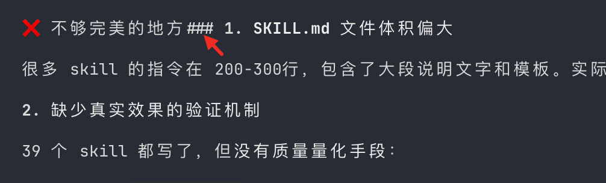

### BUG-2026-07-15-001: TUI 启动后吞掉上方约 30 行空白

- 状态：FIXED
- 模块：TUI/Terminal scrollback
- 发现日期：2026-07-15
- 影响范围：真实 macOS Terminal 中从普通 shell 启动非 alt-screen TUI 的首屏布局，以及用户对启动前终端内容和预留空白的保留预期。
- 用户现象：在 shell 中先产生多行命令记录，并在当前提示符上方预留约 30 行空白；启动 Go Claude TUI 后，这些空白会被吞掉，TUI welcome、输入框和状态栏向上占用原有终端区域。
- 截图证据：启动前，shell 提示符位于预留空白下方；启动后，原有命令记录被推至屏幕顶部，预留的约 30 行空白不再保留，TUI 紧接历史命令开始绘制。
- 期望行为：启动 TUI 不应吞掉用户在当前提示符上方预留的终端空白；退出或运行过程中也不应无意覆盖、压缩或重排启动前的 terminal scrollback。
- 根因证据：提交 `fc287ca2` 为避免按默认尺寸绘制 stale welcome 首帧，引入了 `WaitForInitialWindowSize`、`suppressInitialWindowView` 和 `tea.Sequence(tea.ClearScreen, initialWindowPaintCmd())`。Bubble Tea 1.3.10 将 `tea.ClearScreen` 实现为 `ansi.EraseEntireScreen` 加 `ansi.CursorHomePosition`，真实 PTY 抓包确认启动时输出 `ESC[2J ESC[H`，因此整个当前可见屏幕而非仅 TUI 自有区域被清除。约 30 行并非常量，而是当时可见屏幕中的预留空白。
- 修复约束：保留终端原生 scrollback、选择和复制能力，不得通过默认启用 alt-screen 或 mouse tracking 规避；不得回归 welcome header、输入区、状态栏、消息发送后的对话页及既有自然 scrollback 行为。
- 修复方案：保留 `WaitForInitialWindowSize`，使尺寸未知时 `View()` 继续返回空内容；收到首个真实 `WindowSizeMsg` 后直接按真实宽高渲染唯一 welcome。删除 `tea.ClearScreen`、`initialWindowPaintMsg` 和 `suppressInitialWindowView` 中转状态，不再触碰 TUI 启动前的终端区域。重复 welcome 不会因此复发：首帧仍延迟到真实尺寸后才绘制，而且 `7b041fbe` 已从根因上禁止 silent background update 把 welcome flush 到 scrollback。
- 修复提交：本次修复提交。
- 验证要求：必须在真实 macOS Terminal 中预留可计数的 30 行空白，分别截图记录启动前、启动后和退出后画面；同时执行 `TUI_VISUAL_SOP_FULL=1 scripts/tui-visual-regression-sop.sh`、`go test ./internal/tui -count=1`、`go test ./... -count=1` 和 `git diff --check`。
- 验证结果：`TestModelDefersInitialRenderUntilWindowSize` 先在旧实现上因首个窗口尺寸事件返回清屏命令而失败，修复后通过；`TestModelSilentBackgroundUpdateDoesNotFlushWelcomeHeader` 和 `TestModelVisibleBackgroundUpdateStillFlushes` 通过；真实 PTY 启动流中 `ESC[2J` 计数为 0；`TUI_VISUAL_SOP_FULL=1 scripts/tui-visual-regression-sop.sh` 通过，并人工检查 sub-agent turn 8、final turn 10 的真实 Terminal 截图无重复 header、大空白或底部遮挡；`go test ./... -count=1` 通过。
- 剩余风险 / 后续项：Bubble Tea 标准 renderer 仍负责 TUI 运行期间的受管区域重绘；后续启动渲染改动必须继续禁止 `ESC[2J`/`ESC[3J` 这类全屏擦除，并保留真实 Terminal 首屏验收。

证据截图：

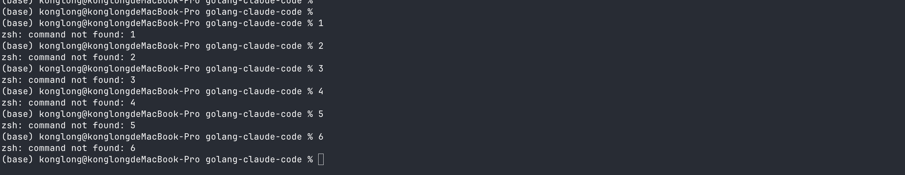

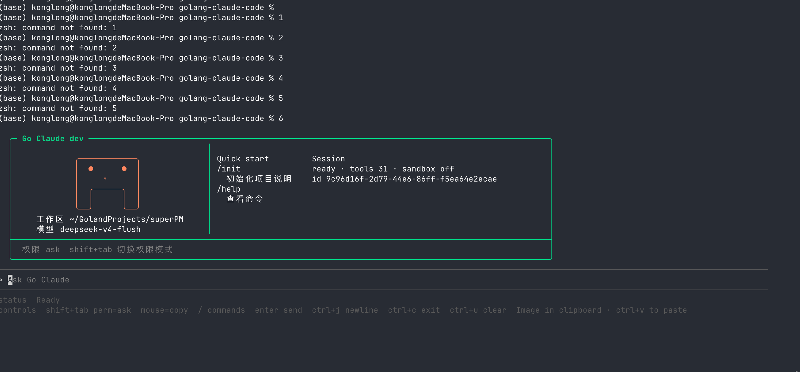

### BUG-2026-07-14-001: TUI 启动显示两个 welcome header

- 状态：FIXED
- 模块：TUI/Welcome rendering
- 发现日期：2026-07-14
- 影响范围：真实 macOS Terminal 中启动 TUI 的首屏；尤其是用户指定的 evaluation 工作区启动命令。
- 复现命令：

```bash
go run ./cmd/golang-cc/main.go --cwd $HOME/GolandProjects/evaluation
```

- 复现现象：
  - 启动后屏幕上可见两个 `Go Claude dev` welcome header，两个 header 的 session id 相同，说明不是创建了两个会话或加载了两份数据。
  - Shift+Tab 切换权限模式时，只有下面的 header 会实时从 `ask` 变为 `allow`；上面的 header 仍保持旧权限状态。
  - 用户发送消息后，下面的 live header 会按当前会话状态退出 welcome 态；上面的 header 仍作为旧内容留在终端 scrollback/可见区域。
  - 预期行为：只保留并显示下面那个 live header，因为它受当前 Bubble Tea renderer 管理，并能随权限模式实时更新；上面的 stale header 不应出现。
- 根因判断（已用 PTY 抓真实字节流 + 终端仿真确认）：
  - 这是渲染所有权问题，不是 session/data 重复问题。
  - 真正触发点在应用层：启动时后台轮询 `backgroundPollMsg` 会收到一条 `__scheduler_events__` 更新（`Silent:true`、日志非空）。`internal/tui/app.go` 的 `backgroundPollMsg` 分支只判断 `len(msg.updates) > 0` 就调用 `prepareTranscriptFlushCmd(...)` 做 transcript flush。
  - 但 `applyBackgroundUpdate` 对 `__scheduler_events__` 和 `Silent` 更新都直接 return、不追加任何可见消息，所以这次 flush 不含任何正文。
  - 这次 flush 是首次 flush（`transcriptPrintedHeader == false`），`pendingTranscriptBlocks()` 会在最前面拼上完整 `transcriptHeaderView()`（`Go Claude dev` 面板），随后 `commitTranscriptFlushCmd` 用 `tea.Println` 把它写进终端 scrollback——这就是上面那份 stale header。
  - 与此同时没有真实消息进来，live viewport 仍处于 idle welcome 态（`shouldShowIdleWelcomeLive()` 保持 true），继续渲染同一个 header——这是下面那份 live header。
  - Bubble Tea 非 alt-screen renderer（`tea.Println` 走 `queuedMessageLines`+`repaint`；`tea.ClearScreen` 无法清除 scrollback）只是投递媒介，不是缺陷本身。这也解释了为何 fc287ca2 的 suppress+ClearScreen 无效：它只管首帧顺序，管不到首帧之后由后台轮询触发的 `tea.Println`。
- 已排除方向：
  - 不是 mascot 绘制导致。
  - 不是 session id 或 welcome 数据生成了两份。
  - 不能用 `tea.WithAltScreen()` 作为修复；它虽然能让启动截图只显示一个 header，但会破坏现有非 alt-screen TUI 流程、scrollback/copy 预期和发送消息后的对话页面。
  - 不能简单把 welcome 静态打印到 Bubble Tea 外层；已有实验显示会与 renderer 首帧/后续 frame 交错，产生更多 header 或破坏 managed frame 行为。
- 修复约束：
  - 保留非 alt-screen 模式。
  - 保留下面的 live header，确保 Shift+Tab 权限切换能实时更新该 header。
  - 从根上阻止上面的 stale header 进入 scrollback，而不是事后清屏或隐藏。
  - 修复必须用用户指定命令做真实 macOS Terminal 截图验收，不能只依赖 unit test、expect PTY 计数或 `Model.View()` 字符串。
  - 发送消息后必须仍显示正常对话页面，不能回归 `TUI 流程被破坏` 或 `对话页面没了`。
- 验证要求：
  - 真实命令截图：`go run ./cmd/golang-cc/main.go --cwd $HOME/GolandProjects/evaluation`，启动后只能看到一个 welcome header。
  - Shift+Tab 验证：唯一可见 header 的权限条和底部 controls 同步更新。
  - 发送消息验证：发送后对话页面存在，welcome 不重复，用户消息/assistant 回复/usage/input chrome 均正常。
  - 回归命令至少包括 `go test ./internal/tui -count=1`、`TUI_VISUAL_SOP_FULL=1 scripts/tui-visual-regression-sop.sh`、`go test ./... -count=1`、`git diff --check`。
- 修复方案：`internal/tui/app.go`
  - `applyBackgroundUpdate` 改为返回 `bool`，表示本次更新是否追加了可见 transcript 消息（`__scheduler_events__` 与 `Silent` 更新返回 `false`）。
  - `backgroundPollMsg` 分支只有在至少一条更新真正追加了可见消息时才调用 `prepareTranscriptFlushCmd`；否则只 `scheduleBackgroundPoll()`，不 flush，从根上阻止 header 进入 scrollback。
  - 保留非 alt-screen 模式和 live header 的 Shift+Tab 实时刷新，未动首帧 suppress/ClearScreen 逻辑。
- 验证结果：
  - PTY 抓真实字节流 + `pyte` 终端仿真（46 行）：修复前可见 2 个 `Go Claude dev`，修复后字节流与可见画面均为 1 个。
  - 新增单测 `TestModelSilentBackgroundUpdateDoesNotFlushWelcomeHeader`（silent 更新不 flush、live 单 header）与 `TestModelVisibleBackgroundUpdateStillFlushes`（真实更新仍 flush，防过度抑制）。
  - `go test ./internal/tui -count=1`、`go test ./... -count=1` 全绿；`git diff --check` 无告警。
  - 说明：本环境无法做人眼截图，采用等价的真实 PTY 字节流回放 + 终端仿真验证；建议合并前在真实 macOS Terminal 用复现命令再肉眼确认一次。
- 剩余风险 / 后续项：该问题已经多次尝试修复失败，后续必须先形成可证明的渲染状态机方案，再落地代码；不应继续用清屏、alt-screen、静态打印等局部手段试错。

### BUG-2026-07-04-001: TUI 新会话显示历史已完成 todos

- 状态：NEEDS_TRIAGE
- 模块：TUI/Todo persistence
- 发现日期：2026-07-04
- 启动命令：`go run cmd/golang-cc/* --cwd $HOME/GolandProjects/skills`
- 用户现象：开启新会话后，用户什么都没输入，底部就显示 `Tasks 6/6 all completed ✓ ctrl+y expand`；展开后能看到“读取新SQL文件和所有需要修改的现有文件”等 6 条任务。
- 定性：不是模型自动生成任务，也不是随机脏状态；它来自当前 cwd 的持久化 todo 文件。是否算 bug 需要 triage：当前代码和测试把“按 cwd 恢复 todos”当成预期行为，但“新会话默认展示全 completed 的历史任务”会误导用户，以体验缺陷/产品策略问题记录。
- 已确认原因：`$HOME/GolandProjects/skills/.claude/todos.json` 存在 6 条任务，内容和截图完全一致，且状态全部为 `completed`。
- 代码证据：`internal/tui/app.go` 的 `loadTodosFromDisk()` 会读取 `welcome.CWD/.claude/todos.json` 并调用 `updateTodosFromJSON`；`internal/tui/app_test.go` 的 `TestModelLoadsTodosFromWelcomeCWD` 明确覆盖了新建 model 时从 welcome cwd 加载 todos。
- 影响范围：任何带有历史 `.claude/todos.json` 的 cwd，新 TUI 会话启动时都可能展示旧任务；如果旧任务全完成，底部仍显示完成态 summary，用户可能误以为当前会话自动执行过任务。
- 修复方案：待设计。候选方向包括：全 completed 的历史 todos 在新会话默认隐藏；仅有 in-progress/pending 时才显示面板；给恢复的 todos 加“上次会话/历史任务”标识；或在新会话启动时提供清理/归档入口。
- 修复提交：待确认后修复。
- 验证命令：待修复后补充，至少覆盖 `go test ./internal/tui -run 'TestModelLoadsTodosFromWelcomeCWD|TodoPanel' -count=1`、真实 TUI 新会话截图验证、`go test ./... -count=1`、`git diff --check`。
- 验证结果：本轮仅归档证据和根因，未修改实现。
- 剩余风险 / 后续项：需要保留恢复 in-progress/pending 任务的价值，不应简单删除 todo persistence；重点是避免全 completed 历史任务在新会话中造成误导。

证据截图：

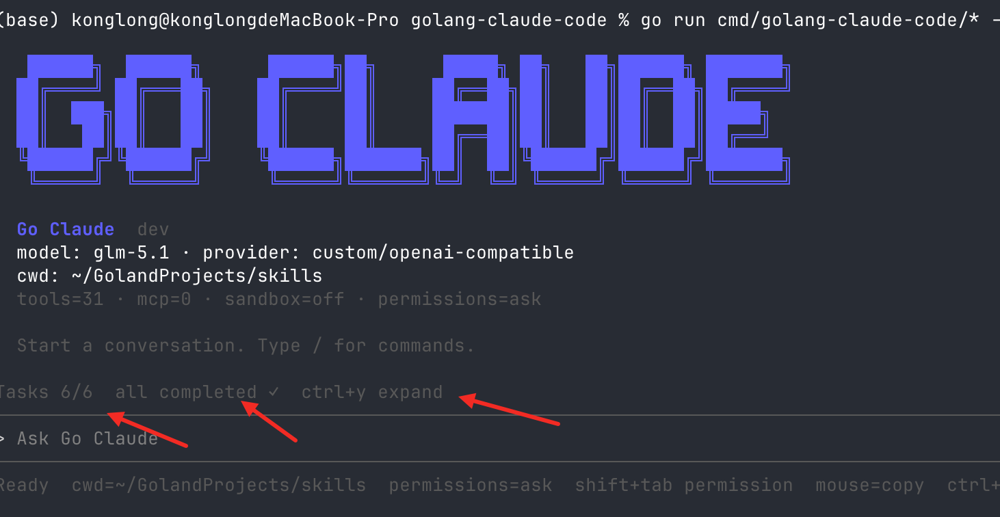


### BUG-2026-07-03-003: go-claude 回复风格偏啰嗦的优化调研

- 状态：NEEDS_TRIAGE
- 优先级：P3
- 类型：优化/调研，不按已确认 bug 处理
- 模块：Prompt/Generation style parity
- 发现日期：2026-07-03
- 影响范围：同模型、同 cwd、同提示词命令的 go-claude 与 Claude Code 行为对比；主要影响用户对回复简洁度、干练程度和原版体感一致性的判断。
- 用户观察：go-claude 的回复比 Claude Code 更长，且有一点小啰嗦；Claude Code 相对更干练。用户怀疑可能是 temperature 或其它采样参数偏高，但需要实验和调研。
- 初步技术判断：当前 `internal/anthropic/types.go` 的 `MessagesRequest` 没有 `temperature`、`top_p`、`top_k` 字段；`internal/anthropic/client.go` 的 OpenAI-compatible 请求构造当前只显式设置 `model`、`max_completion_tokens`、`messages` 和 stream usage 等字段，没有显式设置 temperature/top-p/top-k。因此本轮不能直接下结论说 go-claude “设置了更高 temperature”，更准确的假设是：go-claude 可能依赖 provider 默认采样参数，同时还受到 prompt/system/context/tool surface、message layout、recap/runtime status 注入和 max output budget 等因素影响。
- 已知相关事实：code mode 默认 `max_tokens` 已有对齐到 `32000` 的代码与测试迹象，但当前工作区存在未提交改动，后续实验需要在干净基线下重新验证。
- 复现现象：截图中同类提问下，go-claude 给出分段说明、建议和进一步询问；Claude Code 更倾向于表格化/简短列举。后续关于“温度/参数是多少”的问答中，Claude Code 表示无法查看具体采样参数，而 go-claude 通过代码搜索给出当前项目未显式设置 temperature/top_p/top_k 的分析。
- 根因证据：待实验；当前仅有人工截图和代码级初步排查，不足以归因到单一参数。
- 实验方案：
  1. 在干净工作区中固定同一 cwd、同一模型、同一提示词、同一工具暴露范围，分别采集 go-claude 与 Claude Code 的 request dump。
  2. 对比 request 中是否存在 `temperature`、`top_p`、`top_k`、`max_tokens`、system blocks、message count、tool names/count、runtime status/recap 注入等差异。
  3. 对同一提示词重复运行多次，记录输出字数、段落数、是否主动扩展、是否反问、是否使用表格和平均响应长度。
  4. 如确认 provider 默认采样参数不可控或不同，评估给 go-claude 增加显式低随机性默认值或配置项；如差异主要来自 prompt，则优化 system prompt 的简洁性约束。
- 修复方案：待调研后决定。优先不要只凭体感改 prompt 或强行设置 temperature；先用可复现实验区分采样参数、prompt 注入和模型/provider 默认行为。
- 修复提交：待调研。
- 验证命令：待调研后补充，候选包括 prompt dump compare、同提示词多轮统计脚本、`go test ./internal/anthropic ./internal/query ./internal/promptdump -count=1`、`git diff --check`。
- 验证结果：本轮仅归档证据和初步判断，未修复。
- 剩余风险 / 后续项：不要把非同模型、非同 max_tokens、非同工具集、非同 context 的样本误归因到 temperature；需要把实验变量拆开。

证据截图：

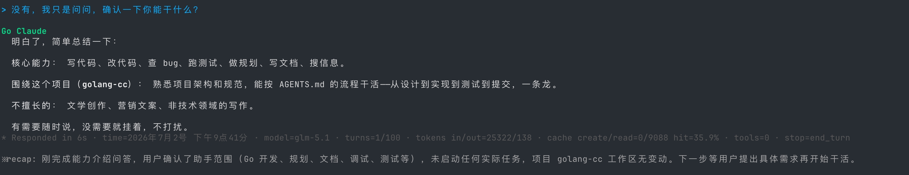

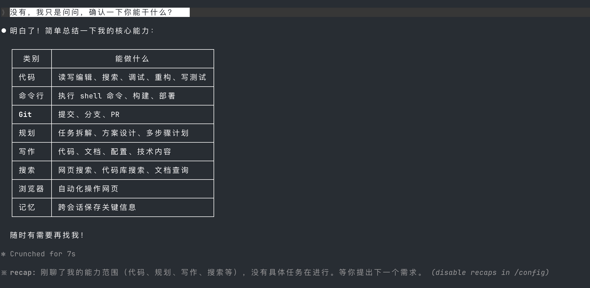

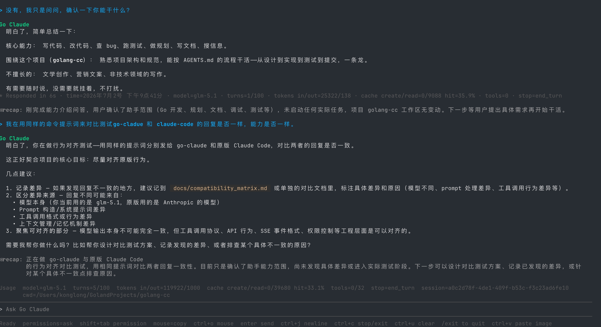

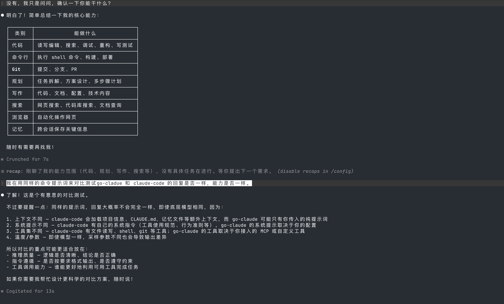

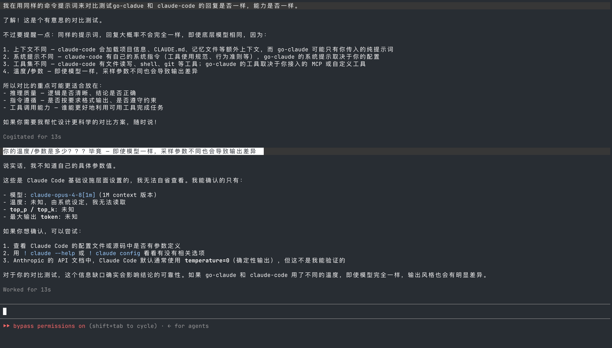

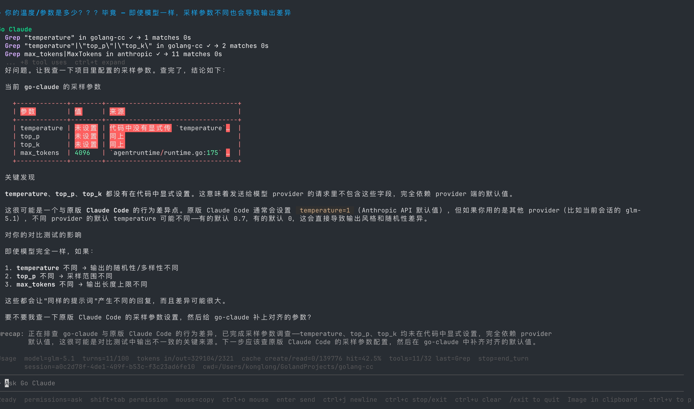

### BUG-2026-07-03-002: claude-mem SessionStart 输出未与 Claude Code 对齐

- 状态：NEEDS_TRIAGE
- 优先级：P3
- 模块：Hooks/TUI/Plugin parity
- 发现日期：2026-07-03
- 影响范围：使用 claude-mem 插件的项目新会话启动体验。用户在同样插件、同样 cwd 下看到 Claude Code 可显示 `SessionStart:startup` 的 claude-mem 状态输出，但 go-claude 未显示同类输出。
- 已知事实：go-claude 代码和 TODO 文档中已有 hook 子系统，包含 `SessionStart` 等 hook 事件；因此本条不是“go-claude 完全没有 hook”，而是需要确认 claude-mem 的 SessionStart startup 输出链路是否被正确执行并展示。
- 复现现象：截图中 Claude Code v2.1.187 新会话显示 `SessionStart:startup says: # claude-mem status`，并展示 claude-mem memory 状态、`/learn-codebase` 提示、live activity URL 等内容；go-claude 在用户观察中没有显示同等信息。
- 根因证据：待排查；当前仅记录跨实现差异，不在本轮修改代码。
- 预期确认点：需要确认 go-claude 是否读取同一 hooks 配置来源、是否执行 `SessionStart`、是否捕获 stdout/stderr、是否把 startup hook 输出渲染到 TUI、以及 claude-mem 是否依赖 Claude Code 特有环境变量或 StructuredIO 行为。
- 修复方案：待 triage。若确认是兼容性缺陷，应补齐 SessionStart startup hook 的执行、输出采集和 TUI 展示；若是插件依赖上游私有协议，应记录兼容边界。
- 修复提交：待确认后修复。
- 验证命令：待修复后补充，至少应覆盖 hooks 配置读取、`SessionStart` 输出捕获、TUI 新会话展示、同 cwd claude-mem smoke、`go test ./internal/hooks ./internal/tui ./internal/cli -count=1`、`git diff --check`。
- 验证结果：本轮仅归档证据，未修复。
- 剩余风险 / 后续项：需要避免为了单个插件硬编码展示逻辑；优先用通用 hook startup 输出机制解决。

证据截图：

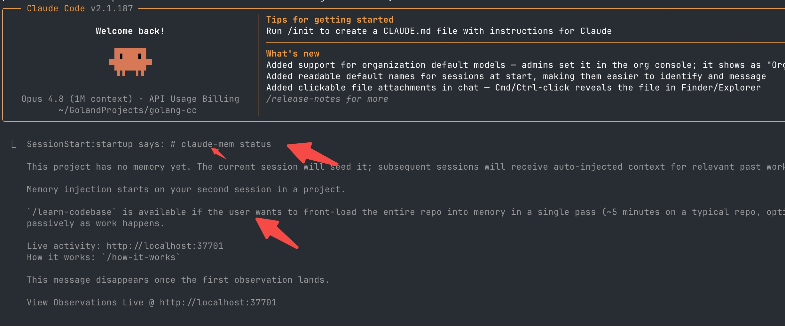

### BUG-2026-07-03-001: TUI Usage 字段冗余且 sessionId 位置不合理

- 状态：OPEN
- 模块：TUI/Usage UI
- 发现日期：2026-07-03
- 影响范围：TUI 模式底部 usage/status 行信息过长，重复展示会话启动时已经出现的 `model` 和 `cwd`，并把 `session` 混在每轮 usage 中，导致页面噪声偏高。
- 当前现象：底部 usage 中可见类似 `model=glm-5.1`、`stop=end_turn`、`session=a0c2d78f-4de1-409f-b53c-f3c23ad6fe10`、`cwd=$HOME/GolandProjects/golang-cc` 的字段；会话顶部已经展示 `model: glm-5.1` 和 `cwd: ~/GolandProjects/golang-cc`。
- 期望行为：把 `sessionId` 移到开启会话时的顶部信息区；从每轮 usage 中移除 `model=glm-5.1`、`stop=end_turn`、`session=...`、`cwd=...` 这类冗余字段，让 TUI 底部 usage 更简洁。
- 根因证据：待排查；当前仅确认可见 UI/信息架构问题，不在本轮修改代码。
- 修复方案：待设计。后续应先梳理 TUI welcome/header、usage panel、turn metadata 的字段来源和显示职责，再决定哪些字段在会话级展示、哪些字段在 turn 级展示。
- 修复提交：待修复。
- 验证命令：待修复后补充，至少应覆盖 TUI usage/header 渲染单元测试、真实终端截图或录屏验证、`go test ./internal/tui -count=1`、`go test ./... -count=1`、`git diff --check`。
- 验证结果：本轮仅归档证据，未修复。
- 剩余风险 / 后续项：需要避免删掉排查所需的关键 turn 信息；`stop` 字段如果对异常停止有价值，应考虑只在非默认 stop reason 或 debug/expanded 模式展示。

证据截图：

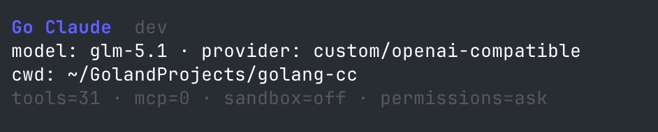

### BUG-2026-07-02-011: TUI 消息耗时展示不一致

- 状态：NEEDS_TRIAGE
- 模块：TUI/Telemetry UI
- 发现日期：2026-07-02
- 影响范围：TUI 对话历史中，不同消息段下方的耗时/metadata 展示不一致，用户无法判断哪些消息应该显示 `Responded in ...`，哪些不应该显示。
- 复现现象：截图中部分 assistant/tool 轮次下方展示 `Responded in 3s` 或 `Responded in 6s`，但上方较长文本段落下方未展示同类耗时信息；用户明确反馈“不确定是否算 bug”。
- 根因证据：待排查；当前仅确认可见 UI 现象，不在本轮修改代码。
- 预期确认点：需要先确认耗时是否只应绑定 assistant turn、是否应覆盖 tool-only turn、recap、恢复历史、streaming 中断/恢复、以及用户消息后的展示规则。
- 修复方案：待 triage。若确认是缺陷，应统一 TUI 消息 metadata 渲染策略，明确哪些消息类型显示耗时、哪些只显示时间戳/模型/tokens，避免同类消息行为不一致。
- 修复提交：待确认后修复。
- 验证命令：待修复后补充，至少应覆盖 TUI message metadata 渲染测试、真实终端截图或录屏验证、`go test ./internal/tui -count=1`、`go test ./... -count=1`、`git diff --check`。
- 验证结果：本轮仅归档证据，未修复。
- 剩余风险 / 后续项：需要避免强行补耗时导致历史恢复、recap、工具输出、失败态或无模型调用消息展示误导性时长。

证据截图：

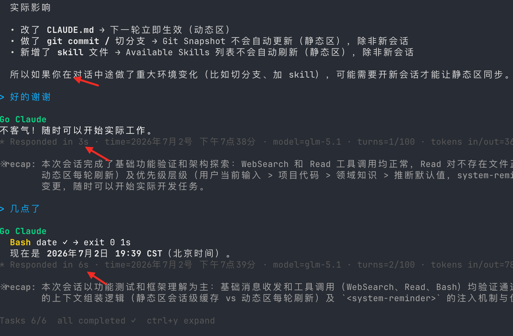

### BUG-2026-07-02-010: TUI Tool 显示缺少外观区分

- 状态：OPEN
- 模块：TUI/Tool rendering
- 发现日期：2026-07-02
- 影响范围：TUI 模式下 tool 执行过程、tool 输出和 AI 普通文本混在同一视觉层级中，用户需要靠内容猜测哪些是工具调用、哪些是模型回复。
- 复现现象：截图中 `Bash date` 的工具行、命令输出和下方响应状态与普通对话文本边界不明显；除 `Bash` 文字颜色外，缺少稳定的背景、边框、缩进、图标、分组或状态样式来区分工具区域。
- 根因证据：待排查；当前仅确认可见 UI 现象，不在本轮修改代码。
- 修复方案：待设计。后续应先梳理 TUI tool activity、completed tool message、assistant message、streaming preview 的渲染路径，再统一定义工具块外观边界。
- 修复提交：待修复。
- 验证命令：待修复后补充，至少应覆盖 TUI 工具渲染单元测试、真实终端截图或录屏验证、`go test ./internal/tui -count=1`、`go test ./... -count=1`、`git diff --check`。
- 验证结果：本轮仅归档证据，未修复。
- 剩余风险 / 后续项：需要避免样式增强破坏终端窄屏、自然 scrollback、复制体验、主题可读性、长命令换行和工具失败态展示。

证据截图：

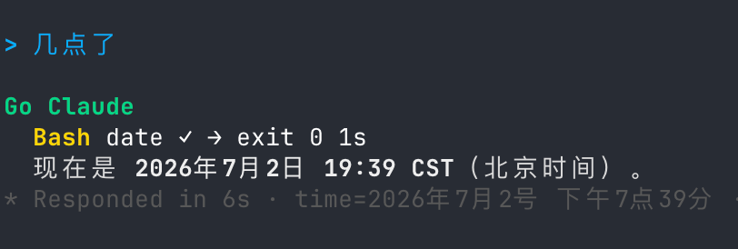

### BUG-2026-07-02-009: TUI Markdown 表格显示不全

- 状态：OPEN
- 模块：TUI/Markdown rendering
- 发现日期：2026-07-02
- 影响范围：TUI 模式下展示 Markdown 表格时，较长单元格内容被截断为省略号，用户无法直接看到完整上下文层级、文件路径、内容摘要等信息。
- 复现现象：截图中“当前上下文”和“位置和来源”表格的多列内容出现 `...` / `…` 截断，例如 context 内容列、文件路径列无法完整阅读。
- 根因证据：待排查；当前仅确认可见 UI 现象，不在本轮修改代码。
- 修复方案：待设计。后续应先定位 TUI Markdown 表格渲染链路、终端宽度计算、CJK 字符宽度、列宽策略和 horizontal overflow/折行策略，再决定修复方式。
- 修复提交：待修复。
- 验证命令：待修复后补充，至少应覆盖 TUI Markdown 表格渲染单元测试、真实终端截图或录屏验证、`go test ./internal/tui -count=1`、`go test ./... -count=1`、`git diff --check`。
- 验证结果：本轮仅归档证据，未修复。
- 剩余风险 / 后续项：需要避免修复表格时破坏普通段落、代码块、列表、中文宽度、终端窄屏和原生 scrollback 行为。

证据截图：

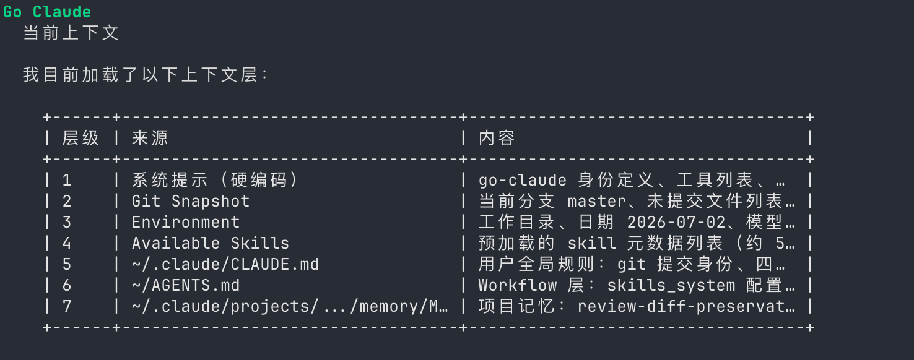

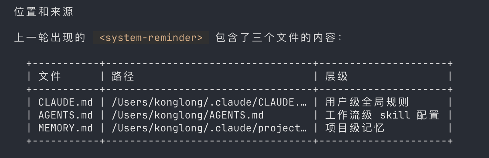

## 新增记录模板

复制以下模板追加到“修复历史索引”下方，或者在 bug 较复杂时新增独立小节并从表格链接过去。

```markdown
### BUG-YYYY-MM-DD-NNN: 标题

- 状态：OPEN / NEEDS_TRIAGE / FIXED / VERIFIED / BLOCKED / WON'T FIX
- 模块：
- 发现日期：
- 影响范围：
- 复现步骤：
- 根因证据：
- 修复方案：
- 修复提交：
- 验证命令：
- 验证结果：
- 剩余风险 / 后续项：
```

## 维护流程

1. 排查阶段先记录复现条件、日志、关键代码路径和影响范围。
2. 修复提交前补充修复方案、验证命令和关联文档。
3. `go test ./... -count=1` 或相关测试通过后，将状态从 `OPEN` 改为 `FIXED`。
4. 全链路、真机或生产前回归通过后，将状态提升为 `VERIFIED`。
5. 如果修复引入新的 TODO，把长期项同步到 `docs/todo.md`，不要只留在 bug 历史里。
