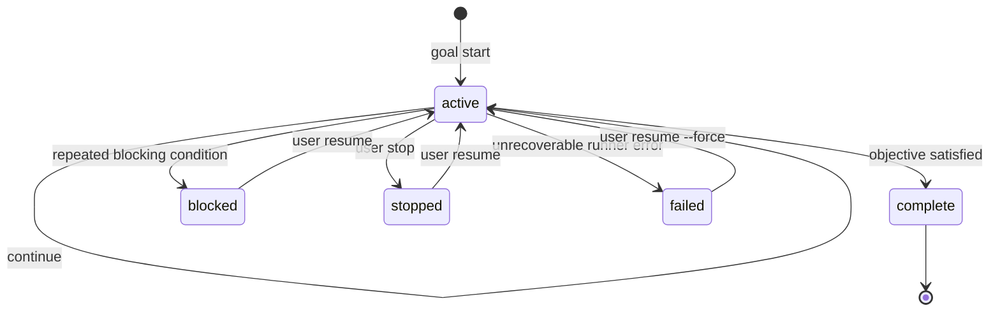

# Goal Mode Design

> 本文档保留 Goal Mode 的基线设计和早期实现边界。后续优化方案、TODO 进度、API/Mobile 扩展和验证证据统一从 [README.md](README.md) 进入。

Goal mode lets Go Claude keep working toward a durable objective across turns,
process restarts, checkpoints, compaction, and background execution. It is not a
simple prompt loop. It is a persisted objective state machine with explicit
progress events, budgets, completion checks, and blocked-state rules.

## Goals

- Support `goal help/start/status/inspect/list/logs/run/stop/resume/unlock` from CLI.
- Support the same Goal command contract from TUI with a leading slash.
- Persist goal state and events locally first, with a clean storage interface for
  later MySQL/API-server support.
- Reuse existing session transcript, checkpoint, compact, background, scheduler,
  observability, and query-loop modules.
- Continue work only while the goal is active and within budget.
- Mark a goal complete only after the requested objective is genuinely satisfied.
- Mark a goal blocked only after the same blocking condition repeats and the
  runner cannot make meaningful progress without user input or external changes.
- Make every important lifecycle event inspectable for debugging and audit.

## Non-Goals

- Do not replace `/loop`. `/loop` remains a recurring scheduler command.
- Do not make the model run forever without budgets or stop conditions.
- Do not hide tool failures. Failed turns must be recorded as goal events.
- Do not put goal state only in memory. Restart/resume must be possible.

## Conceptual Model

```text
Goal = objective + status + session + budgets + policy + event log

GoalRunner:
  load goal
  restore session context
  create checkpoint
  run one agent turn
  record events and usage
  evaluate status
  continue, complete, block, fail, or stop
```

Goal mode sits above the normal query loop. Each runner iteration is still a
regular Go Claude turn, so existing tools, permissions, sandbox, skills,
stream-json, compact, and session recording continue to work.

## State Machine



Statuses:

| Status | Meaning |
| --- | --- |
| `active` | Runner may continue executing turns. |
| `complete` | Objective is achieved and no required work remains. |
| `blocked` | The same blocker repeated enough times that user/external input is required. |
| `stopped` | User manually paused/stopped the goal. |
| `failed` | Runner hit an unrecoverable internal error. |

## Package Layout

```text
internal/goal/
  goal.go        # domain types, status constants, validation
  store.go       # Store interface and local JSON implementation
  runner.go      # one-turn and continuous execution orchestration
  evaluator.go   # complete/blocked/continue classification
  events.go      # event schema and helpers
  cli.go         # optional command glue if not kept in internal/cli
```

Recommended interfaces:

```go
type Store interface {
    Create(ctx context.Context, input CreateInput) (Goal, error)
    Get(ctx context.Context, id string) (Goal, error)
    List(ctx context.Context, filter ListFilter) ([]Goal, error)
    Update(ctx context.Context, goal Goal) error
    AppendEvent(ctx context.Context, event Event) error
    ListEvents(ctx context.Context, goalID string, limit int) ([]Event, error)
}

type Runner struct {
    Store       Store
    Query       QueryRunner
    Sessions    SessionStore
    Checkpoints CheckpointStore
    Evaluator   Evaluator
    Logger      Logger
}
```

Keep these interfaces narrow so the local file store and future MySQL store can
share the same runner.

## Storage

Local storage should live under the existing Go Claude state root:

```text
~/.golang-cc/goals/
  goals.jsonl
  events/
    goal_<id>.jsonl
```

Goal record:

```json
{
  "id": "goal_01j...",
  "objective": "Implement Goal mode",
  "status": "active",
  "session_id": "session-id",
  "cwd": "/path/to/golang-cc",
  "turn_budget": 20,
  "token_budget": 200000,
  "turns_used": 3,
  "input_tokens": 12000,
  "output_tokens": 1800,
  "last_blocker": "",
  "repeated_blocker_count": 0,
  "created_at": "2026-06-15T00:00:00Z",
  "updated_at": "2026-06-15T00:03:00Z"
}
```

Event record:

```json
{
  "id": "evt_01j...",
  "goal_id": "goal_01j...",
  "type": "turn_finished",
  "message": "implemented store tests",
  "session_id": "session-id",
  "turn": 3,
  "input_tokens": 4000,
  "output_tokens": 600,
  "duration_ms": 42000,
  "created_at": "2026-06-15T00:03:00Z"
}
```

## Runner Loop

One safe iteration:

```text
1. Load goal and verify status is active.
2. Create session checkpoint: goal:<id>:turn:<n>.
3. Build a goal-aware system/user instruction:
   - objective
   - current status
   - budgets
   - recent events
   - completion/blocked rules
4. Execute exactly one query turn.
5. Record usage, tools, output summary, errors, and checkpoint id.
6. Evaluate result as continue/complete/blocked/failed.
7. Persist goal update and event.
8. If running in continuous mode and still active, start next iteration.
```

The runner should support both:

- `RunOnce(ctx, goalID)` for testability, CLI stepping, and controlled loops.
- `RunUntilStop(ctx, goalID)` for long-running goal mode.

## Evaluator

The evaluator should prefer deterministic evidence first and model judgment
second.

Deterministic signals:

- process/test command succeeded or failed
- no pending diff, or diff was committed when commit was required
- required docs/tests were updated
- budget exceeded
- context cancelled
- permission denied

Model-classified result:

```json
{
  "status": "continue",
  "reason": "tests pass but docs are not updated",
  "next_action": "update README and goal docs",
  "blocker_key": "",
  "confidence": 0.82
}
```

Current implementation:

- deterministic evaluator remains the default for CLI and API stability.
- `golang-cc goal run <goal-id> --once --goal-evaluator model` enables the optional model-classified evaluator.
- `POST /tenant/goals/{id}/run?evaluator=model` enables the same optional API evaluator.
- model classification is only used for ambiguous continue results without explicit `GOAL_STATUS`; invalid JSON or classifier errors fall back to deterministic evaluation.

Blocked-state rule:

- A single failure is not blocked.
- A hard permission/account/external dependency may be blocked immediately if no
  local fallback exists.
- Repeated soft blockers should use a threshold, for example 3 consecutive
  iterations with the same `blocker_key`.

## CLI UX

Goal 命令采用“英文语法、中文解释”的展示方式。CLI `goal help`、TUI `/goal help`、slash 候选菜单和全局 `/help` 都从 `internal/goalcmd` 读取 Goal 文案；命令名、参数和别名不做翻译，确保文档示例可以直接复制执行。

```bash
golang-cc goal help
golang-cc goal start "Implement TUI app-level selection and mouse scrolling"
golang-cc goal start "Ship mobile attachments" --turn-budget 30 --token-budget 300000
golang-cc goal run <goal-id> --once
golang-cc goal run <goal-id> --background
golang-cc goal status <goal-id> --json
golang-cc goal inspect <goal-id>
golang-cc goal list
golang-cc goal logs <goal-id>
golang-cc goal stop <goal-id>
golang-cc goal resume <goal-id>
golang-cc goal run <goal-id> --background
```

The authoritative subcommand contract is `start`, `status` (`inspect` alias),
`list` (`ls`), `logs` (`log`), `run`, `stop`, `resume`, `unlock`, and `help`.
`goal start` creates a persisted Goal and independent session in `active` state;
it does not execute a turn. `active` means runnable, not that a worker exists.
Likewise, `goal resume` restores a resumable Goal to `active` but does not restart
execution; the user must invoke `goal run` again.

`goal run --background` queues a `kind=goal` background job and executes
`RunUntilStop` in a child process, so `ps`, `logs`, `attach`, and `kill` provide
the same local observability and stop controls as other background work.
`goal logs <goal-id>` reads Goal lifecycle events, while `logs <background-id>`
reads process output. The IDs belong to different stores and are not interchangeable.
`goal start` creates a session when no active session is supplied.

A bare `goal` or `/goal` keeps the status shortcut when an active Goal exists and
shows beginner help in an empty store. Explicit `goal status` still fails when no
active Goal exists so automation retains a reliable nonzero result.

### Chinese command help impact

- Topology nodes: `RT-ENTRY` and `RT-OUTPUT`; existing paths and causal edges remain accurate.
- Blast radius: `B1_SCENARIO`, limited to Goal command discovery and locally rendered help.
- Runtime cost: no model turn, prompt bytes, token, tool call, gate, persistence, or API protocol change.
- Regression surface: shared Goal contract, CLI help, slash discovery, TUI rendering, and existing Goal lifecycle tests.
- Rollback: revert the localized contract and its consumers; no migration or stored-data cleanup is required.

## TUI UX

Slash commands:

```text
/goal help
/goal start <objective>
/goal run <goal-id> --background
/goal status <goal-id>
/goal inspect <goal-id>
/goal list
/goal logs <goal-id>
/goal stop <goal-id>
/goal resume <goal-id>
/goal run <goal-id> --background
```

Slash input is command syntax, not a natural-language prompt namespace. For
example, `/goal what is this` treats `what` as a subcommand and returns command
recovery guidance; users should ask that question as a normal message instead.

TUI status panel:

```text
Goal active · goal_01j... · turns 3/20 · tokens 42k/200k
Current step: running tests
Last checkpoint: goal:goal_01j:turn:3
```

Ctrl+C behavior:

- First Ctrl+C stops the current response/turn.
- Goal remains active unless the user explicitly runs `/goal stop`.
- Second Ctrl+C exits TUI, preserving persisted goal state.

## API Server Future

After local P0 is stable, expose goal mode through API server:

```http
POST /goals
GET /goals
GET /goals/{id}
GET /goals/{id}/events
POST /goals/{id}/resume
POST /goals/{id}/stop
POST /goals/{id}/run
```

For multi-tenant mode, goals should belong to `(tenant_id, user_id)` and link to
tenant session/message/audit/telemetry records.

## Observability

Log and telemetry events should include:

- `goal_id`
- `session_id`
- `turn_index`
- `status`
- `duration_ms`
- `input_tokens`
- `output_tokens`
- `tool_calls`
- `checkpoint`
- `blocker_key`
- `trace_id`

Important event names:

```text
goal.started
goal.turn.started
goal.turn.finished
goal.checkpoint.created
goal.evaluated
goal.completed
goal.blocked
goal.stopped
goal.failed
goal.resumed
```

## Implementation Plan

### P0: Local Goal Mode

- Add `internal/goal` domain types and local JSONL store.
- Add goal runner with `RunOnce`.
- Add evaluator with deterministic budget/blocker checks.
- Add CLI commands: `goal start/status/list/logs/stop/resume/run --once`.
- Add TUI slash commands for goal start/status/stop/resume.
- Reuse session checkpoints before each turn.
- Record usage and events.
- Add unit tests and golden tests.

### P1: Continuous Background Goal

- Add `RunUntilStop` with status/budget termination.
- Integrate with `internal/background` so goals can survive TUI exit.
- Add `goal run <goal-id> --background`.
- Add TUI goal status panel in the persistent header.
- Add stale-lock auto cleanup and `goal unlock --force`; deeper crash recovery remains future work.

### P2: API Server and Multi-Tenant Goals

- Add MySQL tables and repository implementation.
- Add tenant API CRUD and event streaming.
- Add audit/telemetry records.
- Add mobile/API SSE progress events.

## Test Plan

Unit tests:

- goal status transitions
- local store create/update/list/events
- evaluator complete/continue/blocked/budget behavior
- runner creates checkpoint before turn
- runner records failed turns without losing state

Golden tests:

- CLI `goal start/status/list/logs`
- blocked transition transcript
- complete transition transcript

Integration tests:

- `goal run --once` against a fake query runner
- TUI `/goal` slash command handling
- resume after interrupted runner

Manual full-chain tests:

```bash
go run ./cmd/golang-cc goal start "Create a tiny doc change" --turn-budget 3
go run ./cmd/golang-cc goal status
go run ./cmd/golang-cc goal run <goal-id> --once
go run ./cmd/golang-cc goal logs <goal-id>
go test ./internal/goal ./internal/cli ./internal/tui -count=1
go test ./... -count=1
```

## Rollout Notes

- Keep P0 local-first and file-backed to reduce blast radius.
- Do not couple the first implementation to MySQL or API server.
- Prefer `RunOnce` tests over long-running loops.
- Put all long-running behavior behind explicit CLI/TUI commands.
- Preserve existing session, checkpoint, compact, and Ctrl+C behavior.
