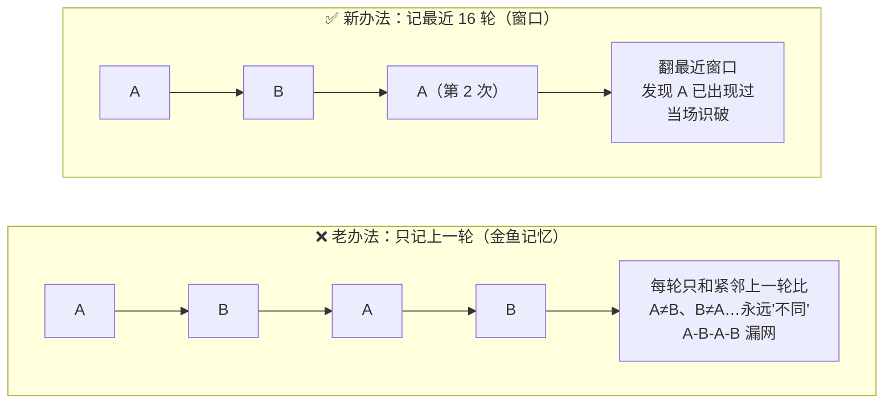
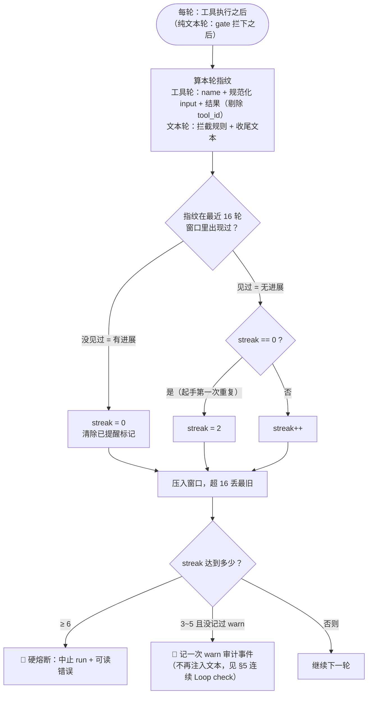
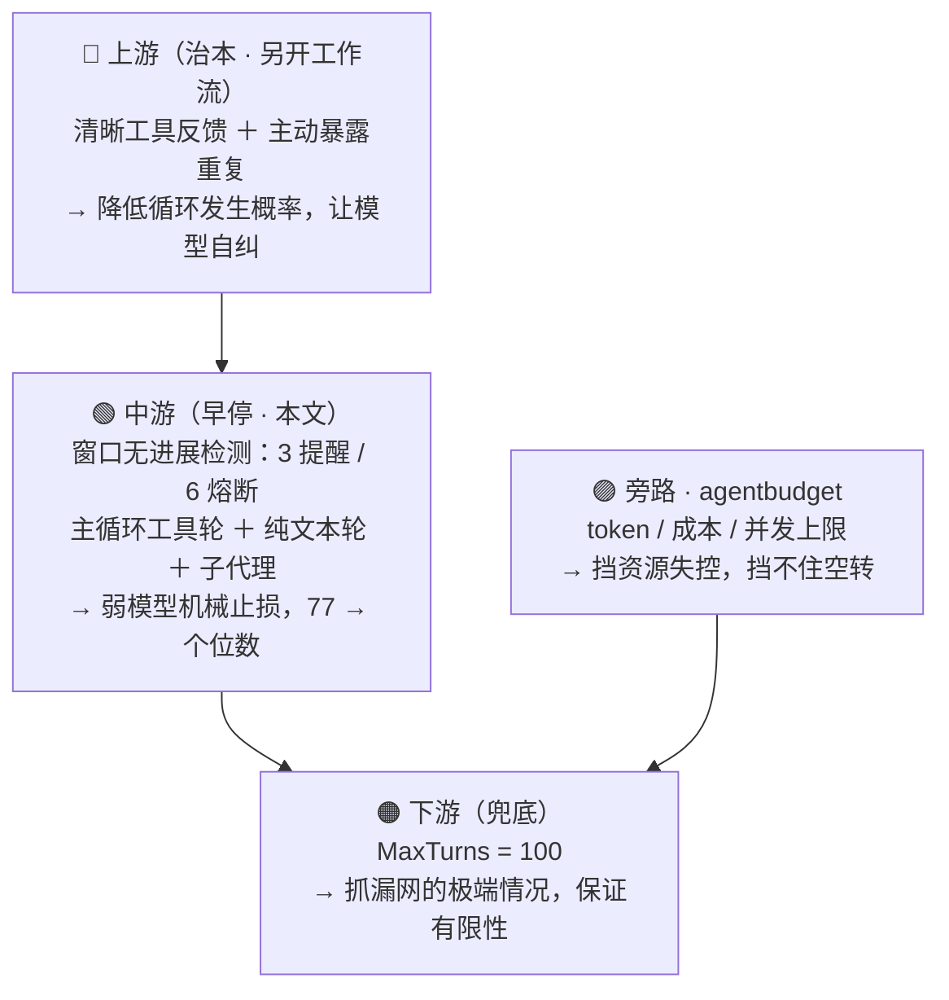

# 循环熔断（Loop Guard）机制说明

本文解释循环熔断是**怎么判断"死循环"并早停的**。相关缺陷背景见 [docs/bugs/README.md 的 BUG-2026-07-23-001](bugs/README.md)。

代码位置：机制本体在 **`internal/loopguard`**（`Tracker` + `CallSignature` / `TurnFingerprint` / `TextFingerprint` / `Describe` / `Awareness`），有**三个**接入点：

| 接入点 | 位置 | 抓什么 |
|---|---|---|
| 主循环·工具轮 | `internal/query/query.go` `Session.run`，工具执行之后 | 重复的工具调用 + 相同结果 |
| 主循环·纯文本轮 | 同上，`len(toolUses) == 0` 且 completion gate 拦下的分支 | 反复输出同一份不合规收尾文本 |
| 子代理 | `internal/agentruntime/runtime.go` `Runtime.Run`，工具执行之后 | 同工具轮，独立 `Tracker`（每个子代理 run 一个） |

三处共用同一套窗口(16)/软限(3)/硬限(6)与同一份升级文案，所以行为可以互相类推。

---

## 1. 为什么需要它

主循环 `for turn := 1; turn <= MaxTurns` 只在两种情况退出：某轮不再发工具调用，或撞到 `MaxTurns=100`。但弱模型（实测 deepseek-v4-flash）会**退化成逐轮重复同一个调用**——实测一次读取静态文件重复了 77 次仍在继续。`MaxTurns` 只能**限制损失的上限**（跑满 100 轮才停），不能**提前止损**。循环熔断就是这道"早停"，它 provider 中立，对弱模型尤其重要（强模型能自己看历史纠正，弱模型不能）。

`internal/agentbudget` 的 token/成本上限**不能替代它**：一个不消耗多少 token 的纯文本空转照样跑满轮次。两者互补——预算管"花掉多少"，熔断管"有没有进展"。

## 2. 核心思想：判"有没有新信息进来"，不判"是什么循环规律"

一句话：**连续多轮都没有产生"新信息"，就判定为卡住。**

这里刻意**不去识别"是 A-B-A-B 还是 A-B-C-D 的规律"**——那样是打地鼠，规律有无穷种。我们只问一个问题：

> 这一轮做的事，最近见过吗？见过 = 没进展；没见过 = 有进展。

## 3. "窗口"到底是什么

### 3.1 窗口里一格 = 一"轮"的指纹（不是一次工具调用）

窗口里存的每一格，是**一整轮**的指纹字符串：

```
一格 = [本轮所有工具调用: name + 规范化 input, 按顺序]
     ＋ [它们对应的所有结果: 输出内容 + 是否报错, 按顺序]
```

- 常见情况下一轮只发一个工具（如一次 `Read`），此时一格 ≈ "一次输入 + 一次调用 + 一次结果"。
- 但如果模型一轮里**并行发多个工具**，这**整批**调用与结果打包成**一格**。所以准确说：**一格 = 一整轮的批次，不是单次调用。**
- **纯文本轮**（没有工具调用、被 completion gate 拦下）也占**一格**，指纹是 `TextFingerprint(拦下它的规则, 收尾文本)`。它和工具轮共用同一个窗口，因为"有没有新信息进来"是同一个问题；把拦截规则拍进指纹，是为了让"同一段文本被换了另一个理由拦下"算成新情况而不是重复。

指纹里有两个关键的"拍进/不拍进"：

- **不拍进 `tool_id`**：每次调用的 id（如 `call_3eaf…`）每轮都不同，是无意义的关联编号。若把它算进指纹，每格都"独一无二"、永远认不出重复，熔断永远不触发（等于白做）。
- **拍进"结果"**：同一个调用反复发，但**每次结果不同**（如轮询时输出在增长）= 在拿新信息 = 有进展。把结果算进指纹，才能让**合法轮询/等待不被误杀**。

### 3.2 窗口 = 最近 N 轮指纹的滚动列表

用一个字符串切片保存**最近 `loopguard.Window=16` 轮**的指纹。每轮：把当前指纹压进去，超过 16 个就丢掉最旧的。

```go
// internal/loopguard/loopguard.go — Tracker.Observe
t.window = append(t.window, fingerprint)
if len(t.window) > Window {
    t.window = t.window[len(t.window)-Window:]
}
```

### 3.3 直观比喻：桌上摆 16 张拍立得的门卫

- **老办法（升级前）**：门卫只记得**刚进来的上一个人**。A、A 连着来能认出重复；但 A、B、A、B 交替，他每次只跟紧挨的上一个比，永远发现不了"你俩在轮流刷屏"。
- **新办法（窗口）**：门卫桌上摆着**最近 16 个人的照片**。每来一个新人，翻一遍这叠照片问"这张脸最近见过吗"。A、B、A —— 第二个 A 出现时翻到 `[A,B]` 里已有 A → 当场识破。



## 4. 判据与计数



每轮（工具执行后，或纯文本轮被 gate 拦下后）：

1. 算本轮指纹（工具轮 `TurnFingerprint`，文本轮 `TextFingerprint`）。
2. 翻窗口：这个指纹在最近 16 格里出现过吗？
3. **见过** → `Tracker.streak`（连续无进展计数）累加。
4. **没见过（新指纹）** → 计数**清零**（有进展），并重置"已提醒"标记。

计数用"**首个重复记为 2**"的写法（本次重复 + 它匹配上的那一轮各算一次），目的是让**单调 A,A,A 的熔断轮次与升级前的老实现完全一致**，不产生行为漂移。

```go
// internal/loopguard/loopguard.go — Tracker.Observe
if seen {
    if t.streak == 0 {
        t.streak = 2 // 本次重复 + 它匹配上的那一轮
    } else {
        t.streak++
    }
    t.label = label
} else {
    t.reset() // streak/label/warned 一起清零
}
```

指纹为空串时也走 `reset()`：那表示"看不出这一轮做了什么"，按有进展放行，不去冤枉模型。

## 5. 两级信号：连续升级的 Loop check + 硬熔断

- **Loop check（连续、随 streak 升级，取代原一次性提醒）**：一旦连续无进展的 streak 达到 **2**（比旧的一次性提醒早一轮），runtime-status 里就会带上一节 `## Loop check`（由 `loopguard.Awareness(streak, call)` 渲染，`call` 是 `loopguard.Describe` 生成的、被重复的那次工具调用的可读标签；纯文本轮的 `call` 是"被 completion gate 拦下的那段收尾文本"）。这节文本**每一轮都会用当轮最新的 streak 重新渲染**，随熔断临近逐级加重语气：
  - **streak == 2**：轻提示——"你刚重复了同一个动作并得到相同结果，确认是否有必要，没必要就换一个动作"。
  - **streak 3~4**：警告——"已经重复 N 次、没有新信息进来，用已有信息推进任务，或换一个真正不同的动作"。
  - **streak ≥ 5**（下一次重复就会撞上硬熔断）：最后警告——"再重复一次就会中止本轮，现在就改变做法或用已有信息收尾"。

  主循环里它和其余 runtime-status 段一样只在 **code 模式**下注入（`PromptMode`/`GOLANG_CLAUDE_CODE_PROMPT_MODE` 为 code；这也是默认值），并且**只包在 `runtimeStatusText` 既有的那一层 `<system-reminder>` 里**（自己不再单独包一层），**只进当轮实时请求，不持久化**到 transcript——下一轮的请求会用当时最新的 streak/call 重新算一份，旧的一份不会遗留在历史里。子代理侧同理，走 `subagentRuntimeStatusText` 那一层 reminder（子代理没有 prompt mode 之分，恒注入）。
  - 旧实现：streak 首次达到软限(3) 时**一次性**注入一条固定文案的 `<system-reminder>`（`loopGuardReminder`），此后同一个 streak 期间不再更新、也不再重复注入。**该函数已删除**，被上面这个持续、分级的信号完全取代。
- **硬熔断 @ 连续 6 轮无进展**（`loopguard.HardLimit`）：
  - 主循环：中止本轮 run，返回可读错误，置 `StopReason=loop_guard_abort`，并记一条 `severity=abort` 的 `loop_guard` closure 事件供审计。纯文本轮的错误文案是"the same blocked final answer kept recurring"，工具轮是"the same tool calls and results kept recurring"。
  - 子代理：任务落 `StatusFailed`，返回 `sub-agent loop guard: no progress for N turns …`，`EventFailed` 的 payload 带 `reason=loop_guard`，并记一条 `agent.loop_guard_abort` 结构化日志。
- streak 达到软限(3) 时记一次审计信号（主循环是 `severity=warn` 的 `loop_guard` closure 事件，子代理是 `agent.loop_guard_warn` 日志）。它只是**一次性审计日志**（供事后排查用），不驱动任何文本注入；文本注入已完全交给上面从 streak 2 起连续渲染的 Loop check 负责。`Tracker.TakeWarning()` 保证"每一段无进展区间只报一次"，区间被新指纹打断后可以再报。

## 6. 走几个例子（含乱序）

窗口足够大时，下面短序列不会有照片掉出窗口。字母表示不同的"轮指纹"。

**单调 A,A,A,…** → 第 6 轮熔断

| 轮 | 见过? | 计数 |
|---|---|---|
| 1 A | 新 | 0 |
| 2 A | 见过 | 2 |
| 3 A | 见过 | 3 → 提醒 |
| 4/5 A | 见过 | 4 / 5 |
| 6 A | 见过 | 6 → **熔断** |

**A,B,A,B,…** → 第 7 轮熔断（1、2 是新面孔，从第 3 轮起连续见过）

**A,B,C,D,A,B,C,D,…** → 第 9 轮熔断（前 4 轮是新，从第 5 轮起连续见过）

**乱序 A,B,B,A,A,B,A** → 第 7 轮熔断——**关键：乱不乱序不重要**

| 轮 | 指纹 | 见过? | 计数 |
|---|---|---|---|
| 1 | A | 新 | 0 |
| 2 | B | 新 | 0 |
| 3 | B | 见过 | 2 |
| 4 | A | 见过 | 3 → 提醒 |
| 5 | A | 见过 | 4 |
| 6 | B | 见过 | 5 |
| 7 | A | 见过 | 6 → **熔断** |

头两轮 A、B 是新面孔把计数压在 0；但从第 3 轮起，模型翻来覆去只有 A、B 两张脸、没再出新的，"见过"连续成立，计数一路爬到 6。**ABBA、AABB、ABBABAB… 全一样：只要不再冒出新指纹，迟早连续够 6 次。**

**合法轮询（结果每轮在变）** → 永不熔断。因为每轮结果不同 → 指纹都是"新" → 计数永远 0。这正是同一个 `TaskOutput` / CI 状态轮询 / tail 日志不被误杀的原因。

**纯文本轮的反方向同理**：模型被 completion gate 拦下后**每次换一份不同的收尾文本**再试，指纹都是新的 → 计数 0 → 不熔断，它可以一直改到合规。只有"一字不改地重复同一份被拦文本"才会累计。

## 7. 什么能"打断"计数？——冒出一个真正的新指纹（= 有进展）

唯一让计数清零的，是某轮出现**窗口里没见过的新指纹**。这是有意设计：只要模型每隔几轮真往上下文里带进**新信息**，就认为它多少在往前走，不当死循环处理（否则容易误杀慢节奏的正经活）。**熔断只针对"持续不出新信息"。**

## 8. 已知边界与取舍（诚实说清）

熔断只覆盖"**连续** 6 轮无进展"，以下情况**它抓不住**，靠最外层 `MaxTurns=100` 兜底：

1. **输出带噪声的死循环**：结果里含时间戳、变化 id、耗时等，每轮指纹微异 → 判不出重复。
2. **周期 > 窗口（16）的超长循环**：等同款再次出现时，最早那张照片已滚出窗口。
3. **"每隔几轮掺个新指纹"来规避**：如 `A,B,A,B,新,A,B,A,B,新,…`，计数爬到 4~5 就被新指纹清零，够不到 6。这属"间歇性有新信息"，按设计当作有进展放行。

残余的**假阳性**：输出稳定的停滞等待（如 CI 长时间返回一模一样的 `in_progress`）仍会在第 6 次熔断——但返回的是可读错误，用户一句"继续等"即可恢复，非灾难。

## 9. 纵深防御分层

熔断是中间一层，不是唯一防线：

| 层 | 手段 | 作用 |
|---|---|---|
| 上游（治本，另开工作流） | 工具反馈带明确终止信号（避免部分读取的模糊反馈）、主动常态化暴露"你已重复 N 次" | 降低循环发生概率，让模型自己纠正 |
| 中游（早停，本文） | 窗口无进展检测（3 提醒 / 6 熔断），主循环工具轮 + 主循环纯文本轮 + 子代理三处 | 弱模型场景下机械止损，把 77 次砍到个位数 |
| 旁路（资源上限） | `internal/agentbudget` 的 token / 成本 / 并发上限 | 挡资源失控；**挡不住空转**，与熔断互补 |
| 下游（兜底） | `MaxTurns=100` | 抓上游/中游都漏掉的极端情况，保证有限性 |



## 10. 可调旋钮

均为 `internal/loopguard` 的导出常量（三个接入点共用），觉得太激进/太迟钝时优先调它们，而不是切换实现：

| 常量 | 默认 | 含义 |
|---|---|---|
| `loopguard.Window` | 16 | 记忆多少轮；决定能早停的最大循环周期（周期 ≤ 窗口） |
| `loopguard.SoftLimit` | 3 | 连续无进展多少轮时记一次审计事件 |
| `loopguard.HardLimit` | 6 | 连续无进展多少轮时硬熔断 |

## 11. 测试

**`internal/loopguard/loopguard_test.go`** —— 机制本体（不经过任何 run 循环，直接钉住 §6 的熔断轮次表）：

- `TestTrackerTripsOnDocumentedTurns` —— A / A-B / A-B-C-D 三种周期分别在第 6 / 7 / 9 轮熔断。
- `TestTrackerTripsOnOutOfOrderRepeats` —— 乱序 A,B,B,A,A,B,A 第 7 轮熔断。
- `TestTrackerNeverTripsWhenEveryTurnIsNew` / `TestTrackerForgetsPeriodsLongerThanWindow` —— 两条反方向守卫（每轮都新 → 永不熔断；周期 17 > 窗口 → 按设计放行给 MaxTurns）。
- `TestTrackerResetsStreakAndWarningOnProgress` / `TestTrackerTreatsEmptyFingerprintAsProgress` —— 清零语义与 `TakeWarning` 的一次性。
- `TestCallSignatureIgnoresToolIDButKeepsKeyOrderStable` / `TestTurnFingerprintIncludesResults` —— 钉住两条关键取舍（剔 tool_id、纳入结果）。
- `TestDescribeNamesToolsWithoutIDs` / `TestAwarenessTiers` —— 标签与三档升级文案。

**`internal/query/query_test.go`** —— 主循环接入：

- `TestLoopGuardAbortsPersistentIdenticalToolCall` —— 单调 A,A,A，第 6 次熔断。
- `TestLoopGuardNudgeLetsModelRecover` —— streak 达到 2 时第 3 轮请求带上 Loop check，模型当轮即改道，run 正常收尾。
- `TestLoopGuardAbortsAlternatingToolCallLoop` —— A-B-A-B，第 7 次熔断。
- `TestLoopGuardAbortsPeriodFourToolCallLoop` —— A-B-C-D，第 9 次熔断。
- `TestLoopGuardIgnoresPollingWithChangingResults` —— 结果在变的轮询不被熔断。
- `TestLoopGuardBoundsRealWorldSkillReadLoop` —— 复刻真实事故（77 次静态 Read）→ 限制在 6 次。
- `TestLoopGuardAbortsGatedTextOnlyLoop` —— **纯文本轮**：反复输出同一份被 completion gate 拦下的收尾文本，第 6 次熔断，第 3 轮请求已带 Loop check。
- `TestLoopGuardKeepsGatedTextRetriesThatChange` —— 反方向守卫：每次换一份不同的收尾文本再试不被熔断，最终正常收尾。
- `TestCompletionGateNudgeDoesNotAccumulateAcrossTurns` —— 任一轮请求里 completion-gate reminder 与被撤回草稿各至多 1 份，且 role 仍交替。

**`internal/agentruntime/loopguard_test.go`** —— 子代理接入：

- `TestSubagentLoopGuardAbortsIdenticalToolCallLoop` —— 第 6 次熔断（此前只有 `sub-agent max turns reached`），第 3 轮请求已带 Loop check。
- `TestSubagentLoopGuardIgnoresPollingWithChangingResults` —— 反方向守卫。

## 12. completion gate reminder 不再堆积（配套修复）

纯文本轮被 gate 拦下时，旧实现把「模型这一轮的草稿」和「gate 的 `<system-reminder>`」**双双 append 进 `messages` 且从不移除** —— 跑 100 轮就是 100 份重复 reminder 加 100 份被拒草稿压在上下文里。

现在：

- 被拒草稿**回滚出 `messages`**（`messages = messages[:len(messages)-1]`）。它本来就已经从 UI、`result.Response`、transcript 三处撤回，`messages` 是最后一个漏的地方。
- reminder 走 `pendingGateNudge` 变量，**只在下一次请求组装时**由 `withPendingGateNudge` 追加，不进 `messages`；模型改用工具后立即清空。

副作用（都是想要的）：请求里 user/assistant 仍严格交替（否则删掉草稿会留下两条相邻 assistant）；模型看不到自己刚被拒的草稿，因此更可能原样重新生成 —— 这恰好让上面那条纯文本熔断更容易识别出重复。
