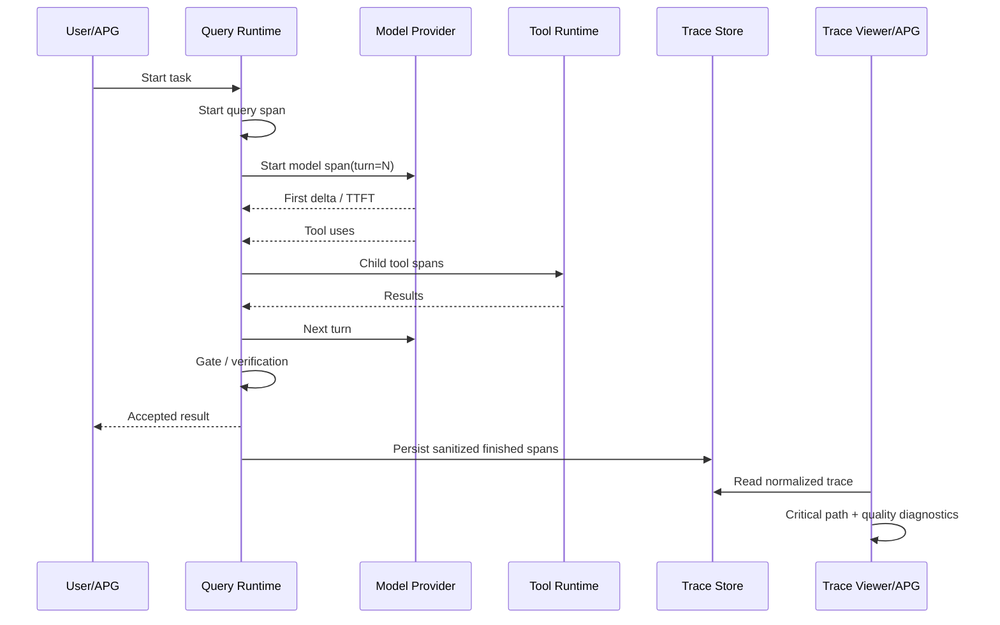

# Agent Runtime 端到端性能与质量可观测技术方案

## 1. 背景与目标

golang-cc 已经具备结构化 telemetry、provider phase 事件、tenant telemetry 持久化、Trace Viewer、
span tree 和 deterministic agent eval。当前缺口不是“完全没有 trace”，而是现有数据还不能稳定回答：

- 一次本地 Coding Agent 任务真正慢在哪一段；
- model turn、tool、hook、compact、gate 和 persistence 之间的真实父子关系；
- 工具总工作量与实际墙钟关键路径分别是多少；
- 哪些耗时来自重复读取、重复失败、无进展 turn 或可并行但被串行执行的只读工具；
- 一次优化是否同时改善成功率、p50/p95、turn、token 和成本；
- APG 如何消费 golang-cc 的内部事实，而不是从进程外猜测。

本方案建设一条统一链路：

```text
runtime 原生 span/event
  -> local transcript / tenant telemetry
  -> normalized runtime-trace-v1
  -> Trace Viewer 单次诊断
  -> APG 多任务、跨版本、跨 Agent 对比
  -> 优化决策与回归门禁
```

第一目标是建立可信 baseline，不在没有证据前直接修改并行度、prompt、gate 或缓存策略。

## 2. 范围与不做范围

### 2.1 范围内

1. 为 telemetry event 增加稳定的 `span_id`、`parent_span_id`、`turn_index` 和 schema version。
2. 为 query、model、tool、hook、compact、completion gate、persistence 建立可关联时间边界。
3. CLI/TUI 本地 session 持久化脱敏后的 finished spans，使 Local Trace 不再只靠 transcript 时间戳估算。
4. 保留 tenant telemetry 现有 MySQL 链路，不新增第二套 tenant trace 表。
5. Trace API 优先使用原生父子关系，旧数据继续使用时间包含关系推断。
6. 计算关键路径、未归因时间、工具工作量、只读并行候选和重复调用等诊断指标。
7. 展示测试、验证、工具错误、恢复、gate、循环、Todo 闭合和用户纠正等原始质量信号。
8. 定义 APG 可消费的 `runtime-trace-v1` JSON artifact。
9. 建立固定任务集的 before/after 对比和回归阈值。

### 2.2 不做范围

- 本期不实施多实例控制面、分布式 collector 或完整 OpenTelemetry SDK 迁移。
- 本期不立即并行执行工具；先产出可信的并行机会数据。
- 本期不引入一个无法解释的单一“质量总分”。
- 不把完整 prompt、聊天正文、工具输出、私有附件 URL 或凭据写进 telemetry artifact。
- 不让 APG import `internal/...` 或依赖 golang-cc 的内部 Go 类型。
- 不把 APG 的跨 Agent 排名逻辑放进 golang-cc。

## 3. 模块与责任边界

| 模块 | 目标 | 主要实体 | 主要动作 | 边界 |
| --- | --- | --- | --- | --- |
| `internal/telemetry` | 统一事件和 span 协议 | Event、Span、SpanContext | start、finish、normalize、sanitize | 不依赖业务包 |
| `internal/query` | 记录主 Agent 关键阶段 | run、turn、model、tool、gate | 建父子 span、记录 turn | 不负责页面统计 |
| `internal/anthropic` | 记录 provider 内部阶段 | HTTP、stream、first event/delta | 输出 phase span | 不持久化 session |
| `internal/session` | 保存本地 finished span | runtime_span entry | 追加、读取、兼容旧 transcript | 只保存脱敏 metadata |
| `internal/server` | 归一化、诊断和展示 | detail、summary、diagnostics | tree、critical path、API、WebUI | 不承担跨任务评分 |
| `internal/agenteval` | 仓内确定性回归 | local eval case/report | 验证 runtime 契约 | 不替代 APG |
| APG | 跨任务和跨 Agent 评测 | artifact、dataset、baseline | 调度、评分、A/B、趋势 | 不推断内部阶段 |

本需求不是传统 B 端/C 端业务，按责任映射为：

| 端 | 场景 | 能力 | 数据范围 |
| --- | --- | --- | --- |
| 运行端 golang-cc | 开发者诊断单次本地任务 | span、瀑布图、证据、瓶颈提示 | 当前 local session 或已授权 tenant session |
| 评测端 APG | 维护者比较版本、模型和 Agent | dataset、baseline、p50/p95、成功率、成本 | 显式导入的脱敏 artifact |

## 4. 当前事实与缺口

| 当前能力 | 已有事实 | 缺口 |
| --- | --- | --- |
| telemetry | Event 已有 trace/session/model/tool/duration/token/properties | 没有原生 span/parent/turn 字段 |
| provider phase | 已记录 request build、HTTP、首字节、首 event/delta、stream read | 父子关系由名称和时间推断 |
| tenant trace | MySQL telemetry 可生成 model/tool/API/sub-agent spans | 同名并发 span 配对可能歧义 |
| local trace | transcript 可配对 tool call/result | model、hook、compact 等真实耗时缺失 |
| Trace Viewer | 已有 Overview、Runtime Spans、Span Tree | 缺关键路径、未归因、浪费和质量诊断 |
| metrics | 事件 count、duration sum、tokens | 没有 p50/p95 和 task-level 对比 |
| APG | 已有独立评分体系设计 | 没有稳定的 runtime artifact 契约 |

## 5. 数据与协议设计

### 5.1 Telemetry Event 增量字段

现有 `telemetry.Event` 增加以下可选字段，全部使用 `omitempty` 保持旧消费者兼容：

| 字段 | 类型 | 说明 |
| --- | --- | --- |
| `schema_version` | string | 首版固定为 `runtime-trace-v1` |
| `span_id` | string | 当前 span 的进程内全局唯一 ID |
| `parent_span_id` | string | 显式父 span；空值才允许 Trace API 推断 |
| `turn_index` | int | 从 1 开始的 model turn；非 turn 事件为 0 |
| `started_at` | time | finished event 携带真实开始时间，避免反推 |

约束：start/finish 必须复用同一 `span_id`；子阶段从 context 继承 parent；
`TraceID` 表示请求/任务链，`SpanID` 表示链内时间区间，两者不能混用。

### 5.2 Span API

```go
func StartSpan(ctx context.Context, event Event) (context.Context, Span)
func SpanIDFromContext(ctx context.Context) string
func (s Span) Finish(status string, err error, attrs map[string]any)
```

`StartSpan` 生成 span ID、继承父 span、发 started event并返回 child context。
`Finish` 发 finished event并携带同一 ID、父 ID、开始时间和 duration。现有 `Start` 保留为兼容包装。

### 5.3 本地 transcript

新增 append-only entry 类型 `runtime_span`，只写 finished span：

```json
{"type":"runtime_span","timestamp":"2026-08-10T10:00:01Z","content":"{...sanitized event...}"}
```

它不进入下一轮模型上下文，不参与 compact summary，不改变 resume 消息图。只保存 finished metadata，
避免 started/finished 双份存储和正文泄漏。崩溃时缺失 finished span，不伪造 duration。

### 5.4 Tenant persistence

tenant 继续复用 `tenant_telemetry_events`。第一阶段将 span identity 放进现有 JSON properties，
无需 migration；验证真实查询价值后，再决定是否为了索引把字段升为表列。

### 5.5 APG artifact: `runtime-trace-v1`

```json
{
  "schema_version": "runtime-trace-v1",
  "run": {
    "run_id": "...",
    "agent": "golang-cc",
    "agent_version": "v0.1.63-go",
    "build_info": {
      "schema_version": "golang-cc.build-info/v1",
      "product": "golang-cc",
      "version": "v0.1.63-go",
      "revision": "6d1556f51ad03e6c52434eca907d08bef6b5a12a",
      "dirty": false,
      "dirty_known": true,
      "build_time": "2026-08-11T03:04:05Z",
      "go_toolchain": "go1.25.0"
    },
    "session_id": "...",
    "status": "completed",
    "started_at": "...",
    "duration_ms": 28400
  },
  "summary": {
    "turns": 3,
    "tool_calls": 8,
    "input_tokens": 18200,
    "output_tokens": 2300,
    "model_wall_ms": 12000,
    "tool_work_ms": 8700,
    "tool_wall_ms": 6300,
    "critical_path_ms": 27100,
    "unattributed_ms": 1300
  },
  "quality": {
    "tests_run": true,
    "tests_passed": true,
    "test_attempts": 2,
    "failed_test_attempts": 1,
    "test_failure_recovered": true,
    "completion_verified": true,
    "final_verification_passed": true,
    "tool_errors": 1,
    "recoveries": 1,
    "gate_blocks": 0
  },
  "diagnostics": [],
  "spans": []
}
```

规则：时间统一 RFC3339 UTC，duration 使用整数毫秒；artifact 默认不含 tool input/output；
新字段只做 additive 变更；`agent_version` 为兼容字段且必须等于 `build_info.version`；APG 仍以外部产物指纹为权威，不能只信任 self-reported Build Identity；导出失败不能改变 Agent 任务结果。一个 artifact
严格对应一次 query run：包含多个 resume/query root 的 session 选择最新 query，并只导出该 query 及其
后代；tenant query 即使挂在 API/mobile transport span 下也按 query root 识别。`completed` 只表示 runtime
正常结束，不等于任务通过测试或满足验收标准。

## 6. 指标口径

| 指标 | 定义 |
| --- | --- |
| `task_wall_ms` | 根 query/run 从开始到 accepted result/error |
| `model_ttft_ms` | model request 开始到首个可见 text/thinking/tool delta |
| `model_wall_ms` | model spans 区间并集，不对并行子 Agent重复求和 |
| `tool_work_ms` | 所有 tool duration 之和，表示总工作量 |
| `tool_wall_ms` | tool spans 时间区间并集，表示实际墙钟 |
| `critical_path_ms` | 根 span 到结束的最长依赖路径 |
| `unattributed_ms` | root duration 减去直接子阶段区间并集 |
| `gate_added_ms` | gate 导致的额外等待和后续 turn |
| `permission_wait_ms` | 权限请求到决定的时间 |

TTFT 必须来自首个真实 delta callback，不能把 message-start 或 HTTP 首字节当作用户可见首 token。

同时记录 input/output/cache tokens、turns、tool/model/compact calls、prompt bytes、gate blocks 和 retries。
真实 `task_success_rate`、`cost_per_successful_task`、`tokens_per_successful_task` 由外部 APG 使用场景 oracle
独立计算，仓内不能用 runtime `completed` 冒充任务成功。

质量第一阶段只报告原始信号：Todo 闭合、测试证据、修改后 readback/diff/status、原始场景验证、
工具错误和恢复、gate block 与 evidence、loop guard、compact/resume 连续性、用户下一轮纠正。

## 7. 诊断算法

### 7.1 Span tree 与关键路径

1. 优先使用显式 `parent_span_id`。
2. 旧事件没有 parent 时才使用 trace ID + 时间包含 + 类型优先级推断。
3. 同一父节点的 child interval 先求并集，再计算 self/unattributed time，禁止直接求和导致负值。
4. 关键路径基于显式父子 DAG 计算；检测到环时丢弃非法 parent 并记录 diagnostic。

### 7.2 并行机会

第一阶段只识别候选，不自动并行。同一 model turn 连续发出的多个工具，只有 registry 明确声明
`read_only` 且无显式输入依赖时才进入候选。理论节省为 `sum(duration) - max(duration)`。
Write/Edit/Bash/Git/permission/Skill/MCP 未声明工具不进入候选。

### 7.3 重复与无进展

- tool fingerprint = tool name + canonicalized safe input hash；artifact 不保存原 input。
- Read fingerprint 额外包含路径、offset、limit、mtime/size（可得时）。
- 文件发生 Write/Edit/Bash file change 后，之前的 Read fingerprint 失效。
- 相同失败 fingerprint 连续出现且没有新 evidence，记录 `repeated_failed_action`。
- 相邻 turn 的工具、evidence、Todo 和文件 delta 均无新增时，记录 `no_progress_turn`。

## 8. 分层技术设计

### 8.1 Model/Constant

- `internal/telemetry` 定义 schema、span 字段和 event name 常量。
- `internal/session` 定义 `EntryTypeRuntimeSpan`，不使用散落字面量。
- trace API 增加 diagnostics、quality 和关键路径 summary 字段，全部 optional。

### 8.2 Storage/Repository

- local recorder 只追加脱敏 finished span。
- tenant 第一阶段继续通过 telemetry recorder 写 MySQL。
- artifact 使用同目录临时文件 + fsync + rename 原子写，权限 `0600`。
- 没有真实查询证据前不增加 migration。

### 8.3 Service/Domain

- `telemetry.StartSpan` 负责 identity 和 context propagation。
- trace normalizer 负责兼容 local/tenant/legacy 数据。
- diagnostics analyzer 只消费 normalized spans/events，不读取原始业务对象。
- artifact exporter 消费 normalized trace response，避免两套统计逻辑分叉。

### 8.4 API/Controller

| 方法 | 路径 | 变化 | 权限 |
| --- | --- | --- | --- |
| GET | `/trace/api/sessions/{id}` | additive summary、quality、diagnostics | 保持现有 local/tenant 鉴权 |
| GET | `/trace/api/sessions/{id}/export?schema=runtime-trace-v1` | 下载脱敏 artifact | 与 detail 相同 |

新增 route 时补 Swagger annotation、coverage test、`docs/api_server.md` 并重新生成 Swagger。

### 8.5 CLI/APG 集成

阶段 3 增加显式 `--runtime-trace-output <path>`，适用于 headless/eval。正常 CLI/TUI 不指定时不写额外 artifact。
APG adapter 负责传入输出路径、运行任务、读取 artifact并独立判断任务是否通过。
CLI artifact 额外记录脱敏的只读工具执行配置：调用方请求值、实际 worker 上限和
`serial|parallel` 模式。APG 必须校验同一侧所有 case 配置一致，并把 before/after 配置写进
benchmark；不能只从目录名或人工命令记录推断实验变量。Trace API 从历史 session 重建 artifact
时无法可靠恢复当时的 CLI 开关，因此该可选字段可以缺失；缺失配置的 artifact 仍可用于单次诊断，
但不能进入严格 APG A/B 决策。

## 9. 核心流程



## 10. 渐进式实施计划

### Phase 0：协议基础（已完成，2026-08-10）

- Event 增加 span identity、parent、turn、schema、started_at。
- 实现 context propagation 和兼容包装。
- Trace API 优先读取显式 parent。
- 测试嵌套、并发、错误、脱敏和旧事件兼容。

已落地 `runtime-trace-v1` 可选字段、`StartSpan` context propagation、MySQL `properties_json`
兼容持久化和 Trace API 显式 parent 优先。当前 query/model/tool/provider 的既有手工事件尚未迁移，
所以真实任务仍以旧推断为主；该迁移属于 Phase 1，不能把 Phase 0 误报为端到端耗时已经可用。

### Phase 1：本地主链路真实 span（已完成，2026-08-10）

- query run -> model turn -> tool 建立显式父子关系。
- provider phase 继承 model span。
- 本地 transcript 保存 finished spans。
- Local Trace 展示真实 model/tool/provider 耗时。

已落地 `runtime_span` append-only transcript entry 和 metadata-only sink。query 是根 span；每轮 model
与 tool 直接继承 query，并携带 `turn_index`；provider phase 继承对应 model。Local Trace 直接使用
native ID、parent、started_at 和 duration，且同一 tool 已有 native span 时不再生成 legacy 推断副本。
`MessagesFromTranscript`、compact/resume 和旧 transcript 保持原语义。sink 不保存 error 正文、prompt、
tool input/output 或 secret；可观测写入失败只记录 telemetry sink error，不改变 Agent 任务结果。
v2 transcript 将 `runtime_span` 作为 side-band metadata，不加入 `parent_id` conversation chain、不推进
active leaf，也不参与 branch leaf 计算。query 根 span额外记录安全的数值型 `input_bytes`，便于分析
输入规模与延迟的关系，不保存 prompt 正文。

Phase 0 review 同步修复了非法 parent/cycle/duplicate ID、schema version 误 hydrate、单个坏 property
清空整包、vendor payload 缺 schema、OTel 时间编码和 Swagger request schema 漂移。Phase 2 之前，
hook、permission、compact、gate 仍不是完整原生 span，Trace 会继续使用既有事件或时间推断。

2026-08-10 Phase 1 验收：deterministic query E2E 生成 6 个 finished spans（query 1、model 2、
tool 1、provider 2）；真实 Gin server + Bearer auth + curl 返回 HTTP 200，唯一 query 根、model/tool
parent、provider->model parent、turn 1/2、正 duration、`input_bytes` 和 legacy tool 去重均通过 jq
断言。`go test -race ./internal/telemetry ./internal/query ./internal/server -count=1`、
`go test ./... -count=1`、`go vet ./...`、`npm --prefix web run test`（141 tests）、`scripts/closure-gate-acceptance.sh`
以及 B4 topology check 全部通过。

### Phase 2：完整阶段和诊断（已完成，2026-08-11）

- hook、permission、compact、gate、persist/renderer 埋点。
- summary 增加 wall/work/critical/unattributed。
- diagnostics 增加重复调用、无进展和只读并行候选。
- Trace Viewer 增加瓶颈摘要和瀑布图。

已补齐 `hook.execution`、`permission.wait`、`context.compact`、`gate.evaluation`、
`session.persistence` 和 `output.renderer` 原生 span。local/tenant Trace 共用同一分析器，输出
work/wall/critical/unattributed/parallel savings、质量信号和四类 diagnostics。Web Trace 与 Local Trace
均展示耗时分解、质量、诊断，既有 Sequence 视图作为统一瀑布图。query E2E 会真实触发 allow/deny
permission prompt 和 automatic compact，验证 finished span、父子关系、状态及脱敏 metadata 落盘。

### Phase 3：质量信号与 APG 接口（已完成，2026-08-11）

- 从 ToolTrace、closure records、Todo 和 tests 提取原始质量信号。
- 实现 `runtime-trace-v1` API/CLI artifact。
- APG adapter、固定数据集、baseline 和 before/after 报告。

仓内已完成 metadata-only `runtime-trace-v1` API/CLI 导出、`runtime-trace-dataset-v1` manifest 和
`scripts/runtime-trace-baseline`。dataset 要求每个 `case_id` 恰好一个 before 和一个 after，重复或缺失
配对会直接失败。baseline 报告 runtime completion rate、结构化 verified rate、task/model/tool p50/p95、
平均 token、turn 和 tool call，并生成 after-minus-before；它不报告 task success rate。独立 APG 已完成
golang-cc adapter artifact/临时 transcript 生命周期、确定性 task oracle、严格 before/after pairing、
成功率与 runtime completion/verified 分离、失败分类和 benchmark CLI。跨 Agent 评分继续由 APG 负责，
golang-cc 不复制 task success 真相。

### Phase 4：证据驱动优化（首项已完成，2026-08-11）

- 先实施只读工具“并行执行、串行提交”。
- 再评估本轮 Read cache、gate 收窄和 prompt/cache 优化。
- 每项优化同时比较成功率、p50/p95、token、turn 和安全不变量。

已实现 opt-in policy 驱动的只读工具并行：只有整轮全部是显式 `read_only` 且权限、skill、hook、
pre-tool gate 均可无副作用预检时才并行，结果、transcript 和下一轮 model context 仍按模型顺序提交。
默认最多 4 workers，可用 `--max-parallel-read-only-tools -1` 回退串行。Read cache、gate 收窄和
prompt/cache 改动必须先由固定 dataset 的 before/after 数据证明价值，当前不作为无证据实现项。

### Phase 5：真实 APG 评测闭环（已完成，2026-08-11）

- 10 个确定性 Go engineering cases，每个 repeat 3，两侧各 30 次，case 间串行运行。
- before 固定 `requested=-1 / effective=1 / mode=serial`；after 固定
  `requested=4 / effective=4 / mode=parallel`，由每份 artifact 结构化证明。
- APG 报告每侧触发至少两个只读工具且整 turn 可并行的 run/turn/tool-call 覆盖率，避免在没有并行
  机会的任务集上误判开关价值。
- decision 以 APG task success 优先；verified 下降判回归，success 相同且 verified 不下降时，只有
  task-wall p95 至少降低 10% 才判 latency improvement，否则为 inconclusive。
- 最终 clean matrix 两侧均为 APG task success 30/30、runtime completion 30/30、verified 24/30；
  serial→parallel 的 task p50 `23352 -> 23753 ms`、task p95 `36854 -> 43286 ms`、model p95
  `35915 -> 42145 ms`、tool p95 `1305 -> 1264 ms`、平均 total tokens
  `125969.63 -> 123549.73`。两侧 30/30 runs 均有并行机会，分别覆盖 54/55 turns 和
  109/111 tool calls。
- 决策为 `inconclusive`：correctness 不退化，但 task p95 回退 17.45%，且 6.432s 增量中
  6.230s 来自 model wall；tool p95 只改善 41ms。保留 bounded feature 和 serial kill switch，
  不宣称端到端加速，不继续提高并行度；下一个性能实验应先控制或直接针对 model/provider 长尾。
- 正式数字只来自最终 `reports/runtime-performance-20260811/baseline.json`；预跑、受负载污染的
  矩阵和缺 configuration 的旧 artifact 均已删除，不作为决策证据。最终保留约 20MiB 可复核证据，
  60/60 traces、0 cleanup warnings、0 runtime transcript directories。

### Phase 6：验证终态修正与 Provider 长尾归因（已完成，2026-08-11）

- `verified 24/30` 的 6 个缺口固定来自 `go-retry-policy` 和 `go-string-normalize` 各 repeat 3，
  serial/parallel 两侧完全一致；6 个 APG task 的 command/file/rule scorer 最终均通过。
- 根因是 runtime trace 旧聚合口径只要任意一次测试失败就永久设置 `tests_passed=false`，即使后续测试
  已成功且记录 `recoveries=1`。新口径保留 `test_attempts`、`failed_test_attempts` 和
  `test_failure_recovered`，同时用最后一个已完成测试结果计算 `tests_passed`，并显式导出
  `final_verification_passed`。baseline/APG 优先消费新字段，旧 artifact 缺字段时回退旧公式。
- 历史 60 份 metadata-only artifact 不含原始 event，不能无损回算新终态，因此旧 baseline 的
  `24/30` 原值保留；这不改变 APG task success `30/30` 的评分真相。新导出由回归测试锁住
  “先失败、修复、最终测试成功”与“最终测试仍失败”两条方向。
- APG benchmark 新增 provider phase count/p50/p95。现有 A/B 重算显示：`stream.read` p95
  `5094 -> 6352ms`（`+1258ms`），TTFB p95 `1499 -> 1574ms`（`+75ms`），connect p95
  `22 -> 42ms`，TLS p95 `58 -> 84ms`，request build 两侧 p95 均为 `0ms`。
- phase span 存在父子重叠，不能相加冒充 model wall；但数量级已足以排除本地 request build、DNS、
  connect 和 TLS 是主要矛盾。当前 p95 波动主要来自 provider 生成/stream read 长尾。
- 决策不变：保留 bounded parallel 和 serial kill switch，不继续提高并行度；在没有新的跨时段、
  同 Build Identity 配对证据前，不修改 timeout、retry、fallback、模型路由或任何 Agent 运行行为。

详细架构、兼容和回滚方案见
[Runtime 验证终态与 Provider 长尾闭环方案](runtime_verification_provider_tail_plan.md)。

## 11. 风险、兼容性与降级

| 风险 | 控制 |
| --- | --- |
| 热路径开销 | span ID 本地生成；不做同步网络；benchmark 和事件数预算 |
| transcript 膨胀 | local 只存 finished metadata；统计每任务新增 bytes |
| span parent 错误 | 显式 context 优先；环检测；旧数据继续推断 |
| 同名并发配对错误 | 使用 span ID，不再以 name/model/tool 拼 key |
| 敏感信息泄漏 | 复用 `SanitizeProperties`；artifact 无 input/output 正文字段 |
| exporter 影响任务 | 结果完成后导出，失败只报诊断 |
| 指标被误读 | work 与 wall 分开；并行节省标记理论上限 |
| 质量分诱导错误优化 | 首期只展示原始信号 |
| 新协议破坏消费者 | additive `configuration` 字段 + schema version + golden fixture；旧 consumer 忽略，严格 A/B 缺失时 fail closed |
| 并行破坏权限或顺序 | 显式 read-only policy、无副作用权限/gate 预检、整轮串行降级、顺序提交、CLI kill switch |

回滚时停止写新增字段/entry，Trace API 自动回退到现有时间推断；旧 transcript、tenant telemetry 和 API
消费者继续工作，不需要数据回滚。

## 12. 拓扑影响与成本假设

```text
Change: 原生 runtime span、local persistence、Trace diagnostics、APG artifact
Topology nodes: RT-ENTRY, RT-WIRING, RT-MODEL, RT-PRETOOL, RT-TOOLS,
                RT-EVIDENCE, RT-COMPLETION, RT-PERSIST, RT-OUTPUT, RT-OBSERVE
Causal chains: query -> model/tool/gate -> telemetry -> local/MySQL -> Trace/APG
Blast radius: B4_PROTOCOL + B3_GLOBAL_RUNTIME
Topology impact: updated（Phase 2-4 增加完整阶段 span、artifact/baseline consumer 和共享工具执行并行路径）
Protected invariants: tenant isolation、权限/沙箱、accepted final evidence、旧 transcript/API 兼容
Expected positive effects: 可定位 p50/p95 瓶颈、量化并行机会、建立 before/after
Possible negative effects: 事件与 transcript bytes 增加、热路径少量 CPU/锁开销
Token/turn/tool/latency hypothesis: 埋点不改变模型输入；只读并行不改变 turn/tool 数和提交顺序，目标降低 tool wall；默认 4 workers
Persistence/API compatibility: additive JSON fields 与新 entry type；旧 reader 忽略未知字段
Rollback path: 关闭新增 sink/字段消费，回退现有推断逻辑
```

## 13. 测试与验收

- telemetry：嵌套 span、同名并发 span、error finish、context parent、脱敏、schema version。
- session：runtime span append/read、compact/resume 不注入模型、旧 transcript 兼容。
- query：query/model/tool parent 链、turn index、错误路径仍 finish、allow/deny permission wait、真实 automatic compact。
- provider：phase event 继承 model parent，TTFT 取首 delta。
- server：显式 parent 优先、推断 fallback、环处理、区间并集、critical path。
- exporter：golden schema、原子写、0600、无 prompt/content/Authorization/token 泄漏。
- 集成：本地两 turn + 多 tool、tenant nested query、multi-query session 只导出最新 run、CLI artifact 与 Trace API 一致、baseline 严格 case 配对。

```bash
go test ./internal/telemetry ./internal/session ./internal/query ./internal/anthropic ./internal/server -count=1
go test -race ./internal/telemetry ./internal/query ./internal/server ./internal/tools -count=1
go test ./... -count=1
go vet ./...
git diff --check
go run ./scripts/runtime-topology-check --base HEAD --working-tree \
  --impact updated --blast-radius B4_PROTOCOL \
  --reason "新增 runtime span 到 local/tenant trace 与 APG 消费链"
```

验收门槛：不开启额外模型 turn 或工具调用；100 个同名并发 span 无歧义；旧 fixture/transcript 可读；
artifact 不含完整 prompt/content/Authorization/token/secret/private URL；CLI A/B artifact 包含可机器复核的脱敏 execution configuration；`unattributed_ms >= 0`；
关键路径不超过 root duration 容差；建立 baseline 后才允许实施性能行为变更。
