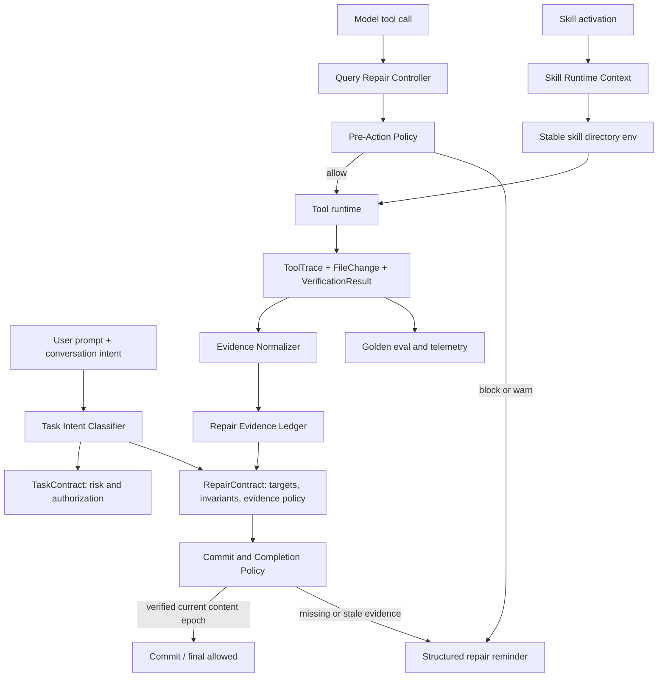
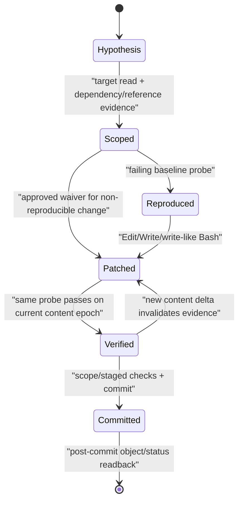

# golang-cc Agent 修复一次成功率提升技术方案

> 实施状态（2026-08-03）：Phase 0 的确定性失败 fixture 和 Phase 1 已完成；Phase 2 evidence core 与 Phase 3 高置信 repair 门禁已实现并默认运行在 `observe`；`warn/enforce` 需通过 `GOLANG_CC_REPAIR_VERIFICATION_MODE` 显式启用。Skill linter 已以 report-only CLI 上线。真实模型基线报告、观察期、scheduled eval 和默认 enforce 尚未完成，因此当前不声称全量 rollout 完成。

更新时间：2026-08-03

状态：`IMPLEMENTED_OBSERVE`，通用 runtime 机制已实现并通过确定性回归；等待真实任务观察数据后再评估默认 enforcement。

事故基线：session `07d04b13-a5b4-40a5-b1ff-28c799d8559a`，`pm-selfcheck` / `PKG_ROOT` 修复失败。

关联文档：

- [Agent Repair Safety Closure 通用修复方案](agent_repair_safety_closure_plan.md)
- [Closure Gate Classifier 优化技术方案](../architecture/closure_gate_classifier_optimization_plan.md)
- [Agent Eval Harness](../testing/agent_eval_harness.md)
- [Skills 渐进式加载机制](../skills/skills_progressive_loading.md)

## 1. 结论先行

这次失败不是单一提示词问题，也不能靠再补一句“修改前检查依赖、修改后认真验证”解决。现有 system prompt 已经要求修改前识别依赖、修改后做 semantic check，但 runtime 仍把成功的 `grep/rg` 当成语义验证，模型也没有被要求证明“同一个失败场景在修改后已通过”。

事故同时穿过了六个控制面：

1. **任务意图分类错误**：明确的 branch review 被识别为 `L4 entrypoint_repair`。
2. **修改前证据不足**：只读取目标文件前 25 行就删除定义，没有读取检查项 5。
3. **Review finding 被当成事实**：模型没有把自己先前的结论视为待复核假设。
4. **验证证据质量过低**：`grep -n PKG_ROOT` 只证明文本存在，不证明执行正确；输出已经显示“先使用、后定义”，模型仍宣称成功。
5. **提交门禁顺序错误**：semantic verification 发生在 commit 之后，错误修改已经进入本地历史。
6. **Skill 执行语义缺口**：不同 Bash 工具调用是不同进程；Preamble 中的 shell 局部变量不会传到检查项 5，`${BASH_SOURCE[0]}` 在 inline Bash 中也不是可靠的 Skill 路径。

因此推荐新增独立的 **Repair Verification Contract（修复验证契约）**，把修复从“模型自由执行 + 最后看一眼”升级为以下可验证闭环：

```text
问题是待验证假设
  -> 完整读取受影响单元和引用
  -> 修改前得到可失败的行为探针
  -> 执行修改
  -> 用同一探针验证通过
  -> 验证与最新内容版本绑定
  -> 才允许 commit 和完成声明
```

同时补齐 Skill Runtime Context：本地 Skill 激活后向 Bash/PowerShell 注入稳定的 Skill 目录环境变量，并明确每次 shell 调用相互隔离。Skill 文档中的每个 shell fence 默认必须自包含，不能把另一个 fence 的局部变量当成运行时共享状态。

本方案不建议直接把更多关键词、提醒和 if/else 堆进现有 `query.go` / `closure_gate.go`。修复契约、证据分级、策略判断和 query 编排应解耦，否则下一轮能力扩展会继续放大当前大文件和隐式耦合。

## 2. 背景与目标

### 2.1 背景

现有 [repair safety strategy](../../internal/query/systemsections.go) 已要求：

- 修改前识别文件不变量和依赖。
- 修改后检查 scope、metadata 和 repaired invariant。
- 完成前运行相关测试或确定性手工验证。

现有 [Post-Action Delta Gate](../../internal/query/closure_gate.go) 也会在文件发生变化后要求 scope、metadata、semantic 三类证据。

这些机制解决了“完全不验证”的问题，但没有解决“验证看起来做了、实际没有证明行为”的问题。当前 gate 判断的是命令外形，不是证据语义；模型执行一次成功的 `grep` 后即可满足 semantic check。

### 2.2 核心目标

| 目标 | 可验收结果 |
| --- | --- |
| 提升首次修复成功率 | 高置信度 bug repair 必须先失败、后通过，且两次使用同一行为探针 |
| 阻断凭局部上下文删除定义 | 删除/移动定义前必须有完整受影响单元读取和引用搜索证据 |
| 阻断“观察命令冒充断言” | plain `grep/rg/cat/sed/head` 不再单独满足行为验证 |
| 提交前完成语义闭环 | repair contract 未验证时，`git commit` 被阻断；commit 后不重复跑同一测试 |
| 修正 Skill shell 运行时认知 | 每个 shell 调用隔离；本地 Skill 有稳定目录变量；跨 fence 局部变量被 lint 发现 |
| 能持续度量而非主观判断 | 本事故成为 deterministic + real-model golden regression，记录一次成功率和假通过率 |

### 2.3 非目标

- 不承诺 runtime 能理解所有编程语言和所有业务不变量。
- 不把所有普通代码修改都强制成 bug reproduction 流程。
- 不自动执行 Skill 文档里的 Preamble 或全部代码块。
- 不把模型生成的自然语言“已验证”当成结构化证据。
- 不扩大 Bash、网络、文件写入或共享状态权限。
- 不在第一阶段引入数据库、外部 workflow engine 或远程 verifier 服务。
- 不通过硬编码 `PKG_ROOT`、`pm-selfcheck` 或 superPM 路径做特例修复。

## 3. 事故事实与确定性复现

### 3.1 Transcript 关键时间线

以下行号指 session JSONL 中的物理记录行；实现回归时会转成脱敏 fixture，不依赖开发机绝对路径。

| 行 | 事实 | 暴露的问题 |
| ---: | --- | --- |
| 3 | 用户明确说 `review这个分支改动https://...` | 明确 review 意图 |
| 5 | contract 为 `L4_local_change / entrypoint_repair` | classifier 误判 |
| 94 | Review 断言 Preamble 的 `PKG_ROOT` “算了白算” | finding 本身未经行为验证 |
| 249 / 261 | 修复前只读 `pm-selfcheck` 前 25 行 | 没有看到检查项 5 的引用 |
| 288 | 删除 Preamble 中的 `PKG_ROOT` | 基于局部读取执行 definition deletion |
| 411 / 418 | `grep` 输出先在 104/110 行使用、136 行才定义 | 证据已反驳成功结论，但未被识别 |
| 422 | 模型宣称 4 个问题“全部修复正确” | false completion |
| 447 / 451 | 用户指出问题后才首次阅读全文 | 依赖发现发生得太晚 |
| 455 | 把变量重新放回 Preamble | 只恢复文本依赖，未证明跨进程行为 |
| 490 / 497 | 再次只用 `grep` 做 semantic check | 同类假验证重复发生 |
| 506 | 自我分析称“AI 知道变量值”即可供后续 Bash 使用 | 对 runtime 进程模型的解释错误 |

### 3.2 Classifier 误判的确定原因

当前 [runtime task classifier](../../internal/query/query.go) 中：

1. repair 分类优先于 doc/review 分类。
2. action 关键词包含无边界的单字 `改`，会命中“改动”。
3. entrypoint repair 把任意 `/` 当作入口信号，GitHub URL 自带大量 `/`。
4. runtime task type 没有一等的 `code_review`。

因此“review + 改动 + URL”被组合成了“repair + entrypoint”。这是确定性规则问题，不是模型随机性。

### 3.3 `PKG_ROOT` 的真实运行时语义

`pm-selfcheck` 当前结构是：

- Preamble fence 定义 `SKILL_ROOT` / `PKG_ROOT`。
- 检查项 5 是另一个 fence，直接读取 `$PKG_ROOT`，自身不定义它。
- 后面的“执行检查”fence 才重新定义 `PKG_ROOT`。

而 golang-cc 当前 [Bash tool](../../internal/tools/bash/bash.go) 每次 `Run` 都通过新的 `exec.CommandContext` 启动独立 shell。Skill tool 只把 Markdown 注入 conversation context，见 [skill tool](../../internal/tools/skill/skill.go)；它不会执行 Preamble，也不会把 Preamble 产生的 shell 变量持久化到下一次 Bash。

此外，inline `bash -c` / Bash tool command 中的 `${BASH_SOURCE[0]}` 为空。`dirname ""` 会退化为当前目录，因此第二次修复中的 root 查找只有在 tool CWD 恰好位于 superPM package root 或其子目录时才可能“看起来有效”；它没有从已激活 Skill 的真实文件路径出发，不能作为稳定契约。

在 fresh shell 中执行检查项 5 的核心逻辑：

```text
PKG_ROOT=<> coverage=0/0
```

在同一 shell 先定义真实 root 后执行：

```text
PKG_ROOT=<$HOME/GolandProjects/superPM> coverage=44/45
```

这证明空 root 会产生 vacuous success：扫描集合为空时，`covered == total` 以 `0 == 0` 假通过。它也证明“把变量放回 Preamble”不是可靠的 runtime 修复，因为下一次 Bash 仍是新进程。

### 3.4 第二次修复为什么仍不充分

用户给出的两个文本级选择是：

1. Preamble 保留 `PKG_ROOT`，让检查项 5 使用。
2. 把检查项 5 所需的 root 定义提前到 Preamble。

在“单 shell 连续执行整个文档”的假设下，两者可以成立；在 golang-cc 的真实工具模型下，两者都不能让 shell 局部变量跨 Bash 调用持久化。

可靠修复只能是以下两类之一：

- **执行块自包含**：检查项 5 在自己的 fence 内解析 root，并对 root/扫描集合非空做 assertion。
- **runtime 显式上下文**：Skill 激活后由 runtime 向每次 Bash 注入稳定的 Skill 目录环境变量，检查项 5 基于该环境变量计算 package root。

因此本方案不会把“Preamble 变量跨 fence 可见”固化成新契约。

## 4. 根因分层

### R0：任务意图层把 review 当成 repair

影响：错误的 strategy card 会从会话第一轮开始强化“执行修复”而不是“只读审查”，并让 closure level、提示和后续 gate 进入错误分支。

### R1：Finding 没有证据生命周期

模型自己的 Review finding 直接成为修复输入，没有 `hypothesis -> reproduced -> confirmed` 状态。错误 finding 一旦编号，后续“修复 1234”就会把它当作可信 backlog 执行。

### R2：修改前没有目标级证据门禁

现有 Read Scope Gate 面向 final claim，不面向 Edit 前置条件。即使 Read tool 已明确提示“more lines may follow”，runtime 仍允许删除文件顶部定义。

### R3：验证只有“命令类别”，没有“证明强度”

[isSemanticCheckCommand](../../internal/query/closure_gate.go) 把 `rg`、`grep`、`node`、`python` 等命令只要成功执行就判为 semantic。它没有区分：

- observation：输出文本供人阅读。
- assertion：不变量不成立时必须 nonzero exit。
- behavioral test：真实执行受影响路径并带自动断言。

### R4：验证没有 before/after 配对

修复前没有 failing reproduction，修复后也就无法证明同一问题从 fail 变成 pass。一次成功的静态搜索可以被误当成任意问题的修复证据。

### R5：内容变更与共享状态变更共用同一 delta 语义

commit 被当作新的 post-action delta，导致 semantic check 在 commit 后补跑。正确顺序应该是：内容修改使旧验证失效；git add/commit 不改变内容语义，不应要求重复跑测试，但 commit 前必须已经有与当前内容版本绑定的验证。

### R6：Skill 的文档上下文与执行上下文混淆

当前 `skills.Skill` 已有 `Path` / `Root`，但 [tools.SkillRuntime](../../internal/tools/tool.go) 不保存 Skill 目录；Bash 环境也没有 Skill path。模型只能猜 CWD、使用空的 `${BASH_SOURCE[0]}`，或错误假设不同 fence 共享进程状态。

## 5. 设计原则

1. **Finding 是 hypothesis，不是 truth**：只有被失败探针复现后，才进入 confirmed 状态。
2. **证据必须和动作目标绑定**：读了 A 文件不能授权删除 B 文件的定义。
3. **行为修复必须有可失败性**：验证命令在不变量破坏时必须 nonzero，或由明确的 expected-failure baseline 证明它能失败。
4. **同一探针前后复用**：避免修改前测 A、修改后看 B。
5. **验证绑定内容 epoch**：最新内容变化后，旧 semantic evidence 自动失效。
6. **任务分类不承担安全边界**：classifier 决定策略和默认要求，工具动作与 evidence 决定是否放行。
7. **保守硬门禁、宽松观察模式**：无法高置信判断时先记录/提醒，不凭启发式大面积阻断。
8. **不把 Skill Markdown 当脚本文件**：每个 shell fence 默认独立、自包含；共享状态必须走显式环境或文件。
9. **复用现有依赖**：Markdown 用现有 Goldmark，shell AST 用现有 `mvdan.cc/sh/v3`，不新增解析器依赖。
10. **失败必须可降级和可回滚**：一处 feature mode 即可从 enforce 回到 warn/observe，原 Bash 行为不被隐藏。

## 6. 目标架构



### 6.1 控制面分工

| 控制面 | 职责 | 不负责 |
| --- | --- | --- |
| TaskContract | 用户授权、closure level、共享状态边界 | 证明 bug 是否修好 |
| RepairContract | 修复目标、证据要求、生命周期状态 | 执行工具、扩大权限 |
| Pre-Action Policy | Edit 前读取/引用/基线是否充分 | 自动替模型决定代码改法 |
| Evidence Normalizer | 把 tool trace 转成分级、可绑定证据 | 猜测自然语言输出是否正确 |
| Commit/Completion Policy | 当前内容版本是否已验证 | 重复执行测试 |
| Skill Runtime Context | 向每个进程提供稳定 Skill 上下文 | 持久化任意 shell 局部变量 |
| Eval/Telemetry | 量化成功率、假通过、摩擦和回归 | 参与线上授权决策 |

### 6.2 包边界

建议新增纯领域包，避免继续扩大 `query.go` 和 `closure_gate.go`：

```text
internal/repair/
  contract.go          # RepairContract、状态和常量
  evidence.go          # evidence grade、freshness、probe pairing
  policy.go            # 纯函数形式的 pre-action/commit/completion 决策
  command_grade.go     # shell command assertion/observation 分级
  change_risk.go       # analyzer registry 与通用 DTO

internal/query/
  task_intent.go       # task intent 规则、reason、priority
  repair_controller.go # ToolTrace 适配、session 状态、reminder/event 编排
  repair_events.go     # transcript/telemetry additive events

internal/skilllint/
  skilllint.go         # Markdown fence 遍历
  shell_fence.go       # shell AST、跨 fence 变量和 BASH_SOURCE 检查
```

依赖方向固定为：

```text
query -> repair
query -> tools
skilllint -> skills metadata / goldmark / shell syntax
tools -> 通用 SkillRuntime DTO
repair -X-> query
repair -X-> TUI / server / storage
```

`internal/repair` 只接收归一化事件 DTO，不直接读取 query 的 `ToolTrace`，避免 import cycle，也方便未来 CLI、API agent 和 subagent runtime 复用同一修复策略。

## 7. Repair Contract 数据设计

### 7.1 核心类型

以下是设计形态，不是要求一次性照抄的最终 API：

```go
type RepairState string

const (
    RepairStateHypothesis RepairState = "hypothesis"
    RepairStateScoped     RepairState = "scoped"
    RepairStateReproduced RepairState = "reproduced"
    RepairStatePatched    RepairState = "patched"
    RepairStateVerified   RepairState = "verified"
    RepairStateCommitted  RepairState = "committed"
)

type RepairContract struct {
    ID              string
    Trigger         RepairTrigger
    Confidence      Confidence
    State           RepairState
    ContentEpoch    uint64
    Targets         []RepairTarget
    Invariants      []RepairInvariant
    Probes          []VerificationProbe
    Waivers         []RepairWaiver
    EnforcementMode EnforcementMode
}

type RepairTarget struct {
    Path             string
    Symbols          []string
    RequiredRead     ReadRequirement
    ReferenceSearch  bool
    ContentEpochSeen uint64
}

type VerificationProbe struct {
    ID          string
    Purpose     string
    Targets     []string
    Fingerprint string
    Baseline    *VerificationEvidence
    PostChange  *VerificationEvidence
}
```

### 7.2 常量化要求

以下枚举必须使用 typed constants，不散落字符串：

- `RepairState`
- `RepairTrigger`
- `EvidenceKind`
- `EvidenceGrade`
- `VerificationPhase`
- `ExitExpectation`
- `EnforcementMode`
- `RepairGateReason`
- `WaiverReason`

这能保证 transcript schema、telemetry、gate reminder、测试 fixture 和 UI 展示共用同一语义。

### 7.3 证据等级

| 等级 | 示例 | 能否单独满足 semantic verification |
| --- | --- | --- |
| `observation` | `cat`、`sed -n`、`grep -n`、`rg` 列出引用、`git diff` | 否 |
| `assertion` | `test`、`[`/`[[` 比较、`diff`、`grep -q` 作为显式真假条件 | 可，但必须绑定 target 和当前 epoch |
| `behavioral_test` | `go test`、`pytest`、`npm test`、真实脚本自测 | 可 |
| `paired_probe` | 同一 command fingerprint 修改前 expected fail、修改后 pass | repair 的最高等级 |
| `waived` | 环境缺依赖且有结构化原因、替代验证和未验证边界 | 不能宣称完全修复 |

关键规则：plain `grep/rg` 是 observation。它们可以满足 reference search，但不能满足“行为已修复”。

### 7.4 可失败性和空集合保护

一个 post-change command 要成为 assertion，至少满足一项：

1. 属于已知测试 runner，exit code 表达测试结果。
2. shell AST 中有显式断言/比较，失败路径会 nonzero。
3. 与修改前的同 fingerprint probe 配对，baseline 已按预期 nonzero。

涉及扫描、覆盖率、计数时，还必须防止空集合假通过。`0/0` 不能视为健康。推荐 probe 明确断言：

```bash
test -n "$PKG_ROOT"
test "$total" -gt 0
test "$covered" -eq "$total"
```

如果业务允许覆盖率不满，至少断言 `total > 0`，再验证输出进入正确的 warning 分支。

## 8. 修复生命周期与门禁



### 8.1 状态转换条件

| 转换 | 必需证据 | 缺失时行为 |
| --- | --- | --- |
| hypothesis -> scoped | target 的完整受影响单元读取；高风险删除有引用搜索 | Edit 前 block/warn |
| scoped -> reproduced | 当前代码上行为 probe 按预期失败 | 高置信 bug repair 不允许完成 |
| reproduced -> patched | 发生与 target 绑定的 content delta | content epoch +1 |
| patched -> verified | 同 probe fingerprint 在当前 epoch 通过 | completion/commit blocked |
| verified -> patched | 任意新的相关 content delta | 自动失效旧验证 |
| verified -> committed | scope、metadata、staged scope 和 repair verified | commit allowed |
| committed -> done | HEAD/status/readback | 不重复跑 semantic test |

### 8.2 Baseline 例外

以下任务不强制 failing baseline：

- 新功能实现，没有旧行为可复现。
- 纯重构，目标是不改变现有行为。
- 文档/注释/格式修改，不声明修复运行时 bug。
- 外部依赖缺失导致无法执行，但用户允许在明确边界下继续。

例外必须成为结构化 waiver，记录原因、替代证据和剩余风险。waiver 不能把 final claim 升格为“已完整修复并验证”。

## 9. 分层详细设计

### 9.1 Task Intent Classifier

#### 目标模型

从只有 `runtimeTaskType` 的单标签分类，渐进演进为：

```go
type TaskIntent struct {
    Operation  IntentOperation // review, investigate, repair, implement, explain
    Subject    IntentSubject   // branch, file, repo, release, entrypoint...
    Mutation   MutationPolicy  // forbidden, allowed, requested
    Confidence Confidence
    Reasons    []ClassificationReason
}
```

`TaskIntent` 再映射到现有 TaskContract，保持 closure level 和 shared-state gate 兼容。迁移期可以同时计算 old/new classifier，并在 shadow telemetry 对比，不立即删除旧字段。

#### 规则优先级

1. 显式只读/禁止修改：`只分析`、`先不改`、`review only`。
2. 显式 code/branch/PR review：`review这个分支改动`、`代码审查`、`review PR`。
3. 显式 investigation/audit。
4. 明确 repair/implement 动词。
5. 弱上下文词。
6. fallback。

URL/path 只作为 subject evidence，不作为 action evidence。分类前应提取并遮蔽 `https://...`、本地绝对路径，再做动词匹配。

单字 `改` 不再做全局 substring action signal。中文 repair 使用更具体的组合：`修复`、`修改`、`更改`、`改成`、`改为`、`把...改...`；`改动`、`变更内容` 在 review 上下文中是名词。

#### 必须锁定的回归

| Prompt | 预期 |
| --- | --- |
| `review这个分支改动https://github.com/.../blob/feature/x` | code review / read-only investigation |
| `修复 /pm-status 幽灵引用` | entrypoint repair |
| `先分析为什么修复错了，不要改` | investigation / mutation forbidden |
| `修复 review 中的 1、2、3、4` | repair；细节来自 conversation context |
| `看看这个改动` | read-only review，低/中置信 |

Classifier 只决定策略，不因误分类自动授权写入；实际写工具仍受 permission、repair evidence 和 shared-state gate 控制。

### 9.2 修改前影响面发现

#### Read requirement

小文件删除/移动定义前要求 full-file read。大文件不强制一次加载全部正文，而要求：

1. 结构索引或 symbol 列表。
2. 目标定义完整范围。
3. 全部引用搜索。
4. 关键调用方/消费方的 focused read。

`Read(limit=25)` 已被现有 evidence 代码标记为 partial；对 definition deletion，partial read 不能满足 pre-action policy。

#### ChangeRiskAnalyzer registry

| Analyzer | 复用技术 | P0 能力 |
| --- | --- | --- |
| Markdown/SKILL | Goldmark AST | 定位 shell fences、标题边界和 fence 间引用 |
| Shell | `mvdan.cc/sh/v3/syntax` | 识别 assignment、变量引用、条件和 pipeline |
| Go | 标准库 `go/parser` / `go/ast` | 识别声明删除和 symbol |
| JSON/YAML/TOML | 现有结构化 parser | 识别 key 删除/移动 |
| Generic text | conservative token diff | 只 warn，不做高置信 hard block |

本事故中，Markdown analyzer 可看到被删除 fence 内定义了 `PKG_ROOT`，shell analyzer 可找到检查项 5 fence 的未定义引用。没有读取到检查项 5 时，evidence 本身也不满足 full affected unit，因此 Edit 应先被挡回。

#### 负担控制

- 新文件创建不要求旧文件 full read。
- 纯追加且不触达定义不要求 reference search。
- 批量机械变更可共享一次 repository-wide reference evidence，但每个 target 仍绑定 content hash/epoch。
- unknown analyzer 只产生 warning，不凭低置信 heuristic 阻断普通修改。

### 9.3 Bash Verification Metadata

建议在 Bash input schema 增加可选字段，旧调用完全兼容：

```json
{
  "command": "go test ./internal/query -run TestX -count=1",
  "verification": {
    "probe_id": "pkg-root-item5",
    "phase": "baseline",
    "purpose": "check item 5 scans a non-empty skill set",
    "targets": ["skills/00-tools/pm-selfcheck/SKILL.md"],
    "expect_exit": "nonzero"
  }
}
```

修改后使用相同 command 和 `probe_id`，phase 为 `post_change`，expect 为 `zero`。

#### 兼容语义

- `verification` 缺失：Bash 行为完全不变。
- baseline 预期 nonzero 时：`ToolTrace.IsError` 仍保留真实 nonzero，不隐藏进程失败；额外的 `VerificationResult.MatchedExpectation=true` 使 repair controller 把它计为有效 baseline，并避免注入错误的“意外失败”恢复提示。
- post-change nonzero：仍是 blocking failure。
- transcript/API 新字段全部 `omitempty`，不破坏旧客户端。
- 不接受 `expect_exit=any` 作为 assertive evidence。

#### Probe fingerprint

fingerprint 使用 shell AST 规范化结果和 target 集合计算，不使用 description 文案。只改空格、换行、注释不会导致不同 probe；改变实际命令、参数或目标会形成新 probe。

### 9.4 Evidence Normalizer

Evidence Normalizer 输入只包括：

- tool name/input/result/exit expectation。
- FileChanges 和内容 epoch。
- read path、partial 标志、时间顺序。
- shell AST 与已知 test runner registry。

它输出结构化 `VerificationEvidence`，不让模型自己打分。

当前 `isSemanticCheckCommand` 应保留为兼容 adapter，逐步降级为 `looksLikePotentialVerification`，不再直接产生最高等级 semantic=true。

推荐判定：

| 命令 | 结果 |
| --- | --- |
| `grep -n PKG_ROOT file` | observation |
| `rg 'PKG_ROOT' file` | observation |
| `grep -q '^PKG_ROOT=' file` | assertion-presence，不能证明跨进程行为 |
| `! grep -q ...` | assertion-absence |
| `test "$total" -gt 0` | assertion-nonempty |
| `bash -n script.sh` | syntax assertion，不等于 behavior |
| `go test ...` | behavioral test |
| baseline fail + same command post pass | paired probe |

“证明范围”也要分开：syntax test 只能证明语法，reference assertion 只能证明文本关系，不能被模型描述成行为 E2E。

### 9.5 Content Epoch 与验证新鲜度

Session 内维护两个单调 epoch：

```text
content_epoch: Edit/Write/会改变工作区内容的 Bash 后递增
shared_state_epoch: git add/commit/push/tag 等状态动作后递增
```

规则：

- semantic evidence 绑定 `content_epoch`。
- 新 content delta 使旧 semantic evidence stale。
- `git add` 不改变 content epoch，但使 staged scope preflight 失效并要求重新检查 staged set。
- `git commit` 不改变 content epoch；它消费已验证内容，不要求 commit 后重跑同一测试。
- commit 后只需要 HEAD/status/log readback。
- 如果 hook 或 formatter 在 commit 时真的改了文件，FileChanges 会推动 content epoch，验证自动失效并阻止完成。

这能同时解决“错误修改先 commit 后验证”和“commit 后无意义重复跑测试”两个问题。

### 9.6 Pre-Commit Repair Gate

当前 pre-commit gate 只要求 scope preflight。新增 repair 条件后，commit 放行条件为：

```text
permission authorized
AND staged scope verified after latest staging delta
AND repair targets belong to authorized scope
AND repair contract is verified for current content epoch
AND no blocking waiver is hidden
```

非 repair task 保持原 gate 行为，不全局要求 baseline。

commit command被 block 时，runtime 只提示最小缺口，例如：

```text
repair probe pkg-root-item5 has no passing post-change result for content_epoch=3
```

不重复输出整份通用 checklist，降低 token 和模型注意力成本。

### 9.7 Skill Runtime Context

#### 数据传递

`skills.Skill` 已有 `Path` 和 `Root`，激活本地 Skill 时把经过校验的绝对目录加入 `tools.SkillRuntime`：

```go
type SkillRuntime struct {
    // existing fields...
    Directory        string `json:"directory,omitempty"`
    FilesystemBacked bool   `json:"filesystem_backed,omitempty"`
}
```

每次 Bash/PowerShell 进程启动时，若 active skill 是 filesystem-backed，则注入：

```text
GOLANG_CC_SKILL_DIR=/absolute/path/to/skill
CLAUDE_SKILL_DIR=/absolute/path/to/skill
```

其中 `GOLANG_CC_SKILL_DIR` 是本项目权威变量，`CLAUDE_SKILL_DIR` 是兼容 alias。变量名使用常量集中维护。

#### 明确边界

- 不改变 tool CWD。
- 不持久化 Preamble 中的任意变量、函数、alias 或 `cd`。
- 不自动 source Skill 文件。
- tenant inline skill 没有本地目录时不伪造路径，两个变量保持未设置；可继续使用现有 `RuntimeRef`。
- 目录必须来自已成功加载的 Skill metadata，不接受模型在 tool input 中覆盖。
- 路径只进入当前工具子进程环境；日志/telemetry 默认不记录完整用户 home 路径。
- Windows/PowerShell 使用同名环境变量，路径格式由 OS 保持原样。

#### Prompt contract

Skill 激活 reminder 和 skills 文档增加稳定说明：

```text
Each Bash/PowerShell tool call runs in a fresh process. Shell-local variables,
functions, aliases, and cd state do not persist across calls. Each fenced shell
block must be self-contained. For filesystem-backed skills, resolve assets from
GOLANG_CC_SKILL_DIR (CLAUDE_SKILL_DIR is a compatibility alias).
```

### 9.8 Skill Linter

新增 `skills lint`，使用现有 Goldmark + mvdan shell parser，不新增 Go dependency。

P0 lint 规则：

| Rule ID | 检查 | 默认级别 |
| --- | --- | --- |
| `shell_cross_fence_variable` | 变量只在前一 fence 定义、后一 fence 裸引用 | error |
| `inline_bash_source_path` | inline fence 用 `${BASH_SOURCE[0]}` 推导 Skill 路径 | warning/error |
| `empty_scan_vacuous_success` | root 可能为空，count equality 未断言 non-empty | warning |
| `non_self_contained_shell_fence` | fence 依赖未声明的前序 shell state | error |
| `unstable_skill_relative_path` | filesystem-backed Skill 可用稳定 env 却依赖 CWD | warning |

兼容策略：

- 第一阶段只提供 CLI/CI lint，不在 Skill load 时拒绝旧 Skill。
- bundled/project Skill 可在 CI enforce error。
- user/marketplace/tenant Skill 默认展示 warning，不破坏已有安装。
- 规则支持局部、带理由的 ignore 注释；ignore 也进入 lint report，避免静默跳过。

### 9.9 Transcript、Telemetry 与隐私

新增 additive events：

| Event | 核心字段 |
| --- | --- |
| `repair_contract` | contract_id、trigger、state、confidence、target count、content_epoch |
| `repair_evidence` | evidence kind/grade、probe_id、target、epoch、fresh/stale、matched expectation |
| `repair_gate` | gate、decision、reason constants、missing evidence |
| `verification_result` | probe fingerprint hash、phase、exit class、duration、grade |

默认不复制完整文件正文、完整模型 prompt、私有 URL、环境变量值或完整命令输出。完整输出继续只存在原 ToolTrace，repair event 保存 hash、类别和最小摘要。

建议指标：

- `repair_first_pass_success_rate`
- `repair_false_completion_blocked_total`
- `repair_observation_rejected_as_assertion_total`
- `repair_stale_evidence_total`
- `repair_preedit_missing_full_read_total`
- `repair_probe_pair_rate`
- `repair_gate_extra_turns`
- `skill_cross_fence_lint_findings_total`

## 10. 对现有模块的影响评估

| 模块 | 计划改动 | 风险控制 |
| --- | --- | --- |
| `internal/query/query.go` | 把 task intent/classifier 和 repair orchestration 拆出 | 先 adapter，保持旧入口签名 |
| `internal/query/closure_gate.go` | semantic bool 改读分级 evidence；commit gate接 repair state | old logic 保留在 observe/shadow 期 |
| `internal/query/systemsections.go` | repair prompt 改成结构化 lifecycle 简版 | 不增加大段常驻 token；只对 repair 注入 |
| `internal/tools/tool.go` | SkillRuntime 目录、可选 VerificationResult DTO | additive + `omitempty` |
| `internal/tools/bash/bash.go` | 可选 verification metadata、active skill env | 缺字段时行为不变；不吞 nonzero |
| `internal/tools/powershell` | Skill env 对称注入 | 与 Bash 使用同一 helper |
| `internal/tools/skill/skill.go` | 激活上下文说明；传递已解析 Skill metadata | tenant/local 分支测试 |
| `internal/skills` | 暴露已存在 Path/Root 的稳定 accessor；lint CLI 接入 | 不改变 discovery precedence |
| `internal/agenteval` | 多轮 repair fixture、文件/命令断言和新指标 | deterministic suite 不依赖真实 provider |
| transcript/trace API | 新 event/property | additive schema，旧 reader 忽略未知字段 |
| TUI/WebUI | P0 不要求新 UI | 无显示回归；P1 再展示 repair 状态 |

### 10.1 明确无影响区域

- 无 MySQL schema 变化。
- 无 Gin/Mobile/OpenAI API path 或 response 破坏性变化。
- 无权限默认值变化。
- chat mode 默认不启用 repair hard gate。
- subagent/task 调度协议不变化。
- checkpoint/rewind 的 FileChange 恢复语义不变化；只增加可选 trace metadata。

## 11. 回归评测设计

### 11.1 脱敏事故 fixture

在临时 git 仓库构造最小 Skill package：

```text
VERSION
skills/check-update.sh
skills/00-tools/pm-selfcheck/SKILL.md
skills/demo-a/SKILL.md
skills/demo-b/SKILL.md
```

`pm-selfcheck` fixture 保留本事故结构：Preamble 定义 root，检查项 5 在独立 fence 使用 root，后续 fence 才重新定义；至少一个 AskUserQuestion skill 缺少 fallback，使真实结果不是 `0/0`。

fixture 不复制 superPM 私有历史，不依赖原 session 绝对路径。

### 11.2 三层回归

#### Layer A：纯单元测试

- exact review prompt -> code review，而不是 entrypoint repair。
- URL 中 `/` 不触发 entrypoint。
- `Read(limit=25)` 是 partial，不能授权 definition deletion。
- plain `grep/rg` grade 为 observation。
- expected-fail baseline 被记录，但不隐藏真实 exit。
- same fingerprint fail -> pass 形成 paired probe。
- 新 content delta 使 evidence stale。
- git add/commit 不使 content evidence stale。
- local Skill env 被注入；tenant inline Skill env 不伪造。
- shell fence linter 命中跨 fence `PKG_ROOT`。

#### Layer B：Deterministic scripted agent

脚本化复现坏路径：

1. 模型只读前 25 行。
2. 尝试删除 Preamble definition。
3. runtime 因 partial read + missing references 阻断。
4. 模型阅读全文、搜索全部 `PKG_ROOT`。
5. baseline assertion 在 fresh shell 检测到 `0/0` 空集合并按预期 nonzero exit。
6. 模型做 self-contained/runtime-env 修复。
7. 同一 probe 通过且扫描集合非空。
8. semantic verification 完成前 commit 被阻断，完成后首次放行。

这层验证 runtime 硬约束，不依赖模型聪明程度。

#### Layer C：真实模型 golden probe

多轮 case：

1. `review这个分支改动https://github.com/example/repo/blob/feature/x`
2. 检查 review 是否准确指出跨 fence 变量问题，而不是建议删除必需定义。
3. 用户 follow-up：`修复 review 中的这个问题，尽量一次成功`。
4. 检查最终 workspace 行为、probe evidence、commit 顺序和无关 diff。

真实模型 probe 需要按 provider/model/profile 分组，避免把模型能力差异误判成 runtime 改进。

### 11.3 评分指标

| 指标 | 定义 | P0 门槛 |
| --- | --- | ---: |
| Runtime false-pass block | scripted 坏路径被 gate 拦截 | 100% |
| Classifier exact case | review URL prompt 分类正确 | 100% |
| First-pass behavioral success | 第一次完成声明时 fixture assertion 全通过 | deterministic 100%；scheduled real-model >= 95% |
| Observation-as-proof | plain grep 被当成完整 semantic proof | 0 |
| Commit-before-verify | repair 未验证却 commit 成功 | 0 |
| Unrelated diff | fixture 目标外文件变化 | 0 |
| Gate overhead | 正确流程额外 block turns | deterministic 0；real-model 记录趋势 |
| Existing golden regression | 现有 git/closure golden cases | 100% 通过 |

scheduled real-model 采用至少 20 次样本再判断比例；单次通过只作为 smoke，不宣称能力显著提升。

## 12. 风险、负面作用与规避

| 风险 | 可能负面作用 | 规避方案 | 回滚 |
| --- | --- | --- | --- |
| classifier 优先级调整 | 真实 repair 被识别成 review | exact matrix + shadow 双分类 + reason telemetry | 切回 old classifier |
| pre-edit gate 过严 | 简单修改增加轮次 | 只对高置信 repair/definition deletion enforce；unknown analyzer warn | mode 改为 warn/observe |
| baseline 强制 | 新功能、不可复现环境被卡住 | typed waiver + 替代验证 + bounded final | 关闭 baseline enforcement |
| command grading误判 | 自定义测试脚本不被认可 | paired probe、known script registry、显式 verification metadata | 暂时允许人工 waiver |
| verification metadata 增加 schema | 旧客户端不认识字段 | optional + `omitempty`；旧 input 无变化 | 停止生成新字段 |
| expected-fail 处理 | 非预期 shell 错误被误当 baseline | 必须 phase=baseline、expect=nonzero、target/probe_id 完整；保留 IsError | 禁用 expected-fail evidence |
| content epoch 不正确 | 旧验证被错误复用 | FileChange 为权威；commit hook 产生内容变化时递增 | 回退到每 delta 重验 |
| Skill env 注入 | Skill 错误依赖新变量、路径泄露 | 只对子进程注入；telemetry 脱敏；CWD 不变；legacy fallback | 停止 env 注入 |
| linter 破坏旧 Skill | marketplace/user Skill 无法加载 | P0 不在 load 时硬拒绝；只 CI enforce bundled/project | 关闭 lint gate |
| token/latency 上升 | 小任务变慢 | contract 常驻结构在 runtime，prompt 只注入当前缺口；AST 只分析目标 edit | observe mode + metric |
| parser 覆盖不足 | 未知语言 false negative | analyzer registry；generic 只 warn；behavior probe 仍是最终门 | 不启用对应 analyzer enforce |
| chat/API 模式误触发 | 普通对话出现 gate | 仅 code mode + actual write tool + high-confidence repair | mode scope 开关 |
| 并发/外部编辑 | evidence 对旧内容有效 | target hash/content epoch；新 FileChange 自动 stale | 强制重验 |

### 12.1 为什么不直接 hard-code “grep 不算验证”

`grep -q` 可以是合法 presence assertion，`! grep -q` 可以是合法 absence assertion。问题不是工具名，而是命令是否有明确失败语义、证明了什么范围、是否和修复前 probe 配对。因此必须做 evidence grading，而不是简单黑名单。

### 12.2 为什么不自动执行模型声称的测试

runtime 不应替模型拼接或重写任意命令，否则会扩大执行面、改变权限语义，并可能执行模型未检视的副作用。runtime 只分级已经授权、实际执行的证据；安全的系统预执行仅限已有明确设计的只读 git preflight，不扩展到任意测试。

### 12.3 为什么不保持一个长生命周期 shell

长生命周期 shell 会引入隐藏的 `cd`、alias、function、环境污染和跨任务状态泄漏，降低可复现性和安全性。正确方案是每次进程隔离，并把需要共享的稳定上下文显式注入。

## 13. 渐进式实施计划

### Phase 0：先建立失败基线，不改行为

产出：

- 脱敏 `pm-selfcheck` fixture。
- exact classifier unit case。
- scripted bad-repair case，当前版本应明确失败。
- real-model golden probe 配置和初始基线报告。

验收：能稳定重现“partial read -> delete -> grep fake verification -> false completion”。

### Phase 1：Task Intent 与 Skill Runtime Context（低耦合增量）

产出：

- `code_review` 一等 intent，URL/path 预处理，移除单字 `改` 的无边界 action 判断。
- `SkillRuntime.Directory` / `FilesystemBacked`。
- Bash/PowerShell 稳定 Skill env。
- 激活提示明确 fresh process 语义。
- Skill linter P0 规则，以 report-only 方式上线。

验收：本事故 review prompt 分类正确；两个独立 Bash 调用证明局部变量不继承，但稳定 Skill env 每次都存在。

### Phase 2：Evidence Core，先 shadow/observe

产出：

- `internal/repair` domain types 和 evidence grader。
- Bash optional verification metadata。
- content/shared-state epoch。
- repair transcript/telemetry events。
- old semantic bool 与 new evidence grade 并行计算，不改变放行结果。

验收：收集真实任务的 old/new 判定差异、plain grep 假通过数量和潜在 false block。

### Phase 3：Pre-Action 与 Pre-Commit Enforcement

按风险逐步开启：

1. 高置信 repair + definition deletion：full affected unit/reference evidence。
2. 高置信 bug repair：baseline/post-change paired probe。
3. repair commit：current content epoch verified。
4. completion：claim 范围不能超过 evidence grade。

先 `warn`，再只对 deterministic golden case `enforce`，最后根据 telemetry 扩大默认范围。

### Phase 4：Analyzer 与 Lint 扩展

- Markdown + shell analyzer 先 enforce。
- Go/structured config analyzer 分别通过 matrix 后启用。
- Generic text 始终保持 conservative。
- bundled/project Skill lint 在 CI enforce；user/tenant/marketplace 继续 warn。

### Phase 5：默认启用与清理兼容层

满足以下条件后才默认 enforce：

- deterministic golden 100% 通过。
- scheduled real-model 首次成功率达到门槛。
- 观察期没有高频合法任务被阻断。
- gate extra turns 和 token 增量在可接受范围。
- old/new classifier 与 evidence telemetry 差异已解释。

兼容层至少保留一个发布周期，再删除旧 semantic bool 路径。

## 14. 测试与验收清单

### 14.1 单元测试

- [x] Task intent reason/priority matrix 覆盖中英文、URL、路径、否定、review、repair。
- [ ] Evidence grader 覆盖 observation/assertion/test/paired/waived。
- [x] Shell AST fingerprint 对空白稳定，对语义修改敏感。
- [x] Baseline expected nonzero 不被当成 post-change success。
- [ ] Content epoch/staged/shared-state epoch freshness。
- [x] Definition deletion 的 partial/full read 与 reference evidence。
- [ ] SkillRuntime local/tenant/plugin/marketplace/bundled source。
- [x] Bash 和 PowerShell env 注入、secret sanitation 不回归。
- [x] Skill linter 的跨 fence、BASH_SOURCE、empty scan fixture。

### 14.2 Query 集成测试

- [x] Edit 前 gate 只在匹配风险条件时触发。
- [x] plain grep 后 completion 仍被阻断。
- [x] same probe pass 后 completion 放行。
- [x] 新 Edit 后旧 probe stale。
- [x] repair 未验证时 commit block。
- [x] commit 后只要求 object/status readback，不重复 semantic test。
- [ ] waiver final 必须披露未验证边界。
- [x] chat mode/read-only review 无 repair gate 噪声。

### 14.3 全量回归

- [x] 2026-08-03 执行 `go test ./... -count=1` 通过。
- [x] 2026-08-03 执行 `git diff --check` 通过。

```bash
go test ./internal/repair ./internal/skilllint ./internal/query ./internal/tools/... ./internal/agenteval -count=1
go test ./... -count=1
git diff --check
```

若 CLI 增加 `skills lint`，同步 CLI golden/help 和对应使用文档。若 trace/API 对外暴露新字段，只做 additive schema，并补 server/serialization tests；没有 API 行为变化时不重新生成 Swagger。

### 14.4 真实验收

- [ ] 在脱敏 fixture 上运行多轮真实模型 probe。
- [ ] 记录 provider/model/profile、turn、token、gate count 和 workspace diff。
- [ ] 首次完成声明前所有 behavioral assertions 已通过。
- [ ] 故意只跑 `grep -n PKG_ROOT` 时 gate 必须拒绝 semantic completion。
- [ ] 故意在 commit 前省略 probe 时 gate 必须阻断 commit。
- [ ] 正确流程不产生多余 gate preflight。

## 15. 灰度、降级与回滚

统一使用一个 typed mode 控制修复证据策略：

```text
off      # 完全使用旧行为
observe  # 计算并记录，不提示、不阻断
warn     # 提示缺口，不阻断工具
enforce  # 只对策略命中的高置信场景阻断
```

推荐上线顺序：`observe -> warn -> scoped enforce -> default enforce`。

回滚时只切 mode，不删除新 transcript 字段、不修改历史 session、不回退 Skill metadata。env 注入和 linter 分别有独立开关，避免一个模块的问题迫使整个 repair contract 下线。

## 16. 完成定义

本方案只有同时满足以下条件才算完成，不能以“已加 prompt”代替：

1. exact session fixture 能稳定证明旧行为失败、新行为成功。
2. branch review URL 不再误分类为 repair。
3. partial read 后删除 `PKG_ROOT` 类定义会被 pre-action policy 阻断。
4. plain `grep/rg` 不再单独满足 behavioral semantic verification。
5. 高置信 bug repair 有修改前失败、修改后通过的同一 probe。
6. semantic verification 在 commit 前完成，并绑定当前 content epoch。
7. Skill shell fence 不再依赖跨 Bash 局部变量；稳定 Skill dir 可用且 tenant 边界明确。
8. deterministic、全量 Go tests 和 scheduled real-model eval 达到门槛。
9. telemetry 显示没有不可接受的 false block、额外轮次和 token 回归。
10. 文档、兼容边界、灰度开关、回滚方式和已知限制同步完成。

## 17. 推荐决策

建议批准完整架构，但分阶段交付，不做一次性大爆炸修改：

1. **先做 Phase 0**，用本事故建立失败基线和评分，避免“优化后感觉更好”但无法量化。
2. **Phase 1 独立落地 classifier 与 Skill Runtime Context**，两者都有清晰单测、低耦合、可单独回滚。
3. **Phase 2 必须 shadow**，先观察 evidence grader 的误判，再开启硬门禁。
4. **Phase 3 先只 enforce 高置信 repair + definition deletion + pre-commit**，不要第一天影响所有代码修改。
5. **达到真实模型成功率门槛后再扩大默认范围**。

最高 ROI 的 P0 不是增加更多提示词，而是：

```text
failing baseline + same-probe post-check + assertive evidence grading + pre-commit enforcement
```

这四项形成最小闭环；classifier、Skill env、lint 和 analyzer 用于降低进入错误路径的概率、补齐本事故的执行语义，并把同类问题提前到编辑前发现。
