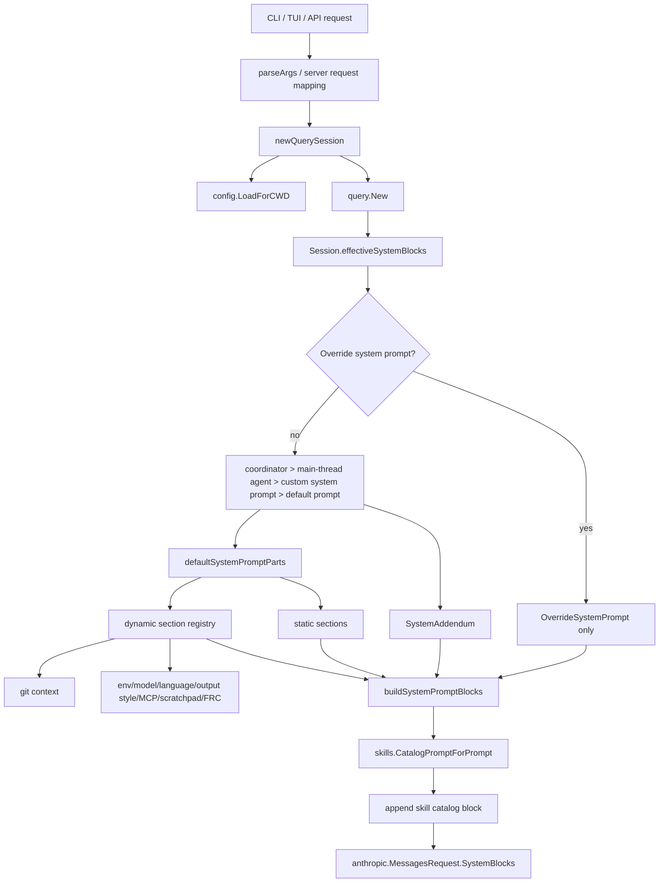
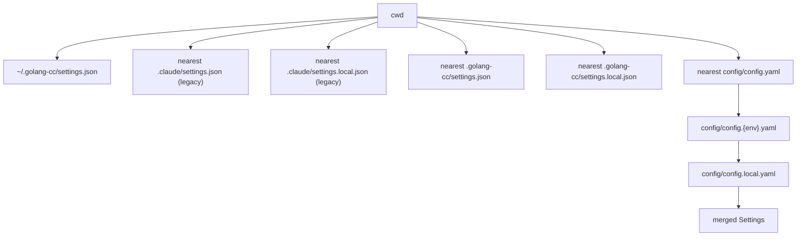
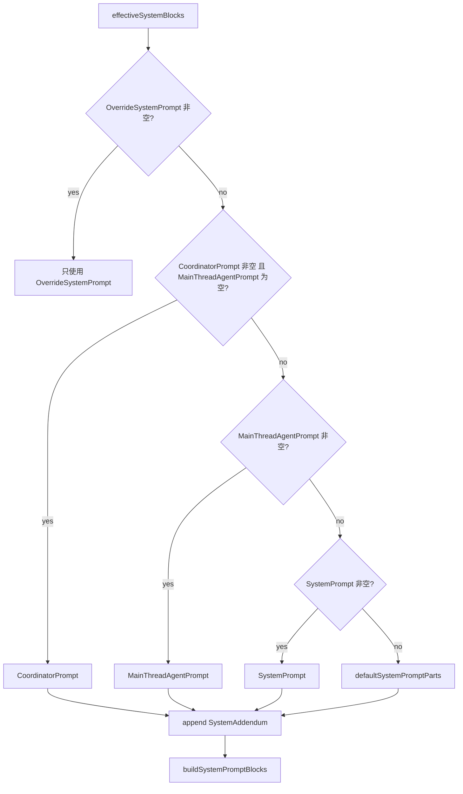
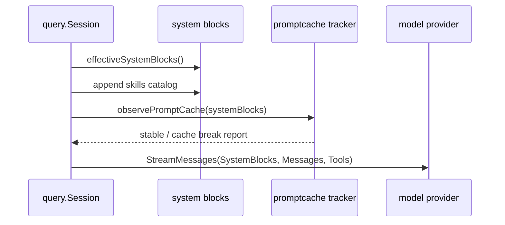

# Prompt Loading

本文梳理 golang-cc 当前提示词加载、拼接、缓存和运行时刷新逻辑，方便排查模型身份、系统提示词、项目记忆和 skills catalog 的来源。

## 总览



核心入口：

| 位置 | 作用 |
| --- | --- |
| `internal/cli/cli.go:newQuerySession` | 每次创建 query runtime，加载配置、工具、权限、hooks、recorder。 |
| `internal/query/query.go:effectiveSystemBlocks` | 决定最终 system prompt 的优先级和 block 构造。 |
| `internal/query/query.go:defaultSystemPromptParts` | 默认系统提示词和动态 section registry。 |
| `internal/query/query.go:assembleContextMessages` | 代码模式下把 memory 作为 `<system-reminder>` user-context 前缀消息，并为 manifest 收集来源计数。 |
| `internal/query/query.go:recordContextManifest` | 每轮 query 记录 `query.prompt_context` telemetry 和 transcript `prompt_context` entry。 |
| `internal/memory/memory.go:SystemAddendumForPrompt` | 加载 `golang-cc.md`、legacy `CLAUDE.md`、`.claude/rules`、local memory、include 和路径条件 memory。 |
| `internal/skills/skills.go:CatalogPromptForPrompt` | 根据当前 prompt 注入轻量 skills catalog。 |
| `internal/server/tenant_context.go` | API Server tenant runtime 下拼接 tenant memory/profile/document/knowledge 和 DB managed/team memory。 |

## 配置加载

配置由 `config.LoadForCWD(cwd)` 读取，主要搜索路径如下：



模型解析优先级：

```text
--model 显式参数 > config/config*.yaml 的 model > CLAUDE_CODE_MODEL > settings.json model > builtin default
```

`--provider <name>` 在上述 settings 合并完成后，从 `fallback.providers` 按 `name` 精确选择连接配置。选择结果会提升为本次运行的 primary provider；如果没有显式 `--model`，provider 条目的 `model` 覆盖默认模型。显式 `--model` 始终优先。未知 provider 名称不会静默回退，而是在建立模型客户端前报错。background、loop schedule 和 goal 会持久化 provider 名称，恢复执行时重新从当前配置解析凭证。

模型遥测记录 `cli_session_id`、`request_purpose`、`provider_name`、`provider_role`、`provider_kind` 和脱敏后的 `endpoint`。endpoint 不含 userinfo、query 或 fragment。`session inspect <id> --json` 优先按 `cli_session_id` 精确聚合；兼容旧日志时返回 `confidence=heuristic` 和 warning。

TUI 交互模式有额外的 per-turn reload：如果启动时没有 `--model`，每次发送消息前会重新 `ResolveModel` 并刷新 TUI welcome；如果启动时用了 `--model`，则锁定该模型，不被配置文件覆盖。

API server 是长驻进程：server 启动时 `opts.model` 已解析；每个请求仍会重新 `LoadForCWD` 获取 provider/base_url/settings，但默认模型不会因配置文件修改而自动变更。OpenAI-compatible 请求里的 `model` 字段会覆盖本次请求模型。

## System Prompt 优先级

`Session.effectiveSystemBlocks` 的优先级如下：



含义：

| 优先级 | 来源 | 说明 |
| --- | --- | --- |
| 1 | `OverrideSystemPrompt` | 完全替换默认提示词，不追加默认 sections。 |
| 2 | `CoordinatorPrompt` | coordinator 模式专用，只有 main-thread agent prompt 为空时生效。 |
| 3 | `MainThreadAgentPrompt` | agent 模式主线程提示词。 |
| 4 | `SystemPrompt` | CLI/API 传入的自定义 system prompt。 |
| 5 | `defaultSystemPromptParts` | 默认 golang-cc 万能 agent 超级助手提示词，并保留 Claude Code-compatible 工具行为。 |
| 尾部追加 | `SystemAddendum` | append system prompt、JSON schema 约束等。 |

## 默认 Prompt Sections

默认提示词由静态 sections + 动态 sections 组成。

静态 sections：

| Section | 内容 |
| --- | --- |
| identity | 当前代码里是 `You are golang-cc, a Go-developed universal agent super assistant.`，用于避免模型自称 Anthropic 官方 Claude Code。 |
| intro | output style 前置说明。 |
| system | 工具权限、hook、prompt injection、防止错误重试等规则。 |
| doing tasks | 软件工程任务执行规则。 |
| actions | 高风险动作前的谨慎原则。 |
| using tools | 专用工具优先、Bash 保留给 shell 场景、TodoWrite、多工具并行。 |
| tone and style | 简洁、文件引用、最终回答格式。 |
| output efficiency | 少绕圈、聚焦结果和验证。 |

动态 section registry：

| Section | 是否稳定缓存 | 来源/用途 |
| --- | --- | --- |
| `session_guidance` | 是 | 当前 session enabled tools 等。 |
| `git_context` | 是 | 代码模式下会话开始时的 branch、main branch、`git status --short` 和最近 commits 快照。 |
| `ant_model_override` | 是 | ant-only 内部模型 override。 |
| `env_info_simple` | 是 | cwd、日期、模型等环境信息。 |
| `language` | 是 | `GOLANG_CC_LANGUAGE`、`CLAUDE_CODE_LANGUAGE` 或 settings language。 |
| `output_style` | 是 | `~/.claude/output-styles`、项目 output styles、plugin output styles。 |
| `mcp_instructions` | 否 | MCP server instructions，每轮可刷新。 |
| `scratchpad` | 是 | scratchpad 使用提示。 |
| `frc` | 是 | function result clearing 相关提示。 |
| `summarize_tool_results` | 是 | 工具结果摘要策略。 |
| `numeric_length_anchors` | 是 | `USER_TYPE=ant` 时启用。 |
| `token_budget` | 是 | `TOKEN_BUDGET` feature gate。 |
| `brief` | 是 | `KAIROS` / `KAIROS_BRIEF` feature gate。 |

`GOLANG_CC_SIMPLE` 或 `CLAUDE_CODE_SIMPLE` 开启时，会走简化 prompt，只保留 identity、cwd 和日期。

## Memory 与 AGENTS.md 边界

golang-cc 在 `code` prompt mode 下会自动加载：

```text
/etc/claude-code/CLAUDE.md
GOLANG_CC_MANAGED_MEMORY / CLAUDE_CODE_MANAGED_MEMORY 指定文件
~/.claude/CLAUDE.md
CLAUDE_CONFIG_DIR/team/CLAUDE.md
CLAUDE_CONFIG_DIR/team/TEAM.md
CLAUDE_CONFIG_DIR/memory/team.md
CLAUDE_CONFIG_DIR/TEAM.md
CLAUDE_CONFIG_DIR/memory/auto.md
CLAUDE_CONFIG_DIR/memory/AUTOMEM.md
CLAUDE_CONFIG_DIR/AUTOMEM.md
CLAUDE_CONFIG_DIR/projects/<project-slug>/memory/MEMORY.md
当前项目路径及父路径上的 golang-cc.md（默认，可通过 identity.guidanceFilename 配置）
当前项目路径及父路径上的 CLAUDE.md（legacy compatibility）
当前项目路径及父路径上的 AGENTS.md（仅当前两者同目录都不存在时作为 fallback）
当前项目路径及父路径上的 .claude/CLAUDE.md
当前项目路径及父路径上的 .claude/rules/*.md
当前项目路径及父路径上的 CLAUDE.local.md
memory 文件内的 @include
frontmatter paths / exclude / excludes
```

Claude Code project memory index 只在 code prompt mode 加载；当前只读取 `MEMORY.md` 前 200 行或 25KB，不默认全量读取 `memory/` 下的 topic 文件。

`AGENTS.md` 是低优先级项目 workflow fallback，不会和同目录 `golang-cc.md` 或 legacy `CLAUDE.md` 同时加载。加载规则按每个项目目录单独判断：如果该目录存在配置化指导文件，使用它并跳过同目录 `CLAUDE.md` 与 `AGENTS.md`；否则如果存在 `CLAUDE.md`，使用 `CLAUDE.md` 并跳过同目录 `AGENTS.md`；前两者都不存在时，才尝试加载同目录 `AGENTS.md`。父目录和子目录彼此独立，父目录有项目指导文件不会阻止子目录自己的 `AGENTS.md` fallback。

### Memory 本地坏链检查

`memory lint` 复用上述 runtime 发现规则，检查指导文档物理源文件中的本地 Markdown link 和 image 目标：

```bash
golang-cc --cwd /path/to/project memory lint
golang-cc --cwd /path/to/project memory lint --json
golang-cc --cwd /path/to/project memory lint --scope all
```

- 默认 `workspace` scope 包含 Project、Local、Workflow、Claude Code project memory，在发现阶段排除 Managed、User、Team 和 Auto；`all` 显式加入这些全局来源。
- `workspace` 是 runtime scope，不等于只扫描 cwd：父目录指导文件仍可能被发现；Project/Local/Workflow 的 `@include` 受现有 `sameTree` 边界限制，不加载源文件目录树外的目标。可复现 CI 应使用干净 cwd，并隔离 `HOME`、`GOLANG_CC_CONFIG_DIR`、`CLAUDE_CONFIG_DIR`。
- linter 重读完整物理源文件并保留原始行号；frontmatter 不检查，但 prompt budget、HTML comment 清理和 project memory 的 200 行/25KB 截断不限制检查范围。
- 外部 URI、UNC/network path、纯 heading fragment、远程 URL 可达性和缺失的 `@include` 本身不检查；权限或其他 I/O 错误会使检查失败，不伪装成坏链。
- 命令只读、不自动修复，并跳过 CLI startup updater；有坏链时 human/JSON 输出保持完整，然后进程返回非零状态。

`chat` prompt mode 不加载上述本地代码开发 memory，也不加载 git context 或本地 skills catalog，适合 OpenAI-compatible 和 Mobile Chat 多租户普通助手场景。启用 tenant persistence 且请求带真实 tenant/user 时，server 会注入当前 tenant/user 的 memories、profile 和 active `CLAUDE.md` document。

API Server tenant runtime 额外支持：

| 来源 | 入口 | 注入模式 | 说明 |
| --- | --- | --- | --- |
| tenant knowledge base | `/tenant/knowledge/documents`、`/tenant/knowledge/search` | `chat` | 文档保存时切 chunk；当前 MVP 使用 MySQL LIKE + 简单评分检索 top chunks，不启用 embedding。 |
| tenant user memory | Memory Review approve 后的 `preference` / `convention` / `project_fact` / `user_fact` / `general` | `chat` / `code` | 只注入已批准的正式 memory；`explicit_pending`、`automem_pending`、approved/rejected/archive marker 不进入 prompt。 |
| tenant team memory | `/tenant/team-memory` | `code` | owner/admin 可写；query 时作为 `Tenant Code Memory` system addendum 注入。 |
| tenant managed memory | `/tenant/managed-memory` | `code` | owner/admin 可写；query 时作为 `Tenant Code Memory` system addendum 注入。 |
| explicit remember write-back | 用户输入 `记住...` / `remember that...` | 写入 pending tenant memory | 只生成 `explicit_pending` 待审候选，高风险凭证/越权/prompt injection 直接拒绝；pending 不进入 prompt；approve 后转为正式 user memory。 |
| AutoMem write-back | `GOLANG_CC_AUTOMEM_WRITEBACK=true` | 写入 pending tenant memory | 默认关闭；只用保守启发式写入明确偏好、项目事实和约定到 `automem_pending`，metadata 带 source session/message、trace、confidence；approve 后才进入 prompt。 |

## Prompt Context Manifest

每轮 query 在 system blocks、user context、skills catalog 都拼好之后，会记录一个只含 metadata 的 context manifest：

```text
telemetry event: query.prompt_context
transcript entry: type=prompt_context
```

manifest 不记录 prompt 正文、memory 正文、知识库正文、私有文件路径或附件私有 URL。它只记录：

- prompt mode/profile/query source
- system block 数、initial message 数、user-context message 数、attachment 数
- code memory 文档数量、按类型计数、include/path/exclude 计数
- git/MCP/output style/language/scratchpad/skills catalog/prompt cache/auto compact 是否注入
- tenant memory/profile/document/KB chunk 数量
- tenant managed/team/auto memory 标记

如果模型回答里出现 “Codex CLI 风格” 之类表述，当前代码中没有对应 runtime prompt 文案。更可能的来源是模型基于当前 coding-agent 语境自行泛化，或者外部宿主环境/会话提示词带来的影响。当前代码里明确硬编码的是 golang-cc identity。

## Skills Catalog 注入

代码模式每轮 query 在构造完 system blocks 后，会调用：

```text
skills.CatalogPromptForPrompt(cwd, prompt)
```

特点：

| 机制 | 说明 |
| --- | --- |
| 渐进式加载 | system prompt 只注入 skill name、description、when_to_use 等轻量 metadata。 |
| paths 过滤 | 带 `paths` 的 skill 只有在当前 prompt 命中路径时暴露。 |
| 禁用模型调用 | `disable-model-invocation` 的 skill 不进入模型可见 catalog。 |
| body 延迟加载 | 具体 `SKILL.md` body 由 Skill tool 或 forked skill runtime 需要时加载。 |

## Prompt Cache

`buildSystemPromptBlocks` 会根据模型、querySource 和 feature gates 给 system blocks 打 cache control。



缓存边界：

| 边界 | 说明 |
| --- | --- |
| static prefix | identity、tool policy、tone 等稳定段。 |
| dynamic boundary | `__SYSTEM_PROMPT_DYNAMIC_BOUNDARY__` 后的动态 sections。 |
| volatile section | `mcp_instructions` 每轮重算，不走稳定缓存。 |
| message cache breakpoint | 用户消息历史会按策略插入 message-level cache breakpoint。 |

## 排查清单

当模型身份或行为不符合预期时，按这个顺序查：

1. 启动参数：是否用了 `--system-prompt`、`--system-prompt-file`、`--append-system-prompt`、`--model`。
2. 配置文件：`config/config.yaml`、`config/config.{env}.yaml`、`config/config.local.yaml`。
3. 全局记忆：`~/.claude/CLAUDE.md`。
4. 项目记忆：当前项目或父目录里的 `golang-cc.md`、legacy `CLAUDE.md` 或 `AGENTS.md` fallback。
5. Output style：`~/.claude/output-styles`、项目 `.claude/output-styles`、plugin output styles。
6. Skills catalog：`skills context --prompt "..."` 预览当前 prompt 会暴露哪些 skills。
7. 环境变量：`GOLANG_CC_SIMPLE`、`CLAUDE_CODE_SIMPLE`、`USER_TYPE`、feature flags、GrowthBook 配置。
