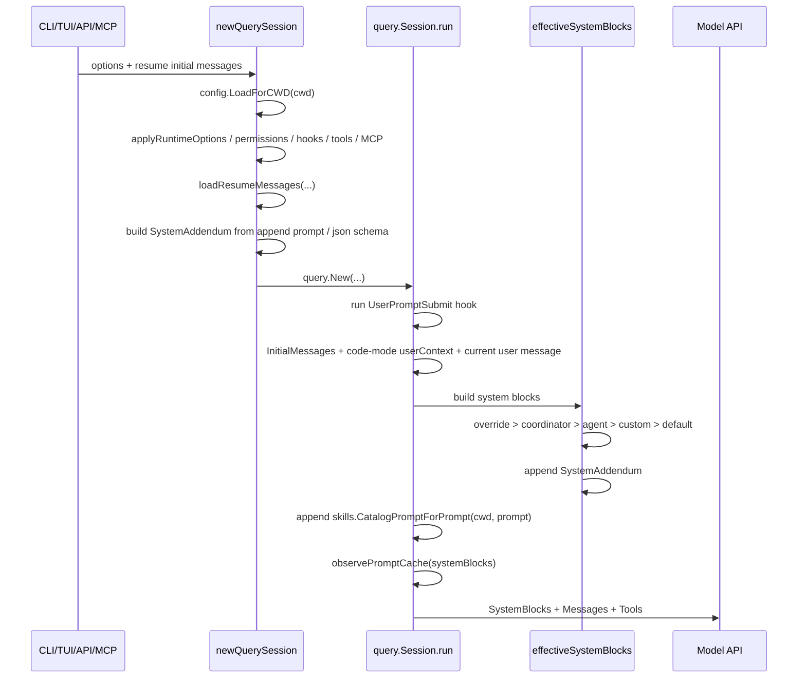
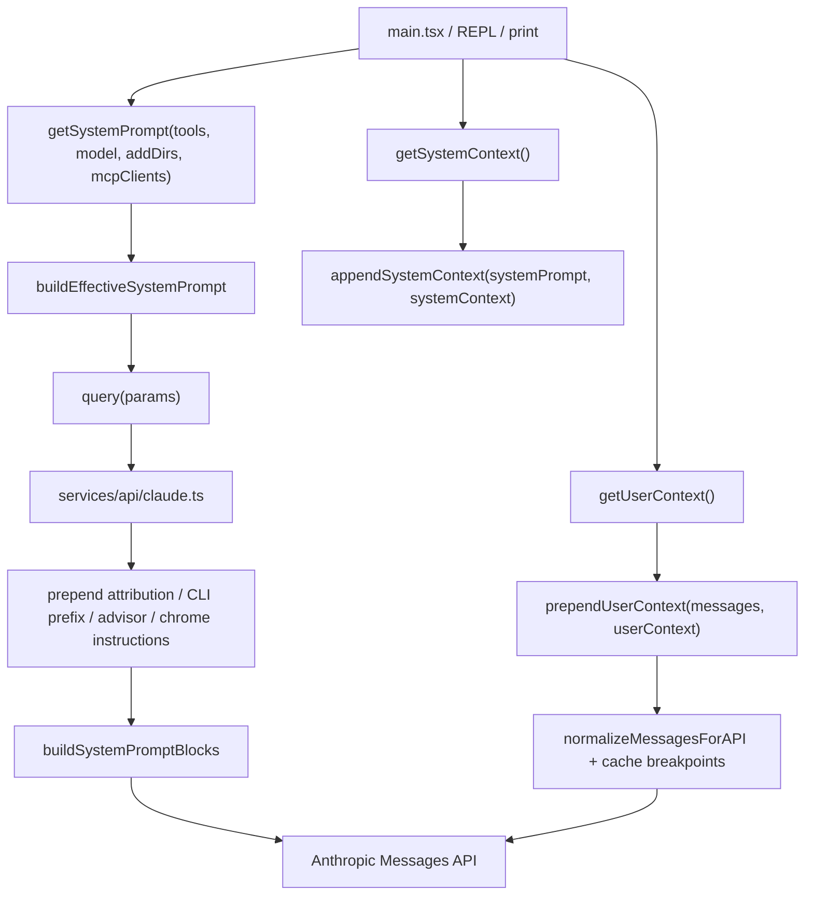

# Session Prompt Logic Comparison 2026-06-22

本文基于当前本地代码快照核对每次 session / turn 发送给模型前的提示词加载、拼装和缓存逻辑：

- Go 复刻：`/path/to/golang-cc`
- 原生 Claude Code 快照：`$HOME/GolandProjects/claude_code_src_2026`，本地包 `claude-code-2.1.88.tgz`

已有基础文档：

- `docs/prompt_logic/prompt_loading.md`：Go 当前提示词加载主链路。
- `docs/architecture/upstream_exact_parity.md`：prompt / stream-json / prompt cache 总体对照。

本版本补充更细的“加载顺序、拼装位置、差异和效果”。

## 结论

Go 当前实现已经覆盖原生 Claude Code 的主干结构：自定义 system prompt 优先级、默认 prompt 静态段 + 动态 section registry、dynamic boundary、prompt cache blocks、`CLAUDE.md` 项目指导、output style、language、MCP、skills catalog、resume transcript、OpenAI-compatible system/developer 映射等。

但它不是 upstream-exact。核心差异有三类：

1. Go 现在拆成 `code` 和 `chat` 两种 prompt mode：代码模式对齐原生的 user-context 前缀和 git context；普通 chat 模式隔离服务端 cwd 下的代码规则、git 状态和本地 skills catalog。
2. 原生 memory 搜索面仍更大：部分内部 prefetch/attachment 机制 Go 还没有完全复刻；Go 代码模式已补 managed memory、team memory、auto memory、`~/.claude/CLAUDE.md`、项目 `CLAUDE.md`、`.claude/CLAUDE.md`、`.claude/rules/*.md`、`CLAUDE.local.md`、`@include`、frontmatter `paths`/`exclude`/`excludes`，并新增 tenant DB managed/team memory 管理 API。
3. 原生 API 层还会追加 attribution / CLI prefix / advisor / Chrome tool-search 等内部段落；Go 保留 prompt cache 分块结构，但没有完全复刻所有内部产品/实验文案。

实际效果：Go 更简单、可控、可测，适合复刻主行为；原生上下文更丰富、个性化和实验化，尤其在项目规则发现、git 现场感、长期记忆、工具生态提示上更强，但 token 和缓存扰动面也更复杂。

## Go 每次 Query 的加载与拼装

入口顺序：



代码证据：

- `internal/cli/cli.go:newQuerySession`：加载配置、权限、hooks、tools、MCP、resume messages，构造 `SystemAddendum`，再 `query.New`。
- `internal/query/query.go:run`：先处理 hook 和消息，再调用 `effectiveSystemBlocks()`，最后按当前 prompt 附加 skills catalog。
- `internal/query/query.go:effectiveSystemBlocks`：决定 system prompt 优先级。
- `internal/query/query.go:defaultSystemPromptParts`：默认 prompt sections 和动态 section registry。
- `internal/memory/memory.go:SystemAddendum`：加载 `CLAUDE.md`。
- `internal/skills/skills.go:CatalogPromptForPrompt`：按当前用户 prompt 过滤 skills metadata。

Go system prompt 优先级：

| 顺序 | 来源 | 行为 |
| --- | --- | --- |
| 1 | `OverrideSystemPrompt` | 完全替换，不追加 default sections 和 addendum。 |
| 2 | `CoordinatorPrompt` | 仅当没有 main-thread agent prompt 时使用。 |
| 3 | `MainThreadAgentPrompt` | 替换默认 prompt。 |
| 4 | `SystemPrompt` | CLI/API/MCP 显式传入的 base system prompt。 |
| 5 | `defaultSystemPromptParts` | Go 默认 Claude Code-like agent prompt。 |
| 尾部 | `SystemAddendum` | `--append-system-prompt`、`--json-schema` 等追加约束。 |
| 尾部 | skills catalog | `run()` 里根据当前 prompt 追加。 |

Go 代码模式默认 sections：

- 静态段：identity / intro / system / doing tasks / actions / using tools / tone and style / output efficiency。
- boundary：`__SYSTEM_PROMPT_DYNAMIC_BOUNDARY__`。
- 动态段：`session_guidance`、`git_context`、`ant_model_override`、`env_info_simple`、`language`、`output_style`、`mcp_instructions`、`scratchpad`、`frc`、`summarize_tool_results`、`numeric_length_anchors`、`token_budget`、`brief`。
- 缓存语义：stable section 在 `Session.sectionCache` 中缓存；`mcp_instructions` 标记 `cacheBreak`，每次重算。

Go 代码模式 memory 顺序：

```text
1. managed memory：
   - /etc/claude-code/CLAUDE.md
   - GOLANG_CLAUDE_CODE_MANAGED_MEMORY / CLAUDE_CODE_MANAGED_MEMORY
2. ~/.claude/CLAUDE.md
3. project memory：
   - cwd 到 root 的 CLAUDE.md
   - cwd 到 root 的 .claude/CLAUDE.md
   - cwd 到 root 的 .claude/rules/*.md
   - cwd 到 root 的 CLAUDE.local.md
4. config-dir team/auto memory：
   - CLAUDE_CONFIG_DIR/team/*
   - CLAUDE_CONFIG_DIR/memory/auto.md
5. Claude Code project memory index：
   - CLAUDE_CONFIG_DIR/projects/<project-slug>/memory/MEMORY.md
   - 默认只加载索引文件前 200 行或 25KB；topic 文件暂不全量加载。
6. memory 文件内的 @include
7. frontmatter paths / exclude / excludes 过滤
8. API Server tenant runtime 下的 DB managed/team memory：通过 `/tenant/managed-memory`、`/tenant/team-memory` 管理，并作为 `Tenant Code Memory` 追加
```

Go 不自动加载：

- `AGENTS.md`
- 原生内部 advisor/attribution/Chrome tool-search 等产品级/实验性上下文机制
- 原生内部 memory prefetch/attachment 的完整实现；当前 Go 已有 tenant KB LIKE 检索 MVP 和 AutoMem 安全写回 MVP

OpenAI-compatible API 额外规则：

- `/v1/chat/completions` 中 `system` 和 `developer` message 合并为 query `SystemPrompt`。
- 其他历史 message 被转成一个 query prompt 文本。
- `response_format.type=json_object/json_schema` 会追加输出格式约束到 system prompt。
- 该层是 OpenAI-compatible adapter，不是原生 Claude Code 主 REPL 的消息组织方式。

## 原生 Claude Code 每次 Query 的加载与拼装

原生主链路不是单一 system string，而是四层：



原生 system prompt 优先级来自 `src/utils/systemPrompt.ts:buildEffectiveSystemPrompt`：

| 顺序 | 来源 | 行为 |
| --- | --- | --- |
| 0 | `overrideSystemPrompt` | 替换全部 prompt。 |
| 1 | coordinator prompt | coordinator mode active 且没有 main-thread agent 时使用。 |
| 2 | agent prompt | 普通模式替换 default；proactive/Kairos 中追加到 default。 |
| 3 | `--system-prompt` / file | 自定义 system prompt。 |
| 4 | default system prompt | `getSystemPrompt(...)` 生成。 |
| 尾部 | `appendSystemPrompt` | 除 override 外总是尾部追加。 |

原生 default prompt 来自 `src/constants/prompts.ts:getSystemPrompt`：

- `CLAUDE_CODE_SIMPLE` 时：仅 identity + cwd + date。
- 普通模式：
  - 静态段：intro、system、doing tasks、actions、using tools、tone and style、output efficiency。
  - dynamic boundary：`SYSTEM_PROMPT_DYNAMIC_BOUNDARY`。
  - 动态 registry：`session_guidance`、`memory`、`ant_model_override`、`env_info_simple`、`language`、`output_style`、`mcp_instructions`、`scratchpad`、`frc`、`summarize_tool_results`、`numeric_length_anchors`、`token_budget`、`brief`。
- proactive/Kairos：走 autonomous agent prompt path。

原生 context 拼装位置：

| 位置 | 函数 | 内容 |
| --- | --- | --- |
| system prompt array | `getSystemPrompt` + `buildEffectiveSystemPrompt` | 默认行为、工具使用、输出风格、环境、MCP、auto memory guidance 等。 |
| system prompt 尾部 | `appendSystemContext` | `gitStatus`、cache breaker 等 system context。 |
| messages 前缀 | `prependUserContext` | 用 `<system-reminder>` 包裹的 `CLAUDE.md` / current date 等 user context。 |
| API system blocks 前缀 | `services/api/claude.ts` | attribution、CLI sysprompt prefix、advisor、Chrome tool-search 等。 |

原生 `CLAUDE.md` / memory 加载顺序来自 `src/utils/claudemd.ts` 顶部说明和实现：

```text
1. Managed memory，例如 /etc/claude-code/CLAUDE.md
2. User memory，~/.claude/CLAUDE.md
3. Project memory，沿 cwd 到 root 搜索：
   - CLAUDE.md
   - .claude/CLAUDE.md
   - .claude/rules/*.md
4. Local memory：
   - CLAUDE.local.md
5. AutoMem / TeamMem：
   - system prompt 中注入行为说明
   - 具体内容可通过 user context / attachments / relevant memory prefetch 进入
```

原生 memory 支持：

- `@include`，包含文件在同一解析链路里处理，避免循环。
- frontmatter `paths`，可做条件规则。
- `claudeMdExcludes`。
- HTML comment / frontmatter 清洗。
- 非文本文件过滤。
- `--bare` 会关闭自动发现，但仍保留显式 `--add-dir`。
- `CLAUDE_CODE_DISABLE_CLAUDE_MDS` 可关闭 `CLAUDE.md` 注入。

## 差异和效果

| 维度 | Go 当前实现 | 原生 Claude Code 2.1.88 | 效果差别 |
| --- | --- | --- | --- |
| system prompt 主结构 | 已复刻静态段、动态 registry、boundary、cache blocks。 | 同结构，且有更多内部 feature-gated 段。 | Go 主行为接近，但产品实验/内部提示不完整。 |
| `CLAUDE.md` 位置 | `code` 模式通过 `<system-reminder>` user-context 前缀消息注入；`chat` 模式不注入。 | `getUserContext()` 后通过 `prependUserContext()` 放到消息前缀。 | 代码模式优先级边界接近原生；chat 模式避免泄露服务端项目规则。 |
| memory 搜索范围 | 代码模式已支持 managed/user/project/local/rules/include/paths/excludes/team/auto memory 文件；未支持原生内部 prefetch/attachment 机制。 | managed/user/project/local/rules/include/AutoMem/TeamMem。 | Go 的项目规则发现能力已明显增强；内部实验式记忆检索仍弱于原生。 |
| git status | `code` 模式注入一次 branch/main/status/recent commits 快照；`chat` 模式不注入。 | `getSystemContext()` 会在会话开始缓存 git status。 | 代码模式有现场感；chat 模式避免租户对话被部署仓库状态污染。 |
| skills | Go 每次 run 根据当前 prompt 附加 metadata catalog；`paths` 可过滤。 | 原生有 slash skill、Skill tool、skill discovery/prefetch/attachments 等更复杂机制。 | Go 可用且更简单；原生中途发现技能和 subagent skill context 更强。 |
| tenant KB | Go chat 模式支持 tenant knowledge documents/chunks，当前使用 MySQL LIKE + 简单评分检索 top chunks。 | 原生 Claude Code 不是通用 SaaS KB，但有更多内部 memory/prefetch/attachment 通道。 | Go 对多租户 chat 更实用；语义召回和重排序仍可继续增强。 |
| AutoMem | Go 支持默认关闭的安全写回，启用后只用保守启发式写偏好/项目事实/约定，带 source session/message/confidence。 | 原生有更深的自动记忆/团队记忆产品机制。 | Go 风险更低、可控；召回和总结能力弱于原生。 |
| API 层前缀 | Go 直接发送构造好的 system blocks，并记录 `query.prompt_context` manifest。 | 原生 API 层再 prepend attribution、CLI prefix、advisor、Chrome 等。 | Go 更透明；原生有更多平台/产品语义和 telemetry/cache 标记。 |
| prompt cache | Go 支持 global/org 分块、1h TTL allowlist、message cache breakpoint。 | 原生同类机制更细，结合 internal gates、cache editing、fork cache-safe 参数。 | Go 主成本优化已覆盖；复杂 fork/cache editing 场景仍非 exact。 |
| custom system prompt | Go 的 `SystemPrompt` 替换 default，再追加 addendum。 | 原生同样替换 default；proactive agent prompt 有追加特例。 | 普通场景对齐；proactive/agent 细节需持续跟。 |
| simple/bare | Go 支持 simple prompt；没有完全等价的原生 `--bare` 全套启动削减语义。 | `--bare` 跳过 hooks/LSP/plugin sync/auto memory/keychain/auto discovery 等，同时保留显式输入。 | Go simple 更像 prompt 简化；原生 bare 是 runtime 启动面整体瘦身。 |

## 对 Go 复刻的影响判断

P0 已经够用的部分：

- 普通 CLI/TUI/API 每轮 query 的 system prompt 优先级和拼装主干。
- prompt cache 分块和 dynamic boundary。
- `CLAUDE.md` durable guidance。
- output style / language / MCP / scratchpad / FRC / brief / token budget 等主 section。
- OpenAI-compatible system/developer 到 system prompt 的映射。

最值得继续补齐的部分：

1. Skill discovery parity：Go 已有 metadata catalog，下一步重点是中途 pivot 时的 discover/prefetch/attachment 机制，而不是继续扩大 system prompt。
2. Bare mode parity：如果目标是 SDK/CI 高速启动，应补一个真正 runtime 层的 bare mode，而不只是 simple prompt。
3. Tenant knowledge base：当前已接 MySQL LIKE MVP；下一步是 embedding、重排序、召回评测和知识库权限/版本治理。

## 验证命令

本次核对使用了以下本地命令：

```bash
rg -n "SystemPrompt|system prompt|Prompt|AGENTS|CLAUDE" --glob '!node_modules' --glob '!dist' /path/to/golang-cc
rg -n "systemPrompt|getSystem|CLAUDE|AGENTS|promptCache" --glob '!node_modules' --glob '!dist' $HOME/GolandProjects/claude_code_src_2026
sed -n '1984,2068p' internal/cli/cli.go
sed -n '732,840p' internal/query/query.go
sed -n '2165,2535p' internal/query/query.go
sed -n '2519,2655p' internal/query/query.go
sed -n '1,260p' internal/memory/memory.go
sed -n '318,410p' internal/skills/skills.go
sed -n '1,120p' src/utils/systemPrompt.ts
sed -n '1,180p' src/context.ts
sed -n '430,470p' src/utils/api.ts
sed -n '450,560p' src/constants/prompts.ts
sed -n '780,860p' src/utils/claudemd.ts
node -p "require('./package.json').dependencies?.['@anthropic-ai/claude-code']"
```
