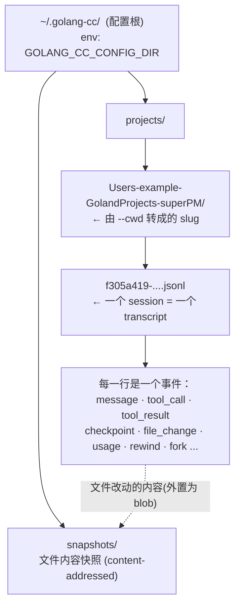
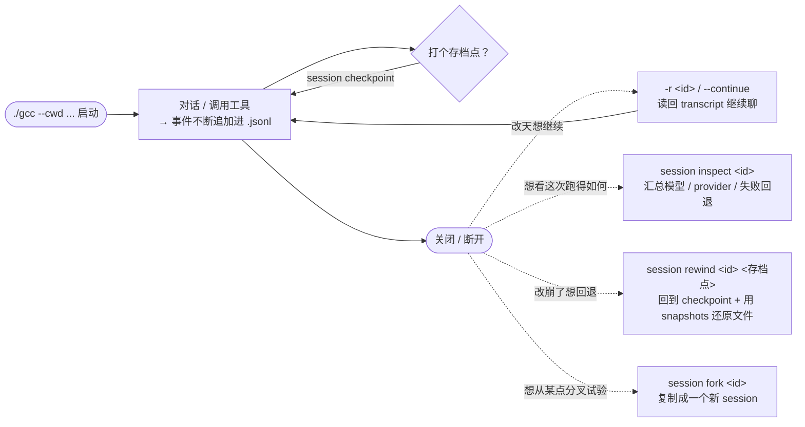

# 会话存档快速上手：transcript / checkpoint / resume / inspect

> **一句话理解**：一个 session = 一个 `.jsonl` **transcript** 文件；**checkpoint** 是这个文件里的一行；**resume** 读这个文件继续对话；**inspect** 汇总这个文件的运行详情。

---

## 0. 约定

下文用 `gcc` 代表编译后的二进制，等价于 `go run ./cmd/golang-cc`：

```bash
# 编译一次，后面命令都用 ./gcc
go build -o gcc ./cmd/golang-cc

# 启动一个会话（本文所有示例基于这条）
./gcc --cwd $HOME/GolandProjects/superPM \
      --provider sensenova-deepseek-v4-flash
```

> `--provider` 只决定用哪个模型后端，**不影响任何存储位置**。存储位置只由「配置根目录 + `--cwd`」决定。

> **⚠️ 工作区里有指向外部的软链时，写操作会被拦为「写入位置不在当前工作区」。**
>
> 写工具（Edit / Write / `sed -i` 等）的边界校验有**双重门**：目标路径的**字面路径**和**解析软链后的真实路径**都必须落在工作区（`--cwd`）或某个可写根之内。若工作区内某个目录是软链且指向外部，例如：
>
> ```
> superPM/docs/plans -> $HOME/GolandProjects/claude_agent_md/projects/superPM/docs/plans
> ```
>
> 则改这个目录里的文件时，字面路径在工作区内 ✅、但真实路径已跑到工作区外 ❌，于是被拦。**读操作（Read / `ls` / `pwd`）不走这道校验，所以只有写会被拦。**
>
> **解决**：用 `--add-dir` 把**软链目录本身**加入可写范围（注意：必须是软链那个逻辑路径，指向它的真实目标或它的父目录都**无效**）：
>
> ```bash
> ./gcc --cwd $HOME/GolandProjects/superPM \
>       --provider sensenova-deepseek-v4-flash \
>       --add-dir $HOME/GolandProjects/superPM/docs/plans
> ```
>
> 原理：只有把根设成软链本身，"字面 target 在根下" 与 "真实 target 在根的真实目标下" 两个条件才会同时成立。校验逻辑见 [`internal/tools/path.go`](../internal/tools/path.go) 的 `EnsureWritablePath` / `realPathWithin`。

---

## 1. 四个概念，一张图看懂

| 概念 | 是什么 | 存在哪 |
|---|---|---|
| **transcript** | 一次会话的完整流水账，一行一个事件的 `.jsonl` 文件 | `~/.golang-cc/projects/<slug>/<id>.jsonl` |
| **checkpoint** | transcript 里的**一行标记**，代表「可回退的存档点」 | 就写在上面那个 `.jsonl` 里 |
| **snapshot** | checkpoint 回退**文件内容**时用的文件快照 blob | `~/.golang-cc/snapshots/`（按内容去重） |
| **resume** | 读旧 transcript，把上下文接回来继续聊 | 命令 `-r <id>` / `--continue` |
| **inspect** | 读 transcript + 运行日志，汇总本次会话的请求详情 | 命令 `session inspect <id>` |



---

## 2. 东西到底存哪了（真实目录布局）

```text
~/.golang-cc/                                        ← 配置根（可被 GOLANG_CC_CONFIG_DIR 覆盖）
├── projects/                                        ← transcript 总目录（可被 GOLANG_CC_TRANSCRIPT_PROJECTS_DIR 覆盖）
│   ├── Users-example-GolandProjects-superPM/       ← 每个 --cwd 一个目录
│   │   ├── f305a419-f75a-4729-8d69-10c5b2b1360d.jsonl   ← 一个 session
│   │   ├── 919d79cc-b3df-4aaf-a436-3d4013b6ed9c.jsonl
│   │   └── ...
│   └── Users-example-GolandProjects-golang-cc/
│       └── ...
└── snapshots/                                       ← 文件快照 blob（rewind 恢复文件内容时用）
```

**slug 规则**：把 `--cwd` 的绝对路径去掉开头 `/`，再把 `/` 换成 `-`。

```
$HOME/GolandProjects/superPM
   └────────────────┬────────────────┘
        去掉开头 /，把 / 换成 -
   → Users-example-GolandProjects-superPM
```

> 关于 `snapshots/`：文件改动的 before/after 内容一律外置到这里的内容寻址 blob（按 sha256 去重），transcript 的 `file_change` 只保留引用（path + 权限 + hash + blob key），**不再内联文件正文**。唯一例外是“空内容”（新建文件的空 before、删除后的空 after），空串无需 blob。因此只有**纯对话、没有任何文件改动**的会话，这个目录才是空的。
>
> 补充：`~/.golang-cc/snapshots/` 是全局按内容去重的 blob store；旧文档提到的“≤ 1 MiB 内联”已过时——1 MiB 是 rewind undo journal 的限额（[store.go `journalInlineLimit`](../internal/session/store.go)），与“文件内容是否进 transcript”无关。详见 [transcript_checkpoint_optimization_plan.md](transcript/transcript_checkpoint_optimization_plan.md)。

---

## 3. transcript 长什么样（一个 `.jsonl` 内部）

每行一个 JSON 事件。精简示例：

```jsonl
{"type":"session","name":"给 superPM 加登录页","timestamp":"2026-07-17T12:20:00Z"}
{"type":"message","role":"user","content":"帮我加一个登录页","timestamp":"..."}
{"type":"message","role":"assistant","content":"好的，我先看下路由...","timestamp":"..."}
{"type":"tool_call","tool_name":"Read","content":"{\"file_path\":\"app/router.go\"}","timestamp":"..."}
{"type":"tool_result","tool_name":"Read","content":"package app ...","timestamp":"..."}
{"type":"checkpoint","name":"登录页-初版","timestamp":"..."}         ← 存档点就是这一行
{"type":"file_change","content":"{\"path\":\"app/login.go\", ...}","timestamp":"..."}
{"type":"usage","model":"...deepseek-v4-flash","input_tokens":1234,"output_tokens":567,"timestamp":"..."}
```

常见 `type`：`session`（标题）、`message`、`tool_call`、`tool_result`、`checkpoint`、`file_change`、`usage`、`rewind`、`fork`、`compact_summary`、`recap_summary`。

---

## 4. 生命周期：命令怎么串起来



---

## 5. 命令速查 + demo

> `session` 命令都作用于**全局** store（递归查找 `<id>.jsonl`），**不需要** `--cwd` / `--provider`。

| 命令 | 作用 | Demo |
|---|---|---|
| `session list` | 列出所有会话（标题 + 时间） | `./gcc session list` |
| `session locate <id>` | 只输出该会话的文件路径（不读内容） | `./gcc session locate f305a419-...` |
| `session locate`（无参） | 无参时定位当前项目最新会话（按 mtime） | `./gcc session locate` |
| `session show <id>` | 打印完整 transcript 事件（JSON） | `./gcc session show f305a419-...` |
| `session inspect <id>` | **详情摘要**：起止时间 / 模型 / 每次请求的 provider·endpoint·回退·报错 | `./gcc session inspect f305a419-...` |
| `session search <q>` | 按内容搜索会话 | `./gcc session search 登录页` |
| `session checkpoint <id> [名字]` | 给会话打一个存档点 | `./gcc session checkpoint f305a419-... 登录页-初版` |
| `session rewind <id> [名字]` | 回退到某存档点（省略名字 = 最近一个），并还原文件 | `./gcc session rewind f305a419-... 登录页-初版` |
| `session branches <id>` | 列出 v2 会话的所有分支（叶）及分叉点；`--compare <A> <B>` 对比两条链 | `./gcc session branches f305a419-...` |
| `session redo <id> <叶id>` | 把 v2 会话的当前指针切回某条被搁置的分支 | `./gcc session redo f305a419-... <leaf>` |
| `session fork <id> [存档点] [--name n]` | 从某点复制出一个新会话 | `./gcc session fork f305a419-... --name 试验分支` |
| `transcript import-claude-code <path>` | 只读导入原版 Claude Code transcript，生成一个 v2 新会话 | `./gcc transcript import-claude-code ~/.claude/projects/.../x.jsonl` |
| `session rename <id> <名字>` | 重命名会话 | `./gcc session rename f305a419-... 登录模块` |
| `session delete <id>` | 删除会话（别名 `rm`） | `./gcc session delete f305a419-...` |
| `usage` / `cost` | 全局 token 用量与费用统计 | `./gcc usage` |
| `-r <id>` / `--resume <id>` | **启动时**恢复某会话继续对话 | `./gcc --cwd .../superPM -r f305a419-...` |
| `-c` / `--continue` | 恢复**最近修改**的那个会话 | `./gcc --cwd .../superPM -c` |

大多数读命令支持 `--json` 输出结构化结果，例如 `./gcc session inspect <id> --json`。

---

## 6. 四个典型场景 walkthrough

### 场景 A｜关机后接着聊 —— `resume`

```bash
# 1) 找到要恢复的会话（或直接 --continue 取最近一个）
./gcc session list

# 2) 恢复它，接着对话
./gcc --cwd $HOME/GolandProjects/superPM \
      --provider sensenova-deepseek-v4-flash \
      -r f305a419-f75a-4729-8d69-10c5b2b1360d
```
> resume **只需要那个 `.jsonl` transcript 文件**。底层会在整个 `projects/` 下递归按 `<id>.jsonl` 定位再加载为上下文——即使换了 `--cwd` 也能找到。
> 想只恢复到某条消息为止：加 `--resume-session-at <messageID>`。

### 场景 B｜改崩了想回退 —— `checkpoint` + `rewind`

```bash
# 满意时先存档
./gcc session checkpoint f305a419-... 登录页-初版

# ...后续又改了一堆把项目改崩了...

# 回退：对话记录截回存档点，且文件内容也用 snapshots 还原
./gcc session rewind f305a419-... 登录页-初版
```
> `rewind` 会同时做两件事：① 把 transcript 截断回该 checkpoint；② 用 `~/.golang-cc/snapshots/` 把被改过的文件**恢复到当时的内容**（整个过程是全有或全无的事务，失败会回滚）。
>
> **v2 会话（消息图）下 rewind 是非破坏性的**：不再截断，只 append 一条 `branch_head` 把"当前叶"指回目标点，被放弃的分支仍在文件里、可 `session redo` 切回、可 `session branches --compare` 对比（详见下方"v2 消息图"小节）。

### 场景 C｜排查「为什么用了某模型 / 为什么失败回退」 —— `inspect`

```bash
./gcc session inspect f305a419-f75a-4729-8d69-10c5b2b1360d
```
输出会告诉你：transcript 路径、会话起止时间、用到的模型、**每一次模型请求走了哪个 provider / endpoint、回退了几次、报了几次错**，以及关联可信度 `confidence`（`exact` 精确 / `heuristic` 靠时间戳猜）。加 `--json` 可喂给脚本。

### 场景 D｜想从某点分叉做试验 —— `fork`

```bash
# 从「登录页-初版」这个存档点复制出一个新 session，不污染原会话
./gcc session fork f305a419-... 登录页-初版 --name 试验-第三方登录
```

---

## 7. 易混淆点 FAQ

- **checkpoint 是单独的文件吗？** ❌ 不是。它只是 transcript `.jsonl` 里的一行 `{"type":"checkpoint"}`。删掉 transcript，checkpoint 也就没了。
- **resume 需要 snapshots 吗？** ❌ 不需要。resume 只读 transcript。只有 `rewind`（要还原**文件内容**）才用 snapshots。
- **换了 `--cwd` 还能 resume 旧会话吗？** ✅ 能。定位是全局递归查 `<id>.jsonl`，与当前 `--cwd` 无关。
- **`show` 和 `inspect` 区别？** `show` = 原始事件流（你和模型说了啥、调了啥工具）；`inspect` = 运行层面的诊断摘要（模型 / provider / 回退 / 报错）。
- **`snapshots/` 是空的正常吗？** 只有**纯对话、无任何文件改动**的会话才为空。一旦有文件改动，其 before/after 内容就会外置为按内容去重的 blob 落到 `snapshots/`（transcript 里只留引用，不含正文）。
- **换存储位置？** 配置根用 `GOLANG_CC_CONFIG_DIR`；transcript 总目录用 `GOLANG_CC_TRANSCRIPT_PROJECTS_DIR`。

---

## 7.5 v2 消息图（非破坏性 rewind / redo / 分支）

**新会话默认写 v2 消息图**（不再是 v1 线性流水账）。老的 v1 文件按磁盘 schema 自动识别、继续按 v1 读；resume 永远跟随文件既有 schema，绝不混写。要让新会话回退到 v1，设 `GOLANG_CC_FEATURE_TRANSCRIPT_V2=0`（或 `featureFlags:{transcript_v2:false}`）。v2 消息图的语义：

- 文件仍是 append-only 的 `.jsonl`，但每条消息带 `id` + `parent_id` 连成一棵**树**；首行是 `session_meta`。
- "当前对话" = 从**当前叶（active leaf）**沿 `parent_id` 回溯到根的一条链（leaf-walk）；一次 append 的 `branch_head` 事件负责移动当前叶。**物理行序 ≠ 逻辑对话序**——所有消费方都先经 `CurrentChain` 取当前链再处理。
- **rewind 非破坏**：不截断，只 append `branch_head` 把当前叶指回目标点。旧分支保留，可：
  - `session branches <id>`：列出所有分支（叶）、各自消息数与分叉点（`forked@…`）。
  - `session branches <id> --compare <叶A> <叶B>`：对比两条链的公共前缀与各自独有节点。
  - `session redo <id> <叶id>`：把当前叶切回某条被搁置的分支。
  - TUI 内可直接用 `/branches`（`/branches --compare <A> <B>`）和 `/redo <叶id>` 操作**当前**会话，无需手输 id；会话内续跑的上下文按当前链重建，被放弃分支不会混入。
- **文件历史按 messageId 键控**：`file_change` 记 `message_id`；rewind 的文件还原＝"回退前链"与"目标链"的每-path 差集还原；`session gc --file-history` 的保留窗口按**当前链** turn 计数，只被放弃分支引用的 blob 可更早回收（命中已回收 blob 时 rewind 报清晰的 tombstone 错误，不破坏现场）。
- **兼容**：v1 与 v2 靠 `session_meta.schema` 共存；resume 按磁盘既有 schema 续写，绝不混写。v1 会话的 rewind 仍是截断式（行为不变）。
- **互通**：`transcript import-claude-code <path>` 只读导入原版 Claude Code transcript 的主链，best-effort 生成一个可 resume 的 v2 新会话（sidechain/system 等跳过并在报告中计数），原文件零修改。

> 详见 [transcript/transcript_v2_message_graph_and_nondestructive_rewind_plan.md](transcript/transcript_v2_message_graph_and_nondestructive_rewind_plan.md)（含数据模型、active-leaf 回放算法、A–F 实施落点）。

---

## 8. 记忆卡片

```text
transcript  = 一次会话的 .jsonl 流水账     → ~/.golang-cc/projects/<slug>/<id>.jsonl
checkpoint  = transcript 里的一行存档点    → session checkpoint <id> [名]
snapshot    = rewind 还原文件用的快照      → ~/.golang-cc/snapshots/
resume      = 读旧 transcript 继续聊       → ./gcc --cwd ... -r <id>   (或 -c 取最近)
rewind      = 回退对话 + 还原文件到存档点   → session rewind <id> [名]
inspect     = 会话运行详情摘要             → session inspect <id> [--json]
show        = 会话完整事件流               → session show <id>
```

---

## 9. 架构分析：为什么 golang-cc 把 transcript 和 checkpoint 放在一起

### 9.1 结论先行

golang-cc 当前采用的是一种偏**事件溯源（event sourcing）**的会话存储设计：

- 一个 session 对应一个 JSONL transcript。
- 对话、工具调用、checkpoint、文件变化、rewind 和 fork 都是同一事件流中的事件。
- checkpoint 是时间轴中的逻辑锚点，真正的文件恢复信息来自 checkpoint 之后记录的 `file_change`。
- 小文件的恢复内容可以内联在 `file_change` 中，大文件内容才外置到 content-addressed snapshot blob。

这个方案最大的价值是：**对话历史与工作区变化天然处于同一条有序时间轴，便于 inspect、fork、resume、审计和精确回退。**

Claude Code 源码并不是完全不把二者结合。它采用的是更克制的混合方案：

- `file-history-snapshot` 的索引和元数据仍然写入 transcript。
- 文件内容备份统一放在独立的 `~/.claude/file-history/<sessionId>/`。
- conversation rewind 和 filesystem rewind 在执行层面保持相对独立。
- transcript 负责保存对话图和文件历史索引，file-history 负责保存实际文件版本。

因此，两者真正的区别是：

> golang-cc 把文件变化本身作为 transcript 的一等事件；Claude Code 只把文件历史的引用和索引放进 transcript，不把实际文件内容或完整变更流水塞进 transcript。

### 9.2 golang-cc 当前的数据模型

golang-cc 使用统一的 `session.Entry` 表达会话事件。常见类型包括：

```text
message
tool_call
tool_result
checkpoint
file_change
usage
rewind
fork
compact_summary
recap_summary
```

Recorder 以追加方式写入 JSONL。自动 checkpoint 与用户消息 ID 关联，文件变化则作为后续事件记录，因此一个 turn 的逻辑结构接近：

```text
user message A
checkpoint A
assistant/tool events
file_change X
file_change Y

user message B
checkpoint B
assistant/tool events
file_change Z
```

回退到 A 时，可以从同一事件序列同时计算：

1. 对话应该保留到哪里。
2. 哪些文件变化发生在 A 之后。
3. 文件应该恢复到什么状态。
4. 本次操作是只回退文件、只回退对话，还是同时回退两者。

当前代码已经把三种操作语义分开：

- `RewindFiles`：只恢复文件，保留 transcript。
- `RewindConversationToMessage`：只回退 conversation。
- `RewindToMessage`：同时回退 conversation 和文件。

这说明 golang-cc 虽然将记录物理地放在同一个事件流里，但没有把操作语义强制绑定在一起。

### 9.3 放在一起的好处

#### 1. 天然保证时间顺序

对话事件和文件变化由同一个 Recorder 顺序追加，不需要依赖两个存储系统的时间戳进行关联。

例如可以明确看到：

```text
checkpoint
→ tool_call
→ file_change
→ tool_result
→ assistant message
```

如果拆成两个日志系统，则通常还需要额外维护 message ID、turn ID、sequence、transaction ID、session ID 和 branch ID，并处理乱序写入与部分失败。

#### 2. checkpoint 不容易成为悬空索引

checkpoint 与 `file_change` 位于同一 transcript，找到 checkpoint 后直接扫描后续事件即可，不需要再打开独立 checkpoint 数据库或索引文件。

这对以下能力很有帮助：

- session inspect
- rewind
- fork
- export
- 故障排查
- 回归测试
- 人工阅读 JSONL

#### 3. 适合事件溯源和后续派生能力

统一事件流可以作为事实日志，通过重放事件派生出新的能力，例如：

- 生成文件变化统计。
- 按 turn 汇总工具行为。
- 分析 checkpoint 后产生的修改。
- 生成审计报告。
- 判断某条 assistant 消息实际修改了哪些文件。
- session fork 时复制某个逻辑点之前的事实。

#### 4. 小会话便于整体迁移

对于内联的小文件变化，复制一个 JSONL 通常就能同时带走：

- 对话上下文
- checkpoint
- 文件恢复信息
- token usage
- rewind/fork 记录

这降低了“只复制 transcript、漏掉文件备份”的概率。

#### 5. 测试和排查更确定

测试可以构造一份短 JSONL，同时验证 checkpoint 定位、事件保留、事件删除、文件恢复和 rewind 记录。

当前实现还覆盖了缺失 snapshot 时不截断 transcript，以及恢复失败时不留下半完成状态等边界。

#### 6. 文件与 transcript 的一致性较强

golang-cc 的 rewind 使用补偿式事务：

1. 预检 snapshot 和目标目录。
2. 保存所有目标文件的当前状态，用作失败回滚。
3. 执行文件恢复。
4. 任意文件失败时，恢复已经修改过的文件。
5. 最后提交 transcript 变化。
6. transcript 提交失败时，同样回滚文件。

因此 transcript 不只是历史记录，也是 rewind 操作的提交边界。

### 9.4 放在一起的坏处

#### 1. transcript 容易膨胀

小文件的 before/after 内容内联时，一次修改可能同时保存修改前和修改后的完整内容。模型反复修改同一个中等大小的文件，会造成：

- resume 读取变慢。
- inspect 扫描变慢。
- fork 复制成本变高。
- JSON 解码内存增大。
- 相同文件内容在多个事件中重复出现。

> **现状更新**：内联阈值已收敛至 0（仅空内容内联），所有文件正文外置为按内容去重的 blob，相同内容只存一份，已不存在“内容重复存储”问题；剩余的膨胀源是**事件条目数**（同一 turn 内多次改同一文件仍记多条 `file_change`），由 turn 级去重（方案 P1-4）解决。

#### 2. transcript 承担的职责过多

当前 JSONL 同时承担：

- 对话记录
- checkpoint 索引
- 文件恢复日志
- 部分文件内容存储
- rewind journal
- usage/inspect 数据源

这会使 transcript 格式演进、兼容读取、第三方导出和数据清理变得更复杂。

#### 3. 敏感信息泄露面扩大

文件内容进入 transcript 后，transcript 可能包含：

- `.env` 修改前后的值
- 配置文件中的 token
- 私有源码
- 被删除文件的旧内容
- 证书或密钥材料

用户可能认为“分享 transcript”只是在分享对话，实际却可能连文件历史一起分享。即使本地文件权限为 `0600`，导出、上传、同步、诊断收集和人工分享仍然需要额外过滤。

#### 4. 对话和文件历史的生命周期难以解耦

两类数据的合理保留周期并不相同：

- transcript 可能需要长期保留。
- 文件 checkpoint 可能只需要最近若干 turn。
- 用户可能希望释放文件备份空间，但仍保留聊天记录。
- 企业策略可能允许保存对话摘要，但禁止保存源码副本。
- 导出 transcript 时通常不应默认携带可恢复的源码内容。

如果实际文件内容大量内联在 JSONL 中，只清理恢复数据就需要重写 transcript。

#### 5. append-only 与 transcript 截断存在张力

理想的 append-only event log 通常不删除历史，而是追加补偿事件。conversation rewind 如果需要物理截断 transcript，则需要处理：

- 原子文件替换。
- 已打开 Recorder 的并发写入。
- 崩溃恢复。
- fork 与 rewind 的边界。
- 审计历史是否应继续保留。

golang-cc 当前通过预检和补偿事务提高一致性，但文件系统和 JSONL 仍然不是真正的 ACID 数据库。

#### 6. `file_change` 粒度可能高于实际产品需求

golang-cc 偏向记录每次文件变化；Claude Code 更偏向记录每个用户消息边界的文件状态。

如果一个 turn 内对同一文件写入二十次，事件级记录有更强的可观测性，但用户通常只需要回到该 turn 开始前的状态。中间版本可能没有实际恢复价值，却会增加存储和扫描成本。

### 9.5 Claude Code 的实际设计

#### 1. 用户消息就是 checkpoint 锚点

Claude Code 的 `FileHistorySnapshot` 主要包含：

```text
messageId
trackedFileBackups
timestamp
```

它不是依赖人工命名 checkpoint，而是直接把 user message UUID 作为文件快照锚点。这与其 rewind UI 一致：用户选择某条历史消息，然后选择只恢复代码、只恢复 conversation，或者同时恢复两者。

#### 2. 修改前备份，turn 边界生成 snapshot

文件工具修改文件之前调用 `fileHistoryTrackEdit`，保存修改前内容；随后在 message/turn 边界调用 `fileHistoryMakeSnapshot`。

如果文件相对上一版本没有变化，则复用已有备份，不重复复制文件。因此它的数据关系更接近：

```text
messageId → file path → backup version
```

而不是：

```text
checkpoint → 一串 before/after file_change
```

#### 3. snapshot 元数据进 transcript，文件内容放独立目录

Claude Code 创建 snapshot 后，会把 `file-history-snapshot` 元数据写入 session storage，用于 resume 时恢复索引。

实际文件备份则位于：

```text
~/.claude/file-history/<sessionId>/
```

备份名称由文件路径 hash 和版本号组成，类似：

```text
<path-sha256-prefix>@v<version>
```

所以 Claude Code 并非把 transcript 与 checkpoint 完全拆开，而是采用：

```text
transcript               file-history
----------------------   --------------------------
message graph            actual file backup content
snapshot metadata        versioned backup files
messageId references
```

#### 4. resume 时从 transcript 重建 file-history state

加载 JSONL 时，Claude Code 会单独收集 `file-history-snapshot`，再根据当前有效 conversation chain 建立对应的 snapshot 链，最后恢复：

- snapshots
- trackedFiles
- snapshotSequence

这意味着 transcript 仍是文件历史索引的事实来源，只是不负责承载文件 blob。

### 9.6 Claude Code 为什么不采用更深度的合并

#### 1. Claude 的 checkpoint 语义就是用户消息边界

Claude Code 的产品交互围绕历史 user message 展开，不需要再引入一套通用命名 checkpoint 体系。

golang-cc 还需要服务 CLI、server、goal、手工 checkpoint 等场景，因此独立 checkpoint 类型更有复用价值。

#### 2. Claude transcript 是消息图，不只是线性日志

Claude transcript 使用 `uuid`、`parentUuid` 和 leaf message 表达 retry、fork、sidechain 等分支。加载时先找到 leaf，再沿父节点构建当前 conversation chain。

在这种模型里，物理 JSONL 行顺序不完全等于当前有效对话顺序。如果文件回退仅依赖“checkpoint 后面的所有 JSONL 行”，遇到 retry、fork、compact、sidechain、orphan 或多个 leaf 时会非常复杂。

使用 message UUID 显式关联 snapshot，更适合消息图。

#### 3. 文件内容体积远大于消息元数据

Claude Code 需要处理大型仓库、notebook、lockfile、生成文件和二进制内容。文件内容内联 JSONL 会直接影响：

- CLI 启动速度
- session selector 扫描
- resume 延迟
- transcript 搜索
- 日志上传和分享
- JSON parser 内存

Claude Code 的备份实现使用文件复制而不是把完整内容读入 JavaScript heap，源码注释明确提到旧方式处理大文件时存在 OOM 风险。这说明其架构明确把文件 blob 当作独立大对象处理。

#### 4. 独立生命周期和容量控制

Claude Code 的 file-history snapshot 有独立数量上限，而 conversation transcript 可以更长。这使它能够分别优化：

- 对话完整性。
- 文件撤销窗口。
- 备份空间。
- session 恢复性能。
- 历史清理策略。

#### 5. transcript 需要参与分享、同步、搜索和分析

Claude transcript 不只用于本地 resume，还会参与 session list、stats、search、share、remote session 和 SDK 等链路。

把源码 before/after 大量内联后，所有链路都必须过滤敏感文件内容并承担 blob 传输成本。物理分离可以让 transcript 被索引或分享，同时让 file-history 默认保留在本地并使用独立安全策略。

#### 6. file-history 是可降级辅助能力

Claude Code 在部分 snapshot 和备份失败路径中选择记录错误并继续主会话。这说明其优先级是：

> 主对话必须继续，文件 checkpoint 失败不应轻易让整个 agent turn 失败。

golang-cc 当前更强调 transcript 与文件恢复的一致性，Claude Code 则更强调 file-history 与主会话解耦后的可降级性。

### 9.7 两种方案对比

| 维度 | golang-cc | Claude Code |
|---|---|---|
| 时间模型 | 线性 JSONL 事件流 | UUID / parentUuid 消息图 |
| checkpoint 锚点 | 独立 checkpoint，支持命名 | user message UUID |
| 文件变化模型 | `file_change` 事件 | turn-level file snapshot |
| 小文件内容 | 可内联 transcript | 始终外置备份 |
| 大文件内容 | snapshot blob | 外置 file-history |
| transcript 作用 | 对话、文件 journal、审计 | 对话图、snapshot 索引 |
| rewind 一致性 | 补偿式事务，强一致倾向 | 独立文件副作用，可降级倾向 |
| 可观测性 | 文件变化粒度更细 | 主要关注用户消息边界 |
| 分享风险 | transcript 可能直接包含源码 | transcript 主要保存备份引用 |
| 生命周期 | 对话与文件历史较耦合 | 可以分别限额和清理 |
| 分支适配 | 需要解释线性事件范围 | message UUID 天然关联消息分支 |

### 9.8 长期架构判断

> **现状更新（本节部分内容已落地）**：下文把“文件内容物理分离到独立 blob store”写作演进方向，但**内容寻址 blob store + sha256 去重 + 可达性 GC 已实现**，且内联阈值已收敛至 0（transcript 不再承载文件正文，仅留 path/权限/hash/blob key 引用）。剩余工作是 turn 级去重与文件历史独立生命周期。完整现状、决策与优先级见 [transcript_checkpoint_optimization_plan.md](transcript/transcript_checkpoint_optimization_plan.md)。

golang-cc 当前“统一事件时间轴”的方向有明确价值，尤其适合本项目强调的可测试、可观测、可排查，以及 CLI、TUI、server 和 goal 共用 session runtime 的目标。

但长期不宜继续扩大“实际文件内容内联 transcript”的范围。更合理的演进边界是：

```text
transcript
├── message / tool / checkpoint / rewind
├── file_change 元数据
├── before / after hash
└── snapshot blob reference

snapshot blob store
└── 实际文件内容，按内容寻址、去重并独立清理
```

该方案可以同时保留两边的优点：

- 保留 golang-cc 的统一时间轴、通用 checkpoint 和事务回退。
- 学习 Claude Code，将实际文件内容与 transcript 物理分离。
- transcript 仅保留 path、类型、权限、hash 和 snapshot key 等元数据。
- 文件历史可以应用独立保留期限、容量限制和安全策略。
- transcript 导出默认不携带文件 blob。
- rewind 继续使用现有预检、undo 和补偿事务保证一致性。

一句话概括：

> golang-cc 适合继续保持“逻辑结合”，但长期应走向“物理分离”：checkpoint 和 file-change 引用留在 transcript，实际文件内容进入独立、去重、可清理的 blob store。
