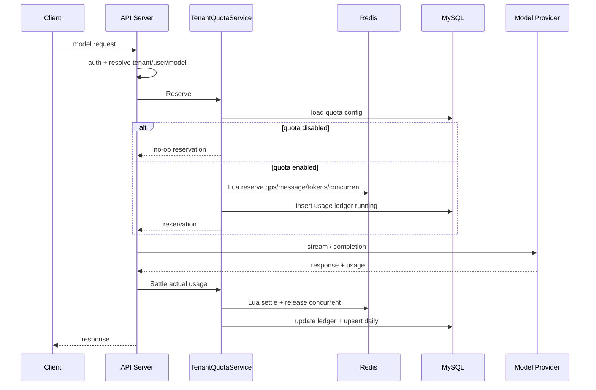

# Tenant Quota and Usage Technical Plan

## 1. 背景与目标

当前 API Server 已具备 MySQL 多租户、Mobile Chat 配额雏形、tenant telemetry 和 trace 能力，但还没有统一的租户级限流、每日 token 限额和用量看板。现有 Mobile limiter 以 `tenant:user` 为 key，主要覆盖 `/mobile/chat/...`，不能表达“租户 A 总 QPS 10、日 token 100 万；租户 B 总 QPS 20、日 token 200 万；租户 C 不限制”这类套餐级策略。

本方案目标是在保持现有 API 兼容的前提下，新增统一租户 quota 能力：

- 支持租户级开关：某租户启用限流限额，某租户只记录用量不限额。
- 支持租户级 QPS、每日 token、每日 message、最大并发请求限制。
- 支持 `/mobile/chat/...`、`/query`、`/v1/chat/completions` 和后续 goal/background/agent 统一接入。
- 支持 Redis 原子实时限流，MySQL 持久化配置、账本、每日聚合。
- 支持 WebUI/API 查看每个租户的用量、额度、剩余额度和超限事件，并在 WebUI 中配置租户 token 用量限制和 quota 开关。

## 0. 当前实现状态

截至当前实现，已落地：

- MySQL migration：`tenant_quota_configs`、`tenant_usage_ledger`、`tenant_usage_daily`、`tenant_quota_events`。
- `internal/quota`：进程内 store 和 Redis Lua store，支持 QPS、每日 token/message、最大并发、reserve/settle。
- API 接入：`/query`、`/v1/chat/completions`、`/mobile/chat/.../stream`、`/mobile/chat/.../regenerate` 已接入统一租户 quota；Mobile 原 JWT/user 级限流保留。
- Tenant API：`GET/PUT /tenant/quota/config`、`GET /tenant/usage/daily`、`GET /tenant/usage/ledger`、`GET /tenant/quota/events`。
- WebUI：Observability -> Quota 支持查看配置、daily usage、ledger、events，并可保存 quota 开关和 QPS/token/message/concurrent/timezone/reserve output token。
- 启动配置：`GOLANG_CLAUDE_CODE_QUOTA_REDIS_*` 可选择 Redis 作为多实例共享实时计数后端；未配置时使用进程内 store。

仍属于后续增强：

- WebUI 近 30 天趋势图、剩余额度细分和 member 只读 UI 显式禁用。
- daily aggregate 重算命令、Prometheus quota 指标和 Redis 异常 fail-open/fail-closed 策略开关。
- 平台 owner 跨租户统一管理页。

## 2. 需求范围与不做范围

### 范围内

- 新增租户 quota 配置模型，可表达启用/关闭、单项不限额、不同租户不同额度。
- 新增请求入场检查：QPS、最大并发、每日 message、每日 token 预扣。
- 新增请求完成结算：真实 input/output/cache token 落账，释放并发，修正预扣差额。
- 新增 MySQL usage ledger 和 daily aggregate，用于审计和 WebUI 查询。
- 新增 tenant admin API：读取/更新当前租户 quota 配置，查询租户用量。
- WebUI 增加租户用量/配额入口，支持查看用量、查看当前限制、配置每日 token 限制、启停 quota、配置 QPS/message/concurrent 等限制。
- 保留现有 Mobile JWT claim 配额能力，但逐步迁移到统一 quota service。

### 不做范围

- 不做真实计费扣款、发票、支付、账单合同系统。
- 不做跨自然月套餐结转、阶梯计价、预付费余额。
- 不改变已有 `/tenant/telemetry` 和 trace API 的响应兼容性。
- 不要求一次性迁移历史 telemetry 为完整账本；历史用量可按 telemetry/message 做只读补充统计。

### 依赖

- 生产级限流依赖 Redis。未配置 Redis 时可降级为进程内 limiter，但只适合单实例本地开发。
- 用量查询依赖 MySQL tenant storage。
- token 结算依赖 provider 返回 usage；provider 未返回时使用估算并标记 `estimated=true`。

## 3. 当前状态基线

| 能力 | 当前状态 | 缺口 |
| --- | --- | --- |
| Mobile 限流/配额 | 支持 `rate_limit_per_minute`、`daily_message_quota`、`daily_token_quota`，可用 Redis/file/in-memory store。 | key 是 `tenant:user`，不是租户总池；只覆盖 mobile stream/regenerate。 |
| 租户配置 | `tenants.settings_json` 可存 JSON。 | 没有明确 quota schema、管理 API 和校验。 |
| Token 记录 | `tenant_session_messages`、`tenant_telemetry_events` 有 token 字段。 | 没有账本表、日聚合表、超限记录和按租户用量 API。 |
| WebUI 展示 | Observability/Telemetry 面板会对当前拉取事件前端求和。 | 不是租户用量中心，不适合查日用量、额度、剩余额度。 |
| 通用 API 入口 | `/query`、`/v1/chat/completions` 支持 tenant persistence。 | 没有统一 quota 入场检查和结算。 |

## 4. 业务模块拆解

| 模块 | 业务目标 | 主要实体 | 主要动作 | 依赖/边界 |
| --- | --- | --- | --- | --- |
| Quota 配置 | 定义每个租户的限额策略 | tenant quota config | 创建、更新、读取、关闭 | tenant admin 权限、audit |
| 实时限流 | 请求进入模型前判断是否允许 | Redis counters | reserve、settle、release | Redis Lua 原子操作 |
| 用量账本 | 保存每次请求的可审计 token 用量 | usage ledger | 预扣、结算、失败标记 | query/mobile/openai 统一接入 |
| 日聚合 | 支撑 WebUI 快速查询和报表 | usage daily | upsert aggregate、补偿重算 | MySQL 索引和定时修复 |
| 用量查询 | 给运营/admin 看租户消耗 | usage API response | 按天/模型/用户/入口查询 | owner/admin 权限 |
| WebUI | 可视化和配置 quota/usage | Usage/Quota page | 查看配置、编辑限制、消耗、剩余额度、超限 | 复用现有 identity/tenant API，owner/admin 才能保存 |
| 审计观测 | 记录配置变更和超限事件 | audit/telemetry | audit log、quota events | 不记录敏感正文 |

## 5. B端/C端功能拆解

| 端 | 场景 | 能力 | 权限 | 数据读写 | 备注 |
| --- | --- | --- | --- | --- | --- |
| B端 WebUI/API | 管理租户套餐 | 查看/更新 quota 配置；配置每日 token 限额和 quota 开关 | owner/admin | 写 `tenant_quota_configs`，写 audit | 初期只支持当前租户；平台 owner 后续可跨租户 |
| B端 WebUI/API | 查看用量 | 按日、模型、用户、入口查看 token/message/request | owner/admin | 读 `tenant_usage_daily` 和 ledger 明细 | 默认近 30 天 |
| C端/API 调用方 | 发起模型请求 | 被动接受限流/限额策略 | 当前 tenant/user | Redis reserve，MySQL ledger | 超限返回稳定错误码 |
| 系统后台 | 请求完成结算 | 写真实 usage、释放并发 | server internal | 写 ledger/daily，发 telemetry | 失败和取消也必须结算 |

## 6. 数据模型与 MySQL 设计

### 6.1 `tenant_quota_configs`

用途：保存租户级 quota 策略。正式配置放表里，`tenants.settings_json` 仅作为灰度兼容或导入来源。

| 字段 | 类型 | 说明 | 索引 |
| --- | --- | --- | --- |
| `id` | BIGINT UNSIGNED | 主键 | PK |
| `tenant_id` | BIGINT UNSIGNED NOT NULL | 租户 ID | UNIQUE |
| `quota_enabled` | TINYINT(1) NOT NULL DEFAULT 0 | 是否执行限流限额；关闭时只记录 usage | `idx_quota_enabled` 可选 |
| `qps_limit` | INT UNSIGNED NULL | 租户级每秒请求数；NULL 表示不限 |  |
| `daily_token_limit` | BIGINT UNSIGNED NULL | 租户自然日 token 上限；NULL 表示不限 |  |
| `daily_message_limit` | INT UNSIGNED NULL | 租户自然日 message/request 上限；NULL 表示不限 |  |
| `max_concurrent_requests` | INT UNSIGNED NULL | 租户最大并发模型请求数；NULL 表示不限 |  |
| `timezone` | VARCHAR(64) NOT NULL DEFAULT 'UTC' | 日额度切换时区 |  |
| `reserve_output_tokens` | INT UNSIGNED NOT NULL DEFAULT 4096 | 未指定 max tokens 时的 output 预扣量 |  |
| `status` | VARCHAR(32) NOT NULL DEFAULT 'active' | active/disabled |  |
| `updated_by_user_id` | BIGINT UNSIGNED NULL | 最近操作人 |  |
| `created_at` / `updated_at` | TIMESTAMP(6) | 审计时间 |  |

语义：

- `quota_enabled=false`：跳过 Redis quota 检查，但仍写 usage ledger/daily。
- `quota_enabled=true` 且某个 limit 为 `NULL`：该维度不限。
- 不使用 `0` 表示不限，避免与“配置错误”混淆；`0` 应被 API 校验拒绝或归一化为 `NULL`。

### 6.2 `tenant_usage_ledger`

用途：每次模型请求的账本和结算记录，支撑审计、回放、补偿和明细查询。

| 字段 | 类型 | 说明 | 索引 |
| --- | --- | --- | --- |
| `id` | BIGINT UNSIGNED | 主键 | PK |
| `request_id` | VARCHAR(128) NOT NULL | 服务端生成的请求唯一 ID | UNIQUE |
| `tenant_id` | BIGINT UNSIGNED NOT NULL | 租户 ID | `idx_ledger_tenant_day` |
| `user_id` | BIGINT UNSIGNED NULL | 用户 ID | `idx_ledger_user_day` |
| `session_id` | BIGINT UNSIGNED NULL | 关联 session | `idx_ledger_session` |
| `trace_id` | VARCHAR(128) NULL | trace 关联 | `idx_ledger_trace` |
| `source` | VARCHAR(32) NOT NULL | mobile/query/openai/goal/background/agent | `idx_ledger_source_day` |
| `route` | VARCHAR(128) NULL | HTTP route 或内部入口 |  |
| `model` | VARCHAR(128) NULL | 模型 | `idx_ledger_model_day` |
| `status` | VARCHAR(32) NOT NULL | reserved/running/succeeded/failed/cancelled/rejected | `idx_ledger_status_day` |
| `estimated` | TINYINT(1) NOT NULL DEFAULT 0 | token 是否估算 |  |
| `reserved_input_tokens` | INT UNSIGNED NOT NULL DEFAULT 0 | 入场预扣 input |  |
| `reserved_output_tokens` | INT UNSIGNED NOT NULL DEFAULT 0 | 入场预扣 output |  |
| `input_tokens` | INT UNSIGNED NOT NULL DEFAULT 0 | 实际 input |  |
| `output_tokens` | INT UNSIGNED NOT NULL DEFAULT 0 | 实际 output |  |
| `cache_read_input_tokens` | INT UNSIGNED NOT NULL DEFAULT 0 | cache read |  |
| `cache_creation_input_tokens` | INT UNSIGNED NOT NULL DEFAULT 0 | cache write |  |
| `total_tokens` | INT UNSIGNED NOT NULL DEFAULT 0 | 计费/限额口径 token |  |
| `error_code` / `error_message` | VARCHAR | 错误信息，需脱敏 |  |
| `started_at` / `finished_at` | TIMESTAMP(6) | 请求生命周期 | `idx_ledger_tenant_day` |
| `created_at` / `updated_at` | TIMESTAMP(6) | 审计时间 |  |

建议索引：

```sql
UNIQUE KEY uk_usage_ledger_request (request_id)
KEY idx_usage_ledger_tenant_day (tenant_id, started_at, id)
KEY idx_usage_ledger_user_day (tenant_id, user_id, started_at)
KEY idx_usage_ledger_model_day (tenant_id, model, started_at)
KEY idx_usage_ledger_trace (tenant_id, trace_id)
```

### 6.3 `tenant_usage_daily`

用途：按天聚合，支撑 WebUI 列表和 quota dashboard，避免扫 ledger/telemetry 明细。

| 字段 | 类型 | 说明 | 索引 |
| --- | --- | --- | --- |
| `id` | BIGINT UNSIGNED | 主键 | PK |
| `tenant_id` | BIGINT UNSIGNED NOT NULL | 租户 ID | UNIQUE 组合 |
| `usage_date` | DATE NOT NULL | 按 quota timezone 归属的日期 | UNIQUE 组合 |
| `source` | VARCHAR(32) NOT NULL DEFAULT '*' | source 维度，`*` 表示总计 | UNIQUE 组合 |
| `model` | VARCHAR(128) NOT NULL DEFAULT '*' | model 维度，`*` 表示总计 | UNIQUE 组合 |
| `request_count` | BIGINT UNSIGNED NOT NULL DEFAULT 0 | 请求数 |  |
| `message_count` | BIGINT UNSIGNED NOT NULL DEFAULT 0 | message 数 |  |
| `input_tokens` / `output_tokens` | BIGINT UNSIGNED | token 聚合 |  |
| `cache_read_input_tokens` / `cache_creation_input_tokens` | BIGINT UNSIGNED | cache 聚合 |  |
| `total_tokens` | BIGINT UNSIGNED NOT NULL DEFAULT 0 | 总 token |  |
| `rejected_count` | BIGINT UNSIGNED NOT NULL DEFAULT 0 | quota 拒绝次数 |  |
| `updated_at` | TIMESTAMP(6) | 更新时间 |  |

唯一键：

```sql
UNIQUE KEY uk_usage_daily_dim (tenant_id, usage_date, source, model)
KEY idx_usage_daily_date (usage_date, tenant_id)
```

### 6.4 `tenant_quota_events`

用途：记录超限、配置异常、Redis 降级等事件，便于排障和 WebUI 展示。

字段：`tenant_id`、`user_id`、`request_id`、`event_type`、`limit_type`、`limit_value`、`current_value`、`source`、`route`、`model`、`trace_id`、`metadata_json`、`created_at`。

事件类型：

- `quota.rejected.qps`
- `quota.rejected.daily_tokens`
- `quota.rejected.daily_messages`
- `quota.rejected.concurrent`
- `quota.degraded.redis_unavailable`
- `quota.config.updated`

## 7. 分层技术设计

### 7.1 Model/Constant

新增包建议：`internal/quota`。

核心类型：

- `Config`：租户 quota 配置。
- `LimitDecision`：allow/reject、reject reason、retry after、remaining。
- `Reservation`：request id、reserved tokens、Redis keys、started time。
- `Usage`：实际 usage，兼容 `query.Usage`、`anthropic.Usage`。
- `Source`：`mobile`、`query`、`openai`、`goal`、`background`、`agent`。

错误码：

- `ErrQuotaDisabled` 不作为错误，仅表示跳过检查。
- `ErrQuotaRateLimited`
- `ErrQuotaDailyTokensExceeded`
- `ErrQuotaDailyMessagesExceeded`
- `ErrQuotaConcurrentExceeded`
- `ErrQuotaBackendUnavailable`

### 7.2 Repository

在 `internal/storage/mysql` 增加方法：

- `GetTenantQuotaConfig(ctx, tenantID) (quota.Config, error)`
- `UpsertTenantQuotaConfig(ctx, input) error`
- `InsertUsageLedger(ctx, input) (uint64, error)`
- `UpdateUsageLedgerSettlement(ctx, requestID, settlement) error`
- `UpsertUsageDailyDelta(ctx, delta) error`
- `ListTenantUsageDaily(ctx, tenantID, filter) ([]UsageDaily, error)`
- `ListTenantUsageLedger(ctx, tenantID, filter) ([]UsageLedger, error)`
- `InsertQuotaEvent(ctx, input) error`

事务边界：

- 请求入场时：读取 config + Redis reserve + 插入 ledger `reserved/running`。如果 ledger 插入失败，应释放 Redis 预扣。
- 请求完成时：更新 ledger + upsert daily delta + Redis settle/release。MySQL 更新失败时记录 telemetry error，并允许后台补偿任务从 ledger 重算 daily。

### 7.3 Service

新增 `TenantQuotaService`：

```go
type TenantQuotaService interface {
    GetConfig(ctx context.Context, tenantID uint64) (quota.Config, error)
    SaveConfig(ctx context.Context, req SaveQuotaConfigRequest) error
    Reserve(ctx context.Context, req ReserveRequest) (quota.Reservation, error)
    Settle(ctx context.Context, reservation quota.Reservation, usage quota.Usage, status string, err error) error
    ListUsageDaily(ctx context.Context, filter UsageFilter) (UsageDailyPage, error)
    ListUsageLedger(ctx context.Context, filter UsageFilter) (UsageLedgerPage, error)
}
```

核心规则：

- `quota_enabled=false`：`Reserve` 返回 no-op reservation，`Settle` 仍写 usage ledger/daily。
- `quota_enabled=true`：Redis Lua 原子检查并预扣 QPS/message/token/concurrent。
- 每日 token limit 使用 `reserved_input_tokens + reserved_output_tokens` 预扣；结算时按真实 `total_tokens` 修正。
- 请求失败/取消：释放 concurrent；按已实际产生的 usage 结算 token，未产生 usage 的释放预扣。
- Redis 不可用：
  - 默认 fail-closed：启用 quota 的租户返回 503/429，避免超卖。
  - 可通过 server 配置 `GOLANG_CLAUDE_CODE_QUOTA_FAIL_OPEN=true` 临时降级，只记录事件，不拒绝请求。

### 7.4 Redis 设计

Redis key：

```text
quota:{tenant_id}:qps:{unix_second}
quota:{tenant_id}:daily_messages:{yyyymmdd}
quota:{tenant_id}:daily_tokens:{yyyymmdd}
quota:{tenant_id}:concurrent
quota:{tenant_id}:reservation:{request_id}
```

Reserve Lua 一次完成：

1. 读取 config 参数。
2. 检查 qps、daily messages、daily tokens、concurrent。
3. 通过则 INCR/INCRBY 计数，并写 reservation hash。
4. 返回 remaining、retry_after、current values。

Settle Lua：

1. 读取 reservation。
2. 释放 concurrent。
3. 使用实际 token 与预扣 token 的差值修正 daily token counter。
4. 删除 reservation。

### 7.5 API/Controller

在 `internal/server` 新增 tenant quota handlers，沿用现有 auth 和 role 机制。

- `GET /tenant/quota/config`
- `PUT /tenant/quota/config`
- `GET /tenant/usage/daily`
- `GET /tenant/usage/ledger`
- `GET /tenant/quota/events`

API 响应时间字段保持现有 Go JSON time 格式；如果前端需要 13 位毫秒字段，可新增 `started_at_ms` 等新字段，不改变已有字段语义。

### 7.6 WebUI 设计

在 `web/` 新增 Usage/Quota 管理视图，建议放在现有 Observability 或 Settings/Administration 分区下，避免和 Trace 明细混淆。页面必须同时支持“查看”和“配置”：

- 顶部摘要：当前租户、quota 状态、今日 token 用量、每日 token 限额、剩余 token、QPS 限制、并发限制、今日拒绝次数。
- 配置表单：`quota_enabled` 开关、`daily_token_limit` 数字输入、`qps_limit` 数字输入、`daily_message_limit` 数字输入、`max_concurrent_requests` 数字输入、`timezone` 选择、`reserve_output_tokens` 数字输入。
- 不限额表达：每个 limit 字段提供“Unlimited”开关或清空按钮；提交给 API 时使用 `null`，不要提交 `0`。
- 保存行为：只有 owner/admin 可以编辑和保存；member 只读并显示禁用态。
- 风险提示：关闭 `quota_enabled` 时明确显示“只记录用量，不拦截请求”；开启但 `daily_token_limit=null` 时显示“token 不限额”。
- 保存后刷新：保存成功后重新拉取 config 和 usage summary，确保剩余额度和状态一致。
- 审计可见：最近一次修改人、修改时间、quota config updated 事件在页面可见或可跳转 audit/telemetry。
- 数据隔离：切换 WebUI tenant identity 后，页面必须重新加载当前租户的 config/usage，不能复用上个租户缓存。
- 错误态：Redis 未配置、tenant storage 未配置、权限不足、校验失败、保存冲突都要有明确错误状态。

前端 API client 需要新增：

- `getTenantQuotaConfig()`
- `updateTenantQuotaConfig(payload)`
- `listTenantUsageDaily(params)`
- `listTenantUsageLedger(params)`
- `listTenantQuotaEvents(params)`

### 7.7 入口接入点

统一封装：

```go
reservation, err := quotaSvc.Reserve(ctx, quota.ReserveRequest{
    TenantKey: tenantKey,
    UserKey: userKey,
    Source: "openai",
    Route: "/v1/chat/completions",
    Model: model,
    EstimatedInputTokens: estimatedInput,
    ReservedOutputTokens: maxOutputReserve,
})
if err != nil { writeQuotaError(...) ; return }
defer quotaSvc.Settle(ctx, reservation, usage, status, runErr)
```

接入顺序：

1. `/mobile/chat/sessions/:id/messages/stream`
2. `/mobile/chat/sessions/:id/messages/:message_id/regenerate`
3. `/query`
4. `/v1/chat/completions`
5. `tenant goals run`
6. background / loop / agent internal requests

## 8. API 设计

### 8.1 获取当前租户 quota 配置

```http
GET /tenant/quota/config
Authorization: Bearer <token>
X-Tenant-Key: yutang
X-User-Id: admin
```

响应：

```json
{
  "tenant_id": 1,
  "quota_enabled": true,
  "qps_limit": 10,
  "daily_token_limit": 1000000,
  "daily_message_limit": null,
  "max_concurrent_requests": 10,
  "timezone": "Asia/Shanghai",
  "reserve_output_tokens": 4096,
  "status": "active",
  "updated_at": "2026-06-26T12:00:00Z"
}
```

### 8.2 更新当前租户 quota 配置

```http
PUT /tenant/quota/config
```

请求：

```json
{
  "quota_enabled": true,
  "qps_limit": 10,
  "daily_token_limit": 1000000,
  "daily_message_limit": null,
  "max_concurrent_requests": 10,
  "timezone": "Asia/Shanghai",
  "reserve_output_tokens": 4096
}
```

权限：`owner/admin`。

校验：

- limit 字段必须为正整数或 null。
- `quota_enabled=false` 时允许所有 limit 为 null。
- timezone 必须是 Go 可加载的 IANA timezone。
- 更新成功写 `tenant_audit_logs` 和 `tenant_quota_events`。

### 8.3 查询日用量

```http
GET /tenant/usage/daily?from=2026-06-01&to=2026-06-26&source=*&model=*&limit=100
```

响应：

```json
{
  "data": [
    {
      "usage_date": "2026-06-26",
      "source": "*",
      "model": "*",
      "request_count": 120,
      "message_count": 120,
      "input_tokens": 700000,
      "output_tokens": 200000,
      "cache_read_input_tokens": 50000,
      "cache_creation_input_tokens": 20000,
      "total_tokens": 900000,
      "daily_token_limit": 1000000,
      "remaining_tokens": 100000,
      "rejected_count": 3
    }
  ],
  "has_more": false
}
```

### 8.4 查询账本明细

```http
GET /tenant/usage/ledger?from=2026-06-26&to=2026-06-26&source=openai&model=glm-5.1&limit=100&cursor=0
```

用于排查具体请求、trace、session、模型、状态。

### 8.5 Quota 错误响应

HTTP 状态建议：

- QPS / concurrent：`429 Too Many Requests`
- daily token/message quota：`402 Payment Required` 或 `429 Too Many Requests`
- quota backend unavailable 且 fail-closed：`503 Service Unavailable`

响应：

```json
{
  "error": {
    "type": "quota_exceeded",
    "code": "daily_token_limit_exceeded",
    "message": "tenant daily token quota exceeded",
    "limit": 1000000,
    "current": 1000100,
    "retry_after_seconds": 3600
  }
}
```

OpenAI-compatible endpoint 需要保持 OpenAI error envelope 形态。

## 9. 核心流程与状态流转

### 9.1 请求主流程



### 9.2 状态流转

| 当前状态 | 动作 | 校验 | 下一状态 | 副作用 |
| --- | --- | --- | --- | --- |
| none | reserve allowed | quota enabled and Redis allow | running | Redis 预扣；insert ledger |
| none | reserve rejected | 超过 qps/token/message/concurrent | rejected | insert quota event；返回错误 |
| running | provider success | usage available | succeeded | settle Redis；ledger/daily 写真实 usage |
| running | provider error | error occurred | failed | release concurrent；按已产生 usage 结算 |
| running | client cancel | context canceled | cancelled | release concurrent；按已有 usage 结算 |
| running | settle failed | MySQL/Redis 异常 | settlement_pending | telemetry error；后台补偿 |

## 10. 渐进式开发计划

### Phase 1：数据模型和 service 骨架

- 新增 migrations：quota config、usage ledger、usage daily、quota events。
- 新增 `internal/quota` 类型、错误码、Redis store 接口。
- 新增 MySQL repository 方法和单元测试。
- 验收：`go test ./internal/storage/mysql ./internal/quota -count=1`。

### Phase 2：Redis reserve/settle

- 实现 Redis Lua reserve/settle。
- 实现 in-memory fallback，仅用于测试/单实例开发。
- 覆盖 qps、daily tokens、daily messages、concurrent、disabled、null limit。
- 验收：并发单测证明不会超卖；Redis 不可用 fail-open/fail-closed 可测。

### Phase 3：API 和审计

- 新增 `/tenant/quota/config`、`/tenant/usage/daily`、`/tenant/usage/ledger`、`/tenant/quota/events`。
- 更新 Swagger annotations/types。
- 更新 `docs/api_server.md`。
- 验收：handler/service/repository 测试；`swag init` 生成文件更新。

### Phase 4：请求入口接入

- 先接 mobile stream/regenerate，替换旧 mobile usage store 或做兼容桥接。
- 再接 `/query` 和 `/v1/chat/completions`。
- 确保所有入口写同一 ledger/daily。
- 验收：真实 server + curl 覆盖允许、超 QPS、超 token、disabled 租户不限额。

### Phase 5：WebUI Usage 页面

- 新增 Usage/Quota view，作为租户用量和限额配置的正式入口。
- 支持 owner/admin 编辑并保存租户 quota 配置，至少覆盖 quota 开关和每日 token 限额；同时支持 QPS、message、concurrent、timezone、reserve output token。
- 支持 member 只读查看配置和用量，不显示可提交的编辑能力。
- 展示 quota config、今日 token、剩余额度、近 7\30 天趋势、按模型/source 分布、超限事件。
- 保存配置后写 audit，并在 WebUI 中刷新展示最新配置和剩余额度。
- 验收：前端单测、Playwright mock smoke、真实 MySQL live E2E。

### Phase 6：补偿和运维

- 增加 daily aggregate 重算命令或 admin API。
- 增加 Prometheus/telemetry 指标：quota rejected、remaining、settle failed。
- 增加生产部署文档和 runbook。

## 11. 风险点、兼容性与降级策略

| 风险 | 影响 | 策略 |
| --- | --- | --- |
| Redis 不可用 | 启用 quota 的租户无法准确限流 | 默认 fail-closed；可临时 fail-open 并记录 quota event |
| Provider 不返回 usage | token 结算不准 | 使用估算 token，ledger 标记 `estimated=true` |
| SSE 长连接占用 | QPS 不足以控制资源 | 必须增加 `max_concurrent_requests` |
| 预扣过大导致误拒 | 用户明明没用完但被挡 | 支持按请求 max tokens 计算；默认 reserve 可配置 |
| 结算失败 | Redis/MySQL 计数不一致 | ledger 状态标记，后台补偿重算 daily；Redis TTL 防永久占用 |
| 历史数据缺失 | 初期报表不完整 | 新表只保证上线后精确；历史从 telemetry/message 做可选补充 |
| 多入口遗漏 | 部分请求绕过 quota | 建立统一 middleware/service，入口接入列入测试矩阵 |
| 权限越权 | 租户看到其他租户用量 | 所有 usage API 必须 `tenant_id` 过滤并复用 `RequireRole` |

## 12. 测试与验收清单

### 单元测试

- Config 校验：enabled/disabled、null limit、非法 0、timezone。
- Redis reserve：QPS、daily token、daily message、concurrent。
- Redis settle：成功、失败、取消、预扣回补、reservation 缺失。
- MySQL repository：config upsert、ledger insert/update、daily upsert、list filters。
- Service：quota disabled 只记录不拦截；enabled 超限拒绝；Redis 异常策略。

### API 测试

- `GET/PUT /tenant/quota/config` 权限、校验、audit。
- `GET /tenant/usage/daily` 日期范围、source/model 筛选、空数据。
- `GET /tenant/usage/ledger` 分页、trace/session/model 筛选。
- 超限错误码和 OpenAI-compatible error envelope。

### 集成测试

- 启动真实 API Server + MySQL + Redis。
- 租户 A：`qps_limit=1`，连续两次请求第二次返回 429。
- 租户 A：`daily_token_limit=100`，超限返回 quota error。
- 租户 C：`quota_enabled=false`，无限额但 ledger/daily 仍写入。
- `/mobile/chat`、`/query`、`/v1/chat/completions` 都产生统一 usage ledger。
- SSE cancel 后 concurrent 释放。

### WebUI 验收

- Usage 页面能显示当前租户 quota config。
- owner/admin 能在 WebUI 打开/关闭 `quota_enabled`，保存每日 token 限额，例如 1000000，并刷新后保持一致。
- 租户 C 能在 WebUI 配置 `quota_enabled=false` 或 `daily_token_limit=null`，页面明确显示不限额。
- limit 字段清空或选择 Unlimited 时，API payload 使用 `null`；输入 `0` 或负数时前端阻止提交并显示校验错误。
- member 打开 Usage 页面只能查看，不能保存 quota config。
- 今日 token、剩余额度、近 30 天趋势正确。
- 超限事件可见，能跳转 trace/session。
- 不同 tenant identity 切换后数据隔离正确。

### 命令建议

```bash
go test ./internal/quota ./internal/storage/mysql ./internal/server ./internal/tenant -count=1
go test ./... -count=1
swag init -g cmd/golang-cc/main.go --parseInternal --parseDependency
npm --prefix web run test
npm --prefix web run test:e2e
git diff --check
```

## 13. Open Questions

- 日额度按哪个时区为准：租户配置 timezone、服务器 UTC，还是固定 Asia/Shanghai？
- Token 限额口径是否包含 cache read/cache creation tokens？建议默认 `input + output`，cache 字段单独展示；如要按成本计费可新增 weighted token。
- OpenAI-compatible 的 `max_tokens` 缺省预扣量使用多少合适？建议初始 4096，可租户级配置。
- 租户配置第一版由当前租户 owner/admin 在 WebUI 自己维护；是否需要平台 owner 跨租户统一管理页作为后续阶段？
- 超限时 HTTP 状态使用 402 还是 429？建议 QPS/concurrent 用 429，日额度用 402；如果客户端兼容性优先，可统一 429。
