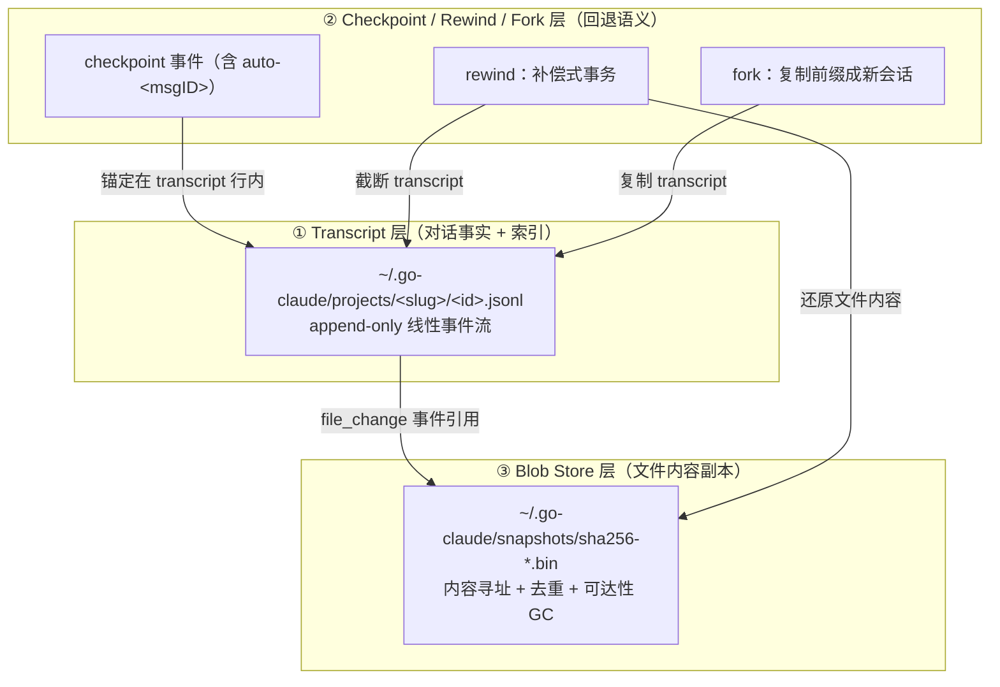

# Transcript 与 Checkpoint 机制优化技术方案

> 状态：Draft（待评审）
> 范围：`internal/session`、`internal/files`、`internal/query`、`internal/cli` 中与 transcript / checkpoint / 文件快照 / resume 相关的存储与回退链路。
> 关联：本文是 [transcript_schema_isolation_and_resume_plan.md](transcript_schema_isolation_and_resume_plan.md)（路径隔离与 v2 schema 设计）的续篇，聚焦“存储职责拆分”与“文件历史生命周期”，不重复 schema 隔离方案。

---

## 0. 文档目的

本文回答三个问题：

1. go-claude 现在的 transcript / checkpoint / 文件快照到底是怎么存、怎么回退的（以代码为准）。
2. 和原版 Claude Code 相比，差在哪、各自的取舍是什么。
3. 未来要不要优化、按什么优先级优化、每一项怎么落地、怎么验收。

阅读对象：本项目维护者、以及第一次接触会话存储链路的新同学。所有术语在第 1 节统一解释，正文出现时不再展开。

---

## 1. 术语表（先读这一节）

| 术语 | 一句话解释 | 在本项目中的对应 |
|---|---|---|
| **transcript（会话流水账）** | 一次会话从头到尾的完整记录，一行一个事件的 `.jsonl` 文件。 | `~/.go-claude/projects/<slug>/<id>.jsonl` |
| **event sourcing（事件溯源）** | 一种存储范式：不存“当前状态”，只按顺序追加“发生过的事件”，需要时靠重放事件推导出状态。 | transcript 就是事件日志；resume 时重放成模型上下文 |
| **entry / event（事件条目）** | transcript 里的一行 JSON，代表一件发生过的事，如一条消息、一次工具调用。 | `session.Entry`（[store.go:21](../../internal/session/store.go:21)） |
| **turn（轮次）** | 一“轮”交互：从一条**用户消息**开始，到模型把该消息处理完（期间可能调用多次工具）为止。一个 turn 内可以有很多 entry。 | 每个 turn 起点会自动打一个 `auto-<messageID>` checkpoint |
| **checkpoint（存档点）** | transcript 里的一行标记，代表“可以回退到这里”。它**不是单独文件**，删掉 transcript 它也没了。 | `{"type":"checkpoint"}` 事件 |
| **auto-checkpoint（自动存档点）** | 系统在每条用户消息前自动打的 checkpoint，用于“回退到某条消息”。 | `auto-<messageID>`（[query.go:1225](../../internal/query/query.go:1225)） |
| **rewind（回退）** | 回到某个 checkpoint / 某条消息的状态。可以只回退对话、只回退文件、或两者都回退。 | `RewindFiles` / `RewindConversationToMessage` / `RewindToMessage`（[store.go:551](../../internal/session/store.go:551)） |
| **fork（分叉）** | 把一个会话从某个点复制成一个**新会话**，之后各走各的，不影响原会话。 | `Store.Fork`（[store.go:631](../../internal/session/store.go:631)） |
| **compact（压缩）** | 上下文太长时，把前面的历史总结成一段摘要，替换掉原始历史以省 token。 | `compact_summary` 事件；resume 时它会**硬重置**上下文 |
| **snapshot（文件快照）** | 某个文件在某个时刻的**内容副本**，用于 rewind 时把文件还原回去。 | `file_change` 事件里记录的 before/after |
| **blob（二进制大对象）** | Binary Large Object，泛指“一坨文件内容”。这里特指被单独存起来的文件内容副本。 | `sha256-<hex>.bin` |
| **blob store（内容仓库）** | 专门存放 blob 的目录，和 transcript 分开放。 | `~/.go-claude/snapshots/`（[snapshotstore.go:23](../../internal/files/snapshotstore.go:23)） |
| **content-addressed（内容寻址）** | 用“内容的哈希值”当文件名。好处：**相同内容天然只存一份**（去重）。 | 用 sha256 命名 blob（[snapshotstore.go:60](../../internal/files/snapshotstore.go:60)） |
| **inline（内联）** | 把文件内容**直接塞进 transcript 那一行**里，而不是外置成 blob。 | ≤8 KiB 的内容目前内联 |
| **externalize（外置）** | 反过来：把内容从 transcript 里挪出去，存成 blob，transcript 只留一个引用（路径 + 哈希）。 | `externalizeBefore`（[capture.go](../../internal/files/capture.go)），阈值 8 KiB |
| **GC（垃圾回收）** | 清理“已经没人用到”的 blob，回收磁盘空间。 | `GCSnapshots`（[snapshotstore.go:76](../../internal/files/snapshotstore.go:76)） |
| **reachability（可达性）** | 判断一个 blob 还有没有用：只要还有 transcript 引用它，就“可达”，不能删。 | `collectSnapshotReferences`（[store.go:424](../../internal/session/store.go:424)） |
| **resume（恢复）** | 读回旧 transcript，把上下文接续给模型，继续对话。 | `MessagesFromTranscript`（[query.go:1965](../../internal/query/query.go:1965)） |
| **compensating transaction（补偿式事务）** | 没有数据库 ACID 时的一种“全有或全无”做法：出错时把已经做的操作一步步撤销回去。 | rewind 的还原流程（[store.go:815](../../internal/session/store.go:815)） |
| **message graph（消息图）** | 用 `uuid` / `parentUuid` 把消息连成一棵树，可以表达 retry、分支、多结局。**原版 Claude Code 用这个；go-claude 用的是线性事件流。** | 见第 3 节对比 |
| **slug** | 把 `--cwd` 绝对路径转成的目录名（去掉开头 `/`，`/` 换成 `-`）。 | `ProjectSlug`（[store.go:1396](../../internal/session/store.go:1396)） |

---

## 2. 当前架构现状（以代码为准）

### 2.1 三层职责



一句话：**transcript 是主时间轴，checkpoint 是这条时间轴上的锚点，blob store 是被时间轴引用的文件内容仓库。**

### 2.2 Transcript 层

- 一个 session = 一个 JSONL 文件，`Recorder.Append` 逐行追加（[store.go:210](../../internal/session/store.go:210)）。
- **线性**事件流，不是消息图。事件类型近 20 种（[transcript_format.go:104](../../internal/session/transcript_format.go:104)）。
- 默认写 `~/.go-claude`，与原版 `~/.claude` 隔离，避免互相污染。
- Schema 探测能区分 `v1 / v2 / claude_code_native / unknown / mixed`（[transcript_format.go:56](../../internal/session/transcript_format.go:56)）。
  > 注：本节描述的是本文撰写时的**线性现状**（用于说明 P2 的动机）。**P2-6 已落地**：`ValidateResumeFormat` 现放行 v1 与 v2（v2 走 leaf-walk 恢复），仅拒绝原版/unknown/mixed；**v2 消息图已实现并默认开启**（opt-out：`GOLANG_CLAUDE_CODE_FEATURE_TRANSCRIPT_V2=0`）。详见下文 P2-6 与 [transcript_v2_message_graph_and_nondestructive_rewind_plan.md](transcript_v2_message_graph_and_nondestructive_rewind_plan.md)。

### 2.3 Checkpoint / Rewind / Fork 层

- **自动 checkpoint**：每条用户消息前写 `auto-<messageID>`（[query.go:1225](../../internal/query/query.go:1225)），是“回退到某条消息”的锚点。
- **手动 / goal checkpoint**：`session checkpoint <id> [name]`；goal 每轮前也会自动打点。
- **Rewind 三种语义解耦**（[store.go:551](../../internal/session/store.go:551)）：
  - `RewindFiles`：只还原文件，**保留** transcript（追加一条 rewind 标记）。
  - `RewindConversationToMessage`：只回退对话。
  - `RewindToMessage`：文件 + 对话都回退。
  - CLI `/rewind` 对应 `--files-only / --conversation-only / --both`。
- **conversation rewind 是破坏性截断**：用 `O_TRUNC` 重写 transcript（[store.go:1114](../../internal/session/store.go:1114)），被回退掉的分支从此消失，无法 redo。
- **Rewind 是补偿式事务**（[store.go:815](../../internal/session/store.go:815)）：① 预检 blob 可读、目录可写 → ② 快照当前态作为 undo → ③ 逐个还原文件 → ④ 提交 transcript → 任一步失败**全部回滚**；文件替换用 temp + fsync + rename 原子完成。
- **Fork**：把 transcript 前缀复制成新 session id（[store.go:631](../../internal/session/store.go:631)），非破坏性分叉。

### 2.4 Blob Store 层（此处纠正一处过时文档）

- 文件工具（Edit/MultiEdit/Write/Bash）产生的变化，通过 `recordFileChange` 写成 `file_change` 事件（[query.go:3475](../../internal/query/query.go:3475)）。
- 文件内容 **> 8 KiB** 即 externalize 到 blob store，按 **sha256 命名 + 去重**（相同内容全局只存一份）（[snapshotstore.go:30](../../internal/files/snapshotstore.go:30)）。
- **可达性 GC**：扫描所有 transcript 的 `file_change` 引用，回收无人引用的 blob（[store.go:424](../../internal/session/store.go:424) + [snapshotstore.go:76](../../internal/files/snapshotstore.go:76)）。

> ⚠️ **文档修正点**：[session_quickstart.md](../session_quickstart.md) 第 9.8 节把“文件内容物理分离到 blob store”当成**未来方向**，并称“小文件 ≤ 1 MiB 内联”。这与现状不符：
> - 内容寻址 blob store + sha256 去重 + 可达性 GC **已经落地**。
> - 真正的 externalize 阈值是 **8 KiB**（`captureExternalizeThreshold`），不是 1 MiB。1 MiB（`journalInlineLimit`）是 rewind **undo journal** 的限额，是另一回事。
> 本方案的 P0-1 就是修正这处描述。

### 2.5 Resume 回放

- 入口 `MessagesFromTranscriptWithReport`（[query.go:2032](../../internal/query/query.go:2032)）。
- 先 `sanitize`（[query.go:2108](../../internal/query/query.go:2108)）：关闭悬空 `tool_use`（注入 synthetic error result）、丢弃 orphan result/thinking，避免上游 API 400。
- `compact_summary` 会**硬重置**上下文为一条摘要 user message（[query.go:2073](../../internal/query/query.go:2073)）。
- `recap_summary` 永远不进模型上下文，只做 UI 展示。

---

## 3. 与 Claude Code 的差异摘要

| 维度 | go-claude（本项目） | Claude Code（原版） |
|---|---|---|
| 时间模型 | 线性 JSONL 事件流 | `uuid`/`parentUuid` 消息图，按 leaf 重建当前链 |
| checkpoint 锚点 | 独立 checkpoint（支持命名）+ auto-per-message | user message UUID |
| 文件变化粒度 | **每次编辑一个 `file_change` 事件** | **turn 边界**每文件一个 snapshot，未变则复用 |
| 文件内容存储 | >8 KiB → blob；≤8 KiB 内联 transcript | 始终外置 `~/.claude/file-history/<sid>/`，版本化 |
| conversation rewind | **破坏性截断重写** | 重新指向 leaf（**非破坏性**，旧分支保留） |
| rewind 一致性取向 | 强一致（文件+transcript 绑定提交） | 可降级（文件历史失败不阻断主对话） |
| 分支 / retry | 靠 fork 复制前缀 | 消息图天然表达 retry/sidechain/多 leaf |
| transcript 职责 | 对话 + 文件 journal + 审计 + inspect | 对话图 + snapshot 索引（不含 blob） |

**结论**：go-claude 的“统一逻辑时间轴 + 通用 checkpoint + 补偿事务”方向和本项目“可测试 / 可观测 / CLI-TUI-server-goal 共用 runtime”的定位契合，不需要推倒重来。剩下的问题集中在“存储职责拆分”和“文件历史生命周期”，见下。

---

## 4. 问题清单（带优先级）

| 编号 | 问题 | 影响 | 优先级 |
|---|---|---|---|
| ISSUE-1 | 文档描述过时（blob store 说成“未来”、“1 MiB 内联”） | 认知误导，新人踩坑 | **P0** |
| ISSUE-2 | export / share transcript 会连文件内容一起带出去 | 源码 / `.env` / 密钥泄露面 | **P0** |
| ISSUE-3 | ≤8 KiB 内容仍内联 transcript | 小配置/密钥文件进 transcript；轻度膨胀 | **P0** |
| ISSUE-4 | 无 turn 级去重，一 turn 内同一文件改 N 次记 N 条 `file_change` | 长会话 resume/inspect/fork 变慢 | **P1** |
| ISSUE-5 | 文件历史与对话生命周期耦合，无法分别清理/限额 | 想只清文件副本、保留对话做不到 | **P1** |
| ISSUE-6 | 线性模型无法表达分支；conversation rewind 破坏性截断 | retry/分支对比/非破坏回退缺失 | **P2** |

---

## 5. 优化方案（按优先级）

### P0 —— 低风险、高收益，建议尽快做

#### P0-1：修正过时文档（ISSUE-1）

- **目标**：文档与代码现状一致，不再把已落地能力写成“未来”。
- **方案**：
  - 修改 [session_quickstart.md](../session_quickstart.md) §9.8：把“物理分离是未来方向”改为“已实现内容寻址 blob store + 去重 + 可达性 GC；剩余工作是收敛内联阈值与 export 剥离”。
  - 修改同文档中“小文件 ≤ 1 MiB 内联”表述为“> 8 KiB externalize 到 blob；≤ 8 KiB 内联（P0-3 将收敛为 0）”，并注明 1 MiB 是 rewind undo journal 限额。
- **涉及文件**：`docs/session_quickstart.md`。
- **验收**：文档中不再出现与代码矛盾的阈值 / “未来”表述；本方案 P0-3 完成后再回来复核内联描述。

#### P0-2：export / share 默认剥离文件内容（ISSUE-2）

- **问题**：`ExportMarkdown`（[store.go:1253](../../internal/session/store.go:1253)）以及任何“把 transcript 交出去”的路径，目前会把 `file_change` 里内联的 before/after 内容一起带出，可能泄露源码、`.env`、密钥。
- **目标**：**导出默认只带元数据（path、类型、权限、before/after 的 sha256、blob key），不带可恢复的文件内容。**
- **方案**：
  1. 新增一个导出选项 `IncludeFileContent bool`（默认 `false`）。
  2. 导出时对 `file_change` 事件做投影：剥离 `Before`/`After` 内联字段与 `BeforeSnapshotPath`/`AfterSnapshotPath` 具体路径，仅保留 `path`、mode、`before_exists`/`after_exists`、以及内容哈希（哈希需要在写入 `file_change` 时补记，见下）。
  3. `tools.FileChange`（[tool.go:139](../../internal/tools/tool.go:139)）**补记 `BeforeSHA256` / `AfterSHA256`**，这样即使剥离内容也能保留“改了什么、能否比对”的可审计性。
- **涉及文件**：`internal/session/store.go`（ExportMarkdown / 新增导出投影）、`internal/tools/tool.go`、`internal/files/capture.go`（补记 hash）。
- **验收**：
  - 默认导出的 Markdown/JSON 里不含任何文件正文，只含 path + hash + 元数据。
  - `--include-file-content` 显式开启时才带内容，并打印 warning。
  - 单测：构造含内联内容的 `file_change`，断言默认导出不含正文、含 hash。

#### P0-3：收敛内联阈值到 0（ISSUE-3）

- **问题**：现状有三条产生 `file_change` 的路径，且处理**不一致**：
  - Write（[filewrite.go:78](../../internal/tools/filewrite/filewrite.go)）：before/after **全内联**，从不外置。
  - Edit / MultiEdit（[fileedit.go:76](../../internal/tools/fileedit/fileedit.go)）：靠 `ReplaceDetailed` 部分外置，小内容仍内联。
  - Bash（[capture.go:209](../../internal/files/capture.go)）：`externalizeBefore` 阈值 8 KiB，**after 从不外置**（≤256 KiB 直接内联）。
  - 结果：`.env`、config、密钥这类常 < 8 KiB 的文件，其 before/after 正文仍进 transcript。
- **目标**：**所有文件内容都走 blob store，transcript 的 `file_change` 只留引用（path + mode + hash + blob key）。**

- **✅ 决策（已定）**：
  1. **阈值归零，不留 512 B 逃生阀**。理由：512 B 恰是 API key / `.env` / token / 私钥行的典型尺寸，任何 >0 的内联阈值都会让最敏感的小文件继续进 transcript，直接违背 P0 目标。内容寻址 + sha256 去重保证小文件外置不会造成存储爆炸。
  2. **唯一例外是“内容为空”**（`before_exists=false` 的新建、被删文件的空 before/after）：空串无内容、无泄露、无需 blob，保持内联。语义上 `len(content) > 0` 即外置，`== 0` 即内联，天然实现“空内容例外”。
  3. **在唯一记录入口 `recordFileChange`（[query.go:3475](../../internal/query/query.go:3475)）集中外置**，而不是逐个改 3 个生产者。理由：单一 choke point 一次做对，覆盖 Bash/Edit/Write/MultiEdit 所有路径，符合“精准修改”。生产者不再需要关心外置。
  4. **blob 目录 sharding（按 sha256 前缀分子目录）作为紧随的独立改动（P0-3b）**，不阻塞本项。归零后 blob 文件数随会话增长，sharding 是防止 `GCSnapshots` 目录遍历变慢的正解（git object store 同款做法）；但它是性能项、非安全项，且需兼容存量扁平 blob，故与安全核心解耦、单独提交。

  **✅ P0-3b 已实现**：
  - 写入路径改为 `snapshots/<hex[:2]>/sha256-<hex>.bin`（[snapshotstore.go `StoreSnapshotContentAddressed`](../../internal/files/snapshotstore.go)）。
  - **迁移兼容**：写入时若存量扁平 blob `snapshots/sha256-<hex>.bin` 已持有该内容则复用它，迁移期零重复；读取用 transcript 里存的完整路径，新旧位置都对；`GCSnapshots` 改用 `WalkDir` 同时遍历扁平层与分片子目录，且只回收内容寻址 blob（`sha256-` 前缀）。
  - 单测覆盖：分片落盘、扁平 blob 复用、GC 跨两层回收。

- **方案**：
  1. 新增 `files.ExternalizeContent(dir, content) (blobPath, sha256hex, error)`：非空内容存入内容寻址 store 并返回 blob 路径与 sha256；空内容返回空。
  2. `recordFileChange` 在写 `file_change` entry 前，对 before/after 各调用一次：非空且未外置 → 存 blob、填 `*SnapshotPath`、清空内联字段；已外置 → 从 blob 路径补记 hash。跳过 symlink / 目录 / capture 的 large-file 占位串。
- **涉及文件**：`internal/files/snapshotstore.go`（新 helper）、`internal/query/query.go`（`recordFileChange` 集中外置 + 新增 `internal/files` import）、`internal/tools/tool.go`（`FileChange` 补 hash 字段，见 P0-2）。
- **验收**：
  - 改一个 100 B 的文件后，transcript 的 `file_change` 不含正文，`snapshots/` 出现对应 blob。
  - 相同内容重复出现时 blob 只有一份（去重生效）。
  - `rewind` 仍能正确还原（回归 `internal/session` 全部 rewind 测试）。

> P0-2 与 P0-3 有协同：P0-3 让内容默认不在 transcript 里，P0-2 再保证即便走引用，导出时也只暴露 hash。两者做完，泄露面基本关闭。
>
> **范围边界**：本轮聚焦本地 TUI/CLI 主链路（`query.Session.recordFileChange`）。API Server 的 trace 摄入路径（`internal/server/trace.go`）若也持久化文件正文，作为后续项单独评估，不在本轮。

---

### P1 —— 中等投入，明显改善长会话

#### P1-4：turn 级快照去重（ISSUE-4）

> **✅ 已实现**：`Session.turnFileChangeSeen` 在每个 turn 起点（`auto-<messageID>` checkpoint 处）重置；`recordFileChange` 对本 turn 内已记录过的 path 走 `supersedeFileChangeForTranscript`，产出轻量条（`before_superseded=true`，仅留 path + mode + sha256，无正文、无 blob）。rewind 沿用“取每 path 最早 before”不变，轻量条自然被忽略。单测：turn 内改同一文件 3 次 → recoverable 条 == 1；跨 turn 重置；rewind 忽略轻量条仍还原到 turn 起点。

- **问题**：一个 turn 内模型把同一文件改 20 次，就有 20 条 `file_change`。虽然 blob 内容去重，但**事件条目本身**仍膨胀，拖慢 resume/inspect/fork 扫描。而用户回退时通常只想回到“这个 turn 开始前”的状态，中间版本无实际恢复价值。
- **目标**：向 Claude Code 的 `messageId → file path → backup version` 模型靠拢——**一个 turn 内，同一文件只在 turn 边界保留一份 before 快照（turn 起点的状态）**，未变则复用，不为每次中间编辑单独记 recoverable 事件。
- **方案**：
  1. 利用已有的 turn 边界锚点（`auto-<messageID>` checkpoint）。
  2. 在一个 turn 内，对同一 path 首次改动时记录 before（turn 起点状态）；后续同 path 改动只更新 after，不再新增独立的 recoverable before。
  3. 这本质上是把 [parseFileChanges](../../internal/session/store.go:756) 里“取每个 path 最早 before”的逻辑**前移到记录阶段**，而不是等到 rewind 时才归并。
  4. 中间版本若仍需可观测性，可降级为轻量 `file_change_lite`（只记 path + hash，不可恢复），或仅进 trace 不进 transcript。
- **涉及文件**：`internal/query/query.go`（`recordFileChange` 增加 turn 内去重）、`internal/session/store.go`（rewind 归并逻辑相应简化）。
- **验收**：
  - 一个 turn 内对同一文件写 10 次，transcript 中该 turn 的 recoverable `file_change` ≤ 1（针对该 path）。
  - rewind 到该 turn 起点，文件仍能正确还原到 turn 前状态。
  - 长会话 resume 扫描的事件数明显下降（加一个基准测试对比前后条目数）。

#### P1-5：文件历史与对话生命周期解耦（ISSUE-5）

> **✅ 已实现**：新增 `Store.GCFileHistory(FileHistoryGCOptions)`（[store.go](../../internal/session/store.go)）——turn 窗口（`turnWindowStart` 按 checkpoint 计数）为主闸、字节上限按引用新旧驱逐最旧为兜底、天数可选；`files.ListBlobs` 枚举两层 blob，复用 `files.GCSnapshots(kept)` 回收；不可读 transcript 直接中止（不冒险误删）。配置 `files.history.maxTurns|maxAgeDays|maxBytes`（[config.go](../../internal/config/config.go) `FileHistorySettings` + `ResolvedFileHistory`，默认 20 / 0 / 2 GiB）。CLI：`session gc --file-history [--dry-run] [--json] [--max-turns/--max-age-days/--max-bytes]`。rewind 命中被回收 blob 时 precheck 报清晰的“file history reclaimed”错误（补偿事务保证不留半完成）。单测：turn 窗口回收旧 turn、字节上限驱逐最旧、dry-run 不删；配置默认与覆盖。

- **问题**：现在 blob 的存活完全由 transcript 可达性决定（[collectSnapshotReferences](../../internal/session/store.go:424)）。想“只清文件副本、保留对话记录”做不到；反过来也难。企业策略常要求“可留对话摘要，但不留源码副本”。
- **目标**：让文件历史（blob store）拥有**独立**的保留窗口与容量上限，与对话 transcript 分开治理。

- **✅ 决策（已定）**：**turn 数为主闸 + 字节上限兜底，天数默认关。** 三者不是三选一，控制的是不同的东西，应分工并存、取“最先触发”回收：
  - **turn 数（主闸）**：控制“可回退性”，即“我还能撤销最近几步”。rewind 的自然单位就是 turn（`auto-checkpoint` 按 message/turn 打），与用户心智 1:1，最可解释、最可预测。单用天数会脱钩（活跃项目一天几百 turn、久置项目 30 天没几个 turn）；单用字节不可预测（改个大文件可能瞬间挤掉全部历史）。
  - **字节上限（安全网）**：turn 数管不住磁盘（N 个 turn 可能是 10 KB 也可能是 500 MB），必须配字节硬上限兜底防爆盘。
  - **天数（默认关）**：主要是合规诉求、对“可回退性”不直接，默认关，企业需要时再开，避免低频项目过早删掉仍想要的历史。
  - 默认值（待评审微调）：
    ```
    files.history.maxTurns   = 20      # 主闸：最近 20 步可回退
    files.history.maxBytes   = 2 GiB   # 兜底：超了按最旧 turn 回收
    files.history.maxAgeDays = 0       # 默认关
    ```

- **方案**：
  1. 引入“可回退窗口”：只保证**最近 N 个 turn**的文件可 rewind，超窗的 blob 可回收，即使 transcript 仍引用。三闸取最先触发者。
  2. GC 策略从“纯可达性”升级为“可达性 ∩ 在保留窗口内”。超窗但被引用的 `file_change` 标记为 `expired`（引用变墓碑），rewind 命中墓碑时给出清晰错误而不是崩溃。
  3. 新增配置：`files.history.maxTurns` / `files.history.maxAgeDays` / `files.history.maxBytes`。
  4. 新增命令：`session gc --file-history`（只清文件副本，保留对话）；GC 先 dry-run 输出将删清单。
- **涉及文件**：`internal/session/store.go`（GC 策略 + 墓碑）、`internal/files/snapshotstore.go`、`internal/config`、`internal/cli/cmd_session.go`。
- **验收**：
  - 配置只保留最近 2 个 turn 的文件历史后，更早 turn 的 blob 被回收，对话 transcript 不受影响。
  - rewind 到已过期窗口，返回明确的“file history expired”错误，且不破坏 transcript。
  - `session gc --file-history` 能单独释放 blob 空间。

---

### P2 —— 大投入，按需再做

#### P2-6：v2 消息图 + 非破坏性 rewind（ISSUE-6）

- **问题**：线性事件流无法优雅表达 retry / 编辑重发 / sidechain / 多 leaf；conversation rewind 靠破坏性截断，回退即丢分支、无法 redo/对比。
- **现状判断**：`fork` 已能覆盖“从某点另开一支”的大部分需求，线性截断的“破坏性”是唯一硬伤。整套 v2 消息图投入大。
- **📄 详细方案（已完善，触发后即可执行）**：见 [transcript_v2_message_graph_and_nondestructive_rewind_plan.md](transcript_v2_message_graph_and_nondestructive_rewind_plan.md)——含术语表、消息图数据模型（append-only 文件里塞树 + `parent_id` + `branch_head` 指针）、非破坏性 rewind/redo 语义、与 P0/P1 blob store 的衔接（文件历史改 **messageId 键控**）、v2 leaf-walk resume parser、A→F 六阶段实施与验收、兼容/迁移/回滚。v2 entry **字段格式**仍见 [transcript_schema_isolation_and_resume_plan.md](transcript_schema_isolation_and_resume_plan.md)。
- **触发条件（满足其一再启动）**：
  - 出现真实的”同会话内 retry 并保留旧分支对比”需求。
  - 需要与原版 Claude Code transcript 做 import/export 级互通。
  - 非破坏性回退（可 redo）成为用户明确诉求。
- **本方案立场**：**已实现并默认开启**。阶段 A–F 全部落地（v2 图写入 + leaf-walk resume + 非破坏 rewind/redo + branch list/compare + messageId 键控文件历史 + 原版 CC import），`go test ./...` 全绿。**新会话默认写 v2**，opt-out 走 `GOLANG_CLAUDE_CODE_FEATURE_TRANSCRIPT_V2=0` 或 `featureFlags:{transcript_v2:false}`；resume 恒随磁盘既有 schema、绝不混写。相关缺陷修复见 [live_recorder_leaf_sync_after_rewind_fix.md](live_recorder_leaf_sync_after_rewind_fix.md)、[system_reminder_rewind_leak_fix.md](system_reminder_rewind_leak_fix.md)。详见 [transcript_v2_message_graph_and_nondestructive_rewind_plan.md](transcript_v2_message_graph_and_nondestructive_rewind_plan.md) 的"实施状态"。

---

## 6. 实施顺序与里程碑


- **M0（0.5 天）**：P0-1，纯文档，先消除认知误导。
- **M1（2~3 天）**：P0-2 + P0-3（+ P0-3b sharding），一起做。做完泄露面基本关闭。✅ 已完成。
- **M2（2~3 天）**：P1-4，turn 级去重，改善长会话。✅ 已完成。
- **M3（3~4 天）**：P1-5，独立生命周期与 GC 命令。✅ 已完成。
- **M4**：P2-6，v2 消息图 + 非破坏性 rewind（阶段 A–F）。✅ 已完成。

---

## 7. 测试计划

### 单元测试
- P0-2：默认导出剥离正文、保留 hash；显式开关才带正文。
- P0-3：小文件外置成 blob、去重生效；rewind 仍可还原（复用 `internal/session` 现有 rewind 用例）。
- P1-4：单 turn 多次改同一文件，recoverable 事件 ≤ 1；rewind 到 turn 起点正确。
- P1-5：保留窗口外 blob 被回收、命中墓碑报错清晰、对话不受影响。

### 集成 / 回归
```bash
go test ./internal/session ./internal/files ./internal/query ./internal/cli/... -count=1
go test ./... -count=1
git diff --check
```

### 基准
- P1-4 前后：同一长会话（≥ 500 file_change）的 resume 扫描条目数与耗时对比。

---

## 8. 风险与回滚

| 项 | 风险 | 缓解 / 回滚 |
|---|---|---|
| P0-3 收敛阈值 | 小文件全外置，blob 数量增多 | 内容寻址去重使实际磁盘增量很小；保留 `inlineThresholdBytes` 配置，异常时调回 |
| P0-2 补记 hash | `FileChange` 结构变更，旧 transcript 无 hash | hash 为 `omitempty`；导出时缺 hash 走降级（标注 unknown），不阻断 |
| P1-4 turn 去重 | 归并逻辑前移，可能漏 before | 保留旧 `parseFileChanges` 归并作为兜底；rewind 测试全绿才切换 |
| P1-5 独立 GC | 误删仍需的 blob | 墓碑 + 窗口双闸；GC 先 dry-run 输出将删清单 |
| 全局 | 影响 rewind 一致性 | 补偿事务不变；所有改动以“rewind 能正确还原”为硬验收 |

- 所有改动**不修改**旧 transcript 文件内容；旧格式仍可被旧逻辑读取。
- blob store 为内容寻址，回滚代码不会导致数据不可读。

---

## 9. 结论

> **保持“逻辑结合”的统一时间轴，把剩下的“物理分离 + 生命周期治理”收尾即可，不必推倒重来。**

- 立即做（P0）：文档对齐 + 关闭文件内容泄露面（导出剥离、内联阈值归零）。
- 接着做（P1）：turn 级去重瘦身、文件历史独立生命周期。
- 暂不做（P2）：v2 消息图，等真实分支 / 互通 / 非破坏回退需求出现再启动。

---

## 附录 A：关键代码锚点

| 能力 | 位置 |
|---|---|
| Entry 结构 | [internal/session/store.go:21](../../internal/session/store.go:21) |
| Recorder.Append | [internal/session/store.go:210](../../internal/session/store.go:210) |
| 自动 checkpoint | [internal/query/query.go:1225](../../internal/query/query.go:1225) |
| Rewind 三语义 | [internal/session/store.go:551](../../internal/session/store.go:551) |
| 补偿式事务 | [internal/session/store.go:815](../../internal/session/store.go:815) |
| Fork | [internal/session/store.go:631](../../internal/session/store.go:631) |
| file_change 归并 | [internal/session/store.go:756](../../internal/session/store.go:756) |
| 可达性引用收集 | [internal/session/store.go:424](../../internal/session/store.go:424) |
| 记录 file_change | [internal/query/query.go:3475](../../internal/query/query.go:3475) |
| FileChange 结构 | [internal/tools/tool.go:139](../../internal/tools/tool.go:139) |
| 内容寻址 blob store | [internal/files/snapshotstore.go:30](../../internal/files/snapshotstore.go:30) |
| externalize 阈值 | [internal/files/capture.go](../../internal/files/capture.go) |
| Blob GC | [internal/files/snapshotstore.go:76](../../internal/files/snapshotstore.go:76) |
| Resume 回放 | [internal/query/query.go:2032](../../internal/query/query.go:2032) |
| Schema 探测 / resume 守门 | [internal/session/transcript_format.go:56](../../internal/session/transcript_format.go:56) |
