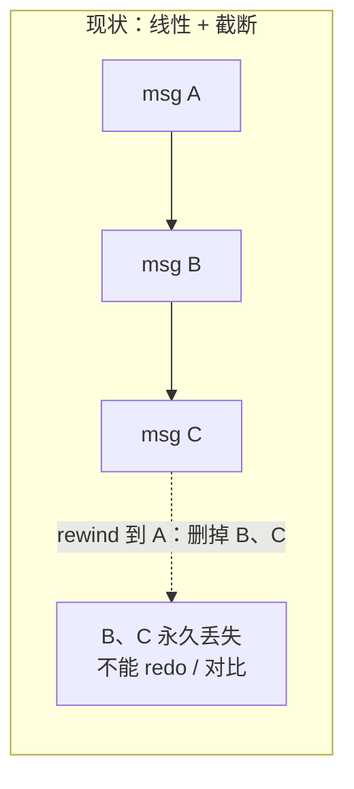
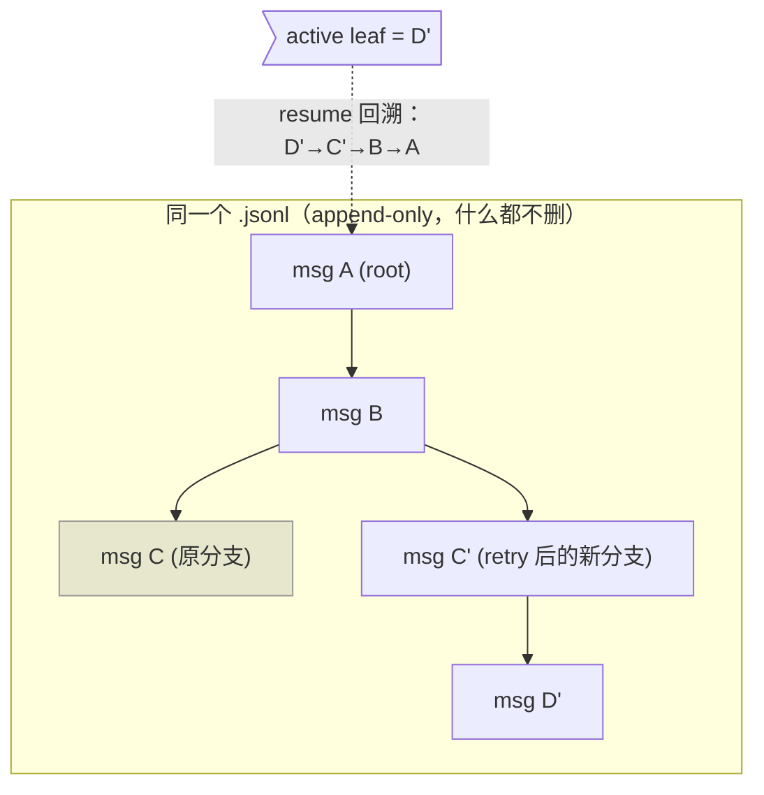
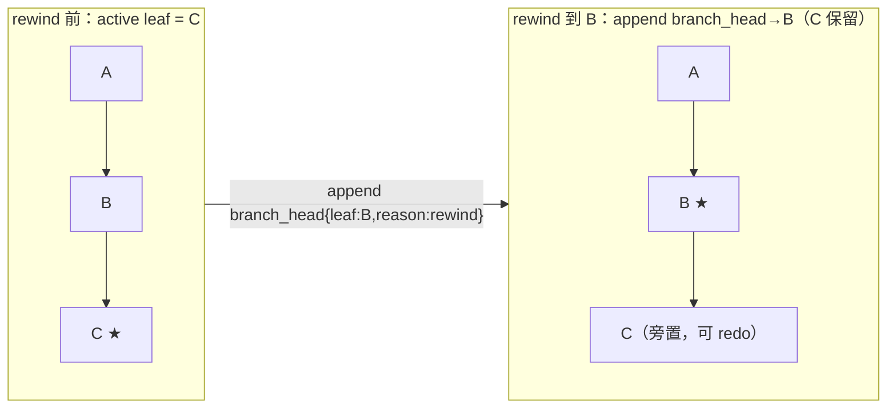
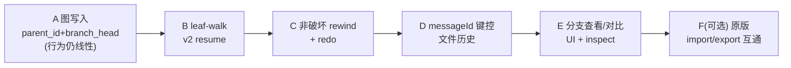

# P2 详细方案：v2 消息图 + 非破坏性 rewind

> 状态：**已实现**（阶段 A–F 全部落地，`go test ./...` 全绿）。本文既是设计规格，也是实现依据；下方"实施状态"小节记录落点。
> 早期状态：Draft（按需触发）——保留原文供追溯。

## 实施状态（A–F 已完成）

| 阶段 | 内容 | 主要落点 |
|---|---|---|
| A | 图写入：`schema`/`parent_id`/`branch_head`、session_meta 首行、Recorder v2 模式、feature flag `transcript_v2`（默认关） | [graph.go](../../internal/session/graph.go)（`CurrentChain`/`ActiveLeaf`/`ChainToLeaf`/`Leaves`）、[store.go](../../internal/session/store.go)（Entry 字段、`appendV2`/`MarkTurn`/`writeSessionMeta`/`OpenRecorder`）、[query.go](../../internal/query/query.go)（每 turn `MarkTurn`）、[cli.go](../../internal/cli/cli.go)（flag 读取） |
| B | leaf-walk resume：`ValidateResumeFormat` 放开 v2；resume 从当前链构建 messages；`--resume-at` 用 `ChainToLeaf` | [transcript_format.go](../../internal/session/transcript_format.go)、[cmd_session.go](../../internal/cli/cmd_session.go) `loadResumeEntries`、[query.go](../../internal/query/query.go) sanitize 跳过 v2 控制行、[agent.go](../../internal/tools/agent/agent.go) |
| C | 非破坏性 rewind + redo + branch list：`RewindConversationToMessage` v2 改 append `branch_head`；`Redo`/`Branches` | [store.go](../../internal/session/store.go) `rewindConversationV2`/`Redo`/`Branches`；CLI `session branches`/`session redo`、`/rewind` 提示 |
| D | messageId 键控文件历史：`file_change` 记 `message_id`；rewind 文件还原＝两链节点差集；`GCFileHistory` 窗口按当前链 turn；tombstone 复用 | [tool.go](../../internal/tools/tool.go)、[query.go](../../internal/query/query.go) `recordFileChange`、[store.go](../../internal/session/store.go) `collectWindowedReferences` |
| E | 分支查看/对比：`BranchInfo.ForkPoint`、`CompareBranches`；CLI `session branches [--compare A B]` | [store.go](../../internal/session/store.go)、[graph.go](../../internal/session/graph.go) `commonPrefixLen`、[cmd_session.go](../../internal/cli/cmd_session.go) |
| F | 原版 CC import 互通：`ImportClaudeCode`（只读、best-effort 主链→v2 新会话、report 跳过项） | [import_claude_code.go](../../internal/session/import_claude_code.go)、[cmd_transcript.go](../../internal/cli/cmd_transcript.go) `transcript import-claude-code` |

> 关键取舍记录：per-turn `branch_head` 锚定在**该 turn 的用户消息**（作为 rewind 锚点），active leaf 由"文件序回放 branch_head + 链增长"解析（非"最后一条 branch_head"简单规则），以在线性增长与分支/redo 下都正确。v2 写入默认关（feature flag `transcript_v2`），resume 按磁盘既有 schema 续写，绝不与 v1 混写。


> 定位：[transcript_checkpoint_optimization_plan.md](transcript_checkpoint_optimization_plan.md) 中 **P2-6** 的展开。
> 依赖：v2 entry 的**字段格式**已在 [transcript_schema_isolation_and_resume_plan.md](transcript_schema_isolation_and_resume_plan.md) 定义（`session_meta`/`message`/`tool_call`/`tool_result`/`subagent_*`/`parent_id` 等）；本文**不重复字段定义**，只补它没展开的两件事：**消息图语义**与**非破坏性 rewind**。
> 前置成果：P0/P1 已落地——文件正文外置到内容寻址 blob store、按 sha256 分片、turn 级去重、文件历史独立生命周期（`Store.GCFileHistory`）。本文说明消息图如何与这些既有能力衔接。

---

## 0. 一句话说清 P2 要干嘛

> 把 transcript 从**一条直线**升级成**一棵树**：一个会话里可以有多条分支（retry、改了重发、并行试验），rewind 不再"删掉后面的行"，而是"把当前指针挪到某个历史节点"——**旧分支不删、可 redo、可对比**。

---

## 1. 术语表（先读这一节）

| 术语 | 一句话解释 | 与本项目的关系 |
|---|---|---|
| **线性事件流（linear log）** | transcript 现状：一行一个事件，**顺序 = append 顺序**，"当前对话"就是整个文件从头到尾。 | 现状模型 |
| **消息图 / message graph** | 每条消息带自己的 `id` 和"父消息" `parent_id`，消息连成一棵**树**。"当前对话"是从某个末端回溯到根的一条**路径**，不再等于文件全部内容。 | P2 目标模型 |
| **DAG** | 有向无环图。消息图本质是一棵树（树是 DAG 的特例）：每个节点最多一个父，可有多个子。 | 数据结构 |
| **node（节点）** | 图里的一条消息（user / assistant / tool 回合）。 | = 一条 `message` entry |
| **parent_id / parentUuid** | 指向父节点的 id。根节点没有父。**原版 Claude Code 用 `parentUuid`**，本项目 v2 用 `parent_id`。 | 连边 |
| **branch（分支）** | 从同一个父节点长出的**两条及以上**子路径。retry / 改了重发就会产生分支。 | 图的分叉 |
| **leaf（叶子）** | 一条分支的**最末端**节点（没有子）。一棵树可以有多个 leaf（多条分支各一个末端）。 | 关键概念 |
| **active leaf / branch head（当前叶）** | 被标记为"当前对话末端"的那个 leaf。**它决定 resume 时回放哪条路径。** | P2 的核心状态 |
| **leaf 回溯（leaf-walk）** | 从 active leaf 出发，沿 `parent_id` 一路走到根，得到"当前有效对话链"。 | v2 resume 的核心算法 |
| **turn（轮次）** | 一"轮"交互：一条用户消息到模型把它处理完。线性模型里 turn 边界 = `auto-<messageID>` checkpoint。 | 图模型里 turn ≈ 一个 user 节点及其子树中的当前路径段 |
| **rewind（回退）** | 回到某个历史点的状态。**现状是破坏性截断；P2 改为非破坏性移动指针。** | 本文重点 |
| **非破坏性 rewind（non-destructive rewind）** | 回退时**不删任何历史**，只把 active leaf 指到更早的节点；被放弃的分支仍在文件里。 | P2 目标 |
| **redo（重做）** | 非破坏性 rewind 之后，把 active leaf 再挪回原来那条分支——因为它没被删。 | 破坏性截断做不到的能力 |
| **sidechain（旁链）** | 主对话之外的支线，典型是 sub-agent（Task）的独立过程。 | v2 里以 `subagent_*` + 独立子 transcript 表达 |
| **fork（分叉会话）** | 把某点之前的内容**复制成另一个会话文件**，各走各的。现状已实现。 | 与"同文件内分支"是两种不同粒度 |
| **blob store（内容仓库）** | 存文件正文副本的目录，按 sha256 内容寻址、去重。P0/P1 已实现。 | 文件历史落在这里 |
| **messageId 键控文件历史** | 文件快照按"哪条消息改的"来索引（原版 Claude Code 的 `messageId → file backup`），而不是按线性 turn。 | 图模型下文件历史的正确键 |
| **tombstone（墓碑）** | 一个"这里的东西已被回收"的占位标记，命中时给清晰错误而非崩溃。 | 已用于 P1-5 文件历史过期 |

---

## 2. 现状（为什么需要 P2，以代码为准）

### 2.1 线性模型 + 破坏性 rewind

- transcript 是线性 JSONL，事件顺序 = append 顺序（[store.go](../../internal/session/store.go) `Recorder.Append`）。`Entry` 有 `id`，但**没有 `parent_id`**，"当前对话"隐含为"整个文件"。
- conversation rewind 靠**物理截断重写**：`writeEntries` 用 `O_TRUNC` 重写文件，把回退点之后的行**删掉**（[store.go](../../internal/session/store.go) `rewindFiles` → `writeEntries`）。
- resume 是**线性回放**：`MessagesFromTranscript` 从头到尾把 entry 转成消息（[query.go](../../internal/query/query.go) `MessagesFromTranscriptWithReport`）；`ThroughEntry` 支持"截取到某条 entry"的只读切片（[store.go](../../internal/session/store.go) `ThroughEntry`）。
- 分叉只能靠 `fork`：把前缀**复制成新会话文件**（[store.go](../../internal/session/store.go) `Fork`）。

### 2.2 线性模型的三个硬伤



1. **无法表达分支**：同一条消息想 retry、或改了重发试另一条路，线性流没法同时保留两条。
2. **rewind 破坏性**：截断即删除，被放弃的分支**回不来**，不能 redo、不能"两条走法对比"。
3. **turn 边界脆弱**：文件历史、rewind 都依赖"checkpoint 之后的行"这一线性假设；一旦引入分支，这个假设不成立。

> 现状缓解：`fork` 覆盖了"想另开一支试试"的大部分需求，代价是产生**另一个会话文件**（粒度粗、上下文要重新接）。**"同一个会话内的轻量分支 + 非破坏回退"是 fork 补不上的空档**——这正是 P2 的价值。

---

## 3. 目标与非目标

### 目标
1. transcript 升级为**消息图**：每条 `message` 带 `id` + `parent_id`，能表达 retry、改了重发、多 leaf。
2. 会话维护一个 **active leaf 指针**，resume 时以 leaf 回溯得到当前对话链。
3. **rewind 改为非破坏性**：只移动 active leaf，不删历史；支持 **redo**。
4. 文件历史从"线性 turn 键控"升级为 **messageId 键控**，与图模型对齐，并复用现有 blob store / `GCFileHistory`。
5. v1 线性 transcript 继续可读、可 resume；v2 与 v1 **共存**，可迁移。
6. 保持 P0/P1 的安全与瘦身成果（正文外置、分片、去重、生命周期）。

### 非目标
- **不追求**与原版 Claude Code transcript 字节级兼容（互通走显式 import/export，见 schema 文档）。
- **不删除** `fork`：fork（跨会话文件分叉）与图内分支（同文件多 leaf）是两种粒度，并存。
- **本文不含实现代码**：这是触发后执行的方案。

---

## 4. 数据模型：把"树"塞进 append-only 文件

### 4.1 核心思想

transcript **仍是 append-only 的 JSONL**（永不重写），但语义从"文件即对话"变成"文件是一堆节点 + 一个当前指针"：



- 物理上 A、B、C、C'、D' **都在文件里**（C 是被放弃的旧分支，但没删）。
- 逻辑上"当前对话" = 从 active leaf `D'` 沿 `parent_id` 回溯：`D' → C' → B → A`。C 不在这条路径上，resume 时**自动忽略**，但仍可被"分支列表/对比"读到。

### 4.2 新增/变更的 entry

沿用 [schema 文档](transcript_schema_isolation_and_resume_plan.md) 的 v2 字段，本文只强调 P2 相关点：

- `message` entry：必须有 `id`（uuid）与 `parent_id`（根为空）。同一 `parent_id` 出现**多个子** = 一个分支点。
- 新增 `branch_head` 事件（append-only 地记录"当前叶"移动）：
  ```json
  {"type":"branch_head","id":"...","leaf_id":"msg_D_prime","reason":"rewind|redo|new_turn","timestamp":"..."}
  ```
  active leaf = **最后一条** `branch_head` 指向的节点（append-only 下"最后写的赢"）。首次无 `branch_head` 时，active leaf = 文件中最后一条在当前链上的 message（向后兼容 v1）。
- `tool_call` / `tool_result`：继续用 `assistant_message_id` + `tool_use_id` 绑定到其 assistant 节点（并行工具的相邻性约束见 schema 文档），随所属 message 节点一起进/出当前链。

> 关键不变量：**文件只增不改**。rewind/redo/新 turn 都只是**再 append 一条 `branch_head`**，历史节点永远保留。

### 4.3 物理行序 ≠ 逻辑对话序

这是与线性模型最大的心智差异，必须在实现里贯彻：

- **不能**再假设"文件顺序就是对话顺序"。
- resume、compact、inspect、rewind 都必须**先由 active leaf 回溯出当前链**，再在链上操作。
- 现有依赖"线性切片"的逻辑（`ThroughEntry`、`parseFileChanges` 的"截断后区间"、`MessagesFromTranscript` 的顺序遍历）都需要图感知版本（见第 7 节阶段划分）。

---

## 5. 非破坏性 rewind / redo

### 5.1 语义



- **rewind 到某消息 M**：append 一条 `branch_head{leaf_id: M, reason: "rewind"}`。当前链立刻变成"回溯自 M"。C 及其子树仍在文件里。
- **在 M 之后继续对话**：新消息的 `parent_id = M`，于是从 M 长出**新分支**，与旧的 C 分支并列。
- **redo**：append `branch_head{leaf_id: C, reason: "redo"}`，指回旧分支——因为它从没被删。
- **分支对比**：任意两个 leaf 各自回溯成两条链，交给 diff/inspect 对比。

### 5.2 与文件历史（P0/P1）的衔接 —— 最关键的集成点

现状 P0/P1 的文件历史是**线性 turn 键控**：rewind 靠"checkpoint 之后的 `file_change` 区间"计算要还原什么（`parseFileChanges` 取每 path 最早 before）。**图模型下这个"区间"不成立**（分支后行序错乱）。因此：

- **文件快照改为 messageId 键控**（对齐原版 Claude Code 的 `messageId → file backup`）：每条 `file_change` 记录它属于哪个 `message_id`（产生该改动的 assistant/tool 节点）。
- **rewind 到 M 的文件还原** = 沿"回退前的 active 链"与"回退后的目标链（到 M）"求差，把差集里各 path 的正文还原到"M 所在链上的最新状态"。实现上：以 messageId 为键，在两条链上分别求每个文件的最终 blob，差异者还原。
- blob 仍走 P0 的内容寻址存储与 P1 的 `GCFileHistory`；**保留窗口从"最近 N 个 turn"改为"当前链上最近 N 个 turn"**，非当前链上的旧分支文件历史可更早回收（它们 redo 概率低——可配置是否保留）。
- rewind 命中已被回收的 blob：复用 P1-5 已有的 **tombstone 错误**（"file history reclaimed…"）。

> 一句话：**rewind 的"对话回退"变成非破坏性指针移动；"文件回退"从线性区间差改为两条链的 messageId 差集**，底层 blob store 与 GC 不变。

### 5.3 与 checkpoint / fork 的关系

- `auto-<messageID>` checkpoint 仍在每个 user 节点前打，作为"人类可读的锚点 + 文件历史窗口计数"，但**rewind 不再依赖它做截断**——依赖的是 `parent_id` + `branch_head`。
- `fork` 保持不变（跨会话文件复制）。图内分支是更轻的"同会话 retry/对比"，两者定位不同、并存。

---

## 6. Resume：v2 leaf-walk parser

在现有线性 parser（[query.go](../../internal/query/query.go) `MessagesFromTranscriptWithReport`）之外，新增 v2 图感知路径：

1. 读 `session_meta`，确认 `schema=golang-cc.transcript.v2`。
2. 解析所有 `message` 节点建 id→node、parent 关系；解析所有 `branch_head`，取最后一条得 active leaf（无则回退到"当前链最后一条 message"）。
3. **leaf-walk**：从 active leaf 沿 `parent_id` 回溯到根，得到当前链（有序节点列表）。
4. 按 schema 文档规则，把链上节点转成 Anthropic `messages`：合并同一 assistant message 的并行 tool_result 到相邻 user message、修复 dangling tool_use、丢弃 orphan、`compact_summary` 重置上下文（这些**沿用现有 sanitize 逻辑**，只是输入从"整文件"换成"当前链"）。
5. `subagent_*`、`file_change`、`checkpoint`、`branch_head` 等非模型上下文事件不进 messages（与现状一致）。

> v1 transcript 走**原线性 parser 不变**；v2 走 leaf-walk。`ValidateResumeFormat` 放开 v2（现状是明确拒绝 v2）。

---

## 7. 实施阶段与验收（触发后执行）

分 6 个阶段，**每阶段可独立交付、可回退**，前 3 阶段就能拿到"非破坏 rewind"的主要价值。



- **阶段 A：图写入（dual-write）**
  改动：`message` 写 `id` + `parent_id`（parent = 当前 active leaf）；每个新 turn append `branch_head`。行为仍等价线性（每次都从最后一个 leaf 长）。
  验收：新 v2 transcript 每条 message 有合法 `parent_id`，`branch_head` 链连续；v1 读取不受影响；`go test ./internal/session ./internal/query`。

- **阶段 B：v2 leaf-walk resume parser**
  改动：新增 v2 图 parser；`ValidateResumeFormat` 放开 v2；resume 从当前链构建 messages。
  验收：多轮工具调用能恢复；并行 tool_use/result 顺序正确；malformed 不致 API 400；v1 resume 回归不变。

- **阶段 C：非破坏性 rewind + redo**
  改动：`RewindConversationToMessage` 的 v2 实现改为 **append `branch_head`**（不再 `O_TRUNC`）；新增 redo（append 指回旧 leaf）；新增 `branch list`。
  验收：rewind 后旧分支仍在文件；从回退点继续对话产生并列新分支；redo 能切回；文件字节只增不减。

- **阶段 D：messageId 键控文件历史**
  改动：`file_change` 记 `message_id`；rewind 文件还原改为"两条链 messageId 差集"；`GCFileHistory` 窗口按当前链 turn 计数；复用 blob store + tombstone。
  验收：图内 rewind 能正确还原文件到目标链状态；旧分支文件历史可回收；rewind 命中回收 blob 报清晰错误；P0/P1 既有文件测试全绿。

- **阶段 E：分支查看 / 对比**
  改动：`session branches <id>`（列出所有 leaf 及其链摘要）；inspect/Trace Viewer 展示分支树；两 leaf 对比。
  验收：能列出并定位每条分支；对比输出两条链差异。

- **阶段 F（可选）：原版 Claude Code import/export 互通**
  改动：v2 图 ↔ 原版 `uuid/parentUuid` 主链的 best-effort 转换（承接 schema 文档的 import 计划）。
  验收：import 不改原文件、生成 v2 新会话；unsupported 结构有清晰 report。

---

## 8. 兼容、迁移与回滚

- **共存**：v1 线性与 v2 图**同目录共存**，靠 `session_meta.schema` + schema detection 区分（[transcript_format.go](../../internal/session/transcript_format.go)）。
- **迁移**：v1 → v2 = 把线性序列串成"每条 parent = 前一条"的单链（一条不分叉的树），写入新 v2 文件，旧文件只读不动（承接 schema 文档的迁移策略）。
- **回滚**：v2 是新写入格式；即使回滚代码，v1 文件不受影响，v2 文件因 append-only 且历史完整，可被旧线性 parser **降级读取**（读文件顺序，忽略 `parent_id`/`branch_head`）——降级后失去分支语义但不丢数据。
- **默认开关**：**v2 已默认开启**（新会话默认写 v2）；opt-out 走 `GOLANG_CLAUDE_CODE_FEATURE_TRANSCRIPT_V2=0` 或 `featureFlags:{transcript_v2:false}`（`config.FeatureEnabledDefault(..., true)`）。翻默认前做了"对话读路径统一走 `LoadConversation`（当前链）+ 所有写路径 v2-tag/on-chain"的收口：schema 检测放宽为 v1/v2 同族归 v2（杜绝 auxiliary 追加行把 v2 文件判成 mixed）；`compact_summary` 经 live recorder 追加以推进 active leaf；recap 为会话级 UI 制品，打 v2 tag 但不入链，其查找走整文件。

---

## 9. 风险与权衡

| 风险 | 说明 | 缓解 |
|---|---|---|
| 行序≠对话序的心智负担 | 所有消费方都要先 leaf-walk | 提供统一 `CurrentChain(entries)` 工具函数，禁止直接遍历文件当对话 |
| 文件历史键从 turn 改 messageId | 影响 P0/P1 已落地逻辑 | 阶段 D 单独交付；保留线性实现作 v1 路径；两套按 schema 分流 |
| 分支膨胀 | 大量被放弃分支占空间 | 旧分支的文件历史可更早回收（`GCFileHistory` 按当前链窗口）；transcript 文本本身小（正文已外置） |
| 复杂度 vs 收益 | 图模型比线性复杂得多 | **按需触发**：没有真实分支/互通/可撤销需求就不启动 |
| 与 fork 概念混淆 | 用户分不清图内分支 vs fork | 文档与 UI 明确区分：分支=同会话轻量 retry，fork=另开会话 |

---

## 10. 触发条件（何时才真正启动 P2）

满足**任一**即建议启动（否则维持现状 + fork）：

1. 出现真实的"**同会话内 retry 并保留旧分支对比**"需求。
2. 需要与原版 Claude Code transcript 做 **import/export 级互通**。
3. **非破坏性回退（可 redo）**成为用户明确诉求。

在触发之前，本文保持 Draft；P0/P1 已交付的安全与瘦身成果不依赖 P2。

---

## 附录 A：与既有能力的关系一览

| 既有能力 | 现状 | P2 后 |
|---|---|---|
| transcript 结构 | 线性 JSONL | 消息图（append-only，+parent_id/branch_head） |
| conversation rewind | 破坏性截断 `O_TRUNC` | 非破坏性移动 active leaf，可 redo |
| resume | 线性回放 | leaf-walk 回溯当前链后回放 |
| 文件历史键 | 线性 turn / checkpoint 区间 | messageId 键控，两链差集还原 |
| blob store（P0） | 内容寻址 + 分片 + 去重 | **不变**，继续承载正文 |
| turn 去重（P1-4） | 线性 turn 内去重 | 迁移为"当前链 turn"内去重 |
| 文件历史生命周期（P1-5） | 最近 N 个 turn | 最近 N 个"当前链 turn"，旧分支更早回收 |
| fork | 跨会话文件复制 | **不变**，与图内分支并存 |

## 附录 B：关键代码锚点（改动落点）

| 关注点 | 位置 |
|---|---|
| Entry 结构（加 parent_id/branch_head 相关） | [internal/session/store.go](../../internal/session/store.go) |
| 破坏性截断（改非破坏） | [internal/session/store.go](../../internal/session/store.go) `writeEntries` / `rewindFiles` |
| 线性 resume（加 leaf-walk 分支） | [internal/query/query.go](../../internal/query/query.go) `MessagesFromTranscriptWithReport` |
| resume 格式守门（放开 v2） | [internal/session/transcript_format.go](../../internal/session/transcript_format.go) `ValidateResumeFormat` |
| 文件历史区间计算（改 messageId 差集） | [internal/session/store.go](../../internal/session/store.go) `parseFileChanges` |
| 文件历史生命周期（窗口改当前链） | [internal/session/store.go](../../internal/session/store.go) `GCFileHistory` / `turnWindowStart` |
| v2 entry 字段定义（引用） | [transcript_schema_isolation_and_resume_plan.md](transcript_schema_isolation_and_resume_plan.md) |
